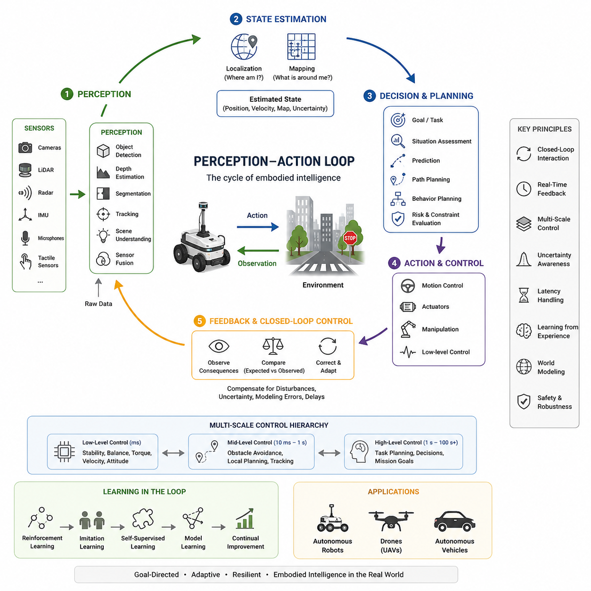
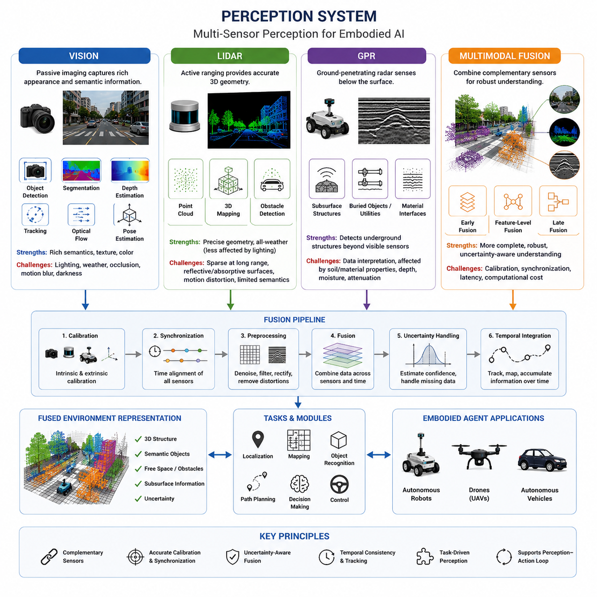
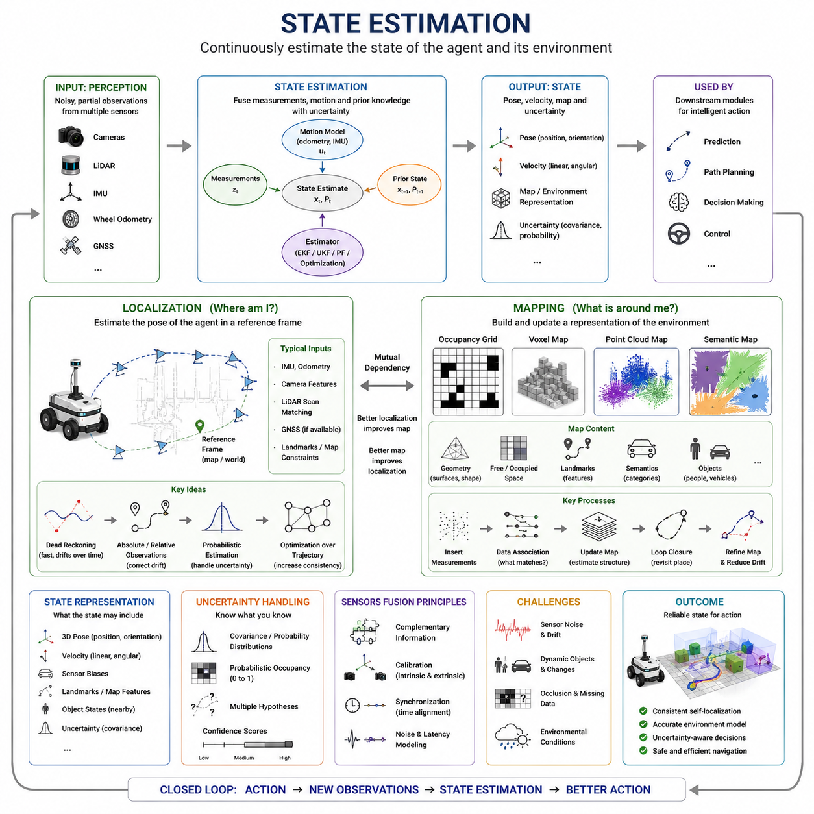
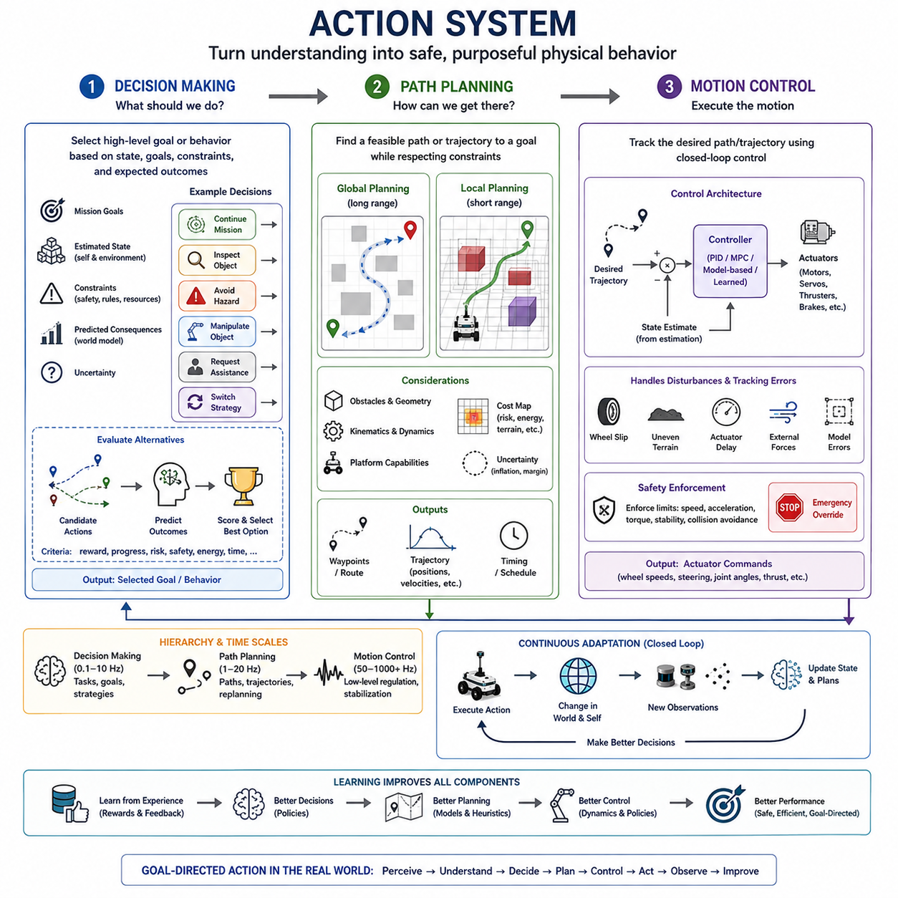
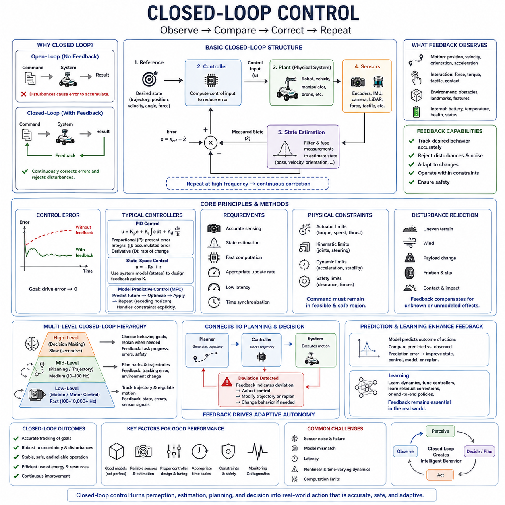
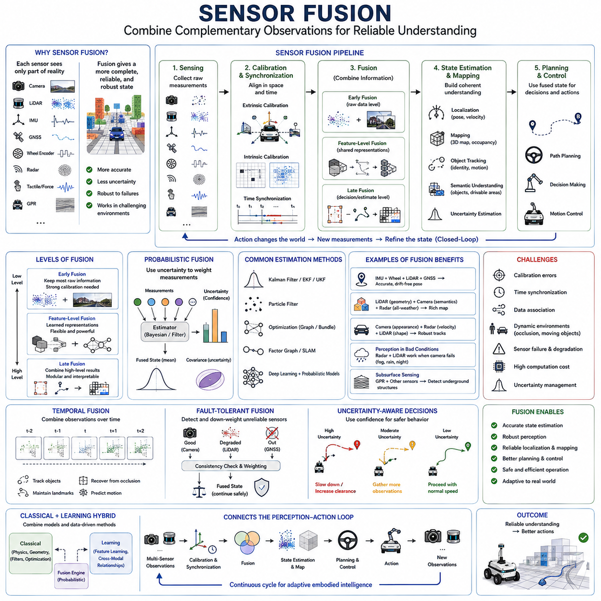
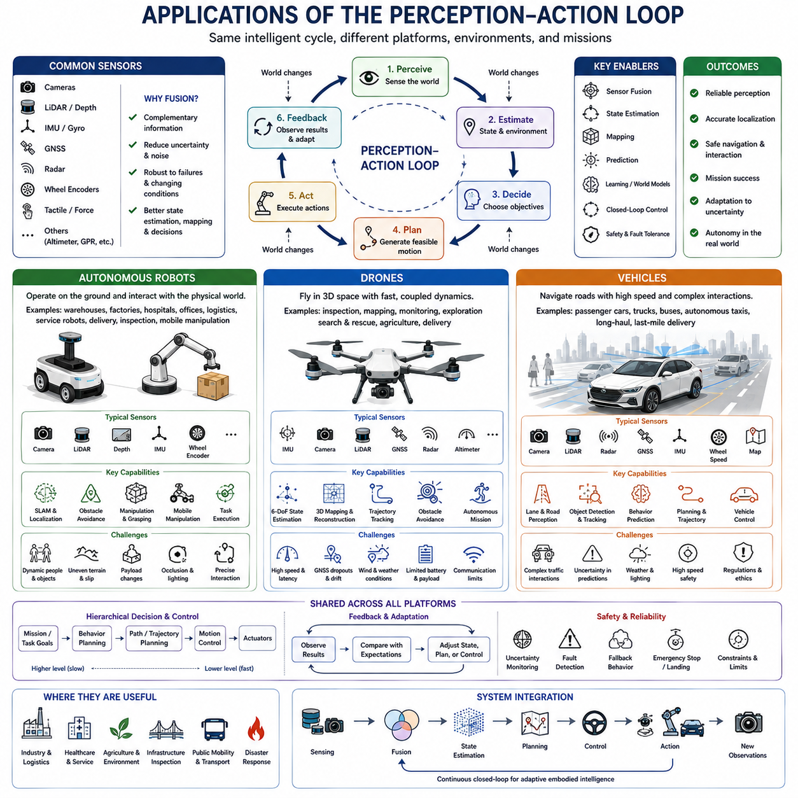

**Volume 45. Embodied AI and World Models**

# Chapter 01. Perception Action Loop

## 01.00. Overview

{width="7.268055555555556in" height="7.268055555555556in"}

Embodied intelligence emerges from continuous interaction between an agent and its environment rather than from isolated computation. The perception-action loop describes this interaction as a recurring process in which sensory observations are transformed into internal representations, decisions, and physical actions, while the consequences of those actions generate the next observations. This closed relationship makes perception and action mutually dependent components of intelligent behavior.

Unlike conventional AI systems that may process static datasets and return predictions without changing their inputs, embodied agents operate inside environments that respond to their behavior. A mobile robot that turns, accelerates, manipulates an object, or changes its viewpoint actively modifies what its sensors will observe next. Intelligence therefore becomes a dynamic process of sensing, interpreting, acting, observing consequences, and continuously correcting behavior.

The loop begins with perception, where raw signals from cameras, LiDAR, ground-penetrating radar, inertial sensors, microphones, tactile sensors, or other modalities are converted into meaningful information. Perception may identify objects, estimate depth, detect obstacles, recognize terrain, measure motion, or infer relationships among entities. Multimodal fusion combines complementary observations so that weaknesses in one sensing modality can be compensated by information from others.

Raw perception alone is insufficient because an intelligent agent must determine its current condition relative to the surrounding world. State estimation integrates present sensor measurements with previous observations and motion information to estimate quantities such as position, orientation, velocity, environmental structure, and uncertainty. Localization determines where the agent is, while mapping represents relevant properties of the environment, together creating a continuously updated operational context for action.

The estimated state provides the basis for decision making and planning. An agent evaluates its goals, current situation, environmental constraints, predicted risks, and possible actions before selecting an appropriate behavior. Path planning can determine a feasible route through space, while higher-level decision mechanisms determine what objective should be pursued. These processes transform perceptual understanding into intentions that can eventually be executed through physical control.

The action system converts selected intentions into commands for motors, actuators, steering systems, manipulators, propulsion mechanisms, or other physical interfaces. Motion control determines how desired trajectories or configurations are achieved under real-world dynamics. Because actuators have limits and environments contain disturbances, uncertainty, friction, delay, and unexpected interactions, commanded actions rarely produce perfectly predictable results. Action must therefore remain connected to subsequent perception.

This dependency creates closed-loop control. Instead of executing a command and assuming that the expected result occurred, the agent observes the consequences and compares them with the desired state. Differences between expected and observed outcomes become feedback that can modify subsequent control commands. Repeated feedback allows the system to compensate for disturbances, modeling errors, changing surfaces, external forces, and other deviations that would accumulate dangerously in an open-loop system.

The perception-action loop operates across multiple spatial and temporal scales. Fast control loops may regulate wheel velocity, joint torque, balance, or attitude within milliseconds, while slower loops perform object recognition, localization, path planning, and behavioral decisions. Still higher levels may reason about tasks, goals, and long-term consequences. Effective embodied systems coordinate these layers so that rapid reactions and deliberative behavior remain consistent with the same evolving environmental state.

Time is particularly important because sensing, inference, communication, planning, and actuation introduce latency. An observation represents the world at the moment it was measured, but the physical system may have moved by the time a decision based on that observation reaches an actuator. Robust embodied systems therefore require synchronization, temporal state estimation, motion prediction, and latency-aware control so that actions correspond to the world that exists when they are executed rather than to an outdated observation.

Uncertainty is another fundamental property of the loop. Sensors contain noise, perception models make errors, objects may be occluded, maps can become outdated, and physical dynamics cannot always be modeled exactly. An embodied agent should therefore represent not only what it believes about the environment but also how confident it is in those beliefs. Sensor fusion, probabilistic estimation, predictive modeling, and uncertainty-aware planning allow behavior to become more conservative when information is incomplete or contradictory.

Learning extends the loop beyond immediate feedback. Every interaction can produce information about how the environment responds to actions, allowing an agent to improve perception, dynamics estimation, decision policies, or control strategies. Reinforcement learning can associate actions with delayed outcomes, imitation learning can reproduce successful behavior from demonstrations, and self-supervised learning can exploit the temporal structure of sensor streams without requiring exhaustive manual labels.

The perception-action loop also provides a natural bridge toward world models. A purely reactive agent maps current observations directly to actions, whereas a more capable agent can maintain an internal representation of how the world evolves. By predicting possible future states under alternative actions, the system can evaluate consequences before physically executing them. Perception then updates the internal model, the model supports prediction and planning, and real observations correct prediction errors after action.

This architecture is applicable across autonomous robots, drones, and vehicles, which are explicitly identified as major application areas within the chapter structure. Although their sensors, dynamics, operating environments, and safety constraints differ, they share the same fundamental cycle: observe the world, estimate state, determine an action, execute it, measure the consequences, and adapt the next action. The perception-action loop therefore forms a common systems abstraction across diverse embodied platforms.

In autonomous robots, the loop enables navigation and manipulation in environments that cannot be completely specified in advance. In drones, perception and state estimation interact with rapid attitude and trajectory control while the platform continuously moves through three-dimensional space. Autonomous vehicles similarly combine environmental sensing, localization, prediction, planning, and vehicle control while responding to roads, traffic participants, infrastructure, weather, and changing operational conditions.

As embodied AI becomes more capable, the loop increasingly integrates learned perception, multimodal representations, predictive world models, foundation models, and adaptive decision systems. Nevertheless, these advanced components do not eliminate the fundamental feedback structure. Their value depends on whether they improve the agent\'s ability to perceive relevant changes, maintain an accurate state, anticipate consequences, select appropriate actions, and recover when predictions disagree with reality.

The perception-action loop should therefore be understood not simply as a sequence of software modules but as the organizing principle of embodied intelligence. Perception gives meaning to environmental interaction, state estimation provides continuity, planning connects present conditions to future goals, action changes the physical world, and feedback closes the cycle. Through continuous repetition, an embodied system becomes capable of adaptive, goal-directed behavior grounded in real-world consequences.

## 01.01. Perception System

{width="7.268055555555556in" height="7.268055555555556in"}

A perception system is the primary interface between an embodied agent and the physical world. It converts continuous streams of sensory measurements into structured information that can support state estimation, planning, control, and learning. In embodied AI, perception is not an isolated recognition task; it operates continuously while the agent moves, changes viewpoint, interacts with objects, and modifies the environment through its own actions.

The design of a perception system depends on combining sensors with complementary physical properties. Cameras capture rich appearance, texture, color, and semantic information, while LiDAR directly measures geometric structure through active ranging. Ground-penetrating radar, or GPR, extends perception below visible surfaces, and multimodal fusion integrates these heterogeneous observations into a more complete representation of the surrounding environment.

Vision provides one of the richest sensing channels available to embodied agents because images contain information about objects, surfaces, motion, spatial relationships, and contextual meaning. Modern vision systems can perform object detection, semantic and instance segmentation, tracking, depth estimation, optical flow, pose estimation, and scene understanding. These capabilities allow an agent to interpret not only what is present but also how relevant entities are positioned and changing over time.

Visual perception can rely on monocular cameras, stereo configurations, panoramic systems, event cameras, or multiple synchronized viewpoints. Monocular vision offers inexpensive and information-rich observations but provides indirect geometric information. Stereo and multi-camera configurations improve depth reasoning through viewpoint differences, while temporal sequences allow motion and structure to be estimated from changes across consecutive frames as an embodied platform moves.

Vision is highly informative but sensitive to environmental conditions. Illumination changes, shadows, glare, darkness, fog, rain, motion blur, occlusion, and unfamiliar visual appearances can degrade performance. For this reason, robust embodied perception rarely treats vision as an infallible source. Confidence estimation, temporal consistency, redundancy, and fusion with active ranging sensors help prevent visual uncertainty from propagating directly into navigation and control decisions.

LiDAR, or Light Detection and Ranging, actively emits laser energy and estimates distances from the returned signals. By repeatedly sampling surrounding surfaces, a LiDAR sensor produces geometric measurements that can be represented as point clouds, range images, occupancy structures, or three-dimensional maps. Unlike passive cameras, LiDAR provides explicit distance information and therefore plays an important role in obstacle detection, localization, mapping, and geometric scene reconstruction.

Different LiDAR configurations offer different compromises among range, resolution, field of view, update frequency, size, power consumption, and cost. Two-dimensional LiDAR is widely used for planar navigation and localization, whereas three-dimensional LiDAR captures the vertical structure of complex environments. Moving embodied platforms can accumulate successive scans over time, producing detailed representations when sensor motion and pose are accurately estimated.

LiDAR also has limitations that must be considered within the perception architecture. Sparse measurements at long range, reflective or absorptive materials, adverse weather, multipath effects, and motion distortion can reduce reliability. Raw point clouds additionally contain little direct semantic meaning. Consequently, learned point-cloud processing and fusion with camera information are often used to connect LiDAR geometry with object identity, scene context, and task-level interpretation.

Ground-penetrating radar introduces a different form of environmental perception because it can sense structures that are hidden beneath surfaces. GPR transmits electromagnetic waves into materials and analyzes reflected signals caused by changes in subsurface electromagnetic properties. Depending on operating conditions, it can support the detection of buried objects, underground utilities, material interfaces, cavities, or other subsurface structures that are unavailable to conventional vision and LiDAR.

GPR measurements are fundamentally different from ordinary camera images or LiDAR point clouds. Their interpretation depends on antenna characteristics, operating frequency, propagation velocity, soil or material properties, depth, moisture, clutter, and signal attenuation. Measurements frequently require signal processing and spatial registration before useful structures become apparent. Embodied systems using GPR must therefore connect sensor interpretation with accurate platform localization and motion information.

The inclusion of GPR demonstrates an important principle of embodied perception: relevant reality is not restricted to directly visible surfaces. An autonomous inspection or exploration platform may need to reason simultaneously about observable obstacles and concealed structures. Vision may classify visible surroundings, LiDAR may provide precise surface geometry, and GPR may reveal subsurface information, allowing the agent to construct a representation that extends beyond conventional visual scene understanding.

Multimodal fusion combines measurements from different sensing modalities so that their complementary strengths can produce a more reliable environmental representation. Fusion may occur near the sensor level, within learned feature representations, or after individual perception modules generate higher-level estimates. The appropriate fusion strategy depends on synchronization accuracy, sensor calibration, computational resources, environmental conditions, and the requirements of downstream planning and control.

Early fusion attempts to combine relatively low-level measurements before substantial independent interpretation occurs. This approach can preserve detailed cross-modal relationships but requires careful spatial and temporal alignment. Intermediate or feature-level fusion allows neural representations extracted from different sensors to interact during inference. Late fusion instead combines independently generated detections, tracks, maps, or confidence estimates and may provide stronger modularity and easier fault isolation.

Effective fusion requires more than concatenating sensor data. Each modality observes the world through a different coordinate system, sampling pattern, noise process, latency, and physical mechanism. Extrinsic calibration establishes geometric relationships among sensors, intrinsic calibration characterizes individual sensing devices, and time synchronization ensures that measurements correspond to approximately the same physical state. Errors in any of these foundations can create false associations that degrade the fused representation.

A robust fusion system should also reason about confidence and sensor availability. A camera may become unreliable in darkness while LiDAR continues to provide useful geometry; LiDAR returns may become degraded by environmental effects while vision preserves semantic context. GPR may provide meaningful information only for specific surfaces or operating conditions. Dynamic weighting and uncertainty-aware fusion allow the system to rely more heavily on modalities that are currently trustworthy.

Temporal fusion further extends perception by integrating observations across time. Rather than interpreting each sensor frame independently, an embodied agent can maintain tracks, occupancy estimates, maps, or latent representations that persist between observations. This temporal continuity helps recover information during temporary occlusion, reduce noise, infer motion, and distinguish persistent environmental structure from transient measurements produced by moving objects or sensing artifacts.

The ultimate purpose of the perception system is not to create the most detailed possible description of the environment but to provide information that supports effective action. Navigation requires free-space and obstacle information, manipulation requires object geometry and pose, inspection may require detailed surface or subsurface features, and decision making may require semantic context. Perception should therefore be designed together with the tasks, dynamics, and control requirements of the embodied agent.

Vision, LiDAR, GPR, and multimodal fusion together illustrate how embodied AI can move from isolated sensing toward integrated environmental understanding. Vision contributes semantic richness, LiDAR contributes explicit three-dimensional geometry, GPR extends observation beneath surfaces, and multimodal fusion connects these complementary forms of evidence. Their integration creates a perception foundation capable of supporting localization, mapping, planning, control, and eventually predictive world modeling.

## 01.02. State Estimation

{width="7.268055555555556in" height="7.268055555555556in"}

State estimation provides the continuously updated internal description that allows an embodied agent to determine its condition within a changing physical environment. Perception supplies observations, but those observations are incomplete, noisy, and distributed across time. State estimation integrates sensor measurements, motion information, previous estimates, and uncertainty to infer quantities such as position, orientation, velocity, and environmental structure.

Within the perception-action loop, state estimation forms the bridge between sensing and intelligent action. A robot cannot reliably plan a path, avoid obstacles, manipulate objects, or predict future motion unless it maintains a coherent estimate of itself and its surroundings. Instead of treating every sensor measurement independently, the system combines observations over time so that transient noise and missing information do not immediately destabilize planning and control.

The state of an embodied system may contain much more than Cartesian position. Depending on the platform, it can include three-dimensional pose, linear and angular velocity, acceleration, joint configuration, wheel states, sensor biases, landmarks, nearby object states, and uncertainty associated with each estimate. The exact representation should reflect what downstream planning, prediction, and control modules require rather than attempting to model every physical variable in the environment.

Localization addresses the fundamental question of where the embodied agent is located. It estimates the position and orientation of the platform relative to a reference frame such as a local map, global coordinate system, building, road network, or previously observed environment. Reliable localization enables sensor measurements collected at different moments to be placed into a common spatial context and allows planned trajectories to be related to actual physical motion.

Localization commonly combines complementary motion and environmental observations. Inertial measurements can capture rapid rotational and translational changes, wheel odometry can estimate incremental motion for ground robots, cameras can infer visual motion and recognize landmarks, LiDAR can align geometric structures, and satellite navigation can provide global positioning where signals are available. No single source is universally reliable, making sensor fusion central to practical localization.

Dead reckoning estimates the current pose by integrating incremental motion from a known previous state. It provides rapid and locally consistent updates but inevitably accumulates drift because small measurement errors are repeatedly integrated. Absolute or environment-relative observations are therefore needed to correct this accumulated error. Landmarks, map matching, visual features, LiDAR scan matching, GNSS observations, or other external references can constrain the estimated trajectory and reduce long-term drift.

Probabilistic estimation provides a principled framework for combining uncertain information. Rather than assuming that sensor measurements and motion predictions are exact, an estimator represents uncertainty and updates its belief when new evidence becomes available. Kalman-filter-based approaches are effective for approximately linear Gaussian systems, while extended and unscented variants address nonlinear behavior. Particle filters and optimization-based methods provide alternatives for more complex distributions and estimation structures.

Modern localization frequently uses optimization over a sequence of states rather than updating only the current pose. Factor graphs, pose graphs, bundle adjustment, and sliding-window optimization can connect motion constraints with observations collected across multiple times. By jointly optimizing related states, these methods can improve consistency and allow past estimates to be corrected when new information reveals that earlier trajectory estimates were inaccurate.

Mapping addresses the complementary question of what exists around the agent and how environmental structure should be represented. A map may describe geometric surfaces, free and occupied space, landmarks, traversability, semantic categories, objects, or combinations of these properties. The appropriate map representation depends strongly on the task because a navigation system, manipulation system, inspection robot, and autonomous vehicle require different forms of environmental information.

Metric maps represent environmental geometry using explicit spatial coordinates. Occupancy grids divide space into cells and estimate whether each region is free or occupied, while voxel maps extend this principle into three dimensions. Point-cloud maps preserve detailed geometric measurements, and surface or mesh representations can describe continuous structure. These forms are particularly useful for collision checking, obstacle avoidance, geometric planning, and spatial reconstruction.

Feature-based maps represent selected landmarks rather than densely modeling every observed surface. Visual keypoints, corners, planes, poles, edges, or other stable structures can provide compact references for localization. Semantic maps add higher-level meaning by associating spatial regions with categories such as roads, walls, doors, vehicles, people, or work areas. Combining metric and semantic information allows an agent to reason about both geometry and functional meaning.

Localization and mapping are deeply coupled because each process can improve the other. Accurate localization allows measurements to be inserted into the correct map locations, while a reliable map provides references that improve localization. This dependency leads naturally to simultaneous localization and mapping, or SLAM, in which the system estimates its trajectory while constructing or refining the representation of an initially unknown or partially known environment.

SLAM must address accumulated drift and repeated observations of the same locations. When an agent returns to a previously visited area, loop closure can identify that the current observation corresponds to an earlier location. This creates a long-range constraint capable of correcting accumulated trajectory error and deforming the map into a more globally consistent configuration. Reliable loop closure is therefore critical for long-duration operation over large environments.

Dynamic environments create additional challenges because conventional maps often assume that the world is approximately static. People, vehicles, doors, equipment, vegetation, and other objects can move or change state. A robust mapping system should distinguish persistent structure from temporary observations and may maintain separate representations for static geometry and dynamic entities. Temporal information can further support prediction of how relevant objects are likely to move.

Uncertainty must remain visible throughout both localization and mapping. A single estimated pose or map value can create false confidence if the system ignores measurement ambiguity. Pose covariance, probabilistic occupancy, confidence scores, multiple hypotheses, and learned uncertainty estimates can indicate where knowledge is reliable and where additional observation is required. Planning modules can then account for uncertainty rather than treating the estimated world as perfectly known.

State estimation also depends strongly on calibration, synchronization, and latency management. Measurements from cameras, LiDAR, IMUs, wheel encoders, or other sensors must be expressed in consistent coordinate frames and associated with the correct times. Even accurate sensors can produce incorrect state estimates when timestamps are misaligned or sensor transformations are poorly calibrated, particularly when the platform moves rapidly through the environment.

The resulting state estimate should support the complete perception-action loop rather than exist as an isolated geometric product. Localization provides the agent\'s spatial reference, mapping provides environmental context, and their integration supplies the structured state required by prediction, path planning, decision making, and control. New actions then change the platform pose and sensor viewpoint, generating additional measurements that update localization and mapping in the next cycle.

As embodied AI advances toward predictive world models, state estimation becomes an increasingly important interface between direct observation and internal simulation. Localization and mapping establish what the agent currently believes about itself and its environment, while predictive models estimate how that state may evolve under possible actions. Reliable state estimation therefore provides the grounded spatial and temporal foundation from which an embodied agent can reason about future consequences and act intelligently.

## 01.03. Action System

{width="7.268055555555556in" height="7.268055555555556in"}

The action system converts an embodied agent's internal understanding of the world into purposeful physical behavior. While perception determines what is happening and state estimation determines the agent's current relationship to its environment, the action system determines what should happen next and how it should be executed. Motion control, path planning, and decision making therefore form a tightly connected hierarchy between high-level goals and physical actuation.

Action in embodied AI is fundamentally different from producing a symbolic output or software prediction. A physical command changes the environment and simultaneously changes the agent's future observations. Steering a vehicle, moving a robotic arm, accelerating a mobile robot, or changing a drone's altitude alters position, viewpoint, dynamics, and subsequent sensory measurements. Every action consequently becomes part of the continuing perception-action loop.

Decision making operates at the highest conceptual level of the action system. It determines which behavior, task, or objective should be pursued given the estimated state, mission goals, environmental conditions, constraints, and expected consequences. The decision process may select whether a robot should continue moving, stop, inspect an object, avoid a hazardous region, manipulate an item, request assistance, or switch to an alternative strategy.

Effective decision making requires reasoning about more than the current situation. An intelligent agent should evaluate how different candidate actions could change future states and whether those outcomes contribute to its goals. This introduces prediction into the decision process. A predictive model or world model can estimate possible consequences before execution, allowing the agent to compare alternatives according to expected reward, progress, risk, safety, energy consumption, time, or other task-specific criteria.

Decision making must also account for uncertainty because the estimated state of the world is never perfectly known. An obstacle may be partially observed, an object classification may be uncertain, localization may contain accumulated error, or another agent may behave unpredictably. Robust decisions therefore consider both expected outcomes and confidence in those outcomes, favoring safer or information-gathering behavior when uncertainty becomes operationally significant.

Once an objective or behavior has been selected, path planning determines how the embodied agent can move from its current state toward a desired state. Path planning searches for feasible motion through an environment while respecting obstacles, geometric constraints, platform capabilities, and mission requirements. Depending on the system, the result may be a two-dimensional route, a three-dimensional flight path, a manipulator trajectory, or a sequence of intermediate configurations.

Global planning typically reasons over a relatively large environmental representation and identifies a route toward a distant objective. Local planning operates over a shorter horizon and reacts to nearby obstacles, moving objects, newly observed geometry, and deviations from the global route. Combining both levels allows an agent to maintain strategic progress toward a destination while continuously adapting its movement to conditions that could not have been completely predicted in advance.

A planned path must be physically achievable by the platform. A wheeled robot cannot instantly move sideways unless its drivetrain supports such motion, a vehicle has limits on steering curvature and acceleration, a drone must respect flight dynamics, and a manipulator must obey joint limits and avoid singularities or collisions. Path planning therefore becomes more realistic when it incorporates kinematic and dynamic constraints rather than treating the agent as an unconstrained point moving through space.

Planning also requires an appropriate representation of environmental cost. Some regions may be physically traversable but undesirable because they contain rough terrain, narrow clearance, poor visibility, uncertain localization, high energy demand, or safety risk. A planner can encode these properties in a cost map or related representation and search for trajectories that balance distance against risk, efficiency, robustness, and other operational objectives.

Motion control receives the desired path, trajectory, velocity, pose, or configuration and converts it into commands that the physical platform can execute. Whereas planning determines where or how the system should move at a relatively abstract level, control continuously determines actuator inputs needed to follow that intention. These inputs may include wheel velocities, steering angles, motor torque, joint commands, thrust, braking force, or other platform-specific control signals.

Feedback is essential because planned motion and actual motion are never identical. Wheel slip, uneven terrain, actuator delay, mechanical tolerances, aerodynamic disturbances, payload changes, contact forces, and modeling errors can cause the physical state to deviate from the commanded trajectory. Closed-loop motion control repeatedly compares the desired state with the estimated state and adjusts actuator commands to reduce the resulting tracking error.

Classical feedback methods such as proportional-integral-derivative control can regulate many low-level variables, while state-space control and model-based techniques can coordinate more complex dynamics. Model predictive control extends this principle by repeatedly predicting system behavior over a finite future horizon and optimizing control actions subject to constraints. Learned controllers can additionally capture behaviors that are difficult to express with explicit analytical models.

Motion control generally operates at a faster frequency than path planning or high-level decision making. Motor current and torque may require very rapid regulation, vehicle velocity and attitude may be controlled at an intermediate rate, and planning may update more slowly as the environmental state changes. Decision making can operate over still longer horizons involving tasks and mission objectives. This hierarchy enables fast physical stabilization while preserving deliberate goal-directed behavior.

The boundaries among decision making, path planning, and motion control are not absolute. A local planner may incorporate vehicle dynamics, a predictive controller may perform short-horizon trajectory optimization, and a learned policy may directly map observations or latent states into actions. Nevertheless, separating these functional roles remains useful because it clarifies how goals are progressively transformed into physically executable behavior and where constraints or failures should be handled.

Safety constraints should influence every level of the action system. Decision making can reject hazardous objectives, planning can exclude unsafe regions and maintain appropriate clearance, and motion control can enforce limits on speed, acceleration, torque, stability, or stopping behavior. Independent safety mechanisms may override normal commands when immediate hazards are detected, ensuring that task performance does not take priority over fundamental operational constraints.

The action system must also handle changing conditions during execution. A path that was valid when initially planned may become blocked, the target may move, localization confidence may decrease, or actuator performance may change. Instead of committing permanently to an initial plan, embodied agents repeatedly re-evaluate their state, update relevant predictions, replan when necessary, and modify control commands. Action is therefore a continuous adaptive process rather than a one-time decision.

Learning can improve all three action functions. Reinforcement learning can discover decision policies through interaction and reward, imitation learning can reproduce behaviors demonstrated by skilled operators, and learned planners can exploit patterns acquired from large collections of trajectories. Data-driven control can adapt to complex dynamics, while experience accumulated during operation can help the system recognize situations in which particular actions or strategies are likely to succeed or fail.

Predictive world models provide a deeper connection between perception and action by allowing candidate actions to be evaluated internally before physical execution. Given an estimated current state, the agent can imagine alternative future trajectories and compare their predicted consequences. Decision making selects promising objectives or behaviors, planning determines feasible transitions toward them, and control realizes the selected trajectory while new observations verify whether predicted outcomes actually occurred.

Motion control, path planning, and decision making therefore should not be treated as independent algorithms assembled after perception is complete. They constitute the action side of a closed intelligent system in which estimated state becomes intention, intention becomes planned motion, planned motion becomes actuator commands, and physical consequences generate new observations. Through this repeated cycle, an embodied agent transforms perception into adaptive, safe, and goal-directed interaction with the real world.

## 01.04. Closed Loop Control [w/Code]

{width="7.268055555555556in" height="7.268055555555556in"}

Closed-loop control is the mechanism that allows an embodied system to continuously correct its behavior by observing the consequences of its own actions. Instead of issuing a command and assuming that the expected result has occurred, the system measures the resulting state, compares it with a desired state, calculates an error, and modifies subsequent commands. This feedback structure is a defining element of the perception-action loop.

An open-loop system determines an action primarily from an initial command or predefined sequence and does not continuously use the resulting state to correct execution. Such an approach may work when the environment and system dynamics are highly predictable, but embodied systems operate under disturbances, uncertainty, friction, changing payloads, sensor noise, actuator variation, and environmental interaction. Feedback therefore becomes essential for reliable real-world autonomy.

The basic closed-loop structure contains a reference, controller, physical system, sensors, state estimate, and feedback path. The reference describes the desired condition, such as target velocity, position, orientation, trajectory, joint angle, or force. The controller compares this target with the estimated current state and generates actuator commands intended to reduce the difference between the desired and actual behavior.

This difference is commonly represented as control error. If a mobile robot is commanded to follow a trajectory but its estimated position shifts away from that trajectory, the controller uses the tracking error to adjust wheel velocity or steering. If a manipulator joint does not reach its commanded angle, motor torque can be modified. Closed-loop control therefore converts observed deviations into corrective physical actions rather than allowing errors to accumulate unchecked.

Feedback depends on sensing because the controller cannot correct behavior that it cannot observe. Encoders may measure wheel or joint motion, inertial sensors may estimate acceleration and orientation, cameras and LiDAR may provide environmental references, and force or tactile sensors may measure physical interaction. The required feedback variables depend on the controlled process, and multiple sensors may be fused when no individual measurement provides sufficient reliability.

State estimation connects raw feedback measurements with control. Sensors usually provide noisy and incomplete observations rather than perfect knowledge of the physical state. Localization, odometry, filtering, and sensor fusion can therefore estimate the position, velocity, orientation, or other variables required by the controller. Control performance consequently depends not only on controller design but also on the accuracy, latency, update frequency, and uncertainty of the estimated state.

Proportional-integral-derivative control, commonly called PID control, illustrates the basic principles of feedback. The proportional component reacts to the present error, the integral component responds to accumulated error, and the derivative component reflects how rapidly the error is changing. Their combination can provide accurate and responsive regulation when properly tuned, although complex nonlinear and highly constrained embodied systems may require more advanced approaches.

State-space control represents the system through internal state variables and uses a mathematical model to determine appropriate control actions. This framework supports multivariable systems in which several states and actuators interact simultaneously. Feedback gains can be designed to achieve desired stability and response characteristics, while observers or estimators can reconstruct important states that cannot be measured directly from available sensors.

Model predictive control, or MPC, extends feedback control by explicitly considering future system behavior. At each control cycle, MPC predicts how candidate control inputs will influence the system over a finite horizon, optimizes an objective while respecting constraints, executes part of the selected solution, and then repeats the process after receiving new observations. This receding-horizon structure naturally combines prediction, optimization, constraints, and feedback.

Physical constraints are especially important in embodied control. Motors have torque and speed limits, vehicles have acceleration and steering constraints, manipulators have joint limits, drones have thrust limitations, and mobile robots must preserve stability and collision clearance. A controller should generate commands that remain within these feasible operating regions rather than attempting to follow a reference through physically impossible or unsafe actions.

Disturbance rejection is one of the principal advantages of closed-loop control. A robot may encounter wheel slip, uneven terrain, unexpected contact, wind, payload changes, or variations in mechanical resistance. These effects cause actual behavior to diverge from the predicted response. Because feedback repeatedly measures the resulting deviation, the controller can compensate for disturbances even when they were not perfectly represented in the original system model.

Robustness addresses the ability of the control system to maintain acceptable behavior despite uncertainty in models, parameters, measurements, and operating conditions. A controller designed only for an ideal mathematical model may become unstable or inaccurate when deployed on physical hardware. Robust control principles therefore seek performance that remains reliable across an expected range of variations rather than optimizing only for one nominal operating condition.

Stability is a fundamental requirement because repeated correction does not automatically guarantee safe behavior. Excessive feedback gain, incorrect system models, delays, or poorly tuned control parameters can create oscillation or divergence instead of reducing error. Control design must ensure that disturbances and initial deviations decay appropriately while avoiding excessive overshoot, vibration, actuator saturation, or unstable interactions between multiple control loops.

Latency is particularly significant in embodied systems. Sensor acquisition, communication, perception, state estimation, planning, and computation all consume time, meaning that feedback may describe a state that has already changed by the time a command is applied. Large delays can reduce accuracy or destabilize a controller. Time synchronization, prediction, efficient computation, and appropriate control frequencies are therefore integral parts of practical closed-loop design.

Embodied systems commonly contain multiple nested control loops operating at different time scales. A motor controller may regulate current or torque at very high frequency, a motion controller may regulate velocity or pose more slowly, and a trajectory controller may follow paths generated by planning modules. Higher-level decision systems operate over longer horizons. Each layer supplies references to lower layers while receiving feedback about execution and environmental change.

Closed-loop control also connects motion execution with path planning. A planner may generate a theoretically feasible trajectory, but actual motion can deviate because of disturbances or modeling errors. The controller attempts to track the trajectory, while persistent deviations can be reported upward to trigger trajectory modification or replanning. Feedback can therefore propagate beyond low-level actuators and influence increasingly higher levels of autonomous behavior.

The same principle extends to decision making. If an action does not produce its expected outcome, the system may need more than a small motor correction. It may reconsider the selected behavior, choose another route, reduce speed, gather additional observations, or abandon an objective that has become unsafe. Closed-loop autonomy consequently involves feedback at both physical control levels and higher cognitive levels of planning and decision making.

Prediction strengthens closed-loop control by allowing the system to anticipate rather than merely react. A dynamics model can estimate how the platform will respond to control inputs, while a world model can predict how the environment may evolve after actions. Observed outcomes can then be compared with predicted outcomes. Prediction error becomes information that can improve state estimates, modify control decisions, update models, or initiate replanning.

Learning can further improve feedback behavior over repeated interactions. An embodied agent can use experience to estimate uncertain dynamics, adapt controller parameters, learn residual corrections to analytical models, or discover policies for situations that are difficult to model explicitly. However, learned control still benefits from feedback because real-world conditions can differ from training conditions, making continuous observation and correction necessary during deployment.

Safety mechanisms form another closed loop around normal control operation. Independent monitors can observe speed, proximity, force, temperature, stability, communication status, localization confidence, or other safety-related variables. When operating limits are violated, safety logic can restrict commands, slow the platform, trigger controlled stopping, or override ordinary autonomy. Feedback thus supports not only performance but also continuous enforcement of operational boundaries.

Closed-loop control ultimately transforms the perception-action architecture from a one-way processing pipeline into an adaptive system. Perception observes the environment and body, state estimation determines the current condition, planning and decision making define desired behavior, and control converts that intention into physical action. The resulting environmental change produces new observations, closing the cycle and enabling the system to repeatedly correct, adapt, predict, and improve its behavior.

## 01.05. Sensor Fusion [w/Code]

{width="7.268055555555556in" height="7.268055555555556in"}

Sensor fusion is the process of combining information from multiple sensing sources to produce a representation of the agent and environment that is more reliable than any individual measurement alone. Within the perception-action loop, fusion connects heterogeneous observations with state estimation, planning, and control. Its purpose is not merely to collect more data, but to exploit complementary information while reducing ambiguity, noise, and uncertainty.

Embodied systems require sensor fusion because every sensing modality observes only part of physical reality. Cameras provide rich appearance and semantic information but are sensitive to illumination and visibility. LiDAR provides explicit geometric distance measurements but may contain sparse or incomplete returns. IMUs measure rapid motion but accumulate drift, while GNSS can provide global position yet become unreliable or unavailable in obstructed environments.

Additional sensing modalities extend this complementary relationship. Wheel encoders provide useful incremental motion estimates for ground robots but are affected by slip and uneven terrain. Radar can remain effective under environmental conditions that degrade optical sensing, while tactile and force sensors reveal physical interaction that cannot be inferred reliably from distant observation alone. GPR can additionally provide subsurface information unavailable to conventional surface-oriented sensors.

Fusion therefore relies on sensor diversity rather than simple redundancy. Two sensors measuring the same quantity can improve reliability through redundant evidence, but sensors observing different physical properties can provide complementary constraints. A camera may identify an object, LiDAR may determine its three-dimensional position, radar may estimate relative velocity, and inertial measurements may describe the platform\'s own motion. Together these observations support richer environmental understanding.

Before measurements can be fused, they must be expressed within compatible spatial relationships. Intrinsic calibration characterizes the internal measurement properties of individual sensors, while extrinsic calibration determines the transformations between sensor coordinate frames. A camera pixel, LiDAR point, radar detection, and inertial measurement cannot be meaningfully associated unless the system understands how their coordinate systems relate to the robot body and to one another.

Temporal alignment is equally important because embodied platforms and surrounding objects continuously move. Measurements captured even a short time apart may represent different physical states. Accurate timestamps, hardware synchronization, clock alignment, and motion compensation help ensure that observations being fused correspond to approximately the same moment. Poor synchronization can create apparent geometric inconsistencies even when every individual sensor is functioning correctly.

Sensor fusion can occur at several levels of representation. Early fusion combines relatively raw or lightly processed measurements, preserving detailed relationships between modalities. Feature-level fusion combines representations extracted from individual sensor streams, often through learned models. Late fusion combines higher-level outputs such as detections, tracks, classifications, poses, or occupancy estimates. Each approach provides different tradeoffs among information preservation, modularity, computational complexity, and robustness.

Early fusion can exploit fine-grained correspondence among measurements but places strong demands on calibration and synchronization. For example, projected LiDAR measurements can be associated with image regions so that geometric depth and visual appearance are processed together. Because low-level data formats and sampling patterns differ significantly across sensors, early fusion frequently requires careful preprocessing before meaningful cross-modal relationships can be established.

Feature-level fusion has become increasingly important in learned perception systems. Separate encoders can transform images, point clouds, radar observations, or other sensor data into latent representations that are then aligned and combined. Attention mechanisms and related neural architectures can learn which features across modalities are relevant to one another, allowing the system to integrate information without requiring every modality to share the same original measurement structure.

Late fusion offers stronger modular separation because each sensing pipeline can generate an independent interpretation before results are combined. Camera detections, LiDAR objects, radar tracks, or localization estimates can be associated according to position, identity, probability, or temporal consistency. This architecture can simplify diagnostics and sensor replacement, although some low-level information may already have been discarded before fusion occurs.

Probabilistic fusion provides a principled way to combine measurements with different uncertainty characteristics. Instead of treating all observations as equally accurate, the system represents confidence or probability associated with each estimate. Measurements with lower uncertainty can influence the fused state more strongly, while uncertain observations contribute less. This prevents a noisy or degraded sensor from automatically dominating a more reliable source.

Bayesian estimation provides a general conceptual foundation for this process. The system begins with a prior belief about its state, predicts how that state evolves, receives new sensor evidence, and updates the belief accordingly. Kalman filters and their nonlinear variants implement this principle for many state-estimation problems, while particle filters and optimization-based approaches can represent more complicated uncertainty, nonlinearities, or multiple competing hypotheses.

Sensor fusion is particularly important for localization. IMU measurements can provide rapid short-term motion information, wheel odometry can estimate incremental displacement, cameras can track visual features, LiDAR can match geometric structure, and GNSS can provide global corrections when available. Combining these sources allows fast local motion estimation to be anchored by longer-term environmental or global references, reducing accumulated drift while maintaining high update rates.

Mapping also benefits directly from multimodal fusion. LiDAR or depth sensing can establish three-dimensional geometry, cameras can attach semantic meaning to surfaces and objects, radar can contribute observations under difficult visibility conditions, and specialized sensors can add properties not directly visible in ordinary imagery. The resulting map can therefore contain geometry, occupancy, semantics, traversability, dynamic objects, uncertainty, and task-specific environmental attributes.

Fusion should also operate across time rather than only across sensor modalities. Temporal fusion accumulates evidence from consecutive observations, allowing the system to track objects, maintain persistent landmarks, estimate motion, and recover information temporarily hidden by occlusion. A single observation may be ambiguous, whereas a sequence can reveal whether an object is stationary, approaching, departing, or merely the result of transient sensor noise.

Dynamic environments make data association a central challenge. The system must determine whether observations from different sensors or different times correspond to the same physical entity. Incorrect association can merge unrelated objects or split one object into several tracks. Spatial proximity, appearance, motion consistency, semantic identity, uncertainty, and historical observations can all contribute to determining which measurements should be fused.

Robust fusion must recognize that sensors can fail or degrade. Darkness may reduce camera performance, reflective surfaces may affect LiDAR, wheel slip may corrupt odometry, GNSS may be blocked, and vibration may influence inertial measurements. A fault-tolerant system should detect inconsistent observations, reduce the influence of unreliable modalities, and continue operating with the remaining information whenever the available evidence is sufficient for safe behavior.

Uncertainty-aware fusion therefore becomes essential for autonomous operation. The fused result should communicate not only an estimated position, object, map, or environmental state but also how trustworthy that estimate is. Downstream planning and decision-making modules can then respond appropriately by reducing speed, increasing clearance, requesting additional observations, selecting another route, or stopping when uncertainty exceeds acceptable operational limits.

Modern sensor fusion increasingly combines classical estimation with machine learning. Geometric calibration, Bayesian filtering, optimization, and physical models provide interpretable structure, while neural networks can learn complex cross-modal relationships that are difficult to specify manually. Hybrid systems can use learned representations for perception while retaining probabilistic state estimation and explicit constraints for localization, mapping, planning, and safety-critical control.

Sensor fusion ultimately strengthens the entire perception-action loop. Multiple sensors observe complementary aspects of the world, calibration and synchronization align those observations, fusion constructs a coherent representation, and state estimation maintains that representation through time. Planning and control then act on the fused state, while physical action changes the environment and generates new multimodal measurements. Through this continuous cycle, fusion provides the reliable perceptual foundation required for adaptive embodied intelligence.

## 01.06. Applications

{width="7.268055555555556in" height="7.268055555555556in"}

The application layer demonstrates how the perception-action loop becomes practical intelligence in real physical systems. Autonomous robots, drones, and vehicles operate with different dynamics, sensing configurations, environments, and mission requirements, yet all depend on the same fundamental cycle. They perceive surroundings, estimate state, make decisions, plan feasible motion, execute actions, and observe the resulting changes to continuously adapt behavior.

Autonomous robots represent one of the most direct applications of embodied intelligence because their computational decisions produce immediate physical consequences. Mobile robots must interpret obstacles, surfaces, people, objects, and navigable space while continuously estimating their own position and motion. Their autonomy emerges from tightly connecting perception, localization, mapping, planning, motion control, and feedback rather than operating these capabilities as isolated functions.

Indoor autonomous robots commonly operate in warehouses, factories, hospitals, offices, logistics centers, and service environments. Cameras, LiDAR, depth sensors, wheel encoders, and inertial sensors can provide complementary information for navigation. Localization and mapping establish spatial context, while path planning determines routes around static and dynamic obstacles. Closed-loop control then compensates for wheel slip, payload changes, floor irregularities, and tracking errors during movement.

Outdoor robots face additional complexity because environmental conditions are less structured and less predictable. Terrain geometry, slopes, vegetation, mud, dust, rain, changing illumination, and incomplete maps can affect both perception and mobility. Sensor fusion becomes especially important because the reliability of individual sensing modalities may vary substantially over time. Traversability estimation must also connect perceived terrain characteristics with the physical capabilities of the platform.

Robotic manipulation extends the perception-action loop from locomotion to physical interaction with objects. A manipulator must detect and identify an object, estimate its pose and geometry, select an appropriate grasp or interaction strategy, plan collision-free joint motion, and regulate forces during contact. Because object position, friction, deformation, and contact conditions may differ from predictions, visual, tactile, and force feedback can continuously correct manipulation behavior.

Autonomous robots can also combine locomotion and manipulation into mobile manipulation systems. Such platforms must coordinate navigation with arm motion while considering stability, reachability, collision risk, and changing viewpoints. A robot may reposition its mobile base to improve access to an object, update perception from the new viewpoint, revise the manipulation plan, and execute another action. Intelligence therefore emerges through repeated interaction rather than a single predetermined trajectory.

Drones apply the same perception-action principles under significantly faster and more strongly coupled dynamics. Aerial platforms must estimate three-dimensional position, orientation, velocity, and environmental structure while simultaneously maintaining stable flight. IMUs, cameras, GNSS, LiDAR, radar, altimeters, and other sensors can be fused to maintain state estimates. Control must then convert desired trajectories into rapid adjustments of thrust, attitude, and propulsion.

Drone autonomy is highly dependent on timing because even short delays can become significant when the platform moves rapidly through three-dimensional space. State estimation and control therefore operate at high update rates, while perception and planning may run at different frequencies. Nested feedback loops allow low-level attitude stabilization to remain responsive while higher-level systems perform obstacle avoidance, trajectory generation, exploration, inspection, or mission-level decision making.

GNSS availability strongly influences aerial navigation but should not be treated as universally guaranteed. Buildings, terrain, indoor environments, interference, or signal degradation can reduce positioning reliability. Visual-inertial odometry, LiDAR-inertial estimation, map-based localization, and other complementary techniques can maintain local navigation when global positioning becomes unreliable. Sensor fusion can later incorporate recovered global references to correct accumulated drift.

Drones are particularly useful for inspection, mapping, monitoring, exploration, and operations in areas that are difficult or dangerous for ground platforms. Their aerial viewpoint provides broad spatial coverage but introduces limitations in payload, endurance, communication, sensing range, and energy availability. Mission planning must therefore consider not only geometric feasibility but also battery state, flight time, environmental conditions, communication quality, and safe recovery options.

Autonomous vehicles represent another major application of the perception-action loop, combining high-speed motion with complex interactions among roads, infrastructure, pedestrians, cyclists, and other vehicles. Cameras, LiDAR, radar, GNSS, IMUs, wheel-speed sensors, and map information can contribute complementary evidence. The resulting fused state supports localization, object detection, tracking, prediction, route planning, trajectory generation, and vehicle control.

Vehicle perception must distinguish both static environmental structure and dynamic traffic participants. Road boundaries, lanes, signs, signals, curbs, obstacles, and drivable regions provide geometric and semantic context, while surrounding vehicles and vulnerable road users require continuous detection and tracking. Temporal perception is especially important because safe behavior depends not only on where other participants are located but also on how their states are changing.

Prediction connects vehicle perception with decision making by estimating possible future behavior of surrounding agents. A nearby vehicle may change lanes, a pedestrian may enter the road, or traffic conditions may alter available paths. Because these outcomes are uncertain, autonomous driving systems must evaluate multiple possibilities rather than relying on a single deterministic future. Planning can then select behavior that preserves safety margins across plausible scenarios.

Vehicle planning is naturally hierarchical. Route planning determines how to reach a distant destination through a road network, behavioral planning selects maneuvers such as lane keeping, merging, yielding, or stopping, and trajectory planning determines the detailed motion that satisfies road geometry and vehicle constraints. Motion control converts the trajectory into steering, acceleration, and braking commands while continuously using feedback to compensate for physical deviations.

Closed-loop operation is essential across autonomous vehicles because a planned trajectory cannot guarantee its own successful execution. Tire forces, road friction, slope, wind, vehicle loading, actuator delays, and localization errors can alter actual motion. The control system observes the resulting vehicle state and corrects steering or longitudinal commands. Significant environmental changes can propagate upward through the architecture and trigger behavioral reconsideration or replanning.

Safety is a shared requirement across robots, drones, and vehicles, although the relevant hazards differ. Autonomous systems must recognize operational limits, monitor uncertainty, detect degraded sensing, maintain appropriate separation from obstacles, and respond safely when expected behavior cannot be achieved. Redundant sensing, fault detection, fallback behavior, emergency stopping or landing, and constrained control can provide additional protection beyond normal autonomous decision processes.

The three application domains also illustrate why perception and action cannot be designed independently. A sensor configuration should provide the information required by the intended actions, while planning must respect the platform\'s actual dynamics and sensing limitations. A robot that cannot reliably perceive terrain should not plan aggressive traversal, a drone with uncertain localization should avoid precision maneuvers, and a vehicle with degraded perception should adopt appropriately conservative behavior.

Learning and predictive world models can further improve all three domains by allowing systems to exploit experience and anticipate future consequences. Robots can learn interaction patterns, drones can improve perception and control across changing conditions, and vehicles can model complex traffic behavior. A world model can simulate candidate actions internally, but real sensor feedback remains necessary to determine whether predictions correspond to the evolving physical environment.

Autonomous robots, drones, and vehicles ultimately share a common architectural principle despite their different physical forms. Sensors provide observations, fusion creates coherent evidence, state estimation maintains an internal representation, decision making selects objectives, planning constructs feasible actions, and control executes them. Feedback then measures the consequences and begins the next cycle, creating continuous adaptation between the intelligent system and the physical world.

These applications demonstrate that embodied intelligence is not defined by a particular robot morphology, sensor, or control algorithm. It is defined by the integration of perception, state, decision, action, and feedback under real-world constraints. Whether operating on the ground, manipulating objects, flying through three-dimensional space, or navigating public roads, an autonomous system becomes capable through the continuous closed-loop coordination of sensing, reasoning, and physical action.
