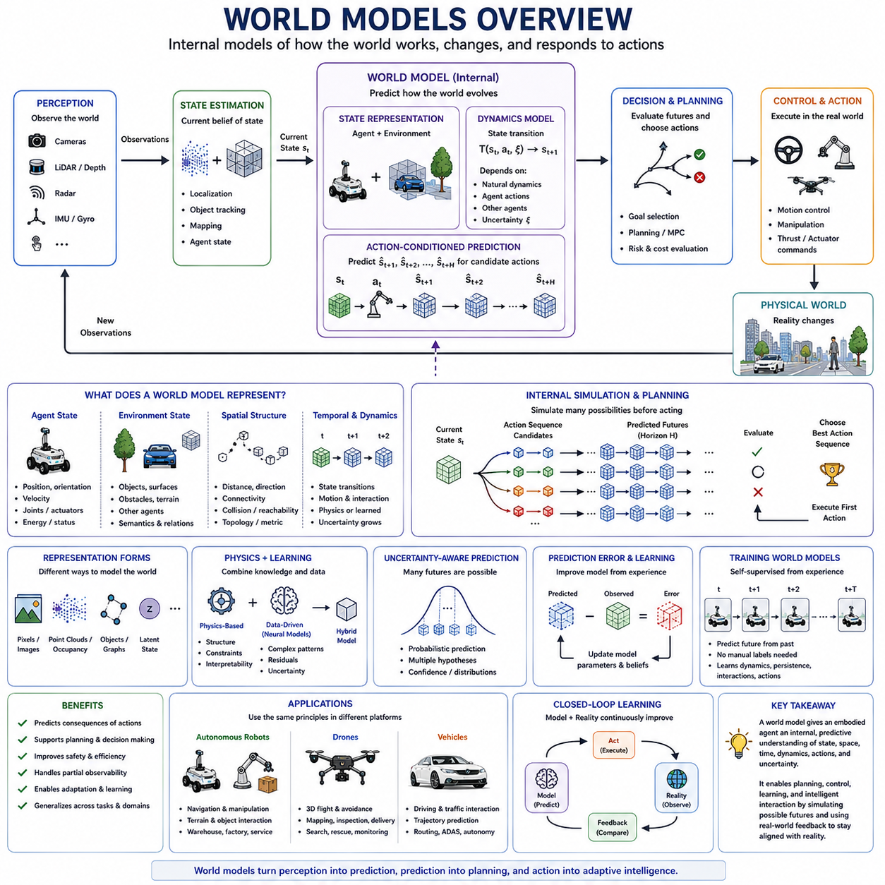
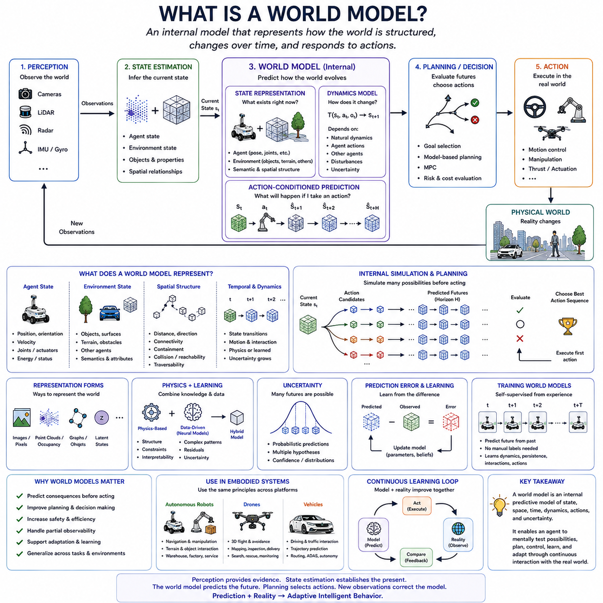
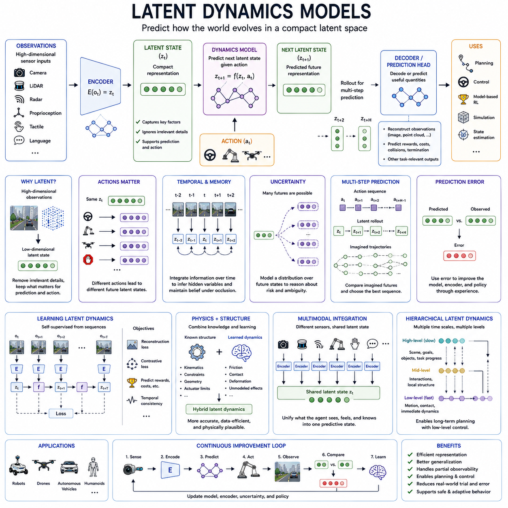
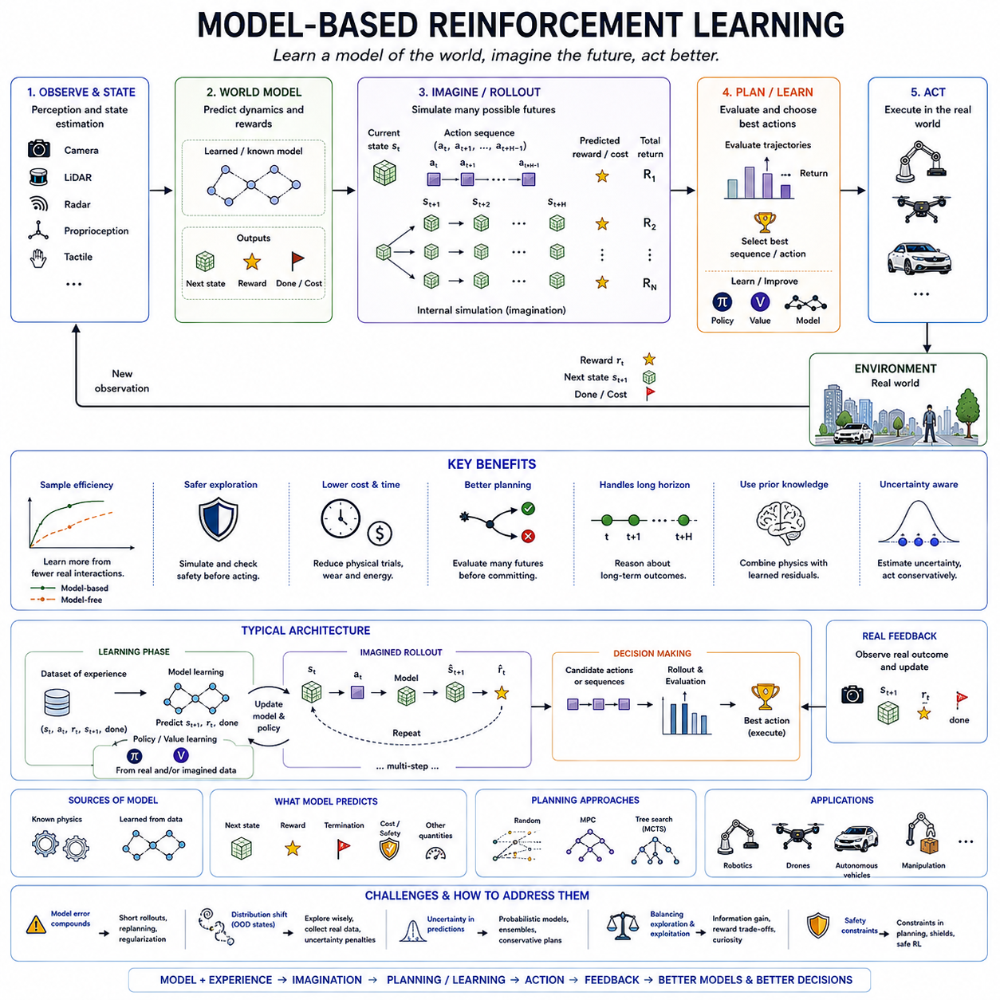
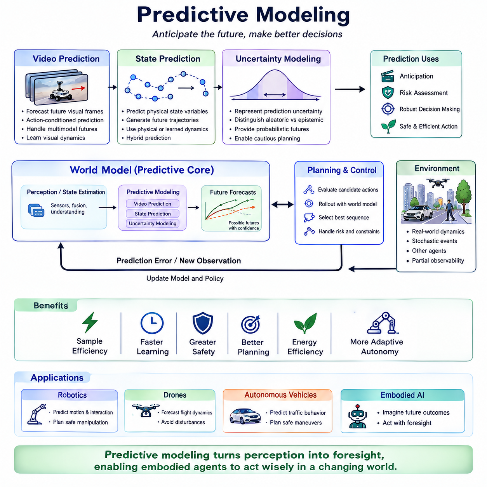
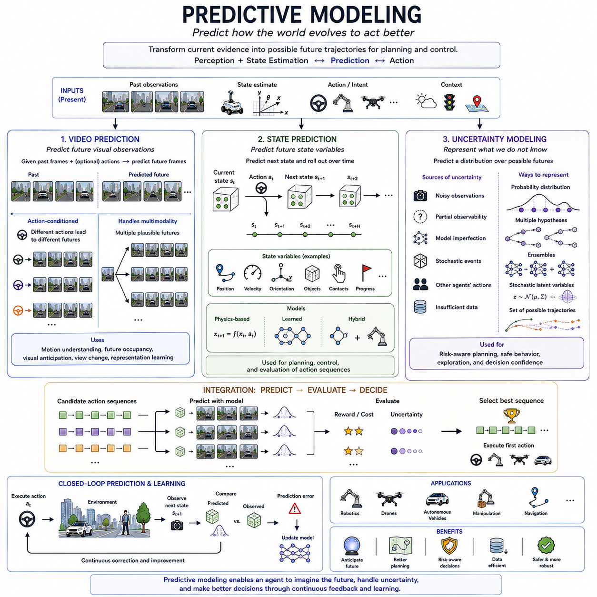
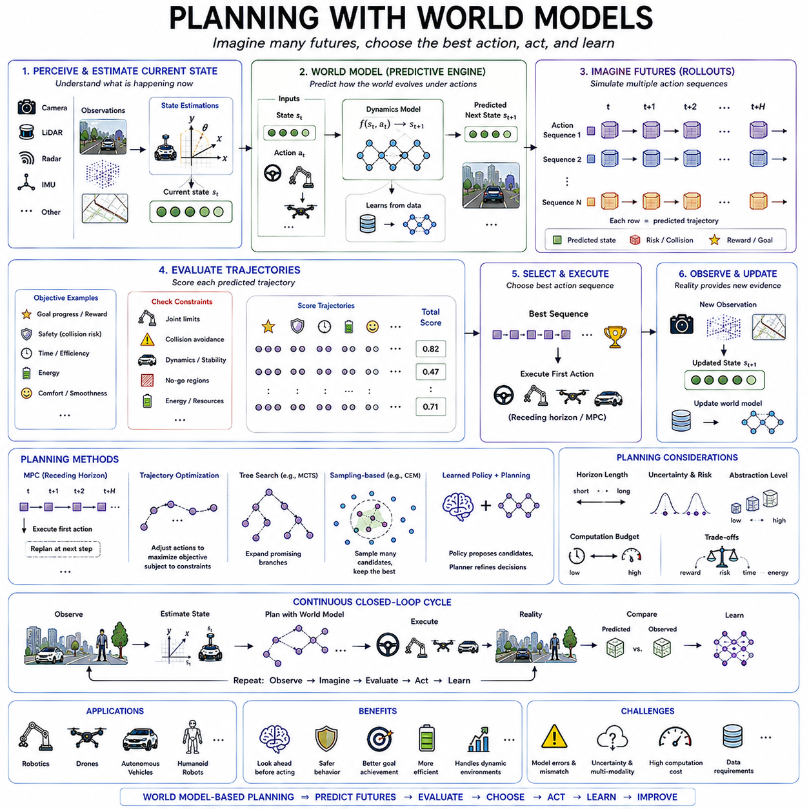
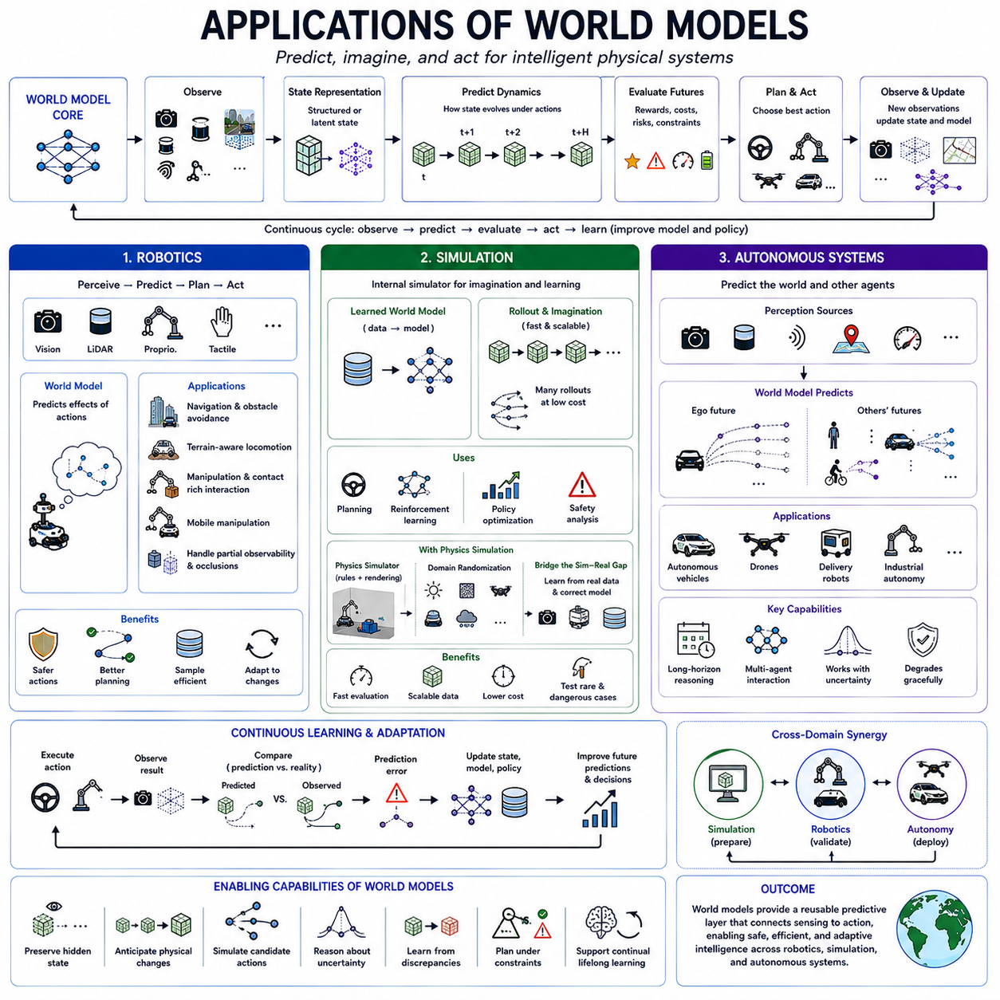

**Volume 45. Embodied AI and World Models**

# Chapter 02. World Models

## 02.00. Overview

{width="7.268055555555556in" height="7.268055555555556in"}

월드 모델(World Models)은 체화 지능 시스템(Embodied Intelligent System)이 물리적 세계(Physical World)가 어떻게 구성되어 있고, 시간에 따라 어떻게 변화하며, 행동(Action)이 미래 상태(Future States)에 어떤 영향을 미칠 수 있는지를 내부적으로 표현할 수 있도록 합니다. 현재의 센서 관측(Sensor Observations)에만 반응하는 대신, 월드 모델을 갖춘 에이전트(Agent)는 모든 순간에 완전히 관측되지 않는 객체(Objects), 공간적 관계(Spatial Relationships), 동역학(Dynamics), 인과적 상호작용(Causal Interactions)에 대한 지식을 유지할 수 있습니다.

체화 인공지능(Embodied AI)에서 월드 모델(World Model)은 지각-행동 루프(Perception-Action Loop)를 반응형 제어(Reactive Control)에서 예측형 지능(Predictive Intelligence)으로 확장합니다. 지각(Perception)은 현재 환경을 관측하고, 상태 추정(State Estimation)은 현재 상황에 대한 추정값을 구성하며, 월드 모델은 그 상황이 앞으로 어떻게 변화할 수 있는지를 예측합니다. 따라서 에이전트는 행동을 물리적 세계에서 실제로 실행하기 전에 내부적으로 가능한 행동을 평가하여 시행착오(Trial-and-Error)에 대한 의존도를 줄일 수 있습니다.

유용한 월드 모델(World Model)은 에이전트와 환경(Environment)을 모두 표현해야 합니다. 에이전트 상태(Agent State)는 위치(Position), 자세(Orientation), 속도(Velocity), 관절 구성(Joint Configuration), 액추에이터 상태(Actuator Condition), 에너지 상태(Energy State), 작업 상태(Task Status)를 포함할 수 있습니다. 환경 상태(Environmental State)는 객체, 표면(Surfaces), 장애물(Obstacles), 지형(Terrain), 다른 에이전트, 의미론적 속성(Semantic Properties), 공간적 관계를 포함할 수 있습니다. 이러한 표현은 에이전트와 주변 환경 사이의 상호작용을 추론하는 데 필요한 내부 맥락(Internal Context)을 제공합니다.

물리적 환경은 지속적으로 변화하기 때문에 월드 모델은 본질적으로 시간적(Temporal) 특성을 가집니다. 객체는 이동하고, 에이전트는 상호작용하며, 문은 열리고 닫히고, 차량은 궤적(Trajectory)을 변경하며, 체화 시스템 자체도 행동하면서 위치를 변경합니다. 따라서 월드 모델은 각각의 센서 프레임을 독립적인 현실의 설명으로 처리하기보다 시간에 따른 관측을 연결하고 상태 전이(State Transitions)를 표현해야 합니다.

상태 전이 모델링(State Transition Modeling)은 현재 상태(Current State)가 미래 상태로 어떻게 발전할 수 있는지를 설명합니다. 이러한 전이는 자연적인 환경 동역학(Environmental Dynamics), 체화 에이전트가 수행하는 행동, 다른 개체가 수행하는 행동에 따라 달라질 수 있습니다. 이러한 관계를 학습하거나 모델링함으로써 시스템은 현재 상태와 후보 행동(Candidate Action)으로부터 미래 상태를 추정할 수 있으며, 이를 통해 예측(Prediction), 계획(Planning), 제어(Control)를 위한 계산적 기반을 구축할 수 있습니다.

체화 지능을 위한 월드 모델은 단순히 수동적으로 앞으로 무엇이 일어날지를 예측하는 것이 아니라 특정 행동을 수행했을 때 어떤 일이 발생할 가능성이 있는지를 추정해야 하기 때문에 행동(Action)이 특히 중요합니다. 차량의 조향 장치를 돌리거나, 이동 로봇을 가속하거나, 매니퓰레이터(Manipulator)로 힘을 가하거나, 드론의 추력(Thrust)을 변경하면 서로 다른 미래 궤적이 생성됩니다. 따라서 행동 조건부 예측(Action-Conditioned Prediction)은 내부 모델링을 자율 행동(Autonomous Behavior)과 직접 연결합니다.

월드 모델에서 사용하는 내부 표현(Internal Representation)은 여러 형태를 가질 수 있습니다. 일부 시스템은 이미지, 포인트 클라우드(Point Clouds), 점유 표현(Occupancy Representations), 기타 직접 관측 가능한 물리량을 기반으로 작동하며, 다른 시스템은 관측을 압축된 잠재 상태(Latent States)로 변환합니다. 잠재 표현(Latent Representations)은 물리적 환경의 모든 세부 사항을 재구성하는 계산 비용을 줄이면서 예측과 의사결정에 중요한 정보를 유지할 수 있습니다.

좋은 잠재 상태(Latent State)는 단순히 감각 데이터를 압축하는 것이 아니라 작업 관련 구조(Task-Relevant Structure)를 보존해야 합니다. 모든 픽셀을 정확하게 재현하는 것보다 객체 지속성(Object Persistence), 기하학(Geometry), 움직임(Motion), 상호작용 가능성(Interaction Possibilities), 인과적 관계(Causal Relationships)에 대한 정보가 더욱 중요할 수 있습니다. 체화 에이전트가 궁극적으로 필요로 하는 것은 시각적으로 사실적인 예측만을 생성하는 내부 모델이 아니라 효과적인 의사결정과 행동을 지원하는 내부 모델이라는 점에서 이러한 구분은 중요합니다.

객체 지속성(Object Persistence)은 일관된 월드 모델링(Coherent World Modeling)을 위한 기본적인 요구사항입니다. 객체는 일시적으로 가려지거나 현재 센서의 시야(Field of View) 밖으로 이동했다고 해서 존재하지 않게 되는 것이 아닙니다. 시스템은 지속적인 내부 표현(Persistent Internal Representations)을 유지함으로써 관측이 중단된 구간에서도 객체를 추론하고, 새로운 측정값을 이전 객체와 연관시키며, 일시적으로 보이지 않는 객체가 어디에서 다시 나타날 가능성이 있는지를 예측할 수 있습니다.

공간적 구조(Spatial Structure) 역시 중요합니다. 월드 모델은 거리(Distance), 방향(Direction), 포함 관계(Containment), 연결성(Connectivity), 충돌 가능성(Collision Possibility), 도달 가능성(Reachability)과 같은 관계를 표현해야 합니다. 이러한 관계를 통해 에이전트는 어디로 이동할 수 있으며 주변 객체와 어떻게 상호작용할 수 있는지를 추론합니다. 응용 분야에 따라 공간 표현은 메트릭(Metric), 위상학적(Topological), 객체 중심(Object-Centric), 의미론적(Semantic), 잠재적(Latent) 표현 또는 이들의 조합으로 구성될 수 있습니다.

동역학 모델링(Dynamics Modeling)은 물리적 상태가 어떻게 변화하는지를 표현합니다. 일부 동역학은 역학(Mechanics)에 기반한 해석적 모델(Analytical Models)을 통해 설명할 수 있지만, 다른 관계는 데이터로부터 학습할 수 있습니다. 실제 환경에는 마찰(Friction), 변형(Deformation), 불확실한 접촉(Uncertain Contact), 복잡한 지형, 인간 행동(Human Behavior) 등 정확하게 모델링하기 어려운 현상이 존재합니다. 학습 기반 월드 모델(Learned World Models)은 많은 관측 전이와 상호작용 데이터로부터 이러한 동역학을 근사할 수 있습니다.

따라서 월드 모델은 물리 기반 지식(Physics-Based Knowledge)과 데이터 기반 학습(Data-Driven Learning)을 결합할 수 있습니다. 명시적인 물리적 제약조건(Physical Constraints)은 익숙한 운용 영역에서 구조, 해석 가능성(Interpretability), 신뢰성 있는 행동을 제공할 수 있으며, 신경망 모델(Neural Models)은 해석적으로 도출하기 어려운 복잡한 관계를 포착할 수 있습니다. 하이브리드 접근법(Hybrid Approaches)은 적절한 영역에서는 알려진 동역학을 사용하고, 잔차 효과(Residual Effects)나 불확실한 상호작용을 경험으로부터 학습할 수 있습니다.

예측 지평(Prediction Horizon)은 월드 모델이 무엇을 표현해야 하는지에 영향을 줍니다. 단기 예측(Short-Horizon Prediction)은 즉각적인 움직임, 충돌 위험(Collision Risk), 제어 응답(Control Response)에 집중할 수 있으며, 장기 예측(Long-Horizon Prediction)은 경로, 작업 시퀀스(Task Sequences), 다른 에이전트와의 상호작용, 전략적 결과(Strategic Consequences)를 포함할 수 있습니다. 상태, 동역학, 행동 가정에 존재하는 작은 오차가 미래로 갈수록 누적되므로 일반적으로 예측 시간이 길어질수록 예측 불확실성(Prediction Uncertainty)이 증가합니다.

따라서 월드 모델은 모든 미래 예측을 확실한 것으로 제시하기보다 불확실성(Uncertainty)을 표현해야 합니다. 관측이 불완전하거나 다른 에이전트가 서로 다른 행동을 선택할 수 있는 경우 여러 결과가 모두 가능할 수 있습니다. 확률적 예측(Probabilistic Predictions), 다중 가설(Multiple Hypotheses), 신뢰도 추정(Confidence Estimates), 미래 상태에 대한 확률 분포(Distributions over Future States)를 활용하면 계획 시스템은 위험을 평가하고 여러 가능한 미래에서도 효과적인 행동을 선택할 수 있습니다.

계획(Planning)은 월드 모델을 내부 시뮬레이터(Internal Simulator)로 활용할 수 있습니다. 모든 후보 행동을 물리적으로 실행하는 대신 에이전트는 여러 대안적인 행동 시퀀스를 생성하고, 각각의 결과를 예측하며, 생성된 미래 상태를 평가한 뒤 유망한 궤적을 선택할 수 있습니다. 이러한 내부 시뮬레이션(Internal Simulation)은 명백하게 잘못되었거나 위험한 행동을 실제 환경에 영향을 주기 전에 제거할 수 있기 때문에 효율성과 안전성을 향상시킬 수 있습니다.

모델 예측 제어(Model Predictive Control, MPC)는 이와 밀접하게 관련된 메커니즘을 제공합니다. 시스템은 제한된 시간 범위에서 미래 행동을 예측하고, 일련의 행동을 최적화한 다음, 선택된 해의 초기 일부를 실행하고 결과 상태를 관측한 뒤 다시 최적화를 수행합니다. 예측과 피드백(Feedback)을 반복적으로 결합함으로써 시스템은 월드 모델의 장점을 활용하면서 예측된 결과와 실제 결과 사이에서 발생하는 오차를 지속적으로 보정할 수 있습니다.

예측 오차(Prediction Error)는 기대했던 결과와 실제로 관측된 결과 사이의 차이가 내부 모델의 약점을 보여주기 때문에 특히 중요한 정보를 제공합니다. 어떤 행동이 지속적으로 예측과 다른 결과를 만들어낸다면 시스템은 상태 표현(State Representation), 동역학 모델, 불확실성 추정 또는 제어 전략(Control Strategy)을 갱신할 수 있습니다. 따라서 월드 모델링은 물리적 경험이 미래의 예측 능력을 지속적으로 개선하는 연속 학습 루프(Continuous Learning Loop)의 일부가 될 수 있습니다.

자기지도학습(Self-Supervised Learning)은 체화 시스템이 지속적으로 관측과 행동의 시퀀스를 생성하기 때문에 월드 모델을 학습시키는 자연스러운 방법을 제공합니다. 모든 상태 전이에 사람이 직접 레이블(Label)을 부여하지 않아도 이전 관측을 이용하여 이후의 관측이나 잠재 상태를 예측할 수 있습니다. 따라서 대규모 상호작용 데이터(Large-Scale Interaction Data)를 통해 경험에 존재하는 규칙성으로부터 시간적 구조(Temporal Structure), 객체 지속성, 운동 패턴(Motion Patterns), 행동 조건부 동역학(Action-Conditioned Dynamics)을 학습할 수 있습니다.

월드 모델은 지각(Perception)과 상위 수준 추론(Higher-Level Reasoning)을 연결하는 역할도 수행합니다. 지각은 현재 세계에 대한 증거를 식별하고, 월드 모델은 이러한 증거를 지속적이고 예측 가능한 내부 구조로 조직합니다. 이후 의사결정(Decision Making)은 현재 관측된 정보뿐만 아니라 숨겨진 상태(Hidden State), 예상되는 전이(Expected Transitions), 가능한 상호작용(Possible Interactions), 일련의 행동 이후 발생할 수 있는 결과까지 고려하여 추론할 수 있습니다.

자율 로봇(Autonomous Robots), 드론(Drones), 차량(Vehicles)에서 이러한 능력은 보다 선제적인 행동(Anticipatory Behavior)을 가능하게 합니다. 로봇은 지형이나 조작되는 객체가 어떻게 반응할지를 예측할 수 있고, 드론은 3차원 공간에서 미래 움직임을 추정할 수 있으며, 자율주행 차량(Autonomous Vehicle)은 주변 교통 참여자(Traffic Participants)의 가능한 궤적을 추론할 수 있습니다. 각각의 경우에서 예측은 반응형 지각(Reactive Perception)을 다음에 무엇이 발생할 수 있는지에 대한 추정으로 확장합니다.

월드 모델(World Model)은 센싱(Sensing), 상태 추정(State Estimation), 계획(Planning), 제어(Control)를 대체하지 않습니다. 월드 모델의 예측은 현실에 대한 근사(Approximation)이므로 새로운 관측을 통해 지속적으로 현실에 기반하여 보정되어야 합니다. 물리적 세계로부터의 피드백은 누적된 모델링 오차(Modeling Errors)를 수정하고, 숨겨진 상태를 갱신하며, 예상하지 못한 사건을 발견합니다. 따라서 효과적인 체화 지능은 내부 예측이나 외부 관측 가운데 하나에만 의존하지 않고 두 요소를 지속적으로 결합합니다.

궁극적으로 월드 모델(World Model)은 체화 시스템을 현재 관측에 주로 반응하는 에이전트에서 가능한 미래(Possible Futures)를 추론할 수 있는 에이전트로 변화시킵니다. 상태(State), 공간(Space), 시간(Time), 동역학(Dynamics), 행동(Action), 불확실성(Uncertainty), 인과적 결과(Causal Consequences)를 하나의 통합된 예측 프레임워크(Unified Predictive Framework) 안에서 표현함으로써 월드 모델은 계획, 적응형 제어(Adaptive Control), 학습(Learning), 그리고 물리적 세계와의 더욱 정교한 목표 지향적 상호작용(Goal-Directed Interaction)을 가능하게 하는 내부 기반을 제공합니다.

## 02.01. What is a World Model

{width="7.268055555555556in" height="7.268055555555556in"}

월드 모델(World Model)은 지능형 에이전트(Intelligent Agent)가 자신의 환경이 어떻게 구성되어 있는지, 상태(State)가 시간에 따라 어떻게 변화하는지, 그리고 행동(Action)이 미래의 결과(Future Outcomes)에 어떤 영향을 미치는지를 설명할 수 있도록 하는 내부 계산 표현(Internal Computational Representation)입니다. 체화 인공지능(Embodied AI)에서 월드 모델은 외부 현실(External Reality)에 대한 내부 근사 모델로 작동하며, 에이전트가 즉각적인 관측을 넘어 추론하고 실제 물리적 행동을 수행하기 전에 앞으로 발생할 수 있는 상황을 예상할 수 있도록 합니다.

이 개념은 지각-행동 루프(Perception-Action Loop)와 밀접하게 연결되어 있습니다. 센서(Sensors)는 현재 환경에 대한 관측(Observations)을 제공하고, 상태 추정(State Estimation)은 이러한 관측을 에이전트와 주변 세계에 대한 현재 상태의 추정값으로 변환합니다. 월드 모델은 이렇게 추정된 상태를 이용하여 가능한 미래 상태(Future States)를 예측하며, 계획(Planning)과 의사결정(Decision Making) 메커니즘이 행동을 실제 물리적 환경에서 실행하기 전에 그 결과를 평가할 수 있도록 합니다.

따라서 월드 모델(World Model)은 상태(State)에 대한 어떤 형태의 표현을 포함합니다. 상태는 에이전트의 위치(Position), 자세(Orientation), 속도(Velocity), 관절(Joints), 액추에이터(Actuators), 에너지 수준(Energy Level), 작업 상태(Task Status)를 나타낼 수 있으며, 객체(Objects), 지형(Terrain), 장애물(Obstacles), 표면(Surfaces), 다른 에이전트(Other Agents), 의미론적 속성(Semantic Properties)과 같은 환경 정보도 포함할 수 있습니다. 이러한 표현은 모든 물리적 세부사항을 재현할 필요는 없으며, 예측과 행동에 유용한 정보를 보존해야 합니다.

월드 모델을 정의하는 중요한 특성 가운데 하나는 시간적 구조(Temporal Structure)입니다. 물리적 환경은 정적인 관측들의 집합이 아니라 객체가 움직이고, 상호작용이 발생하며, 에이전트 자신의 행동에 의해 세계가 변화하는 동적인 시스템입니다. 월드 모델은 현재 상태에서 가능한 미래 상태로의 전이(Transition)를 표현함으로써 시간에 걸쳐 상태들을 연결하고, 개별적인 지각 정보를 지속적으로 변화하는 내부 설명(Evolving Internal Description)으로 변환합니다.

이러한 전이는 개념적으로 동역학 모델(Dynamics Model)로 표현할 수 있습니다. 현재 상태와 행동이 주어지면 모델은 그다음에 발생할 가능성이 높은 상태를 추정합니다. 이러한 상태 전이는 환경 동역학(Environmental Dynamics), 접촉 사건(Contact Events), 다른 에이전트, 외란(Disturbances), 불확실성(Uncertainty)의 영향을 받을 수도 있습니다. 이러한 관계를 학습함으로써 체화 시스템은 가능한 모든 행동을 실제로 사전에 시험하지 않고도 움직임과 상호작용을 예측할 수 있습니다.

행동 조건화(Action Conditioning)는 많은 체화 월드 모델(Embodied World Models)을 수동적인 예측 시스템(Passive Forecasting Systems)과 구분하는 중요한 특징입니다. 핵심적인 질문은 단순히 다음에 무엇이 발생할 것인가가 아니라 특정 행동을 수행한다면 무엇이 발생할 가능성이 있는가입니다. 서로 다른 조향 명령(Steering Commands), 관절 움직임(Joint Movements), 가속(Accelerations), 힘(Forces), 비행 제어(Flight Controls)는 서로 다른 미래를 만들어냅니다. 따라서 월드 모델은 후보 행동(Candidate Actions)을 예측된 결과(Predicted Consequences)와 연결하여 의사결정을 안내할 수 있는 정보를 제공합니다.

월드 모델은 관측 공간(Observation Space)에서 직접 작동하거나 학습된 잠재 공간(Learned Latent Spaces)에서 작동할 수 있습니다. 관측 공간 모델은 이미지(Images), 포인트 클라우드(Point Clouds), 점유 구조(Occupancy Structures), 명시적인 물리 변수(Physical Variables)를 예측할 수 있습니다. 반면 잠재 월드 모델(Latent World Models)은 관측을 압축된 내부 상태(Compact Internal States)로 인코딩하고 이러한 표현이 어떻게 변화하는지를 예측합니다. 이를 통해 제어, 계획, 작업 수행에 중요한 특징을 유지하면서 계산 요구량을 줄일 수 있습니다.

유용한 잠재 표현(Latent Representation)은 단순한 시각적 유사성(Visual Similarity)보다 지속적인 구조(Persistent Structure)를 포착해야 합니다. 객체 정체성(Object Identity), 기하학(Geometry), 움직임(Motion), 공간적 관계(Spatial Relationships), 상호작용 어포던스(Interaction Affordances), 작업 관련성(Task Relevance)은 모든 픽셀을 정확하게 재구성하는 것보다 중요할 수 있습니다. 따라서 체화 월드 모델은 생성된 관측이 얼마나 사실적으로 보이는지만이 아니라 내부 표현이 유용한 예측과 행동을 얼마나 효과적으로 지원하는지를 중심으로 평가되어야 합니다.

객체 영속성(Object Permanence)은 많은 중요한 개체가 직접적인 센싱으로부터 일시적으로 가려질 수 있기 때문에 중요한 능력입니다. 차량이 다른 객체 뒤로 사라질 수도 있고, 조작 대상(Manipulation Target)이 로봇 팔에 의해 가려질 수도 있으며, 이동 로봇이 이전에 관측했던 장애물에서 시선을 돌릴 수도 있습니다. 지속적인 월드 모델은 이러한 개체에 대한 가설(Hypotheses)을 유지하고 새로운 관측이 제공될 때 이를 갱신합니다.

공간적 관계(Spatial Relationships) 역시 내부 세계 표현(Internal World Representation)의 기본적인 구성 요소입니다. 월드 모델은 거리(Distance), 방향(Direction), 연결성(Connectivity), 포함 관계(Containment), 충돌 관계(Collision Relationships), 도달 가능성(Reachability), 주행 가능성(Traversability)을 표현해야 할 수 있습니다. 이러한 구조를 통해 에이전트는 객체가 어디에 있는지, 어떤 경로가 가능한지, 행동이 에이전트와 객체 및 주변 환경 사이의 관계를 어떻게 변화시킬 수 있는지를 추론할 수 있습니다.

월드 모델은 명시적인 물리학(Explicit Physics)과 학습된 동역학(Learned Dynamics)을 결합할 수 있습니다. 해석적 모델(Analytical Models)은 잘 알려진 기계적 관계(Mechanical Relationships)를 표현하고 알려진 물리적 제약조건(Physical Constraints)을 적용할 수 있으며, 신경망 모델(Neural Models)은 마찰(Friction), 접촉(Contact), 변형(Deformation), 지형 상호작용(Terrain Interaction), 인간 행동(Human Behavior)과 같은 복잡한 효과를 데이터에서 학습할 수 있습니다. 하이브리드 접근법(Hybrid Approaches)은 신뢰할 수 있는 영역에서는 물리적 구조를 사용하고, 해석적 설명이 불완전하거나 구축하기 어려운 영역에서는 학습을 활용합니다.

월드 모델 자체도 현실에 대한 근사(Approximation)에 불과하기 때문에 불확실성(Uncertainty)은 피할 수 없습니다. 센서 관측은 불완전할 수 있고, 상태 추정값에는 오차가 포함될 수 있으며, 물리적으로 여러 미래 결과가 모두 가능할 수도 있습니다. 따라서 유용한 모델은 하나의 확정적인 예측만을 생성하기보다 신뢰도(Confidence), 확률(Probability), 또는 대안적인 미래 가설(Alternative Future Hypotheses)을 표현해야 합니다. 이를 통해 계획 시스템은 위험(Risk)과 모호성(Ambiguity)을 명시적으로 고려할 수 있습니다.

예측 지평(Prediction Horizon)은 또 다른 중요한 절충 관계(Tradeoff)를 만들어냅니다. 매우 짧은 예측 지평의 모델은 즉각적인 움직임이나 제어 응답(Control Response)을 정확하게 추정할 수 있지만, 장기 예측 모델(Long-Horizon Model)은 일련의 행동, 상호작용, 누적되는 불확실성을 추론해야 합니다. 일반적으로 예측 지평이 길어질수록 예측 오차(Prediction Errors)가 증가하므로 실제 시스템은 정확한 단기 동역학(Short-Term Dynamics)과 장기 계획 및 작업 추론을 위한 보다 추상적인 표현을 결합할 수 있습니다.

월드 모델은 내부 시뮬레이터(Internal Simulator)로 사용될 때 특히 강력해집니다. 현재 추정 상태에서 에이전트는 여러 후보 행동을 고려하고, 그에 따른 미래 궤적(Future Trajectories)을 예측하며, 비용(Cost)이나 보상(Reward)을 비교한 뒤 실제 환경과 상호작용하기 전에 행동 시퀀스(Action Sequence)를 선택할 수 있습니다. 이는 모델 기반 계획(Model-Based Planning)과 모델 기반 강화학습(Model-Based Reinforcement Learning)을 지원하며, 두 방법 모두 월드 모델을 활용하는 핵심적인 접근법입니다.

그러나 월드 모델은 지속적으로 관측(Observation)에 기반하여 현실과 연결되어 있어야 합니다. 행동이 실행된 이후 센서는 실제로 발생한 결과를 관측하고, 그 결과 상태를 예측된 상태(Predicted State)와 비교할 수 있습니다. 이 차이는 상태 추정이나 동역학 모델링의 약점을 드러내는 예측 오차(Prediction Error)를 형성합니다. 예측과 현실을 반복적으로 비교함으로써 모델은 경험을 통해 지속적으로 수정되고 적응할 수 있습니다.

자기지도학습(Self-Supervised Learning)은 체화 에이전트가 관측-행동 시퀀스(Observation-Action Sequences)를 지속적으로 생성하기 때문에 이러한 과정에 자연스럽게 적합합니다. 이전 상태와 행동을 이용하여 이후 상태를 예측할 수 있으므로 사람이 모든 상태 전이에 직접 레이블을 부여할 필요가 없습니다. 이러한 방식으로 대규모 상호작용 데이터는 경험 속에 존재하는 규칙성으로부터 시간적 연속성(Temporal Continuity), 객체 영속성, 동역학, 행동 조건부 변화(Action-Conditioned Change)를 모델이 학습하도록 할 수 있습니다.

따라서 월드 모델은 정적인 데이터베이스(Static Database)나 전통적인 지도(Conventional Map)로 이해해서는 안 됩니다. 지도는 주로 환경의 구조를 기록하지만, 월드 모델은 추가적으로 그 구조가 어떻게 변화하고 행동이 그것에 어떤 영향을 미치는지를 표현합니다. 즉, 상태 표현(State Representation), 시간적 동역학(Temporal Dynamics), 예측(Prediction), 불확실성, 행동의 결과(Action Consequences)를 결합하여 가능한 미래에 대한 추론을 지원하는 내부 메커니즘입니다.

궁극적으로 월드 모델(World Model)은 체화 에이전트가 물리적으로 행동하기 전에 내부적으로 여러 가능성을 시험할 수 있는 능력을 제공합니다. 지각(Perception)은 현실에 대한 증거를 제공하고, 상태 추정(State Estimation)은 현재 상태를 확립하며, 월드 모델은 미래의 결과를 예측하고, 계획(Planning)은 이러한 예측을 기반으로 행동을 선택합니다. 이후 새로운 관측은 내부 모델을 다시 수정하며, 이러한 지속적인 순환을 통해 예측과 실제 세계의 상호작용이 점진적으로 더욱 적응적인 지능 행동(Adaptive Intelligent Behavior)을 지원하게 됩니다.

## 02.02. Latent Dynamics Models

{width="7.268055555555556in" height="7.268055555555556in"}

잠재 동역학 모델(Latent Dynamics Models)은 원시 감각 관측(Raw Sensory Observations)의 모든 세부사항을 직접 예측하는 대신 압축된 내부 표현(Compact Internal Representations)을 통해 환경이 어떻게 변화하는지를 설명합니다. 시스템은 고차원 이미지(High-Dimensional Images), 포인트 클라우드(Point Clouds), 다중모달 센서 스트림(Multimodal Sensor Streams) 사이의 전이를 직접 모델링하는 대신 관측을 잠재 상태(Latent States)로 인코딩하고 이러한 상태가 시간에 따라 어떻게 변화하는지를 학습합니다. 이를 통해 월드 모델(World Models), 계획(Planning), 체화 의사결정(Embodied Decision Making)을 위한 효율적인 예측 기반을 구축할 수 있습니다.

기본적인 아키텍처(Architecture)는 인코더(Encoder), 잠재 상태 표현(Latent State Representation), 전이 모델(Transition Model) 또는 동역학 모델(Dynamics Model), 그리고 필요한 경우 디코더(Decoder)나 예측 헤드(Prediction Head)로 구성됩니다. 인코더는 관측을 현재 세계에 관한 관련 정보를 요약한 잠재 상태로 변환합니다. 동역학 모델은 행동(Action) 이후 잠재 상태가 어떻게 변화할지를 예측하며, 선택적인 디코딩 구성요소는 관측을 재구성하거나 계획, 제어(Control), 학습(Learning)에 필요한 물리량을 예측합니다.

개념적으로 시간 t의 관측(Observation)은 잠재 상태 z_t로 인코딩될 수 있습니다. 이 상태와 행동 a_t가 주어지면 잠재 동역학 모델은 미래 표현 z_t+1을 예측합니다. 이러한 전이를 반복하면 모델은 가능한 미래 잠재 상태(Future Latent States)의 시퀀스를 생성할 수 있습니다. 이렇게 만들어진 잠재 궤적(Latent Trajectory)은 각각의 예측 단계에서 완전한 감각 관측을 생성하지 않고도 환경이 어떻게 변화할지를 내부적으로 시뮬레이션한 결과를 나타냅니다.

잠재 표현(Latent Representations)이 유용한 이유는 원시 관측에 행동과 관련되지 않은 방대한 정보가 포함되어 있기 때문입니다. 카메라 영상에는 질감(Texture), 조명(Illumination), 배경의 세부사항, 시각적 변화가 포함되지만 이들 가운데 일부는 로봇의 다음 의사결정에 거의 영향을 미치지 않을 수 있습니다. 잘 설계된 잠재 상태는 관측을 압축하면서도 결과 예측과 행동 선택에 필요한 기하학(Geometry), 객체(Objects), 움직임(Motion), 상호작용(Interactions), 기타 중요한 속성을 유지합니다.

그러나 압축(Compression) 자체만으로 유용한 월드 모델이 보장되는 것은 아닙니다. 관측 재구성(Reconstruction)만을 목적으로 최적화된 잠재 표현은 시각적으로 세밀한 정보를 보존하면서도 제어에 중요한 구조를 무시할 수 있습니다. 따라서 잠재 동역학 모델은 예측(Prediction), 보상(Reward), 가치(Value), 작업 목표(Task Objectives), 시간적 일관성(Temporal Consistency), 행동 관련성(Action Relevance)에 의해 형성되는 표현을 활용하는 것이 유리합니다. 목표는 중요한 물리적·행동적 관계를 예측할 수 있는 상태 공간(State Space)을 구축하는 것입니다.

행동(Action)은 체화 잠재 동역학(Embodied Latent Dynamics)의 핵심 요소입니다. 유용한 전이 모델은 환경 자체에 의해 발생하는 변화와 에이전트의 행동으로 발생하는 변화를 구분할 수 있어야 합니다. 동일한 현재 잠재 상태에서도 가속(Accelerating), 제동(Braking), 회전(Turning), 파지(Grasping), 밀기(Pushing), 정지 상태 유지(Remaining Stationary)는 매우 다른 미래 상태를 만들어낼 수 있습니다. 잠재 상태 전이를 행동에 조건화함으로써 모델은 특정 행동을 선택했을 때 어떤 일이 발생할 수 있는지라는 실질적인 질문에 답할 수 있습니다.

단일 관측만으로는 속도(Velocity), 숨겨진 움직임(Hidden Motion), 접촉 상태(Contact State), 기타 동적 변수(Dynamic Variables)를 파악하기 어려울 수 있기 때문에 시간적 정보(Temporal Information) 역시 중요합니다. 모델은 여러 관측을 통합하거나 순환형 내부 메모리(Recurrent Internal Memory)를 유지하여 하나의 프레임에서 직접 관측할 수 없는 정보를 추론할 수 있습니다. 이렇게 생성된 잠재 상태는 단순히 최신 센서 측정값을 압축한 표현이 아니라 기반 물리 상태(Underlying Physical State)에 대한 압축된 믿음(Belief)으로 기능할 수 있습니다.

이러한 능력은 부분 관측 가능성(Partial Observability)이 존재하는 환경에서 특히 중요합니다. 객체가 가려질 수 있고, 센서가 일시적으로 고장 날 수 있으며, 중요한 환경 속성을 직접 측정할 수 없는 경우도 있습니다. 모델은 잠재 상태를 시간에 따라 전파함으로써 숨겨진 변수(Hidden Variables)에 대한 가설을 유지하고 새로운 증거가 들어오면 이를 갱신할 수 있습니다. 따라서 잠재 동역학은 메모리(Memory), 예측, 상태 추정(State Estimation)을 하나의 통합된 내부 표현으로 연결합니다.

결정론적 잠재 동역학 모델(Deterministic Latent Dynamics Models)은 각각의 상태-행동 쌍(State-Action Pair)에 대해 하나의 미래 표현을 예측합니다. 시스템의 행동을 충분히 예측할 수 있고 불확실성이 제한적인 경우에는 이러한 방식이 효과적일 수 있습니다. 그러나 실제 환경에는 확률적 사건(Stochastic Events), 모호한 관측(Ambiguous Observations), 알려지지 않은 외란(Unknown Disturbances), 미래의 의사결정을 정확하게 결정할 수 없는 다른 에이전트가 존재합니다. 이러한 상황에서 하나의 결정론적 예측은 여러 가능한 미래를 평균화하거나 계획에 부정확한 정보를 제공할 수 있습니다.

확률적 잠재 동역학 모델(Probabilistic Latent Dynamics Models)은 미래 상태에 대한 불확실성을 표현함으로써 이러한 문제를 해결합니다. 하나의 잠재 결과만을 예측하는 대신 모델은 확률 분포(Distribution) 또는 여러 가능한 궤적(Multiple Possible Trajectories)을 표현할 수 있습니다. 이를 통해 체화 에이전트는 대안적인 미래를 고려하고 위험(Risk)을 추정하며 불확실성 아래에서도 효과적인 행동을 선택할 수 있습니다. 이러한 표현은 동적이고 상호작용이 많은 환경에서 장기 예측(Long-Horizon Prediction)을 수행할 때 특히 중요합니다.

계획(Planning)은 다음 상태 하나를 넘어 미래를 추론해야 하는 경우가 많기 때문에 다단계 예측(Multi-Step Prediction)은 핵심적인 능력입니다. 현재 잠재 표현에서 시작하여 모델은 학습된 전이 함수(Transition Function)를 반복적으로 적용해 여러 단계 이후의 상태를 예측합니다. 따라서 서로 다른 후보 행동 시퀀스(Candidate Action Sequences)는 서로 다른 가상 잠재 궤적(Imagined Latent Trajectories)을 생성할 수 있으며, 플래너(Planner)는 실제로 행동을 실행하기 전에 그 결과를 비교할 수 있습니다.

반복적인 롤아웃(Rollout)은 누적 오차(Compounding Error)라는 문제를 발생시킵니다. 한 단계에서 발생한 작은 예측 오차가 다음 예측의 입력에 포함되면서 장기적으로 부정확성이 누적될 수 있습니다. 결국 잠재 궤적이 실제 물리 상태와 잘 대응하지 않는 표현 공간 영역으로 이동할 수도 있습니다. 따라서 학습 방법은 단일 단계 정확도(One-Step Accuracy)만을 최적화하기보다 다단계 예측 과정에서 시간적 일관성과 강건성(Robustness)을 유지하도록 설계되어야 합니다.

순차적인 센서 데이터(Sequential Sensor Data)는 자연스럽게 미래의 학습 목표를 제공하기 때문에 잠재 동역학은 자기지도 예측(Self-Supervised Prediction)을 통해 학습할 수 있습니다. 모델은 이후 시점의 관측을 인코딩하고 예측된 잠재 상태가 해당 목표 표현(Target Representations)과 일치하도록 학습할 수 있습니다. 이를 통해 모든 상태 전이에 상세한 수동 레이블(Manual Labels)을 부여하지 않고도 로봇, 차량, 드론, 시뮬레이션 또는 비디오에서 얻은 대규모 데이터를 활용하여 시간적 구조를 학습할 수 있습니다.

대조 학습(Contrastive Learning)과 예측 표현 학습(Predictive Representation Learning)은 유용한 잠재 구조를 형성하는 데 추가적으로 기여할 수 있습니다. 모든 관측을 재구성하는 대신 모델은 올바른 미래 표현과 다른 대안을 구분하도록 학습하거나 미래 상태의 선택된 특징을 예측할 수 있습니다. 이러한 목적함수(Objectives)는 행동이나 계획에 크게 기여하지 않는 불필요한 감각 세부사항에 대한 민감도를 낮추면서 지속적이고 예측 가능한 정보에 계산 자원을 집중할 수 있도록 합니다.

잠재 동역학 모델은 보상(Rewards), 비용(Costs), 종료 조건(Terminal Conditions), 작업 관련 물리량(Task-Related Quantities)을 함께 포함할 수도 있습니다. 내부 롤아웃 과정에서 모델은 미래 잠재 상태뿐만 아니라 기대 보상(Expected Rewards), 충돌 확률(Collision Probabilities), 안전 제약조건(Safety Constraints), 작업 완료 신호(Task Completion Signals)를 예측할 수 있습니다. 이를 통해 계획 시스템은 모든 예측 상태를 완전한 이미지나 물리 표현으로 디코딩하지 않고 잠재 공간(Latent Space)에서 직접 가상 궤적을 평가할 수 있습니다.

이러한 원리는 모델 기반 강화학습(Model-Based Reinforcement Learning)의 핵심입니다. 에이전트는 비용이 많이 드는 실제 환경과의 상호작용만을 통해 학습하는 대신 경험을 수집하고, 잠재 동역학을 학습하며, 내부적으로 생성된 가상 궤적(Imagined Trajectories)을 활용하여 추가적인 정책(Policy) 또는 가치 학습(Value Learning)을 수행할 수 있습니다. 이러한 가상 경험의 품질은 모델 정확도(Model Accuracy)에 의존하므로 불확실성 추정과 실제 관측을 통한 지속적인 현실 기반 보정(Grounding)이 특히 중요합니다.

잠재 공간에서의 계획(Planning in Latent Space)은 계산 비용을 크게 줄일 수 있습니다. 모든 후보 행동 시퀀스에 대해 고해상도 미래 이미지나 밀집된 3차원 장면(Dense 3D Scenes)을 생성하는 것은 의사결정이 소수의 핵심적인 요인에 의존한다면 불필요할 수 있습니다. 잠재 표현이 이러한 요인을 유지한다면 수많은 가능한 미래를 더욱 효율적으로 평가할 수 있으며, 계산 자원이 제한된 체화 플랫폼에서도 실시간 의사결정(Real-Time Decision Making)을 지원할 수 있습니다.

잠재 동역학(Latent Dynamics)은 계층적(Hierarchical)으로 구성될 수도 있습니다. 빠르게 변화하는 잠재 변수는 즉각적인 움직임, 접촉, 국소 기하학(Local Geometry)을 표현할 수 있으며, 느리게 변화하는 변수는 객체, 목표(Goals), 장면 구조(Scene Structure), 작업 진행 상태(Task Progress)를 표현할 수 있습니다. 서로 다른 예측 지평은 서로 다른 추상화 수준(Abstraction Levels)에서 동작할 수 있습니다. 이러한 계층적 표현은 하나의 모델이 환경의 모든 요소를 동일한 시간 해상도로 예측할 필요 없이 저수준 제어와 장기 계획을 연결할 수 있도록 합니다.

다중모달 체화 시스템(Multimodal Embodied Systems)은 잠재 동역학의 또 다른 중요한 활용 영역입니다. 카메라, 라이다(LiDAR), 레이더(Radar), 고유수용감각(Proprioception), 촉각 센서(Tactile Sensors), 언어 지시(Language Instructions)는 근본적으로 서로 다른 관측 형식을 생성합니다. 각각의 인코더는 시간적 동역학을 모델링하기 전에 이러한 모달리티를 서로 호환 가능한 잠재 표현으로 변환할 수 있습니다. 따라서 공유 잠재 상태(Shared Latent State)는 로봇이 무엇을 보고 있는지, 어디에 있는지, 몸이 어떻게 움직이는지, 어떤 작업을 수행하려 하는지를 통합할 수 있습니다.

물리적 구조(Physical Structure)는 제약 없이 데이터만으로 전부 학습하는 대신 잠재 동역학 모델에 직접 포함될 수도 있습니다. 알려진 운동학적 관계(Kinematic Relationships), 보존 법칙(Conservation Principles), 기하학적 제약조건(Geometric Constraints), 액추에이터 한계(Actuator Limits)는 전이 모델을 안내할 수 있으며, 신경망 구성요소(Neural Components)는 불확실한 잔차 동역학(Residual Dynamics)을 학습할 수 있습니다. 이러한 하이브리드 모델(Hybrid Models)은 복잡한 실제 상호작용에 필요한 유연성을 유지하면서 데이터 효율성을 향상시키고 물리적으로 불가능한 예측을 줄일 수 있습니다.

예측 오차(Prediction Error)는 잠재 모델을 지속적으로 개선하는 메커니즘을 제공합니다. 에이전트가 행동을 실행한 이후 결과 관측을 인코딩하고 모델이 예측했던 상태와 비교합니다. 이 차이는 내부 동역학이 현실을 정확하게 표현하지 못했던 부분을 보여줍니다. 추가적인 상호작용 데이터가 축적되면 이러한 오차를 이용하여 인코더, 전이 모델, 불확실성 추정(Uncertainty Estimate), 관련 제어 정책(Control Policy)을 갱신할 수 있습니다.

자율 로봇(Autonomous Robots), 드론(Drones), 차량(Vehicles)에서 잠재 동역학 모델은 지각(Perception)과 예측적 행동(Anticipatory Action)을 연결하는 계산적 가교 역할을 합니다. 고차원 관측을 압축된 예측 상태(Predictive States)로 변환하고, 후보 행동이 이러한 상태를 어떻게 변화시킬지를 시뮬레이션하며, 미래의 결과를 계획과 제어에 제공합니다. 따라서 물리 시스템은 실제 센서 관측의 지속적인 피드백을 통해 현실에 기반을 유지하면서 여러 가능성을 내부적으로 평가할 수 있습니다.

궁극적으로 잠재 동역학 모델(Latent Dynamics Models)은 월드 모델(World Models)이 변화를 상상할 수 있는 효율적인 내부 공간(Internal Space)을 제공합니다. 그 가치는 단순히 감각 정보를 압축하는 데 있는 것이 아니라 상태 전이(State Transitions), 행동(Actions), 불확실성(Uncertainty), 미래 결과(Future Consequences)를 예측할 수 있도록 경험을 구조화하는 데 있습니다. 잠재 동역학을 지각, 계획, 피드백(Feedback), 지속 학습(Continual Learning)과 결합하면 체화 에이전트는 반응형 행동(Reactive Behavior)에서 점차 예측적이고 적응적인 지능(Predictive and Adaptive Intelligence)으로 발전할 수 있습니다.

## 02.03. Model Based RL [w/Code]

{width="7.268055555555556in" height="7.268055555555556in"}

모델 기반 강화학습(Model-Based Reinforcement Learning)은 강화학습(Reinforcement Learning)과 환경이 어떻게 변화하는지를 나타내는 명시적 또는 학습된 모델(Explicit or Learned Model)을 결합합니다. 에이전트(Agent)는 직접적인 시행착오(Trial-and-Error) 상호작용만으로 학습하는 대신 행동(Action)의 결과를 예측하는 전이 모델(Transition Model)을 학습하거나 활용합니다. 이를 통해 가능한 미래를 내부적으로 시뮬레이션하고, 후보 행동(Candidate Behaviors)을 평가하며, 비용이 많이 드는 실제 물리적 경험에 대한 의존도를 줄이면서 의사결정을 개선할 수 있습니다.

일반적인 강화학습에서 에이전트는 상태(State)를 관측하고, 행동을 선택하고, 보상(Reward)을 받은 뒤 다른 상태로 전이합니다. 학습은 환경과의 반복적인 상호작용을 통해 이루어집니다. 모델 기반 강화학습은 여기에 상태 전이와 보상을 예측하는 예측 메커니즘(Predictive Mechanism)을 추가합니다. 따라서 에이전트는 행동을 실행하기 전에 어떤 일이 발생할 수 있는지를 추론할 수 있으며, 강화학습을 순수한 경험 기반 적응(Experiential Adaptation)에서 부분적으로 예측적인 의사결정(Predictive Decision Making)으로 확장합니다.

환경 모델(Environment Model)은 일반적으로 현재 상태와 행동으로부터 예측된 다음 상태(Predicted Next State)를 생성하는 전이 관계(Transition Relationship)를 표현합니다. 또한 보상, 비용(Costs), 종료 조건(Termination Conditions), 충돌 확률(Collision Probabilities), 기타 작업 관련 물리량(Task-Relevant Quantities)을 함께 예측할 수도 있습니다. 불확실성(Uncertainty)이 중요한 경우에는 하나의 결정론적 결과 대신 가능한 미래 상태에 대한 확률 분포(Distributions)를 표현하여 복잡하고 부분적으로만 예측 가능한 물리적 환경을 보다 적절하게 내부적으로 시뮬레이션할 수 있습니다.

신뢰할 수 있는 물리 모델(Physical Models)을 사용할 수 있다면 모델 기반 강화학습은 알려진 동역학(Known Dynamics)을 활용할 수 있습니다. 로봇 운동학(Robot Kinematics), 강체 운동(Rigid-Body Motion), 차량 동역학(Vehicle Dynamics), 액추에이터 제약조건(Actuator Constraints)은 유용한 해석적 구조(Analytical Structure)를 제공할 수 있습니다. 다른 상황에서는 수집된 궤적(Trajectories)로부터 동역학 모델을 학습할 수 있습니다. 하이브리드 접근법(Hybrid Approaches)은 알려진 물리적 관계와 학습된 잔차 동역학(Learned Residual Dynamics)을 결합하여 해석적으로 모델링하기 어려운 효과를 데이터 기반 구성요소가 표현하도록 합니다.

원시 관측(Raw Observations)이 고차원일 때 학습된 월드 모델(Learned World Models)은 특히 중요합니다. 이미지, 라이다(LiDAR) 측정값, 촉각 정보(Tactile Information), 고유수용감각 신호(Proprioceptive Signals)를 압축된 잠재 상태(Latent States)로 인코딩할 수 있습니다. 이후 잠재 동역학 모델(Latent Dynamics Model)은 후보 행동에 따라 이러한 내부 상태가 어떻게 변화하는지를 예측합니다. 잠재 공간(Latent Space)에서 직접 계획하면 모든 가능한 행동 시퀀스에 대해 완전한 미래 센서 관측을 생성하는 것보다 훨씬 효율적일 수 있습니다.

모델 기반 강화학습의 핵심적인 장점은 샘플 효율성(Sample Efficiency)입니다. 물리적 상호작용은 특히 로봇, 드론(Drones), 자율주행 차량(Autonomous Vehicles)에서 비용이 많이 들고, 느리며, 위험하거나 기계적 손상을 유발할 수 있습니다. 충분히 유용한 모델이 학습되면 에이전트는 내부적으로 많은 시뮬레이션 상호작용(Simulated Interactions)을 수행할 수 있습니다. 따라서 모든 정책 갱신(Policy Update)에 새로운 물리적 실험이 필요한 경우보다 하나의 실제 경험으로부터 더 많은 학습을 수행할 수 있습니다.

내부 시뮬레이션(Internal Simulation)은 흔히 상상(Imagination) 또는 롤아웃(Rollout)이라고 표현됩니다. 현재 상태에서 시작하여 모델은 후보 행동을 수행했을 때 어떤 일이 발생할지를 예측하고, 예측된 상태를 다음 행동과 예측의 기반으로 사용합니다. 이러한 과정을 반복하면 가상 궤적(Imagined Trajectories)이 생성됩니다. 에이전트는 실제 실행 행동을 선택하기 전에 기대 보상(Expected Reward), 비용, 안전(Safety), 작업 완료(Task Completion), 기타 기준에 따라 이러한 궤적들을 비교할 수 있습니다.

계획(Planning)은 이러한 가상 궤적을 활용하는 주요 방법 가운데 하나입니다. 에이전트는 후보 행동 시퀀스(Candidate Action Sequences)를 생성하고, 학습된 모델을 통해 각각의 시퀀스를 미래로 롤아웃하며, 예측된 결과를 평가한 뒤 가장 유망한 시퀀스를 선택할 수 있습니다. 선택된 시퀀스의 일부만 실행한 후 시스템이 환경을 다시 관측할 수도 있습니다. 이러한 반복적인 재계획(Replanning)을 통해 실제 측정값이 모델의 예측과 물리적 현실 사이의 편차를 지속적으로 보정할 수 있습니다.

모델 예측 제어(Model Predictive Control, MPC)는 이러한 접근법과 밀접하게 관련되어 있습니다. 모델은 제한된 예측 지평(Finite Horizon)에 걸쳐 시스템의 행동을 예측하고, 최적화기(Optimizer)는 목표와 제약조건을 만족하는 행동을 탐색합니다. 최적화된 시퀀스에서 첫 번째 행동 또는 짧은 구간을 실행한 뒤 상태를 다시 측정하고 같은 과정을 반복합니다. 강화학습은 모델, 가치 함수(Value Functions), 정책(Policies), 목적함수(Objectives), 또는 계획 과정의 일부를 학습함으로써 이러한 프레임워크를 보완할 수 있습니다.

또 다른 전략은 월드 모델을 이용하여 정책 학습(Policy Learning)을 위한 가상 경험(Imagined Experience)을 생성하는 것입니다. 각각의 의사결정에서 처음부터 계획하는 대신 에이전트는 학습된 모델 내부에서 생성된 궤적을 이용하여 정책을 훈련할 수 있습니다. 가치 함수 역시 가상의 상태로부터 장기적인 결과를 추정하도록 학습할 수 있습니다. 이러한 접근법은 모델 기반 추론(Model-Based Reasoning)의 예측 능력과 실제 배치(Deployment) 과정에서 학습된 정책이 제공하는 빠른 실행 능력을 결합합니다.

그러나 실제 경험(Real Experience)과 가상 경험은 신중하게 연결되어야 합니다. 제한된 데이터로 학습된 모델은 정책이 익숙하지 않은 상태를 방문할 때 부정확해질 수 있습니다. 에이전트가 비현실적인 가상 궤적을 반복적으로 이용하여 학습하면 모델 오차(Model Errors)가 수정되기보다 증폭될 수 있습니다. 따라서 효과적인 시스템은 실제 관측을 지속적으로 수집하고, 예측과 실제 전이를 비교하며, 경험하는 상태와 행동의 분포가 변화함에 따라 모델을 갱신해야 합니다.

모델 오차(Model Error)는 모델 기반 강화학습의 근본적인 과제 가운데 하나입니다. 작은 부정확성도 장기간의 시뮬레이션 롤아웃에서 누적될 수 있는데, 각각의 예측 상태가 다음 예측의 입력이 되기 때문입니다. 결국 가상의 궤적은 물리적으로 가능한 행동에서 크게 벗어날 수 있습니다. 짧은 롤아웃, 불확실성 인지 계획(Uncertainty-Aware Planning), 모델 앙상블(Model Ensembles), 정규화(Regularization), 빈번한 재계획, 실제 데이터에 대한 지속적인 현실 기반 보정(Grounding)을 통해 이러한 문제를 줄일 수 있습니다.

불확실성 추정(Uncertainty Estimation)은 에이전트가 자신의 내부 모델이 언제 신뢰할 수 없는지를 알아야 하기 때문에 특히 중요합니다. 후보 행동이 충분히 이해되지 않은 상태 공간(State Space)의 영역으로 이어진다면 예측 보상을 신뢰하기 어려울 수 있습니다. 시스템은 불확실한 궤적에 페널티(Penalty)를 부여하거나, 보수적으로 행동하거나, 추가 관측을 수집하거나, 학습 가치가 위험을 정당화하는 경우 의도적으로 불확실한 영역을 탐색할 수 있습니다. 따라서 불확실성은 모델 학습(Model Learning)을 탐색(Exploration) 및 안전과 연결합니다.

모델 기반 강화학습에서 탐색은 무작위적인 시행착오보다 더욱 의도적으로 수행될 수 있습니다. 에이전트는 어떤 경험이 자신의 모델을 가장 크게 개선할 수 있는지를 추정하고 불확실한 동역학이나 이전에 경험하지 못한 상태를 확인할 수 있는 행동을 선택할 수 있습니다. 이는 상호작용 자체가 정보적 가치(Informational Value)를 기준으로 부분적으로 선택되는 능동학습(Active Learning)과 연결됩니다. 물리 시스템에서 이러한 탐색은 반드시 안전 및 하드웨어 제약조건 안에서 수행되어야 합니다.

보상 모델링(Reward Modeling)은 예측된 미래를 어떻게 평가할지를 결정합니다. 일부 작업에서는 명시적인 보상이 제공되지만, 다른 작업에서는 설계된 비용(Engineered Costs)이나 학습된 목적함수(Learned Objectives)가 필요할 수 있습니다. 체화 에이전트의 유용한 목적은 목표를 향한 진행뿐만 아니라 에너지 소비(Energy Consumption), 충돌 회피(Collision Avoidance), 안정성(Stability), 승차감 또는 움직임의 부드러움(Comfort), 조작 성공(Manipulation Success), 시간 효율성(Time Efficiency)을 함께 고려할 수 있습니다. 따라서 다목적 행동(Multi-Objective Behavior)은 단순한 즉각적 작업 진행만을 최적화하는 것이 아니라 서로 경쟁하는 여러 결과를 함께 고려해야 합니다.

안전 제약조건(Safety Constraints)은 모델 기반 의사결정에 직접 통합할 수 있습니다. 액추에이터 한계, 안정성 조건(Stability Conditions), 충돌 경계(Collision Boundaries), 열적 제한(Thermal Restrictions), 운용 영역(Operational Envelopes)을 위반할 것으로 예측되는 궤적은 실제로 실행하기 전에 제거할 수 있습니다. 이러한 제약조건을 불확실성 추정과 결합하면 예측을 신뢰하기 어려운 영역 주변에 보수적인 안전 여유(Safety Margins)를 설정할 수 있습니다. 이는 실패가 장비를 손상시키거나 사람을 위험하게 만들 수 있는 환경에서 특히 중요합니다.

오프라인 데이터(Offline Data)는 온라인 상호작용(Online Interaction)이 시작되기 전에 초기 기반을 제공할 수 있습니다. 이전에 수집된 로봇 궤적, 시연(Demonstrations), 시뮬레이션 로그(Simulation Logs), 운용 기록(Operational Records)을 이용하여 초기 동역학 모델과 정책을 학습할 수 있습니다. 이후 시스템은 통제된 실제 환경 경험을 통해 모델을 개선할 수 있습니다. 이를 통해 물리적 하드웨어에서 정보가 부족한 초기 탐색의 양을 줄이고 기존 데이터셋에서 점점 더 적응적인 자율 행동으로 발전할 수 있는 실용적인 경로를 구축합니다.

시뮬레이션(Simulation)은 대량의 다양한 경험을 생성하여 이러한 과정을 추가적으로 지원할 수 있습니다. 그러나 시뮬레이터(Simulator)와 학습된 월드 모델은 다소 다른 역할을 수행합니다. 시뮬레이터는 일반적으로 물리 법칙이나 절차적 규칙(Procedural Rules)을 기반으로 외부에서 설계되지만, 학습된 월드 모델은 경험으로부터 동역학을 포착합니다. 시뮬레이션, 실제 세계 데이터(Real-World Data), 학습된 잠재 동역학을 결합하면 상호 보완적인 예측 지식을 제공하면서 현실에 대한 하나의 표현에만 의존하는 것을 줄일 수 있습니다.

계층적 모델 기반 강화학습(Hierarchical Model-Based Reinforcement Learning)은 여러 시간 척도(Temporal Scales)에 걸쳐 작동할 수 있습니다. 저수준 모델은 즉각적인 움직임과 접촉 동역학(Contact Dynamics)을 예측할 수 있고, 상위 수준 모델은 기술(Skills), 하위 목표(Subgoals), 객체, 작업 진행 상태(Task Progress)를 표현할 수 있습니다. 장기간에 걸쳐 모든 액추에이터 명령을 직접 계획하는 대신 에이전트는 이동(Navigate), 파지(Grasp), 검사(Inspect), 전달(Deliver)과 같은 추상적인 행동을 이용하여 추론하고, 저수준 제어기가 세부적인 물리 실행을 담당하도록 할 수 있습니다.

자율 로봇(Autonomous Robots)에서 모델 기반 강화학습은 행동이 미래 물리 상태에 어떤 영향을 미치는지를 예측하여 내비게이션(Navigation), 조작(Manipulation), 이동(Locomotion), 상호작용(Interaction)을 향상시킬 수 있습니다. 드론은 예측 모델을 이용하여 비행 동역학(Flight Dynamics), 에너지, 외란, 궤적을 추론할 수 있습니다. 자율주행 차량은 차량 동역학과 주변 교통 상황을 고려하면서 후보 기동(Candidate Maneuvers)을 평가할 수 있습니다. 각각의 응용 분야는 비용이 발생할 수 있는 행동을 실제로 수행하기 전에 그 결과를 평가함으로써 이점을 얻습니다.

모델 기반 강화학습은 보다 광범위한 지각-행동 루프(Perception-Action Loop)에도 자연스럽게 통합됩니다. 지각(Perception)은 관측을 제공하고, 상태 추정(State Estimation)은 현재 상태 표현을 생성하며, 월드 모델(World Model)은 가능한 행동에 따른 상태 전이를 예측합니다. 계획 또는 학습된 정책은 예측된 결과에 따라 행동을 선택하고, 제어(Control)는 선택된 행동을 실행하며, 새로운 관측은 실제 결과를 보여줍니다. 이후 예측 오차(Prediction Errors)는 모델과 향후 의사결정을 모두 개선하기 위한 정보를 제공합니다.

따라서 모델 기반 강화학습(Model-Based Reinforcement Learning)과 모델 프리 강화학습(Model-Free Reinforcement Learning)의 구분은 절대적인 것이 아닙니다. 실제 아키텍처에서는 두 접근법을 결합할 수 있습니다. 모델 기반 추론은 효율적인 탐색, 계획, 가상 경험을 제공하고, 모델 프리 정책(Model-Free Policies)이나 가치 함수는 충분한 학습 이후 빠른 의사결정을 제공할 수 있습니다. 하이브리드 시스템은 내부 예측이 유용한 경우 이를 활용하면서 충분히 학습된 반응형 정책(Reactive Policy)만으로 해결할 수 있는 상황에서는 비용이 큰 계획 과정을 줄일 수 있습니다.

궁극적으로 모델 기반 강화학습(Model-Based Reinforcement Learning)은 경험을 추론에 반복적으로 활용할 수 있는 내부 예측 메커니즘(Internal Predictive Mechanism)으로 변환합니다. 에이전트는 과거에 어떤 행동이 보상을 만들었는지만 학습하는 것이 아니라 세계가 행동에 어떻게 반응하는지에 대한 구조를 학습하고, 이러한 지식을 이용하여 가능한 미래를 평가합니다. 체화 인공지능(Embodied AI)에서 학습(Learning), 예측(Prediction), 계획(Planning), 불확실성(Uncertainty), 피드백(Feedback), 물리적 상호작용(Physical Interaction)의 결합은 더욱 적응적이고 데이터 효율적인 자율성(Data-Efficient Autonomy)을 구현하기 위한 중요한 경로를 제공합니다.

## 02.04. Predictive Modeling

{width="7.268055555555556in" height="7.268055555555556in"}

{width="7.268055555555556in" height="7.268055555555556in"}

예측 모델링(Predictive Modeling)은 월드 모델(World Model)이 관측(Observations), 물리적 상태(Physical States), 불확실성(Uncertainty)이 미래에 어떻게 변화할 수 있는지를 추정할 수 있도록 합니다. 예측 모델은 현재 환경만을 설명하는 대신 현재의 증거를 가능한 미래 궤적(Future Trajectories)으로 변환합니다. 체화 인공지능(Embodied AI)에서 이러한 능력은 에이전트가 행동을 실제로 실행하기 전에 어떤 일이 발생할 수 있는지를 평가할 수 있도록 하여 지각(Perception)과 상태 추정(State Estimation)을 계획(Planning) 및 제어(Control)와 연결합니다.

예측(Prediction)은 여러 표현 수준(Representation Levels)에서 수행될 수 있습니다. 시스템은 미래 카메라 프레임(Camera Frames)을 예측하거나, 위치(Position)와 속도(Velocity) 같은 구조화된 상태 변수(Structured State Variables)를 예측하거나, 여러 가능한 미래에 대한 확률 분포(Distributions)를 추정할 수 있습니다. 이러한 접근법은 각각 비디오 예측(Video Prediction), 상태 예측(State Prediction), 불확실성 모델링(Uncertainty Modeling)에 자연스럽게 대응합니다. 이들을 결합하면 월드 모델은 시각적 변화, 물리적 변화, 예측 결과에 부여해야 할 신뢰도를 함께 추론할 수 있습니다.

비디오 예측(Video Prediction)은 이전 프레임과 체화 시스템의 경우 후보 행동(Candidate Actions)을 기반으로 미래의 시각적 관측(Future Visual Observations)을 생성하거나 표현하는 것을 목표로 합니다. 최근 환경을 보여주는 시퀀스가 주어지면 예측 모델은 객체, 표면, 관측 시점(Viewpoints), 움직임 패턴(Motion Patterns)이 이후 시점에서 어떻게 나타날지를 추정합니다. 이러한 능력은 가시적인 세계가 어떻게 변화할 것으로 예상되는지에 대한 직관적인 관측 공간 표현(Observation-Space Representation)을 제공할 수 있습니다.

행동 조건부 비디오 예측(Action-Conditioned Video Prediction)은 미래의 관측이 에이전트의 행동에 부분적으로 의존하기 때문에 체화 지능(Embodied Intelligence)에서 특히 중요합니다. 왼쪽으로 회전하는 로봇은 전진하는 로봇과 다른 미래 영상을 보게 되며, 객체를 미는 매니퓰레이터(Manipulator)는 단순히 객체를 관측하는 경우와 다른 시각적 결과를 생성합니다. 행동 정보를 제공하면 모델은 수동적인 환경 변화와 에이전트 자신의 행동으로 발생한 변화를 구분할 수 있습니다.

미래 비디오 생성(Future Video Generation)은 영상에 일반적으로 제어에 필요한 것보다 훨씬 많은 정보가 포함되기 때문에 어렵습니다. 조명(Illumination), 질감(Texture), 배경의 외형, 가림(Occlusion), 세밀한 시각적 정보는 작업과 관련된 물리 상태가 단순한 경우에도 변화할 수 있습니다. 따라서 장기간에 걸쳐 모든 픽셀을 정확하게 예측하려면 상당한 계산 자원이 필요하며, 의사결정에 거의 도움이 되지 않는 시각적 오차가 지속적으로 누적될 수도 있습니다.

또 다른 어려움은 미래의 시각적 관측이 본질적으로 다중모달(Multimodal)인 경우가 많다는 것입니다. 보행자는 여러 방향으로 이동할 수 있고, 객체가 가려질 수도 있으며, 다른 에이전트가 여러 행동 가운데 하나를 선택할 수도 있습니다. 결정론적 비디오 예측기(Deterministic Video Predictor)는 이러한 대안을 평균화하여 비현실적으로 흐릿한 예측을 생성할 수 있습니다. 반면 확률적 모델(Probabilistic Models)이나 생성 모델(Generative Models)은 여러 개의 가능한 시각적 미래를 표현하여 하나의 인위적인 결과를 강제하지 않고 모호성(Ambiguity)을 유지할 수 있습니다.

그럼에도 비디오 예측은 미래의 외형 자체가 중요한 경우 유용한 정보를 제공합니다. 비디오 예측은 움직임 이해(Motion Understanding), 미래 점유 상태 추론(Future Occupancy Inference), 시각적 예측(Visual Anticipation), 객체 상호작용(Object Interaction), 이동 이후 센서 관측 시점이 어떻게 변화하는지에 대한 시뮬레이션을 지원할 수 있습니다. 또한 최종적인 플래너(Planner)가 보다 압축된 상태 또는 잠재 표현(Latent Representations)을 사용하더라도 예측된 프레임은 표현 학습(Representation Learning)을 위한 중간 학습 신호로 활용될 수 있습니다.

상태 예측(State Prediction)은 시스템과 환경을 명시적으로 설명하는 변수들을 예측하는 보다 구조화된 접근법을 사용합니다. 이러한 변수에는 위치, 자세(Orientation), 속도, 가속도(Acceleration), 객체 자세(Object Poses), 관절 구성(Joint Configurations), 접촉 상태(Contacts), 점유 상태(Occupancy), 작업 진행 상태(Task Progress), 의미론적 상태(Semantic States)가 포함될 수 있습니다. 행동에 관련된 물리량에 집중하기 때문에 상태 예측은 완전한 비디오 생성보다 계획과 제어를 위한 계산 효율적인 인터페이스를 제공할 수 있습니다.

일반적인 상태 예측(State Prediction)은 현재 추정 상태(Current Estimated State)와 후보 행동으로부터 시작하여 다음 시간 단계의 상태를 예측합니다. 이러한 전이를 반복적으로 적용하면 여러 미래 단계에 걸친 예측 궤적(Predicted Trajectory)을 생성할 수 있습니다. 서로 다른 후보 행동 시퀀스(Candidate Action Sequences)는 서로 다른 상태 궤적을 생성하므로 시스템은 실제 환경에서 어떤 행동 시퀀스를 실행할지 선택하기 전에 가능한 결과들을 비교할 수 있습니다.

상태 예측은 명시적인 물리 모델(Explicit Physical Models), 학습된 전이 함수(Learned Transition Functions), 또는 이들을 결합한 하이브리드 방식(Hybrid Combinations)을 사용할 수 있습니다. 알려진 운동학(Kinematics)과 동역학(Dynamics)은 예측 가능한 로봇이나 차량 움직임에 강력한 구조를 제공하고, 학습된 구성요소는 마찰(Friction), 접촉(Contact), 지형 상호작용(Terrain Interaction), 인간 행동(Human Behavior), 기타 복잡한 효과를 포착합니다. 따라서 하이브리드 예측은 물리적 타당성(Physical Plausibility)을 유지하면서 해석적 방정식만으로 정확하게 설명하기 어려운 복잡한 현상에 적응할 수 있습니다.

정확한 상태 예측은 초기 상태 추정(Initial State Estimate)의 품질에 크게 의존합니다. 위치추정(Localization), 속도, 객체 추적(Object Tracking), 지도 정렬(Map Alignment), 센서 보정(Sensor Calibration)의 오차는 예측 모델을 통해 미래로 전파됩니다. 따라서 예측은 상태 추정과 독립된 과정이라기보다 상태 추정의 확장으로 이해해야 합니다. 현재 상태가 부정확하게 추정되었다면 미래의 물리적 상태에 대해서도 높은 신뢰성을 가진 예측을 생성하기 어렵습니다.

시간적 예측 지평(Temporal Horizon) 역시 상태 예측의 난이도를 결정합니다. 단기 예측(Short-Term Prediction)은 국소적인 연속성(Local Continuity)과 잘 알려진 동역학을 활용할 수 있지만, 장기 예측(Long-Term Prediction)은 미래 행동, 상호작용, 목표, 외란(Disturbances)에 관한 가정을 필요로 합니다. 반복적인 상태 전이를 거치면서 작은 모델 오차가 누적되므로 일반적으로 미래로 더 멀리 예측할수록 신뢰도는 감소해야 합니다. 따라서 서로 다른 예측 지평에서는 서로 다른 추상화 수준(Abstraction Levels)이 적절할 수 있습니다.

불확실성 모델링(Uncertainty Modeling)은 예측 시스템이 무엇을 알지 못하는지를 표현함으로써 이러한 한계를 다룹니다. 예측 불확실성(Prediction Uncertainty)은 잡음이 있는 관측, 불완전한 상태 추정, 부정확한 동역학 모델, 숨겨진 변수(Hidden Variables), 확률적인 물리 사건(Stochastic Physical Events), 다른 에이전트의 예측하기 어려운 의사결정 등에서 발생할 수 있습니다. 모든 예측을 확실한 것으로 취급하면 이러한 한계를 숨기게 되고, 불확실성을 무시했기 때문에 최적으로 보이는 행동을 계획 시스템이 선택할 위험이 있습니다.

우연적 불확실성(Aleatoric Uncertainty)은 환경이나 관측 자체에 내재된 변동성을 의미합니다. 예를 들어 다른 차량이 실제로 여러 미래 궤적 가운데 하나를 선택할 수 있거나 센서 측정에 피할 수 없는 잡음이 존재할 수 있습니다. 반면 인식론적 불확실성(Epistemic Uncertainty)은 익숙하지 않은 지형에서 운용하거나 학습 데이터에 충분히 포함되지 않은 상태를 경험하는 것처럼 예측 모델의 지식 부족에서 발생합니다. 이러한 불확실성의 원인을 구분하면 시스템이 상황에 따라 서로 다른 방식으로 대응할 수 있습니다.

예측 모델은 확률 분포(Probability Distributions), 앙상블(Ensembles), 신뢰도 추정(Confidence Estimates), 다중 가설(Multiple Hypotheses), 확률적 잠재 변수(Stochastic Latent Variables), 가능한 미래 궤적들의 집합 등을 이용하여 불확실성을 표현할 수 있습니다. 하나의 예측 상태만을 생성하는 대신 서로 다른 확률을 가진 여러 미래를 생성할 수 있습니다. 계획 시스템은 이를 이용하여 가장 편리한 하나의 예측만을 최적화하는 대신 가능성이 높은 여러 결과에서도 후보 행동이 적절한지를 평가할 수 있습니다.

불확실성은 특히 다중모달 미래(Multimodal Futures)에서 중요합니다. 여러 궤적이 모두 가능할 때 이를 평균하면 물리적으로 의미가 없는 상태가 만들어질 수 있습니다. 서로 다른 가설을 독립적으로 유지하면 시스템은 분기되는 가능성(Branching Possibilities)을 명시적으로 표현할 수 있습니다. 예를 들어 자율주행 차량(Autonomous Vehicle)은 다른 차량이 직진하거나 차선을 변경하는 두 가지 예측을 평균적인 중간 궤적으로 표현하는 대신 각각 별도의 미래 가설로 유지할 수 있습니다.

보정(Calibration)은 예측된 신뢰도가 실제 신뢰성과 얼마나 일치하는지를 결정합니다. 높은 신뢰도를 보고하면서 실제로는 큰 오차를 자주 발생시키는 모델은 평균적인 예측 정확도가 양호하더라도 위험할 수 있습니다. 보정은 많은 사례에서 예측된 불확실성과 실제 관측된 오차를 비교하여 평가할 수 있습니다. 잘 보정된 불확실성(Well-Calibrated Uncertainty)은 하위 시스템이 언제 예측을 신뢰할 수 있고 언제 더 보수적인 행동(Conservative Behavior)이 필요한지를 판단하도록 지원합니다.

계획(Planning)은 단순히 예측 상태를 전달받는 것에 그치지 않고 불확실성을 실제 의사결정에 활용해야 합니다. 불확실성이 낮을 때 에이전트는 비교적 작은 안전 여유(Safety Margins)를 사용하면서 효율적인 궤적을 실행할 수 있습니다. 불확실성이 증가하면 속도를 낮추고, 장애물과의 거리를 늘리고, 추가 관측을 수집하고, 되돌릴 수 없는 행동을 연기하거나, 보다 강건한 대안(Robust Alternative)을 선택할 수 있습니다. 따라서 예측 모델링은 어떤 미래가 예상되는지뿐만 아니라 시스템이 얼마나 신중하게 행동해야 하는지에도 영향을 미칩니다.

예측과 관측은 지속적인 보정 루프(Continuous Correction Loop)를 형성합니다. 행동이 실행된 이후 센서는 실제 다음 관측과 상태를 제공합니다. 시스템은 이러한 측정값을 예측된 비디오, 상태 변수 또는 확률 분포와 비교하여 예측 오차(Prediction Error)를 계산합니다. 큰 차이는 잘못된 상태 추정, 모델 불일치(Model Mismatch), 예상하지 못한 환경 변화 또는 실제로 확률적인 행동을 나타낼 수 있으며, 각각의 경우 모델 또는 계획의 갱신을 유발할 수 있습니다.

자기지도학습(Self-Supervised Learning)은 순차적인 센서 스트림(Sequential Sensor Streams)이 자동으로 미래의 학습 목표를 제공하기 때문에 예측 모델링에 자연스럽게 적합합니다. 이전의 비디오, 상태 추정값, 행동, 맥락(Context)을 이용하여 모든 상태 전이에 수동 레이블(Manual Labels)을 제공하지 않고도 이후의 관측을 예측할 수 있습니다. 따라서 로봇, 차량, 드론, 시뮬레이터 또는 기록된 환경에서 얻은 대규모 경험을 통해 시각 동역학(Visual Dynamics), 물리적 전이(Physical Transitions), 시간적 구조(Temporal Structure), 불확실성을 학습할 수 있습니다.

비디오 예측(Video Prediction)과 상태 예측(State Prediction)을 서로 경쟁하는 접근법으로 볼 필요는 없습니다. 하나의 공유 월드 모델(Shared World Model)은 계획을 위해 압축된 잠재 상태 또는 구조화된 상태를 예측하면서 동시에 비디오 예측을 보조 학습 목표(Auxiliary Training Objective)나 일관성 검사(Consistency Check)로 활용할 수 있습니다. 관측 공간 예측은 풍부한 감각 정보를 유지하고, 상태 공간 예측(State-Space Prediction)은 의사결정과 관련된 물리량에 집중합니다. 이들을 결합하면 상호 보완적인 학습 신호와 더욱 강한 현실 기반 연결(Grounding)을 제공할 수 있습니다.

불확실성 모델링(Uncertainty Modeling)은 각각의 미래 예측을 얼마나 신뢰할 수 있는지를 전달함으로써 두 가지 예측 형태를 연결합니다. 월드 모델은 시각적으로는 높은 신뢰도를 가지면서 객체 움직임에 대해서는 불확실할 수 있으며, 단기적인 로봇 동역학에는 높은 확신을 가지면서 다른 에이전트의 의도(Intent)에 대해서는 불확실할 수 있습니다. 여러 수준에서 불확실성을 표현하면 계획과 의사결정 시스템은 예측 가능한 자기 움직임(Self-Motion)과 불확실한 외부 환경의 변화를 구분하고 그에 따라 필요한 주의 수준을 조정할 수 있습니다.

자율 로봇(Autonomous Robots)에서 예측 모델링은 장애물의 움직임, 지형과의 상호작용, 조작 결과(Manipulation Outcomes), 내비게이션 행동의 결과를 미리 예측할 수 있습니다. 드론(Drones)은 미래 자세(Pose), 비행 궤적(Flight Trajectories), 시각적 관측, 외란을 예측할 수 있습니다. 자율주행 차량은 자차 운동(Ego Motion)과 주변 교통 참여자(Traffic Participants)의 가능한 궤적을 예측할 수 있습니다. 이러한 모든 영역에서 예측은 현재의 지각을 미래 조건에 관한 정보로 변환하여 더욱 안전하고 목적 지향적인 행동을 가능하게 합니다.

궁극적으로 예측 모델링(Predictive Modeling)은 월드 모델(World Model)에 미래를 내다보는 능력(Forward-Looking Capability)을 제공합니다. 비디오 예측(Video Prediction)은 관측 가능한 세계가 미래에 어떻게 보일지를 추정하고, 상태 예측(State Prediction)은 작업과 관련된 물리적 변수가 어떻게 변화할지를 추정하며, 불확실성 모델링(Uncertainty Modeling)은 이러한 예측을 어느 정도 신뢰해야 하는지를 표현합니다. 이 세 요소의 통합을 통해 체화 에이전트(Embodied Agent)는 여러 대안적 미래를 내부적으로 상상하고, 위험과 기회를 비교하며, 행동을 실행하고, 실제 결과를 관측한 뒤 자신의 내부 예측 표현(Internal Predictive Representation)을 지속적으로 개선할 수 있습니다.

## 02.05. Planning with World Models

{width="7.268055555555556in" height="7.268055555555556in"}

월드 모델을 활용한 계획(Planning with World Models)은 지능형 에이전트(Intelligent Agent)가 물리적 환경에서 행동을 실제로 실행하기 전에 가능한 행동들의 결과를 예측하여 평가할 수 있도록 합니다. 현재 관측(Current Observation)에만 반응하는 대신 에이전트는 환경 동역학(Environmental Dynamics)에 대한 내부 모델을 이용하여 서로 다른 행동이 미래 상태(Future States)를 어떻게 변화시킬 수 있는지를 시뮬레이션합니다. 따라서 계획(Planning)은 상상된 미래(Imagined Futures)를 목표(Goals), 보상(Rewards), 비용(Costs), 제약조건(Constraints)과 연결하여 예측 지식(Predictive Knowledge)을 목적 지향적 행동(Purposeful Behavior)으로 변환합니다.

계획 과정(Planning Process)은 현재 상태(Current State)에 대한 추정으로부터 시작됩니다. 지각(Perception)과 상태 추정(State Estimation)은 에이전트, 주변 객체, 기하학적 구조(Geometry), 움직임(Motion), 작업 조건(Task Conditions), 관련 불확실성(Uncertainty)에 대한 정보를 제공합니다. 이후 월드 모델(World Model)은 가상의 행동(Hypothetical Actions)에 따라 현재 상태를 미래로 전개할 수 있는 예측 엔진(Predictive Engine)으로 작동합니다. 각각의 후보 행동 시퀀스(Candidate Action Sequence)는 서로 다른 가능한 미래를 생성하므로 플래너(Planner)는 실제 실행 전에 대안들을 비교할 수 있습니다.

단순한 계획 공식화(Planning Formulation)에서는 유한한 예측 지평(Finite Prediction Horizon)에 걸쳐 후보 행동의 시퀀스를 고려합니다. 현재 상태에서 시작하여 월드 모델은 첫 번째 행동에 대한 다음 상태를 예측하고, 이후 행동에 대해서도 동역학을 반복적으로 적용합니다. 이렇게 생성된 롤아웃(Rollout)은 예측 궤적(Predicted Trajectory)을 형성합니다. 목적함수(Objective Function)는 작업 진행(Task Progress), 기대 보상(Expected Reward), 에너지 사용(Energy Use), 안전(Safety), 시간(Time), 편안함(Comfort), 기타 운용 요구사항(Operational Requirements)에 따라 이 궤적을 평가합니다.

플래너(Planner)는 목적을 가장 잘 만족하는 행동을 찾기 위해 후보 궤적(Candidate Trajectories)을 탐색합니다. 계획 지평(Planning Horizon)과 행동 차원(Action Dimensionality)이 증가하면 가능한 행동 시퀀스의 수가 급격하게 증가하기 때문에 완전 탐색(Exhaustive Search)은 대부분 현실적이지 않습니다. 따라서 실제 시스템은 최적화(Optimization), 샘플링(Sampling), 트리 탐색(Tree Search), 궤적 최적화(Trajectory Optimization), 학습된 정책(Learned Policies), 또는 이들의 조합을 사용하여 유망한 행동 공간(Action Space)에 계산을 집중합니다.

모델 예측 제어(Model Predictive Control, MPC)는 월드 모델을 활용한 계획을 위한 자연스러운 프레임워크를 제공합니다. 플래너는 제한된 미래 지평에서 시스템의 변화를 예측하고 행동 시퀀스를 최적화한 다음, 해당 시퀀스의 첫 번째 행동 또는 짧은 구간만을 실행합니다. 이후 새로운 관측을 반영하여 현재 상태를 갱신하고 다시 계획을 수행합니다. 이러한 이동 지평 구조(Receding-Horizon Structure)는 예측 오차(Prediction Errors)와 환경 변화를 지속적으로 보정합니다.

월드 모델은 현실을 완벽하게 표현할 수 없기 때문에 반복적인 재계획(Repeated Replanning)이 필수적입니다. 예상하지 못한 외란(Disturbances), 센서 오차(Sensor Errors), 부정확한 동역학, 움직이는 장애물(Moving Obstacles), 다른 에이전트의 행동으로 인해 실제 미래는 예측된 궤적에서 벗어날 수 있습니다. 예측과 관측을 자주 비교하고 계획을 다시 생성함으로써 에이전트는 오래된 내부 시뮬레이션을 맹목적으로 따르지 않고 실제 환경에 지속적으로 기반(Grounded)할 수 있습니다.

월드 모델이 위치(Position), 속도(Velocity), 자세(Orientation), 객체 자세(Object Pose), 접촉 상태(Contact State)와 같은 변수를 표현한다면 계획은 물리 상태 공간(Physical State Space)에서 직접 수행될 수 있습니다. 이러한 접근법은 해석 가능한 궤적(Interpretable Trajectories)을 제공하고 물리적 제약조건(Physical Constraints)을 비교적 쉽게 포함할 수 있습니다. 그러나 복잡한 환경에서는 매우 고차원적인 표현이 필요할 수 있으므로 실시간 체화 시스템(Real-Time Embodied Systems)에서 직접적인 예측과 최적화의 계산 비용이 커질 수 있습니다.

잠재 공간 계획(Latent-Space Planning)은 압축된 학습 표현(Compact Learned Representations) 안에서 예측과 평가를 수행하여 이러한 문제를 해결합니다. 센서 관측(Sensor Observations)은 잠재 상태(Latent States)로 인코딩되고, 잠재 동역학(Latent Dynamics)은 후보 행동에 따라 이러한 상태가 어떻게 변화하는지를 예측합니다. 잠재 표현이 목표, 안전, 제어에 필요한 정보를 보존한다면 플래너는 완전한 이미지, 포인트 클라우드(Point Clouds), 기타 고차원 관측을 재구성하지 않고도 많은 가능한 미래를 평가할 수 있습니다.

플래너는 예측된 미래의 모든 세부사항을 반드시 알아야 하는 것은 아닙니다. 내비게이션(Navigation)에서는 미래 점유 상태(Future Occupancy), 주행 가능성(Traversability), 충돌 위험(Collision Risk), 목표 진행도(Goal Progress)가 주로 필요할 수 있으며, 조작(Manipulation)에서는 객체 자세, 접촉 관계(Contact Relationships), 파지 안정성(Grasp Stability), 작업 완료(Task Completion)가 중요할 수 있습니다. 따라서 월드 모델 기반 계획은 의사결정 관련 변수(Decision-Relevant Variables)에 예측을 집중하여 성공적인 행동에 필요한 정보를 유지하면서 계산량을 줄일 수 있습니다.

불확실성 하의 계획(Planning under Uncertainty)은 하나의 결정론적 결과(Deterministic Outcome)를 가정하기보다 여러 가능한 미래를 고려해야 합니다. 센서 잡음(Sensor Noise), 불완전한 관측, 불확실한 동역학, 확률적 사건(Stochastic Events), 다른 에이전트의 행동은 미래를 여러 가능성으로 분기시킬 수 있습니다. 확률적 월드 모델(Probabilistic World Model)은 확률 분포(Distributions)나 다중 가설(Multiple Hypotheses)을 표현하여 플래너가 하나의 예측 궤적만을 최적화하지 않고 여러 가능한 결과에서도 행동이 효과적인지를 평가할 수 있도록 합니다.

위험 민감 계획(Risk-Sensitive Planning)은 바람직하지 않은 결과를 명시적으로 고려함으로써 이러한 원리를 확장합니다. 두 행동의 기대 보상이 비슷하더라도 충돌이나 실패 가능성에서는 큰 차이가 있을 수 있습니다. 위험 인지 플래너(Risk-Aware Planner)는 불확실한 궤적에 페널티를 부여하고, 안전 여유(Safety Margins)를 적용하고, 최악의 경우 성능(Worst-Case Performance)을 최적화하거나, 제약조건을 만족할 최소 확률을 요구할 수 있습니다. 이는 체화 시스템이 사람이나 고가 장비 주변에서 운용될 때 특히 중요합니다.

제약조건(Constraints)은 월드 모델 기반 계획의 또 다른 필수 요소입니다. 로봇 관절 한계(Robot Joint Limits), 액추에이터 포화(Actuator Saturation), 차량 안정성(Vehicle Stability), 충돌 경계(Collision Boundaries), 에너지 가용성(Energy Availability), 통신 요구사항(Communication Requirements), 진입 금지 영역(No-Go Regions), 임무 규칙(Mission Rules)은 허용 가능한 궤적을 제한할 수 있습니다. 예측 모델을 이용하면 실행 전에 이러한 제약조건을 검사하여 보상 측면에서는 매력적이더라도 물리적으로 불가능하거나 안전하지 않거나 운용상 허용되지 않는 행동을 제거할 수 있습니다.

계획 지평(Planning Horizon)은 계산 비용과 행동 품질 모두에 큰 영향을 미칩니다. 짧은 지평(Short Horizon)은 정확한 예측과 빠른 최적화를 가능하게 하지만 장기적인 결과를 무시하는 국소적으로 유리한 행동을 생성할 수 있습니다. 긴 지평(Long Horizon)은 전략적인 결과를 고려할 수 있지만 불확실성과 모델 오차가 증가합니다. 실제 시스템에서는 상세한 단기 예측과 먼 미래에 대한 점차 추상화된 표현(Abstract Representations)을 결합하여 여러 시간 척도에 걸친 계층적 계획(Hierarchical Planning)을 구성할 수 있습니다.

계층적 계획(Hierarchical Planning)은 상위 수준의 의도(High-Level Intent)와 저수준의 물리적 실행(Low-Level Physical Execution)을 분리할 수 있습니다. 상위 수준 플래너는 방에 진입하기, 객체 검사하기, 페이로드 전달하기, 충전소 도달하기와 같은 목표를 추론할 수 있습니다. 이후 저수준 플래너는 이러한 하위 목표(Subgoals)를 달성하기 위한 경로(Paths), 움직임(Motion), 제어 명령(Control Commands)을 결정합니다. 서로 다른 추상화 수준의 월드 모델은 각각 작업 전이(Task Transitions), 공간적 관계(Spatial Relationships), 세부적인 물리 동역학(Physical Dynamics)을 예측할 수 있습니다.

트리 기반 계획(Tree-Based Planning)은 분기되는 미래(Branching Futures)를 표현하는 또 다른 방법을 제공합니다. 각각의 노드(Node)는 가능한 상태를 나타내고, 각각의 가지(Branch)는 후보 행동 또는 가능한 결과를 나타낼 수 있습니다. 월드 모델은 후속 상태(Successor States)를 예측하여 선택된 가지를 확장하고, 플래너는 유망해 보이는 궤적에 탐색을 집중합니다. 이러한 방식은 이산적 의사결정(Discrete Decisions), 순차적 작업(Sequential Tasks), 전략적 추론(Strategic Reasoning), 이전 결과에 따라 미래 선택이 크게 달라지는 상황을 지원할 수 있습니다.

샘플링 기반 계획(Sampling-Based Planning)은 후보 행동 시퀀스를 생성하고 월드 모델 롤아웃을 통해 이를 평가합니다. 좋지 않은 후보는 제거하고 유망한 행동 분포(Action Distribution)의 영역에 점차 더 많은 탐색을 집중합니다. 이러한 방법은 정확한 해석적 기울기(Analytical Gradients)가 없어도 연속적이고 고차원적인 행동 공간을 처리할 수 있습니다. 효과적인 운용을 위해서는 충분히 유용한 후보를 생성하면서도 계산 요구량을 실시간 운용이 가능한 수준으로 유지해야 합니다.

월드 모델이 미분 가능(Differentiable)하다면 궤적 최적화(Trajectory Optimization)는 기울기(Gradients)를 활용하여 후보 행동을 직접 개선할 수 있습니다. 플래너는 행동의 변화가 예측된 미래 상태와 목적함수 값에 어떤 영향을 미치는지를 계산한 뒤 더 좋은 결과를 향해 행동 시퀀스를 조정합니다. 미분 가능 계획(Differentiable Planning)은 계산 효율적일 수 있지만 학습된 동역학 모델이 관련 환경 영역을 신뢰성 있게 표현하지 못한다면 국소 최적해(Local Optima)나 부정확한 기울기 문제를 겪을 수 있습니다.

학습된 정책(Learned Policies)은 명시적 계획(Explicit Planning)을 보완할 수 있습니다. 월드 모델 롤아웃은 좋은 의사결정을 근사하도록 정책을 학습시키기 위한 대량의 가상 경험(Imagined Experience)을 생성할 수 있습니다. 실제 배치 과정에서 정책은 빠르게 초기 행동이나 후보 궤적을 제공하고, 명시적인 계획은 어렵거나 익숙하지 않은 상황에서 의사결정을 더욱 정교하게 수정할 수 있습니다. 이러한 하이브리드 아키텍처(Hybrid Architecture)는 반응형 정책(Reactive Policies)의 속도와 예측 계획(Predictive Planning)의 선견성 및 적응성을 결합합니다.

계획은 목표 조건부(Goal-Conditioned) 방식으로 수행될 수도 있습니다. 고정된 보상 함수만을 최적화하는 대신 시스템은 원하는 목표 상태(Goal State), 작업 표현(Task Representation), 웨이포인트(Waypoint), 객체 구성(Object Configuration), 언어 지시(Language Instruction)를 입력으로 받을 수 있습니다. 월드 모델은 어떤 행동 시퀀스가 현재 상태를 해당 목표에 가까워지게 할 가능성이 높은지를 예측합니다. 환경 동역학은 공유하면서 목적만 변경할 수 있기 때문에 동일한 예측 모델을 여러 작업에 활용할 수 있습니다.

다중 에이전트 환경(Multi-Agent Environments)은 미래 상태가 다른 의사결정 주체들의 행동에도 의존하기 때문에 추가적인 복잡성을 발생시킵니다. 자율주행 차량은 주변 교통 상황을 예측해야 하고, 이동 로봇은 팀원과 협력할 수 있으며, 서비스 로봇은 사람의 움직임을 고려해야 합니다. 월드 모델은 다른 에이전트의 여러 가능한 행동을 예측하고, 계획 시스템은 그들의 의도(Intent)에 대한 불확실성이 존재하더라도 안전하고 효과적인 행동을 선택할 수 있습니다.

계획(Planning)과 탐색(Exploration) 역시 서로 연결되어 있습니다. 월드 모델이 익숙하지 않은 상태를 만났을 때 불확실성은 어떤 영역에서 추가 정보가 가치 있는지를 나타낼 수 있습니다. 플래너는 즉각적인 작업 보상뿐만 아니라 미래의 지식을 향상시키기 위한 행동을 선택할 수도 있습니다. 더 좋은 관측 시점(Viewpoint)을 확보하기 위해 이동하거나, 불확실한 지형을 시험하거나, 행동하기 전에 다른 에이전트를 관측하는 것은 불확실성을 감소시키고 이후의 의사결정을 개선할 수 있습니다.

예측 오차(Prediction Errors)는 계획 품질을 지속적으로 개선하기 위한 학습 신호를 제공합니다. 선택된 행동이 실행된 후 관측된 상태 전이를 월드 모델의 예측과 비교합니다. 체계적인 오차(Systematic Errors)는 누락된 동역학, 잘못된 가정(Incorrect Assumptions), 부족한 학습 데이터를 나타낼 수 있습니다. 이러한 경험으로 월드 모델을 갱신하면 미래 롤아웃의 정확도가 점차 향상되며, 플래너 역시 예측의 신뢰성이 낮은 영역에서 자신의 행동을 조정할 수 있습니다.

자율 로봇(Autonomous Robots)에서 월드 모델을 활용한 계획은 동적 장애물(Dynamic Obstacles)을 고려한 내비게이션, 객체 조작(Object Manipulation), 지형 인지 이동(Terrain-Aware Locomotion), 장기 작업 실행(Long-Horizon Task Execution)을 가능하게 합니다. 드론(Drones)은 동역학, 외란, 장애물, 에너지를 고려하여 비행 궤적(Flight Trajectories)을 평가할 수 있습니다. 자율주행 차량(Autonomous Vehicles)은 자차 운동(Ego Motion)과 주변 교통 상황을 예측하면서 여러 기동(Maneuvers)을 비교할 수 있습니다. 각각의 경우 월드 모델은 현실을 변화시키기 전에 여러 대안을 시험할 수 있는 내부 환경(Internal Environment)을 제공합니다.

궁극적으로 월드 모델을 활용한 계획(Planning with World Models)은 예측(Prediction)을 행동(Action)으로 변환합니다. 지각(Perception)은 현재 무엇이 일어나고 있는지를 파악하고, 월드 모델(World Model)은 다음에 무엇이 발생할 수 있는지를 예측하며, 계획(Planning)은 불확실성과 제약조건을 고려하면서 에이전트의 목표를 가장 잘 달성할 수 있는 미래를 선택합니다. 실행(Execution)은 새로운 증거를 생성하고, 이 증거는 상태를 갱신하며 모델을 수정합니다. 이러한 관측(Observe), 상상(Imagine), 평가(Evaluate), 행동(Act), 학습(Learn)의 지속적인 순환은 예측형 체화 지능(Predictive Embodied Intelligence)을 구현하는 핵심 메커니즘입니다.

## 02.06. Applications

{width="7.268055555555556in" height="7.268055555555556in"}

월드 모델(World Models)은 예측 능력이 로보틱스(Robotics), 시뮬레이션(Simulation), 자율 시스템(Autonomous Systems)에 통합될 때 실질적인 가치를 갖게 됩니다. 이들 영역의 핵심 원리는 유사합니다. 시스템은 환경에 대한 내부 표현(Internal Representation)을 구축하고, 상태(State)가 어떻게 변화할지를 예측하며, 가능한 행동(Action)의 결과를 평가하고, 새로운 관측(Observations)을 이용해 자신의 예측을 수정합니다. 이를 통해 수동적인 환경 모델링(Passive Environmental Modeling)은 적응형 물리 지능(Adaptive Physical Intelligence)을 위한 기반으로 전환됩니다.

로보틱스(Robotics)에서 월드 모델(World Model)은 지각(Perception), 상태 추정(State Estimation), 계획(Planning), 제어(Control), 학습(Learning)을 연결하는 내부 표현을 제공합니다. 로봇은 카메라(Camera), 라이다(LiDAR), 고유수용감각(Proprioception), 촉각 센서(Tactile Sensors), 힘 센서(Force Sensors), 기타 센서를 통해 주변 환경을 관측하고 이를 구조화된 상태(Structured State) 또는 잠재 상태(Latent State)로 변환합니다. 월드 모델은 이러한 상태가 자연적으로 어떻게 변화하며 서로 다른 로봇 행동이 이후의 물리적 상태에 어떤 영향을 미칠지를 예측합니다.

이동 로봇(Mobile Robots)은 월드 모델을 활용하여 내비게이션 의사결정(Navigation Decisions)의 결과를 미리 예측할 수 있습니다. 로봇은 현재의 장애물 배치만 고려하는 것이 아니라 자신의 움직임, 동적 장애물(Dynamic Obstacles), 지형 조건(Terrain Conditions), 주변 에이전트가 어떻게 변화할지를 예측할 수 있습니다. 후보 궤적(Candidate Trajectories)을 내부적으로 시뮬레이션하고 충돌 위험(Collision Risk), 주행 가능성(Traversability), 에너지 소비(Energy Consumption), 이동 시간(Travel Time), 목적지를 향한 진행 정도를 평가한 후 실제 움직임을 실행할 수 있습니다.

월드 모델은 비정형 환경(Unstructured Environments)에서 동작하는 로봇에 특히 유용합니다. 실외 지형에는 경사면(Slopes), 느슨한 노면(Loose Surfaces), 식생(Vegetation), 진흙(Mud), 계단(Steps) 등 기하학적 정보만으로 영향을 판단하기 어려운 조건이 존재할 수 있습니다. 인식된 지형, 로봇 상태, 명령된 움직임, 실제 행동 결과 사이의 관계를 학습함으로써 예측 모델은 주행 가능성, 휠 슬립(Wheel Slip), 안정성(Stability), 이동 위험(Locomotion Risk)을 추정하고 지형 인지 계획(Terrain-Aware Planning)을 지원할 수 있습니다.

로봇 조작(Robotic Manipulation)은 접촉이 많은 상호작용(Contact-Rich Interaction)을 지각만으로 예측하기 어렵기 때문에 월드 모델의 또 다른 중요한 응용 분야입니다. 매니퓰레이터(Manipulator)는 객체를 밀거나, 파지하거나, 들어 올리거나, 회전시키거나, 배치했을 때 객체가 어떻게 움직일지를 추정해야 할 수 있습니다. 월드 모델은 객체 자세(Object Pose), 기하학(Geometry), 접촉 조건(Contact Conditions), 로봇 구성(Robot Configuration), 행동 결과(Action Consequences)를 표현하여 되돌리기 어려운 물리적 상호작용을 수행하기 전에 조작 전략을 내부적으로 평가할 수 있도록 합니다.

객체가 부분적으로만 관측 가능한 경우에는 예측(Prediction)이 특히 중요해집니다. 조작 과정에서 로봇 팔이 객체를 가릴 수 있고, 내비게이션 과정에서는 장애물이 다른 구조물 뒤에 일시적으로 사라질 수 있습니다. 지속적인 월드 모델(Persistent World Model)은 숨겨진 객체와 그 객체의 가능한 상태에 대한 가설(Hypotheses)을 유지할 수 있습니다. 이후 새로운 관측을 이용해 이러한 내부 표현을 갱신함으로써 직접적인 센싱이 일시적으로 불가능한 경우에도 연속성(Continuity)을 유지할 수 있습니다.

이동 조작(Mobile Manipulation)은 내비게이션과 조작을 동일한 예측 프레임워크(Predictive Framework) 안에서 결합합니다. 로봇은 이동 베이스(Mobile Base)를 어디에 위치시켜야 하는지, 객체에 도달할 수 있는지, 로봇 팔을 충돌 없이 어떻게 움직일 수 있는지, 통합 시스템이 어떻게 안정성을 유지할지를 결정해야 할 수 있습니다. 월드 모델은 이러한 상호작용하는 결과를 예측하여 플래너(Planner)가 베이스 이동, 로봇 팔 구성, 지각 관측 시점(Perception Viewpoint), 작업 목표(Task Objectives)를 함께 조정하도록 지원할 수 있습니다.

시뮬레이션(Simulation)은 월드 모델의 두 번째 주요 응용 분야입니다. 전통적인 시뮬레이터(Traditional Simulators)는 물리 법칙, 기하학, 렌더링(Rendering), 상호작용 메커니즘을 명시적으로 인코딩하는 반면, 학습된 월드 모델(Learned World Models)은 데이터로부터 환경의 행동을 근사합니다. 두 방식 모두 실제 세계에 즉시 영향을 미치지 않고 행동을 시험할 수 있는 환경을 제공하지만, 학습된 월드 모델은 수작업으로 설계된 시뮬레이션만으로 재현하기 어렵거나 비용이 많이 드는 복잡한 패턴을 포착할 수 있습니다.

학습된 월드 모델은 압축된 내부 시뮬레이터(Compact Internal Simulator)로 기능할 수 있습니다. 관측되거나 인코딩된 상태에서 시작하여 후보 행동을 학습된 동역학(Learned Dynamics)을 통해 전개하면 가상의 미래 상태(Imagined Future States)를 생성할 수 있습니다. 물리적 하드웨어를 실제로 작동시키지 않고도 수많은 롤아웃(Rollouts)을 생성할 수 있습니다. 이러한 능력은 시뮬레이션 경험이 반복적인 물리적 실험보다 일반적으로 저렴하고 빠르기 때문에 계획, 강화학습(Reinforcement Learning), 정책 최적화(Policy Optimization), 안전 분석(Safety Analysis), 평가(Evaluation)에 유용합니다.

시뮬레이션과 학습된 월드 모델은 서로 보완할 수도 있습니다. 물리 시뮬레이터(Physics Simulators)는 통제된 조건에서 대량의 구조화된 학습 데이터(Structured Training Data)를 생성할 수 있으며, 월드 모델은 이러한 경험으로부터 표현(Representations)과 동역학을 학습할 수 있습니다. 이후 실제 세계의 궤적(Real-World Trajectories)을 이용하여 학습된 모델을 개선하고 시뮬레이션 행동과 물리적 현실 사이의 차이를 보정할 수 있습니다. 이를 통해 합성 경험(Synthetic Experience), 학습된 예측(Learned Prediction), 실제 세계 적응(Real-World Adaptation)을 연결하는 경로를 구축할 수 있습니다.

시뮬레이션-현실 격차(Simulation-to-Reality Gap)는 여전히 중요한 과제입니다. 시뮬레이터는 마찰(Friction), 접촉(Contact), 센서 잡음(Sensor Noise), 액추에이터 동작(Actuator Behavior), 지형, 조명, 객체 속성을 실제 물리적 환경과 다르게 근사할 수 있습니다. 따라서 시뮬레이션에서만 학습된 정책(Policies)은 실제 환경에 배치될 때 실패할 수 있습니다. 실제 관측을 이용하여 학습되거나 적응된 월드 모델은 시뮬레이션에서 누락된 잔차 효과(Residual Effects)를 표현하고 예측의 차이를 지속적으로 수정하는 메커니즘을 제공할 수 있습니다.

도메인 랜덤화(Domain Randomization)는 시뮬레이션 학습 과정에서 물리 파라미터(Physical Parameters), 센서 특성(Sensor Characteristics), 환경, 객체, 외란(Disturbances)을 다양하게 변화시켜 이러한 전환을 지원할 수 있습니다. 시스템은 하나의 정밀하게 설정된 시뮬레이터에 의존하는 행동을 학습하는 대신 가능한 조건의 분포(Distribution)를 경험합니다. 이러한 다양한 조건에서 학습된 월드 모델은 불확실한 파라미터나 이전에 경험하지 못한 실제 환경 조건에서도 더욱 강건한 표현(Robust Representations)을 형성할 수 있습니다.

디지털 트윈(Digital Twins)은 시뮬레이션과 월드 모델링을 연결하는 또 다른 방법을 제공합니다. 디지털 트윈은 특정 물리 시스템의 계산적 표현(Computational Representation)을 유지하고 실제 운용 데이터(Operational Data)를 이용하여 그 표현을 갱신합니다. 월드 모델 기술은 이러한 시스템에 학습된 예측 능력을 추가하여 디지털 표현이 현재 상태를 설명하는 것뿐만 아니라 미래 행동(Future Behavior), 성능 저하(Degradation), 운용 위험(Operational Risks), 후보 개입(Candidate Interventions)에 대한 반응까지 추정하도록 할 수 있습니다.

월드 모델은 가상 경험(Imagined Experience)을 생성하여 강화학습을 가속할 수 있습니다. 실제 또는 시뮬레이션 궤적은 먼저 예측 모델을 위한 학습 데이터를 제공합니다. 이후 학습된 모델은 내부적으로 추가적인 상태 전이(State Transitions)를 생성하여 동일한 수의 새로운 물리적 상호작용 없이도 정책과 가치 함수(Value Functions)를 개선할 수 있도록 합니다. 이러한 접근법은 실제 실험이 비용이 많이 들거나 느리거나 잠재적으로 장비에 손상을 줄 수 있을 때 샘플 효율성(Sample Efficiency)을 크게 향상시킬 수 있습니다.

자율 시스템(Autonomous Systems)은 이러한 원리를 개별 로봇을 넘어 더욱 광범위하게 확장합니다. 자율주행 차량(Autonomous Vehicles), 드론(Drones), 배송 플랫폼(Delivery Platforms), 산업 기계(Industrial Machines), 지능형 이동 시스템(Intelligent Mobile Systems)은 변화하는 환경에 대응하면서 장기간 운용되어야 합니다. 월드 모델은 지각과 행동 사이에 예측 계층(Predictive Layer)을 제공하여 시스템이 자신의 미래 상태뿐만 아니라 주변 객체, 인프라(Infrastructure), 지형, 다른 에이전트가 어떻게 변화할지도 추정하도록 합니다.

자율주행 차량에서 월드 모델은 자차 운동(Ego Motion)과 주변 교통 참여자(Traffic Participants)의 가능한 궤적을 예측할 수 있습니다. 카메라, 라이다, 레이더(Radar), 지도(Maps), 위치추정(Localization), 차량 상태 정보(Vehicle-State Information)는 현재 장면에 대한 증거를 제공합니다. 예측 모델은 차량, 보행자(Pedestrians), 자전거 이용자(Cyclists), 교통 신호(Traffic Signals), 도로 관계(Road Relationships)가 어떻게 변화할지를 추정하여 후보 기동(Candidate Maneuvers)을 안전성, 효율성, 승차감(Comfort), 교통 제약조건(Traffic Constraints)에 따라 평가할 수 있도록 합니다.

드론은 빠른 동역학(Rapid Dynamics) 때문에 예측 능력이 특히 중요한 3차원 환경에서 동작합니다. 월드 모델은 서로 다른 제어 행동(Control Actions)에 따라 미래 위치, 자세(Orientation), 속도, 에너지 상태(Energy State), 센서 관측 시점(Sensor Viewpoint), 바람에 대한 반응(Wind Response), 충돌 위험을 추정할 수 있습니다. 내부 예측은 궤적 계획(Trajectory Planning), 장애물 회피(Obstacle Avoidance), 검사(Inspection), 탐색(Exploration), 안전 복귀(Safe Return) 의사결정을 지원하며, 반복적인 센서 갱신은 외란과 모델링 오차를 보정합니다.

신뢰할 수 있는 외부 인프라(External Infrastructure) 없이 운용되는 자율 시스템은 예측형 내부 표현(Predictive Internal Representations)으로부터 특히 큰 이점을 얻을 수 있습니다. 위성항법시스템(GNSS)을 사용할 수 없거나, 통신이 저하되거나, 지도가 불완전하거나, 원격 운용자(Remote Operators)와 연결할 수 없는 상황이 발생할 수 있습니다. 월드 모델이 이러한 한계를 제거할 수는 없지만 최근 관측, 내부 상태, 움직임 이력(Motion History), 환경 구조(Environmental Structure)를 결합하여 유용한 예측을 유지하면서 불확실성을 통해 신뢰도 감소를 명시적으로 표현할 수 있습니다.

다중 에이전트 자율성(Multi-Agent Autonomy)은 월드 모델링을 개별 시스템의 동역학에서 서로 상호작용하는 지능형 개체들로 확장합니다. 팀으로 작업하는 로봇은 물리적 움직임뿐만 아니라 팀원, 인간, 다른 자율 시스템이 수행할 수 있는 행동도 예측해야 합니다. 공유 또는 협조된 월드 표현(Shared or Coordinated World Representations)은 불완전한 통신과 불확실한 의도(Intent)를 고려하면서 충돌 회피, 작업 할당(Task Allocation), 대형 행동(Formation Behavior), 협력 탐색(Cooperative Exploration), 분산 계획(Distributed Planning)을 지원할 수 있습니다.

장기 자율성(Long-Horizon Autonomy)을 위해서는 월드 모델이 즉각적인 물리적 움직임 이상의 요소를 표현해야 합니다. 시스템은 배터리 소모(Battery Depletion), 임무 진행(Mission Progress), 자원 가용성(Resource Availability), 작업 의존성(Task Dependencies), 환경 변화, 미래 기회(Future Opportunities)를 추론해야 할 수 있습니다. 계층적 월드 모델(Hierarchical World Models)은 하위 수준에서 빠른 물리 동역학을 표현하고, 느리게 변화하는 잠재 변수(Latent Variables)를 통해 작업 상태, 목표, 자원, 임무 맥락(Mission Context)을 표현하여 여러 시간 척도에 걸친 계획을 지원할 수 있습니다.

안전(Safety)은 로보틱스, 시뮬레이션, 자율 시스템 모두에서 공통적으로 요구되는 요소입니다. 예측 모델을 이용하면 후보 행동을 실행하기 전에 잠재적인 충돌, 불안정성(Instability), 자원 제약 위반(Resource Violations), 기타 바람직하지 않은 결과를 검사할 수 있습니다. 시뮬레이션은 실제 위험 없이 드물고 위험한 시나리오(Rare Hazardous Scenarios)를 경험하게 할 수 있으며, 불확실성 인지 월드 모델(Uncertainty-Aware World Models)은 내부 예측의 신뢰성이 공격적인 자율 행동을 수행하기에 충분하지 않은 상황을 식별할 수 있습니다.

이러한 응용의 유용성은 현실에 대한 지속적인 기반화(Continuous Grounding)에 의존합니다. 학습된 월드 모델은 하드웨어가 마모되거나, 환경이 변화하거나, 페이로드(Payload)가 달라지거나, 이전에 경험하지 못한 상황이 나타나면서 부정확해질 수 있습니다. 각각의 행동이 실행된 후 새로운 센서 관측은 실제로 어떤 일이 발생했는지에 대한 증거를 제공합니다. 예측된 결과와 실제 관측 결과를 비교하여 생성된 예측 오차(Prediction Errors)는 상태 추정, 동역학, 불확실성, 정책, 향후 계획을 갱신하는 데 활용될 수 있습니다.

따라서 지속 학습(Continual Learning)은 월드 모델을 고정된 예측 구성요소에서 적응형 운용 지식(Adaptive Operational Knowledge)으로 발전시킬 수 있습니다. 로봇은 변화하는 지형 반응이나 조작 동역학을 학습하고, 자율주행 차량은 새로운 환경에 적응하며, 시뮬레이션 모델은 실제 배치 데이터(Deployment Data)를 이용하여 개선될 수 있습니다. 불안정한 갱신이나 치명적 망각(Catastrophic Forgetting)을 방지하기 위한 신중한 메커니즘이 필요하지만 지속적인 적응은 내부 예측과 물리적 현실 사이의 정렬(Alignment)을 점진적으로 향상시킬 수 있습니다.

로보틱스(Robotics), 시뮬레이션(Simulation), 자율 시스템(Autonomous Systems)은 궁극적으로 동일한 월드 모델 원리(World-Model Principle)의 서로 다른 구현 형태라고 볼 수 있습니다. 로보틱스는 물리적 상호작용(Physical Interaction)을 강조하고, 시뮬레이션은 확장 가능한 실험 환경(Scalable Experimental Environments)을 제공하며, 자율 시스템은 실제 세계의 불확실성 속에서 예측과 지속적인 의사결정을 통합합니다. 데이터와 경험은 이러한 영역 사이를 순환하면서 시뮬레이션이 모델을 준비하고, 물리 시스템이 이를 검증하며, 실제 운용 경험이 이후의 예측을 개선하도록 할 수 있습니다.

이러한 응용의 보다 광범위한 의미는 월드 모델(World Models)이 센싱(Sensing)과 행동(Action) 사이에 재사용 가능한 예측 계층(Reusable Predictive Layer)을 제공한다는 데 있습니다. 월드 모델을 통해 지능형 시스템은 숨겨진 상태(Hidden State)를 유지하고, 물리적 변화를 예측하며, 후보 행동을 시뮬레이션하고, 불확실성을 추론하며, 예상과 현실 사이의 차이로부터 학습할 수 있습니다. 관측(Observation), 내부 시뮬레이션(Internal Simulation), 계획(Planning), 실행(Execution), 학습(Learning) 사이의 지속적인 상호작용을 통해 월드 모델은 점점 더 높은 수준의 체화 자율성(Embodied Autonomy)을 구현하기 위한 실질적인 기반이 됩니다.
