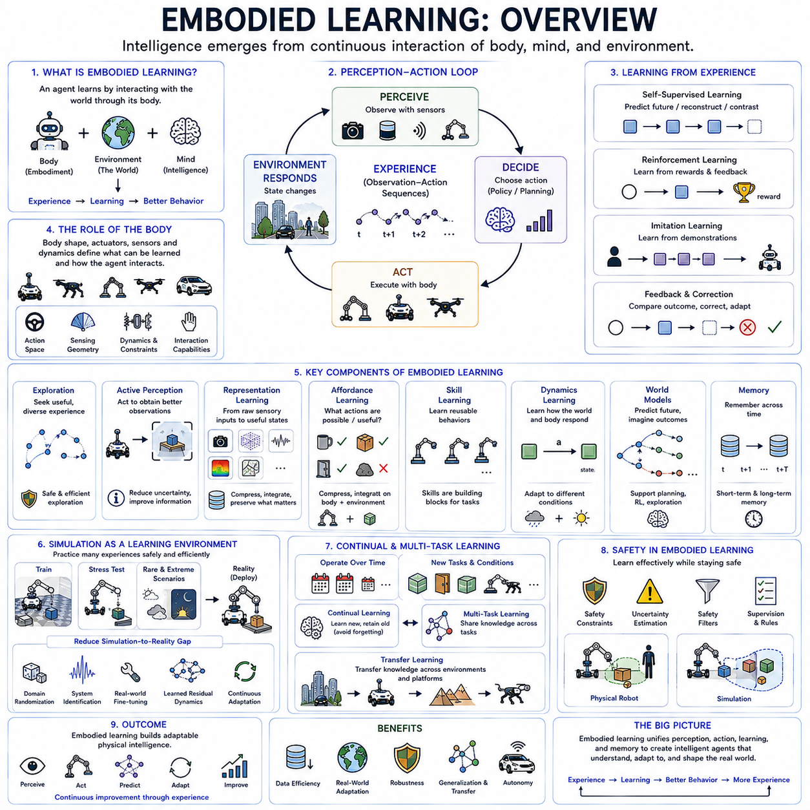
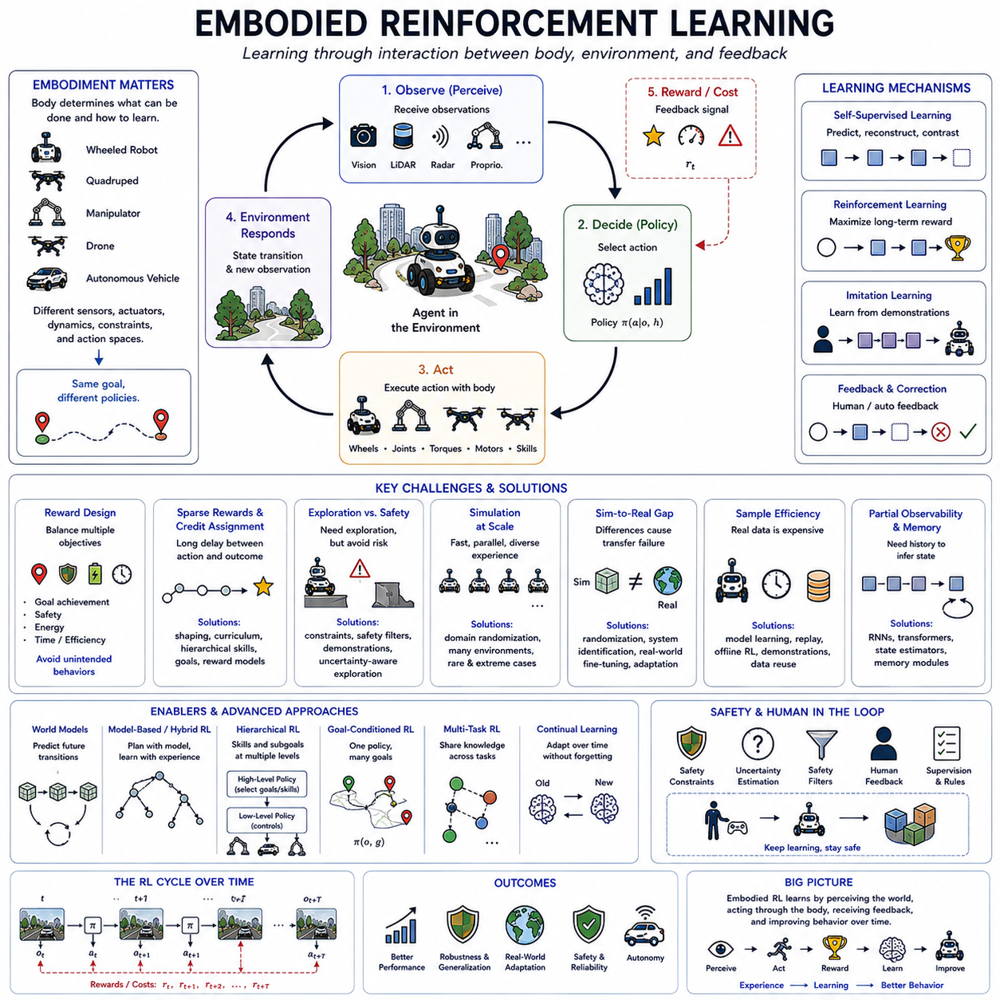
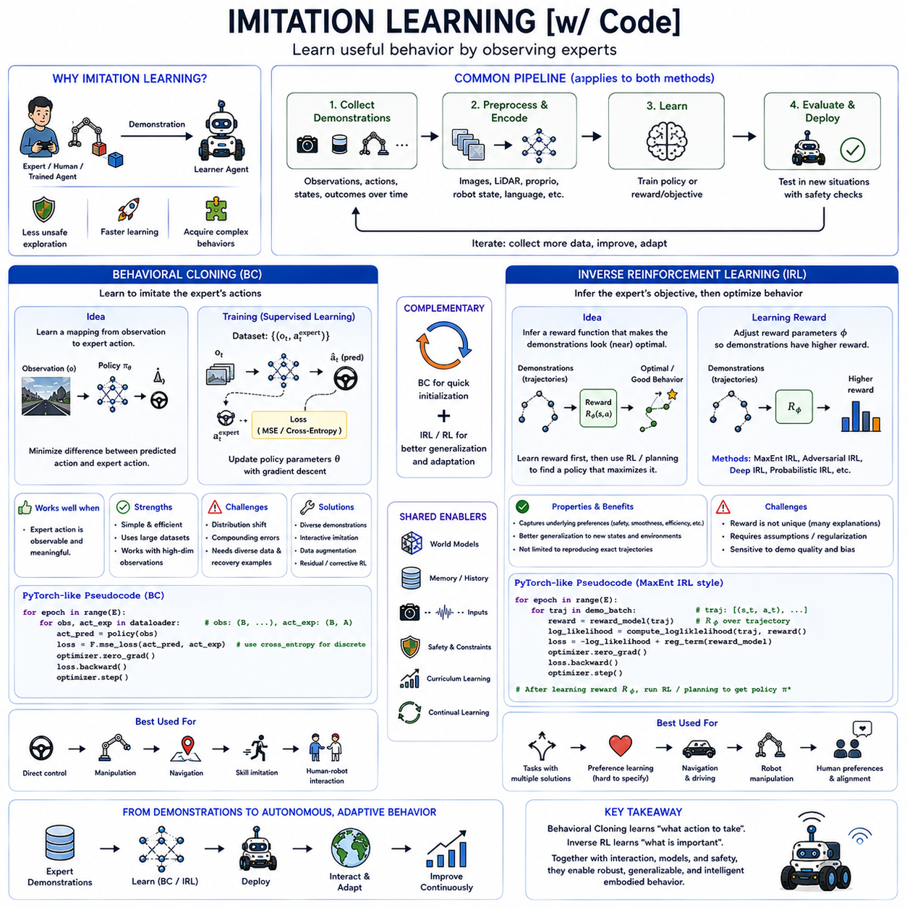
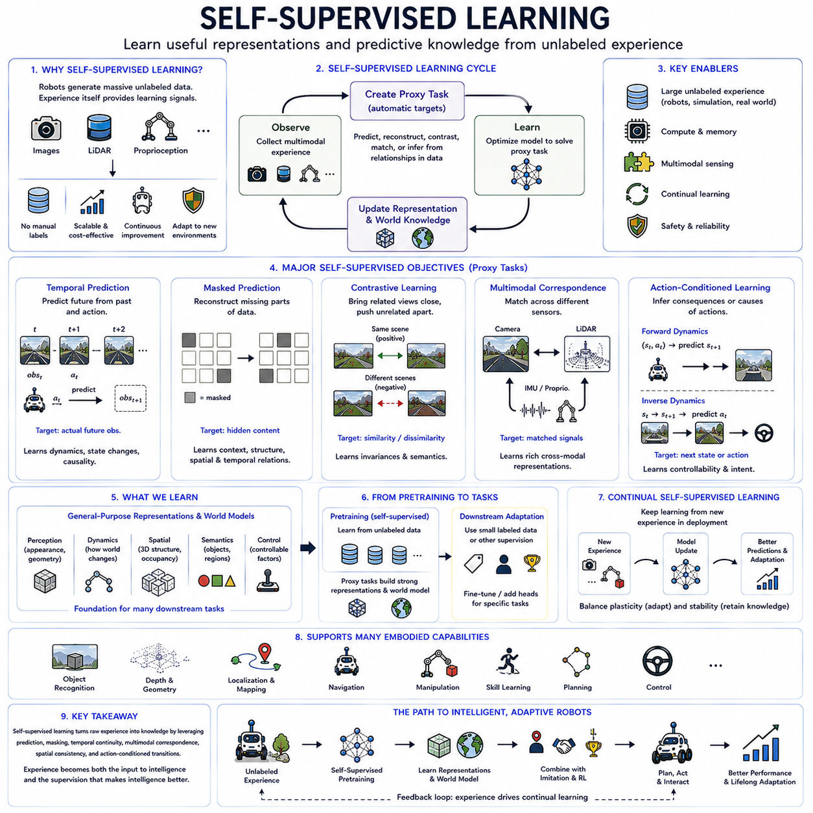
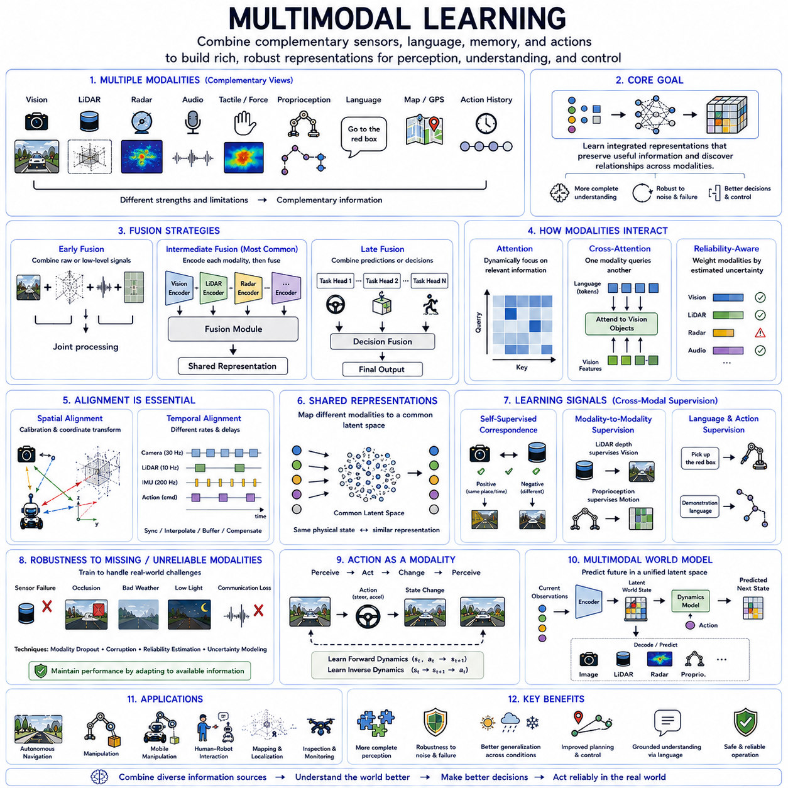
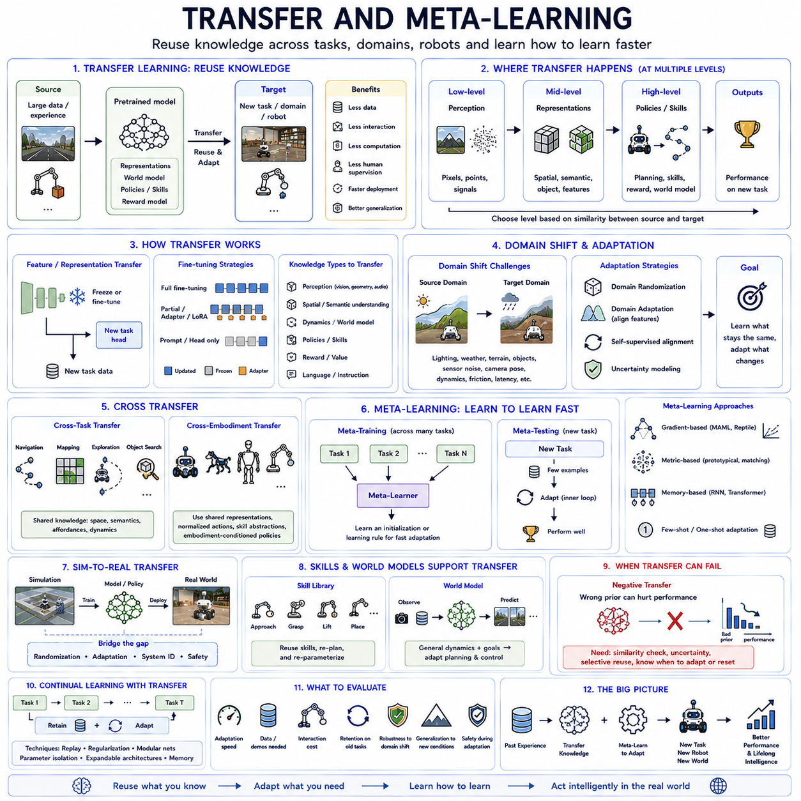
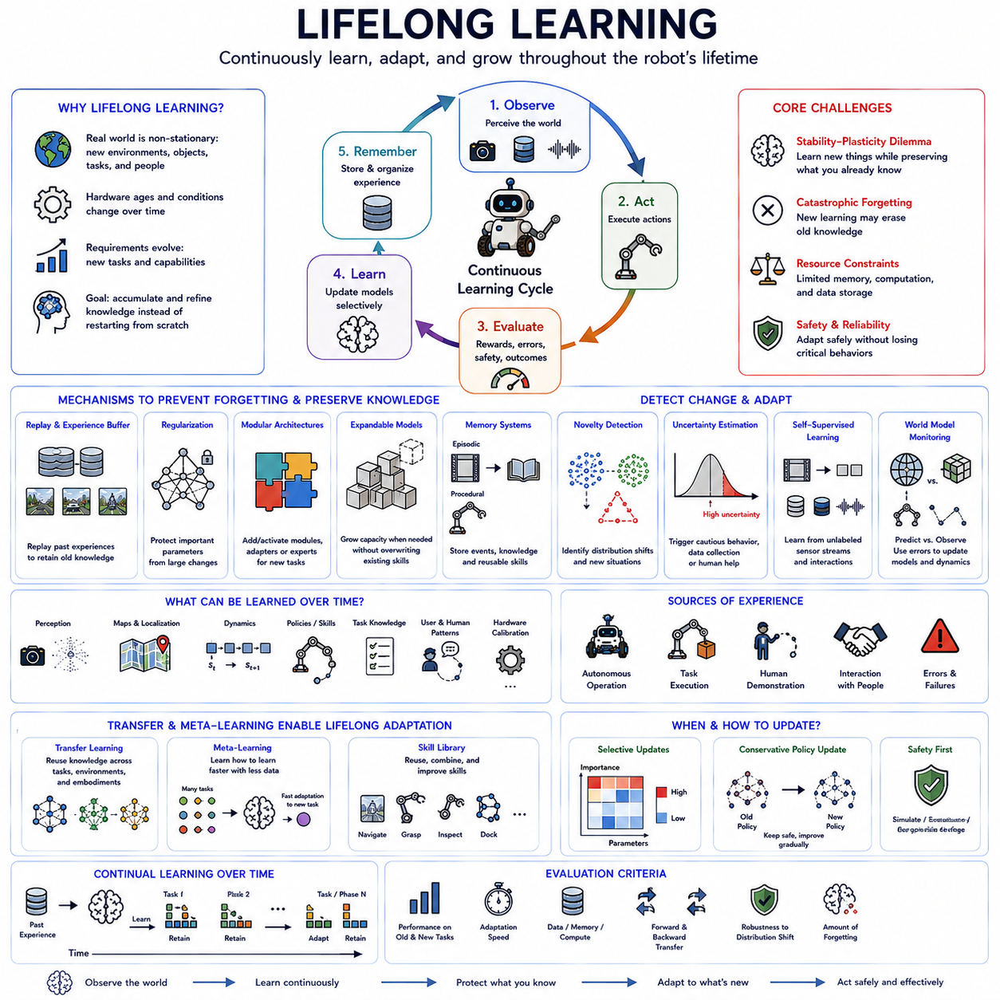
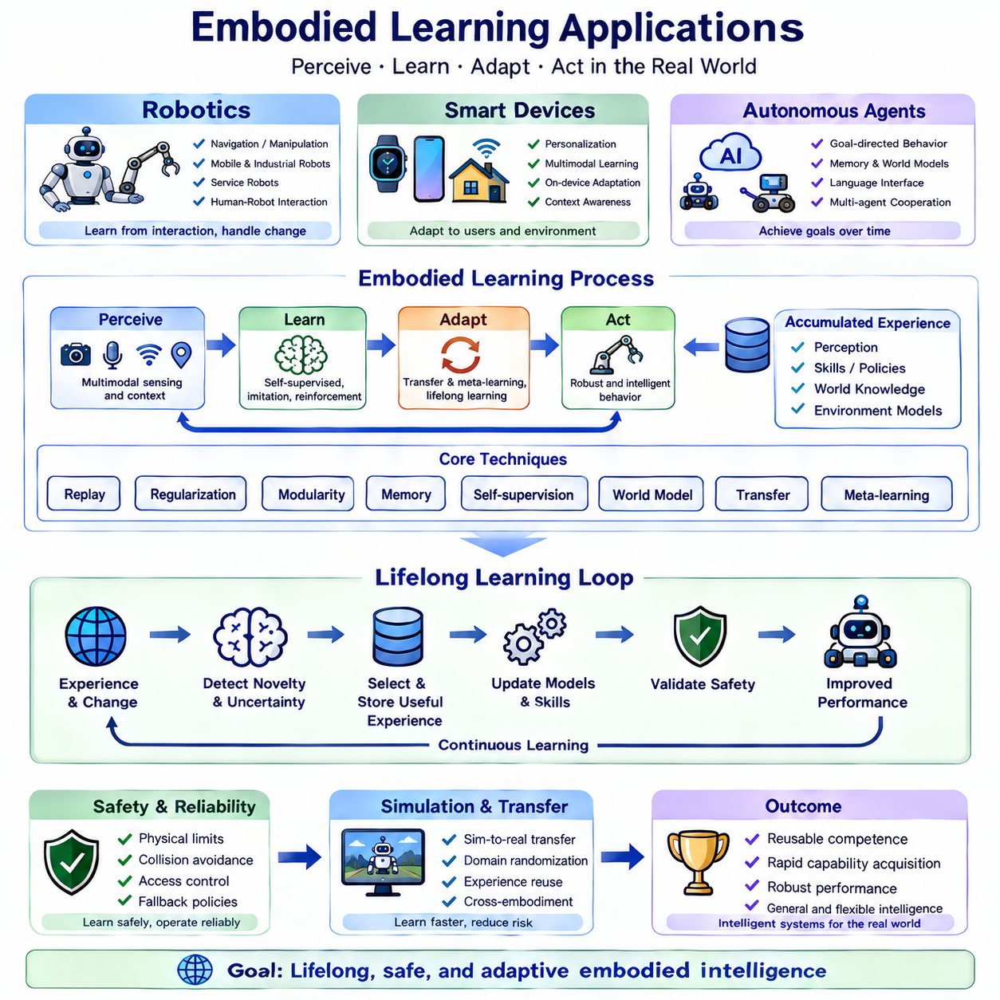
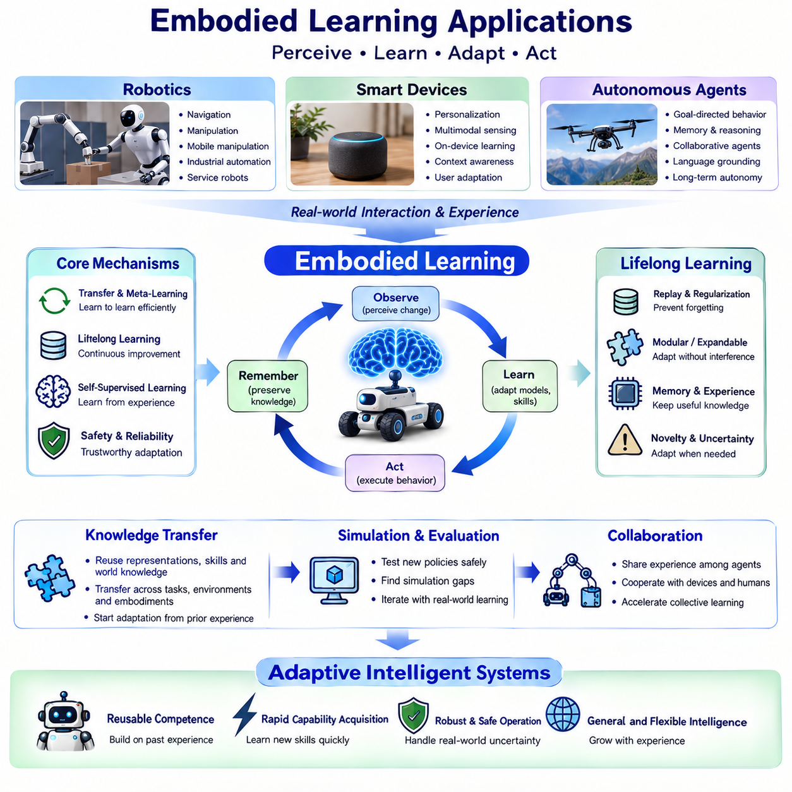

**Volume 45. Embodied AI and World Models**

# Chapter 03. Embodied Learning

## 03.00. Overview

{width="7.268055555555556in" height="7.268055555555556in"}

Embodied learning describes how an intelligent agent acquires knowledge and behavior through continuous interaction between its body, sensors, actions, and environment. Rather than treating intelligence as an isolated computation over static data, embodied learning assumes that perception and action jointly shape what can be learned. Experience emerges from acting in the world, observing consequences, and adapting future behavior from those interactions.

The body plays an active role in this learning process because its physical structure determines how the agent can sense and influence the environment. A wheeled robot, quadruped, manipulator, drone, and autonomous vehicle possess different action spaces, sensing geometries, dynamic constraints, and interaction possibilities. Learning therefore occurs within the opportunities and limitations created by embodiment rather than independently of physical form.

Embodied learning is naturally organized around the perception-action loop. Sensors provide observations of the environment and the agent\'s internal condition, while perception transforms those signals into representations useful for decision making. The agent selects and executes an action, causing both its own state and the external environment to change. New observations reveal the consequences, creating another opportunity for learning and adaptation.

This interaction produces experience in the form of temporally connected observation-action sequences. Unlike static datasets containing independent samples, embodied experience records how states evolve because of actions. Such temporal structure allows an agent to learn relationships among perception, action, physical dynamics, and consequences. These relationships provide foundations for prediction, control, planning, reinforcement learning, and the construction of internal world models.

Learning through interaction also provides a natural form of supervision. When a robot moves, manipulates an object, or navigates through an environment, later observations reveal what actually happened after earlier actions. Future states can therefore become learning targets for previous states without requiring every example to be manually labeled. This makes self-supervised learning particularly important for systems that continuously collect large quantities of embodied experience.

Reinforcement learning provides another major mechanism for embodied learning. Instead of learning only to predict what will happen, the agent learns which actions produce desirable outcomes. Rewards, costs, task success, safety violations, energy consumption, or other feedback signals can guide behavior. Through repeated interaction, the system gradually associates states and actions with their short-term and long-term consequences.

Imitation learning allows embodied agents to acquire behavior from demonstrations rather than discovering every skill through independent exploration. Human operators, expert policies, or other robots can provide examples of successful actions and trajectories. The learner attempts to reproduce useful behavior from these demonstrations, reducing the amount of risky or inefficient exploration required when learning complex manipulation, navigation, locomotion, or operational tasks.

Demonstrations alone may not cover every situation that appears during deployment. Small errors can move the agent into states that were absent from the demonstration data, causing further errors to accumulate. Embodied learning therefore benefits from combining imitation with interaction, allowing an initially demonstrated behavior to be corrected and expanded through additional experience. Reinforcement learning, corrective feedback, and online adaptation can complement demonstration-based initialization.

Exploration is fundamental because an embodied agent cannot learn important environmental relationships without experiencing sufficiently diverse states and actions. Random exploration may be acceptable in simulation but can be inefficient or unsafe on physical hardware. More structured exploration can seek unfamiliar states, informative interactions, uncertain dynamics, or novel objects while respecting constraints that prevent collisions, instability, equipment damage, or dangerous behavior.

Active perception demonstrates how action itself can improve learning and understanding. An agent does not always need to accept its current sensory viewpoint. It can rotate a camera, move around an object, approach a region, change altitude, or manipulate something to obtain more informative observations. Perception therefore becomes an interactive process in which actions are selected partly to reduce uncertainty and improve the quality of internal representations.

Representation learning is essential because raw embodied observations are typically high dimensional and multimodal. Cameras, LiDAR, radar, tactile sensors, proprioception, force measurements, audio, maps, and language can provide complementary information. Learned representations compress these observations into features or latent states that preserve information useful for prediction and action while reducing irrelevant variation in raw sensory inputs.

A strong embodied representation should capture more than appearance. Object identity, geometry, motion, spatial relationships, contact, affordances, agent state, and task relevance can all influence future behavior. Representations should also preserve temporal continuity so that an object or environmental feature remains meaningful when viewpoint, illumination, sensor visibility, or physical configuration changes. Such persistence supports reasoning beyond individual observations.

Affordance learning connects perception directly with possible action. Instead of representing an object only by category or visual appearance, the agent can learn whether it is graspable, movable, traversable, openable, pushable, or otherwise useful for a task. Affordances depend on both the environment and the capabilities of the body, making them inherently embodied relationships rather than purely visual properties.

Skill learning provides a way to organize repeated patterns of successful interaction. Low-level motor commands can be combined into reusable behaviors such as reaching, grasping, turning, climbing, docking, following, or avoiding. Once learned, these skills can serve as higher-level actions for planning. Hierarchical organization reduces the need to reason directly over every actuator command during long-horizon tasks and supports more scalable behavioral learning.

Embodied learning must also account for dynamics. The same command may produce different results depending on payload, terrain, friction, battery condition, contact state, actuator characteristics, or external disturbances. Through repeated interaction, an agent can learn how its body responds under different conditions and adapt control accordingly. This allows learning to complement analytical models when physical behavior is difficult to characterize completely in advance.

Simulation provides an important environment for acquiring embodied experience because physical interaction is expensive and limited in speed. Robots can practice navigation, manipulation, locomotion, or coordination across many simulated environments without damaging real hardware. Simulation also allows rare failures and extreme conditions to be explored safely, creating training experiences that would be difficult or unacceptable to generate deliberately in the physical world.

However, experience acquired in simulation does not automatically transfer to reality. Differences in sensing, contact, friction, actuator response, geometry, rendering, and environmental variability create a simulation-to-reality gap. Domain randomization, system identification, real-world fine-tuning, learned residual dynamics, and continuous adaptation can help reduce this gap by exposing the learner to variation and correcting inaccurate assumptions after deployment.

World models provide another important component of embodied learning by converting accumulated interaction into predictive knowledge. The agent can learn how states evolve and how actions influence future conditions, then use this internal model to imagine possible experiences. Instead of relying entirely on physical trial and error, the system can evaluate candidate behaviors internally and use predicted trajectories to support planning, policy learning, and exploration.

Memory extends embodied learning beyond immediate sensor information. Short-term memory can preserve recent observations and actions needed to infer motion or hidden state, while longer-term memory can retain knowledge about places, objects, previous interactions, skills, and task outcomes. Memory allows an agent to use experience accumulated across time rather than repeatedly treating each observation as an isolated and unfamiliar situation.

Continual learning becomes necessary when embodied systems operate for extended periods. Environments change, hardware ages, payloads vary, new tasks appear, and previously unknown objects or conditions are encountered. A fixed model trained once before deployment cannot represent every future situation. The learning system must therefore incorporate useful new experience while protecting previously acquired capabilities from catastrophic forgetting or unstable adaptation.

Multi-task learning can improve embodied intelligence by exposing an agent to diverse but related objectives. Navigation, object interaction, inspection, delivery, manipulation, and exploration may share perceptual representations and physical knowledge. Learning across tasks can produce reusable features and skills rather than separate systems for every behavior. This shared structure is particularly important for general-purpose robots expected to operate across changing missions.

Transfer learning extends this principle across environments and platforms. Knowledge learned in one building, terrain type, robot configuration, or task may provide a useful starting point elsewhere. Successful transfer requires separating generalizable structure from embodiment-specific details. Shared perception or world knowledge can be reused, while control policies and dynamics representations may require adaptation to different sensors, actuators, morphology, or operating conditions.

Safety places strong constraints on embodied learning because mistakes occur in the physical world. Exploration and online adaptation must respect collision limits, stability requirements, actuator constraints, human safety zones, and operational rules. Simulation, demonstrations, safety filters, constrained optimization, uncertainty estimation, and supervisory mechanisms can reduce risk while still allowing the system to acquire new knowledge from interaction.

Ultimately, embodied learning transforms intelligence from passive pattern recognition into an ongoing process of sensing, acting, predicting, evaluating, and adapting. The agent\'s body determines how it can interact with reality, while experience teaches the consequences of those interactions. By combining perception, self-supervised learning, imitation, reinforcement learning, world models, memory, simulation, and continual adaptation, embodied systems can progressively develop more capable and flexible physical intelligence.

## 03.01. Embodied Reinforcement Learning

{width="7.268055555555556in" height="7.268055555555556in"}

Embodied reinforcement learning extends reinforcement learning into agents that learn while physically or virtually interacting with an environment through a body. The agent does not merely map abstract states to actions; it receives sensory observations, produces motor commands, experiences physical consequences, and uses feedback to improve behavior. Learning therefore emerges from a closed interaction loop connecting perception, action, environment, and adaptation.

The embodiment of an agent determines the structure of its reinforcement-learning problem. A wheeled robot, quadruped, manipulator, drone, and autonomous vehicle have different sensors, actuators, motion constraints, dynamics, and action spaces. The same environmental objective may therefore require fundamentally different policies depending on morphology. Embodied reinforcement learning must learn behavior that is compatible with the physical capabilities and limitations of the platform.

At each interaction step, the agent receives observations describing some portion of the current situation. These observations may include images, LiDAR, radar, tactile measurements, joint positions, velocities, forces, inertial measurements, maps, or task information. Because sensors provide incomplete and noisy information, the observation is not always equivalent to the true environmental state. The policy must often infer useful hidden state from sequences of observations.

The agent then selects an action according to its policy. Actions may correspond to wheel velocities, steering commands, joint torques, target poses, flight controls, grasp commands, or higher-level skills. After execution, the environment transitions to a new state and produces another observation. Reinforcement learning uses the resulting reward or cost to determine whether the selected behavior contributed to desirable short- and long-term outcomes.

Reward design is particularly important in embodied reinforcement learning because physical behavior usually involves multiple objectives. A navigation robot may need to reach a destination while avoiding collisions, minimizing energy, maintaining stability, and respecting operational boundaries. A manipulator may balance task completion, contact force, precision, execution time, and hardware safety. Poorly designed rewards can produce unintended behaviors that technically maximize reward while violating the intended task.

Sparse rewards create another challenge because successful outcomes may occur only after long sequences of actions. A robot may receive meaningful positive feedback only after reaching a distant goal or completing a complicated manipulation task. Intermediate progress signals, demonstrations, curriculum learning, hierarchical skills, goal-conditioned learning, or learned reward models can provide additional structure that makes long-horizon credit assignment more tractable.

Credit assignment determines which earlier actions were responsible for later success or failure. Physical tasks can contain delayed consequences: an unstable foothold may cause a fall several steps later, or a poor grasp may fail only after an object is lifted. Reinforcement learning algorithms must propagate information backward through experience so that policies gradually associate earlier decisions with their eventual consequences.

Exploration is necessary because the agent cannot discover useful behavior without trying alternatives. However, unrestricted exploration is problematic for physical systems. Random actions can cause collisions, falls, excessive actuator loads, damaged objects, or unsafe interactions with humans. Embodied reinforcement learning therefore often combines exploration with constraints, safety filters, demonstrations, simulation, conservative policies, or uncertainty estimates that restrict dangerous experimentation.

Simulation provides a practical environment for large-scale reinforcement learning because millions of interactions can be generated without continuously operating physical hardware. Multiple simulated agents can collect experience in parallel, accelerating policy training dramatically. Simulation also permits controlled exposure to rare failures, extreme conditions, and randomized environments that would be expensive or unsafe to reproduce repeatedly with real robots.

Policies trained in simulation must nevertheless cope with the simulation-to-reality gap. Differences in friction, contact, actuator response, sensor noise, latency, geometry, lighting, terrain, and other physical properties can cause behavior that succeeds in simulation to fail after deployment. Domain randomization exposes the policy to variations during training, while system identification and real-world adaptation can reduce discrepancies for a particular physical platform.

Real-world reinforcement learning provides information that simulation cannot reproduce perfectly. Physical interaction reveals unmodeled effects such as mechanical compliance, wear, backlash, vibration, changing traction, sensor artifacts, and complex contact behavior. A practical learning architecture can therefore begin with extensive simulation training and then use carefully constrained real-world experience to calibrate, refine, and adapt policies to actual operating conditions.

Sample efficiency is critical because real embodied experience is expensive. A robot may require seconds or minutes for an interaction that can be simulated much faster, while mechanical components have finite operational lifetimes. Algorithms that reuse collected trajectories, learn predictive models, exploit demonstrations, or perform offline learning can extract more useful information from each physical interaction and reduce the amount of hardware experimentation required.

Offline reinforcement learning allows policies to be trained from previously collected experience without immediately interacting with the environment. Logs from robot operation, demonstrations, teleoperation, simulation, or previous policies can provide state-action-transition sequences. This is attractive for embodied systems because large historical datasets can be exploited safely, although the learned policy must avoid selecting actions far outside the distribution represented by the available data.

Imitation learning and reinforcement learning are highly complementary. Demonstrations can provide a strong initial policy that already performs meaningful behavior, while reinforcement learning subsequently improves performance through interaction and task feedback. This reduces the need for the agent to discover basic behavior through random exploration. Human demonstrations can therefore serve as behavioral priors from which more autonomous adaptation begins.

World models can further improve embodied reinforcement learning by learning how actions influence future states. Instead of evaluating every behavioral hypothesis through physical execution, the agent can simulate candidate futures internally. Model-based reinforcement learning uses these predictions for planning or policy improvement, while model-free reinforcement learning learns behavior directly from experience. Hybrid architectures can combine predictive reasoning with rapid learned policies.

Latent world models are particularly useful when observations contain high-dimensional sensory data. Images, point clouds, tactile measurements, and proprioception can be encoded into compact latent states that preserve behaviorally relevant information. A learned dynamics model predicts transitions within this latent space, enabling imagined rollouts without reconstructing every sensor measurement. Reinforcement learning can then optimize policies using both real and internally generated experience.

Memory becomes important when the environment is partially observable. A robot may temporarily lose sight of an object, encounter visually similar locations, or need to remember instructions received earlier. Recurrent networks, transformers, external memory, or explicit state estimators can integrate observations over time. The resulting internal state allows the reinforcement-learning policy to condition actions on interaction history rather than only the instantaneous sensor input.

Hierarchical reinforcement learning organizes behavior across multiple levels of abstraction. Low-level policies may control locomotion, steering, grasping, or stabilization, while higher-level policies select reusable skills or subgoals. A mobile manipulator might first navigate toward an object, position its base, reach, grasp, and then transport the object. Hierarchical organization reduces effective planning depth and makes long-horizon embodied tasks more manageable.

Goal-conditioned reinforcement learning allows one policy to pursue different objectives by providing the desired goal as part of its input. Goals may represent spatial positions, object configurations, target images, semantic conditions, or task instructions. Instead of training an entirely separate policy for every objective, the system learns relationships among current state, desired state, and actions, improving reuse of experience across related tasks.

Multi-task reinforcement learning similarly seeks shared knowledge across different behaviors. Navigation, inspection, manipulation, delivery, exploration, and docking may rely on common perception and motor capabilities. Joint learning can produce reusable representations and skills that accelerate new tasks. The challenge is to prevent incompatible objectives from interfering with one another while preserving knowledge that genuinely transfers across behaviors.

Curriculum learning can progressively increase task difficulty as the agent develops competence. A locomotion policy may begin on simple flat terrain before encountering slopes, obstacles, loose surfaces, and disturbances. A manipulation agent may first grasp isolated objects before handling cluttered scenes. This progression reduces the difficulty of exploration and allows previously acquired skills to become foundations for increasingly complex embodied behavior.

Continual reinforcement learning extends adaptation beyond initial training. Robots operating for months or years encounter changing environments, payloads, hardware characteristics, users, and mission requirements. The learning system should incorporate useful new experience without destroying previously acquired skills. Replay, regularization, modular policies, skill libraries, and controlled parameter updates can help balance plasticity for new learning with stability of established behavior.

Safety remains one of the defining constraints of embodied reinforcement learning. Policies must respect collision limits, actuator envelopes, stability conditions, human safety requirements, and operational rules even while learning. Safety layers can override unsafe actions, constrained reinforcement learning can incorporate explicit limits, and uncertainty-aware systems can become conservative when encountering unfamiliar situations. Learning performance cannot be separated from physical risk management.

Human feedback can also guide embodied reinforcement learning when numerical reward functions are difficult to specify. Operators may rank behaviors, provide corrections, demonstrate preferred actions, or intervene when the agent approaches unsafe states. Learned preference or reward models can convert such feedback into training signals. This enables optimization toward qualities such as smoothness, usefulness, predictability, or socially appropriate behavior that are difficult to encode manually.

Ultimately, embodied reinforcement learning transforms physical interaction into behavioral knowledge. The agent perceives its environment, acts through its body, observes consequences, receives feedback, and updates its policy. Simulation, demonstrations, world models, memory, hierarchical skills, offline data, continual learning, and safety mechanisms make this cycle increasingly practical. Through repeated experience, the system develops policies grounded not only in data, but in the consequences of acting within a physical world.

## 03.02. Imitation Learning [w/Code]

{width="7.268055555555556in" height="7.268055555555556in"}

Imitation learning enables an embodied agent to acquire behavior by observing demonstrations produced by humans, expert controllers, or previously trained agents. Instead of discovering every action through reinforcement learning and trial-and-error exploration, the learner uses demonstrated state-action relationships as structured experience. This can substantially reduce unsafe experimentation and accelerate the acquisition of complex behaviors in robotics and autonomous systems.

In embodied settings, demonstrations may contain images, LiDAR observations, proprioceptive measurements, object states, robot configurations, actions, and task outcomes recorded over time. These demonstrations encode not only which actions were chosen but also the context in which they were appropriate. The learning problem is therefore to infer a policy or objective that reproduces useful behavior under new observations rather than merely replaying a fixed trajectory.

Behavioral cloning is the most direct form of imitation learning. It treats expert demonstrations as supervised learning data and trains a policy to predict the expert action from the observed state or sensory input. If the dataset contains pairs of observations and demonstrated actions, the policy learns a mapping from observation to action by minimizing the difference between its predicted action and the action selected by the demonstrator.

For continuous robot control, behavioral cloning may predict steering angles, wheel velocities, joint targets, torques, end-effector commands, or other continuous actions. For discrete decision problems, it may predict actions such as move, stop, grasp, release, turn, or select a reusable skill. The exact output representation should match the level at which demonstrations provide reliable behavioral information and the physical controller expects commands.

A typical behavioral-cloning pipeline begins by collecting demonstrations and converting them into observation-action samples. Sensor observations are preprocessed or encoded, and the resulting representation is passed through a policy network. The network produces an action prediction, which is compared with the demonstrated action using an appropriate supervised loss. Gradient-based optimization then adjusts the network parameters so that predicted behavior increasingly resembles the expert.

In code, this process commonly resembles ordinary supervised training. A dataset loader provides batches containing observations and expert actions, a neural network computes predicted actions, and a loss function measures prediction error. Mean squared error can be used for continuous actions, while cross-entropy is suitable for discrete choices. The optimizer repeatedly updates the policy using gradients calculated from this imitation objective.

The simplicity of behavioral cloning is an important advantage because it allows large demonstration datasets to be used with standard deep-learning pipelines. It can also learn directly from high-dimensional observations when sufficiently expressive perception encoders are available. Cameras, multimodal sensor features, language instructions, and robot state can be combined as policy inputs, enabling demonstrations to teach integrated perception-to-action behavior.

However, behavioral cloning suffers from distribution shift. During training, the policy primarily observes states visited by the expert, but during deployment even a small prediction error can move the agent into unfamiliar states. The policy may then make larger errors because those situations were poorly represented in the demonstrations. These deviations can accumulate over time, producing the compounding-error problem that is particularly serious in long-horizon embodied tasks.

Increasing dataset diversity can reduce this problem by collecting demonstrations across different environments, starting states, object configurations, disturbances, and recovery situations. Demonstrations should ideally contain not only ideal task execution but also corrective behavior. A robot that has seen how an expert recovers from misalignment, wheel slip, an imperfect grasp, or unexpected obstacle motion is better prepared to handle deviations encountered during autonomous operation.

Interactive imitation learning can further address distribution mismatch by allowing the learner to collect expert guidance in states that its own policy actually visits. Instead of depending entirely on a fixed offline dataset, the system executes its current policy and obtains corrections or expert actions when necessary. The training distribution therefore gradually expands toward situations induced by the learner itself, making the policy more robust to its own errors.

Behavioral cloning is particularly appropriate when the expert action is observable and meaningful as a direct training target. In many situations, however, individual expert actions may vary even though several strategies accomplish the same underlying goal. Simply copying actions can then reproduce superficial behavior without capturing why those actions were chosen. This motivates methods that infer the objective or preference underlying demonstrations rather than only the action mapping.

Inverse reinforcement learning addresses this problem by attempting to infer a reward function from demonstrated behavior. Conventional reinforcement learning assumes that the reward is known and searches for a policy that maximizes it. Inverse reinforcement learning reverses this relationship: demonstrations are observed first, and the learner seeks a reward or cost structure under which the demonstrated behavior would appear rational or near-optimal.

The inferred reward may represent preferences that are difficult to specify manually. A human driver, for example, may simultaneously value safety, progress, smoothness, clearance, comfort, and compliance with environmental conventions. A robot operator may demonstrate manipulation strategies that implicitly balance speed, force, stability, and object protection. Inverse reinforcement learning attempts to recover such objectives from behavior rather than requiring every preference to be explicitly engineered.

Once a reward model has been inferred, reinforcement learning or planning can optimize a policy according to that reward. This separates the imitation process into two conceptual stages: understanding what the demonstrator appears to value and then finding behavior that satisfies those inferred preferences. As a result, the learned policy is not necessarily restricted to reproducing the exact trajectories contained in the demonstrations.

This distinction can improve generalization. If an expert demonstrates one route around an obstacle, behavioral cloning may primarily learn to reproduce the observed steering pattern. Inverse reinforcement learning can instead infer that the important objective involves reaching the goal while avoiding obstacles and maintaining suitable margins. A planner may then discover a different but equally valid trajectory when environmental geometry changes.

Reward inference is nevertheless ambiguous because multiple reward functions can explain the same demonstrated behavior. An observed expert trajectory does not uniquely reveal whether the expert prioritized distance, energy, safety, comfort, or some combination of these properties. Inverse reinforcement learning therefore requires assumptions, regularization, feature representations, or probabilistic formulations that constrain which inferred objectives are considered plausible.

Maximum-entropy formulations provide one influential approach by treating expert behavior probabilistically rather than assuming a single perfectly optimal trajectory. Demonstrations with higher reward are assigned higher probability, while alternative behaviors remain possible. This captures the fact that human and robotic experts may exhibit variation and do not always choose exactly the same action even when pursuing similar goals.

Deep inverse reinforcement learning extends reward inference to environments where manually defined state features are insufficient. Neural networks can learn reward functions from images, spatial representations, object relations, or other complex observations. This makes inverse reinforcement learning more compatible with embodied perception, although the resulting reward models may be less interpretable and can inherit biases or limitations from the demonstration dataset.

Behavioral cloning and inverse reinforcement learning can therefore be viewed as complementary approaches. Behavioral cloning asks which action the expert would take in the current situation, while inverse reinforcement learning asks what objective could explain the expert\'s behavior. Behavioral cloning is simpler and often more direct, whereas inverse reinforcement learning can provide greater flexibility when the learned system must adapt expert intent to new states or planning contexts.

Hybrid systems can combine both methods. Behavioral cloning can provide an initial policy that quickly reproduces demonstrated competence, while inverse reinforcement learning or reinforcement learning subsequently improves behavior according to inferred objectives. The cloned policy can also provide a useful initialization that reduces the amount of exploration required before reward-driven optimization begins.

World models can strengthen imitation learning by representing the predicted consequences of actions. Rather than learning only a direct observation-to-action mapping, the agent can use demonstrations to understand how expert actions transform the environment over time. Candidate behaviors can then be simulated internally and compared according to demonstrated goals or inferred rewards, linking imitation learning with predictive planning and model-based reinforcement learning.

Temporal modeling is especially important because expert demonstrations are sequences rather than isolated state-action pairs. Earlier actions influence later observations, and the correct decision may depend on task history. Recurrent networks, transformers, state estimators, or explicit memory systems can represent this context, enabling the imitation policy to reason about progress, previous actions, hidden state, and long-term dependencies within demonstrated tasks.

Multimodal demonstrations can provide richer supervision by combining robot state, vision, language, and human input. Language instructions may describe the goal, while demonstrations show how the physical system achieves it. Vision provides environmental context, and proprioception describes the body\'s configuration. A multimodal policy can learn relationships among instructions, perception, embodiment, and action, supporting more flexible generalization across tasks.

Safety is one of the strongest motivations for imitation learning in physical systems. Demonstrations provide successful behavioral examples before the agent begins autonomous exploration, reducing the chance that initial learning requires dangerous random actions. However, demonstrations are not automatically safe in every new situation. Deployment still requires uncertainty estimation, safety constraints, collision checking, fallback behavior, and monitoring for states outside the demonstrated distribution.

The quality of imitation learning ultimately depends on demonstration quality and coverage. Inconsistent, suboptimal, or poorly synchronized data can teach undesirable behavior, while narrow datasets may produce policies that fail outside familiar conditions. Demonstration collection should therefore consider expert competence, sensor calibration, action timing, environment diversity, failure recovery, and representation of rare but operationally important situations.

Ultimately, imitation learning allows embodied systems to transform expert experience into reusable behavioral knowledge. Behavioral cloning learns direct mappings from observations to demonstrated actions, while inverse reinforcement learning seeks the objectives that make those actions meaningful. Combined with interaction, world models, reinforcement learning, memory, and safety mechanisms, imitation learning provides a practical route from human or expert demonstrations toward increasingly autonomous and adaptive physical intelligence.

## 03.03. Self Supervised Learning

{width="7.268055555555556in" height="7.268055555555556in"}

Self-supervised learning enables an embodied agent to learn useful representations and predictive knowledge from raw experience without requiring every observation to be manually labeled. Instead of depending on externally supplied annotations, the learning system constructs supervisory signals from relationships already present within sensory data. Temporal continuity, multimodal correspondence, spatial structure, and action consequences can therefore become learning signals.

This principle is particularly valuable for embodied intelligence because robots continuously generate enormous quantities of unlabeled data while operating. Cameras capture image sequences, LiDAR produces geometric measurements, proprioceptive sensors describe body motion, and actions create observable environmental changes. Manually labeling this continuous stream would be prohibitively expensive, whereas self-supervision allows experience itself to provide training targets.

The central idea is to create a learning problem in which one part of available information must be predicted from another. A model may predict a future observation from previous observations, reconstruct missing information, determine whether two measurements correspond to the same physical situation, or estimate how an action changes the environment. Solving these proxy tasks encourages internal representations to capture structure useful for later perception, planning, and control.

Temporal prediction provides one of the most natural self-supervised objectives for embodied systems. Given observations at time t and an executed action, the model can predict the observation or latent state at time t+1. The actual future observation then becomes the training target automatically. Repeated across large trajectories, this process teaches relationships among environmental state, agent motion, actions, and physical dynamics without manually specifying labels.

Prediction does not necessarily need to occur directly in raw sensory space. Generating every pixel of a future image or every point in a LiDAR scan may consume substantial computation while emphasizing details irrelevant to behavior. Instead, observations can be encoded into compact latent representations, and the learning objective can predict future latent states. This allows the system to concentrate on persistent and behaviorally meaningful environmental structure.

Masked prediction provides another powerful self-supervised mechanism. Portions of an image, sensor sequence, point cloud, or latent representation are intentionally hidden, and the model learns to reconstruct or predict the missing information from the remaining context. To solve this task, the network must learn relationships among objects, geometry, temporal context, and surrounding observations rather than relying only on isolated local features.

Contrastive learning develops representations by identifying which observations should be considered related and which should remain distinguishable. Different views of the same object, nearby frames from a trajectory, or synchronized measurements from multiple sensors can form positive relationships. Unrelated scenes or temporally distant experiences may provide contrasting examples. The learned representation brings semantically or physically related experiences closer while preserving distinctions among different situations.

Embodied systems provide especially rich opportunities for contrastive learning because the agent\'s movement naturally creates multiple views of the same physical world. A robot approaching an object observes changes in scale and viewpoint while the object\'s identity persists. By associating these observations, the representation can become less sensitive to superficial visual variation and more sensitive to persistent environmental properties relevant to interaction.

Multimodal self-supervision exploits correspondence among different sensors. Camera images and LiDAR measurements recorded at the same time describe overlapping aspects of the same environment, while visual motion may correspond to inertial or proprioceptive measurements. One modality can therefore supervise another without manually generated labels. Such cross-modal learning can create representations that combine appearance, geometry, motion, and body state.

Action provides an additional source of supervision that distinguishes embodied learning from passive observation. When the agent issues a motor command, subsequent sensory changes reveal the consequences of that action. The system can learn forward dynamics by predicting future state from current state and action, or inverse dynamics by predicting which action likely produced an observed transition. Both objectives encourage representations that capture controllable aspects of the environment.

Inverse dynamics objectives can be particularly useful for identifying behaviorally relevant information. If two observations differ because the robot moved, predicting the responsible action requires the representation to capture motion and controllable state changes. Features unrelated to action may receive less emphasis. This can help separate information important for physical interaction from visual details that are statistically prominent but operationally irrelevant.

Forward and inverse models can also be trained together. A forward model learns what is likely to happen after an action, while an inverse model learns which action connects two observed states. Their combination can produce representations that capture both environmental dynamics and controllability. These representations provide useful foundations for model-based reinforcement learning, planning, navigation, manipulation, and adaptive control.

Self-supervised representation learning can significantly reduce dependence on task-specific labeled datasets. A perception encoder may first learn from thousands of hours of unlabeled robot operation and later be adapted using a much smaller collection of labeled examples. Object detection, terrain classification, traversability estimation, manipulation, or navigation tasks can then reuse general representations acquired from broad embodied experience.

Pretraining and downstream adaptation therefore form an important workflow. During pretraining, the model learns broadly useful structure through prediction, reconstruction, contrastive objectives, or multimodal correspondence. During downstream training, task-specific supervision adjusts the representation or adds specialized prediction heads. This separation allows expensive embodied data to contribute to many different tasks rather than being collected independently for each application.

Self-supervised learning also supports world-model construction. A world model requires representations that preserve state information and dynamics that predict how those states evolve. Temporal and action-conditioned objectives naturally provide both. By repeatedly predicting future latent states and comparing them with actual observations, the system gradually learns an internal predictive model grounded in experienced transitions.

Longer-horizon prediction introduces additional challenges because uncertainty increases as predictions extend further into the future. Small modeling errors can accumulate, and multiple future outcomes may be plausible. Self-supervised world models therefore benefit from probabilistic representations, uncertainty estimation, multi-step prediction objectives, or abstract latent states that avoid attempting to predict every unpredictable sensory detail.

Memory becomes important when the current observation does not contain enough information to solve a self-supervised objective. An object may become occluded, the robot may revisit a location, or important events may have occurred several seconds earlier. Recurrent networks, transformers, and explicit memory systems can integrate information across time, allowing representations to capture persistent state and longer-term dependencies within embodied experience.

Spatial learning can also emerge without explicit semantic labels. Robot motion provides geometric relationships among observations, while depth sensors, odometry, and viewpoint changes provide information about three-dimensional structure. Self-supervised objectives can exploit these relationships to learn depth, motion, correspondence, occupancy, or spatial representations. Such knowledge supports localization, mapping, navigation, and manipulation even when semantic annotation is limited.

Self-supervised learning can extend from individual sensor frames to entire trajectories. A trajectory contains information about where the agent moved, what actions were taken, which states were revisited, and what outcomes followed. Models can learn sequence-level representations that encode task progress, environmental context, or behavioral phases. These representations can later support long-horizon planning and hierarchical decision making.

Simulation provides a scalable source of experience for developing self-supervised objectives. Large quantities of multimodal trajectories can be generated across diverse environments, robot configurations, and interactions. Because self-supervised learning does not require manual annotation, simulated and real trajectories can often share similar training objectives. Real-world experience can subsequently adapt representations to sensor characteristics and physical phenomena missing from simulation.

Continual self-supervised learning allows deployed robots to keep improving their representations from operational data. New environments, lighting conditions, terrains, objects, payloads, and sensor characteristics continuously provide fresh experience. Instead of discarding this data, the system can use prediction errors and cross-modal consistency as ongoing learning signals. This creates a pathway toward models that adapt throughout their operational lifetime.

However, continual adaptation must be controlled carefully. Learning aggressively from recent experience can cause representations to drift or forget previously useful knowledge. Replay buffers, regularization, frozen foundation components, modular adaptation, and selective updates can preserve stable capabilities while incorporating new environmental information. The objective is to balance plasticity for adaptation with stability for reliable operation.

Self-supervised learning does not eliminate the need for supervised learning, imitation learning, or reinforcement learning. Instead, it provides a broad representational foundation upon which these methods can operate more efficiently. Self-supervision can learn how the world is structured and how it changes, while imitation provides examples of desirable behavior and reinforcement learning determines which actions produce valuable outcomes.

For autonomous robots, this combination can create a powerful learning hierarchy. Continuous unlabeled experience develops perception and predictive representations, demonstrations teach useful skills, reinforcement learning improves behavior through outcomes, and world models support internal simulation and planning. Each learning mechanism contributes a different form of information while sharing representations grounded in the same embodied experience.

The broader importance of self-supervised learning lies in its ability to convert ordinary operation into a continuous source of knowledge. Every movement generates temporal relationships, every action produces consequences, every sensor pair provides cross-modal correspondence, and every new observation can test previous predictions. The robot therefore does not require explicit human annotation for every useful learning event encountered during deployment.

Ultimately, self-supervised learning provides a scalable mechanism for transforming raw embodied experience into structured internal knowledge. By exploiting prediction, masking, temporal continuity, multimodal correspondence, spatial consistency, and action-conditioned transitions, an agent can learn representations that support perception, world modeling, planning, and control. Experience becomes both the input to intelligence and the supervision through which that intelligence progressively improves.

## 03.04. Multimodal Learning

{width="7.268055555555556in" height="7.268055555555556in"}

Multimodal learning enables embodied intelligent systems to construct richer representations by combining information from multiple sensory and symbolic modalities. A robot rarely understands its environment through a single sensor alone. Vision, LiDAR, radar, audio, tactile sensing, proprioception, language, maps, and action history provide complementary perspectives that together form a more complete description of the physical world and the agent's relationship with it.

Each modality captures different properties of the environment and has distinct strengths and limitations. Cameras provide appearance, texture, color, and semantic information, while LiDAR measures geometric structure and distance. Radar can remain effective under difficult weather or visibility conditions, and tactile or force sensors reveal physical contact. Proprioception describes the robot's internal configuration, motion, and actuator state during interaction.

Multimodal learning seeks representations that preserve useful information from these heterogeneous sources while discovering relationships among them. Instead of processing every modality as an isolated channel, the system learns how observations correspond across sensors and time. A vehicle detected visually may correspond to a cluster of LiDAR points and a radar return, while its motion can simultaneously influence optical flow, range measurements, and predicted future position.

Sensor fusion is therefore closely related to multimodal learning, although the two concepts are not identical. Traditional sensor fusion often combines measurements using explicitly designed probabilistic or geometric models. Multimodal learning can instead learn correspondence, weighting, and interaction patterns directly from data. Modern embodied systems frequently combine both approaches, using physical calibration and estimation together with learned feature-level or representation-level fusion.

Multimodal processing can occur at several stages of an architecture. Early fusion combines relatively low-level sensor information before extensive independent processing. Intermediate fusion first extracts modality-specific features and then integrates them into a shared representation. Late fusion allows separate models to produce predictions that are combined afterward. Hybrid architectures may exchange information repeatedly across several layers rather than relying on a single fusion point.

Early fusion can preserve detailed cross-modal relationships because information is combined before strong compression occurs. However, raw sensor streams often have different dimensions, sampling rates, coordinate systems, noise characteristics, and physical meanings. Directly combining camera pixels, point clouds, inertial measurements, and other signals can therefore be difficult. Practical systems commonly transform observations into compatible spatial or learned representations before performing deeper integration.

Intermediate fusion is especially attractive for embodied AI because modality-specific encoders can first extract useful features from each sensor. A vision encoder may identify appearance and semantic structure, while a point-cloud encoder represents geometry and an inertial encoder captures motion. These features can then interact through concatenation, attention, cross-attention, shared latent spaces, or other learned mechanisms that determine which information should influence the integrated state.

Attention mechanisms provide a flexible method for multimodal integration. Instead of assigning fixed importance to every sensor, the network can dynamically emphasize information that is relevant to the current context. Vision may dominate when semantic recognition is required, while LiDAR may become more important for precise geometry. During poor illumination, radar or other robust sensors can contribute more strongly if the model has learned how reliability changes with conditions.

Cross-attention allows one modality to query information contained in another. Visual features associated with an object can attend to geometric features representing the same region, or language tokens describing a task can attend to objects visible in the scene. Such interactions allow the system to establish relationships between semantic meaning, physical geometry, task instructions, and possible actions rather than merely concatenating independent sensor features.

Spatial alignment is fundamental when multiple sensors observe the same physical environment. Cameras, LiDAR units, radar sensors, and robot coordinate frames generally have different origins and orientations. Calibration and geometric transformation are therefore required to establish correspondence among measurements. Learned multimodal representations can improve robustness, but they do not eliminate the need for accurate spatial relationships when physical localization, mapping, or control depends on metric consistency.

Temporal alignment is equally important because different sensors may operate at different frequencies and experience different processing or communication delays. A camera frame, LiDAR scan, inertial sample, and actuator command may represent slightly different physical moments. Synchronization, timestamping, interpolation, buffering, and latency compensation help ensure that fused observations describe a coherent state rather than incorrectly combining measurements from incompatible times.

Shared latent representations provide another strategy for multimodal learning. Modality-specific observations are encoded into a common latent space where related information can be compared or combined. Ideally, representations corresponding to the same physical state remain associated even when they originate from different sensors. This creates a common internal language through which vision, geometry, motion, language, and action can contribute to perception and decision making.

Self-supervised learning is particularly valuable for constructing these shared spaces because synchronized sensors naturally provide correspondence signals. Camera and LiDAR measurements collected at the same place and time describe the same environment without requiring manual annotation. The model can learn to associate corresponding observations while separating unrelated examples. Large quantities of normal robot operation can therefore provide multimodal training data automatically.

Multimodal learning can also use one modality to supervise another. Depth measurements from LiDAR may provide geometric learning signals for visual representations, while proprioception or inertial measurements can help visual models learn motion. Language associated with demonstrations can provide semantic structure for observed actions. This cross-modal supervision allows information available during training to improve representations even when some modalities are unavailable during later operation.

Missing modalities are an important practical problem because real robotic sensors can fail, become occluded, lose communication, or become unreliable. A multimodal model that always assumes every sensor is available may fail catastrophically when one input disappears. Training with modality dropout, sensor corruption, partial observations, or reliability estimation can encourage the system to maintain useful behavior while dynamically redistributing dependence among remaining information sources.

Sensor uncertainty should therefore be represented rather than treating every measurement as equally trustworthy. Rain, fog, dust, glare, vibration, multipath effects, occlusion, and hardware faults can degrade different sensors in different ways. An uncertainty-aware multimodal system can estimate confidence for individual modalities or features and reduce their influence when reliability decreases. Robust fusion depends not only on combining information but also on knowing when information should not be trusted.

Multimodal learning becomes particularly powerful when language is included. Language can specify goals, describe objects, communicate constraints, explain spatial relationships, or provide high-level instructions. Vision-language models connect textual concepts with visual observations, while vision-language-action architectures extend this relationship into physical behavior. An embodied agent can therefore connect what it sees with what it is told and what actions it can perform.

Language grounding requires linguistic concepts to become associated with physical entities, states, and actions. An instruction such as moving toward a particular object is useful only if the agent can identify the referenced object, determine its spatial relationship to the robot, and select appropriate behavior. Multimodal learning provides the representational bridge connecting symbolic instructions with sensory observations and embodied action possibilities.

Action itself can be treated as another modality. Sensor observations describe what the agent perceives, while action sequences describe how the agent interacts with the environment. By jointly modeling observations and actions, the system can learn which environmental features are controllable and how motor commands transform physical states. This relationship is central to embodied world models, imitation learning, reinforcement learning, and predictive control.

Multimodal world models extend this principle by learning a shared state representation from multiple sensors and predicting how that state evolves under action. Instead of separately forecasting future images, point clouds, robot poses, and other measurements, the model can predict a compact latent world state from which relevant future information is inferred. This creates a unified predictive representation connecting perception, dynamics, and action.

Memory helps maintain multimodal coherence when information is temporarily unavailable. An object visible in an earlier camera frame may later become occluded while LiDAR or spatial memory continues to indicate its presence. Similarly, a spoken instruction may remain relevant long after it was received. Temporal models such as recurrent networks and transformers can preserve these relationships across time and integrate current observations with previous multimodal context.

Multimodal learning also supports spatial intelligence. Visual semantics can identify what objects are, LiDAR can describe their three-dimensional geometry, localization systems can determine where they are, and maps can preserve these relationships beyond the current sensor range. Combining these sources enables richer scene representations containing geometry, semantics, motion, occupancy, traversability, and task relevance rather than merely isolated detections.

For autonomous navigation, multimodal representations can combine appearance, geometry, motion, localization, and map information to support safer path selection. For manipulation, vision can identify objects while depth and tactile sensing provide geometry and contact information. For mobile manipulation, these capabilities must operate together as the robot navigates, positions itself, reaches, makes contact, and adapts its behavior according to changing physical conditions.

Training multimodal systems requires careful dataset design because sensor quality, calibration, synchronization, and environmental diversity directly influence what relationships can be learned. Large datasets should represent different viewpoints, operating conditions, objects, terrains, interactions, and sensor degradation scenarios. Incorrectly synchronized or calibrated data can teach false cross-modal relationships that may remain hidden until the system is deployed in demanding physical situations.

Simulation can provide scalable multimodal data in which sensor configuration and environmental conditions are systematically varied. Cameras, depth sensors, LiDAR, radar, proprioception, and actions can be generated together with precise spatial relationships. Real-world data remains essential because actual sensors contain noise, latency, artifacts, and failure modes that simulation may not reproduce accurately. Combining simulation and real experience can therefore improve both scale and realism.

Ultimately, multimodal learning enables embodied intelligence to move beyond dependence on any single representation of reality. Different sensors, language, memory, and actions provide complementary evidence about the same physical world. By learning how these information sources align, reinforce, correct, and sometimes substitute for one another, an agent can construct more complete and robust internal representations for perception, world modeling, planning, control, and adaptive physical interaction.

## 03.05. Transfer and Meta Learning

{width="7.268055555555556in" height="7.268055555555556in"}

Transfer learning allows an embodied intelligent system to reuse knowledge acquired from one task, environment, sensor configuration, or robot platform when learning another. Instead of training every capability from the beginning, previously learned representations, dynamics, policies, or skills provide an initial foundation. This reuse can greatly reduce the amount of data, computation, interaction, and human supervision required for new physical tasks.

The central assumption behind transfer learning is that different learning problems often share useful structure. A visual encoder trained to recognize objects in one environment may still provide meaningful features in another environment, while navigation knowledge learned in one building may support navigation elsewhere. Similarly, manipulation skills learned for one robot arm may contain motion patterns or object relationships that remain useful after adaptation to another embodiment.

Transfer can occur at several levels of an embodied architecture. Low-level perceptual representations may transfer across tasks, while intermediate spatial or semantic representations can support multiple downstream capabilities. Higher-level policies, skills, reward models, or world-model components may also be reused. The appropriate transfer level depends on how similar the source and target domains are and which properties remain invariant between them.

Representation transfer is one of the most common approaches. A model is first pretrained on a large and diverse dataset, after which the learned encoder is reused for a new task. The encoder may initially remain frozen while a new task-specific head is trained, or some of its parameters may later be fine-tuned. This strategy allows general visual, geometric, linguistic, or multimodal features to support specialized embodied applications.

Fine-tuning adapts pretrained parameters using data from the target task or environment. When source and target domains are closely related, relatively small updates may be sufficient. Full fine-tuning modifies most or all parameters, whereas parameter-efficient approaches update only selected layers, adapters, low-rank components, prompts, or task-specific modules. The latter can preserve shared knowledge while reducing computation and the risk of destructive parameter changes.

Domain shift is a central challenge in transfer learning. A model trained in one distribution may encounter different lighting, weather, terrain, objects, sensor noise, camera placement, dynamics, or operating conditions after deployment. Even when the task remains conceptually similar, these differences can degrade performance. Successful transfer therefore requires identifying which learned properties should remain stable and which should adapt to the target domain.

Sim-to-real transfer is particularly important for physical AI because simulation can generate large quantities of experience without risking hardware. Policies and representations may first be trained in simulated environments and later transferred to real robots. However, differences in appearance, contact dynamics, actuator response, latency, friction, sensor noise, and unmodeled physical effects create a simulation-to-reality gap that must be addressed during adaptation.

Domain randomization attempts to reduce this gap by deliberately varying simulation conditions during training. Textures, illumination, object properties, sensor noise, friction, mass, actuator characteristics, and environmental geometry can be randomized so that the learner does not depend excessively on one simulated configuration. The objective is to learn representations or policies that remain effective across a broad distribution that includes plausible real-world conditions.

Domain adaptation provides another strategy by explicitly aligning source and target representations or predictions. Target-domain observations may be used to adjust feature distributions even when labels are scarce or unavailable. Self-supervised objectives, adversarial alignment, feature normalization, pseudo-labeling, or consistency constraints can help the system adapt its internal representation while retaining useful knowledge learned from the source domain.

Cross-task transfer occurs when knowledge learned for one objective assists another. A representation trained through navigation may contain spatial information useful for exploration, mapping, or object search. Manipulation experience may teach object affordances that support later task planning. Transfer is most effective when the system learns reusable structure rather than representations narrowly optimized for one fixed objective.

Cross-embodiment transfer extends this idea across robots with different physical configurations. Robots may differ in wheelbase, arm geometry, joint limits, payload, sensor placement, actuator dynamics, or locomotion mechanism. Directly copying low-level commands may therefore be impossible. Transfer can instead occur through shared task representations, object-centered coordinates, normalized actions, skill abstractions, or embodiment-conditioned policies that separate task intent from platform-specific execution.

A useful distinction can be made between transferring knowledge and transferring behavior. Knowledge transfer may reuse perception, semantics, spatial representations, dynamics, or reward structure, while behavioral transfer attempts to reuse policies or skills. Knowledge often transfers more broadly because physical action depends strongly on embodiment. A general representation of where an object is may transfer easily, whereas the exact motor commands required to reach it may not.

Meta-learning addresses a related but more ambitious objective: learning how to learn efficiently. Instead of optimizing only for high performance on a fixed training task, meta-learning trains a system across a distribution of tasks so that it can adapt rapidly when encountering a new one. The resulting model contains prior knowledge about what kinds of solutions, representations, or parameter updates are likely to be useful.

A typical meta-learning process contains an inner adaptation process and an outer meta-optimization process. During inner adaptation, the model receives a small amount of data or experience from a particular task and updates itself. The outer process evaluates how well the adapted model performs and adjusts the initial parameters or learning mechanism so that future adaptation becomes faster and more effective across many tasks.

Gradient-based meta-learning directly optimizes model parameters for rapid adaptation. During training, the system repeatedly adapts to sampled tasks using a small number of gradient updates and then evaluates the resulting performance. The initialization is gradually shaped so that only limited updates are needed for new tasks. This approach can support few-shot adaptation when target-task data is expensive to obtain.

Metric-based meta-learning takes a different approach by learning a representation space in which new examples can be compared effectively with previously observed examples. Instead of extensively updating the entire model, the system can classify, retrieve, or select behavior based on similarity within the learned space. Such methods can be useful when new objects, environments, or task categories must be recognized from only a few demonstrations.

Memory-based meta-learning uses recurrent networks, transformers, or explicit memory to infer how a new task works from recent experience. Rather than representing adaptation only as parameter updates, the model can encode task information within its internal state or context. Demonstrations, rewards, failures, and successful interactions become evidence from which the model identifies the current task and modifies its behavior dynamically.

Few-shot learning is closely connected to meta-learning because embodied systems often need to learn from very limited target data. A robot may receive only several demonstrations of a new manipulation task or a small number of examples of an unfamiliar object. A meta-learned prior can allow these limited examples to produce meaningful adaptation instead of requiring thousands of new training episodes.

One-shot adaptation pushes this requirement further by attempting to generalize from a single demonstration or experience. This is difficult in physical systems because one trajectory cannot represent every possible variation. Effective one-shot adaptation therefore depends heavily on previously acquired structure. The learner must already understand objects, geometry, actions, temporal relationships, and task patterns well enough to interpret the new example compositionally.

Transfer and meta-learning become especially powerful when combined with multimodal representations. A new task can be specified through language, demonstrated through action, observed through vision, and grounded through proprioception or geometry. Shared multimodal representations allow knowledge acquired in one form to support adaptation in another, reducing the need to relearn every relationship separately for each new task.

World models can also support transfer by separating general environmental dynamics from task-specific objectives. A predictive model that understands how objects move, how collisions occur, or how robot actions change state can potentially be reused across many tasks. New goals may then require adaptation primarily in planning, reward, or policy components rather than relearning the entire physical structure of the environment.

Skill libraries provide another mechanism for efficient transfer. Complex behavior can be decomposed into reusable primitives such as approach, grasp, lift, place, follow, avoid, inspect, or dock. A new task may then be learned by selecting, sequencing, and parameterizing existing skills rather than generating all behavior from low-level actions. Meta-learning can further improve how quickly appropriate skills are selected and adapted.

Transfer can fail when source knowledge is inappropriate for the target problem. Negative transfer occurs when reused representations or policies reduce performance compared with learning without them. This may happen when environments, dynamics, objectives, or embodiments differ substantially. Transfer systems therefore need mechanisms for measuring similarity, estimating uncertainty, selecting reusable components, and determining when previous knowledge should be modified or ignored.

Continual learning introduces an additional challenge because an embodied agent may encounter many new tasks sequentially. Adaptation to new tasks should not destroy capabilities acquired previously. Replay, regularization, modular networks, parameter isolation, expandable architectures, and memory systems can help balance knowledge retention with adaptation. Transfer then becomes a continuous process in which previous experience provides the foundation for future learning.

Evaluation should therefore measure more than final task performance. Important properties include adaptation speed, number of demonstrations required, interaction cost, retained performance on previous tasks, robustness to domain shift, and generalization to unseen conditions. For physical systems, safety during adaptation is equally important because rapid learning is not useful if acquiring the new capability requires dangerous exploration.

In practical embodied AI, transfer learning and meta-learning form complementary layers of adaptation. Transfer learning asks how existing knowledge can be reused for a new problem, while meta-learning asks how the learning process itself can be optimized so that future adaptation requires less data and experience. Together they move intelligent systems from task-specific training toward reusable competence and rapid acquisition of new capabilities.

Ultimately, transfer and meta-learning are essential for physical intelligence that must operate beyond a fixed laboratory configuration. Robots will encounter unfamiliar objects, environments, missions, sensors, payloads, and hardware platforms throughout their operational lives. By reusing representations, world knowledge, policies, and skills while learning efficient adaptation strategies, embodied agents can progressively transform accumulated experience into increasingly general and flexible intelligence.

## 03.06. Lifelong Learning

{width="7.268055555555556in" height="7.268055555555556in"}

Lifelong learning enables an embodied intelligent system to continue acquiring, refining, and reorganizing knowledge throughout its operational lifetime rather than remaining fixed after initial training. A robot deployed for months or years will encounter new environments, objects, users, tasks, sensor conditions, and hardware changes. Lifelong learning allows the system to treat these experiences as opportunities for continued adaptation.

Unlike conventional training pipelines that separate learning from deployment, lifelong learning integrates learning into operation itself. The agent observes new situations, performs actions, evaluates outcomes, and updates selected parts of its internal models. This creates a persistent learning cycle in which experience gathered during real-world use gradually improves perception, prediction, decision making, and physical interaction.

The central challenge is balancing stability and plasticity. Plasticity allows the system to learn new knowledge and adapt to changing conditions, while stability protects useful capabilities acquired previously. Too much plasticity can overwrite established skills, whereas excessive stability prevents meaningful adaptation. Lifelong learning therefore requires mechanisms that determine what should change, what should remain stable, and how strongly updates should be applied.

Catastrophic forgetting is one of the most important problems in lifelong learning. When a neural model is trained on a new task or environment, parameter updates may destroy representations that supported earlier capabilities. A robot that learns to navigate a new terrain could unintentionally lose competence in previously familiar environments. Preventing this loss is essential for systems expected to accumulate capabilities rather than repeatedly replace them.

Replay provides a practical mechanism for reducing catastrophic forgetting. Instead of learning only from recent experience, the system periodically retrains on selected examples from previous tasks or environments. These examples can be stored directly in an experience buffer or generated by a learned model. Replay reminds the network of older knowledge while new experience is incorporated, helping preserve performance across changing data distributions.

Regularization methods protect important parameters by limiting how much they can change during later learning. Parameters that strongly contribute to previously acquired capabilities can receive stronger penalties against modification, while less critical parameters remain more adaptable. This approach attempts to preserve established knowledge without requiring all historical data to be stored and repeatedly revisited.

Modular architectures provide another strategy by separating capabilities into components that can be updated independently. New tasks may activate additional adapters, expert modules, skills, or memory structures instead of modifying one shared network extensively. Modular learning can reduce interference between tasks and make it easier to preserve specialized knowledge while still allowing shared representations to improve over time.

Dynamic or expandable architectures take this principle further by increasing model capacity when necessary. If existing components cannot represent a new task without interfering with old knowledge, new parameters or modules can be added. Expansion allows learning capacity to grow with accumulated experience, although practical systems must control memory usage, computation, routing complexity, and long-term maintenance of unused components.

Memory is fundamental to lifelong learning because previous experience provides context for interpreting new situations. Episodic memory can store specific events, trajectories, failures, and successes, while semantic memory preserves more general knowledge about environments, objects, and tasks. Procedural memory can retain reusable skills and policies. Together these memory forms help the system integrate new experience with knowledge accumulated across time.

Experience selection becomes important because an embodied agent may generate far more data than it can store or retrain on. The system must decide which events are sufficiently informative to preserve. Rare failures, unusual terrain interactions, novel objects, successful recovery behaviors, and observations associated with large prediction errors may deserve higher priority than repetitive routine operation.

Novelty detection helps determine when adaptation is actually required. A robot should not modify its models continuously in response to every small variation or sensor fluctuation. Instead, differences between current observations and familiar experience can be evaluated to identify meaningful distribution shifts. Novelty signals can trigger additional learning, uncertainty estimation, data logging, or requests for external supervision.

Uncertainty provides another mechanism for controlling lifelong adaptation. High uncertainty may indicate that the current model is operating outside its familiar experience. The system can respond by reducing speed, gathering more observations, switching to a safer policy, or recording additional training data. Once reliable supervision becomes available, uncertain experiences can be incorporated without allowing uncontrolled online updates to compromise safety.

Self-supervised learning is naturally suited to lifelong operation because continuous sensor streams generate learning targets without extensive manual labeling. Future observations can supervise temporal prediction, synchronized sensors can provide cross-modal consistency, and executed actions provide information about state transitions. Routine operation can therefore improve representations and world models even when explicit task labels or human feedback are unavailable.

World models can play a central role by measuring discrepancies between predicted and observed outcomes. If a robot expects one motion response but experiences another, the prediction error provides evidence that dynamics, terrain conditions, payload, or hardware characteristics have changed. Repeated prediction errors can trigger model adaptation and gradually refine the system\'s internal understanding of its physical environment.

Hardware aging makes lifelong learning especially relevant to embodied systems. Tires wear, joints develop backlash, batteries degrade, cameras drift, payloads change, and actuators may respond differently after long use. A controller calibrated at the beginning of deployment may become increasingly inaccurate. Continuous identification and adaptation can compensate for gradual physical changes while maintaining useful operational performance.

Environmental change creates similar requirements. Warehouses may be reorganized, outdoor terrain changes with weather and seasons, road conditions vary, and human activity patterns evolve. A fixed perception or planning model may become outdated even if the robot itself remains unchanged. Lifelong learning allows representations, maps, predictive models, and policies to reflect these evolving environmental conditions.

New tasks also require the system to expand its behavioral competence. A robot initially trained for navigation may later need inspection, delivery, manipulation, or collaborative behaviors. Transfer learning can reuse previously acquired perception and world knowledge, while skill libraries provide existing behavioral primitives. Lifelong learning organizes these additions so that new capabilities complement rather than replace earlier ones.

Continual reinforcement learning extends this process to policies and value functions. The agent receives new rewards and outcomes as tasks or operating conditions change, and its behavior adapts accordingly. However, unconstrained reinforcement updates can destabilize previously reliable behavior. Replay, conservative policy updates, modular skills, safety constraints, and offline evaluation can reduce the risk of performance regression.

Continual imitation learning can also support adaptation when humans or expert systems occasionally provide new demonstrations. Operators may demonstrate a newly required task or correct behavior in unusual situations. These demonstrations can be incorporated into an existing policy without rebuilding the system from scratch. The challenge is to absorb new examples while preserving competence on previously demonstrated behaviors.

Meta-learning can improve lifelong learning by preparing the system to adapt efficiently. Instead of learning every new situation as an unrelated problem, the model can learn patterns about how tasks and environments tend to vary. This prior knowledge reduces the amount of data required for later adaptation and can help determine which parameters, skills, or representations should be modified when unfamiliar conditions appear.

Knowledge transfer across tasks, environments, and embodiments further increases the value of accumulated experience. Information about object geometry, spatial relationships, terrain characteristics, or task structure may remain useful even when hardware or objectives change. A lifelong system should therefore distinguish broadly reusable knowledge from platform-specific control details so that experience can support future capabilities as effectively as possible.

Evaluation must consider both adaptation and retention. A system that performs well on its newest task but loses earlier capabilities cannot be considered successful at lifelong learning. Useful metrics include performance on old and new tasks, adaptation speed, memory and computation requirements, backward transfer, forward transfer, robustness to distribution shift, and the degree of forgetting after successive learning stages.

Safety places strict limits on how lifelong learning can occur in physical systems. New parameters should not be deployed immediately without checking whether they violate collision constraints, actuator limits, stability conditions, or human safety rules. Updates may first be tested in simulation, shadow mode, or constrained evaluation environments before becoming operational. Reliable fallback policies should remain available if adaptation produces unexpected behavior.

Ultimately, lifelong learning transforms an embodied agent from a fixed trained product into an evolving intelligent system. The robot continuously collects experience, detects meaningful change, protects valuable knowledge, learns new representations and skills, and validates adaptations before using them. By combining memory, replay, regularization, modularity, self-supervision, world models, transfer, meta-learning, and safety, lifelong learning supports increasingly capable intelligence across the full operational lifetime of a physical agent.

## 03.07. Applications

{width="7.268055555555556in" height="7.268055555555556in"}

{width="7.268055555555556in" height="7.268055555555556in"}

Embodied learning becomes practically valuable when its principles are transformed into systems that operate continuously in the physical and digital world. Applications in robotics, smart devices, and autonomous agents share a common requirement: they must perceive changing conditions, learn from interaction, adapt behavior, and reuse accumulated experience rather than depend entirely on fixed rules established before deployment.

Robotics is one of the most direct application domains because robots combine sensing, decision making, learning, and physical action within a closed interaction loop. Mobile robots, manipulators, humanoids, quadrupeds, industrial robots, and service robots continuously observe their surroundings and experience the consequences of their actions. Embodied learning enables these experiences to improve future perception, planning, control, and task execution.

A mobile robot can learn environmental characteristics that cannot be completely specified during development. Different floors, slopes, outdoor surfaces, obstacles, illumination conditions, and pedestrian behaviors produce variations that affect navigation. Through accumulated operational experience, the robot can improve traversability estimation, localization, motion prediction, route selection, and recovery behavior while adapting its internal representations to the environments in which it actually operates.

Manipulation robots provide another important example because physical interaction introduces contact, force, uncertainty, and object variation. A robot may learn grasping and manipulation from human demonstrations, reinforcement learning, self-supervised interaction, or combinations of these methods. Transfer learning allows previously acquired skills to support unfamiliar objects, while tactile and visual feedback help refine actions when actual contact differs from expected behavior.

Embodied learning is particularly important for mobile manipulation, where navigation and manipulation cannot be treated as completely independent capabilities. The robot must approach an object, position its body, estimate reachability, manipulate the target, and respond to unexpected changes. Learning across complete interaction trajectories allows spatial perception, locomotion, manipulation, memory, and task reasoning to become coordinated around the same physical objective.

Industrial robotics can use embodied learning to move beyond highly repetitive operation in carefully structured environments. Traditional automation performs exceptionally well when geometry, timing, and objects remain predictable, but flexible production introduces changing products and processes. Learning systems can adapt inspection, handling, assembly, logistics, and collaborative behaviors while retaining safety constraints and validated low-level control.

Service robots operate in even less structured environments such as hospitals, offices, hotels, stores, public facilities, and homes. These spaces contain changing layouts, unpredictable human movement, movable objects, and task requests expressed in different ways. Multimodal learning allows service robots to integrate vision, language, maps, proprioception, and interaction history so that high-level requests can be connected with physically executable actions.

Human demonstration is especially useful in such applications because many practical tasks are easier to demonstrate than to specify mathematically. An operator can show a robot how to deliver an object, inspect equipment, organize materials, or recover from a difficult situation. Imitation learning can convert these demonstrations into initial behavior, while reinforcement learning and real-world feedback can subsequently improve performance and robustness.

Self-supervised learning allows deployed robots to benefit from the enormous quantity of unlabeled data generated during normal operation. Sensor streams can train representations through temporal prediction, masked reconstruction, cross-modal correspondence, and action-conditioned prediction. As a result, routine navigation, manipulation, and observation become sources of learning even when humans are not explicitly providing labels or demonstrations.

Lifelong learning extends this capability across the operational lifetime of the robot. Environments may change, hardware may age, payloads may vary, and new missions may be introduced after deployment. A lifelong robotic system can identify meaningful changes, preserve important previous knowledge, and selectively adapt models or skills. Replay, modular architectures, memory, regularization, and safety validation help prevent new learning from destroying established capabilities.

Smart devices represent a broader class of embodied or environmentally situated systems. Wearable devices, home assistants, intelligent appliances, mobile devices, smart cameras, augmented-reality systems, and connected sensors continuously interact with users and surroundings. Although many lack robotic locomotion, they still receive multimodal observations, maintain context, infer user intent, and adapt their responses based on repeated interaction.

Personalization is a major application of learning in smart devices. A generic model may provide useful initial capabilities, but individual users differ in routines, vocabulary, preferences, environments, and interaction patterns. Transfer learning allows a pretrained model to provide broad knowledge, while lightweight adaptation can specialize selected components. This approach avoids requiring a completely independent model to be trained from the beginning for every device or user.

Multimodal learning is particularly relevant because smart devices increasingly combine cameras, microphones, inertial sensors, touch interfaces, location context, environmental sensors, and language. These modalities provide complementary evidence about what is happening. A wearable system, for example, may combine motion, visual context, and user commands to distinguish activities more reliably than any individual sensor could accomplish alone.

On-device learning can provide additional advantages when adaptation involves frequently changing local information. Selected learning processes can occur directly on edge hardware rather than continuously transferring raw observations to remote infrastructure. This can reduce communication requirements and latency while allowing the device to respond rapidly to local changes. Practical deployment still requires careful control of computation, energy consumption, memory, privacy, and update stability.

Autonomous agents extend embodied learning beyond individual robots or devices toward systems that pursue goals over extended periods. Such agents observe their environment, maintain internal state, select actions, evaluate results, and modify future behavior. The environment may be physical, simulated, digital, or a combination of these, but the fundamental learning problem remains grounded in the relationship between observation, action, consequence, and memory.

Memory is particularly important for autonomous agents because many goals cannot be completed from a single observation. The agent may need to remember previous locations, instructions, failed attempts, successful strategies, discovered objects, or intermediate task states. Episodic and semantic memory can preserve experience, while procedural memory maintains reusable skills. Together they support behavior that remains coherent across long interaction sequences.

World models provide autonomous agents with an internal predictive mechanism for evaluating possible actions before execution. Rather than reacting only to current observations, an agent can estimate how candidate actions may change future states. When combined with learned representations and memory, this capability supports planning, counterfactual reasoning, risk estimation, and selection among alternative strategies without requiring every possibility to be tested directly in the environment.

Reinforcement learning can improve autonomous behavior by connecting actions with long-term outcomes. An agent learns which decisions produce useful results while accounting for delayed consequences. Model-based approaches can use a learned world model to simulate possible trajectories, whereas model-free approaches learn policies or value functions more directly. Practical autonomous systems may combine both strategies according to computational and safety requirements.

Transfer and meta-learning become important when autonomous agents encounter tasks that were not explicitly represented during initial training. Previously acquired representations, skills, and world knowledge can provide a starting point for adaptation. Meta-learning can further prepare the agent to interpret small numbers of demonstrations or interactions efficiently, allowing new capabilities to emerge without extensive retraining for every new situation.

Language introduces an important interface between autonomous agents and human goals. Natural-language instructions can describe tasks, constraints, preferences, and corrections without requiring users to specify low-level control sequences. When language is grounded in multimodal perception and action, an instruction can be translated into relevant objects, spatial relationships, subgoals, and executable skills, connecting abstract human intent with concrete agent behavior.

Autonomous agents can also operate collaboratively. Multiple robots or intelligent devices may exchange observations, maps, learned representations, task status, or experience. Knowledge acquired by one agent can potentially accelerate learning in others through transfer or shared models. However, differences in hardware, sensing, environmental context, and reliability require mechanisms that determine whether transferred knowledge is applicable to another agent.

Safety is a fundamental requirement across robotics, smart devices, and autonomous agents. Learning systems should not interpret adaptation as permission to violate operational constraints. Physical limits, collision avoidance, access permissions, validated behaviors, human override mechanisms, uncertainty thresholds, and fallback policies can define boundaries within which learning occurs. New behavior should be evaluated before it is allowed to replace proven operational capabilities.

Simulation and digital twins can provide protected environments for this evaluation. New policies, adaptations, and recovery strategies can be tested across diverse scenarios before deployment. Difficult or dangerous situations can be reproduced repeatedly without damaging physical systems. Real-world experience can then be used to identify simulation gaps and update models, creating a cycle between simulated learning, physical operation, observation, and refinement.

The three application areas increasingly converge as intelligent systems become more connected and multimodal. A robot may cooperate with smart cameras, wearable devices, cloud or on-premise agents, environmental sensors, and human interfaces. Information can move between edge devices and larger learning systems, while each component maintains different responsibilities for perception, memory, planning, control, and adaptation.

Ultimately, applications of embodied learning transform intelligence from a static model into an adaptive process connected to experience. Robots learn through physical interaction, smart devices adapt through continuous contextual observation, and autonomous agents improve through goal-directed experience and memory. Self-supervision, imitation, reinforcement learning, multimodal learning, transfer, meta-learning, and lifelong learning together provide mechanisms through which these systems can become progressively more capable while remaining grounded in the environments where they operate.
