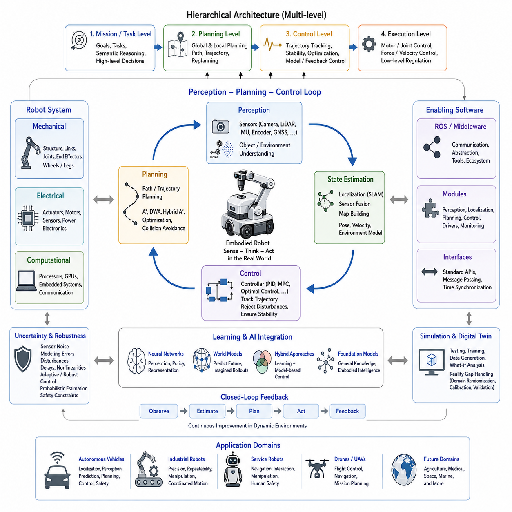
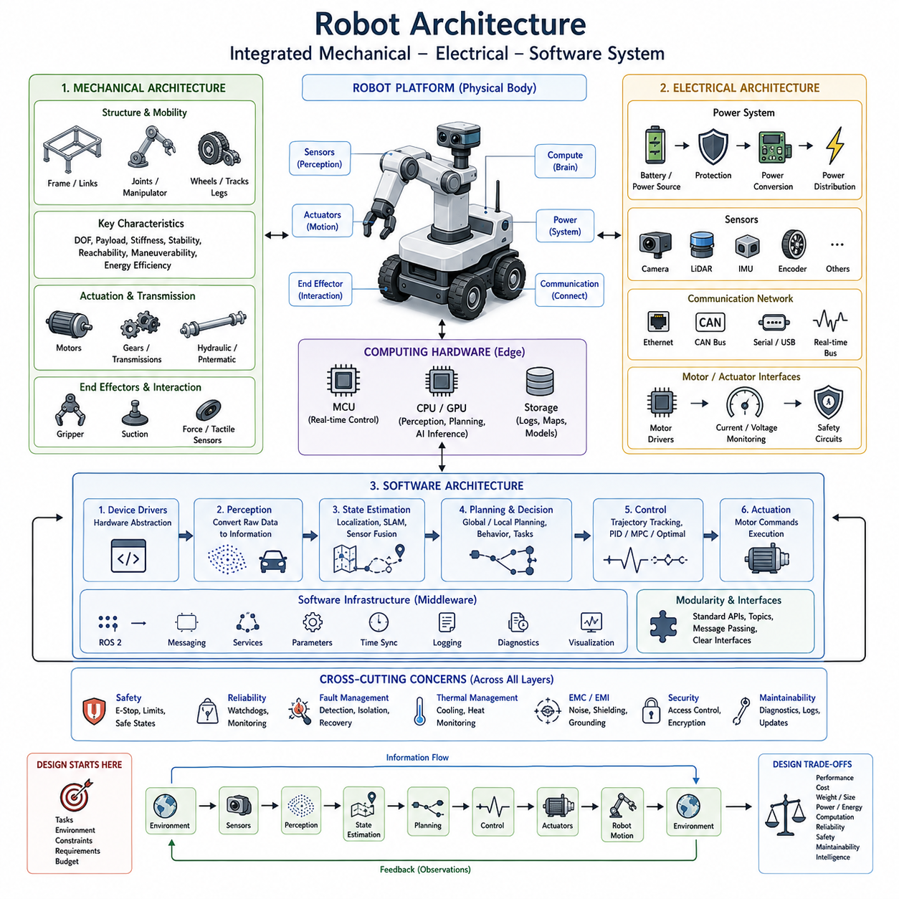
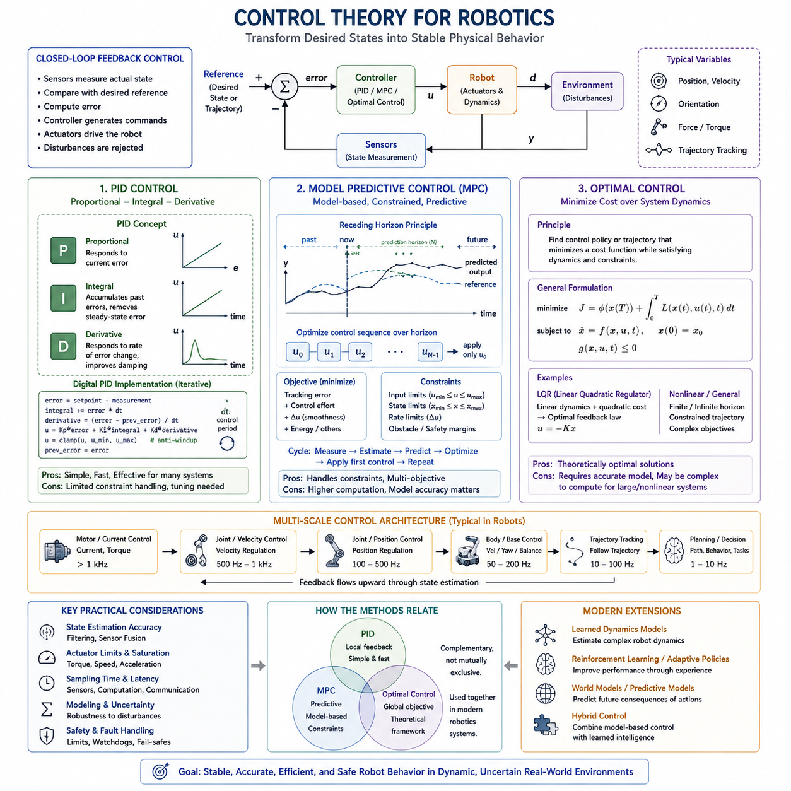
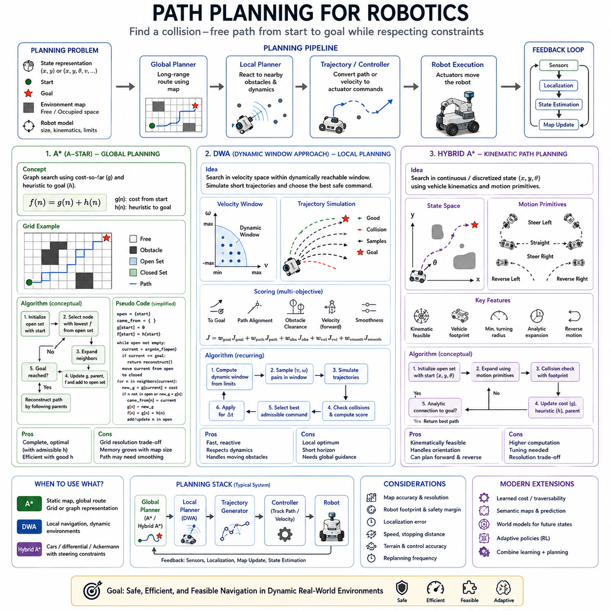
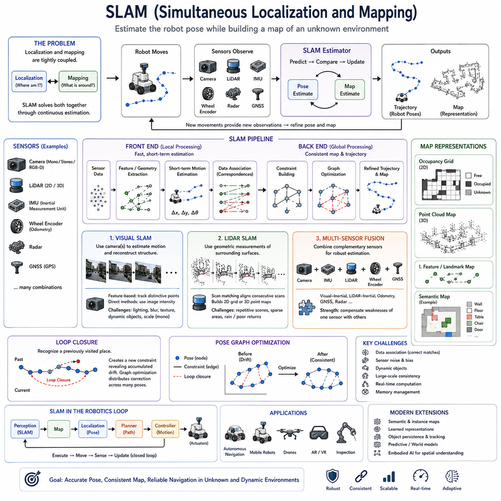
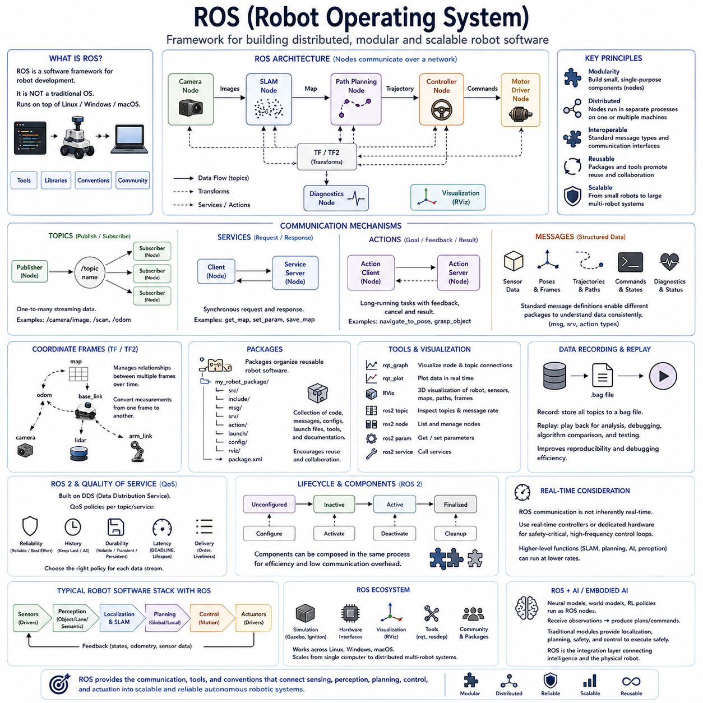
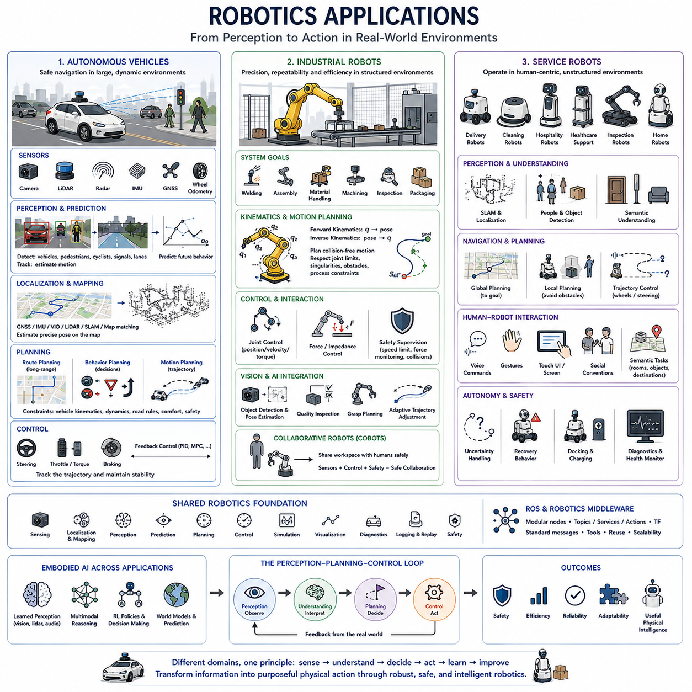

**Volume 45. Embodied AI and World Models**

# Chapter 04. Robotics and Control

## 04.00. Overview

{width="7.268055555555556in" height="7.268055555555556in"}

로보틱스와 제어(Robotics and Control)는 체화 인공지능(Embodied Artificial Intelligence)이 현실 세계를 인식하고, 판단하며, 행동할 수 있도록 하는 물리적 기반을 제공한다. 순수하게 계산만 수행하는 인공지능 시스템과 달리 로봇은 추상적인 의사결정을 힘(Force), 속도(Velocity), 궤적(Trajectory), 기계적 상호작용(Mechanical Interaction)으로 변환하면서 지속적으로 변화하는 환경 조건에 대응해야 한다. 따라서 로보틱스는 기계, 전기, 컴퓨팅, 제어 시스템의 협력을 통해 지능(Intelligence)과 물리적 체화(Physical Embodiment)를 연결한다.

로봇 시스템(Robotic System)은 기계 구조(Mechanical Structure)가 물리적 능력을 형성하고, 전기 시스템(Electrical System)이 센싱(Sensing)과 구동(Actuation)을 제공하며, 소프트웨어(Software)가 인식(Perception), 계획(Planning), 의사결정(Decision Making), 제어(Control)를 조정하는 통합 아키텍처(Integrated Architecture)로 이해할 수 있다. 이러한 계층은 독립적으로 설계될 수 없는데, 기계적 한계가 제어 성능에 영향을 주고 센서 특성이 상태 추정(State Estimation)을 좌우하며 계산 자원의 제약이 지능적 판단을 얼마나 빠르게 행동으로 변환할 수 있는지를 결정하기 때문이다.

제어 시스템(Control System)은 원하는 행동(Desired Behavior)과 실제 물리적 운동(Physical Motion)을 연결하는 실행상의 가교 역할을 한다. 제어기(Controller)는 목표 상태(Target State) 또는 궤적(Trajectory)을 입력받아 추정된 로봇 상태와 비교하고 적절한 명령을 계산하여 액추에이터(Actuator)에 전달한다. 이후 센서 피드백(Sensor Feedback)을 통해 행동의 결과를 확인하고 편차를 지속적으로 수정한다. 이러한 폐루프 구조(Closed-Loop Structure)는 외란(Disturbance)과 모델링 오차(Modeling Error)가 존재하더라도 로봇이 안정성과 정확성을 유지하도록 한다.

고전 제어 이론(Classical Control Theory)은 로봇의 운동을 조절하기 위한 기본적인 메커니즘을 제공한다. 비례-적분-미분 제어(Proportional-Integral-Derivative Control, PID)는 단순성, 계산 효율성, 실용적인 성능 때문에 여전히 널리 사용된다. 더욱 발전된 모델 예측 제어(Model Predictive Control, MPC)는 명시적인 시스템 모델을 이용하여 미래 상태를 예측하고 이동 시간 구간(Moving Time Horizon)에 걸쳐 제어 행동을 최적화한다. 최적 제어(Optimal Control)는 정의된 성능 목적과 제약조건을 최소화하는 문제로 로봇의 행동을 표현한다.

로봇 시스템의 자유도(Degrees of Freedom)가 증가하고 불확실한 환경과 상호작용할수록 제어는 더욱 어려워진다. 이동 로봇(Mobile Robot)은 바퀴, 조향, 가속도, 안정성 등의 제약조건을 만족하면서 병진 운동(Translation)과 회전 운동(Rotation)을 제어해야 한다. 로봇 매니퓰레이터(Robot Manipulator)는 운동학(Kinematics), 동역학(Dynamics), 페이로드(Payload), 충돌(Collision), 접촉력(Contact Force)을 고려하면서 여러 관절을 조정한다. 보행 로봇(Legged Robot)은 몸체와 다리, 지면 사이의 접촉 상태가 동적으로 변화하기 때문에 추가적인 제어 문제가 발생한다.

경로 계획(Path Planning)은 현재 상태에서 목표 지점까지 로봇이 어떻게 이동해야 하는지를 결정하는 상위 수준의 기능이다. 계획 알고리즘(Planning Algorithm)은 장애물을 회피하고 운동 제약조건을 만족하면서 기하학적, 위상학적 또는 상태 공간(State Space)의 표현을 탐색한다. A\*(A-Star)와 같은 알고리즘은 구조화된 그래프 기반 탐색(Graph-Based Search)을 제공하며, 동적 윈도우 접근법(Dynamic Window Approach, DWA)과 같은 지역 경로 계획기(Local Planner)는 실현 가능한 단기 속도 명령을 평가한다. 하이브리드 A\*(Hybrid A\*)는 비홀로노믹 운동 제약(Nonholonomic Motion Constraint)을 가진 차량까지 탐색 문제를 확장한다.

계획(Planning)과 제어(Control)는 밀접하게 연결되어 있지만 자율 시스템(Autonomous System)의 서로 다른 문제를 해결한다. 계획기는 충돌이 없는 경로(Collision-Free Path) 또는 동역학적으로 실행 가능한 궤적(Dynamically Feasible Trajectory)을 생성할 수 있지만, 제어기는 외란, 액추에이터 제한, 위치 추정 오차(Localization Error), 노면 상태 변화 등이 존재하는 실제 환경에서 해당 기준을 물리적으로 추종해야 한다. 따라서 현대 로봇 아키텍처는 임무 계획(Mission Planning), 행동 의사결정(Behavioral Decision Making), 궤적 생성(Trajectory Generation), 저수준 제어(Low-Level Control)가 서로 다른 시간 및 추상화 수준에서 작동하는 계층적 시스템(Hierarchical System)을 일반적으로 사용한다.

신뢰할 수 있는 제어는 로봇 자신의 상태를 파악하고 주변 환경을 이해하는 능력에도 의존한다. 동시적 위치추정 및 지도작성(Simultaneous Localization and Mapping, SLAM)은 로봇이 자신의 위치를 추정하면서 동시에 환경 표현을 생성하거나 갱신하도록 한다. 카메라(Camera), 라이다(LiDAR), 관성 센서(Inertial Sensor), 휠 인코더(Wheel Encoder), 위성항법시스템(Global Navigation Satellite System, GNSS) 등의 측정값을 결합하여 자세(Pose)와 운동 상태를 추정할 수 있다. 이러한 추정 오차는 계획과 제어에 직접 영향을 주므로 위치추정 정확도(Localization Accuracy)는 단순한 인식 문제가 아니라 시스템 수준의 핵심 문제가 된다.

동시적 위치추정 및 지도작성(SLAM)은 체화 지능(Embodied Intelligence)에서 인식과 행동이 얼마나 깊게 연결되어 있는지를 보여준다. 로봇의 움직임은 센서가 관찰할 수 있는 대상을 변화시키며, 센서 관측(Sensor Observation)은 다시 로봇이 어디에 있고 다음에 어떻게 움직여야 하는지에 대한 추정에 영향을 준다. 따라서 인식(Perception), 위치추정(Localization), 계획(Planning), 제어(Control)는 반복적인 피드백 순환(Feedback Cycle)을 형성한다. 지능형 로봇은 단 한 번 행동을 계산하는 것이 아니라 이전 행동의 결과를 지속적으로 관찰하고 새롭게 획득한 정보에 따라 미래 행동을 수정한다.

로봇 소프트웨어(Robot Software)는 엄격한 시간성과 신뢰성 요구사항 아래에서 이러한 상호작용 기능들을 조정해야 한다. 로봇 운영체제(Robot Operating System, ROS)는 분산 로봇 응용 시스템을 구축하기 위한 통신 메커니즘, 소프트웨어 추상화, 개발 도구, 재사용 가능한 구성요소를 제공한다. 인식 모듈(Perception Module), 위치추정 알고리즘(Localization Algorithm), 계획기(Planner), 제어기(Controller), 하드웨어 드라이버(Hardware Driver), 모니터링 프로세스(Monitoring Process)를 상호 연결된 구성요소로 운영함으로써 복잡한 로봇 시스템을 모듈형 아키텍처(Modular Architecture)로 개발하고 시험할 수 있다.

현실 세계의 로보틱스는 불확실성(Uncertainty)에 대한 세심한 처리도 필요로 한다. 센서에는 잡음(Noise)이 존재하고, 액추에이터에는 지연(Delay)과 비선형성(Nonlinearity)이 있으며, 기계 부품에는 공차(Tolerance)와 마모(Wear)가 발생한다. 또한 환경에는 행동을 항상 정확하게 예측할 수 없는 객체가 존재한다. 따라서 성공적인 로봇 제어기는 불완전한 모델과 부분적인 관측을 견딜 수 있어야 한다. 강인 제어(Robust Control), 적응 기법(Adaptive Technique), 확률적 상태 추정(Probabilistic State Estimation), 온라인 재계획(Online Replanning), 안전 제약조건(Safety Constraint)은 이러한 불확실성 속에서 유용한 행동을 유지하기 위한 상호보완적 방법을 제공한다.

체화 인공지능(Embodied AI)의 발전은 전통적인 로보틱스와 학습 모델(Learned Model)을 점차 긴밀하게 연결하고 있다. 신경망(Neural Network)은 인식, 상태 표현(State Representation), 동역학 예측(Dynamics Prediction), 정책(Policy), 상위 수준 의사결정(High-Level Decision Making)을 제공할 수 있으며, 기존의 제어 시스템은 정밀하고 안정적인 물리적 실행을 담당할 수 있다. 학습은 제어 이론을 대체하기보다는 로봇이 이해하고 처리할 수 있는 상황의 범위를 확장한다. 하이브리드 아키텍처(Hybrid Architecture)는 학습 기반 지능, 모델 기반 계획(Model-Based Planning), 피드백 제어(Feedback Control)를 결합하여 각각의 장점을 활용한다.

월드 모델(World Model)은 체화 에이전트(Embodied Agent)가 다양한 행동에 따라 상태가 어떻게 변화할 수 있는지를 예측하도록 함으로써 이러한 통합을 더욱 강화한다. 로봇은 현재의 관측에만 반응하는 대신 가능한 미래 결과를 추정하고 예상되는 결과에 따라 행동을 선택할 수 있다. 따라서 모델 기반 추론(Model-Based Reasoning), 예측 제어(Predictive Control), 학습된 월드 모델(Learned World Model)은 중요한 개념적 원리를 공유한다. 즉, 효과적인 행동을 위해서는 현재 상태를 표현하는 것뿐만 아니라 미래의 물리적 상태를 예측하는 능력도 필요하다.

시뮬레이션(Simulation)과 디지털 환경(Digital Environment)은 실제 로봇 하드웨어에서 수행되는 실험이 비용이 많이 들거나 느리고 위험할 수 있기 때문에 중요하다. 제어기와 계획기는 먼저 시뮬레이션된 동역학, 센서, 장애물, 외란 조건에서 평가될 수 있다. 또한 시뮬레이션은 학습 시스템에 필요한 대규모 상호작용 경험을 생성할 수 있다. 그러나 시뮬레이션 시스템과 실제 물리 시스템 사이에는 현실 격차(Reality Gap)가 존재하기 때문에 실제 배치 이전에 보정(Calibration), 도메인 무작위화(Domain Randomization), 적응(Adaptation), 실환경 검증(Real-World Validation)이 필요하다.

따라서 자율 로봇(Autonomous Robot)의 실질적인 아키텍처에는 서로 연결된 여러 피드백 루프(Feedback Loop)가 존재한다. 빠른 저수준 루프(Low-Level Loop)는 모터, 관절, 조향, 힘 등을 제어하고, 상대적으로 느린 상위 루프는 상태를 추정하고 궤적을 추종하며 장애물을 회피하고 지도를 갱신하며 목표를 재검토한다. 더욱 높은 수준의 인공지능은 작업(Task), 의미적 맥락(Semantic Context), 학습된 표현(Learned Representation), 예측된 미래(Predicted Future)를 기반으로 추론할 수 있다. 이러한 계층 사이에 적절한 인터페이스와 갱신 주기를 설계하는 것은 지능적인 행동과 물리적 안정성을 동시에 달성하는 데 필수적이다.

이러한 원리는 자율주행차(Autonomous Vehicle), 산업용 로봇(Industrial Robot), 서비스 로봇(Service Robot)을 포함하여 이 장의 구조에서 다루는 다양한 응용 분야에 적용된다. 자율주행차는 위치추정, 궤적 계획, 동적 장애물과의 상호작용, 안전 필수 제어(Safety-Critical Control)를 강조한다. 산업용 로봇은 반복 정밀도(Repeatability), 정밀성(Precision), 조작(Manipulation), 협조 운동(Coordinated Motion)을 중시하며, 서비스 로봇은 구조화 정도가 낮은 인간 환경에서 안전하게 동작해야 한다. 각 분야는 서로 다른 하드웨어와 제약조건을 사용하지만 모두 동일한 인식-계획-제어(Perception-Planning-Control)의 기본 관계에 의존한다.

궁극적으로 로보틱스와 제어(Robotics and Control)는 인공지능을 단순한 정보 처리 시스템에서 현실 세계에 물리적인 결과를 만들어낼 수 있는 체화 에이전트(Embodied Agent)로 전환한다. 기계 아키텍처(Mechanical Architecture)는 물리적으로 가능한 행동을 정의하고, 인식(Perception)은 현재 상황을 추정하며, 계획(Planning)은 무엇이 일어나야 하는지를 결정하고, 제어(Control)는 이러한 의도를 실제 운동으로 변환한다. 이들의 통합은 체화 학습(Embodied Learning), 월드 모델(World Model), 시뮬레이션(Simulation), 파운데이션 모델(Foundation Model), 그리고 더욱 자율적인 로봇 지능(Autonomous Robotic Intelligence)을 구축하기 위한 핵심 기반을 형성한다.

## 04.01. Robot Architecture

{width="7.268055555555556in" height="7.268055555555556in"}

로봇 아키텍처(Robot Architecture)는 로봇의 물리적 몸체, 전기 인프라(Electrical Infrastructure), 컴퓨팅 자원(Computing Resources), 소프트웨어 지능(Software Intelligence)이 하나의 일관된 운영 시스템으로 구성되는 방식을 정의한다. 체화 인공지능(Embodied AI)에서는 지능을 감지하고 행동하는 물리적 플랫폼과 분리할 수 없기 때문에 아키텍처가 특히 중요하다. 기계적 능력은 가능한 움직임을 제한하고, 전기 시스템은 사용할 수 있는 센싱(Sensing)과 구동(Actuation)을 결정하며, 소프트웨어는 정보를 조정된 행동으로 변환한다.

따라서 로봇 아키텍처는 기계(Mechanical), 전기(Electrical), 소프트웨어(Software)라는 서로 강하게 결합된 세 가지 영역으로 이해할 수 있다. 기계 영역은 로봇의 물리적 구조와 이동 능력을 형성하고, 전기 영역은 에너지를 분배하며 센서, 액추에이터(Actuator), 컴퓨팅 장치를 연결한다. 소프트웨어 영역은 센서 정보를 해석하고 상태를 추정하며 행동을 계획하고 하드웨어를 제어한다. 효과적인 로봇 엔지니어링을 위해서는 세 영역에 대한 지속적인 공동 설계(Co-Design)가 필요하다.

기계 아키텍처(Mechanical Architecture)는 로봇의 형상, 자유도(Degrees of Freedom), 페이로드(Payload) 능력, 이동성(Mobility), 구조 강성(Structural Stiffness), 환경과의 물리적 상호작용을 결정한다. 프레임(Frame), 링크(Link), 관절(Joint), 바퀴(Wheel), 트랙(Track), 다리(Leg), 매니퓰레이터(Manipulator), 변속 및 전달 장치(Transmission), 베어링(Bearing), 서스펜션(Suspension), 엔드 이펙터(End Effector)는 로봇이 물리적으로 수행할 수 있는 작업을 정의한다. 이들의 크기와 배치는 안정성, 도달 가능성, 기동성, 에너지 소비, 제어 가능성에도 영향을 준다.

기계 설계(Mechanical Design)는 개별 부품에서 출발하기보다 수행할 작업과 운용 환경에서 시작해야 한다. 평탄한 실내 바닥에서 동작하는 자율 이동 로봇(Autonomous Mobile Robot)은 차동 구동(Differential Drive)과 수동 캐스터(Passive Caster)를 사용할 수 있지만, 실외 플랫폼은 서스펜션, 대형 바퀴, 조향 메커니즘(Steering Mechanism), 높은 지상고(Ground Clearance)가 필요할 수 있다. 반면 조작 시스템(Manipulation System)은 관절 구성, 작업 공간, 정밀도, 페이로드, 강성, 엔드 이펙터에서 안전하게 힘을 발생시키는 능력을 중요하게 고려한다.

질량 분포(Mass Distribution)는 가속, 제동, 선회, 견인력(Traction), 안정성에 영향을 주기 때문에 또 다른 핵심적인 아키텍처 고려사항이다. 무거운 배터리나 컴퓨팅 시스템을 지나치게 높은 위치에 배치하면 무게중심(Center of Gravity)이 상승하여 전복 위험이 증가할 수 있으며, 불균형한 페이로드는 바퀴 하중과 제어 특성을 변화시킬 수 있다. 따라서 기계 아키텍처는 정적인 치수뿐 아니라 가속, 조작, 접촉, 비상 기동 중 로봇이 동적으로 어떻게 행동하는지도 고려해야 한다.

구동 시스템(Actuation)은 기계 아키텍처를 전기 및 제어 시스템과 연결한다. 전기 모터(Electric Motor)는 현대 로봇에서 널리 사용되지만 실제 성능은 기어비(Gear Ratio), 동력 전달 장치, 요구 토크(Torque), 속도 범위, 열적 한계(Thermal Limit), 피드백 장치(Feedback Device)에 따라 달라진다. 유압 액추에이터(Hydraulic Actuator)와 공압 액추에이터(Pneumatic Actuator)는 높은 힘 밀도(Force Density)나 특정한 순응성(Compliance)이 필요한 경우 여전히 유용하다. 액추에이터 선택은 단순한 정격 하중이 아니라 메커니즘의 동적 요구사항과 일치해야 한다.

전기 아키텍처(Electrical Architecture)는 로봇 전체에 에너지, 센싱, 연산, 통신, 액추에이터 인터페이스를 제공한다. 배터리 또는 외부 전원은 보호 회로, 전력 변환(Power Conversion), 전력 분배(Power Distribution)를 통해 모터, 프로세서, 센서, 통신 장치, 보조 장치에 에너지를 공급한다. 전압 수준, 전류 용량, 최대 전력 수요, 접지(Grounding), 전자기 적합성(Electromagnetic Compatibility), 열적 특성, 고장 보호(Fault Protection)를 전체 시스템 아키텍처의 일부로 고려해야 한다.

특히 이동 로봇(Mobile Robot)에서는 사용 가능한 에너지가 운용 시간과 성능에 직접적인 영향을 주기 때문에 전력 아키텍처(Power Architecture)가 매우 중요하다. 모터는 가속하거나 경사를 오를 때 순간적으로 큰 전류를 요구할 수 있으며, GPU와 같은 컴퓨팅 장치는 상당한 지속 전력을 소비할 수 있다. 센서와 통신 장치는 액추에이터 부하가 변동하더라도 안정적인 전원을 필요로 한다. 따라서 전력 분배 시스템은 핵심 전자장치를 보호하고 변환 효율을 관리하며 과부하, 단락, 비정상 상태로부터 로봇을 보호해야 한다.

센서(Sensor)는 물리적 환경과 로봇 지능 사이의 전기적 인터페이스를 제공한다. 카메라(Camera), 라이다(LiDAR), 레이더(Radar), 초음파 센서(Ultrasonic Sensor), 관성측정장치(Inertial Measurement Unit, IMU), 인코더(Encoder), 힘 센서(Force Sensor), 촉각 장치(Tactile Device), 위성항법시스템(Global Navigation Satellite System, GNSS), 환경 센서는 로봇과 주변 환경의 서로 다른 특성을 관측한다. 센서의 시야각(Field of View), 가림(Occlusion), 진동, 전자기 간섭, 기계적 정렬, 외부 환경 노출이 측정 품질에 직접 영향을 주기 때문에 센서 배치 역시 중요한 아키텍처 결정이다.

전기 아키텍처에는 분산된 구성요소 사이에서 정보를 전달하는 통신 네트워크(Communication Network)도 포함된다. 이더넷(Ethernet), CAN, 직렬 인터페이스(Serial Interface), USB, 특수 실시간 버스(Real-Time Bus)가 하나의 로봇 안에서 함께 사용될 수 있다. 카메라와 라이다 같은 고대역폭 센서는 많은 데이터 전송량을 요구하는 반면, 모터 제어기는 결정론적 타이밍(Deterministic Timing)과 낮은 지연시간(Low Latency)을 우선한다. 따라서 네트워크 아키텍처는 대역폭 요구사항과 각 정보 흐름의 시간적 중요성을 함께 반영해야 한다.

컴퓨팅 하드웨어(Computing Hardware)는 전기 아키텍처와 소프트웨어 아키텍처의 경계에 위치한다. 마이크로컨트롤러(Microcontroller)는 결정론적인 액추에이터 제어를 담당하고, 임베디드 프로세서(Embedded Processor)는 하드웨어 관리와 실시간 기능을 실행할 수 있으며, CPU, GPU 또는 AI 가속기(AI Accelerator)는 인식, 지도작성, 계획, 학습 모델 추론을 수행할 수 있다. 이러한 작업을 분리하면 계산량이 많은 AI 처리가 안전 필수 모터 제어(Safety-Critical Motor Regulation)와 동일한 타이밍 영역을 공유하지 않아도 되므로 시스템 신뢰성을 향상시킬 수 있다.

소프트웨어 아키텍처(Software Architecture)는 분산된 하드웨어를 하나의 자율 로봇 시스템으로 변환한다. 가장 낮은 수준에서는 장치 드라이버(Device Driver)가 센서, 모터 제어기, 전력 시스템, 기타 하드웨어와 통신한다. 그 위에서 상태 추정(State Estimation)과 인식 모듈(Perception Module)이 원시 측정 데이터를 로봇과 환경에 대한 표현으로 변환한다. 계획 및 의사결정 모듈은 원하는 행동을 결정하며, 제어기는 궤적이나 명령을 물리적 운동을 발생시키는 액추에이터 수준의 출력으로 변환한다.

모듈성(Modularity)은 로봇 소프트웨어 아키텍처의 핵심 원칙이다. 인식, 위치추정(Localization), 지도작성(Mapping), 계획, 제어, 진단(Diagnostics), 통신, 사용자 인터페이스(User Interface)를 명확하게 정의된 인터페이스를 가진 독립적인 구성요소로 구현할 수 있다. 로봇 운영체제(Robot Operating System, ROS)는 메시징(Messaging), 서비스(Service), 개발 도구, 재사용 가능한 소프트웨어 패키지를 통해 이러한 분산 구성요소를 조직하는 데 널리 사용되는 프레임워크를 제공한다. 모듈형 구성은 통합, 시험, 교체, 단계적인 시스템 개발을 단순화한다.

소프트웨어 구성요소마다 요구되는 타이밍(Timing)은 크게 다르다. 모터와 관절 제어는 빠르고 예측 가능한 갱신 주기를 요구할 수 있으며, 위치추정과 장애물 회피는 중간 수준의 주기로 동작한다. 전역 계획(Global Planning), 의미적 추론(Semantic Reasoning), 작업 할당(Task Allocation), 파운데이션 모델 추론(Foundation-Model Inference)은 상대적으로 느린 주기로 실행될 수 있다. 따라서 강건한 아키텍처는 하드 또는 준실시간 기능을 계산량이 많은 추론 기능과 분리하고 상위 지능의 지연이 저수준 물리 제어를 불안정하게 만들지 않도록 해야 한다.

상태 추정(State Estimation)은 센싱과 의사결정 사이를 연결하는 중요한 아키텍처적 가교를 제공한다. 원시 센서 측정값만으로는 로봇의 상태를 완전하고 정확하게 표현하기 어렵다. 위치추정, 동시적 위치추정 및 지도작성(Simultaneous Localization and Mapping, SLAM), 센서 융합(Sensor Fusion), 필터링(Filtering)은 시간에 따른 관측을 결합하여 자세(Pose), 속도, 방향, 지도 정보와 기타 상태 변수를 추정한다. 계획 및 제어 모듈은 이러한 추정값을 기반으로 작동하므로 상태 정보의 품질과 타이밍은 전체 로봇 성능에 매우 중요하다.

계획 소프트웨어(Planning Software)는 목표를 실행 가능한 운동으로 변환한다. 전역 계획기(Global Planner)는 넓은 환경에서 이동 경로를 결정하고, 지역 계획기(Local Planner)는 주변 장애물과 변화하는 상황에 대응한다. 궤적 생성(Trajectory Generation)은 운동학적 및 동역학적 제약조건을 반영하여 계획된 움직임이 실제 로봇에서 실행될 수 있도록 한다. 이후 제어 모듈은 비례-적분-미분 제어(Proportional-Integral-Derivative Control, PID), 모델 예측 제어(Model Predictive Control, MPC), 최적 제어(Optimal Control) 등의 방법으로 궤적을 추종하며 소프트웨어 의사결정과 기계적 행동 사이의 루프를 완성한다.

안전 및 고장 관리(Safety and Fault Management)는 하나의 소프트웨어 기능으로만 존재하는 것이 아니라 모든 아키텍처 계층에 걸쳐 적용되어야 한다. 기계적 스토퍼(Mechanical Stop), 보호 구조, 전기적 절연(Electrical Isolation), 비상 회로(Emergency Circuit), 전류 제한(Current Limit), 감시 타이머(Watchdog), 통신 감시, 소프트웨어 제약조건, 충돌 감지(Collision Detection), 안전 상태 로직(Safe-State Logic)은 서로 중첩되는 보호 기능을 제공할 수 있다. 고장은 하드웨어, 센서, 통신, 알고리즘, 전력 시스템 또는 정상적으로 동작하는 구성요소 사이의 상호작용에서도 발생할 수 있으므로 이러한 계층적 접근이 중요하다.

현대의 체화 인공지능 아키텍처(Embodied AI Architecture)는 학습 기반 인식(Learned Perception), 정책(Policy), 월드 모델(World Model), 멀티모달 모델(Multimodal Model), 파운데이션 모델(Foundation Model)을 소프트웨어 계층 구조에 점차 통합하고 있다. 이러한 구성요소는 의미적 이해, 예측, 적응, 상위 수준 추론을 향상시킬 수 있지만 그 출력은 여전히 물리적 제약조건을 만족해야 한다. 따라서 학습 기반 지능은 기존 로보틱스를 단순히 대체하기보다는 결정론적 계획(Deterministic Planning), 안전 감독(Safety Supervision), 피드백 제어(Feedback Control)와 연결되는 형태로 활용된다.

잘 설계된 로봇 아키텍처는 궁극적으로 하나의 통합된 사이버-물리 시스템(Cyber-Physical System)으로 동작한다. 기계 구성요소는 힘이 어떻게 운동을 발생시키는지를 결정하고, 전기 시스템은 에너지와 관측 정보를 제공하며, 소프트웨어는 세계를 해석하고 행동을 조정한다. 어느 한 계층의 변화도 다른 계층으로 전파되므로 로봇 아키텍처는 성능, 비용, 중량, 전력, 계산 능력, 신뢰성, 안전성, 유지보수성(Maintainability), 지능적 능력(Intelligent Capability) 사이의 시스템 수준 절충(System-Level Tradeoff)을 지속적으로 조정하는 과정이라고 할 수 있다.

## 04.02. Control Theory

{width="7.268055555555556in" height="7.268055555555556in"}

제어 이론(Control Theory)은 로봇이 원하는 상태(Desired State)를 안정적인 물리적 행동(Physical Behavior)으로 변환할 수 있도록 하는 수학적·공학적 원리를 제공한다. 로봇은 모터(Motor), 동력 전달 장치(Transmission), 마찰(Friction), 페이로드 변화(Payload Variation), 센서 잡음(Sensor Noise), 외란(Disturbance), 모델링 오차(Modeling Error) 등의 영향으로 명령받은 그대로 정확하게 움직이지 않는다. 제어 시스템(Control System)은 원하는 행동과 측정 또는 추정된 실제 행동을 지속적으로 비교하고 이러한 편차를 감소시키기 위한 보정 동작(Corrective Action)을 계산한다.

기본적인 구조는 피드백 제어(Feedback Control)이다. 기준값(Reference)은 원하는 위치, 속도, 방향, 힘 또는 궤적을 정의하며, 센서는 로봇의 실제 상태를 추정한다. 원하는 값과 측정된 값의 차이는 오차 신호(Error Signal)를 형성하고, 제어기(Controller)는 이를 이용하여 액추에이터 명령(Actuator Command)을 생성한다. 이러한 과정을 반복함으로써 미리 결정된 명령에만 의존하지 않고 외란을 스스로 보정할 수 있는 폐루프 시스템(Closed-Loop System)이 형성된다.

로봇 제어(Robot Control)는 여러 물리적·시간적 규모에서 동작한다. 모터 제어기(Motor Controller)는 높은 주파수에서 전류, 토크(Torque), 회전 속도를 조절하고, 관절 제어기(Joint Controller)는 위치와 움직임을 제어할 수 있다. 이동 로봇(Mobile Robot)은 추가적으로 선속도(Linear Velocity)와 각속도(Angular Velocity)를 제어하며, 상위 수준의 궤적 제어기(Trajectory Controller)는 더 긴 시간 범위에서 움직임을 조정한다. 이러한 중첩 제어 루프(Nested Control Loop)를 통해 점차 추상화 수준이 높아지는 여러 제어 목표가 결합되어 복잡한 로봇 행동이 만들어진다.

비례-적분-미분 제어(Proportional-Integral-Derivative Control), 즉 PID는 가장 널리 사용되는 피드백 제어 방법 가운데 하나이다. 비례 항(Proportional Term)은 현재 오차에 반응하고, 적분 항(Integral Term)은 과거의 오차를 누적하며, 미분 항(Derivative Term)은 오차가 변화하는 속도에 반응한다. 이 세 요소의 조합은 매우 상세한 시스템 모델 없이도 응답 속도, 정상상태 정확도(Steady-State Accuracy), 감쇠(Damping), 외란 억제(Disturbance Rejection) 사이의 균형을 조정할 수 있는 실용적인 방법을 제공한다.

비례 요소(Proportional Component)는 오차의 크기가 증가할수록 더 강한 보정 동작을 생성한다. 비례 이득(Proportional Gain)을 증가시키면 시스템이 더 빠르게 반응할 수 있지만 지나치게 높은 이득은 진동(Oscillation)이나 불안정성(Instability)을 발생시킬 수 있다. 적분 요소(Integral Component)는 시간에 따라 오차를 누적하여 지속적인 정상상태 오차(Steady-State Error)를 제거하지만, 적분 작용이 지나치게 크면 액추에이터가 물리적 한계에 도달할 때 오버슈트(Overshoot)와 적분 와인드업(Integral Windup)이 발생할 수 있다.

미분 동작(Derivative Action)은 오차 신호의 기울기에 반응하여 미래의 변화를 선제적으로 고려한다. 이를 통해 감쇠 특성을 향상하고 오버슈트를 줄일 수 있지만, 미분 연산은 고주파 센서 잡음(High-Frequency Sensor Noise)을 증폭시키기도 한다. 따라서 실제 PID 구현에서는 필터링(Filtering), 출력 포화(Output Saturation), 안티 와인드업(Anti-Windup), 적절한 샘플링 주기(Sampling Period), 가속도 또는 토크 명령 제한 등을 함께 적용하는 경우가 많다. 제어기 튜닝(Controller Tuning)은 실제 로봇의 물리적 동역학과 운용 제약조건을 고려해야 한다.

간단한 디지털 PID 제어기(Digital PID Controller)는 반복적인 소프트웨어 루프(Software Loop)를 통해 구현할 수 있다. 각 제어 주기마다 프로그램은 현재 오차를 계산하고, 누적 적분값을 갱신하며, 연속된 오차값으로부터 미분값을 추정하고, 각각의 이득을 적용하여 세 항을 결합한다. 그 결과 생성된 명령은 액추에이터가 허용하는 범위로 제한된 후 모터 또는 관절 제어기에 전달된다.

예를 들어 개념적인 구현은 \`u = Kp\*error + Ki\*integral + Kd\*derivative\` 관계로 표현할 수 있으며, 여기서 \`error = reference - measurement\`이다. 적분값은 \`integral += error\*dt\`와 같이 갱신할 수 있고, 미분값은 \`(error - previous_error)/dt\`로 근사할 수 있다. 이러한 구현은 간결하지만 실제 제품 수준의 시스템에서는 타이밍 정확도(Timing Accuracy), 포화(Saturation), 필터링, 센서 유효성(Sensor Validity), 초기화(Initialization), 고장 처리(Failure Handling)까지 추가적으로 고려해야 한다.

PID는 제어 대상의 동역학이 비교적 안정적이고 운용 조건의 변화가 지나치게 크지 않으며 국부적인 피드백 반응(Local Feedback Response)만으로 충분한 경우 특히 효과적이다. 그러나 로봇 시스템에는 여러 변수가 서로 영향을 주고 명시적인 제약조건이 존재하는 경우가 많다. 이동 로봇은 가속도 제한을 만족하면서 조향을 제어해야 할 수 있으며, 매니퓰레이터(Manipulator)는 토크, 속도, 작업 공간, 충돌 제약조건을 위반하지 않으면서 여러 관절의 움직임을 조정해야 한다.

모델 예측 제어(Model Predictive Control, MPC)는 미래의 시스템 행동을 명시적으로 예측하여 이러한 문제를 다룬다. MPC는 현재의 오차만을 이용하여 제어 동작을 계산하는 대신 수학적 모델(Mathematical Model)을 사용하여 후보 제어 입력(Candidate Control Input)이 유한한 예측 구간(Prediction Horizon) 동안 미래 상태에 어떤 영향을 주는지를 예측한다. 이후 최적화 문제(Optimization Problem)를 해결하여 정의된 제약조건을 만족하면서 목표를 가장 효과적으로 달성하는 일련의 행동을 결정한다.

일반적으로 최적화된 제어 시퀀스(Control Sequence) 가운데 첫 번째 제어 동작만 실제 시스템에 적용한다. 새로운 센서 측정값이 들어오면 다시 상태를 추정하고 예측 구간을 앞으로 이동시킨 뒤 최적화 문제를 다시 해결한다. 이러한 이동 구간 원리(Receding-Horizon Principle)는 MPC에 피드백 특성을 부여하며, 로봇이 외란, 모델 불일치(Model Mismatch), 이동 장애물, 운용 조건 변화에 직면할 때마다 예측을 지속적으로 수정할 수 있도록 한다.

MPC의 목적 함수(Objective Function)는 궤적 추종 오차(Tracking Error), 제어 노력(Control Effort), 급격한 액추에이터 명령 변화, 에너지 소비, 선호 운용 영역으로부터의 편차 등을 동시에 고려할 수 있다. 제약조건은 조향각, 바퀴 속도, 모터 토크, 관절 한계, 가속도 범위, 장애물 영역, 안전 여유(Safety Margin) 등을 표현할 수 있다. 여러 목적과 물리적 제약조건을 제어 계산에 직접 포함할 수 있다는 점 때문에 MPC는 복잡한 로봇 시스템에 매우 유용하다.

MPC의 주요 단점은 계산 비용(Computational Cost)이다. 예측과 최적화는 다음 제어 마감시간(Control Deadline) 이전에 완료되어야 하며, 모델의 차원, 예측 구간의 길이, 비선형 동역학(Nonlinear Dynamics), 제약조건의 수가 증가할수록 계산 복잡도도 증가한다. 선형 MPC(Linear MPC)는 비교적 효율적으로 해결할 수 있지만 비선형 MPC(Nonlinear MPC)는 훨씬 많은 컴퓨팅 자원을 요구할 수 있다. 또한 부정확한 모델은 추종 성능을 저하시키거나 부적절한 제어 동작을 생성할 수 있으므로 모델 정확도(Model Accuracy) 역시 중요하다.

최적 제어(Optimal Control)는 다양한 고급 제어 기법을 이해할 수 있는 보다 광범위한 수학적 프레임워크를 제공한다. 고정된 피드백 규칙을 이용해 단순히 보정 동작을 선택하는 대신, 최적 제어는 시스템 동역학(System Dynamics)을 만족하면서 비용 함수(Cost Function)를 최소화하는 제어 정책(Control Policy) 또는 궤적을 탐색한다. 비용 함수는 추종 오차 최소화, 에너지 소비 최소화, 이동 시간 단축, 제어 노력 감소 등 바람직한 행동이 무엇인지를 수학적으로 표현한다.

고전적인 최적 제어에는 선형 시스템 동역학과 이차 비용 함수(Quadratic Cost Function)를 결합하는 선형 이차 조절기(Linear Quadratic Regulator, LQR)와 같은 방법이 포함된다. 그 결과 생성되는 피드백 법칙(Feedback Law)은 상태 오차를 줄이는 것과 제어 노력을 제한하는 것 사이에서 효과적인 균형을 제공한다. 더욱 일반적인 공식화는 비선형 동역학, 유한 또는 무한 시간 구간, 제약된 궤적, 매니퓰레이터, 자율주행차, 드론, 보행 로봇에서 발생하는 복잡한 목적까지 다룰 수 있다.

PID, MPC, 최적 제어(Optimal Control)는 서로 배타적인 대안으로 이해해서는 안 된다. PID는 단순하고 효율적인 국부 제어(Local Regulation)를 제공하고, 최적 제어는 바람직한 행동을 수학적으로 선택하기 위한 원리를 제공하며, MPC는 예측된 미래 행동을 대상으로 최적화 문제를 반복적으로 해결한다. 따라서 하나의 로봇 시스템에서도 모터 제어에는 PID를 사용하고, 상위 계층에서는 최적화된 궤적을 생성하며, 제약조건이 포함된 궤적 추종에는 MPC를 사용하는 방식으로 세 방법을 함께 적용할 수 있다.

제어 성능(Control Performance)은 제어 알고리즘 자체만으로 결정되지 않는다. 상태 추정 정확도(State Estimation Accuracy), 센서 지연시간(Sensor Latency), 액추에이터 대역폭(Actuator Bandwidth), 통신 지연(Communication Delay), 기계적 순응성(Mechanical Compliance), 샘플링 주파수(Sampling Frequency), 모델 품질(Model Quality), 계산 스케줄링(Computational Scheduling)이 모두 폐루프 행동에 영향을 준다. 이론적으로 정교한 제어기도 부정확한 센싱이나 지연된 하드웨어와 통합되면 성능이 저하될 수 있으며, 반대로 단순한 제어기도 전체 시스템이 잘 설계되면 매우 뛰어난 성능을 발휘할 수 있다.

현대의 체화 인공지능(Embodied AI)은 피드백 제어를 학습된 동역학(Learned Dynamics), 적응형 정책(Adaptive Policy), 강화학습(Reinforcement Learning), 월드 모델(World Model)과 연결함으로써 제어 이론을 확장하고 있다. 학습된 모델은 해석적으로 도출하기 어려운 동역학을 추정할 수 있으며, 예측 모델(Predictive Model)은 행동이 가져올 미래의 결과를 평가할 수 있다. 그러나 실제 물리적 실행에는 여전히 안정성(Stability), 제약조건 처리(Constraint Handling), 외란 억제, 신뢰할 수 있는 피드백이 필요하므로 고전적 제어와 현대적 제어의 원리는 지능형 로봇 행동을 구현하기 위한 핵심 기반으로 남는다.

## 04.03. Path Planning

{width="7.268055555555556in" height="7.268055555555556in"}

경로 계획(Path Planning)은 로봇이 장애물을 회피하고 환경 및 운동 제약조건을 만족하면서 현재 구성(Current Configuration)에서 원하는 목표(Goal)까지 어떻게 이동해야 하는지를 결정할 수 있도록 한다. 이는 격자(Grid), 그래프(Graph), 연속 상태 공간(Continuous State Space), 궤적(Trajectory) 등의 표현을 탐색하여 상위 수준의 내비게이션 목표를 실행 가능한 움직임과 연결한다. 효과적인 계획은 도달 가능성(Reachability), 경로 길이, 안전성, 계산 효율성, 물리적 실행 가능성(Physical Feasibility) 사이의 균형을 고려해야 한다.

경로 계획 문제는 일반적으로 로봇의 상태 표현(State Representation), 시작 구성(Start Configuration), 목표, 자유 공간(Free Space)과 점유 공간(Occupied Space)에 대한 모델에서 시작한다. 로봇에 따라 상태는 평면상의 위치만 포함할 수도 있고 방향(Orientation), 속도, 조향각(Steering Angle), 관절 구성(Joint Configuration) 등의 변수를 추가로 포함할 수도 있다. 상태 차원을 증가시키면 물리적 현실성을 높일 수 있지만 탐색의 계산 복잡도(Computational Complexity) 역시 크게 증가한다.

경로 계획은 일반적으로 전역 계획(Global Planning)과 지역 계획(Local Planning)의 두 수준으로 구성된다. 전역 계획기(Global Planner)는 지도를 이용하여 목적지까지의 장거리 경로를 결정하고, 지역 계획기(Local Planner)는 주변 장애물, 위치추정 변화, 동적인 환경 조건에 지속적으로 대응한다. 전역 경로는 전략적인 이동 방향을 제공하고 지역 계획기는 즉시 실행할 수 있는 움직임을 생성한다. 이들의 통합을 통해 전체 환경이 완전히 정적인 상태로 유지되지 않더라도 로봇은 효율적으로 이동할 수 있다.

A\*(A-Star)는 체계적인 탐색과 목표 지향적인 휴리스틱 정보(Heuristic Information)를 결합하기 때문에 전역 경로 계획에 널리 사용되는 그래프 탐색 알고리즘(Graph-Search Algorithm)이다. 각각의 후보 노드(Candidate Node)는 시작점에서 현재 노드까지 누적된 비용과 목표까지 남아 있는 예상 비용을 이용하여 평가된다. 이는 일반적으로 \`f(n) = g(n) + h(n)\`으로 표현되며, \`g(n)\`은 알려진 경로 비용이고 \`h(n)\`은 목표까지의 휴리스틱 추정 비용이다.

휴리스틱(Heuristic)은 A\*의 탐색 효율성을 결정하는 핵심 요소이다. 격자 지도(Grid Map)에서는 유클리드 거리(Euclidean Distance), 맨해튼 거리(Manhattan Distance), 대각선 거리(Diagonal Distance)를 사용하여 탐색이 도달 가능한 모든 셀을 균등하게 조사하는 대신 목표 방향으로 진행하도록 유도할 수 있다. 휴리스틱이 적절한 허용성 조건(Admissibility Condition)을 만족하면 A\*는 불필요한 탐색을 감소시키면서 최적성(Optimality)을 유지할 수 있다. 그러나 실제 성능은 지도 해상도, 장애물 표현, 연결성(Connectivity), 메모리 사용량, 휴리스틱 품질에 크게 영향을 받는다.

개념적인 A\* 구현에서는 후보 노드를 저장하는 오픈 세트(Open Set)와 이미 평가된 노드를 저장하는 클로즈드 세트(Closed Set)를 유지한다. 알고리즘은 예상 총비용이 가장 낮은 후보를 반복적으로 선택하고 인접 상태를 탐색한다. 더 좋은 경로가 발견되면 비용과 부모 관계(Parent Relationship)를 갱신하고 목표에 도달하면 탐색을 종료한다. 최종 경로는 목표에서 시작점까지 부모 관계를 역으로 추적하여 재구성한다.

단순화된 의사코드(Pseudocode)에서 핵심 연산은 \`current = min(open_set, key=f_cost)\`와 같이 표현할 수 있으며, 이후 유효한 인접 셀을 확장한다. 각각의 인접 노드에 대해 \`new_g = g[current] + movement_cost\`와 같은 임시 비용을 계산하고 기존 비용과 비교한다. 새로운 경로가 더 우수하면 알고리즘은 \`g\`를 갱신하고 \`f = g + h\`를 계산한 후 부모 노드를 기록하고 해당 상태를 탐색 후보 집합(Search Frontier)에 추가한다.

A\*가 효과적인 기하학적 경로(Geometric Route)를 생성할 수 있더라도 격자 기반 경로(Grid-Based Path)가 반드시 실제 로봇이 직접 실행할 수 있는 움직임을 의미하는 것은 아니다. 급격한 방향 전환, 불연속적인 헤딩(Heading), 좁은 통로, 부족한 여유 공간은 수학적으로 유효한 경로를 실제 차량에는 부적합하게 만들 수 있다. 따라서 기하학적 경로를 실행 가능한 로봇 운동으로 변환하기 위해 경로 평활화(Path Smoothing), 장애물 팽창(Obstacle Inflation), 궤적 생성(Trajectory Generation), 지역 계획 등이 A\* 이후 또는 A\*와 함께 적용되는 경우가 많다.

동적 윈도우 접근법(Dynamic Window Approach, DWA)은 동역학적으로 도달 가능한 속도 명령(Velocity Command)을 직접 탐색하여 단기적인 지역 운동 문제를 해결한다. DWA는 멀리 떨어진 지도 노드를 선택하는 대신 로봇이 가속 및 감속 한계 내에서 도달할 수 있는 병진 속도(Translational Velocity)와 회전 속도(Rotational Velocity)의 조합을 평가한다. 각각의 후보 명령을 짧은 시간 구간에서 시뮬레이션하여 예상 궤적을 계산하고 안전성을 판단한다.

후보 궤적(Candidate Trajectory)은 목표 방향으로의 진행 정도, 전역 경로와의 정렬, 장애물과의 여유 거리(Obstacle Clearance), 전진 속도, 움직임의 부드러움(Smoothness) 등 여러 목적을 기준으로 평가할 수 있다. 충돌로 이어지거나 장애물에 도달하기 전에 안전하게 정지할 수 없는 명령은 제거된다. 이후 허용 가능한 명령 가운데 가장 높은 평가를 받은 속도 명령을 짧은 시간 동안 적용하고 새로운 센서 정보가 입력되면 지역 계획 과정을 다시 수행한다.

따라서 단순화된 DWA 구현은 속도 윈도우 생성(Velocity-Window Generation), 궤적 시뮬레이션(Trajectory Simulation), 충돌 검사(Collision Checking), 점수 평가(Scoring), 명령 선택(Command Selection)이 반복되는 구조를 가진다. 개념적으로 도달 가능한 동적 윈도우에서 \`(v, ω)\`와 같은 후보 쌍을 샘플링하고 각각에 대해 궤적을 예측한다. 이후 \`J = w_goal J_goal + w_obs J_obs + w_vel J_vel\`과 같은 비용 함수를 사용하여 응용 분야에 맞는 가중치로 여러 내비게이션 목표를 결합할 수 있다.

DWA는 계산 측면에서 실용적이며 속도와 가속도 제한을 자연스럽게 반영할 수 있기 때문에 변화하는 환경에서 동작하는 이동 로봇에 유용하다. 그러나 비교적 짧은 시간 구간의 행동을 최적화하기 때문에 국부적인 상황(Local Situation)에 갇히거나 전체 환경 구조가 중요한 경우 잘못된 선택을 할 수 있다. 이러한 이유로 DWA는 복잡한 환경에서 장거리 이동 방향을 제공하는 전역 계획기와 함께 사용되는 경우가 많다.

하이브리드 A\*(Hybrid A\*)는 운동이 로봇의 방향과 차량 운동학(Vehicle Kinematics)에 크게 의존하는 시스템을 위해 탐색 기반 계획(Search-Based Planning)을 확장한다. 일반적인 격자 A\*는 바퀴형 차량이 측면으로 이동하거나 즉시 회전할 수 없음에도 인접 셀을 자유롭게 이동 가능한 상태로 취급할 수 있다. 반면 Hybrid A\*는 \`(x, y, θ)\`와 같은 변수를 포함하는 연속 또는 이산화된 상태를 탐색하고 실행 가능한 조향 및 운동 프리미티브(Motion Primitive)를 적용하여 상태를 확장한다.

각각의 Hybrid A\* 확장 과정에서는 근사적인 운동학 모델(Kinematic Model)에 따라 차량의 상태를 전파하여 물리적으로 의미 있는 전진 또는 후진 운동에 해당하는 후속 상태(Successor State)를 생성한다. 충돌 검사는 단순한 점 위치가 아니라 로봇의 실제 외형 영역(Robot Footprint)을 이용하여 수행한다. 따라서 최소 회전 반경(Minimum Turning Radius), 차량 방향, 조향 한계, 전체 로봇 플랫폼이 차지하는 공간을 함께 고려할 수 있다.

Hybrid A\*는 실용적인 탐색 효율성을 유지하기 위해 일반적으로 여러 기법을 결합한다. 휴리스틱은 탐색을 목표 방향으로 유도하고, 이산화(Discretization)는 연속 상태를 탐색 가능한 구조로 구성하며, 해석적 연결(Analytic Connection)은 목표에 가까운 상태에서 실행 가능한 곡선을 이용해 목표까지 직접 연결을 시도할 수 있다. 또한 불필요한 후진, 급격한 조향 변화, 과도한 곡률(Curvature)에 페널티를 부여하여 실제 차량의 움직임에 더욱 적합한 경로를 생성할 수 있다.

A\*, DWA, Hybrid A\*의 차이는 단순한 알고리즘의 우열 관계라기보다 서로 다른 수준의 운동 표현(Motion Representation)을 반영한다. A\*는 그래프 또는 격자 표현에서 전역 경로를 탐색하는 데 효과적이고, DWA는 동적 제약조건을 고려하여 국부적으로 실행 가능한 속도 명령을 선택하며, Hybrid A\*는 조향 제약이 존재하는 플랫폼을 위해 운동학적으로 실행 가능한 경로(Kinematically Feasible Path)를 생성한다. 따라서 적절한 방법은 로봇 아키텍처와 내비게이션 문제의 특성에 따라 결정된다.

실제 자율 이동 로봇(Autonomous Mobile Robot)에서는 이러한 방법들을 함께 사용할 수 있다. A\* 또는 Hybrid A\*가 전역 또는 중간 수준의 경로를 제공하고, DWA 또는 다른 지역 계획기가 새롭게 감지된 장애물과 단기적인 환경 변화에 대응할 수 있다. 이후 궤적 제어기(Trajectory Controller)는 선택된 경로나 속도 목표를 모터 명령으로 변환한다. 위치추정(Localization)과 센서 융합(Sensor Fusion)은 각 단계에서 사용되는 상태를 지속적으로 갱신하여 폐루프 인식-계획-제어(Perception-Planning-Control) 구조를 형성한다.

계획 품질(Planning Quality)은 계획 알고리즘 외부의 정보에도 크게 의존한다. 위치추정 오차는 장애물에 대한 로봇의 상대 위치를 변화시킬 수 있고 오래된 지도(Stale Map)는 겉보기에는 안전한 경로를 실제로는 위험하게 만들 수 있으며 센서 불확실성(Sensor Uncertainty)은 잘못된 자유 공간이나 잘못된 장애물을 생성할 수 있다. 따라서 로봇 외형, 정지 거리(Stopping Distance), 속도, 페이로드, 지형, 제어 정확도는 지도 팽창(Map Inflation), 안전 여유, 궤적 평가, 재계획 정책(Replanning Policy)에 반영되어야 한다.

현대의 체화 인공지능(Embodied AI)은 학습된 비용 함수(Learned Cost Function), 의미 지도(Semantic Map), 객체 운동 예측(Predicted Object Motion), 월드 모델(World Model), 적응형 내비게이션 정책(Adaptive Navigation Policy)을 이용하여 고전적인 경로 계획을 확장할 수 있다. 학습된 구성요소는 주행 가능성(Traversability)을 추정하거나 미래의 환경 상태를 예측할 수 있으며 기존 계획기는 명시적인 기하학적·물리적 제약조건을 제공한다. 예측과 구조화된 계획을 결합하면 로봇은 현재 장애물의 위치뿐 아니라 환경이 앞으로 어떻게 변화할 것인지까지 고려할 수 있다.

궁극적으로 경로 계획(Path Planning)은 공간에 대한 이해를 목적을 가진 로봇의 움직임으로 변환한다. A\*는 효율적인 목표 지향 그래프 탐색(Goal-Directed Graph Search)을 제공하고, DWA는 반응형 속도 공간 내비게이션(Reactive Velocity-Space Navigation)을 제공하며, Hybrid A\*는 차량 운동학을 탐색 과정에 직접 포함한다. 이러한 알고리즘은 인식(Perception), 위치추정, 상태 추정(State Estimation), 궤적 제어, 지속적인 피드백과 통합되어 자율주행차, 이동 로봇, 체화 지능 시스템(Embodied Intelligent System)의 핵심 내비게이션 계층을 형성한다.

## 04.04. SLAM [w/Code]

{width="7.268055555555556in" height="7.268055555555556in"}

동시적 위치추정 및 지도작성(Simultaneous Localization and Mapping, SLAM)은 로봇이 자신의 위치를 추정하는 동시에 초기에는 알려지지 않았을 수 있는 환경의 표현을 구축할 수 있도록 한다. 이 두 문제는 위치추정(Localization)을 위해 환경의 기준 정보가 필요하고, 신뢰할 수 있는 지도작성(Mapping)을 위해서는 로봇의 자세(Pose)를 알아야 하기 때문에 서로 밀접하게 결합되어 있다. 따라서 SLAM은 지속적인 추정(Continuous Estimation)을 통해 이 두 과정을 동시에 해결한다.

SLAM 시스템은 로봇이 이동하는 동안 센서로부터 관측 정보(Observation)를 입력받고 이를 이용하여 위치, 방향, 주변 구조의 변화를 추론한다. 카메라(Camera), 라이다(LiDAR), 관성측정장치(Inertial Measurement Unit, IMU), 휠 인코더(Wheel Encoder), 레이더(Radar), 위성항법시스템(Global Navigation Satellite System, GNSS), 깊이 센서(Depth Sensor)는 서로 보완적인 정보를 제공할 수 있다. 시스템은 로봇의 운동을 반복적으로 예측하고 새로운 관측을 이전 정보와 비교하면서 자세와 지도 추정값을 함께 갱신한다.

로봇의 운동은 일반적으로 시간에 따른 위치와 방향을 나타내는 연속적인 자세(Pose)의 형태로 표현된다. 오도메트리(Odometry)는 연속된 상태 사이에서 로봇이 얼마나 이동했는지에 대한 초기 추정값을 제공하지만 작은 오차가 지속적으로 누적된다. 바퀴 미끄러짐(Wheel Slip), 센서 바이어스(Sensor Bias), 진동, 타이밍 오차, 불완전한 운동 모델(Motion Model)은 드리프트(Drift)를 발생시키며, 오도메트리에만 의존하는 로봇은 시간이 지날수록 자신의 정확한 위치를 잃게 된다.

SLAM은 이전에 관측했던 환경 구조를 다시 인식함으로써 누적되는 드리프트를 감소시킨다. 이러한 구조는 시각 특징(Visual Feature), 기하학적 표면(Geometric Surface), 라이다 스캔 패턴(LiDAR Scan Pattern), 랜드마크(Landmark), 또는 지속적으로 유지되는 다른 환경 특성이 될 수 있다. 현재 측정값과 이전 관측값을 매칭함으로써 시스템은 상대 변환(Relative Transformation)을 추정하고 로봇의 이동 궤적을 보정한다. 따라서 신뢰할 수 있는 데이터 연관(Data Association)은 실제 SLAM의 핵심 과제 가운데 하나이다.

SLAM 파이프라인(SLAM Pipeline)은 개념적으로 프론트엔드(Front End)와 백엔드(Back End) 처리로 구분할 수 있다. 프론트엔드는 원시 센서 데이터를 처리하고 유용한 특징이나 기하학적 정보를 추출하며 단기적인 운동을 추정하고 관측 사이의 대응 관계(Correspondence)를 식별한다. 백엔드는 이러한 제약조건을 이용하여 전체적으로 일관된 궤적과 지도를 최적화하고 장시간의 로봇 이동 과정에서 누적된 오차를 감소시킨다.

비주얼 SLAM(Visual SLAM)은 하나 이상의 카메라를 사용하여 운동을 추정하고 환경의 구조를 재구성한다. 단안 시스템(Monocular System)은 풍부한 외형 정보를 얻을 수 있지만 스케일(Scale)을 추정해야 하며, 스테레오 카메라(Stereo Camera)와 RGB-D 카메라는 보다 직접적인 깊이 정보를 제공할 수 있다. 특징 기반 방식(Feature-Based Method)은 영상에서 특징적인 점을 추적하고, 직접법(Direct Method)은 영상의 밝기 정보(Image Intensity)를 보다 광범위하게 이용한다. 조명, 모션 블러(Motion Blur), 텍스처(Texture), 동적 객체(Dynamic Object)는 성능에 큰 영향을 미친다.

라이다 SLAM(LiDAR SLAM)은 주로 주변 표면에 대한 기하학적 측정값을 이용한다. 연속적인 포인트 클라우드(Point Cloud) 또는 스캔(Scan)을 스캔 매칭(Scan Matching)을 통해 정렬하여 로봇의 움직임을 추정하고, 누적된 측정값을 이용하여 2차원 또는 3차원 지도를 생성한다. 라이다는 다양한 조명 조건에서 정확한 거리 정보를 제공할 수 있지만 반복적인 복도, 특징이 부족한 환경, 강한 강수 조건 또는 기하학적으로 모호한 영역에서는 성능이 저하될 수 있다.

현대의 로봇 시스템은 하나의 센싱 수단에만 의존하기보다 여러 센서 모달리티(Sensor Modality)를 결합하는 경우가 많다. 시각-관성 오도메트리(Visual-Inertial Odometry)는 카메라와 IMU를 융합하고, 라이다-관성 시스템(LiDAR-Inertial System)은 기하학적 관측과 고주파 관성 측정값을 결합한다. 휠 인코더, GNSS, 레이더 등의 센서도 추가적인 제약조건을 제공할 수 있다. 센서 융합(Sensor Fusion)은 한 센서의 약점을 다른 센서의 정보로 보완할 수 있기 때문에 시스템의 강건성(Robustness)을 향상시킨다.

루프 폐쇄(Loop Closure)는 장기적인 드리프트를 제어하기 위한 핵심 메커니즘이다. 로봇이 이전에 방문했던 장소로 돌아오면 SLAM 시스템은 해당 장소를 다시 인식하고 현재 자세와 과거 자세 사이에 새로운 제약조건을 설정하려고 한다. 이러한 제약조건은 이동 궤적에 누적된 불일치를 발견할 수 있게 한다. 이후 그래프 최적화(Graph Optimization)를 통해 여러 자세에 걸쳐 보정량을 분배함으로써 전체적으로 훨씬 일관된 지도를 생성할 수 있다.

포즈 그래프 최적화(Pose Graph Optimization)는 로봇의 자세를 노드(Node)로 표현하고 자세 사이의 공간적 관계를 엣지(Edge)로 표현한다. 오도메트리, 스캔 매칭, 시각 추적(Visual Tracking), 루프 폐쇄, GNSS 관측 또는 기타 측정값을 이용하여 이러한 제약조건을 생성할 수 있다. 최적화 과정은 사용 가능한 모든 관측 사이의 불일치를 최소화하도록 자세 변수를 조정한다. 이러한 공식화는 다수의 지역 측정값을 일관된 전역 추정(Global Estimate)으로 결합할 수 있는 확장성 높은 방법을 제공한다.

SLAM이 생성하는 지도(Map)는 응용 분야에 따라 여러 형태를 가질 수 있다. 점유 격자 지도(Occupancy Grid Map)는 내비게이션을 위해 자유 영역과 점유 영역을 표현하고, 포인트 클라우드 지도(Point-Cloud Map)는 상세한 3차원 기하 구조를 보존하며, 특징 지도(Feature Map)는 위치추정에 유용한 압축된 랜드마크 정보를 저장한다. 더욱 발전된 시스템은 객체 클래스(Object Class), 주행 가능성(Traversability), 공간 구조(Room Structure) 또는 상위 수준의 체화 추론(Embodied Reasoning)에 필요한 개념을 포함하는 의미 지도(Semantic Map)를 생성할 수 있다.

SLAM은 정적인 환경 구조(Static Environmental Structure)와 동적 객체(Dynamic Object)를 구분할 수 있어야 한다. 움직이는 사람, 차량, 기계, 문 또는 기타 변화하는 요소를 영구적인 랜드마크로 처리하면 잘못된 대응 관계가 생성될 수 있다. 강건 추정(Robust Estimation), 운동 분할(Motion Segmentation), 의미적 인식(Semantic Perception), 시간적 필터링(Temporal Filtering), 이상치 제거(Outlier Rejection)를 통해 이러한 영향을 줄일 수 있다. 동적 SLAM(Dynamic SLAM)은 안정적인 지도 정보를 식별하기 위해 기하학적 추정과 학습 기반 인식을 점차 결합하고 있다.

실시간 동작(Real-Time Operation)은 로봇이 계속 이동하는 동안 센싱, 운동 추정(Motion Estimation), 지도 갱신, 루프 탐지(Loop Detection), 최적화를 수행해야 하기 때문에 상당한 계산 성능을 요구한다. 실제 아키텍처에서는 빠른 지역 추정(Local Estimation)과 상대적으로 느린 전역 최적화(Global Optimization)를 분리하는 경우가 많다. 키프레임(Keyframe), 서브맵(Submap), 희소 표현(Sparse Representation), 제한된 지역 지도(Bounded Local Map), 비동기 처리(Asynchronous Processing)는 내비게이션에 필요한 정확도를 유지하면서 계산량과 메모리 사용량을 제어하는 데 도움이 된다.

SLAM은 독립적으로 동작하는 단순한 지도작성 알고리즘이 아니라 인식-계획-제어 루프(Perception--Planning--Control Loop)의 핵심 구성요소이다. 추정된 자세는 로봇이 자신이 어디에 있다고 판단하는지를 결정하고, 지도는 어디로 이동할 수 있는지를 나타내며, 계획기(Planner)는 경로를 선택하고, 제어기(Controller)는 해당 움직임을 실행한다. 새로운 움직임은 다시 추가적인 관측을 생성하여 SLAM 추정값을 갱신한다. 따라서 위치추정 오차(Localization Error)는 계획, 제어, 안전성으로 직접 전파될 수 있다.

현대의 체화 인공지능(Embodied AI)은 기하학적 지도(Geometric Map)를 의미 정보(Semantics), 학습된 표현(Learned Representation), 객체 지속성(Object Persistence), 예측 모델(Predictive Model), 월드 모델(World Model)과 결합함으로써 SLAM을 더욱 풍부한 공간 지능(Spatial Intelligence)으로 확장하고 있다. 로봇은 단순히 자신의 좌표를 추정하는 수준을 넘어 주변에 무엇이 존재하고, 어떤 영역을 주행할 수 있으며, 객체들이 공간적으로 어떤 관계를 형성하고, 환경이 앞으로 어떻게 변화할 수 있는지를 이해할 수 있다. 따라서 SLAM은 더욱 고도화된 자율 로봇 시스템(Autonomous Robotic System)을 위한 핵심적인 공간적 기반(Spatial Foundation)을 제공한다.

## 04.05. Robot OS (ROS)

{width="7.268055555555556in" height="7.268055555555556in"}

로봇 운영체제(Robot Operating System, ROS)는 복잡한 로봇 시스템을 구축하기 위한 통신 메커니즘(Communication Mechanism), 개발 도구(Development Tool), 재사용 가능한 라이브러리(Reusable Library), 아키텍처 규칙(Architectural Convention)을 제공하는 소프트웨어 프레임워크(Software Framework)이다. 이름과 달리 ROS는 프로세서나 메모리를 직접 관리하는 일반적인 운영체제(Operating System)가 아니다. 대신 기반 운영체제 위에서 동작하면서 분산된 로봇 소프트웨어 구성요소가 서로 통신하고 협력하도록 지원한다.

현대의 로봇에는 센서 데이터 획득(Sensor Acquisition), 인식(Perception), 위치추정(Localization), 지도작성(Mapping), 경로 계획(Path Planning), 운동 제어(Motion Control), 하드웨어 관리(Hardware Management), 진단(Diagnostics), 사용자 상호작용(User Interaction) 등 동시에 동작해야 하는 많은 계산 기능이 포함된다. 이러한 모든 기능을 하나의 거대한 프로그램으로 구현하면 개발, 시험, 유지보수, 확장이 어려워진다. ROS는 각각의 기능을 독립적인 구성요소로 개발할 수 있는 모듈형 소프트웨어 아키텍처(Modular Software Architecture)를 장려함으로써 이러한 문제를 해결한다.

ROS의 기본 아키텍처는 로봇의 기능을 전통적으로 노드(Node)라고 부르는 계산 프로세스로 구성한다. 카메라 인터페이스는 하나의 노드로, 위치추정은 다른 노드로, 경로 계획과 모터 제어 역시 각각 별도의 노드로 동작할 수 있다. 각 노드는 전문화된 작업을 수행하고 표준화된 통신 인터페이스를 통해 정보를 교환한다. 이러한 분해 구조를 통해 개발자는 전체 로봇 소프트웨어 시스템을 다시 설계하지 않고도 개별 기능을 수정하거나 교체할 수 있다.

토픽(Topic)은 지속적으로 흐르는 정보를 위한 발행-구독 통신(Publish-Subscribe Communication) 메커니즘을 제공한다. 센서 노드는 데이터를 사용하는 모든 구성요소를 직접 알 필요 없이 카메라 영상, 라이다 스캔, 관절 상태, 속도 추정값 등의 데이터를 특정 이름의 토픽에 발행(Publish)할 수 있다. 다른 노드는 해당 토픽을 구독(Subscribe)하여 메시지를 수신한다. 이러한 느슨한 결합(Loose Coupling)은 유연한 분산 아키텍처를 지원하고 독립적으로 개발된 소프트웨어 모듈의 통합을 단순화한다.

서비스(Service)는 연속적인 데이터 스트림보다 개별적인 트랜잭션(Discrete Transaction)으로 표현하는 것이 적합한 작업을 위해 요청-응답 통신(Request-Response Communication)을 제공한다. 하나의 노드는 다른 구성요소에 계산 수행, 설정 변경, 특정 정보 반환 등을 요청할 수 있다. 액션(Action)은 이러한 개념을 진행 상태 피드백, 취소, 완료 결과가 필요한 장시간 실행 작업(Long-Running Task)으로 확장하며, 내비게이션 목표(Navigation Goal), 조작 작업(Manipulation Operation) 등의 로봇 행동에 적합하다.

ROS 메시지(Message)는 소프트웨어 구성요소 사이에서 교환되는 구조화된 데이터(Structured Data)를 정의한다. 표준화된 메시지 정의를 통해 서로 다른 패키지가 센서 측정값, 자세(Pose), 좌표 변환(Transform), 궤적(Trajectory), 명령(Command), 진단 정보를 일관된 방식으로 해석할 수 있다. 이러한 공통 통신 어휘(Common Communication Vocabulary)는 하드웨어 드라이버, 인식 알고리즘, 계획기(Planner), 제어기(Controller), 시각화 도구를 각각의 연결마다 사용자 정의 인터페이스를 만들지 않고도 통합할 수 있게 하는 ROS의 주요 장점이다.

좌표 변환(Coordinate Transformation)은 로봇 시스템에 다양한 기준 좌표계(Reference Frame)가 존재하기 때문에 특히 중요하다. 이동 로봇에는 지도(Map), 오도메트리(Odometry) 추정값, 차체(Chassis), 라이다, 카메라, 매니퓰레이터(Manipulator), 개별 관절과 연관된 좌표계가 존재할 수 있다. 일반적으로 TF 및 TF2와 연관된 ROS 좌표 변환 시스템은 시간에 따른 좌표계 사이의 관계를 관리하여 하나의 좌표계에서 측정된 정보를 다른 좌표계에서 올바르게 해석할 수 있도록 한다.

ROS는 설정(Configuration)과 재사용 가능한 소프트웨어를 체계적으로 구성하기 위한 메커니즘도 제공한다. 패키지(Package)는 관련된 소스 코드, 메시지 정의, 설정 파일, 실행 정보(Launch Information), 기타 자원을 관리 가능한 단위로 묶는다. 대규모 로봇 응용 시스템은 센서, 위치추정, 계획, 제어, 시뮬레이션, 시각화, 하드웨어 인터페이스를 나타내는 다수의 패키지를 결합할 수 있다. 이러한 패키지 중심 구조(Package-Oriented Structure)는 재사용을 촉진하고 서로 다른 로봇 프로젝트 사이의 협력 개발을 지원한다.

ROS 생태계(ROS Ecosystem)는 분산된 로봇의 동작을 관찰하고 디버깅(Debugging)하기 위한 다양한 도구를 포함한다. 개발자는 시스템이 실행되는 동안 활성화된 노드, 토픽, 메시지 전송률(Message Rate), 좌표 변환, 통신 관계를 확인할 수 있다. RViz와 같은 시각화 도구(Visualization Tool)는 로봇 모델, 지도, 센서 측정값, 궤적, 좌표계를 표시하여 엔지니어가 복잡한 공간 정보를 이해하고 시스템 통합 문제를 더욱 효율적으로 식별하도록 지원한다.

로봇 데이터의 기록과 재생(Recording and Replay) 역시 중요한 기능이다. ROS 백(ROS Bag) 메커니즘은 실험 과정에서 생성되는 메시지 스트림을 저장하고 실제 로봇이 동일한 상황을 다시 재현하지 않아도 이후에 이를 재생할 수 있도록 한다. 따라서 엔지니어는 고장을 분석하고 알고리즘을 비교하며 파라미터를 조정하고 동일한 센서 시퀀스를 대상으로 인식 또는 위치추정 소프트웨어를 반복적으로 시험할 수 있다. 데이터 재생은 로봇 개발 과정의 재현성(Reproducibility)을 크게 향상시킨다.

ROS는 시뮬레이션 환경(Simulation Environment)과도 긴밀하게 연결된다. 시뮬레이션된 로봇은 실제 하드웨어와 유사한 인터페이스를 제공할 수 있으므로 완전한 로봇이 준비되기 전에 인식, 계획, 내비게이션, 제어 소프트웨어를 개발할 수 있다. 시뮬레이션은 빠른 실험과 고장 상황에 대한 보다 안전한 시험을 지원한다. 그러나 시뮬레이션 센서, 동역학, 타이밍과 실제 하드웨어 사이에는 차이가 존재하므로 소프트웨어를 실제 로봇으로 이전할 때 세심한 검증이 필요하다.

ROS 2는 실제 제품 수준의 분산 로봇 시스템(Distributed Robotic System)을 보다 효과적으로 지원하도록 ROS 아키텍처를 확장한다. ROS 2의 통신 아키텍처는 데이터 분산 서비스(Data Distribution Service, DDS)를 기반으로 하며 설정 가능한 서비스 품질(Quality of Service, QoS) 정책을 제공한다. 이를 통해 개발자는 다양한 로봇 데이터 스트림의 요구사항에 따라 신뢰성(Reliability), 메시지 이력(Message History), 지속성(Durability), 전달 방식(Delivery Behavior) 등의 통신 특성을 지정할 수 있다.

서비스 품질(Quality of Service)은 모든 메시지가 동일한 통신 요구사항을 가지는 것이 아니기 때문에 중요하다. 높은 주기로 생성되는 센서 스트림은 새로운 데이터가 곧바로 도착한다면 일부 메시지 손실을 허용할 수 있지만, 중요한 상태 변화나 명령은 신뢰할 수 있는 전달(Reliable Delivery)이 필요할 수 있다. ROS 2는 개별 인터페이스에 적절한 통신 정책을 선택할 수 있도록 함으로써 센서, 제어기, 컴퓨터, 분산 로봇 플랫폼으로 구성된 네트워크에 더 높은 유연성을 제공한다.

수명주기 관리(Lifecycle Management)와 구성요소 조직(Component Organization)은 강건한 로봇 시스템 배치를 더욱 지원한다. 일부 ROS 2 노드는 설정(Configuration), 활성화(Activation), 비활성화(Deactivation), 종료(Shutdown)와 같은 제어된 운용 상태를 순차적으로 전환할 수 있다. 이를 통해 시스템은 정의된 순서에 따라 의존 관계를 초기화하고 고장 발생 시 보다 체계적으로 복구할 수 있다. 또한 구성(Composition) 메커니즘을 이용하면 통신 오버헤드를 줄이거나 배치 효율성을 높이기 위해 여러 소프트웨어 구성요소를 하나의 공유 프로세스에서 실행할 수 있다.

실시간 동작(Real-Time Behavior)은 ROS 통신 자체만으로 결정론적인 제어 타이밍(Deterministic Control Timing)이 보장되는 것이 아니므로 추가적인 아키텍처 설계가 필요하다. 안전 필수 모터 제어(Safety-Critical Motor Regulation)와 고주파 피드백 루프(High-Frequency Feedback Loop)는 전용 제어기, 실시간 운영 환경(Real-Time Operating Environment), 또는 세심하게 구성된 ROS 2 시스템에서 실행될 수 있다. 반면 SLAM, 전역 계획(Global Planning), 의미적 인식(Semantic Perception), AI 추론(AI Reasoning)과 같은 상위 기능은 저수준 제어를 직접 불안정하게 만들지 않도록 상대적으로 낮은 주기로 실행할 수 있다.

일반적인 자율 이동 로봇(Autonomous Mobile Robot)은 ROS를 중심으로 연결된 인식-위치추정-계획-제어(Perception--Localization--Planning--Control) 파이프라인으로 소프트웨어를 구성할 수 있다. 센서 드라이버는 카메라, 라이다, IMU, 인코더, GNSS 정보를 발행하고, 위치추정 및 SLAM 구성요소는 로봇의 자세와 지도를 추정한다. 내비게이션 구성요소는 경로와 궤적을 계산하고, 제어기는 운동 명령을 생성하며, 하드웨어 인터페이스는 해당 명령을 액추에이터에 전달하는 동시에 새로운 피드백을 반환한다.

ROS는 로봇 시스템이 하나의 컴퓨터를 넘어 확장될수록 특히 높은 가치를 제공한다. 센서, 임베디드 제어기(Embedded Controller), GPU 컴퓨터, 운영자 스테이션(Operator Station), 다른 로봇들이 네트워크 통신을 통해 동일한 분산 아키텍처에 참여할 수 있다. 그러나 대규모 시스템에서는 미들웨어(Middleware)만으로 시스템 수준의 통합 문제가 자동으로 해결된다고 가정해서는 안 되며 대역폭(Bandwidth), 지연시간(Latency), 동기화(Synchronization), 네임스페이스 구성(Namespace Organization), 사이버보안(Cybersecurity), 고장 격리(Fault Isolation), 계산 자원을 체계적으로 관리해야 한다.

현대의 체화 인공지능(Embodied AI)은 ROS를 전통적인 로보틱스와 학습 기반 지능(Learned Intelligence)을 연결하는 통합 계층(Integration Layer)으로 활용할 수 있다. 신경망 기반 인식 모델(Neural Perception Model), 멀티모달 모델(Multimodal Model), 강화학습 정책(Reinforcement-Learning Policy), 월드 모델(World Model), 파운데이션 모델(Foundation Model)은 로봇의 관측 정보를 입력받아 표현, 예측, 계획 또는 명령을 생성하는 구성요소로 동작할 수 있다. 기존의 위치추정, 계획, 안전 감독(Safety Supervision), 제어 구성요소는 이러한 출력을 물리적 로봇의 제약조건 안에서 제한하고 실행할 수 있다.

따라서 ROS는 로봇의 지능 그 자체라기보다 다양한 형태의 로봇 지능과 하드웨어를 연결하는 아키텍처적 신경계(Architectural Nervous System)에 가깝다. 센서는 관측 정보를 제공하고, 소프트웨어 모듈은 이러한 관측을 상태와 의미로 변환하며, 계획기는 행동을 결정하고, 제어기는 실행 가능한 명령을 생성하며, 액추에이터는 물리적 세계를 변화시킨다. ROS는 통신과 모듈형 통합(Modular Integration)을 표준화함으로써 확장 가능한 자율 로봇 및 체화 로봇 시스템(Embodied Robotic System)을 개발하기 위한 실용적인 기반을 제공한다.

## 04.06. Applications

{width="7.268055555555556in" height="7.268055555555556in"}

로보틱스 응용(Robotics Applications)은 기계 설계(Mechanical Design), 센싱(Sensing), 계획(Planning), 제어(Control), 소프트웨어 아키텍처(Software Architecture)가 어떻게 결합되어 유용한 물리적 지능(Physical Intelligence)을 구현하는지를 보여준다. 자율주행차(Autonomous Vehicles), 산업용 로봇(Industrial Robots), 서비스 로봇(Service Robots)은 서로 매우 다른 환경에서 동작하지만 모두 인식(Perception)과 행동(Action)을 지속적으로 연결해야 한다. 이들의 차이는 주로 이동성(Mobility), 작업 공간 구조, 인간과의 상호작용, 안전 요구사항, 환경 불확실성(Environmental Uncertainty)의 정도에서 발생한다.

자율주행차(Autonomous Vehicles)는 넓고 동적이며 부분적으로만 예측 가능한 환경에서 안전하게 동작해야 하기 때문에 로보틱스와 제어 분야에서 가장 까다로운 응용 분야 가운데 하나이다. 자동차, 자율 셔틀(Autonomous Shuttle), 배송 차량(Delivery Vehicle), 기타 이동 플랫폼은 자신의 움직임을 추정하는 동시에 도로, 장애물, 교통 참여자(Traffic Participant), 환경 조건을 이해해야 한다. 이러한 의사결정은 엄격한 실시간 제약조건(Real-Time Constraint) 아래에서 조향, 가속, 제동 명령으로 변환되어야 한다.

자율주행차 아키텍처(Autonomous Vehicle Architecture)는 일반적으로 다양한 센서 구성(Sensor Suite)에서 시작한다. 카메라(Camera)는 시각적 외형과 의미 정보(Semantic Information)를 제공하고, 라이다(LiDAR)는 기하학적인 거리 측정값을 제공하며, 레이더(Radar)는 거리와 상대 속도를 측정하고, 관성 센서(Inertial Sensor)는 움직임을 추정한다. 위성항법시스템(Global Navigation Satellite System, GNSS)과 휠 오도메트리(Wheel Odometry)는 추가적인 위치추정 정보를 제공할 수 있다. 센서 융합(Sensor Fusion)은 이러한 상호보완적인 관측을 결합하여 개별 센서만 사용하는 경우보다 신뢰성 높은 환경 표현을 얻도록 한다.

위치추정(Localization)은 자율주행차가 지도, 도로, 차선 또는 이전에 관측한 환경에 대해 어디에 위치하는지를 결정한다. GNSS, 관성항법(Inertial Navigation), 비주얼 오도메트리(Visual Odometry), 라이다 위치추정(LiDAR Localization), 동시적 위치추정 및 지도작성(Simultaneous Localization and Mapping, SLAM), 지도 정합(Map Matching)이 이러한 추정에 사용될 수 있다. 차량의 추정 위치나 방향이 실제 물리적 상태와 크게 다르면 기하학적으로 올바른 계획 궤적도 위험해질 수 있으므로 정확한 위치추정은 필수적이다.

인식(Perception)은 센서 측정값을 주행 의사결정에 유용한 표현으로 변환한다. 시스템은 차량, 보행자, 자전거 이용자, 도로 경계, 교통 신호, 자유 공간(Free Space), 기타 관련 구조를 식별할 수 있다. 추적(Tracking)은 감지된 객체가 시간에 따라 어떻게 움직이는지를 추정하고, 예측(Prediction)은 객체의 가능한 미래 행동을 추정한다. 따라서 자율주행은 현재 장면을 인식하는 수준을 넘어 향후 수 초 동안 상호작용이 어떻게 전개될 수 있는지를 추론하는 단계까지 확장된다.

계획(Planning)은 이러한 환경 이해를 차량이 수행해야 할 행동으로 변환한다. 경로 계획(Route Planning)은 장거리 이동 경로를 결정하고, 행동 계획(Behavioral Planning)은 추종, 정지, 양보, 차선 변경 등의 행동을 선택하며, 운동 계획(Motion Planning)은 충돌이 없는 궤적을 생성한다. 계획된 궤적은 다른 도로 사용자의 불확실한 행동을 고려하면서 차량 운동학(Vehicle Kinematics), 동역학적 한계, 도로 형상, 승차감 요구사항, 교통 규칙, 안전 여유(Safety Margin)를 만족해야 한다.

차량 제어(Vehicle Control)는 계획된 궤적을 조향, 스로틀(Throttle), 모터 토크(Motor Torque), 제동 명령으로 변환한다. 피드백 제어기(Feedback Controller)는 원하는 궤적과 측정된 차량 상태를 지속적으로 비교하여 추종 오차를 보정한다. 비례-적분-미분 제어(Proportional-Integral-Derivative Control, PID), 최적 제어(Optimal Control), 모델 예측 제어(Model Predictive Control, MPC)는 서로 다른 수준에서 적용할 수 있다. 특히 MPC는 조향, 가속도, 타이어 거동, 액추에이터 제한, 궤적 제약조건을 미래 시간 구간에서 함께 고려해야 할 때 유용하다.

산업용 로봇(Industrial Robots)은 보다 구조화된 환경에서 동작하지만 훨씬 높은 수준의 정밀도(Precision)와 반복 정밀도(Repeatability)를 요구하는 경우가 많다. 용접, 조립, 자재 취급, 가공, 검사, 포장, 머신 텐딩(Machine Tending)에 사용되는 로봇 매니퓰레이터(Robot Manipulator)는 정밀하게 조정된 관절 운동을 실행한다. 이들의 기계 아키텍처는 장거리 자율주행보다 작업 공간(Workspace), 페이로드(Payload), 도달 거리(Reach), 강성(Stiffness), 사이클 타임(Cycle Time), 엔드 이펙터(End Effector) 요구사항을 중심으로 최적화되는 경우가 많다.

산업용 로봇 조작(Industrial Manipulation)은 관절 구성과 엔드 이펙터의 위치 및 방향 사이의 관계를 설명하는 운동학(Kinematics)에서 시작한다. 순기구학(Forward Kinematics)은 알려진 관절 상태로부터 결과적인 도구 자세(Tool Pose)를 계산하고, 역기구학(Inverse Kinematics)은 원하는 도구 자세를 달성할 수 있는 관절 구성을 계산한다. 이후 운동 계획은 관절 한계, 특이점(Singularity), 장애물, 충돌 제약조건, 공정 요구사항을 만족하면서 각 구성을 연결해야 한다.

동역학(Dynamics)과 제어(Control)는 계획된 매니퓰레이터 움직임을 얼마나 정확하게 실행할 수 있는지를 결정한다. 모터와 동력 전달 장치는 안정성을 유지하면서 관성(Inertia), 중력(Gravity), 마찰(Friction), 페이로드 힘, 상호작용 힘(Interaction Force)을 극복해야 한다. 관절 수준 피드백 루프(Joint-Level Feedback Loop)는 위치, 속도 또는 토크를 조절하고 상위 수준의 제어기는 여러 관절을 조정한다. 로봇이 작업물, 도구, 표면 또는 사람과 물리적으로 접촉할 때는 힘 제어(Force Control)와 임피던스 제어(Impedance Control)가 중요해진다.

산업용 로보틱스(Industrial Robotics)는 기존의 결정론적 제어(Deterministic Control)에 머신 비전(Machine Vision)과 인공지능(AI)을 점차 결합하고 있다. 카메라와 3차원 센서는 부품을 식별하고 객체 자세(Object Pose)를 추정하며 품질을 검사하고 덜 구조화된 환경에서 조작을 안내할 수 있다. 학습 기반 인식(Learned Perception)은 객체 인식과 파지 선택(Grasp Selection)을 개선할 수 있으며, 계획 알고리즘은 변화하는 객체 위치에 맞추어 궤적을 조정할 수 있다. 이를 통해 산업용 로봇은 고정된 반복 자동화에서 더욱 유연한 지능형 제조 시스템(Intelligent Manufacturing System)으로 확장된다.

협동 로봇(Collaborative Robot)은 사람과 작업 공간을 직접 공유할 수 있기 때문에 추가적인 요구사항을 가진다. 기계 설계, 센싱, 제어, 속도 제한(Speed Limitation), 힘 모니터링(Force Monitoring), 충돌 감지(Collision Detection), 안전 감독(Safety Supervision)이 함께 작동하여 위험을 감소시켜야 한다. 안전을 로봇 주변에 설치되는 외부 장벽으로만 처리하는 대신 협업 운용에서는 안전 메커니즘이 로봇의 물리적 아키텍처와 실시간 제어 행동의 일부가 되어야 한다.

서비스 로봇(Service Robots)은 기계가 아니라 주로 사람을 위해 설계된 환경에서 동작한다. 배송 로봇, 청소 로봇, 접객 로봇(Hospitality Robot), 의료 지원 플랫폼(Healthcare-Support Platform), 검사 로봇, 가정용 로봇은 좁은 통로, 엘리베이터, 가구, 군중, 변화하는 장애물, 불완전한 지도를 마주할 수 있다. 이러한 환경은 일반적인 산업용 로봇 셀보다 예측 가능성이 낮기 때문에 강건한 인식, 위치추정, 내비게이션(Navigation), 복구 행동(Recovery Behavior)이 특히 중요하다.

이동형 서비스 로봇(Mobile Service Robot)은 일반적으로 SLAM과 위치추정을 이용하여 주변 환경의 공간적 표현(Spatial Representation)을 유지한다. 전역 계획기(Global Planner)는 목적지까지의 경로를 계산하고, 지역 계획기(Local Planner)는 사람과 새롭게 감지된 장애물에 대응한다. 궤적 제어기(Trajectory Controller)는 선택된 움직임을 바퀴 또는 조향 명령으로 실행한다. 이러한 로봇은 직접적인 감독 없이 장시간 운용될 수 있으므로 자동 도킹(Automatic Docking), 충전, 진단, 고장 복구(Fault Recovery)도 중요한 시스템 기능이 된다.

인간-로봇 상호작용(Human-Robot Interaction)은 서비스 로보틱스에서 특히 중요하다. 로봇은 음성 명령, 제스처(Gesture), 사용자 인터페이스(User Interface), 사회적 규칙(Social Convention), 위치와 객체에 대한 의미적 설명을 해석해야 할 수 있다. 단순한 기하학적 내비게이션과 달리 유용한 서비스 행동에는 방, 책상, 문, 사람, 배송 목적지, 제한 구역, 작업 우선순위 등의 개념에 대한 이해가 필요할 수 있다. 따라서 의미적 인식(Semantic Perception)은 내비게이션 및 작업 계획(Task Planning)과 점차 긴밀하게 연결된다.

서비스 로봇은 불확실성과 예상하지 못한 상황도 관리해야 한다. 복도가 갑자기 차단되거나, 문이 닫히거나, 위치추정 성능이 일시적으로 저하되거나, 요청받은 목적지에 접근할 수 없는 상황이 발생할 수 있다. 강건한 시스템은 잘못된 가정을 계속 유지하는 대신 실패한 계획을 감지하고, 안전하게 정지하며, 재위치추정(Relocalization)을 수행하고, 대체 경로를 선택하거나, 지원을 요청하거나, 안전 운용 상태(Safe Operating State)로 전환할 수 있는 모니터링 및 복구 메커니즘을 필요로 한다.

로봇 운영체제(Robot Operating System, ROS)와 관련 로봇 미들웨어(Robotic Middleware)는 자율주행차, 산업용 로봇, 서비스 로봇 전반에서 공통적인 소프트웨어 아키텍처를 제공할 수 있다. 센서 드라이버, 인식 구성요소, 위치추정, 계획, 제어, 시각화(Visualization), 진단, 하드웨어 인터페이스를 모듈형 구성요소(Modular Component)로 조직할 수 있다. 응용 분야마다 타이밍, 안전성, 하드웨어 요구사항은 다르지만 모듈형 인터페이스를 이용하면 전문화된 알고리즘을 완전한 로봇 시스템에 보다 쉽게 통합할 수 있다.

체화 인공지능(Embodied AI)은 이러한 응용 분야 전반에 걸쳐 또 하나의 공통 계층을 점차 형성하고 있다. 학습 기반 인식, 멀티모달 추론(Multimodal Reasoning), 강화학습 정책(Reinforcement-Learning Policy), 예측 모델(Predictive Model), 월드 모델(World Model)은 환경과 가능한 미래 상태를 더욱 풍부하게 해석할 수 있도록 한다. 기존 로보틱스는 명시적인 기하학, 동역학, 최적화(Optimization), 안전 제약조건, 피드백 제어를 제공하여 학습 기반 지능이 구조화된 메커니즘을 통해 물리적 세계와 상호작용할 수 있도록 한다.

학습 기반 지능(Learned Intelligence)과 기존 제어(Conventional Control) 사이의 균형은 응용 분야의 요구사항에 따라 달라진다. 자율주행차는 매우 동적인 환경에서의 예측과 의사결정을 강조하고, 산업용 로봇은 정밀성과 제어된 물리적 상호작용을 강조하며, 서비스 로봇은 적응성(Adaptability)과 인간 중심 운용(Human-Centered Operation)을 강조한다. 그러나 세 분야 모두 AI 추론이 신뢰할 수 있는 상태 추정(State Estimation), 계획, 안전 감독, 물리적 제어에 의해 제약되는 아키텍처로부터 이점을 얻는다.

따라서 자율주행차(Autonomous Vehicles), 산업용 로봇(Industrial Robots), 서비스 로봇(Service Robots)은 동일한 로보틱스의 기본 원리가 서로 다른 형태로 구현된 사례라고 할 수 있다. 지능적인 행동은 센싱, 공간 이해(Spatial Understanding), 의사결정(Decision Making), 계획, 피드백 제어가 적절한 물리적 플랫폼과 통합될 때 나타난다. 각 응용 분야의 구체적인 요구사항은 서로 다르지만 모두 지속적인 인식-계획-제어 루프(Perception--Planning--Control Loop)를 통해 정보를 목적을 가진 물리적 행동(Purposeful Physical Action)으로 변환한다.
