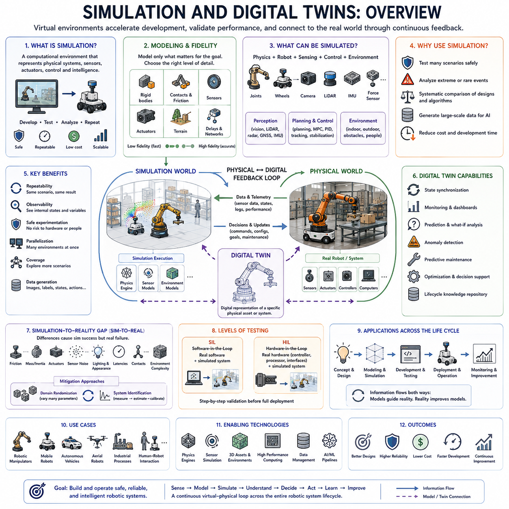
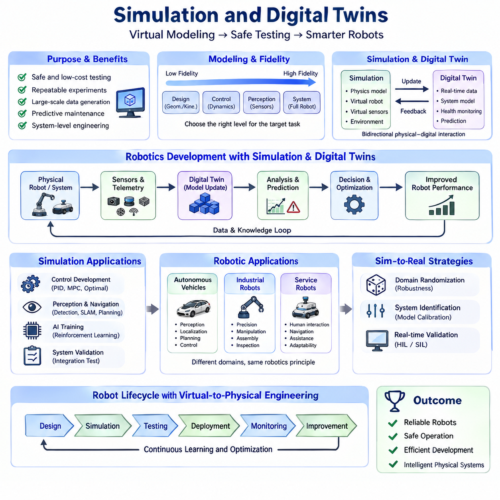
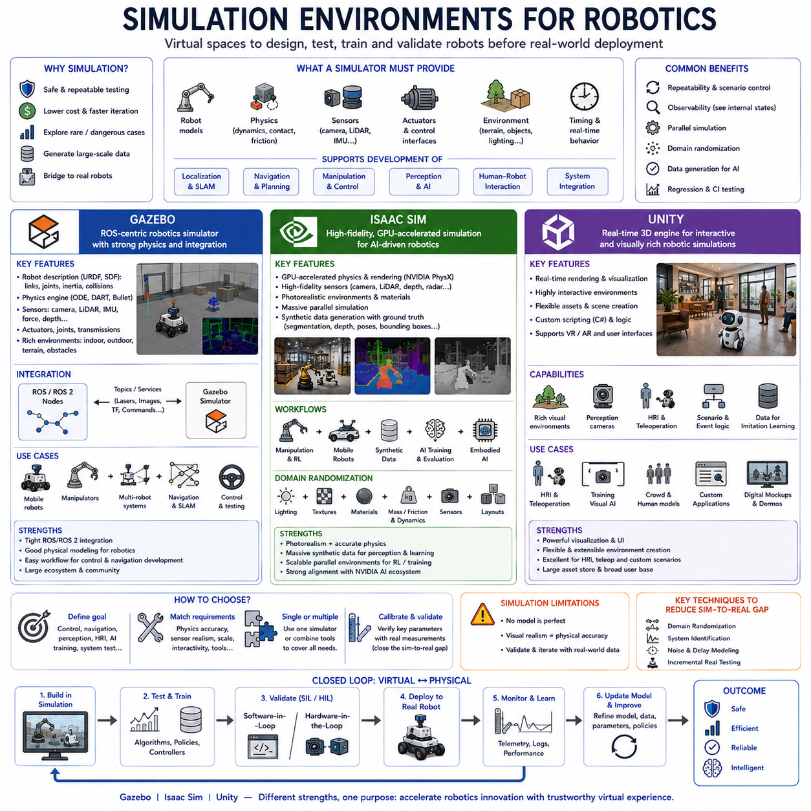
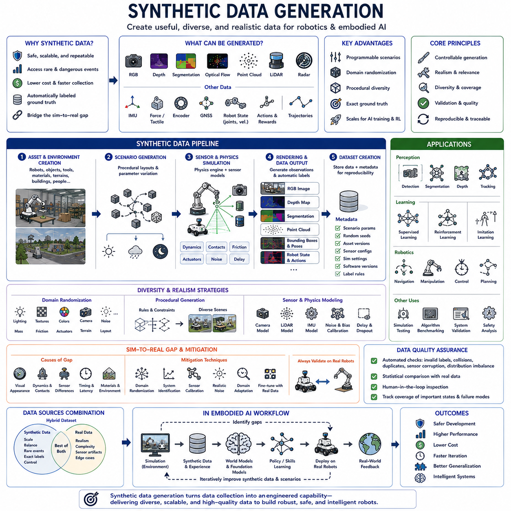
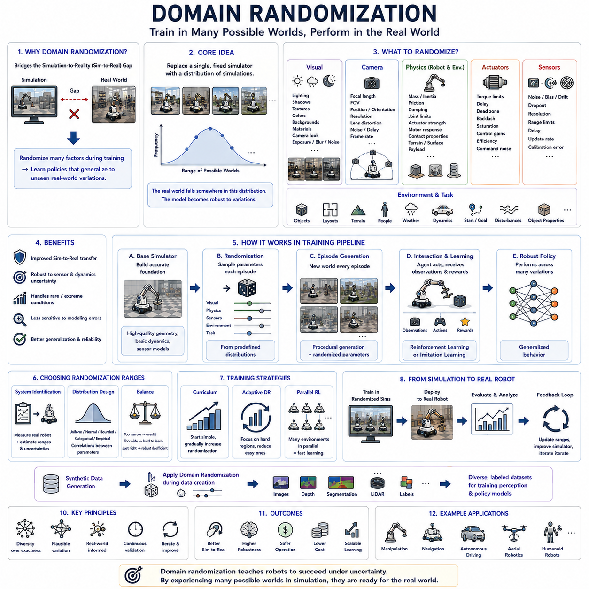
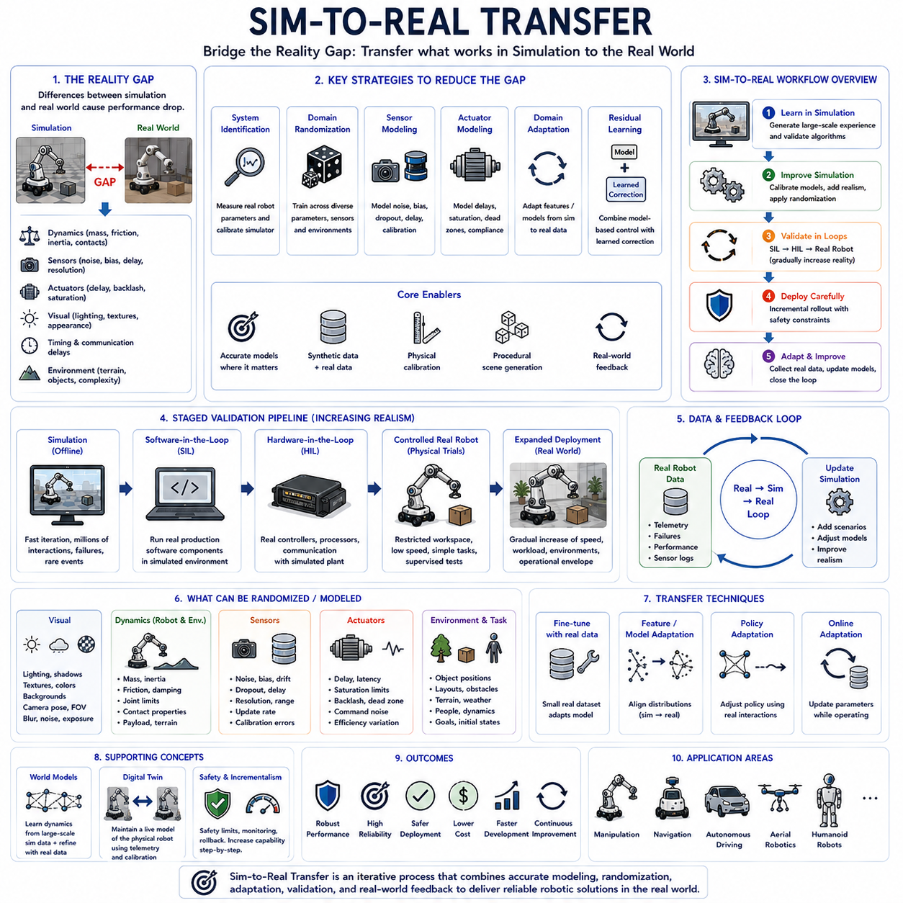
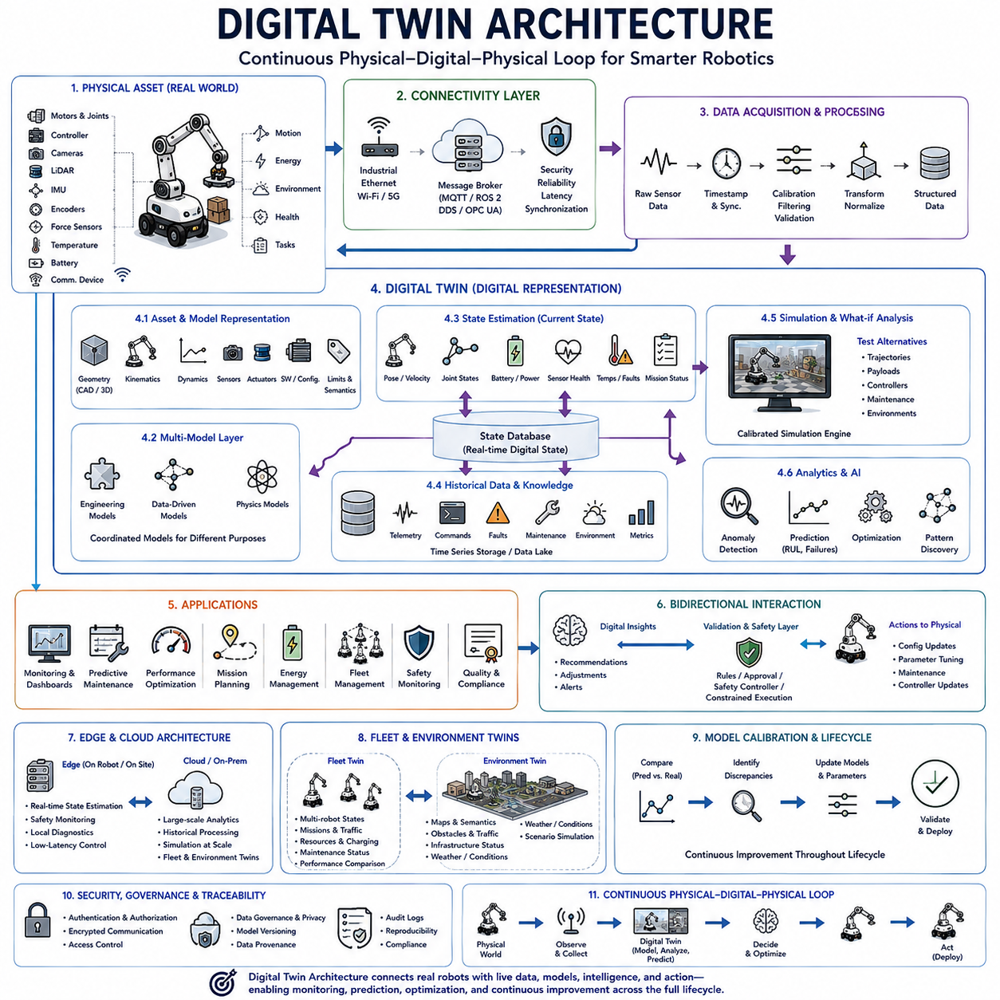
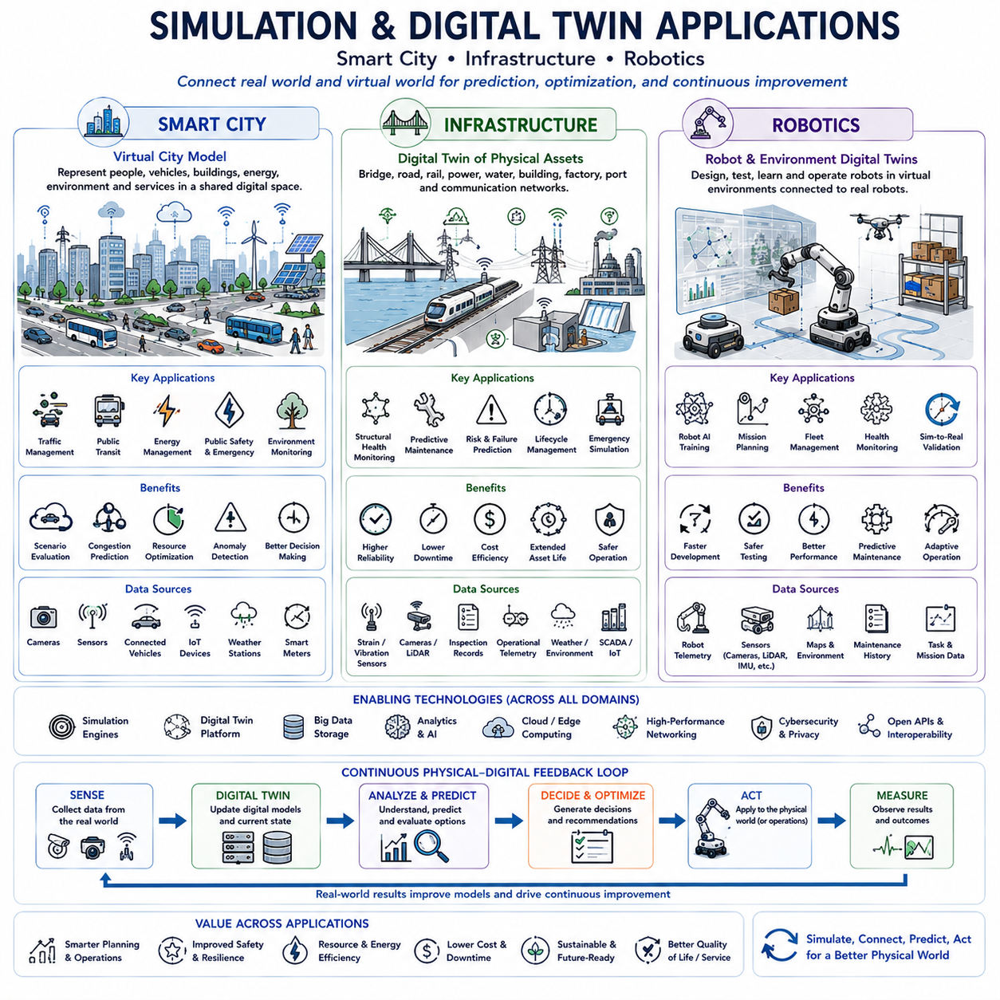

**Volume 45. Embodied AI and World Models**

# Chapter 05. Simulation and Digital Twins

## 05.00. Overview

{width="7.268055555555556in" height="7.268055555555556in"}

{width="7.268055555555556in" height="7.268055555555556in"}

Simulation provides a controlled computational environment in which robotic systems, physical processes, sensors, controllers, and intelligent algorithms can be developed and evaluated before deployment in the real world. By representing relevant aspects of physical behavior mathematically, simulation allows engineers to test designs repeatedly, explore dangerous or expensive situations safely, and investigate system behavior under conditions that would be difficult to reproduce experimentally.

A simulation model does not need to reproduce every physical detail of reality. Instead, it represents the properties that are important for a particular engineering objective, such as rigid-body motion, contact, friction, sensor measurements, actuator response, terrain interaction, or communication delay. The appropriate level of fidelity depends on whether the simulation is being used for mechanical design, control development, perception testing, AI training, or complete system validation.

Physics simulation models how objects move and interact according to physical laws and numerical approximations. Rigid-body dynamics describe forces, torques, mass, inertia, velocity, and acceleration, while collision and contact models determine how bodies interact when their geometries meet. More specialized simulations can include deformable materials, fluids, aerodynamics, tire behavior, articulated mechanisms, and other phenomena required by particular robotic applications.

Robot simulation integrates physical models with the sensing, computation, and control architecture of a robotic system. A virtual robot may contain joints, wheels, actuators, cameras, LiDAR, IMUs, force sensors, and other devices corresponding to the physical platform. Software can then receive simulated observations and generate commands through interfaces similar to those used on real hardware, enabling substantial portions of the robotics stack to be tested before physical integration.

Simulation is particularly valuable for control-system development because engineers can examine how controllers respond to disturbances, model uncertainty, actuator limitations, and changing operating conditions. PID, Model Predictive Control, optimal control, trajectory tracking, and stabilization algorithms can be evaluated repeatedly without risking physical hardware. Simulation also makes internal variables visible, helping engineers understand why a controller succeeds, oscillates, becomes unstable, or violates constraints.

Perception and navigation systems can also be developed in simulated environments. Virtual cameras, LiDAR, radar, depth sensors, GNSS, and inertial sensors can generate observations while robots move through modeled spaces. Localization, SLAM, object detection, path planning, obstacle avoidance, and navigation algorithms can therefore be exercised across many environments, although realistic sensor noise and environmental variation are essential for meaningful evaluation.

One major advantage of simulation is repeatability. A physical experiment may change because of lighting, temperature, surface conditions, battery state, human activity, or uncontrolled environmental factors. In simulation, engineers can preserve initial conditions and execute the same scenario repeatedly while changing only selected variables. This enables systematic comparison between algorithms, parameter configurations, hardware designs, and control strategies.

Simulation also supports large-scale data generation for artificial intelligence. A virtual environment can automatically produce images, depth maps, segmentation masks, object poses, robot states, actions, collisions, and other labels that would require substantial effort to collect manually in the physical world. Large numbers of parallel environments can further accelerate reinforcement learning, imitation learning, perception training, and policy evaluation.

However, models inevitably differ from reality, creating what is commonly called the simulation-to-reality gap, or Sim-to-Real gap. Differences in friction, mass, actuator response, sensor noise, lighting, material appearance, latency, contact dynamics, and environmental complexity can cause an algorithm that performs well in simulation to fail on a physical robot. Simulation performance must therefore be interpreted as evidence under modeled conditions rather than automatic proof of real-world performance.

Domain randomization addresses this problem by deliberately varying simulation parameters during training or testing. Lighting, textures, object positions, friction coefficients, masses, sensor noise, actuator properties, and environmental layouts can be changed across episodes. Instead of adapting to one perfectly modeled virtual world, an AI system learns to operate across a distribution of possible conditions, increasing the probability that the real environment falls within its learned experience.

System identification provides a complementary approach by improving the correspondence between simulation and physical hardware. Measurements collected from the real robot can be used to estimate parameters such as mass, inertia, friction, motor characteristics, delays, and other dynamic properties. The simulation model is then calibrated using these observations. Iterative comparison between simulated and measured behavior can progressively improve model fidelity where accuracy matters most.

A digital twin extends simulation by maintaining a structured digital representation of a specific physical system, asset, process, or environment. Unlike a simulation created only for offline experimentation, a digital twin is typically connected conceptually or operationally with its physical counterpart. Real measurements can update the digital representation, while analysis performed on the digital model can support monitoring, prediction, diagnosis, optimization, and operational decision making.

For a robot, a digital twin may represent mechanical configuration, joints, actuators, sensors, battery state, software configuration, operating environment, maintenance information, and historical behavior. Telemetry from the physical robot can update portions of this representation during operation. The twin can therefore become more than a geometric model by incorporating current state, operational history, performance indicators, and models of expected future behavior.

The relationship between physical and digital systems can form a continuous feedback cycle. The physical robot produces sensor data and telemetry that update the digital representation. The digital system analyzes current conditions, predicts possible future states, evaluates alternatives, or identifies anomalies. Selected decisions, configurations, maintenance recommendations, or control objectives can then influence the physical system, creating a bidirectional physical-digital interaction.

Digital twins are particularly useful for predictive maintenance and health monitoring. Motor current, vibration, temperature, battery characteristics, actuator performance, communication quality, and other signals can be compared with expected behavior. Deviations may indicate degradation before complete failure occurs. Historical data and predictive models can then estimate remaining useful life or recommend inspection and maintenance before operational capability is significantly affected.

Simulation and digital twins also support system-level engineering across the robot lifecycle. Mechanical designs can be evaluated before manufacturing, electrical and thermal behavior can be investigated before integration, software can be tested against virtual hardware, and operational scenarios can be explored before deployment. After deployment, telemetry can refine models and reveal discrepancies, allowing engineering knowledge to flow back into future designs and software revisions.

Hardware-in-the-Loop and Software-in-the-Loop testing provide important intermediate stages between pure simulation and complete physical deployment. Software-in-the-Loop evaluates actual software components against simulated systems, while Hardware-in-the-Loop introduces real controllers, processors, or interfaces into the simulated environment. These approaches allow timing, communication, integration, and failure behavior to be examined progressively before the entire robotic system is exposed to real operational conditions.

Modern embodied AI increases the importance of simulation because intelligent robots must learn and evaluate behavior across enormous combinations of states and interactions. Reinforcement-learning policies, world models, predictive systems, and multimodal agents can experience virtual scenarios faster and more safely than physical robots alone could provide. Simulation therefore becomes not merely an engineering verification tool but also an environment for generating experience and training physical intelligence.

World models and digital twins address related but different forms of prediction. A digital twin emphasizes a structured representation connected to a particular physical asset or system, while an AI world model learns representations of environmental dynamics that can predict possible future states. Combining these approaches can allow robots to use measured physical state, engineering knowledge, learned dynamics, and simulated alternatives within a unified predictive architecture.

The ultimate purpose of simulation and digital twins is not to replace physical testing but to make physical development more efficient, systematic, and informative. Simulation enables rapid exploration, digital twins connect models with operating systems, and real-world experiments provide the evidence needed to validate both. Together they create a continuous virtual-to-physical engineering loop in which design, testing, learning, deployment, monitoring, and improvement reinforce one another throughout the robotic system lifecycle.

## 05.01. Simulation Environments

{width="7.268055555555556in" height="7.268055555555556in"}

Simulation environments provide virtual spaces in which robots, sensors, controllers, perception systems, and AI algorithms can be developed before they are deployed on physical hardware. They combine models of robot geometry, dynamics, sensors, actuators, and surrounding environments with software interfaces that resemble real robotic systems. This allows engineers to experiment repeatedly while reducing hardware risk, development cost, and testing time.

A useful robotics simulator must represent more than visual appearance. It should reproduce relevant physical interactions such as gravity, inertia, collision, friction, contact forces, joint constraints, and actuator behavior while generating realistic sensor observations. The required fidelity depends on the application: control development emphasizes dynamics, perception training emphasizes sensor realism, and system integration requires consistent timing and interfaces.

Simulation environments also provide an important bridge between algorithm development and physical deployment. The same localization, SLAM, navigation, manipulation, or control software can often interact with either simulated or real robot interfaces. This enables Software-in-the-Loop testing, regression testing, scenario reproduction, and progressive integration. Simulation therefore becomes part of the engineering workflow rather than merely a visualization tool.

Gazebo is a widely used robotics simulation environment designed around physical robot modeling and integration with robotic middleware. Robot descriptions can define links, joints, inertial properties, collision geometry, sensors, and actuators. Physics engines calculate motion and contact, while simulated cameras, LiDAR, IMUs, and other sensors generate observations that can be consumed by robotics software in ways similar to physical devices.

Gazebo has historically been closely associated with the Robot Operating System ecosystem. ROS and ROS 2 components can connect simulated sensor data to localization, mapping, planning, and control nodes while sending commands back to simulated actuators. This architecture allows developers to test substantial portions of a robotic software stack without changing the conceptual communication structure that will later be used with real hardware.

For mobile robotics, Gazebo can reproduce differential-drive, Ackermann-steering, omnidirectional, legged, and other motion architectures. Virtual environments can contain walls, ramps, obstacles, furniture, terrain, and moving objects. Navigation algorithms can then evaluate localization, SLAM, global planning, local obstacle avoidance, and trajectory control under repeatable conditions before equivalent experiments are conducted on a physical robot.

Gazebo is also useful for manipulator development because articulated robot models can represent joint limits, kinematics, dynamics, collisions, and end-effector behavior. Motion planning and control systems can command virtual arms while engineers observe trajectories and contacts. Although simulation cannot perfectly reproduce complex real-world contact, backlash, compliance, or friction, it provides an effective environment for integration and early validation.

Isaac Sim is a robotics simulation platform designed around high-fidelity simulation, GPU acceleration, synthetic data generation, and AI-oriented robotics development. It can represent complex robots and environments while combining physics simulation with detailed visual rendering and sensor models. This makes it particularly useful when robotic development requires both physical interaction and large amounts of perception-oriented simulated data.

A major characteristic of Isaac Sim is its use of GPU computing to accelerate simulation and rendering workloads. Cameras, depth sensors, LiDAR, and other sensing modalities can be simulated in visually and geometrically detailed environments. Large synthetic datasets can be generated with automatically available ground-truth information such as segmentation, depth, object poses, bounding information, and other labels useful for training perception models.

Isaac Sim can support workflows involving reinforcement learning, manipulation, autonomous mobile robots, synthetic data, and embodied AI. Virtual robots can interact with objects while policies and perception systems are evaluated across varied environments. When many training experiences are required, simulation can provide interactions faster and more safely than physical robots, reducing dependence on expensive real-world data collection.

Domain randomization can be incorporated into Isaac Sim workflows to reduce the simulation-to-reality gap. Object appearance, lighting, material properties, sensor characteristics, positions, physical parameters, and environmental configurations can be varied systematically. AI models are therefore exposed to diverse conditions rather than one fixed virtual world, improving robustness when transferring learned perception or behavior to physical systems.

Isaac Sim is especially relevant to modern Physical AI because simulation can be connected with learning pipelines, synthetic data generation, robot policies, and digital-twin representations. Detailed virtual environments can become training grounds in which robots acquire experience before deployment. Real-world observations can subsequently reveal modeling differences, enabling simulation parameters and training distributions to be refined through iterative Sim-to-Real development.

Unity approaches robotics simulation from a different historical direction. Originally developed as a real-time 3D engine, it provides powerful capabilities for constructing interactive environments, rendering complex scenes, controlling virtual objects, and creating user-facing visualization. These characteristics make Unity useful when robotics simulation requires visually rich environments, human interaction, synthetic imagery, or customized interactive scenarios.

A Unity-based robotic environment can model indoor facilities, outdoor spaces, vehicles, people, objects, and task scenarios with substantial control over visual appearance. Cameras attached to virtual robots can generate image streams for perception development, while environmental logic can create changing conditions and interactive events. This flexibility is valuable for testing AI systems that must understand complex visual and semantic environments.

Unity can also support human-robot interaction and teleoperation research because interactive interfaces can be integrated directly into simulated environments. Human operators can control robots, interact with virtual objects, provide demonstrations, or participate in collaborative scenarios. Such environments can generate behavioral data for imitation learning or evaluate how robotic systems respond to human actions before experiments involving physical participants and hardware.

The strengths of Gazebo, Isaac Sim, and Unity therefore reflect different engineering priorities rather than a simple ranking. Gazebo emphasizes conventional robotics integration, physical robot models, and ROS-oriented development. Isaac Sim emphasizes GPU-accelerated simulation, high-fidelity sensing, synthetic data, and AI training. Unity provides strong interactive 3D visualization and flexible environment creation, particularly when visual realism or human interaction is important.

Simulator selection should be based on the intended validation target. A team developing ROS navigation and control may prioritize middleware integration and reproducible physical behavior, while an embodied AI project may require large-scale synthetic data and accelerated learning. A human-robot interaction project may emphasize interactive environments and visualization. In some engineering programs, multiple simulators may be used because no single environment optimally represents every subsystem.

Regardless of the selected platform, simulation fidelity must be treated carefully. Accurate graphics do not necessarily imply accurate dynamics, and physically detailed models do not automatically reproduce sensor behavior. Engineers should identify which characteristics influence the target algorithm and calibrate those characteristics using real measurements when possible. System identification, noise modeling, parameter variation, and validation experiments help determine whether simulated conclusions transfer to physical hardware.

Simulation environments become particularly powerful when integrated with continuous development and testing. Standard scenarios can be executed automatically whenever software changes, allowing failures in localization, planning, control, perception, or system integration to be detected before deployment. Recorded real-world failures can also be reconstructed virtually, turning operational experience into repeatable regression tests and progressively improving the reliability of the robotic software stack.

Gazebo, Isaac Sim, and Unity ultimately serve the same broader objective: creating controlled virtual experience for physical systems. They allow robots to be designed, integrated, trained, tested, and evaluated before every behavior is attempted in reality. Combined with real-world validation, digital twins, Sim-to-Real techniques, and continuous feedback, simulation environments form a fundamental engineering and learning infrastructure for modern autonomous robots and embodied intelligent systems.

## 05.02. Synthetic Data Generation [w/Code]

{width="7.268055555555556in" height="7.268055555555556in"}

Synthetic data generation creates artificial training, validation, or testing data by using simulation, procedural generation, rendering, generative models, or combinations of these methods. In robotics and embodied AI, synthetic data can reproduce sensor observations, object states, robot trajectories, environmental conditions, and interaction outcomes without requiring every example to be collected from the physical world. This makes it possible to scale data production while preserving control over scenario composition.

The central advantage of synthetic data is programmability. Engineers can deliberately choose object types, poses, lighting conditions, terrain, sensor parameters, robot states, weather, occlusions, and failure situations instead of waiting for them to occur naturally. Rare or dangerous events can therefore be represented much more frequently than in ordinary real-world datasets. This is especially valuable when safety-critical systems must be evaluated against scenarios that are difficult or expensive to reproduce physically.

Simulation environments can generate images, depth maps, segmentation masks, optical flow, point clouds, LiDAR scans, radar returns, force measurements, robot states, actions, and other forms of structured information. Because the simulator already knows the underlying scene state, labels can often be generated automatically. Object classes, bounding boxes, poses, distances, instance identities, and semantic regions can be recorded without manual annotation, substantially reducing labeling effort.

Synthetic data pipelines commonly begin with the creation of virtual assets and environments. Robots, vehicles, tools, furniture, terrain, buildings, and other objects are modeled or imported into a simulation environment. Their physical and visual properties are then configured according to the intended task. Procedural methods can automatically vary positions, layouts, object combinations, textures, and scene structures, enabling large numbers of distinct scenarios to be produced from reusable components.

Rendering quality strongly influences synthetic visual data. Camera models must represent field of view, resolution, lens characteristics, exposure, motion blur, noise, and other properties that affect real sensors. Lighting, shadows, reflections, surface materials, and environmental appearance also influence how perception models interpret images. High visual fidelity can reduce some differences between synthetic and real data, but realistic appearance alone does not guarantee successful transfer to physical environments.

Sensor simulation extends beyond cameras. Virtual LiDAR can produce range measurements or point clouds, IMU models can simulate acceleration and angular velocity, and radar or ultrasonic sensors can approximate other forms of environmental observation. Encoders, force sensors, tactile sensors, and GNSS can also be represented. Each sensor requires suitable noise, delay, resolution, dropout, bias, and calibration models if the generated data is intended to resemble real robotic measurements.

Ground-truth generation is one of the most powerful features of synthetic environments. A simulator can directly access information that would be difficult to measure accurately in the real world, such as exact object poses, complete depth, surface normals, contact states, collision events, hidden geometry, or future trajectories. These labels can support supervised learning, evaluation, debugging, state estimation research, and comparison between algorithms under known conditions.

Domain randomization deliberately varies visual and physical parameters to increase diversity and reduce overfitting to one virtual environment. Textures, illumination, colors, object shapes, camera positions, sensor noise, friction, mass, actuator behavior, terrain, and layout can be randomized across generated samples. The objective is not necessarily to create a perfect replica of reality but to expose the model to sufficiently broad variation that real-world conditions become part of the learned distribution.

Procedural generation provides another mechanism for scaling diversity. Instead of manually designing every room, road, warehouse, obstacle arrangement, or object configuration, algorithms can construct environments according to configurable rules. Procedural systems can generate thousands of variations while maintaining constraints such as navigable paths, valid object placement, task feasibility, or balanced scenario categories. This reduces manual scene-authoring effort and improves dataset coverage.

Synthetic data can be particularly valuable for perception tasks such as object detection, semantic segmentation, pose estimation, depth prediction, and tracking. Exact labels can be generated automatically for every rendered frame, allowing large datasets to be created quickly. However, models trained only on synthetic imagery may learn visual characteristics that differ from physical sensor data, so real-world validation and mixed-data training are often necessary.

For reinforcement learning and embodied learning, synthetic data includes not only observations but also interaction experience. Simulated agents can perform actions, receive rewards, encounter failures, and generate complete trajectories at a scale that would be impractical with physical robots. Parallel simulation can produce many episodes simultaneously, accelerating policy learning and exploration while preventing unnecessary wear, collisions, or safety risks on real hardware.

Imitation learning can also benefit from synthetic demonstrations. Expert controllers, planners, scripted policies, or teleoperation interfaces can generate trajectories containing state-action pairs. These demonstrations can train policies before limited real demonstrations are introduced. Simulation also allows the same task to be demonstrated under varied initial states, object placements, disturbances, and environmental conditions, improving behavioral coverage beyond a small set of physical demonstrations.

Synthetic data must nevertheless be evaluated for realism, diversity, and relevance. A very large dataset can still be ineffective if it fails to represent the variations that matter in the real operating environment. Dataset design should therefore consider not only sample count but also coverage of important states, sensor conditions, task difficulty, failure modes, and uncertainty. The target deployment environment should determine which aspects of the synthetic distribution receive the greatest attention.

The simulation-to-reality gap remains a central limitation. Visual appearance, contact dynamics, sensor artifacts, timing, material properties, actuator behavior, and environmental complexity may differ from reality. These discrepancies can produce systematic biases in learned models. Domain randomization, system identification, sensor calibration, realistic noise modeling, domain adaptation, and fine-tuning with real data can reduce the gap, but physical validation remains essential.

Hybrid datasets combine synthetic and real-world data to exploit the strengths of both sources. Synthetic data can provide scale, balanced categories, rare events, exact labels, and controllable variation, while real data captures physical complexity that is difficult to model. Training strategies may use synthetic data for pretraining followed by real-data fine-tuning, mix both sources during training, or selectively generate synthetic samples that address weaknesses identified in real datasets.

Generative AI provides an additional source of synthetic data beyond conventional simulation. Generative models can create or modify images, scenes, textures, trajectories, language instructions, or other data modalities. In robotics, however, purely generated content must be used carefully because visual plausibility does not automatically guarantee geometric, physical, or temporal consistency. Physics-based simulation remains important when the learning objective depends on realistic interaction or motion.

Synthetic data pipelines should preserve metadata and reproducibility. Scene parameters, random seeds, asset versions, simulator settings, sensor configurations, label-generation rules, and software versions should be recorded with generated datasets. Without this information, identifying systematic errors or recreating training conditions becomes difficult. Reproducible generation also enables datasets to be regenerated when assets, models, or scenario distributions are updated.

Quality assurance is therefore an important part of synthetic data engineering. Automated checks can detect invalid labels, impossible object placements, sensor corruption, unrealistic trajectories, duplicate scenes, or severe distribution imbalance. Statistical comparison with real-world data can reveal differences in object frequencies, lighting, geometry, noise, or motion. Human inspection can complement automated validation when perceptual realism or task plausibility is difficult to quantify.

In embodied AI, synthetic data increasingly connects simulation, world models, foundation models, and real-world robot learning. Simulation can generate structured interaction experience, world models can learn predictive representations from that experience, and foundation models can benefit from diverse multimodal observations and action data. Real-world deployment then provides new measurements that identify missing scenarios, allowing the synthetic generation process to be iteratively improved.

Synthetic data generation ultimately transforms data collection from a largely passive process into an engineered component of robotic system development. Instead of collecting only what happens to occur, engineers can create targeted experiences designed around learning objectives, safety requirements, rare events, and deployment gaps. When combined with real data, careful validation, and Sim-to-Real techniques, synthetic data becomes a scalable foundation for perception, control, navigation, embodied learning, and intelligent robotic systems.

## 05.03. Domain Randomization

{width="7.268055555555556in" height="7.268055555555556in"}

Domain randomization is a simulation strategy for improving the transfer of learned robotic behavior from virtual environments to the physical world. Instead of attempting to create one perfectly accurate simulator, it deliberately varies visual, physical, sensor, and environmental parameters during training. The resulting model learns to operate across many possible worlds rather than depending on a single simulated configuration.

The central idea is to replace a fixed simulation with a distribution of simulations. Each training episode can use different object positions, lighting conditions, textures, friction coefficients, masses, sensor characteristics, actuator responses, terrain properties, or environmental layouts. If the real world falls somewhere inside or near this distribution, the learned policy or perception model has a greater chance of operating successfully after deployment.

Domain randomization directly addresses the simulation-to-reality gap, commonly called the Sim-to-Real gap. Even high-fidelity simulators cannot reproduce every physical property, material interaction, sensor artifact, timing effect, or environmental variation found in reality. A model trained on one deterministic simulator may therefore exploit simulation-specific characteristics. Randomization makes these characteristics unreliable and encourages the model to learn features that remain useful under broader conditions.

Visual domain randomization changes the appearance of simulated environments. Illumination, shadows, textures, colors, backgrounds, object materials, camera exposure, viewpoints, and scene composition can vary during data generation. Perception systems are then prevented from associating task success with one particular visual style. This is especially important for object detection, segmentation, pose estimation, tracking, and vision-based robot policies.

Camera randomization can extend to intrinsic and extrinsic parameters. Focal length, field of view, camera position, orientation, image resolution, lens distortion, noise, blur, exposure, and latency may be changed within realistic ranges. Such variation helps learned models tolerate imperfect sensor calibration and differences among physical cameras. However, distributions should remain physically meaningful rather than including arbitrary variation that teaches unrealistic behavior.

Physical domain randomization changes parameters governing robot and environment dynamics. Robot mass, inertia, center of gravity, friction, damping, joint characteristics, actuator strength, motor response, contact parameters, payload, and surface properties can be varied between simulations. A control policy trained under these conditions must learn behavior that remains stable despite uncertainty in the exact physical model.

Actuator randomization is particularly useful because real motors and transmissions rarely behave exactly like ideal simulated actuators. Torque limits, response delays, dead zones, backlash, saturation, control gains, efficiency, and command noise may differ among individual robots or change with temperature, wear, and payload. Randomizing these properties forces a policy to rely less on a precise actuator model and increases robustness to hardware variation.

Sensor randomization performs a similar function for perception and state estimation. Noise levels, biases, drift, measurement dropout, resolution, range limits, time delay, update frequency, and calibration error can be varied. LiDAR, cameras, IMUs, encoders, radar, force sensors, and GNSS can each require different randomization models. This prevents an AI system from assuming unrealistically clean measurements that will never exist on a physical robot.

Environmental randomization expands the range of situations encountered during learning. Obstacles, object locations, room layouts, road geometry, terrain, people, dynamic agents, weather, and task initial conditions can change from episode to episode. Procedural generation can automate the creation of these variations. The resulting training distribution exposes agents to many possible operating conditions instead of repeatedly presenting nearly identical scenarios.

Task randomization varies goals, starting states, object configurations, target positions, disturbances, and task parameters. For manipulation, objects may appear at different poses or with different dimensions and masses. For navigation, start and destination locations can change together with obstacle configurations. This encourages policies to learn transferable task structure rather than memorize a small collection of fixed trajectories.

Randomization ranges must be selected carefully. If they are too narrow, the model may still overfit to the simulator and fail when the real system differs significantly. If they are excessively broad, training may become unnecessarily difficult or produce conservative behavior because the agent spends substantial effort handling unrealistic conditions. Effective domain randomization therefore requires a balance between diversity, physical plausibility, and relevance to the deployment environment.

System identification can help determine useful randomization ranges. Measurements from the physical robot can estimate mass, friction, actuator response, sensor bias, delay, and other uncertain parameters. Instead of representing each value as one exact estimate, engineers can construct probability distributions around the measured range. Domain randomization then trains the model across plausible uncertainty rather than relying on arbitrary parameter selection.

Uniform random sampling is conceptually simple, but not every parameter needs to follow a uniform distribution. Normal, bounded, categorical, empirical, or task-specific distributions may better describe real variation. Parameters can also be correlated; for example, payload may influence inertia and motor demand simultaneously. Realistic joint distributions can therefore provide more meaningful diversity than independently randomizing every variable without considering physical relationships.

Curriculum strategies can progressively increase randomization during training. An agent may first learn the basic task in relatively simple and predictable conditions. Once performance improves, the range of lighting, dynamics, disturbances, object layouts, or sensor uncertainty can be expanded. This progression prevents excessive early difficulty while gradually developing robustness to a broader set of conditions.

Adaptive domain randomization extends this concept by modifying the randomization distribution according to model performance. Parameters that are already handled reliably may receive less emphasis, while conditions that expose weaknesses can be sampled more frequently. Training then becomes an iterative search for challenging but learnable environments. This approach can improve sample efficiency compared with continuously sampling all conditions with equal probability.

Domain randomization is widely used with reinforcement learning because simulated agents may require enormous amounts of interaction experience. Thousands or millions of episodes can be generated while changing dynamics and environments automatically. Policies that repeatedly succeed across these variations are less likely to depend on one specific virtual world. This makes domain randomization an important component of simulation-based embodied learning and robot policy training.

Synthetic data generation and domain randomization are closely connected. A synthetic data pipeline can vary visual appearance, scene composition, sensors, and physical parameters while automatically generating labels. The resulting dataset contains controlled diversity instead of merely increasing sample count. Domain randomization therefore determines how synthetic experience is distributed, while synthetic data generation provides the mechanism for producing and recording that experience.

Domain randomization should not be interpreted as a complete replacement for realistic simulation. Some physical relationships must remain accurate enough for the learning problem. Randomizing around a fundamentally incorrect model may simply create many inaccurate simulations. High-quality robot geometry, basic dynamics, sensor models, and task constraints should therefore provide the foundation upon which purposeful randomization is applied.

Real-world validation remains essential after randomized simulation training. Performance should be evaluated on physical robots across representative environments, payloads, sensors, and operating conditions. Failure cases can reveal which aspects of reality were missing from the simulation distribution. These observations can then be used to expand or reshape randomization parameters, creating an iterative Real-to-Sim-to-Real improvement cycle.

A mature workflow therefore combines domain randomization with system identification, synthetic data, digital twins, and Sim-to-Real transfer. Real measurements inform the simulation, randomized environments create diverse training experience, learned models are deployed and evaluated, and new physical observations identify remaining gaps. This continuous feedback process allows simulation to become progressively more useful without requiring a perfect digital replica from the beginning.

For embodied AI, the broader significance of domain randomization is that it teaches agents to operate under uncertainty rather than assuming one exact world. Physical environments always contain variation in objects, sensors, dynamics, humans, surfaces, and operating conditions. By learning across deliberately diversified virtual experiences, robotic systems can develop more robust perception, control, navigation, and decision making before encountering the full complexity of reality.

## 05.04. Sim2Real Transfer

{width="7.268055555555556in" height="7.268055555555556in"}

Sim-to-Real transfer addresses the challenge of moving robotic capabilities learned or validated in simulation into physical environments. A policy, perception model, controller, or planning system may perform well in a virtual world yet behave differently on real hardware because the simulator only approximates reality. Successful transfer therefore requires methods that reduce sensitivity to modeling errors and prepare the system for physical uncertainty.

The fundamental difficulty is the reality gap between simulated and physical systems. Differences may appear in friction, mass, inertia, actuator response, contact behavior, sensor noise, timing, lighting, textures, communication delay, and environmental complexity. Even small discrepancies can accumulate through a closed-loop robotic system, causing errors in perception, state estimation, planning, or control that were not visible during simulation.

Sim-to-Real transfer begins with identifying which simulated properties most strongly influence the target behavior. A vision model may depend heavily on lighting, appearance, and camera characteristics, whereas a locomotion or manipulation policy may be more sensitive to dynamics, contacts, actuator delays, and payload variation. Transfer engineering should therefore prioritize the dimensions that actually affect task performance rather than attempting to model every physical detail equally.

System identification improves transfer by estimating physical parameters from measurements collected on the real robot. Motor responses, friction, inertia, joint dynamics, delays, sensor biases, and other properties can be measured experimentally and incorporated into the simulator. Repeated comparison between simulated and physical trajectories then allows engineers to calibrate the virtual model and reduce systematic differences before learning or validation continues.

Domain randomization provides a complementary strategy by training across many possible simulated systems instead of relying on one calibrated model. Physical parameters, sensor characteristics, textures, illumination, terrain, object positions, and environmental conditions can vary between episodes. A policy that succeeds across this distribution is less likely to depend on simulator-specific assumptions and can become more tolerant of unknown real-world variation.

Sensor modeling is particularly important because algorithms operate on measurements rather than on perfect physical state. Real cameras contain exposure variation, blur, lens distortion, noise, and timing effects, while LiDAR, IMUs, encoders, GNSS, radar, and force sensors introduce their own uncertainty. Simulated sensors should therefore represent realistic noise, bias, dropout, resolution, latency, calibration errors, and update rates when these factors influence the deployed system.

Actuator and control interfaces also create important transfer challenges. Simulated motors may respond immediately and exactly to commanded torque or velocity, whereas physical systems contain saturation, backlash, dead zones, delays, thermal effects, compliance, and varying efficiency. Randomizing or identifying these effects during training can prevent a learned controller from exploiting unrealistically precise actuation that will not exist on the physical robot.

For perception systems, photorealistic rendering can reduce some visual differences between simulation and reality, but visual realism alone is not sufficient. A highly realistic image may still contain incorrect sensor statistics or scene distributions. Synthetic training therefore often combines rendering quality with domain randomization, procedural scene generation, real sensor calibration, domain adaptation, and limited real-data fine-tuning to improve physical-world performance.

Domain adaptation directly modifies representations or models so that information learned from simulated data becomes useful for real observations. Adaptation can occur at the image, feature, model, or policy level and may use labeled or unlabeled real-world samples. Synthetic data can provide large-scale pretraining, while comparatively small quantities of real data correct distribution differences that simulation cannot represent accurately enough.

A practical transfer workflow often progresses through increasingly realistic validation stages. Algorithms are first tested in pure simulation, followed by Software-in-the-Loop evaluation using production software components. Hardware-in-the-Loop testing then introduces actual processors, controllers, communication interfaces, or embedded hardware while retaining a simulated environment. Finally, controlled physical experiments expose the complete robot to real sensors, dynamics, and environmental uncertainty.

Incremental deployment reduces risk during physical validation. Rather than immediately executing the full learned behavior at maximum speed or workload, engineers can begin with restricted operating regions, reduced velocities, simple environments, conservative safety limits, and supervised trials. As evidence accumulates, the operational envelope can gradually expand. This staged procedure makes transfer failures easier to identify and reduces the consequences of unexpected behavior.

Residual learning can combine reliable model-based control with learned corrections. A conventional controller may provide a stable baseline behavior, while a learned component compensates for dynamics or disturbances that the analytical model does not capture accurately. Because the learned model does not need to generate the entire control action, the transfer problem can become easier and safer than transferring an unconstrained end-to-end policy.

Online adaptation extends Sim-to-Real transfer beyond initial deployment. Once a robot begins operating, real measurements can reveal changes in payload, friction, sensor characteristics, wear, environment, or actuator response. Adaptive controllers or learned models can update selected parameters while maintaining safety constraints. This transforms transfer from a one-time conversion process into continuous adaptation across the operational lifetime of the robot.

Real-world failure data is especially valuable because it identifies gaps that simulation failed to represent. A physical test may reveal unexpected slip, vibration, lighting conditions, communication delays, contact events, or obstacle configurations. These cases can be reconstructed in simulation and added to training or regression scenarios. The result is a Real-to-Sim-to-Real loop in which physical experience continuously improves the virtual training environment.

Digital twins can strengthen this loop by maintaining a structured representation of a particular physical robot and its operating state. Telemetry, maintenance information, calibration values, sensor health, and performance measurements can update the digital representation. Simulation experiments can then use this information to evaluate future behavior or test updated policies under conditions that more closely reflect the current physical system.

For reinforcement learning and embodied AI, Sim-to-Real transfer enables policies to acquire large amounts of experience without placing physical robots at constant risk. Simulation can generate millions of interactions, including failures and rare events, while real-world execution provides limited but essential evidence about physical validity. The challenge is to preserve the scalability of simulated learning while grounding the resulting behavior in real dynamics and observations.

World models can further support transfer by learning representations of how states evolve under actions. Simulated experience provides large-scale trajectories, while physical data can refine the learned dynamics where reality differs from simulation. A world model that combines both sources may help an embodied agent predict future consequences more accurately and detect when its internal expectations no longer match the physical environment.

Sim-to-Real transfer ultimately requires coordinated use of accurate modeling, domain randomization, system identification, sensor and actuator realism, adaptation, staged validation, and real-world feedback. No single technique completely removes the reality gap. Reliable robotic deployment emerges from an iterative virtual--physical engineering process in which simulation creates scalable experience, physical experiments reveal discrepancies, and each cycle improves both the model and the robot.

## 05.05. Digital Twin Architecture

{width="7.268055555555556in" height="7.268055555555556in"}

A digital twin architecture defines how a physical robot, machine, process, or environment is represented, synchronized, analyzed, and managed through a corresponding digital system. Unlike a static simulation model, a digital twin maintains an operational relationship with its physical counterpart. Sensor measurements, telemetry, configuration data, and historical information continuously connect physical behavior with digital representations used for monitoring, prediction, optimization, and decision making.

The architecture normally begins with the physical layer, which contains the real asset and everything required to observe its operational state. For a robot, this may include mechanical structures, motors, joints, batteries, controllers, cameras, LiDAR, IMUs, encoders, temperature sensors, force sensors, and communication devices. These components generate measurements describing motion, energy consumption, environmental interaction, component health, and task execution.

The connectivity layer transfers information between the physical asset and its digital representation. Industrial Ethernet, wireless networks, field buses, middleware, message brokers, and robotic communication frameworks may carry telemetry and commands. Communication architecture must consider bandwidth, latency, synchronization, reliability, security, and intermittent connectivity because digital-twin performance depends strongly on the quality and timeliness of information exchanged with the physical system.

Data acquisition transforms raw physical measurements into structured information suitable for digital processing. Sensor values may require timestamping, calibration, filtering, coordinate transformation, unit normalization, and validation before they are stored or analyzed. Time synchronization is particularly important for robots containing multiple cameras, LiDAR, IMUs, encoders, and controllers because observations from different sources must represent consistent moments in physical operation.

The digital representation layer describes the structure and state of the physical asset. It may contain geometry, kinematic relationships, dynamic parameters, sensor configurations, actuator characteristics, software versions, operating limits, and semantic information. A robotic digital twin can therefore represent not only what the robot looks like but also how its components are connected, how they behave, and what their current operational conditions are.

Different models can coexist within the same digital twin. CAD and geometric models describe physical shape, kinematic models describe motion constraints, dynamic models represent forces and responses, and thermal or electrical models describe additional physical behavior. Data-driven models can complement these engineering representations by learning relationships that are difficult to formulate analytically. The architecture coordinates these models according to the required application.

The state layer maintains the current digital estimate of the physical system. Robot position, velocity, joint states, battery state of charge, payload, sensor health, motor temperature, fault conditions, and mission status can be updated from telemetry. Because measurements may be noisy or incomplete, state estimation techniques can combine multiple observations with mathematical models to maintain a coherent representation of the robot\'s operational condition.

Historical data extends the twin beyond instantaneous state. Telemetry, commands, faults, maintenance actions, environmental conditions, mission histories, and performance metrics can be stored over time. This historical record allows engineers to compare current behavior with previous operation, identify degradation trends, reconstruct failures, and develop predictive models. The digital twin therefore becomes a temporal representation of the asset rather than merely a snapshot.

Simulation engines can operate on the digital representation to evaluate hypothetical conditions without disturbing the physical robot. Engineers may test alternative trajectories, payloads, controller parameters, maintenance decisions, or environmental conditions. When simulation models are calibrated using physical measurements, these experiments can provide useful predictions about how the corresponding robot may behave under future or modified operating conditions.

Analytics and AI form another important architectural layer. Anomaly detection can identify deviations from expected behavior, predictive models can estimate future component conditions, and optimization algorithms can recommend improved operating parameters. Machine learning can discover relationships within telemetry that conventional threshold monitoring may miss. These capabilities transform the digital twin from a visualization system into an analytical and predictive engineering platform.

Predictive maintenance is a representative digital-twin application. Motor current, vibration, temperature, battery behavior, actuator response, and other indicators can be compared against historical baselines or learned models. Gradual changes may reveal degradation before a component fails completely. Maintenance can then be scheduled according to estimated condition and remaining useful life rather than relying exclusively on fixed service intervals.

A digital twin can also support robot performance optimization. Energy consumption, trajectory efficiency, actuator loading, task completion time, localization quality, and computational utilization can be analyzed together. Alternative configurations may first be evaluated digitally and then applied selectively to the physical system. This creates a controlled mechanism for improving operation while reducing the need for repeated trial-and-error experiments on production hardware.

Bidirectional interaction distinguishes advanced digital twins from passive monitoring systems. Physical measurements update the digital state, while results from digital analysis can influence configuration, planning, maintenance, or control decisions. However, direct command paths require strong safety mechanisms. Recommendations may pass through validation rules, human approval, safety controllers, or constrained execution layers before they are permitted to modify physical robot behavior.

Edge and cloud computing can divide digital-twin workloads according to latency and computational requirements. Time-critical state estimation, safety monitoring, and local diagnostics may execute near the robot, while large-scale analytics, fleet comparisons, historical processing, or computationally intensive simulation may execute on on-premise servers or cloud infrastructure. A distributed architecture allows each function to operate where communication, performance, privacy, and reliability requirements are best satisfied.

Fleet-level digital twins extend the concept from one robot to multiple interacting assets. Each robot can maintain an individual state while a higher-level representation describes fleet locations, missions, traffic, charging resources, maintenance status, and shared environments. This enables fleet optimization, coordinated scheduling, congestion analysis, resource allocation, and comparison of component performance across many robots operating under different conditions.

Environmental digital twins can complement robot twins by representing buildings, warehouses, roads, factories, terrain, infrastructure, and dynamic objects. A robot can then be analyzed within a digital representation of its operating environment rather than as an isolated machine. Maps, semantic information, obstacle states, traffic conditions, and infrastructure status can support navigation, mission planning, simulation, and operational forecasting.

Digital twins and world models can interact while serving different purposes. A digital twin emphasizes a structured representation tied to identifiable physical assets and measured operational states. A world model emphasizes learned representations that predict how environments and agents may evolve. Combining them allows engineered knowledge and telemetry to provide grounding while learned dynamics contribute predictions about uncertain or complex future interactions.

The architecture should also manage model fidelity explicitly. Not every component requires the same level of detail, and unnecessary complexity can increase computational cost without improving decisions. High-fidelity models may be needed for contact dynamics or structural analysis, while simplified models may be sufficient for fleet scheduling. Digital-twin design should therefore match model resolution and update frequency to the decisions the twin is expected to support.

Model calibration and validation are continuous processes rather than one-time activities. Differences between predicted and measured behavior reveal inaccuracies in friction, mass, actuator dynamics, sensor models, battery characteristics, or environmental assumptions. Real measurements can update these parameters through system identification and data-driven estimation. The twin becomes progressively more representative as operational evidence accumulates throughout the asset lifecycle.

Security, data governance, and traceability are essential because digital twins may contain detailed operational information and potentially influence physical equipment. Authentication, authorization, encrypted communication, access control, model versioning, data provenance, and audit records help protect the physical-digital connection. Engineers must also know which model, configuration, dataset, and software version produced a particular prediction or operational recommendation.

A mature digital twin architecture therefore forms a continuous physical-digital-physical loop. The robot produces observations, connectivity and data layers organize them, digital models maintain state, simulation and AI evaluate present and future behavior, and validated decisions return to engineering or operations. Combined with Sim-to-Real methods and real-world feedback, this architecture creates an evolving engineering representation that supports robots throughout design, deployment, operation, maintenance, and continuous improvement.

## 05.06. Applications

{width="7.268055555555556in" height="7.268055555555556in"}

Simulation and digital-twin applications become especially valuable when complex physical environments must be monitored, predicted, optimized, and continuously improved. Smart cities, infrastructure systems, and robotics all involve many interacting assets whose behavior changes over time. Virtual representations allow engineers and operators to connect sensing, models, analytics, and operational decisions within a common physical-digital feedback loop.

In a smart city, simulation can represent transportation networks, buildings, pedestrians, energy demand, environmental conditions, public services, and autonomous systems within a shared virtual environment. Planners can evaluate how changes in road layouts, traffic control, public transportation, or population movement may influence urban performance before applying modifications to the physical city. This reduces risk and supports evidence-based planning.

Digital twins extend this capability by connecting the virtual representation with data generated by the operating city. Traffic sensors, cameras, connected vehicles, weather stations, energy meters, public infrastructure, and IoT devices can update models of current conditions. The resulting city twin can support monitoring, prediction, anomaly detection, resource allocation, emergency planning, and coordination among multiple urban systems.

Transportation is one of the most important smart-city applications. A digital representation of roads, intersections, parking areas, transit routes, and vehicle flows can be used to estimate congestion and evaluate alternative traffic-control strategies. Autonomous vehicles and delivery robots can also be introduced into simulated traffic scenarios, allowing planners to study interactions between human drivers, pedestrians, infrastructure, and robotic mobility before large-scale deployment.

Smart-city energy systems can similarly benefit from simulation and digital twins. Buildings, charging stations, renewable energy sources, storage systems, electric vehicles, and distribution networks generate changing demand and supply patterns. Digital models can forecast energy consumption, evaluate charging schedules, detect abnormal usage, and explore strategies that reduce peak demand while maintaining reliable service across the urban environment.

Infrastructure applications focus on physical assets whose reliability is critical to transportation, utilities, industry, and public safety. Bridges, tunnels, roads, railways, power networks, water systems, factories, ports, and communication facilities can be represented through engineering models connected with operational measurements. These models help engineers understand not only current condition but also how deterioration or changing loads may affect future performance.

Structural digital twins can combine geometry, material properties, sensor measurements, environmental conditions, and historical inspection records. Strain gauges, vibration sensors, temperature sensors, cameras, LiDAR, and other monitoring devices can provide information about structural behavior. Comparing these measurements with expected model responses may reveal unusual deformation, fatigue, damage, or environmental effects before they develop into more serious failures.

Predictive maintenance is a major infrastructure use case because fixed inspection intervals do not always reflect actual asset condition. Historical telemetry and real-time measurements can be analyzed to identify degradation trends and estimate remaining useful life. Maintenance can then be prioritized according to risk and predicted condition, improving resource efficiency while reducing unexpected failures and unnecessary interventions.

Simulation also allows infrastructure operators to evaluate rare or dangerous situations that are difficult to reproduce physically. Flooding, earthquakes, extreme loading, traffic disruption, component failure, power outages, or emergency evacuations can be explored within virtual environments. The objective is not to predict every event perfectly but to understand possible system responses and prepare operational strategies before real emergencies occur.

Infrastructure digital twins can support construction and lifecycle management as well as operation. During design, virtual models allow alternatives to be evaluated before physical construction begins. During commissioning, measurements can be used to calibrate models. During operation, the same digital representation can incorporate inspection results, maintenance history, asset modifications, and current conditions, preserving engineering knowledge throughout the asset lifecycle.

Robotics applications use simulation as both an engineering tool and a learning environment. Mobile robots, manipulators, drones, autonomous vehicles, and legged systems can be developed in virtual environments before exposing physical hardware to uncertain or dangerous behavior. Engineers can evaluate kinematics, dynamics, perception, localization, planning, control, and task execution while observing internal states that may be difficult to measure on the real robot.

Simulation is especially important for robotic AI because learning algorithms often require large quantities of interaction data. Reinforcement-learning policies can perform millions of virtual actions, perception systems can receive automatically labeled synthetic observations, and navigation systems can encounter many procedurally generated environments. This scalable experience reduces reliance on expensive physical experimentation and accelerates early-stage policy and model development.

Digital twins give robotics a more asset-specific operational representation. A twin can maintain the current configuration, battery condition, actuator state, sensor health, software version, payload, mission status, and maintenance history of a particular robot. Telemetry from the robot updates the digital state, while simulations or analytics can evaluate alternative missions, control parameters, charging strategies, or maintenance actions before they are applied.

Fleet robotics extends the concept from one robot to many cooperating systems. A fleet-level twin can represent robot positions, tasks, traffic, charging resources, communication status, failures, and shared maps. Operators can use this representation to optimize task allocation, predict congestion, coordinate charging, evaluate system capacity, and compare performance across robots. This is particularly valuable in warehouses, factories, campuses, hospitals, and large service environments.

Environmental twins can further improve robot operation by representing the spaces in which robots work. Buildings, roads, warehouses, terrain, doors, elevators, obstacles, traffic zones, and semantic regions can be synchronized with robot maps. When robot twins and environment twins are combined, planners can evaluate missions using both the current robot state and the current condition of the surrounding operational environment.

Sim-to-Real methods connect these virtual applications with physical deployment. Domain randomization, system identification, sensor modeling, actuator calibration, and real-world feedback reduce differences between simulated and physical systems. Failures discovered during deployment can be reconstructed in simulation, converted into repeatable test scenarios, and used to improve models or policies. This creates a continuous Real-to-Sim-to-Real engineering cycle.

Across smart cities, infrastructure, and robotics, the most important architectural principle is continuous feedback between physical observation and digital reasoning. Sensors describe what is happening, digital models organize and predict system behavior, simulation evaluates alternatives, and validated decisions influence physical operations. New measurements then reveal whether those decisions produced the expected result and provide evidence for further model improvement.

The scale of the digital representation varies among applications, but the underlying concept remains consistent. A smart-city twin may coordinate thousands of interacting assets, an infrastructure twin may focus deeply on the condition of a bridge or utility network, and a robotic twin may update state at high frequency for an individual machine. Each chooses model fidelity, data rates, and computational architecture according to the decisions it must support.

Ultimately, simulation and digital-twin applications transform physical systems into continuously observable and improvable cyber-physical systems. Smart cities gain coordinated urban intelligence, infrastructure gains predictive lifecycle management, and robotics gains safer development and adaptive operation. By combining simulation, real-world data, AI, and operational feedback, these applications create a foundation for more efficient, resilient, and intelligent physical environments.
