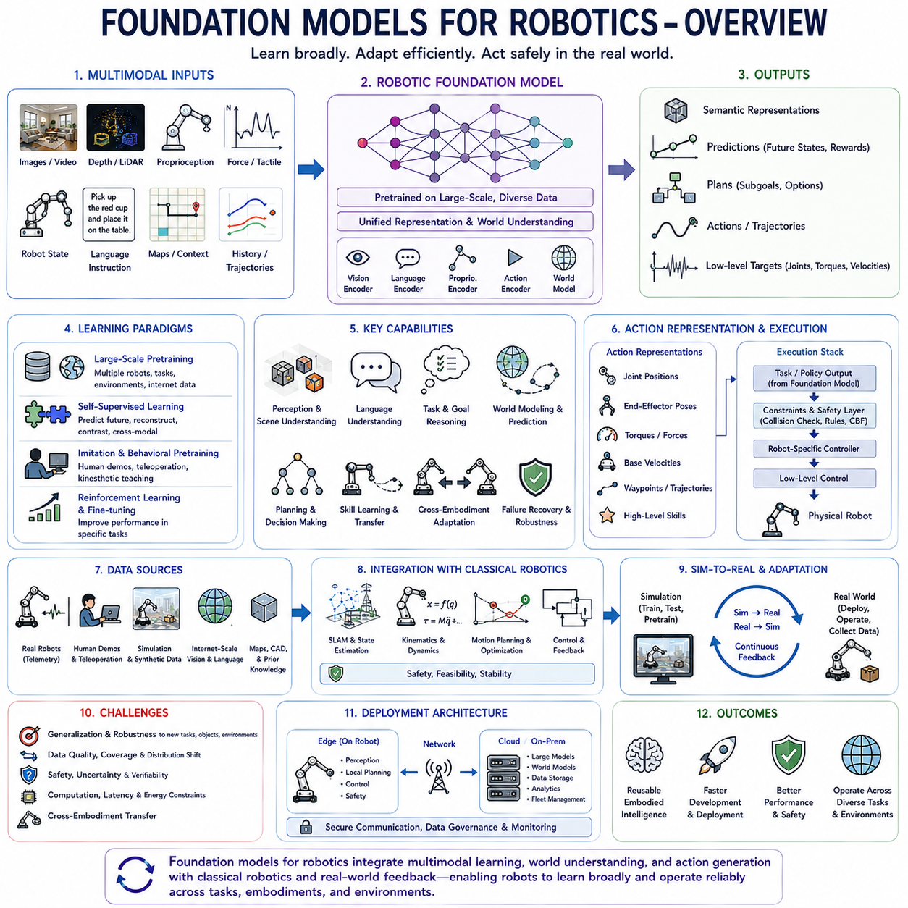
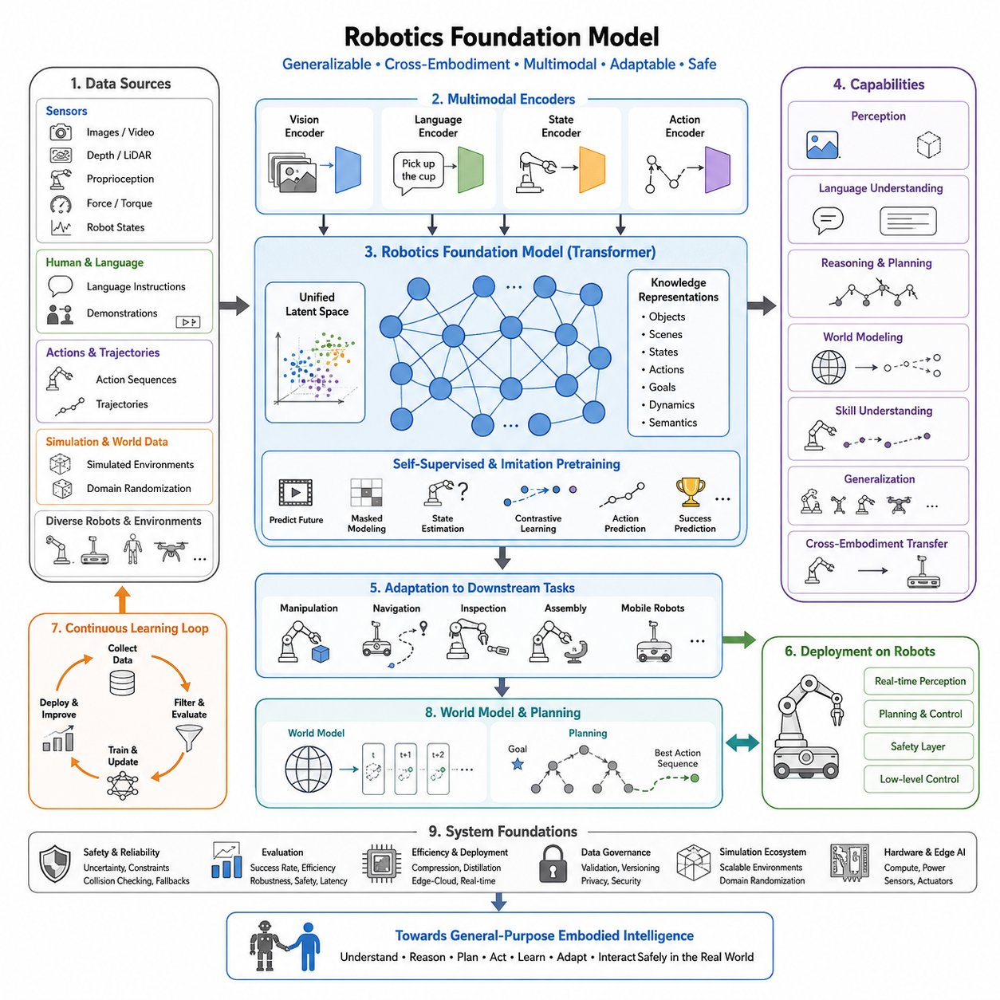
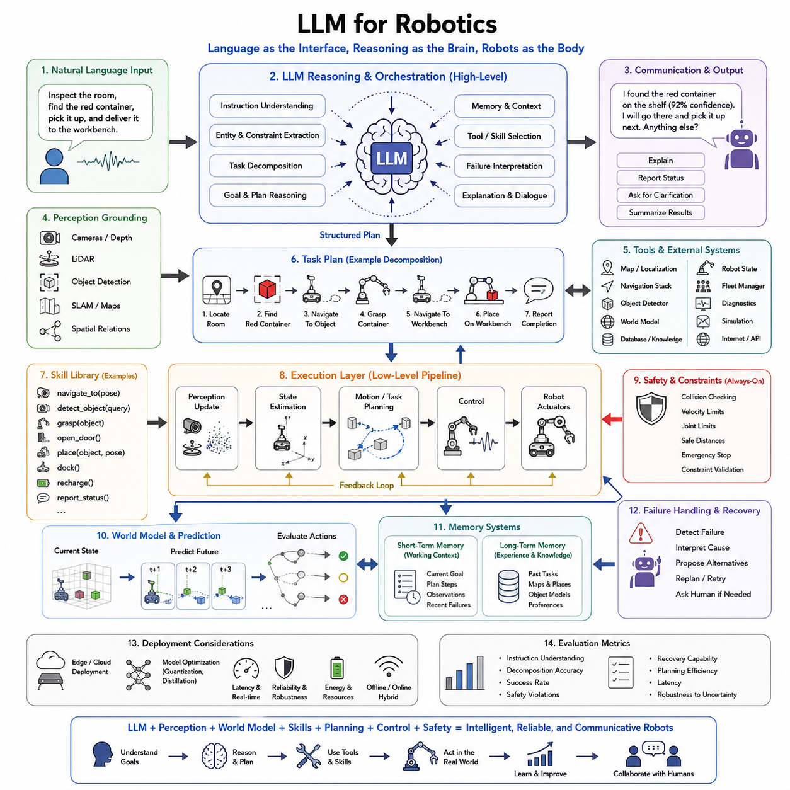
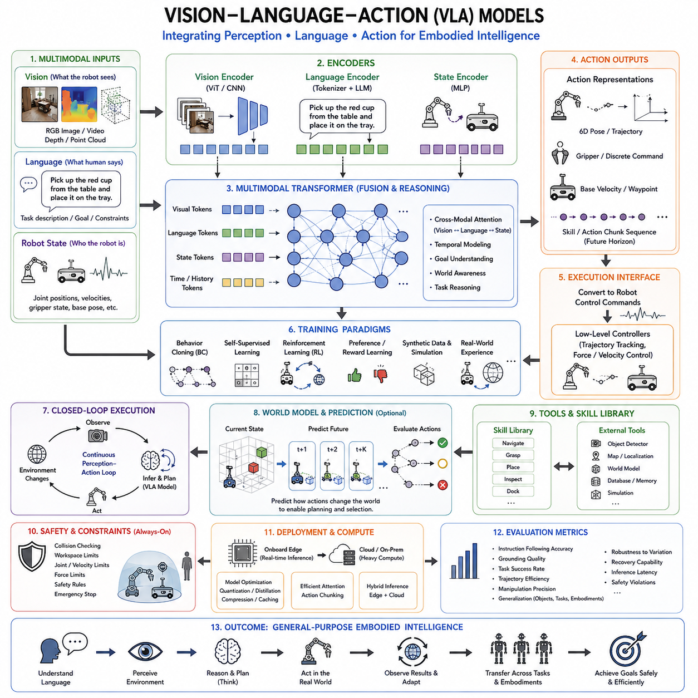
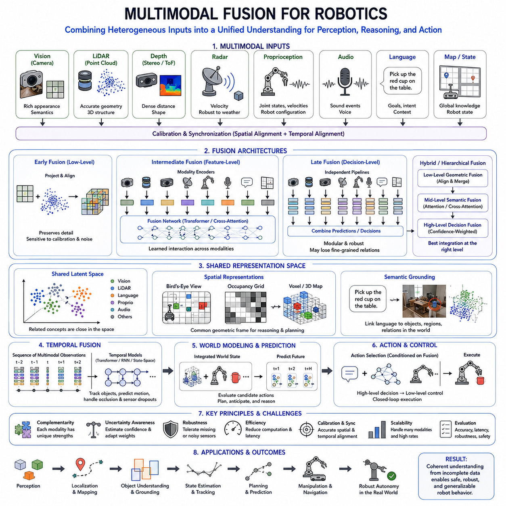
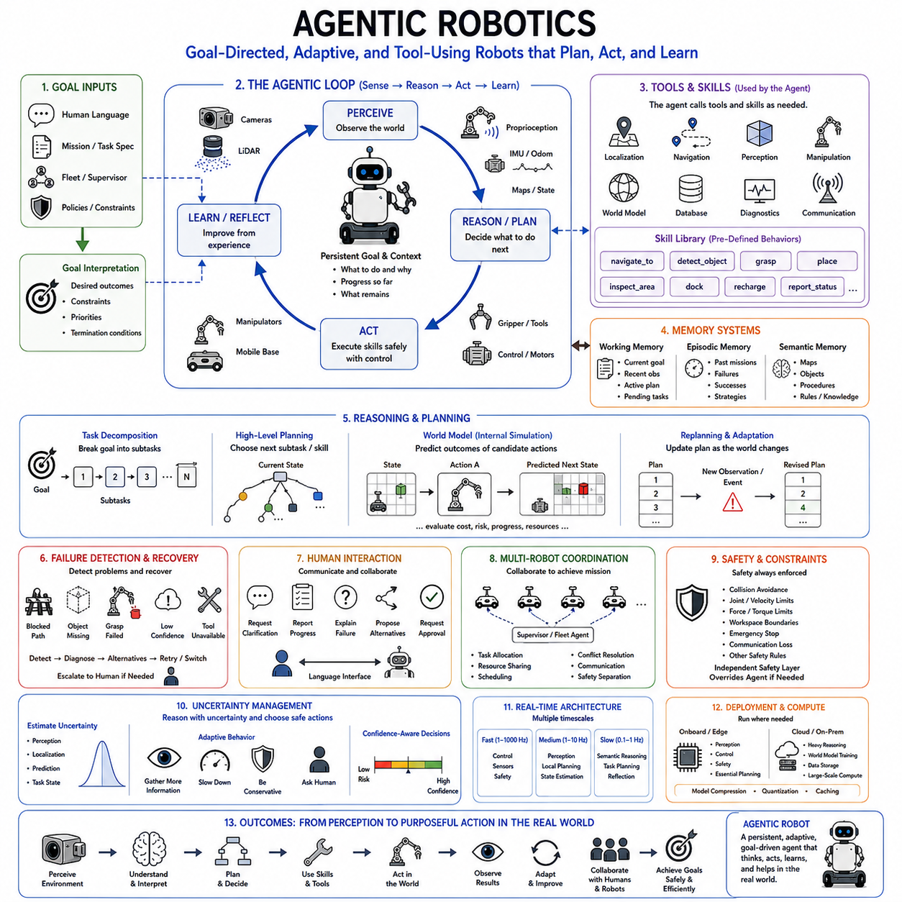
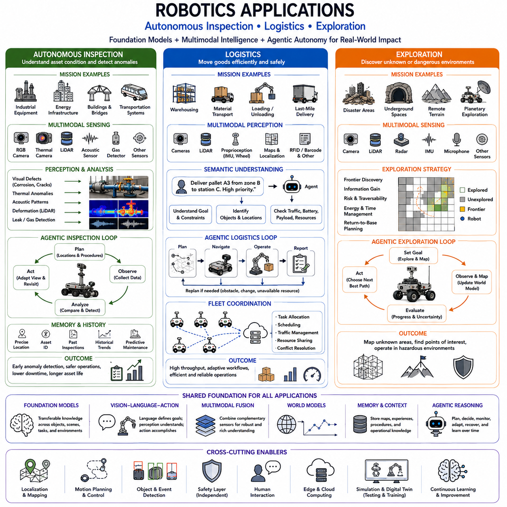

**Volume 45. Embodied AI and World Models**

# Chapter 06. Foundation Models for Robotics

## 06.00. Overview

{width="7.268055555555556in" height="7.268055555555556in"}

로보틱스 파운데이션 모델(Foundation Models for Robotics)은 대규모 사전학습 모델(Large-Scale Pretrained Model)의 개념을 물리적 세계를 인식하고, 추론하고, 예측하며, 행동해야 하는 체화 시스템(Embodied System)으로 확장한다. 각각의 로봇과 작업마다 별도의 모델을 학습하는 대신 다양한 데이터셋으로부터 광범위한 표현(Representation)과 재사용 가능한 능력을 학습하는 것이 목표이다. 이후 이러한 모델을 조작(Manipulation), 내비게이션(Navigation), 이동(Locomotion), 상호작용(Interaction) 및 기타 로봇 행동에 적응시킬 수 있다.

로봇 파운데이션 모델(Robotic Foundation Model)은 입력과 출력이 물리적 상호작용(Physical Interaction)에 기반한다는 점에서 순수한 언어 기반 모델(Language-Based Model)과 다르다. 입력에는 이미지, 깊이 정보(Depth), 라이다(LiDAR), 고유수용감각(Proprioception), 힘 측정값, 로봇 상태, 언어 명령(Language Instruction), 지도, 과거 궤적(Historical Trajectory)이 포함될 수 있다. 출력에는 의미 표현(Semantic Representation), 예측, 계획, 행동, 궤적 또는 궁극적으로 물리 환경에 영향을 미치는 저수준 제어 목표(Low-Level Control Target)가 포함될 수 있다.

대규모 사전학습(Large-Scale Pretraining)은 파운데이션 모델 접근법의 핵심이다. 모델은 여러 로봇, 환경, 작업, 인간 시연(Human Demonstration), 시뮬레이션, 인터넷 규모의 시각 및 언어 데이터 소스에서 수집된 이질적인 데이터(Heterogeneous Data)를 학습한다. 사전학습을 통해 특정 배치 문제를 경험하기 전에 일반적인 표현을 획득할 수 있다. 이후 미세조정(Fine-Tuning), 프롬프팅(Prompting), 적응(Adaptation), 정책 학습(Policy Learning)을 통해 특정 로봇에 맞게 이러한 능력을 전문화할 수 있다.

멀티모달 학습(Multimodal Learning)은 로봇이 서로 다른 공간적, 시간적, 의미적 특성을 가진 정보를 통합해야 하기 때문에 특히 중요하다. 비전(Vision)은 외형과 기하 구조를 설명하고, 고유수용감각은 로봇 자신의 상태를 표현하며, 언어는 목표와 개념을 전달하고, 행동 데이터(Action Data)는 물리적 결과를 기록한다. 공유 표현(Shared Representation)은 이러한 모달리티를 연결하여 명령, 관측, 내부 상태, 행동이 공통된 추론 과정(Common Reasoning Process)에 참여하도록 할 수 있다.

비전-언어 모델(Vision-Language Model, VLM)은 의미론적 로봇 지능(Semantic Robotic Intelligence)을 위한 중요한 기반을 제공한다. 시각 및 언어 표현을 공동으로 학습하여 객체, 장면, 속성, 관계, 명령을 지각 관측(Perceptual Observation)과 연결할 수 있다. 로보틱스에서는 이러한 능력을 객체 식별(Object Identification), 작업 해석(Task Interpretation), 장면 이해(Scene Understanding), 의미 기반 내비게이션(Semantic Navigation), 조작 계획(Manipulation Planning), 자연어를 이용한 인간과의 상호작용에 활용할 수 있다.

비전-언어-행동 모델(Vision-Language-Action Model, VLA)은 로봇 행동을 멀티모달 아키텍처(Multimodal Architecture)에 직접 포함함으로써 이러한 개념을 확장한다. 단순히 텍스트 설명이나 의미 임베딩(Semantic Embedding)을 생성하는 대신 관측, 명령, 실행 가능한 행동(Executable Behavior) 사이의 관계를 학습한다. 따라서 객체를 이동하거나 목적지로 이동하라는 명령을 시연 또는 로봇 상호작용 데이터에서 획득한 일련의 행동과 연결할 수 있다.

로봇 파운데이션 모델은 작업 간 지식 전이(Knowledge Transfer Across Tasks)도 목표로 한다. 잡기(Grasping), 밀기(Pushing), 열기(Opening), 내비게이션, 객체 재배치(Object Rearrangement)를 학습한 모델은 공간 관계, 접촉(Contact), 도달 가능성(Reachability), 목표 진행(Goal Progression), 실패 복구(Failure Recovery)와 같은 공유 개념을 학습할 수 있다. 이러한 재사용 가능한 표현은 새로운 작업에 필요한 추가 학습량을 줄이고 기존에 학습된 능력을 조합한 행동을 가능하게 한다.

교차 체화 학습(Cross-Embodiment Learning)은 서로 다른 기계 구조, 센서, 행동 공간(Action Space), 자유도(Degrees of Freedom)를 가진 로봇 사이에서 지식을 전이하는 것을 목표로 한다. 하나의 로봇 팔에서 학습한 조작 기술은 운동학이 다르기 때문에 다른 로봇에 그대로 적용할 수 없다. 따라서 파운데이션 모델 아키텍처는 일반적인 작업 지식(General Task Knowledge)과 체화 특화 실행(Embodiment-Specific Execution)을 구분하여 공유 지능을 서로 다른 물리 플랫폼에 적응시킬 수 있어야 한다.

따라서 행동 표현(Action Representation)은 중요한 아키텍처 과제이다. 로봇 명령은 관절 위치(Joint Position), 토크(Torque), 엔드 이펙터 자세(End-Effector Pose), 이동 베이스 속도(Mobile-Base Velocity), 웨이포인트(Waypoint), 고수준 기술(High-Level Skill) 등으로 표현될 수 있다. 모델은 전이 성능을 향상시키기 위해 정규화된 표현(Normalized Representation)이나 작업 공간 표현(Task-Space Representation)을 사용할 수 있으며, 로봇별 제어기가 일반적인 행동 의도를 물리적으로 실행 가능한 명령으로 변환한다. 계층적 행동 표현(Hierarchical Action Representation)은 의미적 의사결정과 정밀한 저수준 제어를 분리할 수 있다.

로봇 행동은 독립된 관측이 아니라 연속적인 시퀀스(Sequence)를 통해 진행되기 때문에 시간적 모델링(Temporal Modeling)도 중요하다. 로봇은 이전 행동이 세계를 어떻게 변화시켰는지 이해하고, 작업 맥락(Task Context)을 유지하며, 진행 상황을 탐지하고, 미래 상태를 예상해야 한다. 트랜스포머 기반 시퀀스 모델(Transformer-Based Sequence Model), 순환 구조(Recurrent Architecture), 예측 모델(Predictive Model), 월드 모델(World Model)은 이러한 시간적 의존성을 표현하고 단기 및 장기 시간 범위에서 행동 선택을 지원할 수 있다.

월드 모델(World Model)은 환경이 어떻게 변화할지를 예측하는 내부 메커니즘을 파운데이션 모델에 제공한다. 현재 상태와 가능한 행동이 주어지면 학습된 동역학 모델(Learned Dynamics Model)은 미래 관측, 객체 상태, 보상(Reward), 작업 결과를 추정할 수 있다. 이를 통해 단순히 반응적으로 행동하는 대신 상상된 미래(Imagined Future)를 이용하여 계획할 수 있다. 이러한 예측 능력은 실수가 큰 비용을 발생시키거나 물리적 실험이 느린 상황에서 특히 중요하다.

파운데이션 모델은 기존 로보틱스(Classical Robotics)를 대체하기보다 함께 상호작용할 수도 있다. 동시적 위치추정 및 지도작성(Simultaneous Localization and Mapping, SLAM), 상태 추정(State Estimation), 운동학(Kinematics), 운동 계획(Motion Planning), 충돌 검사(Collision Checking), 궤적 최적화(Trajectory Optimization), 피드백 제어(Feedback Control)는 명시적인 기하학적·물리적 구조를 제공한다. 학습 모델은 의미 이해, 예측, 작업 추론, 정책 제안을 담당하고 기존 구성요소는 행동이 하드웨어에 전달되기 전에 실행 가능성, 안정성, 안전성을 보장할 수 있다.

시뮬레이션(Simulation)과 합성 데이터(Synthetic Data)는 실제 물리 데이터를 수집하는 데 많은 비용과 시간이 필요하기 때문에 로봇 파운데이션 모델을 학습하기 위한 중요한 자원을 제공한다. 가상 환경에서는 다양한 관측, 궤적, 실패, 상호작용 결과를 대규모로 생성할 수 있다. 도메인 무작위화(Domain Randomization)와 심투리얼(Sim-to-Real) 기법은 강건성을 향상시킬 수 있으며, 현실 세계의 시연과 텔레메트리(Telemetry)는 시뮬레이션 물리, 센서, 환경 복잡성의 한계를 보완하는 현실 기반 정보(Grounding)를 제공한다.

인간 시연(Human Demonstration)은 자율 탐색(Autonomous Exploration)만으로는 발견하는 데 많은 시간이 필요한 효율적인 작업 전략과 복구 행동(Recovery Behavior)을 포함하기 때문에 또 하나의 중요한 데이터 소스이다. 원격조작(Teleoperation), 키네스테틱 티칭(Kinesthetic Teaching), 비디오 시연(Video Demonstration), 기록된 로봇 궤적을 통해 관측-행동 시퀀스(Observation-Action Sequence)를 제공할 수 있다. 이러한 데이터셋은 강화학습(Reinforcement Learning)이나 현실 세계 적응 이전에 모방학습(Imitation Learning)과 행동 사전학습(Behavioral Pretraining)을 통해 유용한 사전 지식(Prior)을 구축할 수 있도록 한다.

자기지도학습(Self-Supervised Learning)은 수작업으로 레이블링된 로봇 데이터에 대한 의존도를 줄일 수 있다. 모델은 누락된 관측, 미래 상태, 시간적 관계(Temporal Relationship), 교차 모달 대응 관계(Cross-Modal Correspondence), 행동의 결과를 예측하면서 학습할 수 있다. 로봇은 센서와 행동 데이터를 지속적으로 생성하므로 자기지도 학습 목표를 활용하면 대규모 비레이블 경험(Unlabeled Experience)을 표현 학습(Representation Learning)과 월드 모델 개발에 사용할 수 있다.

일반화(Generalization)는 로봇 파운데이션 모델의 핵심 목표인 동시에 가장 중요한 과제 가운데 하나이다. 유용한 모델은 완전한 재학습 없이 새로운 객체, 배치, 조명 조건, 명령, 작업 조합, 하드웨어 변화에 대응할 수 있어야 한다. 그러나 물리 환경에서 발생하는 분포 변화(Distribution Shift)는 안전에 직접적인 영향을 줄 수 있다. 따라서 평가는 평균적인 작업 성공률뿐 아니라 강건성(Robustness), 불확실성(Uncertainty), 복구 능력, 익숙하지 않은 학습 분포 밖의 조건에서의 성능까지 검토해야 한다.

연산 아키텍처(Computational Architecture) 역시 실제 배치를 제한하는 중요한 요소이다. 대규모 멀티모달 모델은 상당한 GPU 메모리와 연산 능력을 요구할 수 있지만 로봇은 제한된 에너지와 엄격한 지연시간 요구조건에서 동작하는 경우가 많다. 따라서 시스템은 엣지 장치(Edge Device)와 더 큰 온프레미스(On-Premise) 또는 클라우드 자원 사이에서 연산을 분담할 수 있다. 소형 정책(Smaller Policy), 모델 증류(Distillation), 캐싱(Caching), 계층적 실행(Hierarchical Execution), 선택적 활성화(Selective Activation)를 통해 물리 플랫폼에서 파운데이션 모델 지능을 실행하는 비용을 줄일 수 있다.

파운데이션 모델의 출력은 불확실하거나 직접 검증하기 어려울 수 있으므로 안전성(Safety)을 위한 추가적인 아키텍처 계층이 필요하다. 행동 제안(Action Proposal)은 실행 전에 기하학적 제약조건, 충돌 검사, 안전 모니터(Safety Monitor), 규칙 기반 필터(Rule-Based Filter), 제어 장벽 메커니즘(Control Barrier Mechanism), 인간 승인(Human Approval)을 거칠 수 있다. 저수준 제어기는 안정적인 움직임에 대한 결정론적 책임을 유지하고, 고수준 학습 구성요소는 명시적으로 제한된 운용 영역(Operational Envelope) 내에서 동작하도록 구성할 수 있다.

궁극적으로 로보틱스 파운데이션 모델(Foundation Models for Robotics)은 개별 작업에 특화된 자동화(Isolated Task-Specific Automation)가 아니라 재사용 가능한 체화 지능(Reusable Embodied Intelligence)을 구축하는 것을 목표로 한다. 그 가치는 멀티모달 인식, 언어 이해, 시간적 추론, 월드 모델링, 전이 가능한 기술(Transferable Skill), 행동 생성을 물리적 제어와 연결된 하나의 아키텍처 안에서 통합하는 데 있다. 시뮬레이션, 현실 세계 데이터, 기존 로보틱스, 지속적인 적응(Continual Adaptation)과 결합함으로써 더욱 광범위하게 학습하고 점점 더 다양한 작업과 환경에서 동작할 수 있는 로봇으로 발전하기 위한 기반을 제공한다.

## 06.01. Robotics Foundation Models

{width="7.268055555555556in" height="7.268055555555556in"}

로보틱스 파운데이션 모델(Robotics Foundation Models)은 언어(Language)와 비전(Vision) 분야에서 발전한 파운데이션 모델(Foundation Model)의 패러다임을 물리적 상호작용(Physical Interaction)의 영역으로 확장합니다. 각각의 로봇(Robot), 작업(Task), 환경(Environment)마다 별도의 모델을 학습하는 대신, 대규모의 이질적인 로봇 데이터(Heterogeneous Robotic Data)로부터 재사용 가능한 표현(Reusable Representations)과 행동(Behaviors)을 학습합니다. 핵심 목표는 다양한 체화 작업(Embodied Tasks)에 훨씬 적은 작업별 학습(Task-Specific Training)만으로 적응할 수 있는 범용적인 계산 기반(Computational Foundation)을 제공하는 것입니다.

기존의 로봇 학습 시스템(Robotic Learning Systems)은 대체로 좁게 정의된 특정 행동에 최적화되는 반면, 로보틱스 파운데이션 모델(Robotics Foundation Model)은 조작(Manipulation), 내비게이션(Navigation), 인식(Perception), 계획(Planning), 상호작용(Interaction)에 걸쳐 전이될 수 있는 지식을 포착하려고 합니다. 모델은 객체(Object), 공간적 구성(Spatial Configuration), 행동(Action), 목표(Goal), 결과(Consequence) 사이의 관계를 학습할 수 있습니다. 이러한 공유 표현(Shared Representation)을 통해 이전에 학습한 경험이 개별 학습 과정에 명시적으로 포함되지 않았던 새로운 작업에도 활용될 수 있습니다.

파운데이션 모델 접근법(Foundation-Model Approach)이 특히 중요한 이유는 로보틱스(Robotics)의 데이터가 심각하게 분산되고 이질적이기 때문입니다. 로봇 데이터셋(Robot Datasets)은 하드웨어(Hardware), 센서 구성(Sensor Configuration), 좌표계(Coordinate Systems), 제어 주기(Control Frequencies), 행동 공간(Action Spaces), 환경(Environment), 작업 정의(Task Definitions)가 서로 다릅니다. 따라서 유용한 파운데이션 모델은 정확한 제어에 필요한 물리적 정보를 유지하면서도 이질적인 관측(Observations)과 행동(Actions)을 여러 플랫폼에서 공유할 수 있는 표현으로 변환하는 메커니즘을 필요로 합니다.

학습 데이터(Training Data)는 카메라 이미지(Camera Images), 비디오(Video), 깊이 정보(Depth), 라이다(LiDAR), 고유수용감각(Proprioception), 힘 및 토크 측정(Force and Torque Measurements), 로봇 상태(Robot States), 궤적(Trajectories), 언어 명령(Language Instructions), 시연(Demonstrations), 행동 시퀀스(Action Sequences)를 결합할 수 있습니다. 시뮬레이션(Simulation)은 실제 환경에서 수집하기에는 비용이 많이 들거나 위험한 다양한 환경과 제어된 변형을 생성하여 데이터셋을 더욱 확장할 수 있습니다. 이렇게 구성된 학습 말뭉치(Training Corpus)는 의미적 지식(Semantic Knowledge)을 물리적 상호작용과 로봇 행동의 시간적 구조(Temporal Structure)에 연결합니다.

주요 아키텍처 과제(Architectural Challenge) 가운데 하나는 서로 다른 모달리티(Modalities)를 통합 잠재 공간(Unified Latent Space)에서 표현하는 것입니다. 비전 인코더(Visual Encoder)는 객체와 장면을 표현하고, 언어 모델(Language Model)은 목표와 의미적 관계를 인코딩하며, 상태 및 행동 인코더(State and Action Encoders)는 로봇의 구성과 움직임을 표현합니다. 특히 트랜스포머 기반 아키텍처(Transformer-Based Architecture)는 어텐션 메커니즘(Attention Mechanism)을 통해 여러 모달리티와 시간에 걸친 정보를 통합할 수 있기 때문에 명령, 관측, 상태, 행동을 공통의 계산 프레임워크 안에서 연결하는 데 효과적입니다.

로보틱스 파운데이션 모델(Robotics Foundation Models)은 관측(Observation)뿐 아니라 행동(Action)도 표현해야 합니다. 이것은 수동적인 인식(Passive Perception)이나 콘텐츠 생성(Content Generation)을 중심으로 설계된 파운데이션 모델과 구별되는 중요한 특징입니다. 체화 모델(Embodied Model)은 행동이 물리적 세계를 어떻게 변화시키며 그러한 변화가 이후의 관측에 어떤 영향을 미치는지 이해해야 합니다. 따라서 학습은 독립적인 입력-출력(Input-Output) 사례보다 관측, 상태 추정(State Estimation), 행동, 상태 전이(Transition), 후속 관측으로 이어지는 시퀀스를 중심으로 이루어지는 경우가 많습니다.

사전학습(Pretraining)은 많은 수작업 주석(Manual Annotation)을 필요로 하지 않는 자기지도 학습 목표(Self-Supervised Objectives)를 활용할 수 있습니다. 모델은 미래 관측(Future Observations)을 예측하거나, 마스킹된 센서 정보(Masked Sensory Information)를 복원하거나, 누락된 상태를 추정하거나, 언어와 궤적을 정렬하거나, 성공한 행동과 실패한 행동을 구별하거나, 시연으로부터 행동을 예측할 수 있습니다. 이러한 학습 목표는 특정 로봇 응용 분야에 모델을 적응시키기 전에 재사용 가능한 공간적(Spatial), 의미적(Semantic), 시간적(Temporal), 동역학적(Dynamical) 표현을 발견하도록 유도합니다.

대규모 로봇 학습(Large-Scale Robot Learning)은 모방 학습(Imitation Learning)과 인간 시연(Human Demonstrations)을 통해서도 큰 이점을 얻습니다. 시연은 인식, 계획, 제어가 자연스럽게 연결된 목적 지향적 행동(Purposeful Behavior)의 사례를 제공합니다. 행동 복제(Behavioral Cloning)는 이러한 궤적을 정책(Policy)으로 변환할 수 있으며, 추가적인 강화학습(Reinforcement Learning)이나 선호 기반 최적화(Preference-Based Optimization)를 이용하여 시연 데이터의 분포를 넘어 성능을 향상시킬 수 있습니다. 인간 시연과 자율 경험(Autonomous Experience)의 결합은 점차 능력이 향상되는 범용 로봇 모델(General-Purpose Robot Model)을 구축하는 실용적인 경로를 제공합니다.

일반화(Generalization)는 로보틱스 파운데이션 모델의 핵심 목표 가운데 하나입니다. 다양한 객체, 환경, 시점(Viewpoints), 명령, 로봇 형태(Embodiments)를 학습한 모델은 이상적으로 의미 있는 제로샷 전이(Zero-Shot Transfer) 또는 퓨샷 전이(Few-Shot Transfer)를 수행할 수 있어야 합니다. 예를 들어 용기를 파지하거나 장애물을 피해 이동하는 지식은 하나의 실험실 구성에만 제한되어서는 안 됩니다. 효과적인 표현은 불변적인 개념(Invariant Concepts)을 유지하는 동시에 로봇 형태에 따라 달라지는 기하학적 구조(Geometry)와 동역학(Dynamics)에 적응할 수 있어야 합니다.

교차 체화 학습(Cross-Embodiment Learning)은 서로 다른 로봇이 서로 다른 관절 수, 매니퓰레이터(Manipulators), 센서, 크기, 운동 제약(Motion Constraints)을 가진다는 문제를 다룹니다. 원시 모터 명령(Raw Motor Commands)을 직접 공유하는 것은 일반적으로 불가능하기 때문에 모델은 더 높은 수준의 행동 표현(High-Level Action Representations), 정규화된 궤적(Normalized Trajectories), 작업 공간 명령(Task-Space Commands), 의미적 기술(Semantic Skills), 또는 체화 조건부 정책(Embodiment-Conditioned Policies)을 학습할 수 있습니다. 이러한 추상화는 동일한 기계 구조를 가정하지 않고도 한 로봇에서 수집한 경험을 다른 로봇에 활용할 수 있도록 합니다.

언어(Language)는 특정 로봇 하드웨어와 독립적으로 작업을 표현할 수 있기 때문에 일반화를 위한 또 하나의 강력한 인터페이스를 제공합니다. 객체를 이동하거나, 특정 영역을 검사하거나, 목적지까지 이동하는 것과 같은 명령을 시각적 관측(Visual Observations) 및 물리적 행동(Physical Actions)과 연결할 수 있습니다. 이를 통해 의미적 추론(Semantic Reasoning)과 체화 제어(Embodied Control) 사이의 연결이 형성되며, 전문화된 하위 구성요소(Downstream Components)가 고수준의 의도(High-Level Intentions)를 특정 로봇에 적합한 궤적과 액추에이터 명령(Actuator Commands)으로 변환할 수 있습니다.

로보틱스 파운데이션 모델은 환경이 시간에 따라 어떻게 변화하는지를 표현하는 월드 모델(World Models)과도 상호작용할 수 있습니다. 월드 모델은 후보 행동(Candidate Actions)에 따른 가능한 미래 상태(Future States)나 관측을 예측하고, 파운데이션 모델은 광범위한 의미적 지식과 행동 지식을 제공합니다. 이러한 능력을 결합하면 예측(Prediction), 계획(Planning), 의사결정(Decision Making)을 지원할 수 있으며, 로봇은 현재 상황을 해석하고 가능한 결과를 상상하며 대안을 평가한 후 원하는 목표 상태로 환경을 변화시키는 행동을 선택할 수 있습니다.

이러한 아키텍처가 고전적인 로보틱스(Classical Robotics)를 제거하는 것은 아닙니다. 위치추정(Localization), 매핑(Mapping), 충돌 회피(Collision Avoidance), 동작 계획(Motion Planning), 상태 추정(State Estimation), 피드백 제어(Feedback Control), 안전 메커니즘(Safety Mechanisms)은 물리 시스템에서 예측 가능한 실시간 동작을 보장하기 위해 여전히 필수적입니다. 따라서 파운데이션 모델은 계층적 로봇 아키텍처(Hierarchical Robotic Architecture)의 구성요소로 보는 것이 적절하며, 학습 기반 지능은 의미 이해와 유연한 계획을 담당하고 결정론적 하위 시스템(Deterministic Subsystems)은 안정적인 실행과 저수준 제어(Low-Level Control)를 담당합니다.

실제 배포(Deployment)에서는 순수한 디지털 AI 시스템보다 훨씬 엄격한 제약이 발생합니다. 로봇은 제한된 연산 자원(Compute), 메모리(Memory), 전력(Electrical Power), 통신 대역폭(Communication Bandwidth), 열 관리 능력(Thermal Capacity)으로 지속적인 센서 스트림을 동시에 처리해야 합니다. 따라서 대규모 모델은 양자화(Quantization), 지식 증류(Distillation), 캐싱(Caching), 희소 연산(Sparse Computation), 가속 추론(Accelerated Inference), 또는 엣지와 클라우드 자원(Edge and Cloud Resources) 사이의 분할이 필요할 수 있습니다. 또한 실시간 스케줄링(Real-Time Scheduling)을 통해 고수준 지능 처리가 안전 필수 제어 루프(Safety-Critical Control Loops)의 실행 주기를 방해하지 않도록 해야 합니다.

안전성(Safety)은 오류가 물리적 결과를 발생시키기 때문에 특히 중요합니다. 언어 모델(Language Model)의 잘못된 생성은 불편을 초래하는 수준일 수 있지만, 잘못된 로봇 행동은 장비를 손상시키거나 사람에게 피해를 줄 수 있습니다. 따라서 로보틱스 파운데이션 모델에는 불확실성 추정(Uncertainty Estimation), 제약 조건 적용(Constraint Enforcement), 충돌 검사(Collision Checking), 이상 탐지(Anomaly Detection), 폴백 행동(Fallback Behaviors), 독립적인 안전 계층(Independent Safety Layers)이 필요합니다. 학습된 정책은 제한 없는 제어기로 사용되기보다 명확하게 정의된 물리적·운영적 경계 안에서 동작해야 합니다.

평가(Evaluation) 역시 일반적인 머신러닝 정확도(Machine-Learning Accuracy)를 넘어 확장되어야 합니다. 중요한 평가 지표에는 작업 성공률(Task Success Rate), 완료 시간(Completion Time), 궤적 효율(Trajectory Efficiency), 조작 정밀도(Manipulation Precision), 충돌 빈도(Collision Frequency), 외란 강건성(Robustness to Disturbances), 적응 속도(Adaptation Speed), 연산 지연(Computational Latency), 에너지 소비(Energy Consumption), 안전 위반(Safety Violations) 등이 포함됩니다. 또한 범용 모델은 새로운 객체, 환경, 명령, 로봇 형태, 센서 조건에서 평가되어야 하며, 이를 통해 나타난 능력이 단순한 암기(Memorization)가 아니라 실제 전이 능력(Transfer Capability)인지를 검증해야 합니다.

지속 학습(Continuous Learning)은 새로운 기회와 동시에 위험을 제공합니다. 실제 환경에 배치된 로봇은 새로운 환경, 객체, 실패 상황, 인간과의 상호작용을 지속적으로 경험하며, 이러한 경험은 향후 모델을 개선하는 데 활용될 수 있습니다. 로봇 플릿(Robot Fleet)에서 수집된 데이터는 경험 수집, 필터링, 평가, 재학습, 로봇 재배포로 이어지는 피드백 루프(Feedback Loop)를 형성할 수 있습니다. 그러나 통제되지 않은 업데이트는 치명적 망각(Catastrophic Forgetting)이나 위험한 행동 변화를 발생시킬 수 있으므로 데이터셋 거버넌스(Dataset Governance), 검증(Validation), 버전 관리(Versioning), 회귀 테스트(Regression Testing)가 필수적입니다.

로보틱스 파운데이션 모델의 장기적인 중요성은 로봇 개발 방식을 개별적으로 설계된 작업 파이프라인(Task Pipelines)에서 재사용 가능한 체화 지능(Reusable Embodied Intelligence)으로 전환한다는 데 있습니다. 모든 응용 분야마다 인식, 추론, 계획, 행동 시스템을 처음부터 다시 구축하는 대신, 개발자는 광범위하게 사전학습된 모델에서 시작하여 검사(Inspection), 물류(Logistics), 조작(Manipulation), 탐사(Exploration), 서비스 로보틱스(Service Robotics), 자율 이동(Autonomous Mobility) 등의 분야에 특화할 수 있습니다. 이러한 변화는 언어 분야에서 파운데이션 모델이 가져온 변화와 유사하지만, 물리적 현실과 신뢰성 있게 상호작용해야 한다는 훨씬 어려운 요구사항이 추가됩니다.

궁극적으로 로보틱스 파운데이션 모델(Robotics Foundation Model)은 하나의 범용 신경망(Universal Neural Network)이라기보다 더 큰 체화 시스템(Embodied System) 내부에서 재사용할 수 있는 지능 계층(Intelligence Layer)으로 이해해야 합니다. 그 가치는 대규모 멀티모달 학습(Large-Scale Multimodal Learning), 전이 가능한 표현(Transferable Representations), 행동 이해(Action Understanding), 세계 지식(World Knowledge), 적응(Adaptation), 물리적 피드백(Physical Feedback)을 결합하는 데서 나타납니다. 이러한 모델이 월드 모델(World Models), 시뮬레이션(Simulation), 엣지 AI(Edge AI), 제어 시스템(Control Systems), 자율 에이전트(Autonomous Agents)와 통합될수록 더욱 일반적이고 적응 가능한 체화 지능(Embodied Intelligence)으로 발전하는 핵심 경로를 제공하게 됩니다.

## 06.02. LLM for Robotics

{width="7.268055555555556in" height="7.268055555555556in"}

대규모 언어 모델(Large Language Models, LLMs)은 자연어 명령(Natural-Language Instructions)을 로봇이 해석하고 실행할 수 있는 표현(Representations)으로 변환함으로써 로봇 시스템(Robotic Systems)의 고수준 추론(High-Level Reasoning)과 의사소통(Communication)을 담당하는 구성요소로 활용될 수 있습니다. 미리 정의된 명령을 중심으로 설계되는 기존 로봇 제어기(Robot Controller)와 달리, LLM은 목표(Goals), 제약조건(Constraints), 객체(Objects), 절차(Procedures)에 대한 유연한 설명을 해석할 수 있습니다. 이러한 능력은 언어(Language)를 인간의 의도(Human Intent)와 체화된 로봇 행동(Embodied Robot Behavior)을 연결하는 실용적인 인터페이스로 만들어 줍니다.

로보틱스(Robotics)에서 LLM의 역할은 일반적으로 저수준 동작 제어기(Low-Level Motion Controller)의 역할과 다릅니다. 모델이 모터 전류(Motor Currents), 바퀴 속도(Wheel Velocities), 관절 토크(Joint Torques)를 직접 생성할 필요는 없습니다. 대신 더 높은 의미 수준(Semantic Level)에서 목표를 식별하고, 복잡한 명령을 하위 작업(Subtasks)으로 분해하며, 사용 가능한 기술(Skills)을 선택하고, 계층적 로봇 아키텍처(Hierarchical Robot Architecture) 내부의 인식(Perception), 계획(Planning), 조작(Manipulation), 내비게이션(Navigation), 제어(Control) 모듈을 조정할 수 있습니다.

자연어 이해(Natural-Language Understanding)를 통해 로봇은 사전에 명시적으로 프로그래밍되지 않은 형태의 명령도 받아들일 수 있습니다. 사용자는 방을 검사하거나, 특정 객체를 찾거나, 물품을 운반하거나, 특정 구역이 안전한지를 확인하는 것과 같은 목표를 설명할 수 있습니다. LLM은 이러한 명령에서 관련 객체(Entity), 목적지(Destination), 조건(Condition), 우선순위(Priority), 제약조건을 추출하고 이를 하위 로봇 모듈이 처리할 수 있는 구조화된 작업 표현(Structured Task Representation)으로 변환할 수 있습니다.

작업 분해(Task Decomposition)는 로보틱스에서 LLM을 활용하는 가장 중요한 분야 가운데 하나입니다. 복잡한 목표는 일반적으로 하나의 행동으로 실행할 수 없으며 의미 있는 여러 단계로 분리해야 합니다. 모델은 물체를 전달하라는 요청을 위치추정(Localization), 객체 탐색(Object Search), 내비게이션, 파지 준비(Grasp Preparation), 조작, 운반(Transport), 목적지 확인(Destination Verification), 배치(Placement), 완료 보고(Completion Reporting) 등의 순서로 변환할 수 있습니다. 이후 각 단계는 전문화된 로봇 기능에 할당됩니다.

이러한 작업 분해를 통해 LLM은 기존의 동작 계획기(Motion Planner)와 작업 계획기(Task Planner)보다 상위에서 동작하는 의미적 계획기(Semantic Planner) 역할을 수행할 수 있습니다. LLM은 무엇을 해야 하는지와 어떤 논리적 순서로 수행해야 하는지를 추론하고, 기하학적 계획기(Geometric Planner)는 로봇이 물리적으로 어디로 어떻게 이동해야 하는지를 결정합니다. 언어 모델은 의미 관계와 절차적 추론(Procedural Reasoning)에 강하지만 충돌 없는 궤적(Collision-Free Trajectory), 동적 안정성(Dynamic Stability), 정밀 액추에이터 제어(Precise Actuator Control)를 본질적으로 보장하도록 설계된 것은 아니므로 이러한 역할 분리가 중요합니다.

로봇 기술 라이브러리(Robot Skill Library)는 언어 추론(Language Reasoning)과 물리적 실행(Physical Execution)을 연결하는 효과적인 가교 역할을 합니다. 기술에는 목표 위치 이동(navigate_to), 객체 탐지(detect_object), 파지(grasp), 문 열기(open_door), 검사(inspect), 도킹(dock), 충전(recharge), 상태 보고(report_status) 등이 포함될 수 있습니다. LLM은 현재 목표에 따라 검증된 기능들을 선택하고 순서대로 구성할 수 있습니다. 실행 범위를 검증된 기술로 제한하면 모델이 제한 없는 저수준 명령을 생성하는 대신 이미 알려진 행동 중에서 선택하기 때문에 신뢰성(Reliability)도 향상됩니다.

도구 사용(Tool Use)은 LLM이 외부 로봇 하위 시스템(Robotic Subsystems) 및 정보원과 상호작용할 수 있도록 하여 이러한 개념을 확장합니다. 로봇 언어 에이전트(Robotic Language Agent)는 지도(Map), 위치추정 시스템(Localization System), 객체 탐지기(Object Detector), 월드 모델(World Model), 데이터베이스(Database), 플릿 관리자(Fleet Manager), 내비게이션 스택(Navigation Stack), 진단 서비스(Diagnostic Service)를 조회할 수 있습니다. 이러한 도구의 결과를 문맥 정보(Contextual Information)로 모델에 다시 전달하면 이후의 의사결정은 언어 모델 내부 지식에만 의존하지 않고 실제 측정값과 시스템 상태를 반영할 수 있습니다.

인식 그라운딩(Perception Grounding)은 언어적 추론이 실제 로봇 환경과 대응되어야 하기 때문에 필수적입니다. 예를 들어 "입구 근처의 빨간색 용기"라는 표현은 시각 또는 공간 인식 시스템이 후보 객체와 그 위치를 식별할 수 있을 때 실제 의미를 가집니다. 따라서 언어 표현(Language Representations)은 카메라 관측(Camera Observations), 깊이 정보(Depth Information), 지도, 객체 탐지(Object Detections), 멀티모달 임베딩(Multimodal Embeddings)과 연결되어야 하며, 이를 통해 의미적 참조(Semantic References)를 물리적 장면에 실제로 존재하는 객체로 대응시킬 수 있습니다.

이러한 그라운딩 과정은 공간 추론(Spatial Reasoning)도 지원합니다. 로봇은 내부(Inside), 뒤쪽(Behind), 옆쪽(Beside), 위쪽(Above), 가장 가까운(Nearest), 접근 가능한(Accessible), 차단된(Blocked), 연결된(Connected) 등의 관계를 자주 이해해야 합니다. LLM은 인식 및 매핑 시스템이 제공하는 구조화된 공간 정보를 기반으로 추론할 수 있지만, 신뢰할 수 있는 실행을 위해서는 이러한 언어적 관계를 미터법 좌표(Metric Coordinates), 영역(Regions), 자세(Poses), 기하학적 제약조건(Geometric Constraints)으로 변환해야 합니다. 따라서 의미적 추론과 기하학적 추론은 서로를 대체하는 것이 아니라 상호 보완합니다.

LLM은 객체가 일반적으로 어떻게 사용되고 조작되는지에 대한 의미적 지식을 활용하여 객체 어포던스 추론(Object Affordance Reasoning)을 지원할 수도 있습니다. 손잡이는 당길 수 있고, 용기는 열 수 있으며, 버튼은 누를 수 있다는 이해는 로봇이 그럴듯한 상호작용 전략을 생성하는 데 도움이 됩니다. 그러나 의미적으로 가능한 행동이 반드시 물리적으로 가능한 것은 아니므로 인식, 로봇 기하학(Robot Geometry), 도달 가능성 분석(Reachability Analysis), 힘 제약조건(Force Constraints), 적절한 조작 계획(Manipulation Planning)을 통해 실제 실행 가능성을 검증해야 합니다.

문맥 기억(Contextual Memory)은 언어 기반 로봇이 장시간 수행되는 작업에서 일관성을 유지하도록 도울 수 있습니다. 로봇 시스템은 이전 명령, 발견된 객체, 완료된 하위 작업, 실패, 환경 변화, 사용자 선호 등을 기억해야 할 수 있습니다. 단기 작업 기억(Short-Term Task Memory)은 현재 실행 상태를 유지하고, 장기 기억 시스템(Long-Term Memory Systems)은 관련된 과거 경험을 검색할 수 있습니다. 이를 통해 LLM은 모든 명령을 독립적인 요청으로 처리하는 대신 장기간의 상호작용 전체에 걸쳐 추론할 수 있습니다.

LLM은 실패 해석(Failure Interpretation)과 복구 계획(Recovery Planning)에도 유용합니다. 로봇이 경로가 차단되었거나, 객체를 파지할 수 없거나, 위치추정 신뢰도(Localization Confidence)가 낮다고 보고하면 모델은 이러한 실패를 원래 목표와 연결하여 해석하고 대안을 제안할 수 있습니다. 새로운 인식 스캔(Perception Scan)을 요청하거나, 다른 경로를 선택하거나, 로봇의 위치를 변경하거나, 다른 파지 전략을 선택하거나, 하위 작업을 연기하거나, 자율 복구의 불확실성이 높을 경우 인간에게 도움을 요청할 수 있습니다.

인간-로봇 상호작용(Human-Robot Interaction)은 동일한 언어 모델이 계획과 설명 모두에 참여할 수 있기 때문에 이러한 능력으로부터 큰 이점을 얻습니다. 로봇은 자신이 무엇을 수행하려 하는지 설명하고, 추가 설명을 요청하며, 현재 작업을 완료할 수 없는 이유를 보고하고, 검사 결과를 요약하거나, 어떤 제약조건으로 인해 계획이 변경되었는지 설명할 수 있습니다. 이는 인간 운영자(Human Operator)와 점차 자율성이 높아지는 로봇 시스템 사이에 더욱 투명한 인터페이스를 제공합니다.

언어 기반 추론(Language-Based Reasoning)은 장기간의 작업 범위에서 목표와 제약조건을 유지함으로써 다단계 의사결정(Multi-Step Decision Making)을 지원할 수도 있습니다. 로봇은 운반 전에 검사를 완료하거나, 제한 구역을 피하거나, 일정 수준의 배터리 예비량(Battery Reserve)을 유지하거나, 임무 이후 충전소로 복귀해야 할 수 있습니다. LLM은 이러한 의미적 제약조건을 구성하고 관리하며, 전문화된 계획 및 안전 시스템은 제안된 행동이 물리적으로 계속 실행 가능한지를 지속적으로 판단합니다.

월드 모델(World Model)과의 통합은 로봇의 추론 능력을 더욱 강화할 수 있습니다. 월드 모델은 현재 환경을 표현하고 가능한 행동 이후 환경이 어떻게 변화할지를 예측하며, LLM은 목표, 개념, 절차, 작업 의미(Task Semantics)에 대해 추론합니다. 두 시스템을 결합하면 로봇이 달성하려는 목표와 실제로 발생할 가능성이 있는 결과를 연결할 수 있으며, 물리적 환경에서 행동을 실행하기 전에 후보 행동의 결과를 평가할 수 있습니다.

LLM은 시뮬레이션(Simulation)과 디지털 트윈(Digital Twin) 환경을 연결하는 인터페이스로도 활용될 수 있습니다. 실제 로봇에 명령을 전달하기 전에 제안된 작업 시퀀스를 시뮬레이션에서 실행하여 실행 가능성(Feasibility), 충돌(Collisions), 도달 가능성(Reachability), 예상 결과(Expected Outcomes)를 평가할 수 있습니다. 시뮬레이션 결과를 추론 시스템으로 다시 전달하여 계획을 수정함으로써 언어적 계획, 물리 시뮬레이션, 실제 실행이 반복적으로 서로를 제약하고 보완하는 순환 구조를 만들 수 있습니다.

이러한 능력에도 불구하고 환각(Hallucination)은 로보틱스에서 언어 모델을 사용하는 데 있어 중요한 한계입니다. LLM은 실제 시스템에 존재하지 않는 객체, 위치, 기능, 행동을 생성할 수 있습니다. 따라서 실행 전에 모델 출력을 로봇 상태(Robot State), 지도, 센서 관측(Sensor Observations), 검증된 기술 목록(Validated Skill Lists), 운영 제약조건(Operational Constraints)과 대조하여 그라운딩해야 합니다. 언어 생성(Language Generation)은 물리적 진실의 절대적인 원천이 아니라 행동 후보를 제안하는 메커니즘으로 취급해야 합니다.

불확실성(Uncertainty) 역시 명시적으로 처리해야 합니다. 사용 가능한 정보가 불완전하거나 서로 모순될 경우 시스템은 확신할 수 있는 결론과 가정(Assumptions)을 구별해야 합니다. 로봇은 추가적인 센서 데이터를 수집하거나, 다른 하위 시스템을 조회하거나, 인간에게 명확한 설명을 요청하거나, 보수적인 폴백 행동(Conservative Fallback Behavior)을 수행할 수 있습니다. 대화형 AI(Conversational AI)에서는 큰 문제가 되지 않을 수 있는 불확실성이 로봇 행동으로 변환될 경우 심각한 물리적 위험을 발생시킬 수 있기 때문에 이러한 메커니즘은 특히 중요합니다.

따라서 안전성(Safety)을 위해서는 의미적 지능(Semantic Intelligence)과 액추에이터(Actuator)에 대한 실행 권한을 분리해야 합니다. 독립적인 제어기(Independent Controllers)는 LLM이 요청한 행동과 관계없이 속도 제한(Velocity Limits), 충돌 경계(Collision Boundaries), 비상 정지(Emergency Stopping), 관절 제약조건(Joint Constraints), 안전거리(Safe Distances) 등의 물리적 규칙을 강제해야 합니다. 언어 모델은 작업과 전략을 제안할 수 있지만, 안전 필수 검증 계층(Safety-Critical Validation Layers)이 이러한 제안의 실제 실행 허용 여부를 결정해야 합니다.

실시간 성능(Real-Time Performance)은 또 다른 한계를 발생시킵니다. 대규모 언어 모델은 기존 로봇 제어 알고리즘보다 훨씬 많은 연산량과 지연시간(Latency)을 요구할 수 있습니다. 따라서 LLM 추론은 밀리초 수준의 제어 루프(Millisecond-Level Control Loop)보다 상대적으로 느린 고수준 의사결정 주기(High-Level Decision Cycle)에 더 적합합니다. 저수준 피드백 제어기(Low-Level Feedback Controller)는 높은 주기로 지속적으로 동작하고, LLM은 작업 해석, 재계획(Replanning), 의사소통, 의미적 추론이 필요할 때 호출되는 구조가 적절합니다.

엣지 배포(Edge Deployment)는 통신 지연과 네트워크 의존성을 줄일 수 있지만 모델 크기(Model Size), 메모리 소비(Memory Consumption), 전력(Electrical Power), 열적 제약(Thermal Constraints)이 중요한 엔지니어링 고려사항이 됩니다. 양자화(Quantization), 지식 증류(Distillation), 소형 특화 언어 모델(Smaller Specialized Language Models), 캐싱(Caching), 하이브리드 엣지-클라우드 아키텍처(Hybrid Edge-Cloud Architecture)를 통해 이러한 비용을 줄일 수 있습니다. 일부 로봇 시스템에서는 일상적인 추론은 로컬에서 수행하고 매우 복잡한 작업만 더 강력한 온프레미스(On-Premise) 또는 클라우드 인프라(Cloud Infrastructure)로 전달할 수 있습니다.

미세조정(Fine-Tuning)과 명령 튜닝(Instruction Tuning)을 통해 범용 LLM을 로봇 도메인(Robotic Domain)에 적응시킬 수 있습니다. 학습 데이터에는 로봇 매뉴얼(Robot Manuals), 작업 설명(Task Descriptions), 기술 정의(Skill Definitions), 행동 기록(Action Traces), 유지보수 기록(Maintenance Records), 시연(Demonstrations), 실패 로그(Failure Logs), 인간-로봇 대화(Human-Robot Dialogues)가 포함될 수 있습니다. 도메인 적응(Domain Adaptation)은 용어 이해, 도구 선택, 절차적 추론, 출력 구조를 개선하고 관련 없는 응답을 줄일 수 있지만, 유창한 언어 생성이 올바른 물리적 행동을 보장하지는 않으므로 세심한 평가가 필요합니다.

검색 기반 접근법(Retrieval-Based Approaches)은 모든 정보를 모델 파라미터(Model Parameters)에 포함하지 않고도 LLM을 로봇별 지식(Robot-Specific Knowledge)과 연결하는 또 다른 방법을 제공합니다. 시스템은 현재 상황과 관련된 운영 절차(Operating Procedures), 지도, 장비 사양(Equipment Specifications), 작업 이력(Task Histories), 안전 규칙(Safety Rules)을 검색할 수 있습니다. 이러한 검색 과정은 추론을 명시적인 외부 지식(External Knowledge)에 연결하며, 전체 언어 모델을 재학습하지 않고도 운영 정보를 쉽게 갱신할 수 있도록 합니다.

LLM은 인식, 기억, 계획, 도구 사용, 실행을 반복적인 루프(Iterative Loop)로 조정함으로써 자율 에이전트(Autonomous Agents)를 지원할 수도 있습니다. 모델은 목표를 해석하고, 사용 가능한 상태 정보를 확인하고, 도구나 기술을 선택하고, 그 결과를 관찰한 후 다음에 수행할 행동을 결정합니다. 이러한 에이전트형 패턴(Agentic Pattern)은 LLM을 수동적인 명령 해석기에서 지속적인 목표(Persistent Objective)를 향해 여러 로봇 기능을 연속적으로 조정하는 감독 구성요소(Supervisory Component)로 확장합니다.

다중 로봇 시스템(Multi-Robot Systems)에서 언어 모델은 임무 목표(Mission Objectives)를 역할(Roles), 작업(Tasks), 통신 구조(Communication Structures)로 변환함으로써 고수준 조정을 지원할 수 있습니다. 각 로봇은 센서, 이동 능력(Mobility), 매니퓰레이터, 배터리 상태, 위치에 따라 서로 다른 역할을 할당받을 수 있습니다. 저수준 플릿 관리(Fleet Management)와 다중 로봇 계획 시스템(Multi-Robot Planning Systems)은 스케줄링, 궤적, 충돌을 해결하고, LLM은 의미적 해석과 임무 수준 조직화(Mission-Level Organization)를 담당합니다.

따라서 LLM 기반 로봇 시스템의 평가(Evaluation)는 단순한 언어 품질(Language Quality) 이상의 요소를 측정해야 합니다. 중요한 평가 요소에는 명령 이해(Instruction Understanding), 작업 분해 정확도(Task Decomposition Accuracy), 유효한 기술 선택(Valid Skill Selection), 그라운딩 정확도(Grounding Accuracy), 실패 복구(Failure Recovery), 계획 효율(Planning Efficiency), 지연시간, 작업 성공(Task Completion), 안전 위반(Safety Violations), 모호한 명령에 대한 강건성(Robustness)이 포함됩니다. 실제 로봇 환경은 학습 데이터의 분포를 필연적으로 넘어가기 때문에 새로운 환경과 예상하지 못한 조건에서도 시스템을 평가해야 합니다.

결과적으로 로보틱스에서 LLM을 가장 효과적으로 활용하는 방법은 기존 로봇 소프트웨어 스택(Robotics Software Stack) 전체를 대체하는 것이 아니라 의미적 지능을 기존 로봇 기능들과 연결하는 것입니다. 인식 시스템은 물리적 세계에 대한 증거를 제공하고, 월드 모델은 현재 상태와 가능한 미래를 표현하며, 계획기는 실행 가능한 궤적을 생성하고, 제어기는 동작을 실행하며, 안전 계층(Safety Layers)은 행동을 제한합니다. LLM은 이러한 구성요소의 상위 및 중간 계층에서 언어 이해, 추론, 오케스트레이션(Orchestration), 인간과의 의사소통을 담당합니다.

로보틱스 파운데이션 모델(Robotics Foundation Models), 멀티모달 모델(Multimodal Models), 월드 모델(World Models), 에이전트형 아키텍처(Agentic Architectures)가 지속적으로 융합됨에 따라 LLM의 역할은 점차 단순한 언어 인터페이스에서 체화 시스템을 위한 범용 의미 추론 계층(General Semantic Reasoning Layer)으로 발전할 수 있습니다. 장기적으로 LLM의 핵심 기여는 로봇이 유연한 목표를 이해하고, 복잡한 작업을 조직하며, 외부 도구를 사용하고, 의사결정을 설명하고, 실패로부터 복구하며, 기존 능력을 새로운 상황에 적응시키면서 동시에 물리적 세계의 제약조건 안에서 행동하도록 만드는 데 있습니다.

## 06.03. Vision Language Action Models [w/Code]

{width="7.268055555555556in" height="7.268055555555556in"}

비전-언어-행동 모델(Vision-Language-Action Models)은 체화 인공지능(Embodied AI)을 위한 통합 학습 프레임워크(Unified Learning Framework) 안에서 시각적 인식(Visual Perception), 언어 이해(Linguistic Understanding), 물리적 행동(Physical Action)을 연결합니다. 인식, 작업 해석(Task Interpretation), 로봇 제어(Robot Control)를 완전히 독립된 문제로 다루는 대신, VLA 모델은 로봇이 무엇을 관측하고, 인간이 무엇을 요청하며, 어떤 행동을 수행해야 하는지 사이의 관계를 학습합니다. 이러한 통합은 범용 로봇 행동(General-Purpose Robotic Behavior)을 구현하기 위한 중요한 기반을 제공합니다.

핵심 개념은 비전(Vision), 언어(Language), 로봇 상태(Robot State), 행동(Action)을 서로 호환되는 계산 공간(Computational Spaces)에서 표현하는 것입니다. 카메라 관측(Camera Observations)은 객체, 기하학적 구조(Geometry), 사람, 환경적 맥락(Environmental Context)을 나타내고, 언어는 목표(Goals), 제약조건(Constraints), 의미적 관계(Semantic Relationships)를 지정합니다. 로봇 상태는 로봇의 체화 형태(Embodiment)와 현재 구성(Configuration)에 대한 정보를 제공하며, 행동 표현(Action Representations)은 시스템이 환경에 물리적으로 영향을 줄 수 있는 방법을 나타냅니다.

일반적인 VLA 파이프라인(VLA Pipeline)은 멀티모달 관측(Multimodal Observations)과 언어 명령(Language Instruction)으로 시작합니다. 비전 인코더(Visual Encoders)는 이미지나 비디오를 특징 표현(Feature Representations)으로 변환하고, 언어 인코더(Language Encoders)는 명령과 작업 설명(Task Descriptions)을 표현합니다. 관절 위치(Joint Positions), 속도(Velocities), 그리퍼 상태(Gripper States), 모바일 플랫폼 상태(Mobile-Platform States)와 같은 고유수용감각 정보(Proprioceptive Information)도 인코딩할 수 있습니다. 이러한 표현을 융합하여 이후의 추론이 환경, 명령, 로봇 상태를 동시에 고려하도록 합니다.

트랜스포머 아키텍처(Transformer Architectures)는 어텐션(Attention)을 통해 시각 토큰(Visual Tokens), 언어 토큰(Language Tokens), 상태 정보(State Information), 시간적 문맥(Temporal Context) 사이의 관계를 모델링할 수 있기 때문에 이러한 통합에 특히 적합합니다. 모델은 "빨간색 용기(Red Container)"와 같은 단어를 해당 시각 영역(Visual Regions)과 연결하는 동시에 로봇의 위치와 사용 가능한 행동을 고려할 수 있습니다. 그 결과 생성되는 멀티모달 표현(Multimodal Representation)은 의미적 해석(Semantic Interpretation)을 행동 생성에 필요한 물리적으로 관련된 정보와 연결합니다.

행동 표현(Action Representation)은 VLA 모델을 정의하는 핵심 특징 가운데 하나입니다. 주로 설명이나 답변을 생성하는 비전-언어 모델(Vision-Language Models)과 달리, VLA 시스템은 궁극적으로 물리적 세계에 영향을 미칠 수 있는 출력을 생성해야 합니다. 행동은 로봇과 모델 아키텍처에 따라 말단장치 자세(End-Effector Poses), 관절 목표값(Joint Targets), 그리퍼 명령(Gripper Commands), 모바일 베이스 속도(Mobile-Base Velocities), 웨이포인트(Waypoints), 이산 기술(Discrete Skills), 연속 제어값 시퀀스(Sequences of Continuous Control Values) 등으로 표현될 수 있습니다.

학습은 일반적으로 관측, 언어 설명(Language Descriptions), 상태, 행동이 시간적으로 정렬된 로봇 궤적(Robot Trajectories)을 활용합니다. 인간 시연(Human Demonstrations)은 인식과 행동을 자연스럽게 연결하는 목적 지향적 상호작용(Purposeful Interaction)의 사례를 제공하기 때문에 특히 중요합니다. 다양한 작업에 걸친 대규모 시연 데이터를 활용하면 모델은 각각의 개별 목표마다 별도의 제어 정책(Control Policy)을 암기하는 대신 재사용 가능한 행동 패턴(Reusable Behavioral Patterns)을 학습할 수 있습니다.

행동 복제(Behavioral Cloning)는 현재 관측과 명령으로부터 시연된 행동을 예측하도록 모델을 학습하는 직접적인 학습 목표를 제공합니다. 그러나 순수한 지도형 모방 학습(Supervised Imitation)은 시연의 실수를 재현하거나 로봇이 시연 데이터 분포 밖의 상태를 만났을 때 실패할 수 있습니다. 따라서 자기지도 표현 학습(Self-Supervised Representation Learning), 강화학습(Reinforcement Learning), 선호 신호(Preference Signals), 합성 궤적(Synthetic Trajectories), 자율 로봇 경험(Autonomous Robot Experience)을 결합하여 강건성(Robustness)과 일반화(Generalization)를 향상시킬 수 있습니다.

대규모 VLA 학습(Large-Scale VLA Training)에는 상당한 데이터 다양성(Data Diversity)이 필요합니다. 데이터셋에는 다양한 객체, 장면, 조명 조건(Lighting Conditions), 시점(Viewpoints), 명령, 궤적, 작업, 로봇 체화 형태(Robot Embodiments)가 포함되는 것이 이상적입니다. 시뮬레이션(Simulation)은 비용이 많이 드는 실제 물리 데이터 수집 없이 제어된 변형과 희귀 상황을 생성하여 이러한 다양성을 확대할 수 있습니다. 그러나 실제 시연(Real-World Demonstrations)은 시뮬레이션이 정확하게 재현하기 어려운 센서 노이즈(Sensor Noise), 접촉 동역학(Contact Dynamics), 액추에이터 불확실성(Actuator Uncertainty), 환경 복잡성(Environmental Complexity)을 모델에 제공하기 때문에 여전히 중요합니다.

교차 체화 학습(Cross-Embodiment Learning)은 로봇마다 운동학(Kinematics), 센서, 행동 공간(Action Spaces), 물리적 능력(Physical Capabilities)이 다르기 때문에 중요한 과제입니다. 매니퓰레이터(Manipulator), 모바일 로봇(Mobile Robot), 휴머노이드(Humanoid), 4족 로봇(Quadruped)은 동일한 모터 명령을 직접 공유할 수 없습니다. VLA 시스템은 체화 조건화(Embodiment Conditioning), 정규화된 행동 표현(Normalized Action Representations), 작업 공간 궤적(Task-Space Trajectories), 공유 의미 기술(Shared Semantic Skills), 또는 공통 멀티모달 표현에 연결된 로봇별 행동 헤드(Robot-Specific Action Heads)를 통해 이 문제를 해결할 수 있습니다.

언어는 작업 수준 일반화(Task-Level Generalization)를 가능하게 하는 중요한 역할을 합니다. 각각의 행동에 별도의 숫자형 작업 식별자(Task Identifier)를 부여하는 대신 언어를 사용하여 목표를 조합적으로 표현할 수 있습니다. 객체, 목적지(Destinations), 공간 관계(Spatial Relations), 조작 동사(Manipulation Verbs)와 같은 개념을 이해하는 로봇은 이전에 학습한 지식을 조합하여 새로운 명령을 해석할 수 있습니다. 이는 새로운 작업이 기존 학습 경험과 의미적으로 관련되어 있을 경우 제로샷 적응(Zero-Shot Adaptation)과 퓨샷 적응(Few-Shot Adaptation)을 가능하게 하는 경로를 제공합니다.

시각적 그라운딩(Visual Grounding)은 언어적 개념이 물리적 환경의 실제 객체와 대응되도록 합니다. 예를 들어 "상자 옆의 파란색 컵을 집어라(Pick Up the Blue Cup Beside the Box)"라는 명령이 주어지면 시스템은 컵을 식별하고 다른 객체와 구별하며 공간적 관계를 이해하고 실제 행동이 가능한 위치를 결정해야 합니다. 따라서 효과적인 그라운딩은 의미 표현(Semantic Representations)을 객체 탐지(Object Detection), 분할(Segmentation), 깊이 정보(Depth), 공간 이해(Spatial Understanding), 로봇 중심 좌표계(Robot-Centered Coordinate Systems)와 연결합니다.

물리적 행동은 시간에 걸쳐 진행되기 때문에 시간적 모델링(Temporal Modeling) 역시 중요합니다. 올바른 행동은 현재 이미지뿐만 아니라 이전 관측, 과거 행동, 작업 진행 상태(Task Progress), 상호작용으로 발생한 변화에 따라 달라집니다. 시간적 문맥을 이용하면 모델은 객체가 이미 파지되었는지, 내비게이션이 목적지에 도달했는지, 이전 행동이 실패하여 수정 행동(Corrective Action)이 필요한지를 인식할 수 있습니다.

VLA 모델은 로봇 제어 계층(Robotic Control Hierarchy)의 서로 다른 수준에서 동작할 수 있습니다. 일부 아키텍처는 짧은 동작 구간(Motion Horizons)에 해당하는 비교적 저수준의 행동 청크(Action Chunks)를 예측하고, 다른 아키텍처는 전문화된 제어기에 의해 실행되는 고수준 기술(High-Level Skills)을 생성합니다. 계층적 설계(Hierarchical Designs)는 이러한 접근법을 결합하여 의미적 의사결정에는 멀티모달 추론(Multimodal Reasoning)을 사용하고 정밀한 물리적 실행에는 검증된 동작 계획기(Motion Planners)나 피드백 제어기(Feedback Controllers)를 사용할 수 있습니다.

행동 청킹(Action Chunking)은 매 추론 단계마다 하나의 제어 명령을 생성하는 대신 여러 개의 미래 행동을 한 번에 예측하여 효율성을 향상시킬 수 있습니다. 이를 통해 비용이 높은 모델 추론의 반복 횟수를 줄이고 시간적으로 일관된 행동(Temporally Coherent Behaviors)을 표현할 수 있습니다. 그러나 행동 예측 구간(Action Horizon)이 길어질수록 피드백을 이용해 행동을 수정할 기회가 감소하므로 실제 시스템에서는 예측 구간과 외란(Disturbances), 움직이는 객체, 인식 오류, 예상하지 못한 물리적 상호작용에 대한 반응성(Responsiveness) 사이에서 균형을 유지해야 합니다.

따라서 신뢰할 수 있는 체화 행동을 위해서는 폐루프 실행(Closed-Loop Execution)이 필수적입니다. 하나의 행동이나 짧은 행동 시퀀스를 실행한 후 다음 결정을 내리기 전에 새로운 센서 관측을 다시 모델에 반영해야 합니다. 이를 통해 로봇은 자신의 행동 결과를 지속적으로 관측하고 내부 표현(Internal Representation)을 갱신하며 변화하는 환경에 따라 이후 행동을 수정하는 인식-행동 루프(Perception-Action Loop)를 형성합니다.

월드 모델(World Models)은 후보 행동에 따른 미래 상태(Future States)를 명시적으로 예측함으로써 VLA 시스템을 확장할 수 있습니다. 관측을 행동으로 직접 매핑하는 대신 로봇은 서로 다른 행동이 환경을 어떻게 변화시킬지를 추정하고 그 결과가 현재 명령을 만족하는지 평가할 수 있습니다. 이러한 결합은 멀티모달 의미 이해(Multimodal Semantic Understanding)를 예측 모델링(Predictive Modeling)과 연결하며 더 긴 시간 범위(Longer Horizons)에 걸친 신중한 계획(Deliberate Planning)을 지원합니다.

VLA 시스템은 기술 라이브러리(Skill Libraries)와 외부 로봇 도구(External Robotic Tools)와도 상호작용할 수 있습니다. 모델은 내비게이션, 파지, 검사(Inspection), 도킹(Docking), 조작 등의 기능이 필요하다고 판단하고 적절한 전문 하위 시스템(Specialized Subsystem)을 호출할 수 있습니다. 이러한 하이브리드 아키텍처(Hybrid Architecture)를 사용하면 학습된 멀티모달 지능이 유연한 작업 해석을 담당하는 동안 기존 로봇 알고리즘은 신뢰할 수 있는 위치추정(Localization), 동작 계획, 제어, 안전 필수 실행(Safety-Critical Execution)을 계속 담당할 수 있습니다.

실제 환경에는 학습 과정에서 포함되지 않았던 조건이 필연적으로 발생하기 때문에 실패 복구(Failure Recovery)가 특히 중요합니다. 로봇은 객체 파지에 실패하거나, 예상하지 못한 장애물을 만나거나, 시각적 추적(Visual Contact)을 잃거나, 목표 객체가 이동한 것을 발견할 수 있습니다. 강건한 VLA 시스템은 예상 결과와 실제 관측 결과 사이의 불일치(Discrepancy)를 인식하고 재계획(Replanning), 재인식(Renewed Perception), 대체 행동(Alternative Actions), 또는 인간 지원(Human Assistance) 요청을 통해 대응해야 합니다.

안전성(Safety)은 학습된 행동 정책(Learned Action Policy)에만 의존할 수 없습니다. 생성된 행동은 액추에이터에 전달되기 전에 충돌 제약조건(Collision Constraints), 작업 공간 경계(Workspace Boundaries), 관절 제한(Joint Limits), 속도 제한(Velocity Limits), 힘 제한(Force Limits), 운영 안전 규칙(Operational Safety Rules)을 기준으로 검증되어야 합니다. 멀티모달 모델은 의미적 해석이 그럴듯하게 보이는 상황에서도 잘못된 예측을 생성할 수 있기 때문에 독립적인 안전 제어기(Independent Safety Controllers)와 비상 메커니즘(Emergency Mechanisms)은 여전히 필수적입니다.

실제 배포(Deployment)는 연산 자원 측면의 제약도 발생시킵니다. 고해상도 비전 처리(High-Resolution Vision Processing)와 대규모 트랜스포머 모델은 상당한 GPU 메모리, 전력, 추론 시간(Inference Time)을 요구할 수 있습니다. 양자화(Quantization), 지식 증류(Distillation), 효율적인 어텐션(Efficient Attention), 모델 압축(Model Compression), 행동 청킹, 캐싱(Caching), 가속 추론(Accelerated Inference)을 통해 이러한 요구사항을 줄일 수 있습니다. 통신 조건이 허용되는 경우 하이브리드 아키텍처를 통해 온보드 엣지 컴퓨팅(Onboard Edge Computing)과 더 강력한 온프레미스(On-Premise) 또는 클라우드 자원(Cloud Resources) 사이에 추론을 분산할 수도 있습니다.

VLA 모델의 평가(Evaluation)는 지능과 물리적 실행을 모두 측정해야 합니다. 관련 평가 지표에는 명령 수행 정확도(Instruction-Following Accuracy), 그라운딩 품질(Grounding Quality), 작업 성공률(Task Success Rate), 궤적 효율(Trajectory Efficiency), 조작 정밀도(Manipulation Precision), 새로운 객체에 대한 일반화, 환경 변화에 대한 강건성, 복구 능력(Recovery Capability), 추론 지연(Inference Latency), 안전 위반(Safety Violations) 등이 포함됩니다. 범용 로봇 지능(General-Purpose Robotic Intelligence)을 주장하는 경우에는 여러 작업과 서로 다른 체화 형태에 걸친 평가가 특히 중요합니다.

VLA 모델의 중요성은 로보틱스를 서로 분리된 작업별 정책(Task-Specific Policies)의 집합에서 재사용 가능한 멀티모달 행동 모델(Reusable Multimodal Behavioral Models)로 전환할 수 있다는 데 있습니다. 비전은 로봇에게 무엇이 존재하는지를 알려주고, 언어는 무엇을 달성해야 하는지를 전달하며, 행동은 지능을 물리적 변화와 연결합니다. 이 세 요소를 함께 학습하면 하나의 작업에서 획득한 지식을 독립적인 소프트웨어 파이프라인 안에 고립시키지 않고 관련된 다른 행동에 활용할 수 있습니다.

로보틱스 파운데이션 모델(Robotics Foundation Models)이 지속적으로 발전함에 따라 VLA 아키텍처(VLA Architectures)는 의미적 지능(Semantic Intelligence)과 물리적 실행(Physical Execution)을 연결하는 핵심 인터페이스로 발전할 가능성이 높습니다. 장기적인 잠재력은 멀티모달 이해(Multimodal Understanding), 전이 가능한 행동(Transferable Behavior), 시간적 추론(Temporal Reasoning), 교차 체화 학습, 폐루프 피드백(Closed-Loop Feedback), 확장 가능한 로봇 데이터(Scalable Robot Data)를 결합하는 데 있습니다. 월드 모델, 계획, 기억(Memory), 시뮬레이션, 안전 시스템과 통합될 경우 VLA 모델은 적응 가능한 범용 체화 에이전트(General-Purpose Embodied Agents)를 구현하는 주요 경로를 제공합니다.

## 06.04. Multimodal Fusion

{width="7.268055555555556in" height="7.268055555555556in"}

멀티모달 융합(Multimodal Fusion)은 여러 감각 및 의미 정보원(Sensory and Semantic Sources)의 정보를 결합하여, 단일 모달리티(Modality)만으로는 제공하기 어려운 더욱 완전한 환경 이해를 가능하게 하는 표현(Representations)을 생성하는 과정입니다. 로보틱스(Robotics)와 체화 인공지능(Embodied AI)에서 이러한 정보원에는 카메라(Camera), 라이다(LiDAR), 깊이 센서(Depth Sensors), 레이더(Radar), 오디오(Audio), 언어(Language), 고유수용감각(Proprioception), 힘 측정(Force Measurements), 지도(Maps), 로봇 내부 상태(Internal Robot States) 등이 포함될 수 있습니다.

각 모달리티는 물리적 세계의 서로 다른 측면을 설명하며 고유한 장점과 한계를 가지고 있습니다. 카메라는 풍부한 외형(Appearance)과 의미 정보(Semantic Information)를 제공하지만 조명과 가시성(Visibility)의 영향을 받을 수 있습니다. 라이다는 정확한 기하학적 구조(Geometric Structure)를 제공하지만 시각적 의미 정보는 제한적이며, 고유수용감각 센서는 로봇 자체의 상태를 설명합니다. 언어는 일반적인 물리 센서에서 직접 획득하기 어려운 추상적 목표(Abstract Goals)와 문맥 지식(Contextual Knowledge)을 제공합니다.

따라서 융합(Fusion)은 단순히 센서 측정값을 연결하는 것 이상의 과정을 필요로 합니다. 서로 다른 모달리티는 서로 다른 좌표계(Coordinate Systems), 차원(Dimensionalities), 샘플링 주파수(Sampling Frequencies), 노이즈 분포(Noise Distributions), 표현 공간(Representation Spaces)에서 동작합니다. 성공적인 멀티모달 아키텍처(Multimodal Architecture)는 이러한 이질적인 입력을 호환 가능한 특징(Compatible Features)으로 변환하면서 인식(Perception), 추론(Reasoning), 예측(Prediction), 계획(Planning), 물리적 행동(Physical Action)에 중요한 정보를 보존해야 합니다.

센서 보정(Sensor Calibration)과 동기화(Synchronization)는 멀티모달 융합의 물리적 기반을 형성합니다. 카메라 픽셀(Camera Pixels), 라이다 포인트(LiDAR Points), 레이더 반사 신호(Radar Returns), 로봇 자세(Robot Poses)는 정보를 신뢰성 있게 결합하기 전에 일관된 위치와 시간에 대응되어야 합니다. 공간 보정(Spatial Calibration)은 센서 좌표계 사이의 기하학적 변환(Geometric Transformations)을 설정하고, 시간 동기화(Temporal Synchronization)는 관측이 동적으로 변화하는 환경의 거의 동일한 상태를 나타내도록 합니다.

초기 융합(Early Fusion)은 원시 데이터(Raw Data) 또는 저수준 표현(Low-Level Representations)에 가까운 단계에서 모달리티를 결합합니다. 카메라 특징을 포인트 클라우드(Point Clouds)에 투영하거나, 깊이 측정값을 이미지 픽셀과 정렬하거나, 여러 센서 채널을 공통 공간 표현(Common Spatial Representation)으로 변환할 수 있습니다. 초기 융합은 세밀한 교차 모달 관계(Cross-Modal Relationships)를 보존하지만 정밀한 보정이 필요하며, 누락되거나 노이즈가 많거나 정렬이 잘못된 센서 데이터에 민감할 수 있습니다.

중간 융합(Intermediate Fusion)은 모달리티별 인코더(Modality-Specific Encoders)가 유용한 특징을 추출한 이후에 수행됩니다. 개별 비전(Vision), 라이다, 언어, 상태(State), 오디오 인코더가 먼저 입력을 학습된 표현(Learned Representations)으로 변환한 다음 공유 네트워크(Shared Network) 내부에서 통합합니다. 이 접근법은 각각의 인코더가 해당 모달리티의 통계적 특성(Statistical Characteristics)에 특화되면서도 더 깊은 표현 수준에서 교차 모달 상호작용을 가능하게 합니다.

후기 융합(Late Fusion)은 비교적 독립적인 처리 파이프라인(Processing Pipelines)을 유지하고 출력 단계에 가까운 위치에서 예측이나 의사결정을 결합합니다. 예를 들어 개별 인식 시스템이 객체(Objects), 주행 가능성(Traversability), 위험 요소(Hazards)를 독립적으로 추정한 후 결과를 통합할 수 있습니다. 후기 융합은 모듈성(Modularity)과 장애 격리(Fault Isolation)를 향상시킬 수 있지만, 처리 파이프라인의 앞부분에서 모달리티가 상호작용했을 경우 발견할 수 있었던 세밀한 관계를 잃을 수 있습니다.

현대의 시스템은 하나의 융합 단계에만 의존하기보다 하이브리드 융합(Hybrid Fusion)을 사용하는 경우가 많습니다. 저수준의 기하학적 정보는 초기 단계에서 융합하고, 의미 표현(Semantic Representations)은 중간 계층에서 상호작용하며, 신뢰도 가중 의사결정(Confidence-Weighted Decisions)은 후기 단계에서 결합할 수 있습니다. 이러한 계층적 융합 아키텍처(Hierarchical Fusion Architecture)는 서로 다른 정보를 관계가 가장 의미 있고 계산적으로 효율적인 수준에서 통합할 수 있도록 합니다.

트랜스포머(Transformers)는 중간 및 계층적 멀티모달 융합을 위한 강력한 메커니즘을 제공합니다. 서로 다른 모달리티의 정보를 토큰(Tokens)으로 표현하고, 어텐션 메커니즘(Attention Mechanisms)을 통해 어떤 토큰이 서로 영향을 주어야 하는지를 학습할 수 있습니다. 따라서 시각 패치(Visual Patches), 포인트 클라우드 특징(Point-Cloud Features), 언어 토큰(Language Tokens), 로봇 상태 임베딩(Robot-State Embeddings), 시간적 관측(Temporal Observations)이 각 모달리티의 내부 구조가 동일하지 않더라도 공유 어텐션 과정(Shared Attention Process)에 참여할 수 있습니다.

교차 어텐션(Cross-Attention)은 하나의 모달리티가 다른 모달리티를 선택적으로 조회하는 보다 구조화된 상호작용 방식을 제공합니다. 언어 토큰은 명령에서 설명된 객체를 식별하기 위해 시각 특징(Visual Features)에 어텐션할 수 있으며, 로봇 상태 특징은 행동의 실행 가능성을 판단하기 위해 공간 관측(Spatial Observations)을 참조할 수 있습니다. 이러한 선택적 정보 교환(Selective Information Exchange)은 불필요한 연산을 줄이고 의미 정보를 물리적 관측에 그라운딩(Grounding)하기 위한 명확한 경로를 제공할 수 있습니다.

공유 잠재 공간(Shared Latent Space)은 또 하나의 중요한 융합 전략을 제공합니다. 모달리티별 인코더는 이질적인 입력을 공통 표현 공간(Common Representation Space)에서 서로 관련된 개념이 가까운 위치에 표현되도록 임베딩(Embeddings)으로 변환합니다. 이미지로 관측된 객체, 언어로 설명된 객체, 포인트 클라우드에서 탐지된 객체, 특정 행동과 연관된 객체가 서로 관련된 잠재 표현(Latent Representations)을 공유할 수 있으며, 이를 통해 교차 모달 검색(Cross-Modal Retrieval), 그라운딩, 추론, 전이(Transfer)를 가능하게 합니다.

로봇의 행동은 궁극적으로 물리적 좌표(Physical Coordinates)에서 수행되기 때문에 공간 융합(Spatial Fusion)은 로보틱스에서 특히 중요합니다. 카메라 이미지는 원근 투영(Perspective Projection)이고, 라이다는 3차원 포인트 측정값을 생성하며, 지도는 전역 또는 로봇 중심 좌표(Global or Robot-Centered Coordinates)로 환경을 표현할 수 있습니다. 조감도(Bird\'s-Eye View), 점유 격자(Occupancy Grids), 복셀 공간(Voxel Spaces), 학습된 공간 특징 지도(Learned Spatial Feature Maps)와 같은 표현은 여러 센서 모달리티를 결합할 수 있는 공통 기하학적 프레임(Common Geometric Frames)을 제공합니다.

조감도 표현(Bird\'s-Eye-View Representations)은 여러 카메라와 거리 센서(Range Sensors)의 관측을 통합된 탑다운 공간 표현(Unified Top-Down Spatial Representation)으로 변환할 수 있기 때문에 모바일 로보틱스(Mobile Robotics)와 자율 시스템(Autonomous Systems)에 유용합니다. 정보가 이러한 공통 프레임에 정렬되면 시스템은 서로 다른 센서 관점을 반복적으로 조정하지 않고도 자유 공간(Free Space), 장애물(Obstacles), 객체, 차선(Lanes), 주행 가능성, 미래 움직임(Future Motion)에 대해 추론할 수 있습니다.

시간적 융합(Temporal Fusion)은 멀티모달 통합을 시간축으로 확장합니다. 로봇은 하나의 순간적인 관측만 이해하는 것이 아니라 움직임을 인식하고, 객체의 동일성(Object Identity)을 유지하며, 속도를 추정하고, 환경 변화를 감지하며, 숨겨진 상태(Hidden States)를 추론해야 합니다. 순환 모델(Recurrent Models), 시간적 어텐션(Temporal Attention), 기억 메커니즘(Memory Mechanisms), 상태 공간 표현(State-Space Representations)은 현재의 멀티모달 관측을 이전 시간 단계에서 축적된 정보와 결합할 수 있습니다.

시간적 문맥(Temporal Context)은 개별 센서의 신뢰성이 일시적으로 저하되는 상황에서 특히 유용합니다. 객체가 장애물 뒤로 사라지거나, 카메라의 가시성이 저하되거나, 라이다 반환값이 희박해질 수 있습니다. 이전 관측과 다른 모달리티의 정보를 이용하면 신뢰할 수 있는 측정값이 다시 확보될 때까지 안정적인 추정치를 유지할 수 있습니다. 따라서 멀티모달 융합은 더욱 풍부한 인식뿐 아니라 월드 상태 추정(World-State Estimation)의 연속성에도 기여합니다.

센서 신뢰도는 운용 조건에 따라 변화하기 때문에 불확실성 인식 융합(Uncertainty-Aware Fusion)이 필수적입니다. 카메라는 어두운 환경에서 성능이 저하될 수 있고, 라이다는 특정 기상 조건의 영향을 받을 수 있으며, 위성항법시스템(GNSS)은 사용할 수 없는 상황이 발생할 수 있고, 언어 명령은 모호할 수 있습니다. 모든 모달리티를 동일하게 처리하는 대신 융합 시스템은 신뢰도(Confidence)를 추정하고 각 정보원이 최종 표현이나 의사결정에 기여하는 정도를 동적으로 조정할 수 있습니다.

어텐션(Attention)과 게이팅 메커니즘(Gating Mechanisms)은 이러한 적응형 가중치(Adaptive Weighting)를 구현할 수 있습니다. 시각 정보의 신뢰성이 높은 경우 이미지 특징이 의미 인식(Semantic Recognition)에 더 크게 기여하고, 외형 정보가 불확실해질 경우 기하학적 센서(Geometric Sensors)의 비중을 높일 수 있습니다. 학습된 게이트(Learned Gates)는 손상된 모달리티를 억제하거나 상호 보완적인 증거를 강조할 수 있으며, 이는 센서 품질이 항상 일정하다고 가정하는 고정 융합 규칙(Fixed Fusion Rules)보다 강건한 시스템을 제공합니다.

누락된 모달리티(Missing Modalities)는 또 다른 실질적인 과제입니다. 로봇은 중요도가 낮은 센서가 고장 나거나 특정 모달리티를 사용할 수 없는 상황에서도 가능한 한 계속 동작해야 합니다. 모달리티 드롭아웃(Modality Dropout), 손상된 입력(Corrupted Inputs), 부분 관측(Partial Observations), 모의 센서 고장(Simulated Sensor Failures)을 포함하여 학습하면 모델이 하나의 정보원에 과도하게 의존하는 것을 방지할 수 있습니다. 중복 모달리티(Redundant Modalities)는 서로를 보완하면서 시스템이 성능은 저하되지만 제어 가능한 운용 모드(Degraded but Controlled Operating Mode)로 전환하도록 지원할 수 있습니다.

멀티모달 융합은 인식과 언어를 연결하는 역할도 합니다. 시각-언어 그라운딩(Visual-Language Grounding)은 언어적 설명을 로봇이 관측한 객체, 영역(Regions), 속성(Attributes), 공간적 관계(Spatial Relationships)와 연결합니다. 출입구 옆에 있는 용기를 찾으라는 명령을 수행하려면 시스템은 의미적 언어 표현(Semantic Language Representations)을 시각 및 기하학적 증거(Visual and Geometric Evidence)와 결합해야 하며, 이를 통해 참조된 객체를 로봇의 세계 표현(World Representation) 내부에서 실제 행동 가능한 객체(Actionable Entity)로 변환할 수 있습니다.

비전-언어-행동 시스템(Vision-Language-Action Systems)에서는 융합이 인식에서 행동까지 더욱 확장됩니다. 시각적 관측은 환경을 설명하고, 언어는 목표를 정의하며, 고유수용감각은 로봇의 현재 물리적 구성(Physical Configuration)을 나타내고, 행동 이력(Action History)은 시간적 문맥을 제공합니다. 이러한 정보원을 통합하면 모델은 단순히 장면에 무엇이 존재하는지만 판단하는 것이 아니라 명령, 환경, 체화 형태(Embodiment), 이전 행동을 고려하여 어떤 행동이 적절한지를 결정할 수 있습니다.

월드 모델(World Models)은 융합된 멀티모달 표현(Fused Multimodal Representations)을 사용하여 더욱 완전한 내부 상태(Internal State)를 구성할 수 있습니다. 각 센서의 미래 관측을 독립적으로 예측하는 대신 시스템은 기하학(Geometry), 객체, 의미(Semantics), 동역학(Dynamics), 로봇 상태를 포함하는 잠재 세계 표현(Latent World Representation)을 유지할 수 있습니다. 이후 후보 행동(Candidate Actions)에 따라 이러한 통합 상태가 시간에 걸쳐 어떻게 변화할지를 예측하여 행동을 평가할 수 있습니다.

융합은 학습된 표현(Learned Representations)과 구조화된 정보(Structured Information) 사이에서도 이루어질 수 있습니다. 신경망 특징(Neural Features)을 지도, 객체 그래프(Object Graphs), 의미 데이터베이스(Semantic Databases), 작업 상태(Task States), 기호적 제약조건(Symbolic Constraints)과 결합할 수 있습니다. 이러한 하이브리드 표현(Hybrid Representations)은 유연한 학습 기반 인식과 명시적인 운영 지식(Explicit Operational Knowledge)을 모두 필요로 하는 로봇 시스템에 유용합니다. 구조화된 정보는 불확실한 감각 관측을 보완하는 안정적인 관계를 제공할 수 있습니다.

모달리티의 수가 증가할수록 계산 효율성(Computational Efficiency)은 더욱 중요해집니다. 모든 고해상도 센서를 하나의 대규모 공유 모델로 처리하면 과도한 메모리, 전력, 추론 시간(Inference Time)을 소비할 수 있습니다. 실제 시스템에서는 토큰 수(Token Counts)를 줄이거나, 특징을 압축하거나, 관심 영역(Regions of Interest)을 선택하거나, 필요한 경우에만 고비용 모달리티를 활성화하거나, 작업 복잡도와 환경 변화에 따라 빠른 처리 경로(Fast Pathway)와 느린 처리 경로(Slow Pathway)를 분리할 수 있습니다.

멀티모달 융합은 실시간 로봇 제어(Real-Time Robotic Control)의 요구사항을 고려하여 설계되어야 합니다. 고주파 고유수용감각 데이터와 관성 데이터(Inertial Data)는 빠른 처리가 필요하지만 의미적 언어 추론(Semantic Language Reasoning)은 훨씬 느린 주기로 동작할 수 있습니다. 모든 모달리티를 하나의 동기화된 추론 주기(Synchronized Inference Cycle)에 강제로 포함하기보다 계층적 시스템은 여러 업데이트 주기(Update Frequencies)를 유지하고 특정 의사결정 계층에 필요할 때 정보를 융합할 수 있습니다.

평가(Evaluation)는 개별 모달리티의 성능뿐 아니라 통합 시스템의 행동도 함께 검토해야 합니다. 유용한 지표에는 인식 정확도(Perception Accuracy), 위치추정 품질(Localization Quality), 그라운딩 정확도(Grounding Accuracy), 노이즈에 대한 강건성(Robustness to Noise), 센서 누락에 대한 내성(Tolerance of Missing Sensors), 보정 민감도(Calibration Sensitivity), 추론 지연, 작업 성공률(Task Success), 안전성(Safety)이 포함됩니다. 특히 통제된 센서 성능 저하 시험(Controlled Sensor Degradation Tests)은 융합이 실제로 중복성과 강건성을 제공하는지, 아니면 단순히 더 많은 입력에 대한 의존성만 증가시키는지를 확인하는 데 중요합니다.

멀티모달 융합의 더 넓은 의미는 물리적 지능(Physical Intelligence)이 불완전하고 이질적인 증거를 하나의 일관된 이해(Coherent Understanding)로 통합해야 한다는 데 있습니다. 어떤 하나의 센서도 로봇이 알아야 할 모든 정보를 제공할 수 없습니다. 비전은 외형을 제공하고, 거리 센서는 기하학을 제공하며, 고유수용감각은 체화 상태를 설명하고, 언어는 의도(Intent)를 전달하며, 기억(Memory)은 시간적 연속성을 제공하고, 행동은 개입(Intervention)에 따라 환경이 어떻게 반응하는지를 보여줍니다.

로보틱스 파운데이션 모델(Robotics Foundation Models), 비전-언어-행동 모델(Vision-Language-Action Models), 월드 모델(World Models)이 점차 긴밀하게 통합됨에 따라 멀티모달 융합은 감지(Sensing), 의미(Semantics), 기억, 예측, 행동을 연결하는 핵심 아키텍처 메커니즘으로 발전합니다. 효과적인 융합은 이질적인 데이터 스트림(Heterogeneous Data Streams)을 추론과 제어를 지원할 수 있는 일관된 세계 표현(Coherent World Representation)으로 변환하며, 적응 가능하고 강건하며 점차 범용화되는 체화 지능(Embodied Intelligence)을 위한 정보적 기반(Informational Foundation)을 제공합니다.

## 06.05. Agentic Robotics

{width="7.268055555555556in" height="7.268055555555556in"}

에이전트형 로보틱스(Agentic Robotics)는 로봇이 목표를 해석하고, 내부 문맥(Internal Context)을 유지하며, 여러 단계의 계획을 수립하고, 도구를 사용하며, 행동을 실행하고, 결과를 관찰한 후 자신의 행동을 수정할 수 있는 목표 지향적 에이전트(Goal-Directed Agent)로 동작하도록 함으로써 기존의 로봇 자율성(Robotic Autonomy)을 확장합니다. 사전에 정의된 시퀀스만 따르는 대신, 에이전트형 로봇은 목표, 현재 세계 상태(World State), 사용 가능한 능력(Capabilities), 환경으로부터의 피드백(Feedback)에 따라 다음에 무엇을 해야 하는지를 지속적으로 결정합니다.

핵심적인 아키텍처 개념은 반복적인 감지-추론-행동 루프(Sense-Reason-Act Loop)입니다. 센서는 물리적 환경에 대한 관측(Observations)을 제공하고, 인식 모듈(Perception Modules)은 이를 구조화된 정보(Structured Information)로 변환하며, 에이전트는 현재 상태와 원하는 목표 사이의 관계를 추론합니다. 이후 로봇은 행동(Action)이나 기술(Skill)을 선택하여 실행하고 그 결과를 관찰한 다음, 새로운 정보를 이용하여 기존 계획을 계속할지, 수정할지, 종료할지를 결정합니다.

에이전트형 로보틱스는 시스템이 여러 상호작용에 걸쳐 지속적인 목표(Persistent Objectives)를 유지한다는 점에서 단순한 반응형 자율성(Reactive Autonomy)과 구별됩니다. 반응형 제어기(Reactive Controller)는 장애물이나 센서 이벤트에 즉각 반응할 수 있지만, 에이전트형 시스템은 자신이 왜 특정 작업을 수행하고 있는지, 어떤 단계가 이미 완료되었는지, 어떤 제약조건이 여전히 유효한지, 앞으로 어떤 행동이 필요한지를 기억할 수 있습니다. 이러한 지속적인 문맥은 독립적인 의사결정만으로 완료하기 어려운 장기 작업(Long-Horizon Tasks)을 지원합니다.

따라서 목표 해석(Goal Interpretation)은 기본적인 능력입니다. 목표는 인간의 언어(Human Language), 임무 명세(Mission Specifications), 플릿 관리 시스템(Fleet-Management Systems), 또는 상위 수준 소프트웨어에서 제공될 수 있습니다. 에이전트는 이러한 목표를 원하는 결과(Desired Outcomes), 제약조건(Constraints), 우선순위(Priorities), 종료 조건(Termination Conditions), 관련 환경 정보를 포함하는 운영 표현(Operational Representations)으로 변환해야 합니다. 대규모 언어 모델(Large Language Models)은 의미적 해석(Semantic Interpretation)을 지원할 수 있지만, 최종적으로 목표는 로봇의 실제 능력과 관측 가능한 물리적 상태에 그라운딩(Grounding)되어야 합니다.

작업 분해(Task Decomposition)는 광범위한 목표를 실행 가능한 하위 작업(Subtasks)으로 변환합니다. 창고 로봇이 물품을 가져오라는 명령을 받으면 자신의 위치를 추정하고, 목적지를 식별하며, 보관 구역으로 이동하고, 객체를 탐지하고, 객체를 조작하거나 적재한 다음, 배송 지점으로 이동하여 완료 여부를 확인하고 상태를 보고해야 할 수 있습니다. 에이전트형 시스템은 가능한 모든 임무를 사전에 수동으로 작성하지 않고 이러한 시퀀스를 동적으로 구성합니다.

계획(Planning)은 작업 분해를 실제 실행과 연결합니다. 고수준 계획(High-Level Planning)은 다음에 어떤 하위 작업이나 기술을 수행할지를 결정하고, 동작 및 제어 계획기(Motion and Control Planners)는 물리적으로 실행 가능한 궤적(Trajectories)을 결정합니다. 따라서 에이전트형 아키텍처는 의미적 의사결정을 기하학적 계산과 제어 수준의 계산에서 분리하는 계층적 계획(Hierarchical Planning)을 통해 이점을 얻을 수 있습니다. 이를 통해 물리적 움직임에 필요한 정밀성을 유지하면서도 유연한 추론이 가능합니다.

도구 사용(Tool Use)은 에이전트형 로보틱스를 정의하는 또 하나의 중요한 특징입니다. 로봇 에이전트는 위치추정 서비스(Localization Services), 지도(Maps), 객체 탐지기(Object Detectors), 내비게이션 스택(Navigation Stacks), 조작 계획기(Manipulation Planners), 데이터베이스(Databases), 진단 모듈(Diagnostic Modules), 월드 모델(World Models), 시뮬레이터(Simulators), 통신 인터페이스(Communication Interfaces)를 호출할 수 있습니다. 모든 능력을 하나의 신경망에 포함하는 대신 에이전트는 전문화된 도구를 선택하고 그 결과를 지속적인 의사결정 과정에 통합하는 오케스트레이터(Orchestrator) 역할을 합니다.

기술 라이브러리(Skill Libraries)는 추론과 물리적 행동 사이에 제어 가능한 인터페이스를 제공합니다. 기술은 목표 위치 이동(navigate_to), 영역 검사(inspect_area), 객체 탐지(detect_object), 파지(grasp), 배치(place), 도킹(dock), 충전(recharge), 상태 보고(report_status)와 같이 검증된 행동을 나타낼 수 있습니다. 에이전트는 현재 목표와 문맥에 따라 이러한 기술 가운데 적절한 것을 선택합니다. 이러한 접근법은 추론 시스템이 제한 없는 액추에이터 명령을 직접 생성하는 대신 검증된 행동을 조정하기 때문에 신뢰성(Reliability)을 향상시킵니다.

기억(Memory)은 에이전트가 장시간 운용에서 연속성을 유지하도록 합니다. 작업 기억(Working Memory)은 현재 목표, 최근 관측, 활성 계획(Active Plans), 대기 중인 작업(Pending Tasks)을 저장하고, 일화 기억(Episodic Memory)은 이전 임무, 실패, 성공적인 전략을 보존할 수 있습니다. 의미 기억(Semantic Memory)은 지도, 객체 지식(Object Knowledge), 절차(Procedures), 운영 규칙(Operating Rules)을 포함할 수 있습니다. 이러한 기억 시스템을 결합하면 로봇은 새로운 의사결정을 수행할 때 과거 경험을 활용할 수 있습니다.

월드 모델(World Model)은 에이전트에게 환경과 가능한 미래 변화에 대한 내부 표현(Internal Representation)을 제공할 수 있습니다. 로봇은 현재 관측에만 반응하는 대신 후보 행동(Candidate Actions)이 객체, 공간 관계(Spatial Relationships), 로봇 상태, 환경 조건을 어떻게 변화시킬지를 예측할 수 있습니다. 이러한 예측 능력(Predictive Capability)을 통해 실제 행동을 수행하기 전에 잠재적인 결과를 평가할 수 있으므로 더욱 신중한 계획(Deliberate Planning)이 가능합니다.

에이전트형 행동은 추론이 인식(Perception)에 지속적으로 그라운딩될 때 가장 효과적입니다. 시스템은 자신의 내부 가정(Internal Assumptions)을 카메라, 라이다(LiDAR), 깊이 센서(Depth Sensors), 고유수용감각(Proprioception), 지도 및 기타 모달리티에서 획득한 센서 증거(Sensor Evidence)와 계속 비교해야 합니다. 실제 세계가 계획에서 예상한 상태와 다르다면 에이전트는 오래된 시퀀스를 그대로 실행하는 대신 상태 표현(State Representation)을 갱신하고 자신의 행동을 다시 검토해야 합니다.

따라서 멀티모달 융합(Multimodal Fusion)은 에이전트형 로보틱스의 중요한 기반을 제공합니다. 시각적 관측(Visual Observations)은 객체와 장면을 설명하고, 기하학적 센서(Geometric Sensors)는 공간 구조를 제공하며, 고유수용감각은 로봇 자체의 상태를 표현하고, 언어는 목표와 의미적 제약조건(Semantic Constraints)을 전달합니다. 이러한 모달리티를 통합하면 에이전트는 어떤 행동이 적절한지 그리고 이전 행동이 의도했던 효과를 달성했는지를 판단하기 위한 일관된 문맥(Coherent Context)을 확보할 수 있습니다.

실패 탐지(Failure Detection)와 복구(Recovery)는 강건한 에이전트(Robust Agent)를 단순한 순차 자동화(Sequential Automation)와 구별합니다. 내비게이션 경로가 차단되거나, 객체가 존재하지 않거나, 파지가 실패하거나, 위치추정 신뢰도(Localization Confidence)가 낮아지거나, 필요한 도구를 사용할 수 없는 상황이 발생할 수 있습니다. 에이전트는 이러한 불일치를 인식하고 가능한 원인을 파악하며 대안을 생성하고, 필요한 경우 재시도하거나 다른 전략을 선택하고, 자율 복구가 안전하지 않거나 불확실한 경우 인간에게 지원을 요청해야 합니다.

재계획(Replanning)은 조건이 변화할 때 행동의 적응성을 유지하도록 합니다. 전체 임무 계획을 한 번 계산한 후 세계가 변하지 않을 것이라고 가정하는 대신 에이전트는 중요한 관측이나 이벤트가 발생한 이후 계획을 수정할 수 있습니다. 이러한 지속적 계획(Continuous Planning)은 사람, 움직이는 장비, 변화하는 장애물, 불확실한 객체 위치, 각자의 작업을 수행하는 다른 로봇이 존재하는 동적 환경(Dynamic Environments)에서 특히 유용합니다.

성찰 메커니즘(Reflection Mechanisms)은 이전 의사결정의 품질을 평가함으로써 재계획을 더욱 확장할 수 있습니다. 실패하거나 작업을 완료한 후 시스템은 잘못된 가정, 부적절한 도구 선택, 불충분한 인식, 적합하지 않은 행동 가운데 무엇이 결과에 영향을 주었는지를 분석할 수 있습니다. 이러한 평가는 동일한 임무에서 이후 의사결정을 개선할 수 있으며, 향후 학습이나 지속 학습(Continuous Learning)에 사용할 구조화된 경험(Structured Experience)을 생성할 수도 있습니다.

높은 수준의 자율성을 가진 에이전트형 시스템에서도 인간 상호작용(Human Interaction)은 여전히 중요합니다. 로봇은 명령이 모호할 때 추가 설명을 요청하고, 진행 상황을 보고하며, 실패 원인을 설명하고, 대안을 제시하며, 필요한 경우 승인을 요청할 수 있어야 합니다. 언어 기반 상호작용(Language-Based Interaction)은 인간이 모든 움직임이나 의사결정을 직접 제어하지 않으면서 고수준 목표를 감독할 수 있는 실용적인 통신 채널을 제공합니다.

다중 로봇 시스템(Multi-Robot Systems)은 에이전트 원리를 개별 로봇에서 로봇 팀으로 확장합니다. 감독 에이전트(Supervisory Agent)는 임무 목표를 해석하고 각 로봇의 위치, 배터리 상태(Battery State), 센서, 페이로드(Payload), 매니퓰레이터(Manipulators), 이동 능력(Mobility)에 따라 작업을 분배할 수 있습니다. 이후 개별 로봇 에이전트는 로컬에서 계획을 수행하고, 플릿 관리(Fleet Management) 및 조정 시스템(Coordination Systems)은 공유 자원, 스케줄링, 통신, 이동 충돌을 해결할 수 있습니다.

그러나 자율성(Autonomy)은 명시적인 안전 제약조건(Safety Constraints)에 의해 제한되어야 합니다. 에이전트형 추론이 액추에이터에 대한 무제한 권한을 가져서는 안 됩니다. 충돌 회피(Collision Avoidance), 비상 정지(Emergency Stopping), 관절 제한(Joint Limits), 속도 제한(Velocity Limits), 작업 공간 경계(Workspace Boundaries), 힘 제한(Force Limits), 통신 손실 대응(Communication-Loss Behavior) 등의 안전 기능은 고수준 에이전트가 잘못된 결정을 내리는 경우에도 독립적인 저수준 메커니즘을 통해 지속적으로 강제되어야 합니다.

에이전트형 의사결정은 불완전한 정보에 기반하는 경우가 많으므로 불확실성 처리(Uncertainty Handling) 역시 중요합니다. 로봇은 인식, 위치추정, 예측, 추론된 작업 상태(Inferred Task States)에 대한 신뢰도를 표현해야 합니다. 불확실성이 지나치게 높아지면 추가 관측을 수집하거나, 속도를 낮추거나, 보수적인 행동(Conservative Behavior)을 선택하거나, 외부 정보를 요청하거나, 인간 감독자(Human Supervisor)에게 책임을 넘기는 것이 적절한 행동이 될 수 있습니다.

실시간 아키텍처(Real-Time Architecture)는 서로 다른 추론 시간 척도(Reasoning Timescales)를 필요로 합니다. 저수준 모터 제어(Low-Level Motor Control)는 초당 수백 또는 수천 번 동작할 수 있고, 인식과 로컬 계획(Local Planning)은 중간 주기로 실행되며, 의미적 에이전트 추론(Semantic Agent Reasoning)은 훨씬 느린 간격으로 수행될 수 있습니다. 따라서 에이전트형 로보틱스는 모든 기능을 하나의 거대한 추론 주기에 포함시키기보다 비동기 모듈(Asynchronous Modules)을 조정하여 안전 필수 제어의 반응성을 유지해야 합니다.

엣지 컴퓨팅(Edge Computing)은 물리적 에이전트가 클라우드 연결(Cloud Connectivity)이 불안정한 상황에서도 계속 동작해야 하기 때문에 특히 중요합니다. 인식, 안전, 제어, 필수 계획은 온보드(Onboard)에서 수행하고, 계산 비용이 높은 추론이나 모델 업데이트(Model Updates)는 사용 가능한 경우 온프레미스(On-Premise) 또는 클라우드 자원을 활용할 수 있습니다. 모델 압축(Model Compression), 양자화(Quantization), 캐싱(Caching), 선택적 활성화(Selective Activation)는 로봇의 전력 및 열적 제약(Power and Thermal Constraints) 안에서 고급 에이전트 기능을 실용적으로 구현하는 데 도움이 됩니다.

시뮬레이션(Simulation)과 디지털 트윈(Digital Twins)은 실제 배포 전에 후보 전략을 시험할 수 있는 환경을 제공하여 에이전트형 의사결정을 지원할 수 있습니다. 에이전트는 시뮬레이션에서 내비게이션 경로, 조작 시퀀스(Manipulation Sequences), 도달 가능성(Reachability), 충돌, 자원 소비(Resource Consumption), 임무 결과(Mission Outcomes)를 평가할 수 있습니다. 이러한 결과를 이용하여 계획을 개선하면 불확실한 행동을 실제 물리 환경에서 직접 실행할 때 발생하는 위험을 줄일 수 있습니다.

지속 학습(Continuous Learning)은 축적된 에이전트 경험을 향후 더 나은 행동으로 변환할 수 있습니다. 임무 로그(Mission Logs)에는 관측, 의사결정, 선택된 기술, 실패, 복구, 결과가 포함되며, 이를 필터링하여 학습이나 평가에 사용할 수 있습니다. 그러나 하나의 상황에서 이루어진 개선이 다른 상황의 성능 저하(Regression)를 발생시킬 수 있으므로 자율적인 모델 업데이트에는 세심한 검증이 필요합니다. 버전 관리(Versioning), 테스트(Testing), 안전 검토(Safety Review), 롤백 메커니즘(Rollback Mechanisms)은 여전히 필수적입니다.

에이전트형 로봇의 평가(Evaluation)는 개별 모델의 정확도가 아니라 전체 폐루프 시스템(Closed-Loop System)을 대상으로 해야 합니다. 관련 지표에는 임무 성공률(Mission Success), 작업 분해 품질(Task Decomposition Quality), 계획 효율(Planning Efficiency), 도구 선택 정확도(Tool-Selection Accuracy), 복구 능력(Recovery Capability), 자원 사용(Resource Usage), 통신 효과성(Communication Effectiveness), 지연시간(Latency), 예상하지 못한 사건에 대한 강건성(Robustness), 안전 위반(Safety Violations)이 포함됩니다. 여러 의사결정 과정에서 작은 추론 오류가 누적될 수 있기 때문에 장기 범위 평가(Long-Horizon Evaluation)는 특히 중요합니다.

궁극적으로 에이전트형 로보틱스(Agentic Robotics)는 로봇을 작업별 특화 기계(Task-Specific Machines)에서 지속적으로 문제를 해결하는 체화 시스템(Persistent Embodied Problem-Solving Systems)으로 전환하는 것을 의미합니다. 인식은 증거를 제공하고, 파운데이션 모델(Foundation Models)은 재사용 가능한 지식을 제공하며, 언어 모델(Language Models)은 의미적 추론을 지원하고, 월드 모델은 결과를 예측하며, 기억은 문맥을 유지하고, 기술은 신뢰할 수 있는 실행을 가능하게 하며, 안전 시스템(Safety Systems)은 행동을 제한합니다. 에이전트 아키텍처는 이러한 구성요소를 지속적인 의사결정 과정(Continuing Decision Process)으로 연결합니다.

파운데이션 모델, 멀티모달 학습(Multimodal Learning), 비전-언어-행동 모델(Vision-Language-Action Models), 월드 모델, 로봇 제어 시스템(Robotic Control Systems)이 융합됨에 따라 에이전트형 로보틱스는 이러한 능력이 지속적인 목표를 향해 협력하도록 만드는 오케스트레이션 계층(Orchestration Layer)을 제공합니다. 장기적인 중요성은 로봇이 단순히 명령을 실행하는 것을 넘어 목표를 해석하고, 작업을 조직하며, 진행 상황을 감시하고, 변화에 적응하고, 실패에서 복구하며, 인간 및 다른 로봇과 협력하면서 복잡한 물리적 환경에서 안전하게 행동하도록 만드는 데 있습니다.

## 06.06. Applications

{width="7.268055555555556in" height="7.268055555555556in"}

자율 검사(Autonomous Inspection)는 장비, 인프라, 시설 또는 자연 자산(Natural Assets)을 반복적이고 신뢰성 있게 점검해야 하는 환경에 고급 로봇 지능(Advanced Robotic Intelligence)을 적용합니다. 로봇은 시각 인식(Visual Perception), 라이다(LiDAR), 열화상(Thermal Imaging), 음향 센싱(Acoustic Sensing), 가스 탐지(Gas Detection) 및 기타 특수 센서(Specialized Sensors)를 결합하여 검사 경로를 이동하면서 관측 데이터를 수집할 수 있습니다. 인공지능(AI)은 이러한 측정값을 자산 상태(Asset Condition), 이상(Anomalies), 열화(Degradation), 운영 위험(Operational Risk)에 관한 정보로 변환합니다.

기존의 검사 로봇(Inspection Robots)은 사전에 정의된 경로를 따라 이동하며 이후 인간이 분석할 센서 데이터를 수집하는 경우가 많습니다. 더욱 발전된 시스템은 검사 목표(Inspection Objectives)를 해석하고, 어떤 위치를 관측해야 하는지 결정하며, 관측 시점(Viewpoints)을 조정하고, 비정상 상태(Abnormal Conditions)를 인식하며, 추가적인 측정이 필요한지를 판단할 수 있습니다. 이를 통해 검사는 수동적인 데이터 수집(Passive Data Collection)에서 필요한 정보에 따라 로봇의 움직임과 센싱 전략을 조정하는 능동 인식(Active Perception) 과정으로 전환됩니다.

로보틱스 파운데이션 모델(Robotics Foundation Models)은 객체, 시설, 운영 환경 전반에서 지식을 전이함으로써 검사 시스템을 향상시킬 수 있습니다. 모든 자산 유형마다 완전히 독립적인 인식 모델을 개발하는 대신, 광범위하게 사전학습된 표현(Pretrained Representations)을 통해 구조물, 구성요소, 결함(Defects), 도구, 환경적 문맥(Environmental Context)에 관한 재사용 가능한 지식을 제공할 수 있습니다. 이후 도메인별 적응(Domain-Specific Adaptation)을 통해 산업 장비, 건축물, 에너지 인프라, 교통 시스템, 위험 시설 등에 모델을 특화할 수 있습니다.

비전-언어-행동 모델(Vision-Language-Action Models)은 검사 임무(Inspection Missions)를 정의하기 위한 자연스러운 인터페이스를 제공합니다. 운영자는 로봇에게 특정 기계를 검사하거나, 눈에 보이는 손상을 찾거나, 계기판을 확인하거나, 의심스러운 영역을 다시 검사하도록 요청할 수 있습니다. 언어는 목표를 정의하고, 시각 인식은 관련 구성요소를 식별하며, 행동 생성(Action Generation)은 유용한 관측을 확보하기 위해 로봇이 어떻게 위치해야 하는지를 결정합니다. 이를 통해 의미적 작업 이해(Semantic Task Understanding)가 체화된 검사 행동(Embodied Inspection Behavior)과 직접 연결됩니다.

많은 결함은 하나의 센서만으로 신뢰성 있게 식별하기 어렵기 때문에 멀티모달 융합(Multimodal Fusion)은 특히 중요합니다. 가시광 영상(Visible Imagery)은 부식이나 균열을 보여줄 수 있고, 열화상 카메라(Thermal Cameras)는 비정상적인 열 패턴을 발견할 수 있으며, 음향 센서는 기계적 열화(Mechanical Degradation)를 나타낼 수 있고, 라이다는 기하학적 변형(Geometric Deformation)을 탐지할 수 있습니다. 상호 보완적인 측정값을 결합하면 자산 상태를 더욱 풍부하게 표현하고 개별 센서 모달리티의 신뢰성이 저하될 때에도 강건성(Robustness)을 높일 수 있습니다.

에이전트형 로보틱스(Agentic Robotics)는 로봇이 장시간에 걸쳐 임무를 관리할 수 있도록 함으로써 검사의 자율성을 더욱 확장합니다. 에이전트는 검사 목표를 해석하고, 이를 위치와 절차로 분해하며, 적절한 센서를 선택하고, 내비게이션 및 관측 기술을 실행하며, 결과를 예상 상태와 비교하고, 불확실한 결과를 다시 검사할 수 있습니다. 이상이 탐지되면 시스템은 고정된 경로를 그대로 계속 이동하는 대신 추가 증거를 수집하거나 인간의 검토(Human Review)를 요청할 수 있습니다.

신뢰성 있는 검사를 위해서는 지속적인 매핑(Persistent Mapping)과 기억(Memory)도 필요합니다. 관측 정보는 정확한 위치, 자산 식별 정보(Asset Identities), 이전 검사 결과, 과거 측정값과 연결될 때 더욱 높은 가치를 가집니다. 로봇은 현재 관측과 이전 기록을 비교하여 즉각적인 고장뿐 아니라 점진적인 변화를 식별할 수 있습니다. 이러한 시간적 관점(Temporal Perspective)을 통해 로봇 검사는 예지 정비(Predictive Maintenance)와 장기적인 자산 관리(Long-Term Asset Management)에 기여할 수 있습니다.

물류(Logistics)는 물리적 상품이 저장, 생산, 운송, 배송 위치 사이에서 지속적으로 이동해야 하기 때문에 또 하나의 주요 응용 분야입니다. 자율 이동 로봇(Autonomous Mobile Robots)은 자재를 운반하고, 컨베이어 및 매니퓰레이터와 협력하며, 팔레트나 컨테이너를 이동시키고, 창고 인프라와 상호작용할 수 있습니다. 지능형 물류(Intelligent Logistics)는 단순한 내비게이션 이상의 기능을 요구하며, 로봇은 작업, 목적지, 우선순위, 페이로드 상태(Payload Conditions), 교통 상황(Traffic), 변화하는 운영 제약조건을 이해해야 합니다.

파운데이션 모델(Foundation Models)은 물류 로봇에게 객체, 환경, 명령, 일반적인 운영 절차(Common Operational Procedures)에 대한 재사용 가능한 표현을 제공할 수 있습니다. 언어 기반 인터페이스(Language-Based Interfaces)를 통해 창고 관리 시스템(Warehouse Management Systems)이나 작업자는 더 높은 의미 수준에서 목표를 표현할 수 있으며, 로봇 에이전트는 이를 내비게이션, 적재(Loading), 하역(Unloading), 도킹(Docking), 대기(Waiting), 상태 보고(Reporting) 작업으로 변환합니다. 이를 통해 경직된 작업 정의에 대한 의존성을 줄이고 변화하는 작업 흐름(Workflows)에 더욱 유연하게 대응할 수 있습니다.

멀티모달 인식(Multimodal Perception)은 사람, 차량, 랙(Racks), 팔레트, 컨테이너, 다른 로봇이 함께 존재하는 환경에서 신뢰성 있는 물류 운영을 지원합니다. 카메라는 의미 정보를 제공하고, 라이다는 기하학적 구조를 제공하며, 고유수용감각(Proprioception)은 로봇의 움직임을 설명하고, 지도는 전역적 문맥(Global Context)을 제공합니다. 이러한 정보원을 융합하면 장애물을 식별하고, 주행 가능성(Traversability)을 추정하고, 적재 위치를 인식하며, 움직이는 객체를 추적하고, 운송 과정에서 상황 인식(Situational Awareness)을 유지할 수 있습니다.

에이전트형 물류 시스템(Agentic Logistics Systems)은 임무 우선순위(Mission Priority), 로봇 가용성(Robot Availability), 배터리 상태(Battery State), 페이로드 능력(Payload Capability), 위치, 인프라 상태에 따라 작업을 동적으로 구성할 수 있습니다. 경로가 차단되거나 적재 스테이션을 사용할 수 없게 되면 에이전트는 수동으로 정의된 복구 시퀀스를 기다리는 대신 대안을 선택할 수 있습니다. 다중 로봇 플릿(Multi-Robot Fleets)에서는 상위 수준의 조정이 작업을 분배하고 전문화된 플릿 시스템이 교통, 스케줄링, 공유 자원(Shared Resources)을 관리할 수 있습니다.

월드 모델(World Models)은 행동과 환경 변화가 미래 운영에 어떤 영향을 미칠지를 예측함으로써 물류 계획(Logistics Planning)을 향상시킬 수 있습니다. 로봇은 특정 경로가 계속 이용 가능한지, 혼잡(Congestion)이 증가하고 있는지, 남은 에너지로 배송을 완료할 수 있는지를 추정할 수 있습니다. 예측 표현(Predictive Representations)을 사용하면 현재의 움직임만 최적화하는 대신 미래 결과(Future Consequences)를 고려하여 의사결정을 내릴 수 있으므로 더욱 효율적이고 회복탄력적인 물류 흐름(Resilient Material Flow)을 지원할 수 있습니다.

물류 로봇은 작업자와 고가의 장비 주변에서 자주 운용되기 때문에 안전성(Safety)은 필수적입니다. 고수준 인공지능은 목표와 전략을 결정할 수 있지만, 독립적인 제어 시스템(Independent Control Systems)은 충돌 회피(Collision Avoidance), 속도 제한(Speed Limits), 안전거리(Safe Separation), 비상 정지(Emergency Stopping), 페이로드 제약(Payload Constraints), 운영 경계(Operational Boundaries)를 강제해야 합니다. 이러한 계층적 아키텍처(Layered Architecture)는 확률적 파운데이션 모델(Probabilistic Foundation Models)에 무제한적인 물리적 제어 권한을 부여하지 않으면서 의미적 및 에이전트형 지능의 유연성을 활용할 수 있도록 합니다.

탐사(Exploration)는 환경이 처음부터 알려져 있지 않거나, 불완전하거나, 비정형적(Unstructured)이거나, 위험할 수 있다는 점에서 다른 종류의 로봇 응용 분야입니다. 탐사 로봇(Exploration Robots)은 지하 공간, 재난 지역, 원격 지형(Remote Terrain), 건설 현장, 행성 환경(Planetary Environments), 또는 신뢰할 수 있는 사전 지도를 사용할 수 없는 장소에서 운용될 수 있습니다. 로봇은 주변 환경을 인식하면서 동시에 표현을 구축하고, 정보 가치가 높은 경로를 선택하며, 자원을 관리하고, 안전하게 복귀할 수 있는 능력을 유지해야 합니다.

알려진 목적지를 향해 이동하는 내비게이션과 달리 탐사에서는 유용한 정보를 어디에서 얻을 수 있을지를 결정해야 합니다. 로봇은 탐사 범위(Coverage), 정보 이득(Information Gain), 이동 비용(Travel Cost), 에너지 소비(Energy Consumption), 통신 품질(Communication Quality), 지형 난이도(Terrain Difficulty), 위험(Risk) 사이의 균형을 유지해야 합니다. 프런티어 기반 탐사(Frontier-Based Exploration)는 전통적인 접근법을 제공하며, 학습된 표현과 월드 모델은 임무와 관련된 객체, 구조물, 위험 요소, 정보가 존재할 가능성이 높은 영역을 구별함으로써 의미적 우선순위(Semantic Priorities)를 추가할 수 있습니다.

탐사 환경에서는 개별 센서의 성능이 예상하지 못하게 저하될 수 있기 때문에 멀티모달 융합이 매우 중요합니다. 시각 카메라는 어둠이나 먼지 속에서 효과가 감소할 수 있고, 위성항법시스템(GNSS)은 지하 또는 실내에서 사용할 수 없으며, 복잡한 지형은 기하학적 센싱(Geometric Sensing)을 어렵게 만들 수 있습니다. 비전, 라이다, 레이더, 관성 측정(Inertial Measurements), 고유수용감각, 음향 센싱 및 기타 모달리티를 결합하면 중복성(Redundancy)을 확보하고 변화하는 조건에서도 상황 인식을 유지할 수 있습니다.

월드 모델은 관측된 공간과 아직 관측되지 않은 공간에 대한 지속적으로 변화하는 내부 표현을 유지함으로써 탐사를 지원할 수 있습니다. 새로운 측정값이 입력되면 로봇은 기하학, 객체, 주행 가능성, 위험 요소, 불확실성(Uncertainty)에 대한 추정치를 갱신합니다. 예측 모델(Predictive Models)은 후보 경로와 관련된 가능한 미래 관측을 평가하여 시스템이 지속적인 운용과 최종적인 안전 복귀를 위한 충분한 자원을 유지하면서 지식을 증가시킬 것으로 예상되는 행동을 선택하도록 할 수 있습니다.

에이전트형 탐사(Agentic Exploration)는 이러한 인식 및 매핑 과정에 지속적인 임무 추론(Persistent Mission Reasoning)을 추가합니다. 로봇은 목표를 유지하고, 미탐사 영역(Unexplored Regions)을 식별하며, 내비게이션 목표를 선택하고, 진행 상황을 평가하고, 차단된 경로에서 복구하며, 실제 조건이 예상과 다를 경우 전략을 수정할 수 있습니다. 기억을 이용하면 이전에 방문했던 영역과 실패했던 접근 방법이 향후 의사결정에 영향을 미치므로 불필요한 반복을 방지하고 장시간 임무에서 점차 더 많은 정보를 활용하는 행동을 가능하게 합니다.

다중 로봇 탐사(Multi-Robot Exploration)는 여러 플랫폼에 탐색 책임을 분산함으로써 탐사 범위를 빠르게 확대하고 회복탄력성(Resilience)을 높일 수 있습니다. 로봇은 지도, 관측 정보, 탐지된 위험 요소, 탐사 목표를 서로 교환하면서 중복 탐사를 줄이도록 조정할 수 있습니다. 서로 다른 체화 형태(Embodiments)는 공중 관측(Aerial Observation), 지상 이동(Ground Mobility), 조작(Manipulation), 특수 센싱(Specialized Sensing)과 같은 상호 보완적인 능력을 제공할 수 있으며, 이를 통해 개별 로봇보다 더 높은 집단적 인식 능력(Collective Perception)을 갖는 분산 시스템(Distributed System)을 구성할 수 있습니다.

원격 또는 위험 지역 탐사에서는 통신 제약(Communication Constraints)이 특히 중요합니다. 로봇은 클라우드 컴퓨팅(Cloud Computing), 중앙 집중식 계획(Centralized Planning), 인간 운영자와의 지속적인 연결을 전제로 할 수 없습니다. 따라서 필수적인 인식, 위치추정(Localization), 매핑, 계획, 안전, 복구 기능은 충분한 온보드 능력(Onboard Capability)을 갖추어야 합니다. 통신이 가능해지면 로봇은 기본적인 자율성을 지속적인 네트워크 연결에 의존하지 않으면서 압축된 지도, 임무 요약(Mission Summaries), 관측 정보, 모델 업데이트를 교환할 수 있습니다.

자율 검사, 물류, 탐사는 파운데이션 모델 기반 로보틱스(Foundation-Model-Based Robotics)가 물리적 세계와 상호작용하는 세 가지 상호 보완적인 방식을 보여줍니다. 검사는 정보 품질(Information Quality)과 이상 이해(Anomaly Understanding)를 강조하고, 물류는 신뢰성 있는 이동과 운영 조정(Operational Coordination)을 강조하며, 탐사는 불확실성 감소(Uncertainty Reduction)와 발견(Discovery)을 강조합니다. 이러한 차이에도 불구하고 세 분야 모두 인식, 멀티모달 융합, 계획, 기억, 행동, 피드백, 강건한 물리적 실행(Robust Physical Execution)에 의존합니다.

이러한 응용 분야 전반에서 가장 실용적인 아키텍처는 학습 기반 지능(Learned Intelligence)과 검증된 로봇 엔지니어링(Established Robotic Engineering)을 결합합니다. 파운데이션 모델은 전이 가능한 지식(Transferable Knowledge)을 제공하고, 비전-언어-행동 모델은 인식과 명령을 행동과 연결하며, 멀티모달 융합은 일관된 환경 표현(Coherent Environmental Representations)을 생성하고, 월드 모델은 예측을 지원하며, 에이전트형 시스템은 장기적인 활동(Long-Horizon Activity)을 조직합니다. 위치추정, 동작 계획(Motion Planning), 피드백 제어(Feedback Control), 진단(Diagnostics), 독립적인 안전 계층(Independent Safety Layers)은 신뢰성 있는 배포에 필요한 결정론적 기반(Deterministic Foundations)을 제공합니다.

이러한 응용 분야는 점차 범용화되는 체화 지능(Embodied Intelligence)이 개별적인 시연(Isolated Demonstrations)을 넘어 지속적인 실제 환경 운용(Sustained Real-World Operation)으로 발전할 수 있음을 보여줍니다. 목표는 단순히 로봇이 더 많은 작업을 수행하도록 만드는 것이 아니라, 변화하는 상황을 해석하고, 관련 정보를 수집하며, 물리적 행동을 조정하고, 계획을 적응시키며, 불확실성에서 복구하고, 인간 및 다른 로봇과 협력하면서 명시적인 안전 및 운영 제약조건(Safety and Operational Constraints) 안에서 행동하도록 만드는 것입니다.
