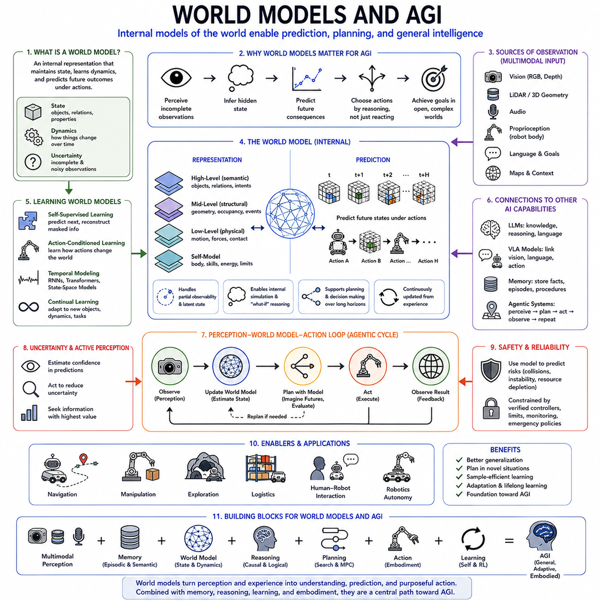
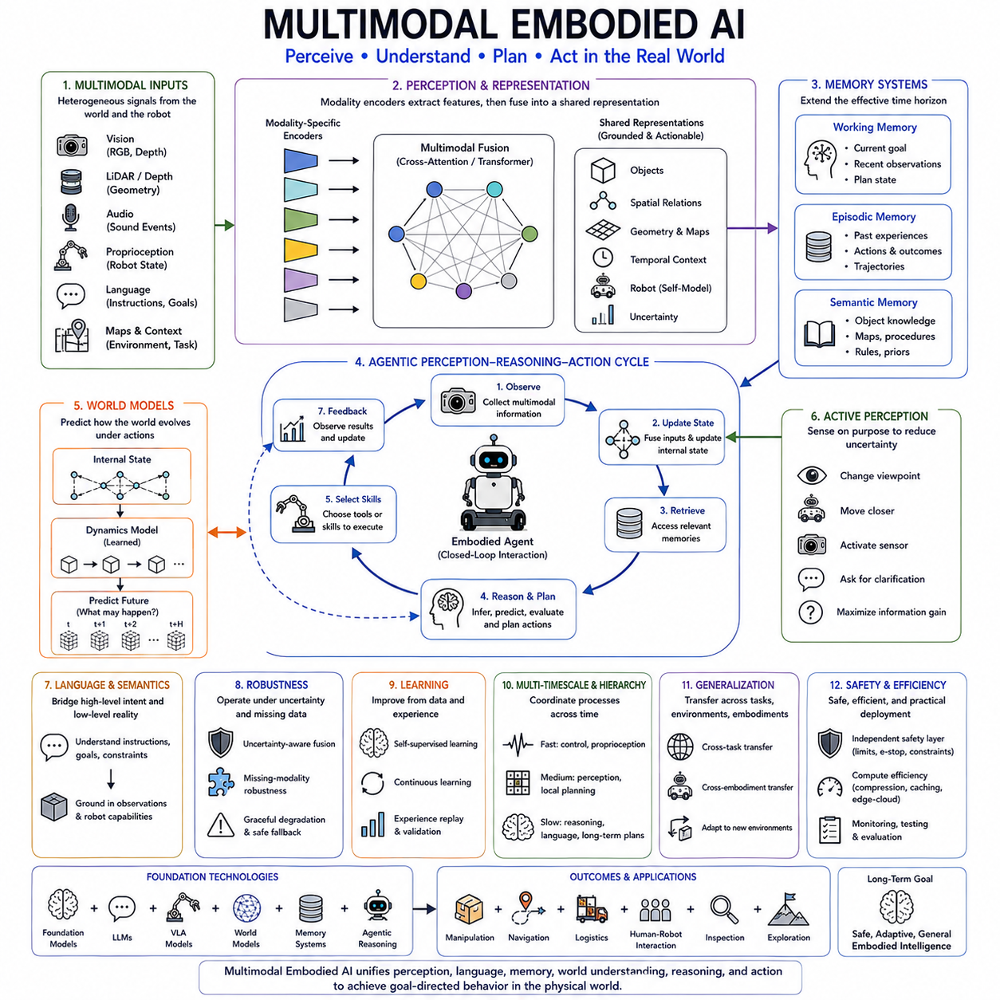
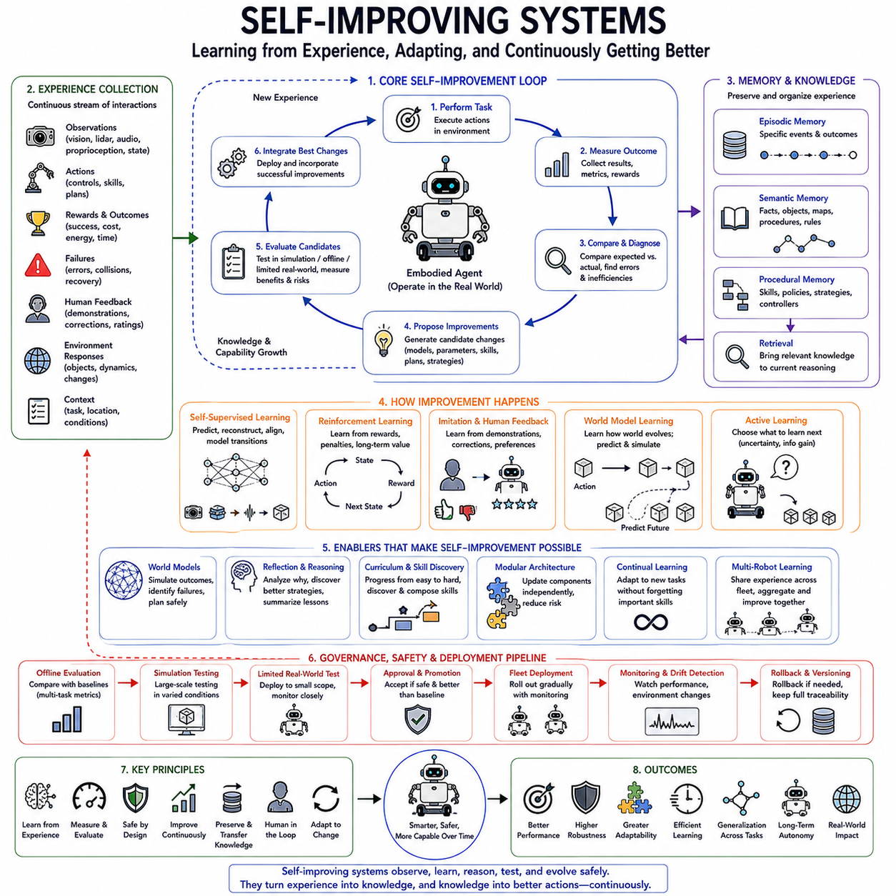
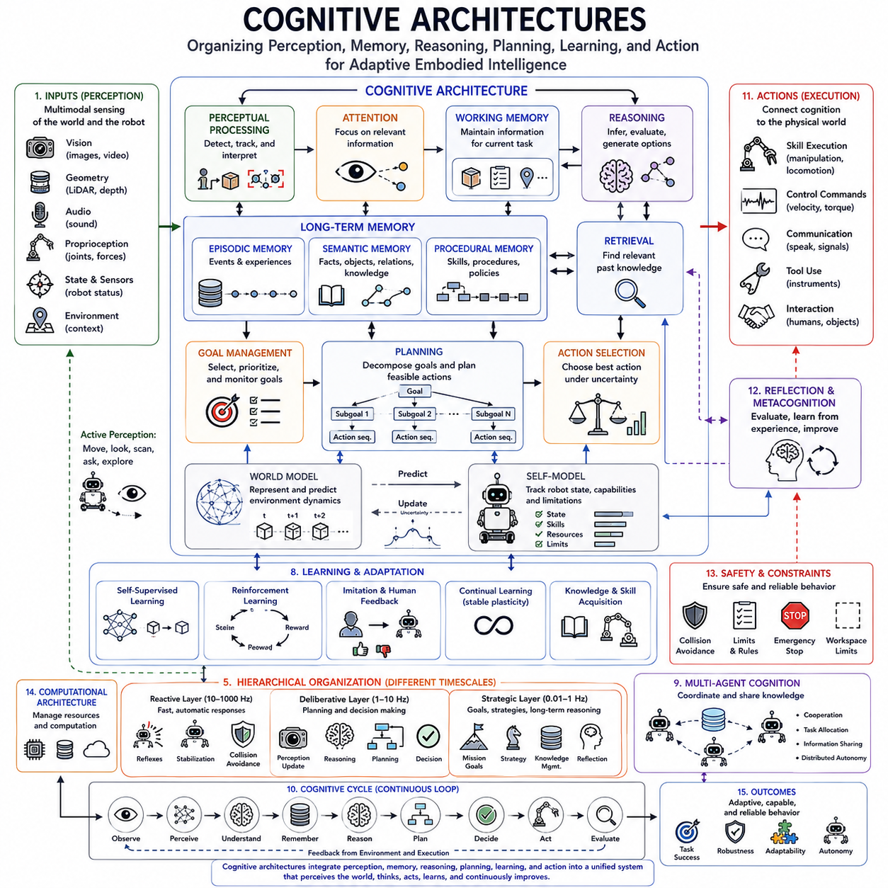
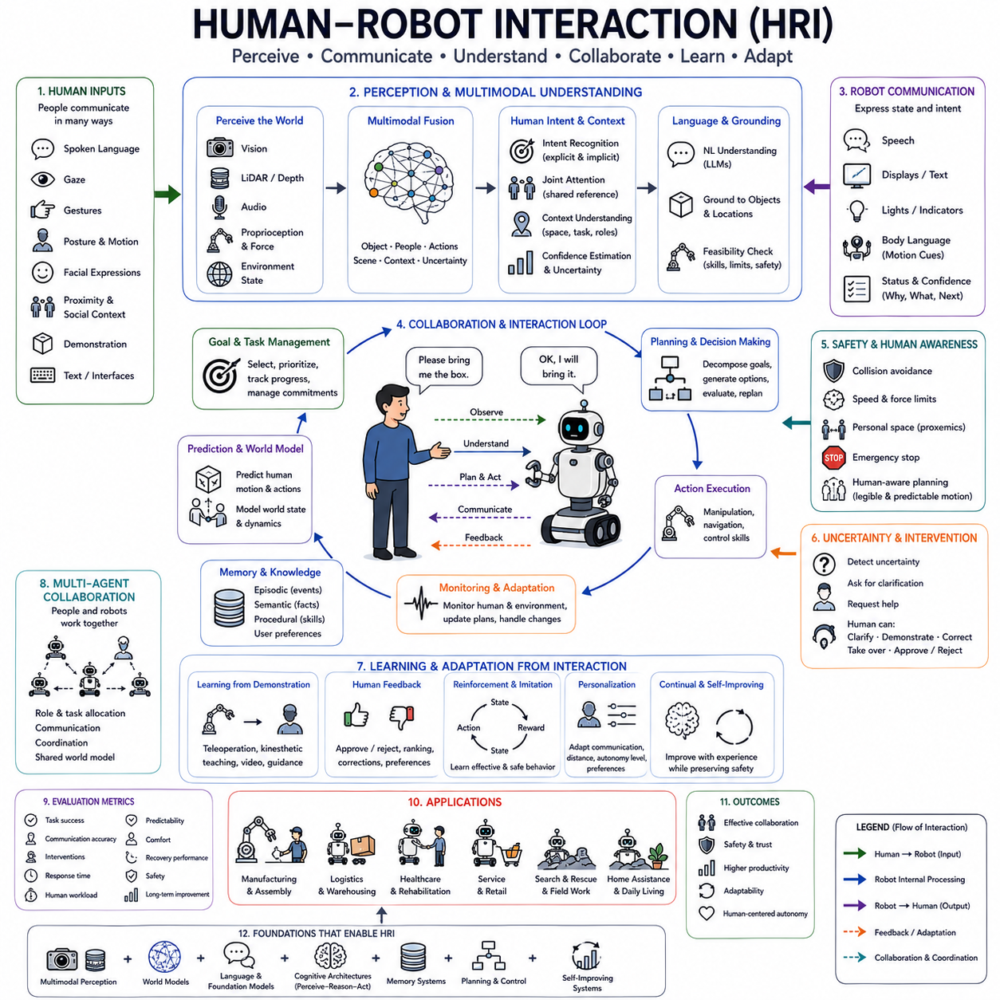
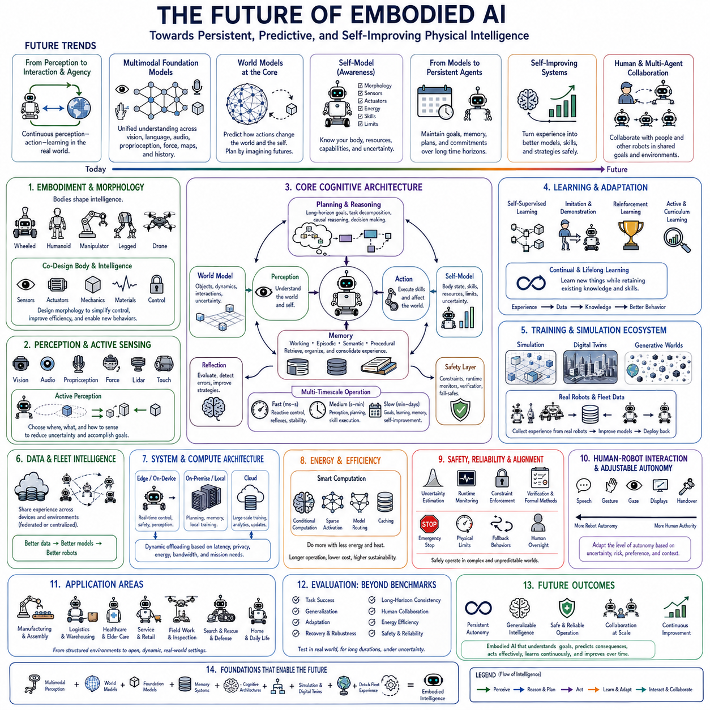

**Volume 45. Embodied AI and World Models**

# Chapter 07. Advanced Embodied AI

## 07.01. World Models and AGI

{width="7.268055555555556in" height="7.268055555555556in"}

월드 모델(World Models)은 지능형 에이전트(Intelligent Agents)가 관측 정보를 체계화하고, 숨겨진 상태(Hidden State)를 추정하며, 미래 상태(Future Conditions)를 예측하고, 행동의 결과(Consequences of Actions)를 추론할 수 있도록 하는 내부 계산 표현(Internal Computational Representations)입니다. 고도화된 체화 인공지능(Embodied AI)에서 월드 모델은 단순한 지도나 객체 데이터베이스 이상의 의미를 가집니다. 객체(Entity), 관계(Relationships), 동역학(Dynamics), 불확실성(Uncertainty), 행동(Action)이 시간에 따라 어떻게 상호작용하는지를 표현하며, 점차 범용화되는 지능을 위한 예측적 기반(Predictive Substrate)을 제공합니다.

월드 모델과 범용 인공지능(Artificial General Intelligence, AGI)의 연결은 즉각적인 관측을 넘어 추론해야 할 필요성에서 발생합니다. 열린 세계(Open World)에서 동작하는 지능형 에이전트는 패턴 인식(Pattern Recognition)이나 반응형 정책(Reactive Policies)에만 의존할 수 없습니다. 무엇이 존재하는지에 대한 믿음(Beliefs)을 유지하고, 현재 관측할 수 없는 것을 추론하며, 다음에 어떤 일이 발생할지를 예상하고, 현재의 감각 입력에 단순히 반응하는 대신 예측된 결과에 따라 행동을 선택해야 합니다.

따라서 유용한 월드 모델은 상태(State)와 동역학(Dynamics)을 모두 포함합니다. 상태는 객체, 에이전트, 공간적 관계(Spatial Relationships), 환경 속성(Environmental Properties), 로봇 구성(Robot Configuration), 작업 문맥(Task Context)을 포함하여 현재 상황의 관련 측면을 설명합니다. 동역학은 이러한 변수들이 자연적으로 또는 개입(Intervention)에 의해 어떻게 변화할 수 있는지를 설명합니다. 이 두 요소를 결합하면 지능 시스템은 세계가 무엇인지뿐 아니라 세계가 어떻게 변화하고 행동하는지를 표현할 수 있습니다.

월드 모델은 관측이 불완전한 상황에서 특히 중요합니다. 물리적 에이전트(Physical Agents)는 센서의 범위가 제한되고, 가림(Occlusion)이 발생하며, 측정값에 노이즈가 포함되고, 중요한 변수가 숨겨질 수 있기 때문에 주변 환경의 모든 관련 속성을 직접 인식할 수 없습니다. 내부 모델은 시간에 걸쳐 증거를 통합하고 잠재 상태(Latent State)의 추정치를 유지함으로써 특정 객체나 사건이 일시적으로 관측에서 사라지는 경우에도 연속성을 유지할 수 있도록 합니다.

예측(Prediction)은 이러한 표현을 능동적인 추론 메커니즘(Active Reasoning Mechanism)으로 변환합니다. 현재 상태와 후보 행동(Candidate Action)이 주어지면 모델은 가능한 미래 상태를 추정할 수 있습니다. 체화 에이전트는 객체가 이동할지, 경로가 차단될지, 파지(Grasp)가 성공할지, 또는 자신의 움직임으로 인해 위험한 상태가 발생할지를 예측할 수 있습니다. 이를 통해 지능 시스템은 물리적 행동을 실행하기 전에 여러 대안을 비교할 수 있습니다.

이러한 능력은 내부 시뮬레이션(Internal Simulation)의 한 형태를 가능하게 합니다. 에이전트는 비용이 많이 들거나 위험할 수 있는 실제 환경의 시행착오(Trial and Error)에만 의존하는 대신 학습된 모델 내부에서 가상의 행동(Hypothetical Actions)을 평가할 수 있습니다. 여러 후보 미래(Candidate Futures)를 상상하고 비교하며 실제로 실행하지 않고도 부적절한 행동을 제거할 수 있습니다. 이러한 내부 시뮬레이션은 반응형 행동과 장기적인 신중한 계획(Deliberate Planning)을 연결하는 중요한 가교를 제공합니다.

월드 모델은 여러 추상화 수준(Levels of Abstraction)에서 동작할 수 있습니다. 저수준 표현(Low-Level Representations)은 기하학(Geometry), 움직임(Motion), 접촉(Contact), 물리 동역학(Physical Dynamics)을 표현할 수 있고, 고수준 표현(High-Level Representations)은 객체, 관계, 의도(Intentions), 작업, 인과 구조(Causal Structure)를 설명할 수 있습니다. 범용 지능은 의미적으로 무엇이 일어나야 하는지를 추론하는 동시에 해당 물리적 행동이 실제로 가능한지를 예측해야 하므로 이러한 수준 사이의 조정이 필요합니다.

멀티모달 인식(Multimodal Perception)은 이러한 내부 표현을 구성하기 위한 관측 기반을 제공합니다. 비전(Vision)은 외형과 의미 정보를 제공하고, 라이다(LiDAR)와 깊이 센싱(Depth Sensing)은 기하학적 정보를 제공하며, 오디오(Audio)는 시야 밖에서 발생하는 사건을 알려줄 수 있습니다. 고유수용감각(Proprioception)은 에이전트 자신의 신체 상태를 설명하고, 언어(Language)는 목표와 문맥 지식(Contextual Knowledge)을 제공합니다. 이러한 정보원을 융합하면 하나의 모달리티만으로는 얻기 어려운 풍부한 세계 상태 추정(World-State Estimation)을 구성할 수 있습니다.

월드 모델은 개별적인 순간의 장면이 아니라 상태 전이(State Transitions)를 이해해야 하기 때문에 시간적 학습(Temporal Learning)이 기본적으로 필요합니다. 관측과 행동의 시퀀스는 객체가 어떻게 움직이고, 환경이 어떻게 변화하며, 개입이 미래 상태를 어떻게 변화시키는지를 보여줍니다. 순환 아키텍처(Recurrent Architectures), 트랜스포머(Transformers), 상태 공간 모델(State-Space Models), 잠재 동역학 모델(Latent Dynamics Models)은 시간적 의존성을 인코딩하고 체화 행동에 필요한 다양한 시간 척도에 걸쳐 정보를 유지할 수 있습니다.

자기지도학습(Self-Supervised Learning)은 물리적 상호작용 자체가 지속적으로 학습 신호를 생성하기 때문에 월드 모델 학습에 특히 적합합니다. 과거 관측으로부터 미래 관측을 예측하고, 마스킹된 정보(Masked Information)를 복원하며, 행동과 그 결과로 발생하는 상태 변화 사이의 관계를 모든 경험에 수동으로 라벨링하지 않고도 학습할 수 있습니다. 이를 통해 대규모 로봇 및 환경 데이터를 점차 범용적인 표현 학습에 활용할 수 있습니다.

행동 조건부 예측(Action-Conditioned Prediction)은 실제 행동에 활용 가능한 월드 모델(Actionable World Model)을 수동적인 장면 이해(Passive Scene Understanding)와 구별합니다. 모델은 자연적으로 어떤 일이 발생할 가능성이 있는지만 표현하는 것이 아니라 에이전트의 개입에 따라 결과가 어떻게 달라지는지를 표현해야 합니다. 앞으로 이동하거나, 문을 열거나, 객체를 파지하거나, 장애물을 밀면 서로 다른 상태 전이가 발생합니다. 이러한 관계를 학습함으로써 시스템은 인식과 계획, 물리적 행위 능력(Physical Agency)을 연결할 수 있습니다.

이러한 관계는 인과 추론(Causal Reasoning)의 기반도 제공합니다. 상관관계(Correlation)는 사건들이 자주 함께 발생한다는 것을 나타낼 수 있지만, 자율 에이전트는 자신의 행동이 결과에 어떤 영향을 미치는지를 이해해야 합니다. 환경과의 상호작용을 통해 시스템은 개입을 수행하고 그에 따른 변화를 관측함으로써 가설을 검증할 수 있습니다. 시간이 지나면서 월드 모델링은 통계적 예측(Statistical Prediction)에서 점차 유용한 인과 구조를 표현하는 방향으로 발전할 수 있습니다.

기억(Memory)과 월드 모델은 밀접하게 연결되어 있지만 서로 다른 기능을 수행합니다. 기억은 관측, 사건, 사실, 절차, 이전 경험을 보존하고, 월드 모델은 이러한 정보를 상태 전이를 예측할 수 있는 표현으로 구성합니다. 기억은 과거의 증거를 제공하고, 월드 모델은 이러한 증거를 사용하여 현재와 미래에 대한 기대(Expectations)를 구성할 수 있습니다. 따라서 두 요소 모두 고도화된 체화 아키텍처(Embodied Architectures)의 중요한 구성요소입니다.

언어 모델(Language Models)은 의미적 지식(Semantic Knowledge)과 유연한 추론(Flexible Reasoning)을 제공함으로써 월드 모델을 보완할 수 있습니다. 언어 모델은 개념, 관계, 절차, 의사소통에 강점을 가지며, 체화된 월드 모델(Embodied World Models)은 추론을 물리적 상태와 동역학에 연결합니다. 고도화된 에이전트는 언어를 이용해 무엇을 달성해야 하는지를 해석하고, 월드 모델을 이용해 물리적으로 무엇이 존재하며, 무엇이 발생할 수 있고, 어떤 행동이 의도한 결과를 달성할 수 있는지를 추정할 수 있습니다.

비전-언어-행동 모델(Vision-Language-Action Models)은 월드 모델링과 체화 지능(Embodied Intelligence)을 연결하는 또 다른 경로를 제공합니다. VLA 시스템은 멀티모달 관측과 언어 명령을 행동과 직접 연결하고, 명시적 또는 암묵적 월드 모델(Explicit or Implicit World Models)은 이러한 의사결정의 배후에서 예측 구조(Predictive Structure)를 제공합니다. 행동 생성과 미래 상태 예측을 결합하면 에이전트는 단순한 관측-행동 매핑(Observation-to-Action Mapping)에만 의존하지 않고 후보 행동을 평가할 수 있습니다.

계획(Planning)은 월드 모델이 예측한 미래를 탐색하는 과정으로 구성할 수 있습니다. 에이전트는 추정된 현재 상태에서 시작하여 가능한 행동을 생성하고, 그 결과를 예측하며, 목표와 제약조건을 기준으로 결과를 평가한 다음 유망한 행동을 선택합니다. 이러한 과정을 여러 단계에 걸쳐 반복하면 내비게이션(Navigation), 조작(Manipulation), 탐사(Exploration), 물류(Logistics) 및 기타 장기 작업을 지원하는 가상의 궤적(Imagined Trajectories)을 구성할 수 있습니다.

모델 예측 제어(Model Predictive Control, MPC)는 비교적 짧은 시간 척도에서 이러한 원리를 적용하는 실용적인 사례입니다. 모델은 제한된 예측 구간(Finite Horizon)에서 후보 제어 시퀀스의 결과를 예측하고, 최적화기(Optimizer)는 적절한 시퀀스를 선택하며, 첫 번째 행동을 실행한 후 새로운 관측을 이용하여 이 과정을 반복합니다. 고도화된 월드 모델 아키텍처는 이러한 기본 원리를 더욱 풍부한 학습 표현과 고수준 의사결정으로 확장합니다.

학습된 월드 모델은 현실의 완벽한 복제본이 아니라 근사 모델(Approximation)이므로 불확실성은 피할 수 없습니다. 예측은 미래로 더 멀리 진행되거나 익숙하지 않은 상황을 만날수록 신뢰성이 낮아집니다. 따라서 지능형 시스템은 신뢰도(Confidence)를 추정하고, 필요한 경우 여러 가능한 가설(Multiple Hypotheses)을 유지하며, 즉각적인 행동보다 추가 관측이 더 가치 있는 시점을 판단해야 합니다. 범용 지능은 자신의 내부 모델이 틀릴 가능성이 있는 시점을 인식하는 능력도 필요로 합니다.

능동 인식(Active Perception)은 불확실성을 인식하는 월드 모델링(Uncertainty-Aware World Modeling)으로부터 자연스럽게 도출됩니다. 모델이 객체, 경로, 사건에 대한 충분한 정보를 가지고 있지 않다면 에이전트는 불확실성을 줄이기 위해 의도적으로 이동하거나 센서를 활성화할 수 있습니다. 따라서 인식은 단순히 수동적으로 센서 데이터를 받아들이는 과정이 아니라 예상 정보 이득(Expected Information Gain)에 따라 선택되는 행동이 됩니다. 이는 월드 모델링, 주의(Attention), 탐사, 의사결정을 더욱 긴밀하게 통합합니다.

체화(Embodiment)는 물리적 지능(Physical Intelligence)의 발전에서 월드 모델에 특히 중요한 역할을 부여합니다. 거리(Distance), 힘(Force), 균형(Balance), 접근 가능성(Accessibility), 충돌(Collision), 포함 관계(Containment), 지지(Support)와 같은 개념은 환경과의 상호작용을 통해 실제적인 의미를 획득합니다. 체화 학습(Embodied Learning)은 추상적 표현을 감각운동 결과(Sensorimotor Consequences)와 연결하여 순수한 기호 기반 또는 텍스트 기반 시스템이 물리적 경험으로부터 직접 획득하기 어려운 그라운딩(Grounding)을 제공합니다.

자기 모델(Self-Model)은 에이전트 자체를 표현함으로써 외부 세계 모델(External World Model)을 보완할 수 있습니다. 시스템은 자신의 신체, 능력(Capabilities), 센서, 사용 가능한 기술(Skills), 에너지, 불확실성, 운영 한계(Operational Limitations)에 관한 정보를 필요로 합니다. 그러면 계획은 자기 모델과 월드 모델 사이의 상호작용, 즉 환경에 무엇이 존재하고, 에이전트가 무엇을 할 수 있으며, 그 행동이 세계와 에이전트 자신의 상태를 어떻게 변화시킬지를 함께 추론하는 과정이 됩니다.

열린 세계 환경은 초기 학습 단계에서 완전히 표현할 수 없기 때문에 지속 학습(Continual Learning)이 필요합니다. 새로운 객체, 동역학, 작업, 환경, 실패 모드(Failure Modes)는 실제 배포 이후에도 계속 등장합니다. 따라서 월드 모델은 기존에 학습한 지식을 보존하면서 유용한 새로운 경험을 통합해야 합니다. 리플레이(Replay), 기억 통합(Memory Consolidation), 선택적 적응(Selective Adaptation), 신중하게 검증된 모델 업데이트를 통해 이러한 장기적 발전을 지원할 수 있습니다.

에이전트형 시스템(Agentic Systems)은 이러한 능력을 활용할 수 있는 의사결정 아키텍처(Decision-Making Architecture)를 제공합니다. 에이전트는 세계를 관측하고, 내부 상태를 갱신하며, 관련 기억을 검색하고, 가능한 미래를 예측하고, 목표를 향한 계획을 수립하며, 행동을 실행한 후 그 결과 상태를 관측합니다. 이후 이러한 순환 과정이 반복됩니다. 따라서 월드 모델링은 지속적인 목표, 적응, 점차 높은 수준의 자율 행동을 지원하는 확장된 인식-행동 루프(Perception-Action Loop)의 일부가 됩니다.

시뮬레이션(Simulation)과 디지털 트윈(Digital Twins)은 더욱 명시적인 물리 구조를 가진 외부 환경을 제공하여 학습된 내부 시뮬레이션을 보완할 수 있습니다. 로봇은 시뮬레이션에서 전략을 시험하고, 시뮬레이션의 예측 결과를 실제 관측과 비교하며, 그 차이를 이용하여 내부 모델을 개선할 수 있습니다. 이를 통해 실제 경험(Real-World Experience), 가상 실험(Virtual Experimentation), 모델 개선(Model Refinement), 이후의 물리적 행동 사이에 반복적인 학습 순환이 형성됩니다.

일반화(Generalization)는 월드 모델이 AGI와 관련되는 가장 중요한 이유 가운데 하나입니다. 열린 세계에서 발생 가능한 모든 상황에 대해 성공적인 행동을 암기하는 것은 불가능합니다. 충분히 조합 가능한 내부 모델(Compositional Internal Model)은 객체, 동역학, 공간 관계, 행동, 목표에 관한 지식을 새로운 조합으로 재사용할 수 있습니다. 이를 통해 에이전트는 완전한 재학습 없이도 이전에 학습한 구성요소를 활용하여 익숙하지 않은 상황을 추론할 수 있습니다.

그러나 월드 모델을 보유하는 것 자체가 AGI를 의미하지는 않습니다. 범용 지능은 인식, 기억, 학습, 추론, 계획, 행동, 의사소통(Communication), 적응(Adaptation), 그리고 목표와 불확실성을 관리하는 메커니즘도 필요로 합니다. 따라서 체화 지능 아키텍처는 월드 모델링을 완전한 지능 이론으로 취급하기보다 더 큰 통합 시스템(Integrated System)을 구성하는 하나의 핵심 요소로 다룹니다.

안전성(Safety)은 예측 모델에 추가적인 요구사항을 부여합니다. 중요한 행동을 실행하기 전에 에이전트는 월드 모델을 사용하여 충돌, 불안정한 상태(Unstable Configurations), 자원 고갈(Resource Depletion), 기타 바람직하지 않은 결과를 예측할 수 있습니다. 그러나 예측 오류는 피할 수 없으므로 월드 모델의 예측이 독립적인 안전 메커니즘을 대체해서는 안 됩니다. 학습 기반 추론은 검증된 제어기(Verified Controllers), 운영 제한(Operational Limits), 모니터링 시스템(Monitoring Systems), 비상 행동(Emergency Behaviors)의 제약 아래에서 동작해야 합니다.

따라서 현재의 월드 모델에서 AGI로 발전하는 경로는 통합(Integration)과 지속적인 상호작용(Continual Interaction)에 달려 있습니다. 멀티모달 인식은 증거를 제공하고, 기억은 경험을 보존하며, 월드 모델은 상태를 표현하고 예측하고, 추론은 대안을 평가하며, 계획은 행동을 조직하고, 체화는 이러한 예측을 현실과 비교하여 검증합니다. 그 결과로 발생하는 피드백은 내부 표현을 지속적으로 수정하고 시스템이 학습할 수 있는 새로운 경험을 제공합니다.

이러한 관점에서 월드 모델이 중요한 이유는 현실의 완벽한 내부 복제본을 만드는 데 있는 것이 아니라, 지능형 에이전트에게 변화(Change)를 이해하고 결과를 예측하기 위한 지속적으로 수정 가능한 구조(Continuously Revisable Structure)를 제공한다는 데 있습니다. 체화, 기억, 인과 학습(Causal Learning), 자율 에이전시(Autonomous Agency), 자기 개선(Self-Improvement)과 결합된 월드 모델은 미래의 인공지능 시스템이 단순한 패턴 인식을 넘어 적응적이고(Adaptive), 현실에 그라운딩되며(Grounded), 점차 범용적인 지능으로 발전하는 데 필요한 핵심 메커니즘 가운데 하나를 제공합니다.

## 07.02. Multimodal Embodied AI

{width="7.268055555555556in" height="7.268055555555556in"}

멀티모달 체화 인공지능(Multimodal Embodied AI)은 인식(Perception), 언어(Language), 공간 이해(Spatial Understanding), 기억(Memory), 추론(Reasoning), 물리적 행동(Physical Action)을 하나의 체화 시스템(Embodied System) 안에서 통합합니다. 각각의 감각 채널이나 인지 기능을 독립적으로 처리하는 대신, 이질적인 정보(Heterogeneous Information)를 공유 표현(Shared Representation)으로 결합하여 목표 지향적 행동(Goal-Directed Behavior)을 지원합니다. 이를 통해 에이전트는 주변 환경을 해석하고, 명령을 이해하며, 행동을 계획하고, 물리적 세계와 조화롭게 상호작용할 수 있습니다.

체화 지능(Embodied Intelligence)의 멀티모달 특성은 물리적 에이전트(Physical Agents)가 이용할 수 있는 정보의 다양성을 반영합니다. 카메라는 외형(Appearance)과 의미적 단서(Semantic Cues)를 제공하고, 라이다(LiDAR)와 깊이 센서(Depth Sensors)는 기하학적 구조(Geometry)를 포착하며, 마이크는 음향 이벤트(Sound Events)를 감지하고, 고유수용감각(Proprioception)은 로봇의 내부 상태를 나타냅니다. 언어는 목표와 제약조건을 전달하며, 지도(Maps), 객체 기억(Object Memories), 행동 이력(Action Histories), 작업 문맥(Task Context)은 순간적인 센싱만으로 얻을 수 없는 추가 정보를 제공합니다.

핵심적인 과제는 이러한 이질적인 신호를 서로 호환 가능한 표현(Compatible Representations)으로 변환하는 것입니다. 각 모달리티(Modality)는 차원(Dimensionality), 샘플링 속도(Sampling Rate), 불확실성(Uncertainty), 좌표계(Coordinate System), 의미적 의미(Semantic Meaning)가 서로 다릅니다. 모달리티별 인코더(Modality-Specific Encoders)가 먼저 유용한 특징을 추출하고, 이후 융합 메커니즘(Fusion Mechanisms)이 이를 공유 잠재 표현(Shared Latent Representations)으로 통합할 수 있습니다. 트랜스포머(Transformers)와 교차 어텐션(Cross-Attention)은 하나의 모달리티 정보가 다른 모달리티의 해석에 선택적으로 영향을 줄 수 있기 때문에 특히 효과적입니다.

공간적 그라운딩(Spatial Grounding)은 체화 지능이 추상적 개념(Abstract Concepts)을 물리적 객체와 연결해야 하기 때문에 필수적입니다. "컨테이너를 작업대 옆에 놓아라(Place the Container Beside the Workstation)"와 같은 언어 명령은 관측된 객체, 공간적 관계(Spatial Relations), 로봇이 접근할 수 있는 위치(Robot-Reachable Locations)와 연결되어야 합니다. 따라서 시각 특징(Visual Features), 깊이 정보(Depth Information), 지도, 언어 임베딩(Language Embeddings)은 의미적 정체성(Semantic Identity)과 실제 행동이 가능한 물리 좌표(Actionable Physical Coordinates)를 모두 보존하는 표현으로 통합되어야 합니다.

시간적 문맥(Temporal Context)은 체화된 멀티모달 시스템을 정적인 인식 모델(Static Perception Models)과 더욱 명확하게 구분합니다. 관측의 의미는 이전에 어떤 일이 발생했는지, 어떤 행동이 실행되었는지, 이후 환경이 어떻게 변화했는지에 따라 달라지는 경우가 많습니다. 시간적 어텐션(Temporal Attention), 순환 기억(Recurrent Memory), 상태 공간 표현(State-Space Representations)은 관측 사이의 연속성을 유지하여 에이전트가 객체를 추적하고, 진행 상황을 인식하고, 숨겨진 상태(Hidden States)를 추정하며, 예상하지 못한 상태 전이(Unexpected Transitions)를 탐지할 수 있도록 합니다.

멀티모달 체화 인공지능은 로봇 자체에 대한 표현도 필요로 합니다. 관절 상태(Joint States), 속도(Velocity), 배터리 수준(Battery Level), 센서 가용성(Sensor Availability), 페이로드(Payload), 액추에이터 상태(Actuator Condition), 현재 사용 가능한 기술(Current Skills)은 어떤 행동을 수행할 수 있는지를 결정합니다. 따라서 유용한 체화 표현(Embodied Representation)은 외부 세계의 정보와 에이전트의 능력 및 한계를 나타내는 자기 모델(Self-Model)을 결합하여 환경적 기회(Environmental Opportunities)와 물리적 실행 가능성(Physical Feasibility)을 모두 고려한 의사결정을 가능하게 해야 합니다.

언어는 이러한 인식-행동 시스템(Perception-Action System)에 고수준의 의미 구조(High-Level Semantic Structure)를 제공합니다. 인간의 명령은 목표, 우선순위, 제약조건, 객체 속성(Object Properties), 절차(Procedures)를 유연한 형태로 설명할 수 있습니다. 언어 모델(Language Models)은 이러한 명령을 해석하고 시각 및 공간 정보와 연결할 수 있지만, 성공적인 실행을 위해서는 내부 언어 지식에만 의존하지 않고 언어적 개념을 실제 관측과 검증된 로봇 능력(Validated Robot Capabilities)에 그라운딩해야 합니다.

비전-언어-행동 모델(Vision-Language-Action Models)은 멀티모달 인식을 행동과 직접 연결하는 하나의 아키텍처를 제공합니다. 시각적 관측(Visual Observations), 언어 명령(Language Instructions), 로봇 상태(Robot States), 행동 이력을 함께 처리하여 행동 표현(Action Representations)을 생성할 수 있습니다. 이러한 모델은 고수준 기술(High-Level Skills), 궤적(Trajectories), 자세(Poses), 또는 짧은 행동 시퀀스(Short Action Sequences)를 예측함으로써 인식-행동 루프(Perception-Action Loop) 내부에서 의미적 이해와 물리적 실행을 직접 연결합니다.

월드 모델(World Models)은 서로 다른 행동에 따라 환경이 어떻게 변화할지를 표현함으로써 상호 보완적인 능력을 제공합니다. 융합된 멀티모달 관측(Fused Multimodal Observations)은 객체, 기하학, 동역학(Dynamics), 의미적 관계(Semantic Relationships), 불확실성을 포함하는 내부 상태(Internal State)로 변환될 수 있습니다. 이후 에이전트는 미래 상태(Future States)를 예측하고, 후보 행동(Candidate Actions)을 평가하며, 반응형 매핑(Reactive Mappings)에만 의존하지 않고 예상 결과(Expected Outcomes)를 기준으로 행동을 선택할 수 있습니다.

기억은 멀티모달 체화 지능이 활용할 수 있는 실질적인 시간 범위(Temporal Horizon)를 확장합니다. 작업 기억(Working Memory)은 현재 목표, 최근 관측, 계획 상태(Plan State)를 유지할 수 있고, 일화 기억(Episodic Memory)은 이전 상호작용과 그 결과를 저장합니다. 의미 기억(Semantic Memory)은 객체 지식, 지도, 절차, 규칙 등을 보존할 수 있습니다. 이러한 기억 시스템에서 정보를 검색함으로써 현재의 추론은 더 이상 직접 보이지 않거나 즉시 이용할 수 없는 정보까지 활용할 수 있습니다.

에이전트형 아키텍처(Agentic Architectures)는 이러한 구성요소를 반복적인 의사결정 과정(Iterative Decision Process)으로 조직합니다. 에이전트는 환경을 관측하고, 멀티모달 증거(Multimodal Evidence)를 융합하고, 내부 상태를 갱신하며, 관련 기억을 검색하고, 목표를 추론하고, 도구(Tools) 또는 기술(Skills)을 선택하고, 행동을 실행한 다음 결과를 관측합니다. 실제 세계가 예상과 다를 경우 시스템은 사전에 결정된 시퀀스를 무조건 계속하는 대신 자신의 표현을 수정하고 재계획(Replanning)할 수 있습니다.

멀티모달 정보가 불완전하거나 불확실한 경우 능동 인식(Active Perception)이 중요해집니다. 센싱을 수동적인 입력으로만 처리하는 대신 에이전트는 불확실성을 줄이기 위해 의도적으로 카메라를 움직이고, 관측 시점(Viewpoint)을 변경하고, 객체에 접근하고, 특정 센서를 활성화하거나, 추가 설명을 요청할 수 있습니다. 이를 통해 인식 자체가 계획의 일부가 되며, 행동은 부분적으로 해당 행동이 제공할 것으로 예상되는 정보(Expected Information)에 따라 선택될 수 있습니다.

모달리티의 신뢰성은 항상 동일하게 유지되지 않기 때문에 불확실성 인식 융합(Uncertainty-Aware Fusion)이 필요합니다. 카메라는 어두운 환경에서 성능이 저하될 수 있고, 라이다는 특정 환경 조건에서 노이즈가 증가할 수 있으며, 위성항법시스템(GNSS)을 사용할 수 없는 상황이 발생할 수 있고, 언어는 모호할 수 있습니다. 강건한 시스템(Robust System)은 모달리티별 신뢰도(Modality Confidence)를 추정하고 이용 가능한 증거의 가중치를 적응적으로 조정하면서, 현재의 어떤 관측 조합으로도 충분히 신뢰할 수 있는 의사결정을 내릴 수 없는 상황을 인식해야 합니다.

실제 환경에 배포하기 위해서는 누락 모달리티 강건성(Missing-Modality Robustness)도 중요합니다. 중요도가 낮은 하나의 센서가 일시적으로 고장 났다고 해서 로봇이 반드시 모든 기능을 상실해서는 안 됩니다. 모달리티 드롭아웃(Modality Dropout), 손상된 관측(Corrupted Observations), 모의 고장(Simulated Failures)을 포함하여 학습하면 중복된 표현(Redundant Representations)을 형성하도록 유도할 수 있습니다. 이후 시스템은 대체 센서에 대한 의존도를 높이면서 점진적으로 성능을 낮추고, 신뢰도 감소를 보고하며, 안전 여유(Safety Margins)가 충분하지 않을 경우 행동을 제한할 수 있습니다.

체화된 멀티모달 지능은 여러 시간 척도(Timescales)에 걸쳐 동작해야 합니다. 저수준 고유수용감각과 제어(Control)는 높은 주파수로 갱신될 수 있고, 시각 인식과 로컬 계획(Local Planning)은 중간 수준의 주기로 동작하며, 의미적 추론(Semantic Reasoning)과 언어 상호작용은 더 느리게 수행됩니다. 계층적 아키텍처(Hierarchical Architectures)를 이용하면 이러한 과정이 비동기적으로 동작하면서 각 의사결정 계층에 필요한 정보만 교환할 수 있으므로 반응성과 계산 효율성(Computational Efficiency)을 동시에 향상시킬 수 있습니다.

서로 다른 로봇은 센서, 신체 구조(Body Geometries), 매니퓰레이터(Manipulators), 행동 공간(Action Spaces)이 다르기 때문에 교차 체화 일반화(Cross-Embodiment Generalization)는 또 다른 중요한 과제입니다. 공유 멀티모달 표현(Shared Multimodal Representations)은 특정 액추에이터 명령과 독립적으로 작업 개념(Task Concepts)을 표현하고, 체화별 모듈(Embodiment-Specific Modules)은 일반적인 의도(General Intentions)를 각 로봇에 적합한 물리적 행동으로 변환할 수 있습니다. 이를 통해 기계적 구조가 동일하지 않아도 하나의 플랫폼에서 학습한 지식을 다른 플랫폼에 활용할 수 있습니다.

시뮬레이션(Simulation)과 디지털 트윈(Digital Twins)은 실제 환경에서 수집하기에는 비용이 높은 시각, 기하학, 상태, 행동 데이터의 다양한 조합을 생성하여 멀티모달 학습을 확장할 수 있습니다. 도메인 무작위화(Domain Randomization)는 모델을 조명, 텍스처(Textures), 객체, 동역학, 센서 노이즈의 다양한 변화에 노출시킬 수 있습니다. 그러나 물리적 상호작용에는 시뮬레이션이 근사적으로만 표현할 수 있는 접촉 동역학(Contact Dynamics), 하드웨어 불확실성(Hardware Uncertainty), 환경 복잡성이 존재하기 때문에 실제 데이터(Real-World Data)는 여전히 필수적입니다.

자기지도학습(Self-Supervised Learning)은 대규모 멀티모달 로봇 데이터를 활용할 수 있는 확장 가능한 방법을 제공합니다. 모델은 미래 관측을 예측하고, 마스킹된 모달리티(Masked Modalities)를 복원하며, 언어를 장면 및 행동과 정렬하고, 누락된 센서 정보를 추정하거나, 행동과 상태 전이 사이의 대응 관계를 학습할 수 있습니다. 이러한 학습 목표는 광범위한 수동 라벨링(Manual Labeling)에 대한 의존도를 줄이면서 작업과 환경 전반에서 재사용할 수 있는 표현을 학습하도록 합니다.

지속 학습(Continuous Learning)은 체화 시스템이 배포 이후 새로운 객체, 작업, 환경, 실패 모드(Failure Modes)를 경험하면서 성능을 개선할 수 있도록 합니다. 경험을 저장하고, 필터링하고, 평가한 후 이후 갱신된 모델에 반영할 수 있습니다. 그러나 새로운 학습으로 인해 기존 능력의 성능 저하(Regression)나 치명적 망각(Catastrophic Forgetting)이 발생할 수 있으므로 갱신된 모델을 배포하기 전에 버전 관리(Versioning), 리플레이(Replay), 검증(Validation), 안전 테스트(Safety Testing)가 필요합니다.

안전성(Safety)은 독립적인 아키텍처 요구사항으로 유지되어야 합니다. 멀티모달 추론은 환경 이해를 향상시킬 수 있지만, 학습된 모델은 여전히 장면을 잘못 해석하거나 안전하지 않은 행동을 생성할 수 있습니다. 따라서 충돌 제약조건(Collision Constraints), 비상 정지(Emergency Stopping), 작업 공간 제한(Workspace Limits), 속도 제한(Velocity Limits), 힘 제한(Force Limits) 및 기타 안전 메커니즘은 멀티모달 추론 모델 외부에서 강제되어야 하며, 확률적 지능(Probabilistic Intelligence)이 검증된 물리적 경계(Verified Physical Boundaries) 안에서 동작하도록 해야 합니다.

계산 효율성 역시 멀티모달 체화 인공지능의 구조에 영향을 미칩니다. 고해상도 비전, 포인트 클라우드(Point Clouds), 오디오, 언어, 기억, 시간적 문맥을 동시에 처리하면 상당한 연산량과 메모리가 필요할 수 있습니다. 토큰 감소(Token Reduction), 특징 압축(Feature Compression), 희소 어텐션(Sparse Attention), 양자화(Quantization), 캐싱(Caching), 선택적 센서 활성화(Selective Sensor Activation), 엣지-클라우드 분할(Edge-Cloud Partitioning)을 통해 신뢰성 있는 의사결정에 필요한 정보를 유지하면서 연산 비용을 줄일 수 있습니다.

평가(Evaluation)는 멀티모달 이해뿐 아니라 체화된 실행 성능도 측정해야 합니다. 관련 지표에는 그라운딩 정확도(Grounding Accuracy), 인식 품질(Perception Quality), 작업 성공률(Task Success), 궤적 효율(Trajectory Efficiency), 센서 누락에 대한 강건성, 불확실성에서의 복구 능력(Recovery from Uncertainty), 추론 지연(Inference Latency), 안전 위반(Safety Violations), 새로운 환경이나 체화 형태에 대한 일반화가 포함됩니다. 통제된 센서 성능 저하 시험(Controlled Sensor Degradation Testing)은 멀티모달 통합이 실제적인 중복성과 회복탄력성(Resilience)을 제공하는지를 확인하는 데 특히 유용합니다.

멀티모달 체화 인공지능의 중요성은 분리되어 있던 감각 및 인지 구성요소를 일관된 인식-추론-행동 시스템(Coherent Perception-Reasoning-Action System)으로 전환하는 데 있습니다. 비전은 외형을 설명하고, 기하학적 센싱(Geometric Sensing)은 구조를 설명하며, 언어는 의도(Intent)를 전달하고, 고유수용감각은 체화 상태를 나타냅니다. 기억은 문맥을 보존하고, 월드 모델은 변화를 예측하며, 행동은 물리적 상호작용을 통해 이러한 내부 표현을 현실에 대해 검증합니다.

로보틱스 파운데이션 모델(Robotics Foundation Models), 비전-언어-행동 아키텍처(Vision-Language-Action Architectures), 월드 모델, 기억 시스템, 에이전트형 추론(Agentic Reasoning)이 지속적으로 융합됨에 따라 멀티모달 체화 인공지능은 이들을 연결하는 통합 계층(Integration Layer)을 제공합니다. 장기적인 잠재력은 로봇이 복잡한 환경을 이해하고, 문맥을 유지하며, 여러 모달리티에 걸쳐 추론하고, 불확실성에 적응하며, 작업과 플랫폼 사이에서 지식을 전이하고, 점차 범용적인 물리적 행동(General Physical Behavior)을 안전하게 수행하도록 만드는 데 있습니다.

## 07.03. Self Improving Systems

{width="7.268055555555556in" height="7.268055555555556in"}

자기 개선 시스템(Self-Improving Systems)은 데이터(Data), 환경(Environment), 피드백(Feedback), 그리고 자체 운영 이력(Operational History)과의 반복적인 상호작용을 통해 자신의 능력을 향상하도록 설계된 인공지능 아키텍처(AI Architectures)입니다. 이러한 시스템은 배포 이후 고정된 상태로 유지되는 대신 자신의 성능을 관찰하고, 한계를 식별하고, 개선 후보(Candidate Improvements)를 생성하고, 결과를 평가한 후 성공적인 변경 사항을 선택적으로 통합합니다. 체화 인공지능(Embodied AI)에서는 이러한 개선이 인식(Perception), 계획(Planning), 제어(Control), 기억(Memory), 월드 모델링(World Modeling), 작업 실행(Task Execution) 등에 영향을 줄 수 있습니다.

핵심 원리는 폐쇄형 개선 루프(Closed Improvement Loop)입니다. 시스템은 작업을 수행하고, 결과를 측정하며, 실제 행동과 예상 행동(Expected Behavior)을 비교하고, 오류나 비효율성을 식별한 후 미래 성능을 어떻게 개선할 수 있는지를 결정합니다. 새로운 경험은 학습 또는 적응 데이터(Adaptation Data)가 되고, 평가 메커니즘(Evaluation Mechanisms)은 제안된 변경이 단순히 행동을 변화시키는 것이 아니라 실제로 측정 가능한 이점을 제공하는지를 판단합니다.

이 과정은 자기 개선이 여러 구성요소와 시간 척도(Timescales)에 걸쳐 이루어질 수 있다는 점에서 일반적인 온라인 학습(Online Learning)과 다릅니다. 로봇은 제어 파라미터(Control Parameter)를 즉시 조정하거나, 인식 모델을 점진적으로 개선하거나, 임무 이후 기억을 갱신하거나, 축적된 플릿 경험(Fleet Experience)을 이용하여 파운데이션 모델(Foundation Model)을 주기적으로 재학습할 수 있습니다. 따라서 성숙한 아키텍처는 운용 중의 빠른 적응(Fast Adaptation)과 더욱 느리고 신중하게 검증되는 모델 진화(Model Evolution)를 분리합니다.

경험 수집(Experience Collection)은 개선의 기반을 형성합니다. 물리적 에이전트(Physical Agents)는 관측, 행동, 보상(Rewards), 실패, 궤적(Trajectories), 센서 측정값, 인간 개입(Human Interventions), 환경 반응을 지속적으로 생성합니다. 이러한 기록에는 어렵거나, 성공적이거나, 예상하지 못했거나, 이전에 경험하지 못한 상황에 관한 정보가 포함됩니다. 자기 개선 시스템은 모든 상호작용을 동일하게 중요한 것으로 처리하기보다 어떤 경험을 보존할 가치가 있는지 식별해야 합니다.

실패 데이터(Failure Data)는 성공적인 궤적에서는 드러나지 않는 약점을 보여주기 때문에 특히 유용할 수 있습니다. 로봇은 잘못된 인식, 부정확한 위치추정(Localization), 불충분한 계획, 부적절한 파지 선택(Grasp Selection), 알려지지 않은 지형, 또는 월드 모델의 잘못된 가정 때문에 실패할 수 있습니다. 실패 이전의 상태, 시도한 행동, 관측된 결과, 최종적인 복구(Recovery)를 함께 기록하면 미래의 의사결정을 개선하기 위한 구조화된 증거(Structured Evidence)를 확보할 수 있습니다.

성공적인 경험 역시 중요한 정보를 포함합니다. 효율적인 궤적, 강건한 조작 전략(Robust Manipulation Strategies), 성공적인 복구 행동, 우수한 작업 분해(Task Decomposition)는 재사용 가능한 경험으로 저장될 수 있습니다. 이후 유사한 상황이 발생하면 기억 검색(Memory Retrieval)을 통해 이전에 효과적이었던 행동의 사례를 제공할 수 있습니다. 이를 통해 모든 유용한 행동을 처음부터 다시 학습할 필요 없이 개별 경험을 점차 향상된 정책(Policies)으로 연결할 수 있습니다.

성찰(Reflection)은 경험을 해석하기 위한 고수준 메커니즘을 제공합니다. 시스템은 단순히 원시 결과(Raw Outcomes)를 저장하는 것을 넘어 행동이 왜 성공하거나 실패했는지, 어떤 가정이 잘못되었는지, 어떤 대안 전략이 더 적절했는지를 분석할 수 있습니다. 에이전트형 아키텍처(Agentic Architectures)에서 성찰은 관측, 의사결정, 결과, 수정 행동(Corrective Actions)을 연결하는 구조화된 요약을 생성할 수 있으며, 이를 통해 이후 추론 과정에서 경험을 더욱 쉽게 검색하고 활용할 수 있습니다.

자기지도학습(Self-Supervised Learning)은 로봇이 지속적으로 라벨이 없는 시퀀스(Unlabeled Sequences)를 생성하기 때문에 이러한 과정에 매우 적합합니다. 모델은 미래 관측을 예측하고, 누락된 감각 정보를 복원하며, 모달리티 사이의 대응 관계를 학습하고, 상태 전이(State Transitions)를 추정하거나, 일관된 궤적과 일관되지 않은 궤적을 구별함으로써 개선될 수 있습니다. 이러한 학습 목표를 통해 대규모 운영 데이터를 광범위한 수동 주석(Manual Annotation) 없이 표현 학습(Representation Learning)에 활용할 수 있습니다.

강화학습(Reinforcement Learning)은 행동과 결과를 연결함으로써 또 다른 개선 메커니즘을 제공합니다. 바람직한 결과를 생성하는 행동에는 더 높은 가치(Value)를 부여하고, 안전하지 않거나 비효율적이거나 실패한 행동에는 더 낮은 가치를 부여할 수 있습니다. 그러나 물리적 시스템에서 제한 없는 탐색(Unrestricted Exploration)은 위험하고 비용이 많이 들기 때문에 강화학습은 일반적으로 시뮬레이션(Simulation), 오프라인 데이터셋(Offline Datasets), 시연(Demonstrations), 제약조건(Constraints), 또는 신중하게 제한된 실제 환경 적응과 결합됩니다.

모방학습(Imitation Learning)과 인간 피드백(Human Feedback)은 자율적인 탐색만으로 충분하지 않을 때 개선을 안내할 수 있습니다. 인간 운영자는 더 나은 행동을 시연하거나, 로봇의 행동을 수정하거나, 대안 계획을 평가하거나, 바람직하지 않은 결과를 식별할 수 있습니다. 시스템은 이러한 신호를 이용하여 정책과 추론 전략을 개선할 수 있습니다. 특히 시행착오를 통해 학습하기에는 결과가 지나치게 중요한 희귀 상황(Rare Situations)에서 인간의 개입은 높은 가치를 가집니다.

월드 모델(World Models)은 후보 행동을 실제로 실행하기 전에 내부적으로 평가할 수 있도록 하여 자기 개선의 효율성을 높일 수 있습니다. 시스템이 행동이 미래 상태에 미치는 영향을 학습했다면 여러 대안을 시뮬레이션하고, 발생 가능성이 높은 실패를 식별하고, 유망한 전략을 선택할 수 있습니다. 또한 예측된 결과와 실제 관측 결과 사이의 차이는 월드 모델 자체의 결함을 드러내므로 환경 이해(Environmental Understanding)를 개선하기 위한 추가적인 학습 신호가 됩니다.

따라서 예측 오류(Prediction Error)는 적응(Adaptation)을 유도하는 강력한 요소입니다. 현실이 내부 모델의 예상과 크게 다르면 기존 표현이 불완전하거나 부정확하다는 것을 의미합니다. 시스템은 이러한 놀라운 경험(Surprising Experiences)을 분석, 기억 저장, 재학습의 우선 대상으로 지정할 수 있습니다. 이를 통해 계산 자원(Computational Resources)을 일상적이고 예측 가능한 운용보다 높은 학습 가치를 제공할 가능성이 있는 관측에 집중할 수 있습니다.

능동 학습(Active Learning)은 시스템이 다음에 어떤 정보를 획득해야 하는지를 스스로 선택하도록 함으로써 이러한 원리를 확장합니다. 로봇은 이용 가능한 데이터를 수동적으로 받아들이는 대신 불확실한 객체를 다시 방문하고, 다른 시점(Viewpoint)의 데이터를 수집하고, 가설을 시험하며, 라벨(Label)을 요청하거나, 인간에게 추가 설명을 요청할 수 있습니다. 불확실성이 높거나 예상 정보 이득(Expected Information Gain)이 큰 영역을 대상으로 함으로써 무차별적인 데이터 수집보다 효율적으로 개선할 수 있습니다.

기억은 상호작용 사이에서 학습의 연속성을 유지해야 하기 때문에 자기 개선 아키텍처의 핵심입니다. 일화 기억(Episodic Memory)은 구체적인 경험과 결과를 보존하고, 의미 기억(Semantic Memory)은 재사용 가능한 지식을 축적하며, 절차 기억(Procedural Memory)은 점차 효과적으로 발전하는 기술(Skills)을 표현할 수 있습니다. 검색 메커니즘(Retrieval Mechanisms)은 관련된 과거 경험을 현재의 추론으로 가져와 기반 신경망 모델이 재학습되기 전에도 개선된 경험이 행동에 영향을 미치도록 합니다.

지속 학습(Continual Learning)은 이전에 획득한 유용한 능력을 파괴하지 않으면서 새로운 지식을 통합하는 것을 목표로 합니다. 새로운 환경이나 작업에 맞추어 신경망 파라미터를 갱신하면 치명적 망각(Catastrophic Forgetting)이 발생할 수 있기 때문에 이는 어려운 문제입니다. 이전 경험의 리플레이(Replay), 정규화(Regularization), 모듈형 아키텍처(Modular Architectures), 파라미터 효율적 적응(Parameter-Efficient Adaptation), 선택적 업데이트(Selective Updates)를 통해 새로운 학습을 위한 가소성(Plasticity)과 기존 행동을 유지하는 안정성(Stability)의 균형을 맞출 수 있습니다.

모듈성(Modularity)은 자기 개선을 더욱 안전하고 제어 가능하게 만들 수 있습니다. 하나의 대규모 모델이 모든 행동 측면을 동시에 변경하도록 하는 대신 인식, 월드 모델링, 계획, 기억, 기술을 부분적으로 독립된 업데이트 과정으로 발전시킬 수 있습니다. 예를 들어 새롭게 개선된 객체 탐지기(Object Detector)를 전체 로봇 시스템에 통합하기 전에 독립적으로 평가할 수 있으며, 이를 통해 하나의 변경이 관련 없는 다른 기능을 예상하지 못하게 손상시킬 위험을 줄일 수 있습니다.

기술 발견(Skill Discovery)은 개선을 위한 또 다른 경로를 제공합니다. 유용한 중간 목표(Intermediate Goals)를 안정적으로 달성하는 반복적인 저수준 행동 시퀀스는 재사용 가능한 기술로 압축될 수 있습니다. 시간이 지나면서 로봇은 내비게이션, 조작, 검사, 복구, 상호작용과 관련된 점점 더 많은 기술 라이브러리(Skill Library)를 구축할 수 있습니다. 이후 고수준 계획은 이러한 학습된 추상화(Learned Abstractions)를 이용하여 의사결정 복잡도를 줄이고 더욱 정교한 장기 작업(Long-Horizon Tasks)을 수행할 수 있습니다.

자기 개선은 모터 정책(Motor Policies)의 변경뿐 아니라 더 나은 작업 분해와 추론을 통해서도 이루어질 수 있습니다. 에이전트는 특정 하위 작업(Subtasks)을 더 먼저 수행해야 한다는 것, 특정 조건에서 특정 도구가 더 신뢰할 수 있다는 것, 또는 특정 실패 패턴이 즉각적인 재계획(Replanning)을 요구한다는 것을 학습할 수 있습니다. 이러한 의사결정 구조(Decision Structure)의 개선은 기반 인식 및 제어 시스템이 변경되지 않더라도 전체 성능을 크게 향상시킬 수 있습니다.

다중 로봇 플릿(Multi-Robot Fleets)은 하나의 로봇이 수집한 경험을 다른 많은 로봇이 활용할 수 있기 때문에 분산 자기 개선(Distributed Self-Improvement)의 기회를 제공합니다. 서로 다른 위치에서 동작하는 로봇은 다양한 객체, 환경, 실패, 운영 조건을 경험합니다. 플릿 데이터를 집계하고, 필터링하고, 업데이트된 모델이나 공유 지식(Shared Knowledge)을 생성하는 데 사용하면 개별 경험을 집단 학습(Collective Learning)으로 전환하면서 필요한 경우 플랫폼별 적응(Platform-Specific Adaptations)을 유지할 수 있습니다.

시뮬레이션과 디지털 트윈(Digital Twins)은 실제 배포 이전에 제안된 개선 사항을 시험할 수 있는 확장 가능한 환경을 제공하여 이러한 과정을 가속할 수 있습니다. 모델, 정책, 계획 전략은 객체, 지형, 조명, 외란(Disturbances), 실패 조건의 수많은 변형에 노출될 수 있습니다. 시뮬레이션은 현실을 완벽하게 재현하지 못하지만 후보 업데이트를 선별하고 명백한 성능 저하(Regression)를 식별하기 위한 더욱 안전한 첫 번째 검증 단계를 제공합니다.

시뮬레이션에서 입증된 개선 사항도 실제 센서 노이즈, 기계적 공차(Mechanical Tolerances), 접촉 동역학(Contact Dynamics), 통신 지연(Communication Delays), 환경 변화성(Environmental Variability)에서는 실패할 수 있기 때문에 시뮬레이션-현실 검증(Sim-to-Real Validation)이 필요합니다. 따라서 자기 개선 시스템은 시뮬레이션의 예상 결과와 실제 성능을 반복적으로 비교해야 합니다. 실제 배포에서 발견된 새로운 차이는 다시 시뮬레이션 가정, 모델, 적응 전략을 개선하는 데 활용할 수 있습니다.

평가(Evaluation)는 진정한 개선과 통제되지 않은 변화(Uncontrolled Change)를 구별하는 메커니즘입니다. 후보 업데이트는 작업 성공률(Task Success), 강건성(Robustness), 효율성(Efficiency), 지연시간(Latency), 에너지 소비(Energy Consumption), 복구 능력(Recovery Capability), 안전성(Safety)을 기준으로 기존 기준선(Baselines)과 비교되어야 합니다. 하나의 작업에서는 성능을 향상시키지만 여러 다른 작업에서는 성능을 저하시키는 업데이트는 전체적인 개선이라고 보기 어렵습니다. 따라서 변경 사항을 실제 시스템에 적용하기 전에 다중 작업 회귀 테스트(Multi-Task Regression Testing)가 필수적입니다.

안전 제약조건(Safety Constraints)은 통제되지 않는 학습 루프 외부에 유지되어야 합니다. 자기 개선 에이전트가 작업 성능을 향상시킨다는 이유만으로 충돌 제한(Collision Limits), 비상 정지 규칙(Emergency-Stop Rules), 작업 공간 경계(Workspace Boundaries), 힘 제한(Force Limits), 기타 검증된 보호 기능을 독립적으로 약화시키도록 허용해서는 안 됩니다. 안전 필수 제약조건(Safety-Critical Constraints)은 독립적인 거버넌스(Governance)와 검증을 필요로 하며, 최적화가 허용 가능한 물리적 행동 범위 안에서 이루어지도록 해야 합니다.

불확실성은 자율적인 개선을 중단하고 인간 검토(Human Review)를 시작해야 하는 시점도 결정합니다. 시스템이 제안된 변경의 안전성을 신뢰성 있게 평가할 수 없거나, 업데이트가 심각한 결과를 초래할 수 있는 익숙하지 않은 상황에 영향을 준다면 인간 감독(Human Supervision)으로 에스컬레이션(Escalation)하는 것이 적절합니다. 신뢰도 임계값(Confidence Thresholds), 승인 게이트(Approval Gates), 제한된 배포 단계(Restricted Deployment Stages)를 이용하면 자기 개선이 무제한적인 자기 수정(Unrestricted Self-Modification)으로 발전하는 것을 방지할 수 있습니다.

따라서 배포(Deployment)는 새로운 모델과 행동을 단계적으로 승격(Staged Promotion)시키는 방식을 사용해야 합니다. 후보 업데이트는 먼저 오프라인(Offline)에서 평가하고, 이후 시뮬레이션에서 검증하고, 제한된 테스트 플랫폼에 적용한 다음 성능이 계속 허용 가능한 경우 더 큰 플릿으로 확장할 수 있습니다. 초기 시험에서 발견되지 않은 문제가 실제 환경에서 나타날 수 있으므로 버전 관리(Versioning)와 롤백(Rollback)은 필수적입니다. 배포된 모든 변경 사항은 해당 변경을 정당화한 데이터와 평가 결과까지 추적 가능(Traceable)해야 합니다.

개선은 실제 운영 조건에서도 지속되어야 의미가 있으므로 배포 이후에도 모니터링(Monitoring)이 계속됩니다. 성능 드리프트(Performance Drift), 환경 변화, 센서 노화(Sensor Aging), 하드웨어 변경, 예상하지 못한 인간 행동 등은 시간이 지나면서 시스템의 효과를 감소시킬 수 있습니다. 지속적인 모니터링을 통해 기존 모델이 현재 조건과 더 이상 일치하지 않는다는 운영 증거가 발견되면 학습 주기를 다시 시작할 수 있습니다.

자기 개선에는 무제한적인 학습 자원을 사용할 수 없기 때문에 계산 효율성(Computational Efficiency)도 중요한 제약조건입니다. 로봇은 로컬에서 경량 적응(Lightweight Adaptation)을 수행하면서 어려운 경험을 저장하여 이후 더욱 강력한 엣지 서버(Edge Servers), 온프레미스 인프라(On-Premise Infrastructure), 클라우드 시스템(Cloud Systems)에서 처리할 수 있습니다. 이러한 계층적 구성(Hierarchical Arrangement)을 통해 즉각적인 운영 학습을 지원하면서 비용이 높은 재학습과 대규모 평가는 이를 수행할 수 있는 인프라에 맡길 수 있습니다.

따라서 성숙한 자기 개선 시스템은 학습과 거버넌스를 결합합니다. 데이터 수집(Data Collection), 기억, 적응, 시뮬레이션, 평가, 안전 검토(Safety Review), 배포, 모니터링, 롤백은 하나의 지속적인 생명주기(Continuous Lifecycle)를 형성합니다. 개선은 단순히 모델 파라미터를 변경할 수 있는 능력으로 정의되는 것이 아니라 어떤 변경이 유용한지를 판단하고, 안전성이 유지되는지를 검증하며, 기존 지식을 보존하면서 새로운 능력을 확장할 수 있는 능력으로 정의됩니다.

자기 개선 시스템의 장기적인 중요성은 체화 인공지능이 실제 운용 환경과 함께 발전할 수 있도록 하는 데 있습니다. 수년 동안 배포되는 로봇은 초기 개발 단계에서 완전히 반영할 수 없었던 조건을 계속 경험하게 됩니다. 경험으로부터 학습하고, 유용한 지식을 보존하며, 예측을 개선하고, 더 나은 기술을 발견하고, 인간 피드백을 통합할 수 있는 시스템은 완전한 재설계 없이도 점진적으로 더 높은 능력을 확보할 수 있습니다.

월드 모델, 멀티모달 체화 인공지능(Multimodal Embodied AI), 에이전트형 추론(Agentic Reasoning), 기억 시스템, 시뮬레이션, 지속 학습이 점차 긴밀하게 통합됨에 따라 자기 개선은 하나의 알고리즘이 아니라 시스템 수준의 속성(System-Level Property)이 됩니다. 이러한 아키텍처는 자신의 성능을 관찰하고, 예상과 실제의 차이에서 학습하고, 대안을 시험하고, 개선 사항을 검증하며, 검증된 지식을 미래 행동에 다시 반영함으로써 적응적이고 점차 자율화되는 체화 지능(Adaptive and Increasingly Autonomous Embodied Intelligence)으로 발전하기 위한 중요한 경로를 제공합니다.

## 07.04. Cognitive Architectures

{width="7.268055555555556in" height="7.268055555555556in"}

인지 아키텍처(Cognitive Architectures)는 지능적 행동(Intelligent Behavior)에 필요한 여러 과정을 체계적으로 조직하기 위한 구조화된 계산 프레임워크(Structured Computational Frameworks)를 제공합니다. 인식(Perception), 기억(Memory), 추론(Reasoning), 계획(Planning), 학습(Learning), 행동(Action)을 서로 분리된 알고리즘으로 다루는 대신, 인지 아키텍처는 이러한 능력들이 지속적인 시스템(Persistent System)의 구성요소로서 어떻게 상호작용하는지를 정의합니다. 체화 인공지능(Embodied AI)에서는 의사결정이 내부 표현(Internal Representations)을 물리적 세계에서 발생하는 사건과 지속적으로 연결해야 하기 때문에 이러한 구조가 특히 중요합니다.

인지 아키텍처의 핵심 목표는 통합(Integration)입니다. 지능형 에이전트(Intelligent Agent)는 관측 정보를 받아들이고, 그 의미를 해석하며, 관련 정보를 유지하고, 이전 지식을 검색하며, 가능한 행동을 평가하고, 목표를 선택하고, 행동을 실행합니다. 이러한 과정들은 서로 다른 시간 척도(Timescales)에서 작동하고 서로 다른 표현을 사용하지만 일관성 있게 협력해야 합니다. 인지 아키텍처는 이러한 구성요소 사이에서 정보가 이동하고 상호작용하는 메커니즘을 제공합니다.

고전적 인지 아키텍처(Classical Cognitive Architectures)는 인간의 문제 해결(Human Problem Solving)과 인지(Cognition)를 모델링하려는 시도에서 발전했습니다. 기호적 생성 규칙 아키텍처(Symbolic Production Architectures)는 명시적인 규칙, 목표, 작업 기억 구조(Working-Memory Structures)를 통해 지식을 표현했습니다. 이러한 접근법은 체계적인 추론과 해석 가능한 의사결정 과정에서 강점을 가졌지만, 수작업으로 구축된 표현에 크게 의존했으며 실제 세계의 감각 정보가 가지는 모호성(Ambiguity), 고차원성(Dimensionality), 불확실성을 처리하는 데 어려움이 있었습니다.

현대 인공지능은 이러한 기호적 접근법을 보완하는 학습된 표현(Learned Representations)을 제공합니다. 신경망(Neural Networks)은 모든 특징을 명시적으로 프로그래밍하지 않아도 이미지, 언어, 오디오, 공간 측정값, 로봇 상태에서 유용한 구조를 추출할 수 있습니다. 따라서 현대적인 인지 아키텍처는 신경망 기반 인식 및 표현 학습(Representation Learning)을 구조화된 기억, 계획, 추론, 제어와 결합하여 학습된 지식과 명시적 지식을 모두 활용하는 하이브리드 시스템(Hybrid Systems)을 구성할 수 있습니다.

인식은 외부 환경과 인지 시스템 사이의 인터페이스를 형성합니다. 멀티모달 센서(Multimodal Sensors)는 시각적, 기하학적, 음향적, 고유수용적(Proprioceptive) 관측과 기타 정보를 제공하며, 이러한 정보는 유용한 표현으로 변환되어야 합니다. 모든 원시 측정값(Raw Measurements)을 고수준 추론으로 전달하는 대신 인식 모듈은 현재 에이전트의 목표와 관련된 객체, 사건, 공간적 관계(Spatial Relationships), 움직임, 행동유도성(Affordances), 불확실성을 식별할 수 있습니다.

작업 기억(Working Memory)은 즉각적인 추론과 행동에 필요한 정보를 유지합니다. 여기에는 현재 목표, 최근 관측된 객체, 활성화된 제약조건(Active Constraints), 중간 추론 결과, 선택된 도구, 진행 중인 계획의 상태가 포함될 수 있습니다. 작업 기억은 실질적으로 제한된 용량을 가지므로 주의(Attention)와 검색 메커니즘(Retrieval Mechanisms)은 어떤 정보를 활성 상태로 유지하고, 어떤 정보를 장기 기억으로 이동하거나 일시적으로 무시할지를 결정합니다.

장기 기억(Long-Term Memory)은 현재 상호작용을 넘어 인지 능력을 확장합니다. 일화 기억(Episodic Memory)은 구체적인 사건과 경험을 보존하고, 의미 기억(Semantic Memory)은 재사용 가능한 사실과 관계를 저장하며, 절차 기억(Procedural Memory)은 기술(Skills)과 행동 지식을 표현합니다. 이러한 기억 시스템을 통해 에이전트는 모든 상황에서 지식을 처음부터 다시 구성하는 대신 이전 경험을 재사용할 수 있으며, 검색 과정은 관련된 과거 정보를 현재의 추론 및 의사결정과 연결합니다.

주의는 이용 가능한 정보 가운데 어떤 부분에 계산적 우선순위(Computational Priority)를 부여할지를 결정합니다. 물리적 에이전트는 지속적으로 높은 대역폭의 센서 스트림(High-Bandwidth Sensor Streams)을 받을 수 있지만, 현재 목표와 관련된 정보는 그중 일부에 불과합니다. 주의 메커니즘은 특정 객체, 영역, 기억, 언어 토큰(Language Tokens), 예측된 사건을 우선적으로 처리할 수 있습니다. 이를 통해 불필요한 계산을 줄이고 인식, 기억, 추론을 작업 관련 정보 중심으로 조정할 수 있습니다.

추론은 이용 가능한 정보를 결론, 가설(Hypotheses), 후보 행동(Candidate Actions)으로 변환합니다. 기호적 추론(Symbolic Reasoning)은 명시적인 관계와 제약조건을 조작할 수 있고, 신경망 기반 추론(Neural Reasoning)은 학습된 통계적 구조를 활용할 수 있습니다. 언어 모델(Language Models)은 개념과 명령에 대한 유연한 의미적 추론(Semantic Reasoning)을 제공합니다. 인지 아키텍처는 문제의 특성, 이용 가능한 증거, 요구되는 신뢰성 수준에 따라 서로 다른 추론 전략을 선택하고 결합할 수 있습니다.

목표 관리(Goal Management)는 인지 과정에 지속성과 방향성을 제공합니다. 체화 에이전트는 임무 목표(Mission Goals), 안전 제약조건(Safety Constraints), 유지보수 요구사항, 통신 의무(Communication Obligations), 단기 내비게이션 목표를 동시에 가질 수 있습니다. 아키텍처는 이러한 목표 사이의 우선순위와 의존성을 표현하고, 현재 어떤 목표가 행동을 제어해야 하는지를 결정하며, 환경 조건에 따라 더욱 긴급한 사건에 대응해야 할 경우 작업을 중단하거나 다시 시작할 수 있어야 합니다.

계획은 목표를 체계적인 행동 시퀀스로 변환합니다. 고수준 계획(High-Level Planning)은 임무를 의미적 하위 작업(Semantic Subtasks)으로 분해할 수 있으며, 작업 및 동작 계획기(Task and Motion Planners)는 물리적으로 실행 가능한 방법을 결정합니다. 인지 아키텍처는 이러한 수준을 연결하여 추상적 의도(Abstract Intentions)가 실제 로봇 능력에 그라운딩되도록 합니다. 계획된 행동이 실행 불가능해지면 실행 과정에서 발생한 피드백을 이용하여 대안 추론, 복구(Recovery), 또는 완전한 재계획(Replanning)을 수행할 수 있습니다.

행동 선택(Action Selection)은 인지 과정을 물리적 행동과 연결합니다. 여러 후보 행동은 예상 효용(Expected Utility), 긴급성(Urgency), 신뢰도(Confidence), 비용(Cost), 위험(Risk), 현재 목표와의 적합성에 따라 경쟁할 수 있습니다. 아키텍처는 적절한 행동을 선택하고 이를 저수준 로봇 시스템이 실행할 수 있는 기술 또는 명령으로 변환해야 합니다. 이를 통해 내부 숙고(Internal Deliberation)에서 물리적 환경에 대한 실제 개입으로 전환됩니다.

인지 및 로봇 과정은 매우 다른 시간 척도에서 작동하기 때문에 계층적 구성(Hierarchical Organization)이 유용합니다. 모터 제어(Motor Control)는 초당 수백 또는 수천 회의 주기로 실행될 수 있고, 로컬 인식과 계획은 중간 수준의 주파수에서 동작하며, 의미적 추론은 훨씬 긴 시간 간격에서 수행될 수 있습니다. 반응형(Reactive), 숙고형(Deliberative), 전략형(Strategic) 계층을 분리하면 빠른 물리적 반응을 유지하면서 느린 추론 계층이 복잡한 목표와 장기 의사결정을 처리할 수 있습니다.

반응형 과정(Reactive Processes)은 광범위한 숙고 과정 없이 환경 사건에 즉각적으로 대응합니다. 충돌 회피(Collision Avoidance), 안정화(Stabilization), 비상 행동(Emergency Behavior), 로컬 장애물 대응(Local Obstacle Responses) 등이 이러한 범주에 속합니다. 숙고형 과정은 대안을 평가하고 계획을 구성하며, 상위 인지 계층은 목표, 전략, 임무 문맥(Mission Context)을 추론합니다. 효과적인 아키텍처는 모든 의사결정을 하나의 범용 추론 메커니즘으로 처리하는 대신 이러한 계층을 조정합니다.

월드 모델(World Models)은 인지 아키텍처에 환경에 대한 예측적 표현(Predictive Representations)을 제공합니다. 인식 과정은 추정된 세계 상태(World State)를 갱신하고, 학습된 동역학(Learned Dynamics)은 해당 상태가 자연적으로 또는 후보 행동에 의해 어떻게 변화할지를 예측합니다. 추론과 계획은 이러한 예측을 이용하여 물리적 행동을 실행하기 전에 가능한 미래를 평가할 수 있습니다. 이를 통해 인지는 현재를 해석하는 수준에서 결과를 예상하고 예상 결과에 따라 행동을 선택하는 수준으로 확장됩니다.

자기 모델(Self-Model)은 에이전트 자신의 상태와 능력을 표현함으로써 월드 모델을 보완합니다. 시스템은 신체 구성(Body Configuration), 사용 가능한 센서, 기술, 배터리 상태, 페이로드(Payload), 계산 자원(Computational Resources), 불확실성, 운영 한계를 추적할 수 있습니다. 이를 통해 의사결정은 환경이 무엇을 요구하는지만 고려하는 것이 아니라 로봇이 현실적으로 무엇을 수행할 수 있는지도 고려할 수 있으며, 능력 인식 계획(Capability-Aware Planning)과 적응형 자율성(Adaptive Autonomy)의 기반을 제공합니다.

인지 아키텍처는 점차 파운데이션 모델(Foundation Models)을 범용적인 지식 및 추론 구성요소로 통합하고 있습니다. 대규모 언어 모델(Large Language Models)은 명령을 해석하고, 작업을 분해하고, 개념적 지식을 검색하며, 도구를 조정할 수 있습니다. 비전-언어 모델(Vision-Language Models)과 멀티모달 모델은 의미적 추론을 감각 관측과 연결합니다. 이러한 모델은 지속적인 기억, 세계 상태, 검증된 기술(Validated Skills), 실행 피드백을 제공하는 아키텍처 내부에 포함될 때 더욱 유용해집니다.

에이전트형 인공지능(Agentic AI)은 인지 아키텍처 원리를 자연스럽게 확장한 형태입니다. 에이전트는 목표를 유지하고, 환경을 관측하며, 상태를 추론하고, 기억을 검색하고, 도구를 선택하고, 행동을 계획하며, 기술을 실행하고, 결과를 평가합니다. 인지 아키텍처는 이러한 과정들이 어떻게 협력하는지, 그리고 물리적 실행 이후 제어가 어떻게 다시 추론 과정으로 돌아오는지를 결정합니다. 이러한 반복적 순환은 개별적인 모델 추론을 넘어 지속적인 자율 행동(Persistent Autonomous Behavior)을 지원합니다.

성찰(Reflection)은 메타인지 처리(Metacognitive Processing)를 아키텍처에 도입합니다. 시스템은 이전의 추론이 효과적이었는지, 어떤 가정이 잘못되었는지, 다른 전략을 시도해야 하는지를 평가할 수 있습니다. 성찰은 계획을 수정하거나, 기억을 갱신하거나, 학습 신호(Learning Signals)를 생성할 수 있습니다. 더 긴 시간 척도에서는 이러한 메커니즘이 운영 경험을 성공적 및 실패한 행동에 관한 구조화된 지식으로 변환함으로써 자기 개선 시스템(Self-Improving Systems)에 기여합니다.

학습 메커니즘(Learning Mechanisms)은 아키텍처가 고정된 상태에 머무르지 않고 발전할 수 있도록 합니다. 인식 표현은 자기지도학습(Self-Supervised Learning)을 통해 개선될 수 있고, 정책(Policies)은 강화학습(Reinforcement Learning)이나 모방학습(Imitation Learning)을 통해 발전할 수 있으며, 기억은 축적된 경험을 통해 확장되고, 추론 전략은 피드백을 통해 개선될 수 있습니다. 지속 학습(Continual Learning)은 새로운 지식을 통합하면서 기존의 유용한 능력을 보존해야 하므로 안정성(Stability)과 가소성(Plasticity)이 중요한 아키텍처 고려사항이 됩니다.

인식, 기억, 예측, 추론은 완벽하게 신뢰할 수 없기 때문에 불확실성(Uncertainty)은 전체 인지 과정에서 표현되어야 합니다. 신뢰도 추정(Confidence Estimates)은 에이전트가 즉시 행동할지, 추가 정보를 수집할지, 보수적인 전략을 선택할지, 또는 인간의 지원을 요청할지를 결정하는 데 영향을 줄 수 있습니다. 명시적인 불확실성 관리는 고수준 추론이 모호한 관측이나 추측에 가까운 예측을 확정적인 사실로 취급하는 것을 방지합니다.

능동 인식(Active Perception)은 인지 과정을 다시 센싱과 연결합니다. 추론 과정에서 필요한 정보가 부족하다는 것이 확인되면 에이전트는 의도적으로 이동하고, 관측 시점(Viewpoint)을 변경하고, 다른 센서를 활성화하고, 객체를 검사하거나, 인간에게 추가 설명을 요청할 수 있습니다. 따라서 인식은 단순한 입력 과정이 아니라 행동 공간(Action Space)의 일부가 됩니다. 이를 통해 불확실성, 주의, 계획, 물리적 탐색(Physical Exploration), 지식 획득(Knowledge Acquisition)이 하나의 폐쇄형 루프로 연결됩니다.

다중 에이전트 인지 아키텍처(Multi-Agent Cognitive Architectures)는 이러한 원리를 로봇 또는 소프트웨어 에이전트 팀으로 확장합니다. 개별 에이전트는 로컬 인식, 목표, 기억, 능력을 유지하며, 조정 메커니즘(Coordination Mechanisms)은 작업을 분배하고 정보를 교환합니다. 공유 세계 표현(Shared World Representations)과 통신은 협력을 지원할 수 있지만, 통신이 지연되거나 사용할 수 없는 상황에서는 분산형 자율성(Decentralized Autonomy)이 중요합니다. 집단 지능(Collective Intelligence)은 서로 조정되면서도 부분적으로 독립적인 인지 시스템의 상호작용을 통해 형성됩니다.

안전성(Safety)을 위해서는 유연한 인지 추론과 검증된 물리적 제약조건(Verified Physical Constraints)을 분리해야 합니다. 파운데이션 모델이나 추론 에이전트가 목표와 행동을 제안할 수 있지만, 독립적인 메커니즘은 충돌 회피, 액추에이터 한계(Actuator Limits), 비상 정지, 작업 공간 제한, 기타 안전 요구사항을 강제해야 합니다. 이를 통해 인지적 유연성은 물리적 실행에 대한 무제한 권한을 갖는 대신 통제된 안전 영역(Controlled Envelope) 내부에서 작동할 수 있습니다.

인지 과정은 제한된 온보드 자원(Onboard Resources)을 놓고 경쟁하기 때문에 계산 아키텍처(Computational Architecture) 역시 중요합니다. 높은 대역폭의 인식, 기억 검색, 월드 모델 예측, 언어 추론, 계획을 항상 최대 용량으로 동시에 실행할 수 있는 것은 아닙니다. 이벤트 기반 계산(Event-Driven Computation), 선택적 주의(Selective Attention), 캐싱(Caching), 모델 압축(Model Compression), 계층적 활성화(Hierarchical Activation)를 통해 환경 복잡도, 불확실성, 현재 작업 요구사항에 따라 계산 자원을 할당할 수 있습니다.

인지 아키텍처의 평가는 개별 모델의 정확도뿐 아니라 시스템 수준 행동(System-Level Behavior)을 고려해야 합니다. 관련 평가 지표에는 작업 성공률(Task Success), 추론 일관성(Reasoning Consistency), 기억의 효과성(Memory Effectiveness), 계획 품질(Planning Quality), 실패 복구(Recovery from Failure), 새로운 상황에 대한 적응, 계산 비용, 지연시간(Latency), 안전성이 포함됩니다. 특히 장기 평가(Long-Horizon Evaluation)는 기억, 목표, 추론, 세계 상태 추정에서 발생하는 오류가 많은 상호작용을 거치면서 누적될 수 있기 때문에 중요합니다.

체화 인공지능에서 인지 아키텍처가 중요한 이유는 전문화된 지능 구성요소들을 연결하는 조직적 프레임워크(Organizational Frameworks)를 제공하기 때문입니다. 멀티모달 인식은 증거를 제공하고, 기억은 경험을 보존하며, 주의는 자원을 할당하고, 월드 모델은 변화를 예측하며, 추론은 가능성을 해석하고, 계획은 행동을 조직하며, 제어는 물리적 행동을 생성합니다. 이후 환경으로부터 발생하는 피드백은 이러한 내부 과정을 갱신하고 새로운 인지 순환(Cognitive Cycle)을 시작합니다.

멀티모달 체화 인공지능(Multimodal Embodied AI), 월드 모델, 파운데이션 모델, 에이전트형 추론(Agentic Reasoning), 지속 학습, 자기 개선 시스템이 점차 융합됨에 따라 인지 아키텍처는 이들이 하나의 일관된 지능(Coherent Intelligence)으로 기능하는 데 필요한 시스템 구조를 제공합니다. 장기적인 역할은 하나의 범용 알고리즘을 규정하는 것이 아니라 인식, 지식, 예측, 목표, 학습, 행동을 조정하여 적응적이고(Adaptive), 현실에 그라운딩되며(Grounded), 점차 범용적인 행동을 수행할 수 있는 지속적 에이전트(Persistent Agents)를 구성하는 데 있습니다.

## 07.05. Human Robot Interaction

{width="7.268055555555556in" height="7.268055555555556in"}

인간-로봇 상호작용(Human-Robot Interaction)은 인간과 로봇 시스템이 공동 활동(Shared Activities)을 수행하는 동안 서로를 어떻게 인식하고, 의사소통하며, 이해하고, 조정하고, 적응하는지를 다룹니다. 고도화된 체화 인공지능(Embodied AI)에서 상호작용은 고정된 인터페이스를 통해 명령을 전달하는 것에 한정되지 않습니다. 로봇은 인간의 의도(Human Intentions)를 해석하고, 사회적 및 물리적 문맥(Social and Physical Context)을 인식하며, 자신의 상태를 전달하고, 사람이 이해하고 예측할 수 있으며 상황에 적절한 행동을 수행해야 합니다.

인간은 여러 채널을 동시에 사용하여 의사소통하기 때문에 인간과의 상호작용은 높은 복잡성을 가집니다. 음성 언어(Spoken Language)는 명시적인 목표를 표현할 수 있으며, 시선(Gaze), 제스처(Gesture), 자세(Posture), 표정(Facial Expression), 움직임, 공간적 행동(Spatial Behavior)은 추가적인 문맥 정보를 제공합니다. 인간 주변에서 동작하는 로봇은 이러한 신호를 환경 관측(Environmental Observations)과 결합하여 사람이 무엇을 하고 있는지, 무엇을 의도할 가능성이 있는지, 상호작용이 필요한지를 판단해야 합니다.

언어(Language)는 인간과 로봇 사이에서 가장 유연한 인터페이스 가운데 하나를 제공합니다. 자연어 명령(Natural-Language Instructions)을 사용하면 사용자가 전문적인 로봇 명령을 배우지 않고도 목표를 지정할 수 있습니다. 대규모 언어 모델(Large Language Models)은 다양한 표현을 해석하고, 일부 언어적 모호성(Linguistic Ambiguity)을 해결하며, 고수준 요청을 구조화된 작업 설명(Structured Task Descriptions)으로 변환할 수 있습니다. 그러나 명령을 안전하게 실행하기 전에 언어적 이해는 로봇의 실제 환경, 사용 가능한 기술(Available Skills), 물리적 한계(Physical Limitations)에 그라운딩되어야 합니다.

멀티모달 그라운딩(Multimodal Grounding)은 인간의 의사소통을 물리적 세계의 객체 및 사건과 연결합니다. "테이블 옆의 상자를 가져와라(Bring Me the Box Beside the Table)"와 같은 요청을 처리하려면 로봇은 언어적 지시 대상을 시각적 객체, 공간 관계(Spatial Relationships), 접근 가능한 위치와 연결해야 합니다. 비전-언어 모델(Vision-Language Models)은 이러한 대응 관계를 지원할 수 있으며, 기하학적 인식(Geometric Perception)과 세계 상태 추정(World-State Estimation)은 해석된 객체에 실제로 접근하고, 파지하고, 운반할 수 있는지를 판단합니다.

의도 인식(Intent Recognition)은 명시적인 명령을 넘어 상호작용을 확장합니다. 로봇은 움직임과 문맥적 단서를 기반으로 작업자가 복도를 통과하려 하거나, 부품을 집으려 하거나, 객체를 전달받으려 하거나, 도움을 요청하려는 의도를 추론할 수 있습니다. 이러한 예측에는 본질적으로 불확실성(Uncertainty)이 존재하므로 추론된 의도를 확인된 명령으로 자동 간주해서는 안 됩니다. 암묵적인 인간 신호(Implicit Human Signals)를 기반으로 행동할 때에는 신뢰도 추정(Confidence Estimation)과 보수적인 행동(Conservative Behavior)이 중요합니다.

공유 주의(Shared Attention)는 인간과 로봇이 협력 과정에서 공통의 대상을 설정하도록 지원합니다. 시선 방향(Gaze Direction), 가리키는 제스처(Pointing Gestures), 객체 강조(Object Highlighting), 언어적 지시, 로봇의 방향은 각 참여자가 무엇에 주의를 기울이고 있는지를 나타낼 수 있습니다. 공동 주의(Joint Attention)는 양쪽이 동일한 객체, 위치, 사건을 중심으로 협력할 수 있게 하여 모호성을 줄입니다. 이러한 능력은 협업 조작(Collaborative Manipulation), 검사, 조립, 서비스 작업에서 특히 중요합니다.

로봇은 자신의 내부 상태(Internal State)를 표현하기 위한 메커니즘도 필요합니다. 인간은 로봇이 명령을 수신했는지, 무엇을 하려고 하는지, 불확실한 상태인지, 왜 정지했거나 행동을 변경했는지를 이해할 수 있어야 합니다. 음성, 디스플레이, 조명, 투사 표시(Projected Indicators), 움직임 단서(Motion Cues), 명시적인 상태 메시지(Status Messages)를 통해 이러한 정보를 제공할 수 있습니다. 효과적인 의사소통은 로봇의 행동을 더욱 이해하기 쉽게 만들고 주변 사람들의 불필요한 불확실성을 감소시킵니다.

움직임(Motion) 자체도 중요한 의사소통 채널입니다. 기술적으로 충돌이 없는 궤적이라도 그 의도를 이해하기 어렵다면 인간에게 놀라움이나 불편함을 줄 수 있습니다. 이해 가능한 움직임(Legible Motion)은 움직임을 통해 로봇의 목표를 명확하게 전달하려 하며, 예측 가능한 움직임(Predictable Motion)은 인간의 예상과 일치하는 방식으로 행동합니다. 따라서 인간 인식 계획(Human-Aware Planning)은 기하학적 실행 가능성뿐 아니라 사람이 로봇의 행동을 어떻게 인식하고 반응할 가능성이 있는지도 고려합니다.

개인 공간(Personal Space)과 근접학(Proxemics)은 공유 환경에서의 상호작용에 영향을 미칩니다. 인간과 로봇 사이의 적절한 거리는 작업, 로봇의 크기, 속도, 문화적 기대(Cultural Expectations), 환경적 제약조건, 직접적인 협업 여부에 따라 달라집니다. 내비게이션 시스템은 불필요하게 가까운 접근을 피하면서도 물체 전달(Handover), 지원, 협업 작업에 필요한 경우에는 더 가까운 상호작용을 허용하는 인간 인식 비용 함수(Human-Aware Cost Functions)를 적용할 수 있습니다.

인간 움직임 예측(Human Motion Prediction)은 안전하고 효율적인 협력을 지원합니다. 사람을 정적인 장애물로 처리하는 대신 로봇은 최근의 움직임, 환경 구조, 활동 문맥(Activity Context)을 기반으로 가능한 미래 궤적(Future Trajectories)을 추정할 수 있습니다. 이러한 예측을 통해 내비게이션 및 조작 시스템은 경로 교차, 공유 작업 공간 점유, 잠재적인 간섭을 사전에 고려할 수 있습니다. 인간 행동에는 불확실성이 존재하므로 하나의 결정론적 궤적을 가정하기보다 여러 개의 가능한 미래(Multiple Plausible Futures)를 표현해야 합니다.

협업 조작은 인식, 의사소통, 계획, 제어 사이의 특히 긴밀한 조정을 요구합니다. 인간과 로봇은 공동으로 객체를 운반하거나, 도구를 교환하거나, 조립 작업을 수행하거나, 동일한 작업의 인접 영역에서 함께 작업할 수 있습니다. 로봇은 인간의 움직임과 가해지는 힘(Applied Forces)을 추정하면서 자신의 행동을 적응시켜야 합니다. 순응 제어(Compliance)와 힘 감응 제어(Force-Sensitive Control)는 물리적 충돌을 줄이고 작은 협업 오차에도 상호작용이 유연하게 대응하도록 만들 수 있습니다.

객체 전달(Object Handover)은 많은 기본적인 인간-로봇 상호작용 요구사항을 하나의 간결한 작업으로 보여줍니다. 로봇은 의도된 객체를 식별하고, 적절하게 접근하며, 인간이 잡기 쉬운 방향으로 객체를 제시하고, 인간이 받을 준비가 되었는지를 감지하며, 사람이 객체를 안전하게 인수했는지를 판단해야 합니다. 비전, 힘 센싱(Force Sensing), 근접 정보(Proximity Information), 제스처 해석, 시간적 추론(Temporal Reasoning)이 신뢰성 있는 객체 전달 행동에 함께 기여할 수 있습니다.

공유 자율성(Shared Autonomy)은 인간의 판단과 로봇의 자율성을 결합합니다. 모든 제어 권한을 어느 한쪽에 완전히 부여하는 대신 인간은 목표나 부분적인 명령을 제공하고, 로봇은 내비게이션, 안정화, 장애물 회피, 세부적인 조작을 처리할 수 있습니다. 제어 권한의 균형은 작업 난이도, 운영자의 숙련도, 환경의 불확실성, 시스템 신뢰도에 따라 변화할 수 있으며, 이를 통해 다양한 수준의 조정 가능한 자율성(Adjustable Autonomy)을 구성할 수 있습니다.

인간의 개입(Human Intervention)은 중요한 복구 메커니즘(Recovery Mechanism)이기도 합니다. 로봇이 익숙하지 않은 객체, 모호한 명령, 예상하지 못한 장애물, 불확실한 상황을 만나면 임의로 판단하는 대신 도움을 요청할 수 있습니다. 인간은 목표를 명확하게 설명하고, 객체를 식별하고, 행동을 시연하거나, 일시적으로 제어권을 인수할 수 있습니다. 이러한 상호작용은 이후의 자율 행동을 개선하기 위한 가치 있는 경험으로 기록될 수 있습니다.

시연 학습(Learning from Demonstration)은 로봇이 인간의 예제로부터 직접 행동을 학습하도록 합니다. 시연은 원격조작(Teleoperation), 키네스테틱 티칭(Kinesthetic Teaching), 모션 캡처(Motion Capture), 비디오, 직접적인 물리적 안내를 통해 제공될 수 있습니다. 시스템은 정확한 궤적을 그대로 복제하는 대신 이러한 예제에서 재사용 가능한 작업 구조(Task Structure)를 추론하려고 합니다. 여러 시연 사이의 차이는 작업의 어떤 요소가 필수적이고 어떤 요소가 환경 조건에 따라 적응 가능한지를 보여줄 수 있습니다.

인간 피드백(Human Feedback)은 또 다른 학습 채널을 제공합니다. 사용자는 로봇의 행동을 승인하거나 거부하고, 여러 대안 계획의 순위를 지정하며, 행동을 수정하거나, 결과가 바람직하지 않았던 이유를 설명할 수 있습니다. 이러한 정보는 정책(Policies), 보상 모델(Reward Models), 작업 전략(Task Strategies), 기억을 개선하는 데 활용될 수 있습니다. 특히 선호도나 문맥적 판단처럼 기존의 목적 함수(Objective Functions)만으로 완전히 표현하기 어려운 행동을 학습하는 경우 인간 피드백이 유용합니다.

개인화(Personalization)는 상호작용을 개별 사용자에게 적응시킵니다. 사람마다 의사소통 방식, 선호 거리, 작업 지식, 신체적 능력, 원하는 로봇 자율성 수준이 다릅니다. 시스템은 일반적인 안전 제약조건을 유지하면서 사용자별 상호작용 선호도(User-Specific Interaction Preferences)를 관리할 수 있습니다. 개인화는 투명하고 제어 가능한 방식으로 이루어져 사용자가 어떤 정보가 유지되고 있는지를 이해하고 필요할 경우 선호 정보를 수정하거나 제거할 수 있어야 합니다.

기억(Memory)은 반복적인 인간-로봇 상호작용 사이의 연속성을 지원합니다. 로봇은 이전에 할당된 작업, 일반적인 객체 위치, 해결되지 않은 요청, 성공적인 협업 전략, 사용자가 승인한 절차 등을 기억할 수 있습니다. 일화 기억(Episodic Memory)은 구체적인 상호작용을 보존하고, 의미 기억(Semantic Memory)은 이러한 경험에서 재사용 가능한 지식을 추출할 수 있습니다. 이를 통해 인간이 동일한 문맥을 반복적으로 설명하지 않아도 장기적인 협업이 점차 효율적으로 이루어질 수 있습니다.

월드 모델(World Models)은 인간을 환경 내부의 동적인 참여자(Dynamic Participants)로 표현함으로써 인간-로봇 상호작용을 확장할 수 있습니다. 모델에는 인간의 위치, 활동, 사람과 객체 사이의 관계, 예상 움직임, 작업 상태, 불확실성이 포함될 수 있습니다. 이후 후보 로봇 행동이 물리적 상태와 인간 활동에 미칠 가능성 있는 영향을 평가하여, 충돌이 발생한 이후에 반응하는 것이 아니라 상호작용을 사전에 예상하는 행동을 지원할 수 있습니다.

인지 아키텍처(Cognitive Architectures)는 인간-로봇 상호작용을 더 큰 인식-추론-행동 시스템(Perception-Reasoning-Action System) 안에서 조직합니다. 인간의 신호는 멀티모달 인식을 통해 입력되고, 관련 문맥은 작업 기억(Working Memory)에 유지되며, 이전 상호작용이 검색되고, 의도와 목표가 해석되고, 계획 과정에서 적절한 대응 행동이 생성됩니다. 실행 피드백은 다시 내부 상태를 갱신합니다. 이를 통해 인간과의 상호작용은 독립된 인터페이스가 아니라 전체 인지 순환(Cognitive Cycle)에 영향을 미칠 수 있습니다.

에이전트형 로봇(Agentic Robots)은 목표, 약속(Commitments), 작업 진행 상태, 해결되지 않은 의존관계를 추적함으로써 장기간의 협력 관계를 유지할 수 있습니다. 예를 들어 로봇은 복잡한 요청을 받아 이를 하위 작업으로 분해하고, 독립적으로 작업을 수행하며, 필요한 경우 다시 인간에게 확인을 요청하고, 완료 결과를 보고할 수 있습니다. 지속적 에이전시(Persistent Agency)는 지속적인 인간 감독에 대한 의존도를 줄이면서 중요한 의사결정 지점에서는 인간의 지도를 받을 수 있도록 합니다.

다중 인간 및 다중 로봇 환경(Multi-Human and Multi-Robot Environments)은 추가적인 조정 문제를 발생시킵니다. 로봇은 여러 화자를 구별하고, 누가 명령 권한을 가지고 있는지를 식별하며, 로봇 팀 사이에서 작업을 분배하고, 서로 충돌하는 요청을 처리해야 할 수 있습니다. 역할(Roles), 책임(Responsibilities), 위치, 작업 상태에 대한 공유 표현은 협력을 지원할 수 있으며, 통신 프로토콜(Communication Protocols)은 개별적인 의사결정이 전체 시스템에서 일관되지 않은 행동을 발생시키는 것을 방지합니다.

로봇 시스템에 대한 신뢰(Trust)는 능력(Competence), 예측 가능성(Predictability), 투명성(Transparency), 불확실성에 대한 적절한 대응이 반복적으로 입증되면서 형성됩니다. 신뢰가 부족한 것만큼 과도한 신뢰(Excessive Trust)도 문제가 될 수 있는데, 사용자가 로봇이 실제로 가지고 있지 않은 능력까지 있다고 생각하여 의존할 수 있기 때문입니다. 따라서 상호작용 설계는 시스템을 실제보다 더 유능하게 표현하기보다 한계, 신뢰도, 실패, 복구 행동을 전달하여 보정된 신뢰(Calibrated Trust)를 형성하도록 해야 합니다.

로봇의 행동이 예상하지 못했거나 중요한 결과를 초래하는 경우 설명 가능성(Explainability)이 중요해집니다. 유용한 설명은 로봇이 추구하던 목표, 의사결정을 유발한 관측, 특정 행동을 방해한 제약조건, 인간의 지원을 요청한 이유 등을 알려줄 수 있습니다. 설명은 간결하면서 시스템의 실제 의사결정 과정에 근거해야 합니다. 그럴듯하지만 실제 과정과 일치하지 않는 조작된 설명(Fabricated Explanations)은 안전성과 신뢰를 모두 약화시킬 수 있습니다.

로봇이 인간과 물리적 공간을 공유하는 경우 안전성(Safety)은 기본적인 요구사항입니다. 인식과 학습 기반 추론은 인간에 대한 상황 인식을 지원할 수 있지만, 독립적인 메커니즘은 속도, 힘, 분리 거리(Separation), 충돌, 작업 공간, 비상 정지(Emergency Stop)와 관련된 제약조건을 강제해야 합니다. 특히 언어 이해, 의도 예측, 행동 생성에 확률적 모델(Probabilistic Models)을 사용하는 경우 협업 행동은 검증된 안전 기능(Verified Safety Functions)의 경계 안에서 유지되어야 합니다.

인간-로봇 상호작용 시스템은 음성, 영상, 움직임, 신원(Identities), 선호도, 상호작용 이력을 처리할 수 있기 때문에 개인정보 보호(Privacy)와 데이터 거버넌스(Data Governance) 역시 중요합니다. 데이터 수집은 운영상 필요한 범위로 제한되고 적절하게 보호되어야 하며, 명확한 보존 및 접근 정책(Retention and Access Policies)에 따라 관리되어야 합니다. 시스템은 즉각적인 상호작용에만 필요한 정보와 실제로 지속적인 기억으로 저장해야 하는 정보를 구분해야 합니다.

인간-로봇 상호작용의 평가는 로봇이 기술적으로 작업을 완료했는지만 측정해서는 충분하지 않습니다. 중요한 평가 지표에는 작업 성공률(Task Success), 의사소통 정확도(Communication Accuracy), 인간 개입 빈도(Intervention Frequency), 응답 지연(Response Latency), 인간 작업부하(Human Workload), 예측 가능성, 편안함(Comfort), 복구 성능(Recovery Performance), 안전성이 포함됩니다. 장기 평가에서는 반복적인 상호작용을 통해 협업이 개선되는지, 개인화가 바람직하지 않은 의존성을 발생시키지 않으면서 실질적인 이점을 제공하는지도 확인할 수 있습니다.

인간-로봇 상호작용의 더 넓은 중요성은 체화 지능이 이미 인간의 행동, 기대, 의사소통, 사회적 관습(Social Conventions)을 중심으로 구성된 환경에서 작동해야 한다는 점에 있습니다. 따라서 유능한 로봇에는 인식과 물리적 제어 이상의 능력이 필요합니다. 사람과 활동을 조정할 수 있을 정도로 인간을 이해하고, 불확실성을 전달하며, 필요한 경우 도움을 요청하고, 상호작용에서 학습하며, 인간의 권한(Human Authority)이나 안전성을 훼손하지 않으면서 자신의 행동을 조정할 수 있어야 합니다.

멀티모달 체화 인공지능(Multimodal Embodied AI), 월드 모델, 인지 아키텍처, 파운데이션 모델(Foundation Models), 기억, 자기 개선 시스템(Self-Improving Systems)이 점차 융합됨에 따라 인간-로봇 상호작용은 기계 지능(Machine Intelligence)과 인간 의도(Human Intention)를 연결하는 핵심 인터페이스가 됩니다. 목표는 지능 시스템에서 인간을 제거하는 것이 아니라, 적절한 상황에서는 자율적으로 동작하고, 협력이 유익할 때에는 인간과 협업하며, 불확실할 때에는 지도를 요청하고, 물리적 행동을 인간의 목표, 제약조건, 피드백에 지속적으로 정렬할 수 있는 로봇을 만드는 것입니다.

## 07.06. Future of Embodied AI

{width="7.268055555555556in" height="7.268055555555556in"}

체화 인공지능(Embodied AI)의 미래는 정적인 데이터셋(Static Datasets)이나 독립적인 추론(Isolated Inference)에 주로 의존하는 방식에서 벗어나 물리적 세계(Physical World)와의 지속적인 상호작용을 통해 학습하는 시스템에 의해 형성될 것입니다. 지능(Intelligence)은 인식(Perception), 기억(Memory), 예측(Prediction), 계획(Planning), 행동(Action), 적응(Adaptation)을 긴밀하게 연결하는 순환 구조를 통해 점차 형성될 것입니다. 로봇은 단순히 주변 환경을 인식하는 것을 넘어 변화하는 환경에서 목적 지향적 행동(Purposeful Behavior)을 지원하는 지속적으로 진화하는 내부 모델(Internal Models)을 유지하게 될 것입니다.

중요한 발전 방향 가운데 하나는 멀티모달 파운데이션 모델(Multimodal Foundation Models)과 물리적 에이전시(Physical Agency)의 융합입니다. 비전(Vision), 언어(Language), 오디오(Audio), 기하학(Geometry), 고유수용감각(Proprioception), 힘(Force), 지도(Maps), 행동 이력(Action History)은 점차 공유 표현(Shared Representations) 안에서 함께 처리될 것입니다. 인식, 언어 이해, 제어를 각각 독립된 모델로 처리하는 대신 미래의 아키텍처는 이러한 모달리티(Modality)를 조정하여 개념, 목표, 물리적 제약조건, 가능한 행동을 체화된 문맥(Embodied Context) 안에서 함께 해석할 수 있도록 할 것입니다.

월드 모델(World Models)은 고도화된 체화 시스템의 핵심 구성요소가 될 가능성이 높습니다. 현재 관측을 행동으로 직접 매핑하는 대신 로봇은 후보 행동(Candidate Actions)이 객체, 환경, 다른 에이전트, 그리고 자신의 내부 상태를 어떻게 변화시킬 수 있는지를 점차 예측하게 될 것입니다. 이러한 예측적 표현(Predictive Representations)은 내부 시뮬레이션(Internal Simulation), 장기 계획(Long-Horizon Planning), 불확실성 관리(Uncertainty Management), 더욱 안전한 의사결정을 지원하며, 되돌릴 수 없는 물리적 행동을 실행하기 전에 가능한 미래를 평가할 수 있도록 합니다.

더욱 풍부한 자기 모델(Self-Models)의 발전은 이러한 외부 월드 모델을 보완할 것입니다. 미래의 로봇은 자신의 형태(Morphology), 센서, 액추에이터(Actuators), 계산 자원(Computational Resources), 에너지 상태(Energy State), 기술(Skills), 불확실성, 운영 한계(Operational Limits)를 표현해야 합니다. 세계와 자기 자신을 함께 추론함으로써 체화 에이전트는 이론적으로 바람직한 것과 현재 조건에서 자신의 특정 신체를 통해 실제로 달성 가능한 것을 구분할 수 있습니다.

비전-언어-행동 모델(Vision-Language-Action Models)은 더욱 긴 시간 범위와 다양한 체화 형태를 표현하는 광범위한 멀티모달 행동 모델(Multimodal Action Models)로 계속 발전할 것입니다. 현재 시스템은 주로 명령, 관측, 비교적 짧은 행동 시퀀스 사이의 매핑을 학습합니다. 미래 모델은 의미적 작업 계획(Semantic Task Planning), 행동 청킹(Action Chunking), 기술 선택(Skill Selection), 예측적 월드 모델링(Predictive World Modeling), 피드백 수정(Feedback Correction)을 조정하여 고수준 의도와 지속적으로 변화하는 물리적 조건을 연결할 수 있을 것입니다.

학습된 지식이 매니퓰레이터(Manipulators), 이동 로봇(Mobile Robots), 4족 로봇(Quadrupeds), 휴머노이드(Humanoids), 드론(Drones), 기타 플랫폼 사이에서 전이됨에 따라 교차 체화 일반화(Cross-Embodiment Generalization)는 점점 중요해질 것입니다. 서로 크게 다른 신체 사이에서는 원시 액추에이터 명령(Raw Actuator Commands)을 직접 공유할 수 없으므로 미래 시스템에는 체화 독립적 작업 표현(Embodiment-Independent Task Representations)과 체화별 실행 모듈(Embodiment-Specific Execution Modules)이 필요합니다. 이러한 분리는 플랫폼별 동역학을 존중하면서 의미적 지식과 학습된 전략을 전이할 수 있도록 합니다.

인간의 환경은 인간의 신체 구조, 도구, 가구, 움직임 패턴, 의사소통 방식을 중심으로 구성되어 있기 때문에 휴머노이드 로보틱스(Humanoid Robotics)는 이러한 발전으로부터 큰 이점을 얻을 수 있습니다. 그러나 체화 인공지능의 미래가 휴머노이드에만 의존하는 것은 아닙니다. 바퀴형 로봇(Wheeled Robots), 매니퓰레이터, 비행 시스템(Aerial Systems), 다족 보행 로봇(Legged Machines), 특수 산업용 플랫폼은 특정 물리 작업에서 형태 자체가 제어를 단순화하고 효율성을 높일 수 있기 때문에 계속 중요한 역할을 할 것입니다.

따라서 형태(Morphology)와 지능은 점차 공동 설계(Co-Design)될 수 있습니다. 로봇의 신체를 고정된 하드웨어로, 지능을 독립적인 소프트웨어로 취급하는 대신 미래의 개발은 센서, 액추에이터, 기계 구조(Mechanical Structure), 제어, 학습 알고리즘을 함께 최적화할 수 있습니다. 물리적 설계는 가능한 행동을 제한하고, 수동 안정성(Passive Stability)을 향상시키며, 조작을 단순화하거나, 순응적이고 지능적인 소재(Compliant and Intelligent Materials)를 통해 직접 센싱을 제공함으로써 계산상의 어려움을 줄일 수 있습니다.

학습된 구성요소의 수가 증가함에 따라 인지 아키텍처(Cognitive Architectures)는 점점 더 중요해질 것입니다. 파운데이션 모델(Foundation Models), 기억 시스템, 월드 모델, 계획, 인식, 안전, 성찰(Reflection), 저수준 제어를 단순히 하나로 결합하는 것만으로는 충분하지 않습니다. 미래 아키텍처는 이러한 능력을 여러 시간 척도(Timescales)에 걸쳐 조정하여 빠른 반응형 메커니즘(Reactive Mechanisms), 중간 수준의 인식과 계획, 느린 전략적 추론(Strategic Reasoning)이 일관된 내부 상태를 유지하면서 비동기적으로 작동하도록 할 것입니다.

에이전트형 로보틱스(Agentic Robotics)는 이러한 아키텍처를 지속적인 자율성(Persistent Autonomy)으로 확장할 것입니다. 미래의 로봇은 장기간 목표를 유지하고, 임무를 분해하며, 도구를 선택하고, 기억을 검색하고, 진행 상황을 모니터링하고, 실패를 탐지하며, 재계획(Replanning)하고, 필요한 경우 도움을 요청하게 될 것입니다. 독립적인 모델 추론에서 지속적 에이전시(Persistent Agency)로의 전환은 체화 인공지능 시스템이 수 시간, 수일 또는 그 이상의 임무 동안 문맥을 유지하면서 변화하는 조건에 자신의 행동을 적응하도록 할 것입니다.

기억은 선택적인 확장 기능이 아니라 핵심 구성요소가 될 것입니다. 작업 기억(Working Memory)은 활성 목표와 최근 문맥을 유지하고, 일화 기억(Episodic Memory)은 중요한 경험을 보존하며, 의미 기억(Semantic Memory)은 재사용 가능한 지식을 조직하고, 절차 기억(Procedural Memory)은 기술과 전략을 저장할 것입니다. 검색 메커니즘(Retrieval Mechanisms)은 로봇이 현재의 의사결정 과정에서 관련된 과거 경험을 활용할 수 있도록 하여 연속성을 지원하고 반복되는 문제를 매번 새롭게 해결해야 하는 필요성을 줄일 것입니다.

자기 개선 시스템(Self-Improving Systems)은 운영 경험을 더 나은 미래 행동으로 변환함으로써 이러한 능력을 더욱 확장할 것입니다. 로봇은 실패, 복구(Recoveries), 성공적인 전략, 예측 오류(Prediction Errors), 인간 개입(Human Interventions)을 구조화된 학습 신호(Structured Learning Signals)로 점차 수집하게 될 것입니다. 그러나 무제한적인 자기 수정(Unrestricted Self-Modification)은 성능 저하(Regressions), 치명적 망각(Catastrophic Forgetting), 안전하지 않은 행동을 발생시킬 수 있기 때문에 개선 과정에는 경험 수집과 모델 검증(Model Validation)을 분리하는 통제된 파이프라인이 필요합니다.

따라서 지속 학습(Continual Learning)은 장기간 운용되는 체화 시스템을 정의하는 핵심 엔지니어링 과제 가운데 하나가 될 것입니다. 미래의 로봇은 기존에 확립된 능력을 유지하면서 새로운 객체, 작업, 환경, 동역학을 학습해야 합니다. 리플레이(Replay), 모듈형 적응(Modular Adaptation), 파라미터 효율적 튜닝(Parameter-Efficient Tuning), 기억 통합(Memory Consolidation), 기술 라이브러리(Skill Libraries), 선택적 업데이트(Selective Updating)는 신뢰할 수 있는 평생 학습(Lifelong Learning)에 필요한 안정성(Stability)과 가소성(Plasticity)의 균형을 유지하는 데 도움을 줄 수 있습니다.

물리적 경험은 비용이 높고 느리며 잠재적으로 위험하기 때문에 시뮬레이션(Simulation)과 디지털 트윈(Digital Twins)은 계속 필수적인 역할을 할 것입니다. 미래의 학습 파이프라인은 합성 환경(Synthetic Environments), 생성형 시뮬레이션(Generative Simulation), 실제 로봇 궤적(Real Robot Trajectories), 플릿 경험(Fleet Experience)을 점차 결합할 것입니다. 시뮬레이션은 희귀 사건과 실패 조건을 빠르게 탐색하도록 하며, 실제 측정 데이터는 가상 환경의 가정과 실제 물리 현상의 차이를 지속적으로 드러내어 반복적인 시뮬레이션-현실 개선 주기(Sim-to-Real Refinement Cycle)를 형성할 것입니다.

생성형 월드 모델(Generative World Models)은 에이전트가 수작업으로 설계된 환경에만 의존하지 않고 다양한 미래 시나리오를 상상할 수 있도록 함으로써 시뮬레이션을 변화시킬 수 있습니다. 이러한 모델은 현재 상태와 제안된 행동을 조건으로 그럴듯한 객체, 움직임, 상호작용, 외란(Disturbances), 작업 변형(Task Variations)을 생성할 수 있습니다. 특히 안전 필수 행동(Safety-Critical Behavior)을 계획할 때에는 생성된 미래가 단순히 시각적으로 그럴듯한 것을 넘어 물리적으로 유용한 상태를 유지하도록 하는 것이 핵심 과제가 될 것입니다.

다양하고 고품질의 로봇 상호작용 데이터를 수집하는 것은 텍스트나 이미지를 수집하는 것보다 훨씬 어렵기 때문에 데이터 효율성(Data Efficiency)은 점차 중요해질 것입니다. 자기지도학습(Self-Supervised Learning), 약지도학습(Weak Supervision), 모방학습(Imitation Learning), 능동 학습(Active Learning), 합성 데이터(Synthetic Data), 자율 탐색(Autonomous Exploration)은 수동 라벨에 대한 의존도를 줄일 수 있습니다. 놀랍거나 불확실한 경험을 식별하고 이를 학습 대상으로 우선순위화하는 시스템은 더 적은 물리적 상호작용으로 더 큰 성능 향상을 얻을 수 있습니다.

플릿 학습(Fleet Learning)은 다수의 배포된 로봇에서 발생하는 경험을 공유 모델에 반영함으로써 이러한 이점을 더욱 확대할 수 있습니다. 서로 다른 환경에서 동작하는 로봇은 상호 보완적인 객체, 실패 모드(Failure Modes), 운영 조건을 경험할 수 있습니다. 중앙집중형 또는 연합 학습 파이프라인(Federated Learning Pipelines)은 이러한 분산 경험을 개선된 파운데이션 모델과 기술 라이브러리로 변환하면서 서로 다른 하드웨어나 운영 영역에 필요한 로컬 적응(Local Adaptations)을 유지할 수 있습니다.

인간-로봇 상호작용(Human-Robot Interaction) 역시 명령 인터페이스에서 협업 지능(Collaborative Intelligence)으로 발전할 것입니다. 미래의 로봇은 음성, 제스처, 시선, 활동, 문맥적 신호(Contextual Signals)를 해석하는 동시에 자신의 의도, 불확실성, 한계를 인간에게 전달하게 될 것입니다. 인간의 지원은 자율성 아키텍처의 일부가 될 수 있으며, 로봇은 지속적인 원격조작(Teleoperation)에 의존하거나 완전한 독립 권한을 가정하는 대신 필요한 경우에만 추가 설명이나 시연을 요청할 수 있습니다.

따라서 조정 가능한 자율성(Adjustable Autonomy)은 점점 중요해질 것입니다. 어떤 상황에서는 독립적인 로봇 운용이 적합하지만 익숙하지 않거나 중대한 결과를 초래할 수 있는 의사결정에는 인간 감독(Human Supervision)이 필요할 수 있습니다. 미래 시스템은 불확실성, 위험, 운영자 선호도, 환경 복잡도, 규제 요구사항에 따라 권한의 균형을 동적으로 조정할 수 있습니다. 효과적인 자율성은 단순히 인간이 얼마나 적게 개입하는지가 아니라 책임이 적절하게 배분되는지에 따라 평가될 것입니다.

다중 로봇 체화 지능(Multi-Robot Embodied Intelligence)은 이러한 개념을 분산 물리 시스템(Distributed Physical Systems)으로 확장할 것입니다. 로봇 팀은 지도, 세계 상태 추정(World-State Estimates), 작업 진행 상황, 학습된 경험, 특화된 능력을 공유할 수 있습니다. 일부 로봇은 탐색하고, 다른 로봇은 조작, 운송, 검사 또는 통신 지원을 수행할 수 있습니다. 집단 계획(Collective Planning)은 목표를 분배하고, 분산형 자율성(Decentralized Autonomy)은 통신이나 중앙 조정이 불가능한 상황에서도 개별 에이전트가 계속 기능하도록 합니다.

이러한 시스템은 장기적으로 서로 다른 체화 형태가 공유 의미 표현(Shared Semantic Representations)과 세계 표현을 통해 협력하는 이종 로봇 생태계(Heterogeneous Robot Ecosystems)를 형성할 수 있습니다. 비행 로봇은 전역 관측(Global Observation)을 제공하고, 지상 로봇은 자원을 운반하며, 매니퓰레이터는 객체와 상호작용하고, 특수 플랫폼은 위험 환경에서 동작할 수 있습니다. 공통 작업 언어(Common Task Languages)와 공유 모델을 이용하면 물리적으로 서로 다른 시스템들이 통합된 임무 목표(Unified Mission Objectives)를 중심으로 협력할 수 있습니다.

능동 인식(Active Perception)은 의사결정 과정과 더욱 깊게 통합될 것입니다. 미래의 에이전트는 센서가 우연히 관측한 정보만 처리하는 것이 아니라 어디를 볼지, 무엇을 측정할지, 어떤 모달리티를 활성화할지, 추가 정보를 얻는 것이 언제 비용 대비 가치가 있는지를 선택하게 될 것입니다. 이를 통해 센싱(Sensing)은 목표 지향적 행동으로 전환되고, 특히 탐색, 조작, 인간 상호작용에서 불확실성 감소(Uncertainty Reduction)가 계획의 일부가 될 수 있습니다.

점점 강력한 모델이 이동형 플랫폼에 탑재됨에 따라 에너지 인식 지능(Energy-Aware Intelligence)은 필수적인 요소가 될 것입니다. 대규모 멀티모달 모델을 지속적으로 실행하면 상당한 전력을 소비하고 열을 발생시켜 로봇의 운용 시간을 감소시킬 수 있습니다. 미래 시스템은 조건부 계산(Conditional Computation), 희소 활성화(Sparse Activation), 모델 라우팅(Model Routing), 캐싱(Caching), 이벤트 기반 처리(Event-Driven Processing), 동적 센서 선택(Dynamic Sensor Selection)을 사용하여 환경 복잡도나 작업 불확실성이 요구하는 경우에만 계산량을 증가시킬 수 있습니다.

계층적 엣지-온프레미스-클라우드 컴퓨팅(Hierarchical Edge, On-Premise, and Cloud Computing)은 이러한 전략을 지원할 것입니다. 안전 필수 제어, 위치추정(Localization), 핵심 인식은 온보드(Onboard)에서 항상 이용 가능해야 하지만, 계산량이 많은 모델 학습이나 대규모 추론은 연결이 가능한 경우 외부 자원을 활용할 수 있습니다. 로봇은 지연시간, 개인정보 보호, 에너지, 대역폭(Bandwidth), 임무 요구사항에 따라 특정 계산을 어디에서 수행할지를 동적으로 결정할 수 있습니다.

뉴로모픽(Neuromorphic) 및 이벤트 기반 기술(Event-Driven Technologies)은 센싱과 지속적인 상호작용의 효율성을 향상시킴으로써 미래 체화 지능에 기여할 수 있습니다. 이벤트 카메라(Event Cameras), 희소 신경망 계산(Sparse Neural Computation), 비동기 처리(Asynchronous Processing)를 중심으로 설계된 하드웨어는 빠르게 변화하는 환경에 대응하는 계산 비용을 줄일 수 있습니다. 이러한 접근법은 의미 있는 변화가 없는 정보를 기존의 밀집 계산(Dense Computation)이 반복적으로 처리하면서 에너지를 낭비하는 상황에서 특히 중요합니다.

체화 시스템이 더 높은 자율성과 적응성을 확보함에 따라 안전성(Safety)은 더욱 어려운 문제가 될 것입니다. 파운데이션 모델과 학습된 월드 모델은 확률적(Probabilistic)이며 익숙하지 않은 조건에서 실패할 수 있습니다. 따라서 미래 아키텍처에는 독립적인 안전 계층(Independent Safety Layers), 런타임 모니터(Runtime Monitors), 불확실성 추정, 제약조건 강제(Constraint Enforcement), 폴백 행동(Fallback Behaviors), 검증(Verification), 단계적 배포(Staged Deployment)가 필요합니다. 지능적 계획은 안전성을 향상시킬 수 있지만 학습된 예측을 유일한 안전 메커니즘으로 간주해서는 안 됩니다.

정형 기법(Formal Methods)은 안전 필수 응용 분야에서 학습 기반 지능을 점차 보완할 수 있습니다. 고수준 추론은 유연성을 유지하면서 검증된 제어기(Verified Controllers)가 충돌 경계(Collision Boundaries), 안정성 제약조건(Stability Constraints), 액추에이터 한계, 안전 운용 영역(Safe Operating Regions)과 같은 물리적 불변조건(Physical Invariants)을 강제할 수 있습니다. 확률적 지능과 결정론적 보호(Deterministic Protection)의 결합은 고도화된 추론이 명시적으로 검증된 물리적 한계 안에서 동작하는 실용적인 아키텍처를 제공할 수 있습니다.

평가는 제한된 작업 벤치마크(Task Benchmarks)를 넘어 장기간 실제 환경 시험(Long-Duration Real-World Testing)으로 발전해야 합니다. 미래 시스템은 적응, 복구, 기억 일관성(Memory Consistency), 에너지 효율성, 불확실성 처리, 인간 협업, 환경 간 전이(Cross-Environment Transfer), 센서 고장 시 성능 저하를 기준으로 평가되어야 합니다. 장기 평가는 누적되는 추론 오류, 기억 손상(Memory Corruption), 지속 학습으로 발생하는 변화처럼 짧은 시연에서는 발견하기 어려운 실패를 드러낼 수 있습니다.

작업과 환경 전반에 대한 일반화(Generalization)는 계속해서 발전 수준을 판단하는 가장 중요한 지표 가운데 하나가 될 것입니다. 진정으로 유능한 체화 시스템은 모든 응용 분야마다 광범위한 재학습을 요구하는 대신 객체, 공간, 행동, 관계, 물리적 동역학에 대한 표현을 새로운 조합으로 재사용할 수 있어야 합니다. 따라서 조합적 월드 모델(Compositional World Models)과 재사용 가능한 기술(Reusable Skills)은 단순히 모델의 크기를 증가시키는 것보다 범용성(Generality)을 향한 더 강력한 경로를 제공할 수 있습니다.

체화 인공지능과 범용 인공지능(Artificial General Intelligence)의 관계는 물리적 상호작용이 순수한 디지털 시스템에는 부족한 형태의 그라운딩(Grounding)을 제공하기 때문에 계속 주목받을 것입니다. 체화 에이전트는 행동을 통해 결과(Consequences), 제약조건, 불확실성, 인과관계(Causality), 자원 한계(Resource Limitations)를 직접 경험합니다. 이러한 경험은 행동유도성(Affordance), 지속성(Persistence), 거리(Distance), 노력(Effort), 위험(Risk), 물리적 인과관계(Physical Causation)와 같은 개념을 학습하기 위한 구조화된 신호를 제공할 수 있습니다.

그러나 체화(Embodiment)만으로 범용 지능(General Intelligence)이 보장되는 것은 아닙니다. 발전을 위해서는 인식, 월드 모델링, 기억, 추론, 학습, 계획, 언어, 행동, 메타인지(Metacognition), 사회적 상호작용(Social Interaction)을 일관된 시스템으로 통합해야 합니다. 핵심 과제는 하나의 범용 모델을 발견하는 것보다 여러 전문화되고 학습된 메커니즘이 적응성과 신뢰성을 유지하면서 협력할 수 있는 아키텍처를 구축하는 데 있습니다.

따라서 체화 인공지능의 미래는 점차 통합되고(Integrated), 지속적이며(Persistent), 예측적이고(Predictive), 자기 개선이 가능한(Self-Improving) 에이전트로 특징지어질 가능성이 높습니다. 이러한 시스템은 멀티모달 센싱(Multimodal Sensing), 파운데이션 모델, 기억, 월드 모델, 인지 아키텍처, 시뮬레이션, 인간 협업, 물리적 제어를 지속적인 피드백 루프(Continuous Feedback Loops) 안에서 결합할 것입니다. 그 능력은 더 큰 사전학습 모델뿐 아니라 환경과의 반복적인 상호작용과 축적된 경험을 통해 발전할 것입니다.

장기적으로 가장 중요한 전환은 사전에 정의된 작업을 실행하는 로봇에서 목표를 이해하고, 문맥을 유지하고, 결과를 예측하고, 스스로 행동을 조직하고, 경험으로부터 학습하며, 인간 및 다른 에이전트와 협력하고, 배포 이후에도 지속적으로 개선되는 체화 시스템으로의 변화가 될 것입니다. 가장 성공적인 시스템은 통제된 환경에서 단순히 지능을 시연하는 데 그치지 않고 실제 세계의 복잡성 속에서 안전하고(Safe), 효율적이며(Efficient), 적응적이고(Adaptive), 현실에 그라운딩된(Grounded) 행동을 지속적으로 수행할 수 있는 시스템이 될 것입니다.
