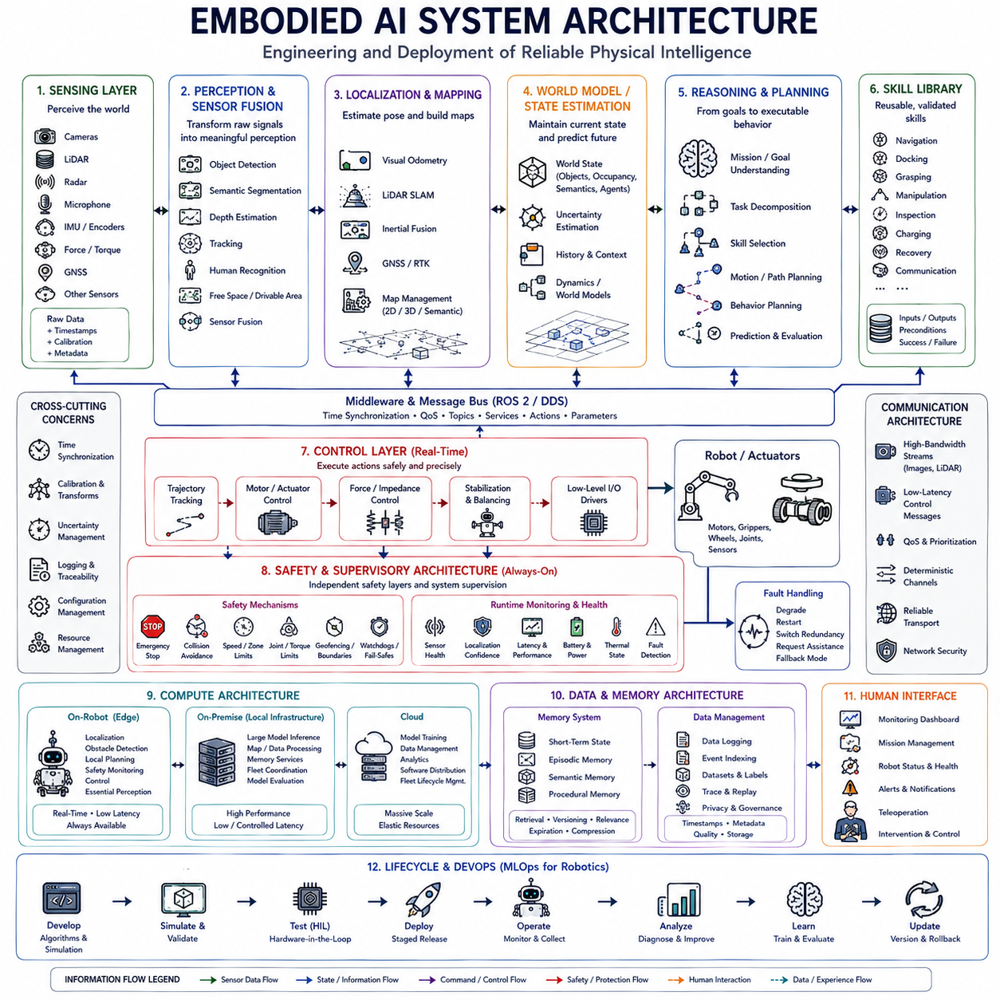
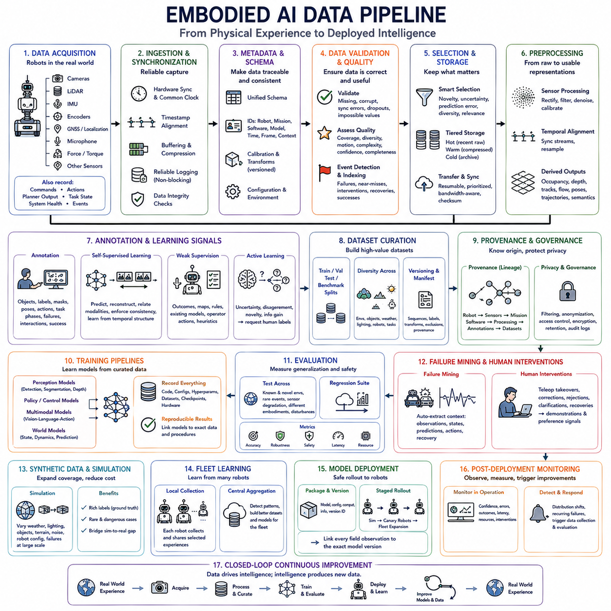
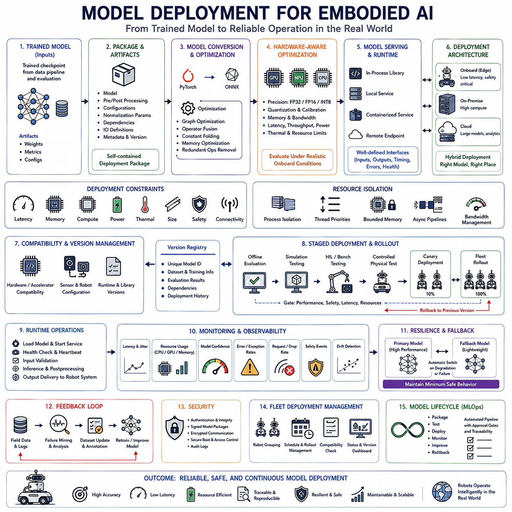
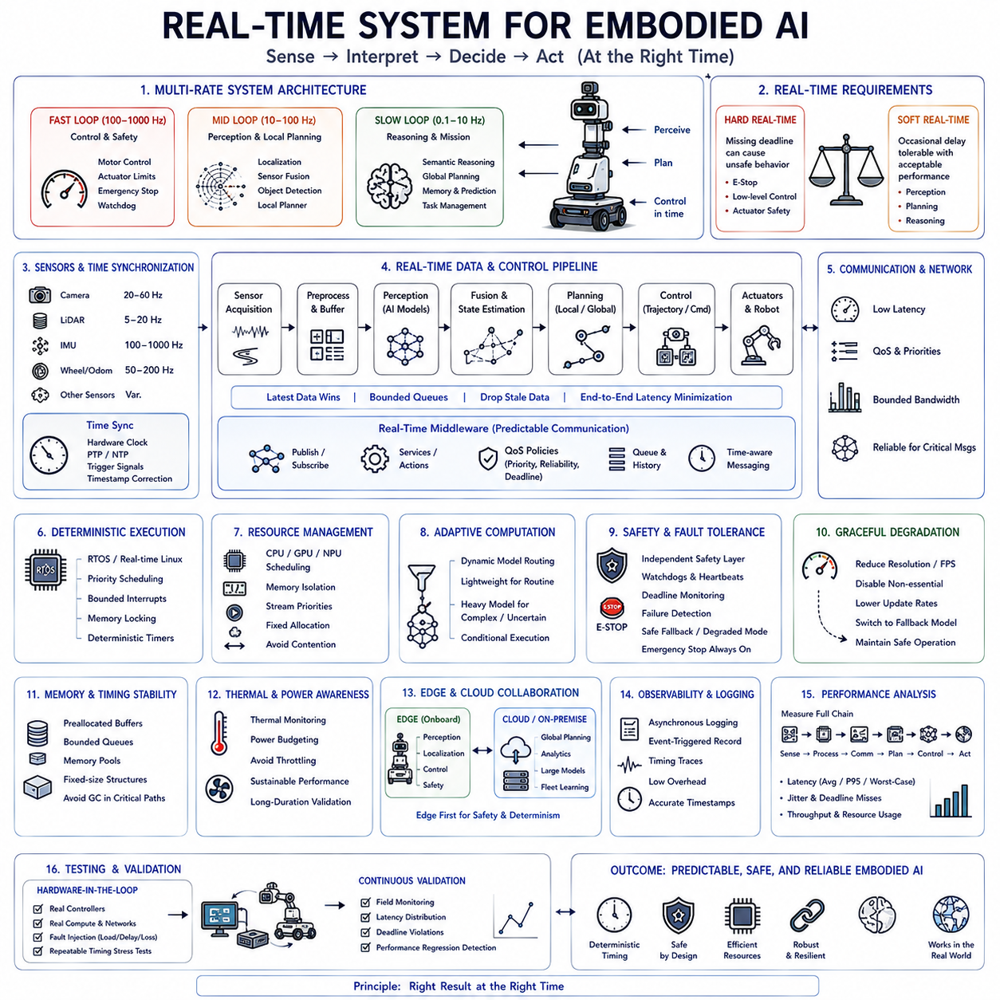
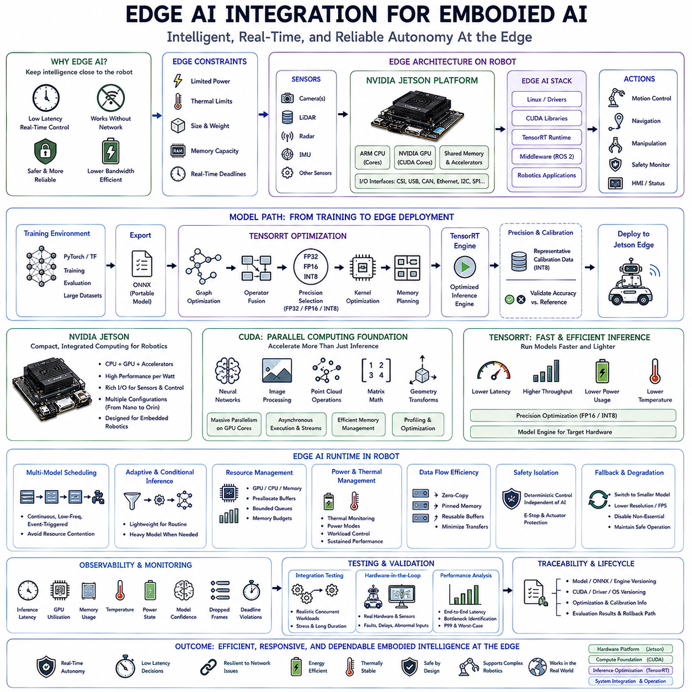
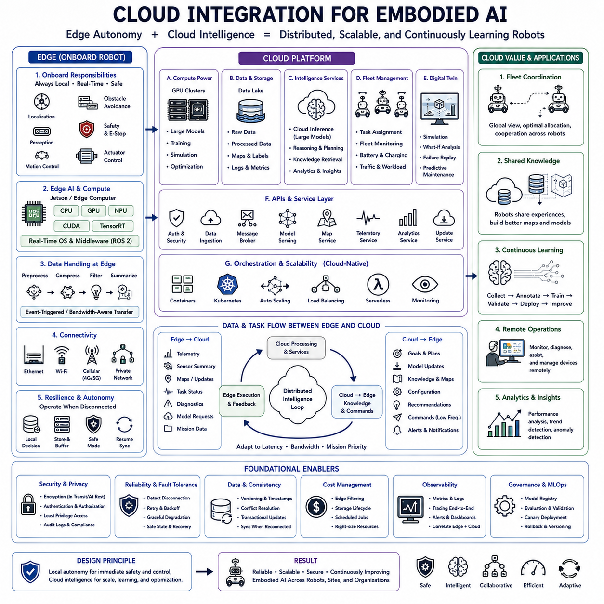
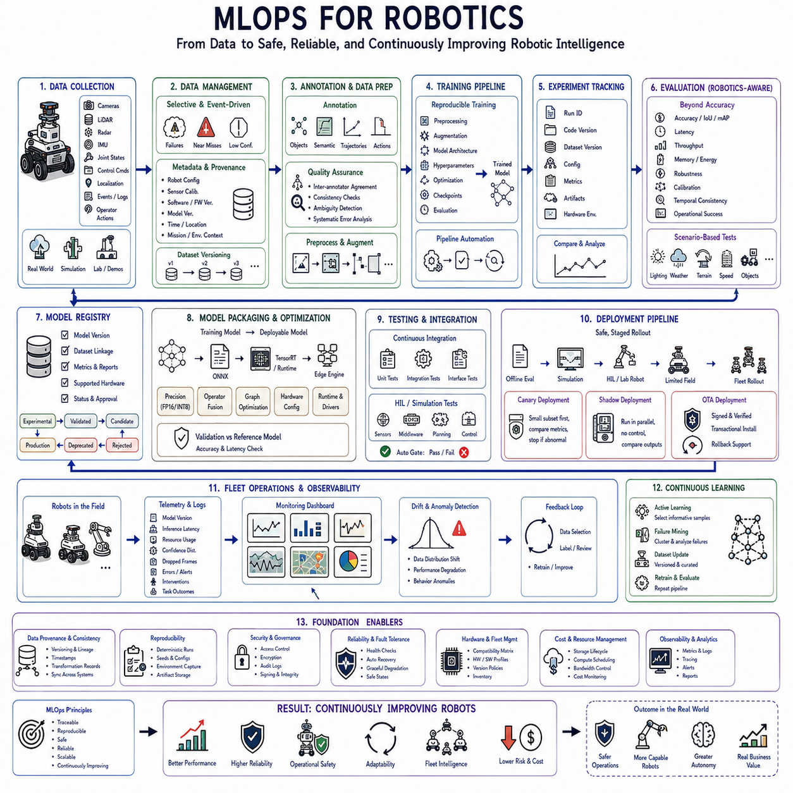

**Volume 45. Embodied AI and World Models**


# Chapter 08. Engineering and Deployment

##  

## 08.01. System Architecture

{width="7.268055555555556in" height="7.268055555555556in"}

Engineering and deployment of embodied AI require a system architecture that connects sensing, computation, intelligence, control, communication, safety, and lifecycle management into a coherent operational platform. Unlike isolated AI models, robotic systems interact continuously with physical environments where latency, uncertainty, hardware limitations, and failures directly affect behavior. Architecture therefore determines not only computational organization but also how intelligence becomes reliable physical action.

A practical architecture begins with clear separation of functional responsibilities. Sensors acquire information about the environment and robot state, perception modules transform raw signals into meaningful representations, world models maintain contextual state, planning determines intended behavior, and control systems convert decisions into actuator commands. Separating these functions into well-defined interfaces allows individual components to evolve without requiring complete redesign of the system.

The sensing layer provides the primary connection between physical reality and computational intelligence. Cameras, LiDAR, radar, microphones, force sensors, encoders, inertial sensors, GNSS, and other devices produce heterogeneous streams with different rates, resolutions, coordinate frames, and uncertainty characteristics. Sensor interfaces must normalize these differences while preserving timestamps, calibration parameters, confidence information, and metadata required by downstream processing.

Time synchronization becomes a fundamental architectural requirement when information from multiple sensors is fused. Measurements captured at different moments may incorrectly describe the same physical event if timing differences are ignored. Hardware timestamps, synchronized clocks, trigger mechanisms, and deterministic communication can establish temporal consistency. Accurate synchronization becomes especially important for fast motion, sensor fusion, localization, mapping, and closed-loop control.

The perception layer transforms synchronized sensor streams into representations useful for decision making. Neural networks and conventional algorithms may detect objects, estimate depth, segment terrain, track motion, determine free space, recognize humans, and estimate robot pose. Multimodal fusion combines complementary evidence so that weaknesses in one sensing modality can be compensated by information available from another modality when operating conditions change.

Localization and mapping establish the spatial reference required for navigation and interaction. Depending on the environment, systems may combine visual odometry, LiDAR SLAM, inertial measurements, wheel odometry, GNSS, RTK corrections, landmarks, or previously constructed maps. Architecture should support graceful transitions between localization sources because outdoor, indoor, underground, urban, and degraded environments may provide very different positioning conditions.

A world-state layer integrates perception into a persistent representation of the environment. Rather than forcing planning modules to interpret raw sensor data repeatedly, the system can maintain objects, geometry, occupancy, semantic regions, dynamic agents, task state, uncertainty, and relevant history. This representation forms an operational bridge between low-level sensing and higher-level reasoning, enabling different intelligence modules to share a consistent view of current conditions.

World models extend this state representation with predictive capability. Learned or engineered dynamics models can estimate how objects, humans, vehicles, terrain interactions, and the robot itself may evolve over time. Planning modules can evaluate candidate actions against predicted future states rather than responding only to the present observation. Prediction horizons may vary from fractions of a second for control to much longer intervals for strategic task planning.

The reasoning and planning layer converts goals into executable behavior. High-level reasoning interprets mission objectives and decomposes them into tasks, while task planners select skills and motion planners generate feasible trajectories. Foundation models or language models may assist semantic reasoning, but their outputs must be grounded in the robot\'s actual world state, available capabilities, and validated action interfaces before they influence physical execution.

Skill abstraction provides an important boundary between high-level intelligence and robotic control. Navigation, docking, grasping, inspection, manipulation, charging, recovery, and communication can be represented as reusable skills with defined inputs, outputs, preconditions, completion criteria, and failure states. High-level agents can then reason over validated skills rather than directly generating arbitrary actuator commands, improving modularity and operational safety.

The control layer executes physical behavior at substantially higher frequencies than semantic reasoning. Trajectory tracking, motor control, stabilization, force regulation, steering, and actuator coordination may require deterministic execution with millisecond-scale timing. These functions should remain operational even when high-level AI computation becomes delayed or temporarily unavailable. This separation prevents fluctuations in large-model inference from directly destabilizing physical control loops.

Hierarchical architecture accommodates these different computational timescales. Fast safety and control loops operate closest to hardware, intermediate layers handle perception, localization, prediction, and local planning, while slower layers perform semantic reasoning, mission planning, memory retrieval, and learning. Information moves between layers through explicit state and command interfaces, allowing asynchronous processes to cooperate without requiring the entire system to operate at one frequency.

Safety architecture must remain partially independent from learned intelligence. Emergency stopping, collision limits, speed restrictions, actuator constraints, geofencing, workspace boundaries, watchdogs, and other protections should continue functioning even if perception or reasoning components fail. Learned models can provide additional safety information, but critical protections require deterministic fallback mechanisms capable of placing the robot into a known safe state.

Runtime monitoring provides another layer of operational protection. Health monitors can track sensor availability, inference latency, localization confidence, communication quality, battery condition, thermal state, actuator faults, and software process status. When abnormalities occur, supervisory logic can degrade functionality, restart components, switch redundant resources, reduce operating speed, request human assistance, or transition the system into a predefined fallback mode.

Fault containment is important because complex embodied systems inevitably experience component failures. A perception model crash should not necessarily terminate motor safety functions, and loss of external communication should not disable local obstacle avoidance. Process isolation, service boundaries, redundancy, watchdog mechanisms, and explicit failure states prevent local faults from propagating uncontrollably across the entire robotic system.

Communication architecture connects distributed sensors, controllers, compute modules, robots, and external infrastructure. Internal networks may carry high-bandwidth camera and LiDAR streams alongside latency-sensitive control messages. Quality-of-service mechanisms, bandwidth allocation, message prioritization, and deterministic channels can prevent large data transfers from interfering with critical control traffic. Network architecture therefore becomes part of real-time system design rather than merely connectivity infrastructure.

Edge computing places time-critical intelligence directly on the robot. Localization, obstacle detection, essential perception, local planning, safety monitoring, and control generally require local execution because communication cannot always be guaranteed. Onboard processing also improves privacy and reduces dependence on external infrastructure. The architecture must therefore preserve a minimum autonomous capability even when cloud or remote computing resources become unavailable.

On-premise infrastructure can complement onboard computation for workloads requiring greater resources but controlled latency and data governance. Large world-model inference, fleet coordination, map processing, memory services, model evaluation, and data aggregation can operate on local servers when appropriate. This creates an intermediate computational layer between resource-constrained robots and remote cloud infrastructure, particularly useful in factories, warehouses, campuses, and secured facilities.

Cloud infrastructure remains useful for large-scale training, dataset management, analytics, software distribution, and fleet-wide model lifecycle management. However, physical operation should not assume continuous cloud availability when loss of connectivity could create unsafe behavior. A robust architecture distinguishes functions that require real-time local execution from functions that can tolerate delayed or intermittent access to external computational resources.

Dynamic computation can improve efficiency by activating expensive AI capabilities only when required. Routine operation in predictable environments may use lightweight perception and planning, while uncertainty, novel events, difficult terrain, or complex human interaction can trigger more powerful models. Conditional computation, model routing, caching, sparse activation, and event-driven processing allow computational effort to scale according to operational complexity.

Memory architecture provides continuity beyond immediate sensor observations. Short-term state stores recent events required for current tasks, episodic memory preserves important operational experiences, semantic memory maintains reusable knowledge, and procedural memory represents skills and policies. Memory services should include retrieval, versioning, relevance management, and expiration mechanisms so that accumulated information improves behavior without overwhelming computational resources or introducing obsolete context.

Data architecture connects robot operation with learning and engineering workflows. Sensor streams, commands, predictions, decisions, failures, interventions, and performance metrics can be logged with synchronized timestamps and system configuration information. High-value events should be identifiable for later analysis and training. Traceable data makes it possible to reconstruct why behavior occurred and to connect field failures with specific models, software versions, sensor states, and environmental conditions.

Model lifecycle management becomes essential when learned components are updated after deployment. Each model should have identifiable versions, training provenance, evaluation results, hardware compatibility, and deployment status. Candidate models can move through offline testing, simulation, hardware-in-the-loop validation, limited deployment, and fleet release. Rollback mechanisms allow previous validated versions to be restored when unexpected regressions appear during real-world operation.

Simulation and digital twins provide a parallel environment for architecture validation. Software components can be tested against simulated sensors, robots, networks, and environmental conditions before deployment to physical hardware. Hardware-in-the-loop testing can introduce real controllers or compute modules into simulated scenarios. This reduces the cost of detecting integration problems and enables repeatable testing of hazardous or rare conditions that are difficult to reproduce physically.

Observability is critical because distributed robotic systems can fail in ways that are difficult to reproduce. Logs, metrics, traces, recorded sensor data, system events, resource utilization, and model outputs should be correlated through synchronized time. Engineers must be able to reconstruct the sequence from observation through perception, reasoning, planning, and action. Effective observability transforms unexplained field failures into diagnosable engineering problems.

Cybersecurity must be integrated into the architecture because embodied systems connect computation directly to physical actuators. Authentication, authorization, secure communication, software signing, network segmentation, protected credentials, and controlled update mechanisms reduce the risk of unauthorized access. Security boundaries should also limit the privileges of individual software components so that compromise of one service does not automatically provide unrestricted control of the robot.

Deployment architecture must account for heterogeneous hardware and operating environments. Different robots may use different sensors, compute accelerators, actuator configurations, or network interfaces while sharing common intelligence components. Hardware abstraction layers and standardized capability interfaces separate platform-specific implementation from reusable software, allowing common perception, planning, memory, and fleet services to operate across multiple embodiments.

Configuration management becomes increasingly important as the number of deployed systems grows. Sensor calibration, robot dimensions, safety limits, model versions, network settings, mission parameters, and feature flags must remain traceable. Configuration should be treated as versioned engineering data rather than manually modified operational detail, because seemingly small differences between robots can produce significant differences in physical behavior.

Fleet architecture extends deployment from individual robots to coordinated populations. Central services may distribute missions, collect telemetry, manage software versions, aggregate experience, and monitor operational health. Robots should nevertheless retain sufficient local autonomy to continue safe operation during network disruption. Fleet-level intelligence therefore combines shared information and centralized management with decentralized execution and fault tolerance.

Human interfaces provide supervisory access to this architecture. Operators require visibility into robot state, mission progress, faults, uncertainty, and intervention requests without being overwhelmed by internal implementation details. Interfaces should support different levels of authority, ranging from monitoring and mission assignment to teleoperation and emergency control. Human intervention should enter through clearly defined channels that preserve traceability and safety constraints.

Engineering validation must evaluate interactions among components rather than only individual algorithm accuracy. A highly accurate perception model may still be unsuitable if its latency disrupts planning, while a strong planner may fail when localization uncertainty is ignored. System-level testing should therefore measure end-to-end latency, task success, recovery, resource consumption, network degradation, sensor failure, thermal conditions, and safety behavior under realistic operating scenarios.

A mature embodied AI architecture is ultimately a lifecycle architecture rather than merely a runtime block diagram. Development, simulation, deployment, monitoring, data collection, diagnosis, learning, validation, updating, and rollback form a continuous engineering loop. Every operational experience can contribute evidence for improvement, while architectural boundaries ensure that changes are evaluated before they influence safety-critical physical behavior.

The purpose of system architecture is therefore to transform diverse AI and robotic technologies into dependable embodied intelligence. Perception, world models, foundation models, memory, planning, control, safety, communication, compute infrastructure, and human supervision must operate as coordinated layers rather than disconnected capabilities. A well-designed architecture allows these components to evolve independently while preserving predictable interfaces and reliable end-to-end behavior.

As embodied AI progresses toward persistent, multimodal, predictive, and self-improving agents, architecture will increasingly determine whether advanced models can survive the transition from demonstrations to continuous deployment. Successful systems will combine flexible intelligence with deterministic control, distributed computation with local autonomy, learning with validation, and adaptation with safety, creating robotic platforms capable of reliable operation throughout long and changing real-world missions.

체화 인공지능(Embodied AI)의 엔지니어링과 배포(Engineering and Deployment)에는 센싱(Sensing), 컴퓨팅(Computation), 지능(Intelligence), 제어(Control), 통신(Communication), 안전(Safety), 생명주기 관리(Lifecycle Management)를 하나의 일관된 운영 플랫폼(Operational Platform)으로 연결하는 시스템 아키텍처(System Architecture)가 필요합니다. 독립적인 인공지능 모델과 달리 로봇 시스템은 지연시간(Latency), 불확실성(Uncertainty), 하드웨어 한계, 고장이 행동에 직접적인 영향을 미치는 물리적 환경과 지속적으로 상호작용합니다. 따라서 아키텍처는 계산 구조뿐 아니라 지능이 어떻게 신뢰할 수 있는 물리적 행동으로 전환되는지를 결정합니다.

실용적인 아키텍처는 기능적 책임(Functional Responsibilities)을 명확하게 분리하는 것에서 시작합니다. 센서는 환경과 로봇 상태에 대한 정보를 획득하고, 인식 모듈(Perception Modules)은 원시 신호를 의미 있는 표현으로 변환하며, 월드 모델(World Models)은 문맥적 상태(Contextual State)를 유지하고, 계획(Planning)은 의도된 행동을 결정하며, 제어 시스템은 의사결정을 액추에이터 명령(Actuator Commands)으로 변환합니다. 이러한 기능을 명확한 인터페이스로 분리하면 전체 시스템을 재설계하지 않고도 개별 구성요소를 발전시킬 수 있습니다.

센싱 계층(Sensing Layer)은 물리적 현실과 계산 지능 사이의 기본적인 연결을 제공합니다. 카메라, 라이다(LiDAR), 레이더(Radar), 마이크, 힘 센서(Force Sensors), 엔코더(Encoders), 관성 센서(Inertial Sensors), 위성항법시스템(GNSS) 등의 장치는 서로 다른 주기, 해상도, 좌표계(Coordinate Frames), 불확실성 특성을 가진 이질적인 데이터 스트림을 생성합니다. 센서 인터페이스는 이러한 차이를 정규화하면서 후속 처리에 필요한 타임스탬프(Timestamps), 캘리브레이션 파라미터(Calibration Parameters), 신뢰도 정보, 메타데이터(Metadata)를 보존해야 합니다.

여러 센서의 정보를 융합할 때 시간 동기화(Time Synchronization)는 기본적인 아키텍처 요구사항이 됩니다. 서로 다른 시점에 획득된 측정값의 시간 차이를 무시하면 동일한 물리적 사건을 잘못 표현할 수 있습니다. 하드웨어 타임스탬프(Hardware Timestamps), 동기화된 클럭(Synchronized Clocks), 트리거 메커니즘(Trigger Mechanisms), 결정론적 통신(Deterministic Communication)을 통해 시간적 일관성(Temporal Consistency)을 확보할 수 있습니다. 정확한 동기화는 빠른 움직임, 센서 융합, 위치추정(Localization), 매핑(Mapping), 폐루프 제어(Closed-Loop Control)에서 특히 중요합니다.

인식 계층(Perception Layer)은 동기화된 센서 스트림을 의사결정에 유용한 표현으로 변환합니다. 신경망(Neural Networks)과 기존 알고리즘은 객체를 탐지하고, 깊이를 추정하며, 지형을 분할하고, 움직임을 추적하며, 자유 공간(Free Space)을 판단하고, 인간을 인식하며, 로봇 자세(Pose)를 추정할 수 있습니다. 멀티모달 융합(Multimodal Fusion)은 상호 보완적인 증거를 결합하여 운용 조건이 변화할 때 하나의 센싱 모달리티가 가진 약점을 다른 모달리티의 정보로 보완할 수 있도록 합니다.

위치추정과 매핑(Localization and Mapping)은 내비게이션과 상호작용에 필요한 공간적 기준(Spatial Reference)을 설정합니다. 환경에 따라 시스템은 비주얼 오도메트리(Visual Odometry), 라이다 슬램(LiDAR SLAM), 관성 측정(Inertial Measurements), 휠 오도메트리(Wheel Odometry), 위성항법시스템, 실시간 이동측위 보정(RTK Corrections), 랜드마크(Landmarks), 사전 구축 지도 등을 결합할 수 있습니다. 실외, 실내, 지하, 도심, 신호 열화 환경은 매우 다른 위치추정 조건을 제공할 수 있으므로 아키텍처는 위치추정 소스 사이의 안정적인 전환을 지원해야 합니다.

세계 상태 계층(World-State Layer)은 인식 결과를 환경에 대한 지속적인 표현(Persistent Representation)으로 통합합니다. 계획 모듈이 원시 센서 데이터를 반복적으로 해석하도록 하는 대신 시스템은 객체, 기하학적 구조(Geometry), 점유 상태(Occupancy), 의미 영역(Semantic Regions), 동적 에이전트(Dynamic Agents), 작업 상태, 불확실성, 관련 이력을 유지할 수 있습니다. 이러한 표현은 저수준 센싱과 고수준 추론 사이의 운영적 연결을 형성하여 여러 지능 모듈이 현재 조건에 대한 일관된 관점을 공유하도록 합니다.

월드 모델은 이러한 상태 표현에 예측 능력(Predictive Capability)을 추가합니다. 학습 기반 또는 공학적으로 설계된 동역학 모델(Dynamics Models)은 객체, 인간, 차량, 지형 상호작용, 로봇 자체가 시간에 따라 어떻게 변화할지를 추정할 수 있습니다. 계획 모듈은 현재 관측에만 반응하는 대신 예측된 미래 상태를 기반으로 후보 행동(Candidate Actions)을 평가할 수 있습니다. 예측 시간 범위(Prediction Horizons)는 제어를 위한 수분의 1초 수준에서 전략적 작업 계획을 위한 훨씬 긴 시간 범위까지 다양할 수 있습니다.

추론 및 계획 계층(Reasoning and Planning Layer)은 목표를 실행 가능한 행동으로 변환합니다. 고수준 추론은 임무 목표(Mission Objectives)를 해석하여 작업으로 분해하고, 작업 계획기(Task Planners)는 기술(Skills)을 선택하며, 동작 계획기(Motion Planners)는 실행 가능한 궤적을 생성합니다. 파운데이션 모델(Foundation Models)이나 언어 모델(Language Models)이 의미적 추론을 지원할 수 있지만, 그 출력이 물리적 실행에 영향을 미치기 전에 실제 세계 상태, 사용 가능한 능력, 검증된 행동 인터페이스(Validated Action Interfaces)에 그라운딩되어야 합니다.

기술 추상화(Skill Abstraction)는 고수준 지능과 로봇 제어 사이에 중요한 경계를 제공합니다. 내비게이션, 도킹(Docking), 파지(Grasping), 검사, 조작, 충전, 복구, 통신은 정의된 입력, 출력, 사전조건(Preconditions), 완료 기준(Completion Criteria), 실패 상태(Failure States)를 가진 재사용 가능한 기술로 표현할 수 있습니다. 이를 통해 고수준 에이전트는 임의의 액추에이터 명령을 직접 생성하는 대신 검증된 기술을 기반으로 추론할 수 있으며, 모듈성과 운영 안전성을 향상시킬 수 있습니다.

제어 계층(Control Layer)은 의미적 추론보다 훨씬 높은 주파수에서 물리적 행동을 실행합니다. 궤적 추종(Trajectory Tracking), 모터 제어, 안정화(Stabilization), 힘 조절(Force Regulation), 조향(Steering), 액추에이터 협조 제어는 밀리초 단위의 결정론적 실행(Deterministic Execution)을 요구할 수 있습니다. 이러한 기능은 고수준 인공지능 계산이 지연되거나 일시적으로 사용할 수 없는 상황에서도 계속 동작해야 합니다. 이러한 분리는 대규모 모델 추론의 변동이 물리적 제어 루프를 직접 불안정하게 만드는 것을 방지합니다.

계층적 아키텍처(Hierarchical Architecture)는 서로 다른 계산 시간 척도를 수용합니다. 빠른 안전 및 제어 루프는 하드웨어에 가장 가까운 위치에서 동작하고, 중간 계층은 인식, 위치추정, 예측, 로컬 계획(Local Planning)을 처리하며, 느린 계층은 의미적 추론, 임무 계획, 기억 검색(Memory Retrieval), 학습을 수행합니다. 정보는 명시적인 상태 및 명령 인터페이스를 통해 계층 사이에서 이동하여 전체 시스템이 하나의 주파수로 동작하지 않아도 비동기 프로세스(Asynchronous Processes)가 협력할 수 있도록 합니다.

안전 아키텍처(Safety Architecture)는 학습된 지능으로부터 부분적으로 독립되어야 합니다. 비상 정지(Emergency Stopping), 충돌 제한(Collision Limits), 속도 제한, 액추에이터 제약조건, 지오펜싱(Geofencing), 작업 공간 경계, 워치독(Watchdogs), 기타 보호 기능은 인식이나 추론 구성요소가 실패하더라도 계속 작동해야 합니다. 학습된 모델이 추가적인 안전 정보를 제공할 수 있지만 핵심 보호 기능에는 로봇을 알려진 안전 상태(Known Safe State)로 전환할 수 있는 결정론적 폴백 메커니즘(Deterministic Fallback Mechanisms)이 필요합니다.

런타임 모니터링(Runtime Monitoring)은 또 다른 운영 보호 계층을 제공합니다. 상태 모니터(Health Monitors)는 센서 가용성, 추론 지연시간, 위치추정 신뢰도, 통신 품질, 배터리 상태, 열 상태(Thermal State), 액추에이터 고장, 소프트웨어 프로세스 상태를 추적할 수 있습니다. 이상이 발생하면 감독 로직(Supervisory Logic)은 기능을 제한하고, 구성요소를 재시작하고, 중복 자원으로 전환하며, 운행 속도를 낮추거나, 인간의 지원을 요청하거나, 시스템을 사전에 정의된 폴백 모드(Fallback Mode)로 전환할 수 있습니다.

복잡한 체화 시스템에서는 구성요소 고장이 불가피하기 때문에 고장 격리(Fault Containment)가 중요합니다. 인식 모델의 충돌이나 종료가 반드시 모터 안전 기능의 중단으로 이어져서는 안 되며, 외부 통신이 손실되더라도 로컬 장애물 회피(Local Obstacle Avoidance)는 계속 동작해야 합니다. 프로세스 격리(Process Isolation), 서비스 경계(Service Boundaries), 중복성(Redundancy), 워치독 메커니즘, 명시적인 실패 상태를 통해 국지적인 고장이 전체 로봇 시스템으로 통제되지 않은 상태로 전파되는 것을 방지할 수 있습니다.

통신 아키텍처(Communication Architecture)는 분산된 센서, 제어기, 컴퓨팅 모듈, 로봇, 외부 인프라를 연결합니다. 내부 네트워크에서는 높은 대역폭의 카메라 및 라이다 스트림과 지연시간에 민감한 제어 메시지가 동시에 전달될 수 있습니다. 서비스 품질(Quality of Service), 대역폭 할당(Bandwidth Allocation), 메시지 우선순위화(Message Prioritization), 결정론적 채널을 사용하면 대규모 데이터 전송이 핵심 제어 트래픽을 방해하는 것을 방지할 수 있습니다. 따라서 네트워크 아키텍처는 단순한 연결 인프라가 아니라 실시간 시스템 설계의 일부가 됩니다.

엣지 컴퓨팅(Edge Computing)은 시간적으로 중요한 지능을 로봇에 직접 배치합니다. 위치추정, 장애물 탐지, 핵심 인식, 로컬 계획, 안전 모니터링, 제어는 통신을 항상 보장할 수 없기 때문에 일반적으로 로컬에서 실행되어야 합니다. 온보드 처리(Onboard Processing)는 개인정보 보호를 향상시키고 외부 인프라에 대한 의존성도 감소시킵니다. 따라서 아키텍처는 클라우드나 원격 컴퓨팅 자원을 사용할 수 없는 상황에서도 최소한의 자율 능력(Minimum Autonomous Capability)을 유지해야 합니다.

온프레미스 인프라(On-Premise Infrastructure)는 더 많은 계산 자원을 필요로 하지만 통제된 지연시간과 데이터 거버넌스가 요구되는 작업에서 온보드 계산을 보완할 수 있습니다. 대규모 월드 모델 추론, 플릿 조정(Fleet Coordination), 지도 처리, 기억 서비스, 모델 평가, 데이터 집계 등을 필요에 따라 로컬 서버에서 수행할 수 있습니다. 이는 특히 공장, 창고, 캠퍼스, 보안 시설에서 자원이 제한된 로봇과 원격 클라우드 인프라 사이에 중간 계산 계층을 형성합니다.

클라우드 인프라(Cloud Infrastructure)는 대규모 학습, 데이터셋 관리, 분석(Analytics), 소프트웨어 배포, 플릿 전체의 모델 생명주기 관리(Model Lifecycle Management)에 유용합니다. 그러나 연결 손실이 안전하지 않은 행동으로 이어질 수 있다면 물리적 운용이 지속적인 클라우드 연결을 전제로 해서는 안 됩니다. 강건한 아키텍처는 실시간 로컬 실행이 필요한 기능과 외부 계산 자원에 대한 지연되거나 간헐적인 접근을 허용할 수 있는 기능을 명확하게 구분합니다.

동적 계산(Dynamic Computation)은 필요한 경우에만 비용이 높은 인공지능 기능을 활성화하여 효율성을 향상시킬 수 있습니다. 예측 가능한 환경의 일상적인 운용에서는 경량 인식과 계획을 사용하고, 불확실성, 새로운 사건, 어려운 지형, 복잡한 인간 상호작용이 발생하면 더욱 강력한 모델을 활성화할 수 있습니다. 조건부 계산(Conditional Computation), 모델 라우팅(Model Routing), 캐싱(Caching), 희소 활성화(Sparse Activation), 이벤트 기반 처리(Event-Driven Processing)를 통해 운영 복잡도에 따라 계산량을 조절할 수 있습니다.

기억 아키텍처(Memory Architecture)는 즉각적인 센서 관측을 넘어 연속성을 제공합니다. 단기 상태(Short-Term State)는 현재 작업에 필요한 최근 사건을 저장하고, 일화 기억(Episodic Memory)은 중요한 운영 경험을 보존하며, 의미 기억(Semantic Memory)은 재사용 가능한 지식을 유지하고, 절차 기억(Procedural Memory)은 기술과 정책을 표현합니다. 기억 서비스에는 검색(Retrieval), 버전 관리(Versioning), 관련성 관리(Relevance Management), 만료 메커니즘(Expiration Mechanisms)이 포함되어야 하며, 이를 통해 축적된 정보가 계산 자원을 압도하거나 오래된 문맥을 유입시키지 않으면서 행동을 개선할 수 있습니다.

데이터 아키텍처(Data Architecture)는 로봇 운영과 학습 및 엔지니어링 워크플로(Engineering Workflows)를 연결합니다. 센서 스트림, 명령, 예측, 의사결정, 실패, 인간 개입, 성능 지표는 동기화된 타임스탬프와 시스템 구성 정보(System Configuration Information)와 함께 기록할 수 있습니다. 가치가 높은 사건은 이후 분석과 학습을 위해 식별할 수 있어야 합니다. 추적 가능한 데이터(Traceable Data)를 통해 특정 행동이 발생한 이유를 재구성하고 현장 고장을 특정 모델, 소프트웨어 버전, 센서 상태, 환경 조건과 연결할 수 있습니다.

학습된 구성요소가 배포 이후 업데이트되면서 모델 생명주기 관리(Model Lifecycle Management)는 필수적인 요소가 됩니다. 각 모델은 식별 가능한 버전, 학습 출처(Training Provenance), 평가 결과, 하드웨어 호환성, 배포 상태를 가져야 합니다. 후보 모델은 오프라인 시험, 시뮬레이션, 하드웨어 인 더 루프 검증(Hardware-in-the-Loop Validation), 제한적 배포(Limited Deployment), 플릿 배포(Fleet Release)의 단계를 거칠 수 있습니다. 실제 환경에서 예상하지 못한 성능 저하가 발견되면 롤백 메커니즘(Rollback Mechanisms)을 통해 이전의 검증된 버전을 복원할 수 있습니다.

시뮬레이션(Simulation)과 디지털 트윈(Digital Twins)은 아키텍처 검증을 위한 병렬 환경을 제공합니다. 소프트웨어 구성요소는 실제 하드웨어에 배포하기 전에 시뮬레이션된 센서, 로봇, 네트워크, 환경 조건을 대상으로 시험할 수 있습니다. 하드웨어 인 더 루프 시험(Hardware-in-the-Loop Testing)은 실제 제어기나 컴퓨팅 모듈을 시뮬레이션 시나리오에 포함할 수 있습니다. 이를 통해 통합 문제를 발견하는 비용을 줄이고 물리적으로 재현하기 어려운 위험하거나 희귀한 조건을 반복적으로 시험할 수 있습니다.

관측 가능성(Observability)은 분산 로봇 시스템에서 발생한 고장을 재현하기 어려울 수 있기 때문에 중요합니다. 로그(Logs), 메트릭(Metrics), 추적 정보(Traces), 기록된 센서 데이터, 시스템 이벤트, 자원 사용량, 모델 출력은 동기화된 시간을 기준으로 서로 연관되어야 합니다. 엔지니어는 관측에서 시작하여 인식, 추론, 계획, 행동으로 이어지는 전체 시퀀스를 재구성할 수 있어야 합니다. 효과적인 관측 가능성은 설명하기 어려운 현장 고장을 진단 가능한 엔지니어링 문제로 전환합니다.

체화 시스템은 계산 시스템을 물리적 액추에이터와 직접 연결하기 때문에 사이버보안(Cybersecurity)이 아키텍처에 통합되어야 합니다. 인증(Authentication), 권한 부여(Authorization), 보안 통신(Secure Communication), 소프트웨어 서명(Software Signing), 네트워크 분할(Network Segmentation), 자격증명 보호(Protected Credentials), 통제된 업데이트 메커니즘을 통해 비인가 접근의 위험을 줄일 수 있습니다. 보안 경계(Security Boundaries)는 개별 소프트웨어 구성요소의 권한도 제한하여 하나의 서비스가 침해되더라도 로봇 전체에 대한 무제한 제어 권한을 획득하지 못하도록 해야 합니다.

배포 아키텍처(Deployment Architecture)는 이기종 하드웨어(Heterogeneous Hardware)와 다양한 운영 환경을 고려해야 합니다. 서로 다른 로봇은 공통 지능 구성요소를 공유하면서도 서로 다른 센서, 컴퓨팅 가속기(Compute Accelerators), 액추에이터 구성, 네트워크 인터페이스를 사용할 수 있습니다. 하드웨어 추상화 계층(Hardware Abstraction Layers)과 표준화된 능력 인터페이스(Standardized Capability Interfaces)는 플랫폼별 구현을 재사용 가능한 소프트웨어로부터 분리하여 공통 인식, 계획, 기억, 플릿 서비스가 여러 체화 형태에서 동작할 수 있도록 합니다.

배포되는 시스템의 수가 증가하면서 구성 관리(Configuration Management)는 점점 중요해집니다. 센서 캘리브레이션, 로봇 치수, 안전 한계, 모델 버전, 네트워크 설정, 임무 파라미터, 기능 플래그(Feature Flags)는 모두 추적 가능해야 합니다. 로봇 사이의 작은 차이도 물리적 행동에서 상당한 차이를 발생시킬 수 있으므로 구성 정보는 수동으로 변경하는 단순 운영 정보가 아니라 버전 관리되는 엔지니어링 데이터(Versioned Engineering Data)로 취급되어야 합니다.

플릿 아키텍처(Fleet Architecture)는 개별 로봇의 배포를 서로 조정되는 로봇 집단으로 확장합니다. 중앙 서비스는 임무를 배포하고, 텔레메트리(Telemetry)를 수집하며, 소프트웨어 버전을 관리하고, 경험을 집계하며, 운영 상태를 모니터링할 수 있습니다. 그러나 네트워크 장애가 발생한 상황에서도 로봇은 안전하게 운용할 수 있는 충분한 로컬 자율성(Local Autonomy)을 유지해야 합니다. 따라서 플릿 수준 지능은 공유 정보와 중앙집중식 관리를 분산 실행(Decentralized Execution) 및 내결함성(Fault Tolerance)과 결합합니다.

인간 인터페이스(Human Interfaces)는 이러한 아키텍처에 대한 감독 접근(Supervisory Access)을 제공합니다. 운영자는 내부 구현 세부사항에 압도되지 않으면서 로봇 상태, 임무 진행 상황, 고장, 불확실성, 개입 요청을 파악할 수 있어야 합니다. 인터페이스는 모니터링과 임무 할당에서부터 원격조작(Teleoperation)과 비상 제어(Emergency Control)에 이르기까지 서로 다른 수준의 권한을 지원해야 합니다. 인간의 개입은 추적 가능성과 안전 제약조건을 유지하는 명확하게 정의된 채널을 통해 이루어져야 합니다.

엔지니어링 검증(Engineering Validation)은 개별 알고리즘의 정확도뿐 아니라 구성요소 사이의 상호작용을 평가해야 합니다. 매우 정확한 인식 모델이라도 지연시간 때문에 계획을 방해한다면 적합하지 않을 수 있으며, 뛰어난 계획기도 위치추정의 불확실성을 무시하면 실패할 수 있습니다. 따라서 시스템 수준 시험(System-Level Testing)은 현실적인 운영 시나리오에서 종단 간 지연시간(End-to-End Latency), 작업 성공률, 복구, 자원 소비, 네트워크 열화(Network Degradation), 센서 고장, 열 조건, 안전 행동을 측정해야 합니다.

성숙한 체화 인공지능 아키텍처는 궁극적으로 단순한 런타임 블록 다이어그램(Runtime Block Diagram)이 아니라 생명주기 아키텍처(Lifecycle Architecture)입니다. 개발, 시뮬레이션, 배포, 모니터링, 데이터 수집, 진단, 학습, 검증, 업데이트, 롤백이 하나의 지속적인 엔지니어링 루프(Continuous Engineering Loop)를 형성합니다. 모든 운영 경험은 개선을 위한 증거로 활용될 수 있으며, 아키텍처의 경계는 변경 사항이 안전 필수 물리적 행동에 영향을 미치기 전에 평가되도록 보장합니다.

따라서 시스템 아키텍처의 목적은 다양한 인공지능 및 로봇 기술을 신뢰할 수 있는 체화 지능(Dependable Embodied Intelligence)으로 변환하는 것입니다. 인식, 월드 모델, 파운데이션 모델, 기억, 계획, 제어, 안전, 통신, 컴퓨팅 인프라, 인간 감독(Human Supervision)은 서로 분리된 기능이 아니라 조정된 계층으로 동작해야 합니다. 잘 설계된 아키텍처는 예측 가능한 인터페이스와 신뢰성 있는 종단 간 행동을 유지하면서 각 구성요소가 독립적으로 발전할 수 있도록 합니다.

체화 인공지능이 지속적이고(Persistent), 멀티모달이며(Multimodal), 예측적이고(Predictive), 자기 개선이 가능한(Self-Improving) 에이전트로 발전함에 따라 아키텍처는 고도화된 모델이 단순한 시연에서 지속적인 실제 배포로 전환될 수 있는지를 결정하는 핵심 요소가 될 것입니다. 성공적인 시스템은 유연한 지능(Flexible Intelligence)과 결정론적 제어(Deterministic Control), 분산 컴퓨팅(Distributed Computation)과 로컬 자율성, 학습과 검증, 적응과 안전을 결합하여 장기간 변화하는 실제 환경의 임무에서 신뢰성 있게 동작할 수 있는 로봇 플랫폼을 구현하게 될 것입니다.

##  

## 08.02. Data Pipeline [w/Code]

{width="7.268055555555556in" height="7.268055555555556in"}

A data pipeline for embodied AI connects physical experience with perception, learning, evaluation, and deployment. Unlike conventional machine-learning pipelines that primarily process static datasets, robotic pipelines continuously receive observations from operating systems in the real world. Sensor measurements, robot states, commands, actions, predictions, failures, interventions, and outcomes must therefore be transformed into synchronized, traceable, and reusable data.

The pipeline begins at the data acquisition layer, where heterogeneous sensors and software components generate information at different frequencies. Cameras may produce high-bandwidth image streams, LiDAR provides geometric measurements, IMUs generate high-rate motion signals, encoders report actuator states, and GNSS or localization systems provide position estimates. Control commands, planner outputs, task states, and system-health information must be recorded alongside these observations.

Accurate timestamps are essential because robotic data represents events unfolding through time. If camera frames, LiDAR scans, inertial measurements, actuator commands, and robot poses cannot be aligned correctly, reconstructed interactions may contain physically inconsistent relationships. Hardware synchronization, common clocks, trigger systems, and timestamp validation therefore become fundamental parts of the data pipeline rather than optional preprocessing operations.

Calibration information must accompany sensor data because measurements are meaningful only when their spatial relationships are known. Camera intrinsics, sensor extrinsics, coordinate transforms, robot geometry, wheel parameters, and other calibration values should be versioned with recorded datasets. When calibration changes, the pipeline must preserve which configuration produced each sequence so that historical data can be interpreted and reproduced correctly.

Raw data ingestion transfers information from robot processes into temporary or persistent storage without disrupting real-time operation. High-bandwidth streams require buffering, asynchronous writing, compression, and bandwidth management. The logging system should avoid competing with safety-critical control for computation or network resources. Data loss, queue overflow, and delayed writes should be detectable so that incomplete recordings are not mistaken for valid datasets.

A unified data schema provides consistency across sensors, robots, environments, and experiments. Each observation should be associated with identifiers describing the robot, mission, software version, model version, timestamp, coordinate frame, and relevant operating context. Standardized schemas make it easier to combine experiences collected from different platforms and prevent downstream tools from depending on undocumented assumptions about individual log formats.

Data validation begins as early as possible in the pipeline. Automated checks can identify missing frames, corrupted messages, invalid timestamps, sensor dropouts, impossible values, synchronization errors, or inconsistent coordinate transforms. Detecting these problems before expensive training or annotation prevents low-quality data from silently propagating through later stages and makes field-data collection more reliable.

Quality assessment extends validation by determining whether technically valid data is actually useful. A sequence may contain no corrupted messages yet still provide little learning value because the environment is repetitive, visibility is poor, the task is incomplete, or important sensors are unavailable. Quality metrics can evaluate coverage, diversity, motion, environmental complexity, sensor confidence, task completeness, and consistency across modalities.

Event detection allows the pipeline to distinguish routine operation from particularly informative experience. Collisions, near misses, localization degradation, planner failures, unexpected obstacles, human interventions, recovery actions, high prediction errors, and task failures can be automatically indexed. Successful but difficult operations can also be marked. Event-centered indexing makes large robotic datasets searchable according to operational significance rather than only recording time.

Data selection becomes increasingly important as fleet-scale collection produces more information than can economically be retained or processed. Routine sequences in predictable environments may be heavily redundant, while rare failures or novel conditions may have much greater learning value. Sampling strategies can therefore prioritize novelty, uncertainty, prediction error, environmental diversity, and task relevance instead of treating every recorded frame equally.

Compression and storage policies must reflect the different value of data over time. Recent raw sensor data may be retained temporarily at full fidelity, while older routine sequences can be compressed, summarized, or deleted. Important failures, benchmark sequences, and training examples may receive longer retention periods. Tiered storage can distribute information among onboard disks, local servers, network-attached storage, and archival systems according to access frequency.

Data transfer from robots to external infrastructure should tolerate intermittent connectivity. Mobile robots may operate in environments where bandwidth is limited or temporarily unavailable, so upload processes should support resumable transfers, integrity checks, prioritization, and local buffering. Critical operational events can be transferred first, while large routine sensor recordings are synchronized later when higher-bandwidth connectivity becomes available.

Preprocessing converts raw measurements into representations suitable for analytics and learning. Images may be resized or rectified, point clouds filtered, trajectories transformed into common coordinate systems, and sensor sequences temporally aligned. Derived features such as occupancy maps, object tracks, depth, optical flow, robot trajectories, or semantic states can also be generated while preserving references to the original raw observations.

Annotation adds semantic information required by supervised or weakly supervised learning. Depending on the application, labels may describe objects, segmentation masks, traversability, poses, actions, task phases, failures, human interactions, or success conditions. Manual labeling is expensive for large robotic datasets, so automated models, simulation labels, heuristic rules, human review, and weak supervision can be combined to reduce annotation effort.

Self-supervised learning reduces dependence on explicit annotation by extracting training signals directly from temporal and multimodal structure. Models can predict future observations, reconstruct masked information, estimate relationships between modalities, distinguish consistent and inconsistent trajectories, or learn transformations between viewpoints. Continuous robot operation therefore becomes a source of learning signals even when human-generated labels are unavailable.

Weak supervision can exploit imperfect but inexpensive sources of labels. Robot task outcomes, planner states, map information, existing detectors, operator actions, geometric consistency, or rule-based systems can generate approximate annotations. These labels may contain noise, but their scale can make them useful when combined with confidence estimation, filtering, selective human verification, and smaller sets of accurately labeled reference data.

Dataset curation organizes processed experiences into meaningful training, validation, testing, and benchmark collections. Splits should prevent information leakage between closely related trajectories and should preserve meaningful diversity across environments, objects, weather, lighting, robot configurations, and task conditions. Evaluation sets should include difficult and rare scenarios rather than containing only typical operating conditions.

Dataset versioning is necessary because robotic datasets evolve continuously. New missions are collected, incorrect labels are corrected, calibration changes, processing algorithms improve, and additional metadata becomes available. Every training run should reference an identifiable dataset version so that model results can be reproduced. Dataset manifests can record included sequences, transformations, labels, exclusions, and provenance.

Provenance connects processed data back to its physical and computational origin. A training example should ideally be traceable to the robot, sensor configuration, software version, mission, environment, preprocessing pipeline, and annotation source that produced it. This lineage becomes particularly important when unexpected model behavior must be investigated or when corrupted data must be removed from downstream datasets.

Privacy and governance requirements should be enforced before data enters broad training repositories. Robots operating around people may capture faces, voices, locations, identifiers, or other sensitive information. Filtering, anonymization, access control, encryption, retention policies, and audit records can reduce unnecessary exposure. Data governance should determine which information is permitted for operational logging, learning, sharing, and long-term storage.

Training pipelines transform curated datasets into learned components such as perception networks, policies, multimodal models, or world models. Training configuration, code versions, hyperparameters, checkpoints, hardware environment, and dataset identifiers should be recorded with the resulting model. This creates a reproducible relationship between deployed intelligence and the data and procedures from which it was produced.

World-model training places particular emphasis on temporal consistency because the objective is to learn how states evolve through interaction. Training samples may contain sequences of observations, actions, robot states, and future outcomes. The pipeline must preserve causal ordering and action-conditioned transitions so that models can learn not only correlations within individual observations but also the consequences of actions across time.

Evaluation data should remain sufficiently separated from model development to provide credible evidence of generalization. Models can be tested across known environments, novel environments, rare events, sensor degradation, different embodiments, and operational disturbances. Regression suites can preserve historically difficult cases so that improvements on new tasks do not silently reduce performance on capabilities that previously worked reliably.

Failure mining creates a direct connection between deployment and model improvement. When field systems encounter unexpected behavior, the relevant sensor history, world state, predictions, commands, and recovery actions can be extracted automatically. Engineers can reproduce the event, classify its cause, add it to regression datasets, and determine whether new training data, model changes, or system-level corrections are required.

Human interventions are particularly valuable data because they identify situations where autonomous behavior was insufficient. Teleoperation takeover, corrected trajectories, rejected plans, clarified instructions, and manual recovery can be stored as demonstrations or preference signals. These examples provide information about both the failure of the autonomous system and the behavior that a knowledgeable human considered more appropriate.

Active learning can reduce labeling and training costs by identifying examples for which additional information is most valuable. Models can score observations according to uncertainty, disagreement, novelty, or expected information gain. Instead of asking humans to annotate randomly selected frames, the pipeline can prioritize cases near decision boundaries or conditions that differ significantly from existing training distributions.

Synthetic data and simulation expand coverage beyond situations easily collected in reality. Virtual environments can vary lighting, weather, objects, terrain, sensor noise, robot configuration, and failure conditions at large scale. Because simulation provides privileged ground truth, detailed labels can be generated automatically. Real data remains essential for identifying the simulation-to-reality gap and guiding synthetic environments toward physically relevant distributions.

Fleet learning extends the pipeline across multiple deployed robots. Each platform can collect local experiences while centralized or distributed infrastructure aggregates selected data, detects recurring failure patterns, and constructs improved datasets. Shared learning can then produce models that benefit the fleet, while metadata about hardware and environment allows platform-specific differences to remain distinguishable during training and evaluation.

Model deployment closes the first major loop of the pipeline. Models that satisfy evaluation requirements are packaged with compatibility information, configuration, and version identifiers before staged release. Deployment may begin in simulation, proceed to selected robots, and expand gradually after monitoring confirms acceptable behavior. The pipeline must retain the ability to associate every field observation with the exact model that generated it.

Post-deployment monitoring then begins another cycle of data generation. Model confidence, prediction errors, task outcomes, inference latency, resource consumption, and intervention frequency can be measured during operation. Distribution shifts or recurring failures can trigger additional data collection and evaluation. Deployment therefore does not terminate the data pipeline; it creates new evidence that continuously feeds subsequent development.

The complete pipeline forms a closed engineering loop connecting physical operation, data acquisition, validation, selection, processing, annotation, curation, training, evaluation, deployment, and monitoring. Each stage should preserve enough metadata and provenance to reconstruct how information was transformed. This traceability is essential when learning systems directly influence physical behavior and failures must be explainable.

A mature embodied AI data pipeline therefore functions as the learning infrastructure of the robotic system. Its purpose is not simply to accumulate large quantities of sensor recordings, but to convert physical experience into trustworthy, searchable, reproducible, and high-value learning material. The quality of this pipeline ultimately determines how efficiently deployed robots can transform real-world experience into safer, more robust, and increasingly capable embodied intelligence.

체화 인공지능(Embodied AI)을 위한 데이터 파이프라인(Data Pipeline)은 물리적 경험(Physical Experience)을 인식(Perception), 학습(Learning), 평가(Evaluation), 배포(Deployment)와 연결합니다. 주로 정적인 데이터셋(Static Datasets)을 처리하는 기존 머신러닝 파이프라인과 달리 로봇 파이프라인은 실제 세계에서 동작하는 시스템으로부터 지속적으로 관측 정보를 수신합니다. 따라서 센서 측정값, 로봇 상태, 명령, 행동, 예측, 실패, 인간 개입(Human Interventions), 결과를 동기화되고 추적 가능하며 재사용 가능한 데이터로 변환해야 합니다.

파이프라인은 서로 다른 주파수로 정보를 생성하는 이질적인 센서와 소프트웨어 구성요소로 이루어진 데이터 획득 계층(Data Acquisition Layer)에서 시작합니다. 카메라는 높은 대역폭의 이미지 스트림을 생성하고, 라이다(LiDAR)는 기하학적 측정값을 제공하며, 관성측정장치(IMU)는 높은 주파수의 움직임 신호를 생성하고, 엔코더(Encoders)는 액추에이터 상태를 보고하며, 위성항법시스템(GNSS)이나 위치추정 시스템(Localization Systems)은 위치 추정값을 제공합니다. 제어 명령, 계획기 출력(Planner Outputs), 작업 상태, 시스템 상태 정보(System-Health Information) 역시 이러한 관측과 함께 기록되어야 합니다.

로봇 데이터는 시간의 흐름에 따라 발생하는 사건을 표현하기 때문에 정확한 타임스탬프(Timestamps)가 필수적입니다. 카메라 프레임, 라이다 스캔, 관성 측정값, 액추에이터 명령, 로봇 자세를 정확하게 정렬할 수 없다면 재구성된 상호작용에는 물리적으로 일관되지 않은 관계가 포함될 수 있습니다. 따라서 하드웨어 동기화(Hardware Synchronization), 공통 클럭(Common Clocks), 트리거 시스템(Trigger Systems), 타임스탬프 검증(Timestamp Validation)은 선택적인 전처리 작업이 아니라 데이터 파이프라인의 기본적인 구성요소가 됩니다.

센서 측정값은 센서 사이의 공간적 관계를 알고 있을 때 의미를 가지므로 캘리브레이션 정보(Calibration Information)가 센서 데이터와 함께 관리되어야 합니다. 카메라 내부 파라미터(Camera Intrinsics), 센서 외부 파라미터(Sensor Extrinsics), 좌표 변환(Coordinate Transforms), 로봇 기하 구조(Robot Geometry), 휠 파라미터(Wheel Parameters), 기타 캘리브레이션 값은 기록된 데이터셋과 함께 버전 관리되어야 합니다. 캘리브레이션이 변경되면 각 시퀀스를 생성한 구성을 보존하여 과거 데이터를 정확하게 해석하고 재현할 수 있어야 합니다.

원시 데이터 수집(Raw Data Ingestion)은 실시간 동작을 방해하지 않으면서 로봇 프로세스에서 임시 또는 영구 저장소로 정보를 전달합니다. 높은 대역폭의 스트림에는 버퍼링(Buffering), 비동기 기록(Asynchronous Writing), 압축(Compression), 대역폭 관리(Bandwidth Management)가 필요합니다. 로깅 시스템(Logging System)은 계산 자원이나 네트워크 자원을 놓고 안전 필수 제어(Safety-Critical Control)와 경쟁하지 않아야 합니다. 데이터 손실, 큐 오버플로(Queue Overflow), 기록 지연을 탐지하여 불완전한 기록이 정상적인 데이터셋으로 잘못 인식되지 않도록 해야 합니다.

통합 데이터 스키마(Unified Data Schema)는 센서, 로봇, 환경, 실험 전반에서 일관성을 제공합니다. 각각의 관측은 로봇, 임무, 소프트웨어 버전, 모델 버전, 타임스탬프, 좌표계, 관련 운영 문맥(Operating Context)을 설명하는 식별자와 연결되어야 합니다. 표준화된 스키마(Standardized Schemas)를 사용하면 서로 다른 플랫폼에서 수집된 경험을 쉽게 결합할 수 있으며, 후속 처리 도구가 개별 로그 형식에 관한 문서화되지 않은 가정에 의존하는 것을 방지할 수 있습니다.

데이터 검증(Data Validation)은 가능한 한 파이프라인의 초기 단계에서 시작됩니다. 자동화된 검사는 누락된 프레임, 손상된 메시지, 잘못된 타임스탬프, 센서 드롭아웃(Sensor Dropouts), 불가능한 값, 동기화 오류, 일관되지 않은 좌표 변환을 식별할 수 있습니다. 비용이 많이 드는 학습이나 어노테이션(Annotation)을 수행하기 전에 이러한 문제를 발견하면 저품질 데이터가 후속 단계로 조용히 전파되는 것을 방지하고 현장 데이터 수집의 신뢰성을 높일 수 있습니다.

품질 평가(Quality Assessment)는 기술적으로 유효한 데이터가 실제로 유용한지를 판단함으로써 검증 과정을 확장합니다. 데이터 시퀀스에 손상된 메시지가 없더라도 환경이 반복적이거나, 가시성이 좋지 않거나, 작업이 완료되지 않았거나, 중요한 센서를 사용할 수 없다면 학습 가치가 낮을 수 있습니다. 품질 지표(Quality Metrics)는 데이터 범위(Coverage), 다양성(Diversity), 움직임, 환경 복잡도, 센서 신뢰도, 작업 완전성(Task Completeness), 모달리티 간 일관성을 평가할 수 있습니다.

이벤트 탐지(Event Detection)를 통해 파이프라인은 일상적인 운용과 특별히 정보 가치가 높은 경험을 구분할 수 있습니다. 충돌, 근접 사고(Near Misses), 위치추정 성능 저하, 계획기 실패, 예상하지 못한 장애물, 인간 개입, 복구 행동(Recovery Actions), 높은 예측 오류, 작업 실패 등을 자동으로 인덱싱할 수 있습니다. 성공했지만 난도가 높았던 작업도 표시할 수 있습니다. 이벤트 중심 인덱싱(Event-Centered Indexing)은 대규모 로봇 데이터셋을 단순한 기록 시간 대신 운영적 중요성에 따라 검색할 수 있도록 합니다.

플릿 규모(Fleet Scale)의 데이터 수집이 경제적으로 보존하거나 처리할 수 있는 수준보다 많은 정보를 생성함에 따라 데이터 선택(Data Selection)은 점점 중요해집니다. 예측 가능한 환경에서 반복적으로 수집되는 시퀀스는 중복성이 높지만 희귀한 실패나 새로운 조건은 훨씬 높은 학습 가치를 가질 수 있습니다. 따라서 샘플링 전략(Sampling Strategies)은 모든 프레임을 동일하게 취급하는 대신 신규성(Novelty), 불확실성, 예측 오류, 환경 다양성, 작업 관련성을 우선할 수 있습니다.

압축 및 저장 정책(Compression and Storage Policies)은 시간에 따라 달라지는 데이터 가치를 반영해야 합니다. 최근의 원시 센서 데이터는 일시적으로 전체 품질로 보존할 수 있지만 오래된 일상적 시퀀스는 압축, 요약 또는 삭제할 수 있습니다. 중요한 실패 사례, 벤치마크 시퀀스(Benchmark Sequences), 학습 예제에는 더 긴 보존 기간을 적용할 수 있습니다. 계층형 저장소(Tiered Storage)는 접근 빈도에 따라 온보드 디스크, 로컬 서버, 네트워크 연결 저장장치(Network-Attached Storage), 아카이브 시스템 사이에 정보를 분산할 수 있습니다.

로봇에서 외부 인프라로 데이터를 전송하는 과정은 간헐적인 연결(Intermittent Connectivity)을 견딜 수 있어야 합니다. 이동 로봇은 대역폭이 제한되거나 일시적으로 연결할 수 없는 환경에서 동작할 수 있으므로 업로드 프로세스는 재개 가능한 전송(Resumable Transfers), 무결성 검사(Integrity Checks), 우선순위화(Prioritization), 로컬 버퍼링(Local Buffering)을 지원해야 합니다. 중요한 운영 이벤트는 먼저 전송하고 대용량의 일상적인 센서 기록은 높은 대역폭 연결을 사용할 수 있을 때 나중에 동기화할 수 있습니다.

전처리(Preprocessing)는 원시 측정값을 분석과 학습에 적합한 표현으로 변환합니다. 이미지는 크기 조정이나 보정(Rectification)을 수행하고, 포인트 클라우드(Point Clouds)는 필터링하며, 궤적은 공통 좌표계로 변환하고, 센서 시퀀스는 시간적으로 정렬할 수 있습니다. 점유 지도(Occupancy Maps), 객체 추적(Object Tracks), 깊이(Depth), 광학 흐름(Optical Flow), 로봇 궤적, 의미 상태(Semantic States) 등의 파생 특징도 생성할 수 있으며, 이 과정에서도 원래의 원시 관측에 대한 참조를 보존해야 합니다.

어노테이션(Annotation)은 지도학습(Supervised Learning)이나 약지도학습(Weakly Supervised Learning)에 필요한 의미 정보를 추가합니다. 응용 분야에 따라 라벨은 객체, 분할 마스크(Segmentation Masks), 주행 가능성(Traversability), 자세, 행동, 작업 단계(Task Phases), 실패, 인간 상호작용, 성공 조건 등을 표현할 수 있습니다. 대규모 로봇 데이터셋을 수동으로 라벨링하는 것은 비용이 높으므로 자동화 모델, 시뮬레이션 라벨, 휴리스틱 규칙(Heuristic Rules), 인간 검토(Human Review), 약지도학습(Weak Supervision)을 결합하여 어노테이션 작업량을 줄일 수 있습니다.

자기지도학습(Self-Supervised Learning)은 시간적 및 멀티모달 구조에서 직접 학습 신호를 추출하여 명시적인 어노테이션에 대한 의존도를 줄입니다. 모델은 미래 관측을 예측하고, 마스킹된 정보(Masked Information)를 복원하며, 모달리티 사이의 관계를 추정하고, 일관된 궤적과 일관되지 않은 궤적을 구분하거나, 서로 다른 시점(Viewpoints) 사이의 변환을 학습할 수 있습니다. 따라서 지속적인 로봇 운용은 인간이 생성한 라벨이 없어도 학습 신호의 원천이 될 수 있습니다.

약지도학습(Weak Supervision)은 불완전하지만 저렴하게 확보할 수 있는 라벨 소스를 활용할 수 있습니다. 로봇 작업 결과, 계획기 상태, 지도 정보, 기존 탐지기(Existing Detectors), 운영자 행동, 기하학적 일관성(Geometric Consistency), 규칙 기반 시스템을 이용하여 근사적인 어노테이션을 생성할 수 있습니다. 이러한 라벨에는 노이즈가 포함될 수 있지만 신뢰도 추정, 필터링, 선택적 인간 검증, 소규모의 정확하게 라벨링된 기준 데이터와 결합하면 대규모 데이터라는 장점을 활용할 수 있습니다.

데이터셋 큐레이션(Dataset Curation)은 처리된 경험을 의미 있는 학습, 검증, 테스트, 벤치마크 데이터 모음으로 구성합니다. 데이터 분할(Splits)은 밀접하게 관련된 궤적 사이에서 정보 누출(Information Leakage)이 발생하지 않도록 해야 하며, 환경, 객체, 날씨, 조명, 로봇 구성, 작업 조건 전반의 의미 있는 다양성을 유지해야 합니다. 평가 데이터셋에는 일반적인 운영 조건뿐 아니라 어렵고 희귀한 시나리오도 포함되어야 합니다.

로봇 데이터셋은 지속적으로 변화하기 때문에 데이터셋 버전 관리(Dataset Versioning)가 필요합니다. 새로운 임무 데이터가 수집되고, 잘못된 라벨이 수정되며, 캘리브레이션이 변경되고, 처리 알고리즘이 개선되며, 추가적인 메타데이터가 제공될 수 있습니다. 모든 학습 실행(Training Run)은 식별 가능한 데이터셋 버전을 참조해야 모델 결과를 재현할 수 있습니다. 데이터셋 매니페스트(Dataset Manifests)는 포함된 시퀀스, 변환, 라벨, 제외 항목, 출처(Provenance)를 기록할 수 있습니다.

데이터 출처 추적(Provenance)은 처리된 데이터를 그 물리적 및 계산적 원천으로 다시 연결합니다. 학습 예제는 이상적으로 이를 생성한 로봇, 센서 구성, 소프트웨어 버전, 임무, 환경, 전처리 파이프라인, 어노테이션 소스까지 추적할 수 있어야 합니다. 이러한 데이터 계보(Data Lineage)는 예상하지 못한 모델 행동을 조사하거나 손상된 데이터를 후속 데이터셋에서 제거해야 하는 경우 특히 중요합니다.

개인정보 보호(Privacy)와 거버넌스(Governance) 요구사항은 데이터가 광범위한 학습 저장소에 들어가기 전에 적용되어야 합니다. 사람 주변에서 동작하는 로봇은 얼굴, 음성, 위치, 식별자 또는 기타 민감한 정보를 수집할 수 있습니다. 필터링, 익명화(Anonymization), 접근 제어(Access Control), 암호화(Encryption), 보존 정책, 감사 기록(Audit Records)을 통해 불필요한 노출을 줄일 수 있습니다. 데이터 거버넌스는 어떤 정보가 운영 로깅, 학습, 공유, 장기 저장에 허용되는지를 결정해야 합니다.

학습 파이프라인(Training Pipelines)은 큐레이션된 데이터셋을 인식 네트워크, 정책(Policies), 멀티모달 모델, 월드 모델과 같은 학습된 구성요소로 변환합니다. 학습 설정, 코드 버전, 하이퍼파라미터(Hyperparameters), 체크포인트(Checkpoints), 하드웨어 환경, 데이터셋 식별자는 생성된 모델과 함께 기록되어야 합니다. 이를 통해 배포된 지능과 해당 지능을 생성한 데이터 및 학습 절차 사이에 재현 가능한 관계를 구축할 수 있습니다.

월드 모델 학습(World-Model Training)은 상태가 상호작용을 통해 어떻게 변화하는지를 학습하는 것이 목적이기 때문에 시간적 일관성(Temporal Consistency)을 특히 중요하게 다룹니다. 학습 샘플에는 관측, 행동, 로봇 상태, 미래 결과의 시퀀스가 포함될 수 있습니다. 파이프라인은 인과적 순서(Causal Ordering)와 행동 조건부 상태 전이(Action-Conditioned Transitions)를 보존하여 모델이 개별 관측 내부의 상관관계뿐 아니라 시간에 따른 행동의 결과까지 학습할 수 있도록 해야 합니다.

평가 데이터(Evaluation Data)는 일반화 성능에 대한 신뢰성 있는 증거를 제공하기 위해 모델 개발 데이터와 충분히 분리되어야 합니다. 모델은 알려진 환경, 새로운 환경, 희귀 사건, 센서 성능 저하, 서로 다른 체화 형태(Different Embodiments), 운영 외란(Operational Disturbances)을 대상으로 시험할 수 있습니다. 회귀 테스트 모음(Regression Suites)은 과거에 어려웠던 사례를 보존하여 새로운 작업의 성능 개선이 기존에 안정적으로 동작하던 능력의 성능을 조용히 저하시키지 않도록 할 수 있습니다.

실패 마이닝(Failure Mining)은 배포와 모델 개선 사이를 직접 연결합니다. 현장 시스템에서 예상하지 못한 행동이 발생하면 관련 센서 이력, 세계 상태(World State), 예측, 명령, 복구 행동을 자동으로 추출할 수 있습니다. 엔지니어는 해당 사건을 재현하고 원인을 분류하며 회귀 데이터셋(Regression Datasets)에 추가하고, 새로운 학습 데이터, 모델 변경 또는 시스템 수준의 수정이 필요한지를 판단할 수 있습니다.

인간 개입(Human Interventions)은 자율 행동이 충분하지 않았던 상황을 식별하기 때문에 특히 가치 있는 데이터입니다. 원격조작 전환(Teleoperation Takeover), 수정된 궤적, 거부된 계획, 명확해진 명령, 수동 복구(Manual Recovery)를 시연 데이터(Demonstrations)나 선호도 신호(Preference Signals)로 저장할 수 있습니다. 이러한 예제는 자율 시스템이 어떻게 실패했는지뿐 아니라 지식이 있는 인간이 어떤 행동을 더 적절하다고 판단했는지에 대한 정보도 제공합니다.

능동 학습(Active Learning)은 추가적인 정보의 가치가 가장 높은 예제를 식별하여 라벨링 및 학습 비용을 줄일 수 있습니다. 모델은 불확실성, 모델 간 불일치(Disagreement), 신규성, 예상 정보 이득(Expected Information Gain)을 기준으로 관측 데이터의 점수를 계산할 수 있습니다. 무작위로 선택된 프레임을 인간에게 어노테이션하도록 요청하는 대신 의사결정 경계(Decision Boundaries) 주변의 사례나 기존 학습 분포와 크게 다른 조건을 우선적으로 처리할 수 있습니다.

합성 데이터(Synthetic Data)와 시뮬레이션(Simulation)은 실제 환경에서 쉽게 수집하기 어려운 상황까지 데이터 범위를 확장합니다. 가상 환경에서는 조명, 날씨, 객체, 지형, 센서 노이즈, 로봇 구성, 실패 조건을 대규모로 변화시킬 수 있습니다. 시뮬레이션은 특권적 정답 정보(Privileged Ground Truth)를 제공하기 때문에 상세한 라벨을 자동으로 생성할 수 있습니다. 실제 데이터는 시뮬레이션-현실 격차(Sim-to-Real Gap)를 식별하고 합성 환경을 물리적으로 의미 있는 분포로 조정하는 데 여전히 필수적입니다.

플릿 학습(Fleet Learning)은 데이터 파이프라인을 여러 배포된 로봇으로 확장합니다. 각 플랫폼은 로컬 경험을 수집할 수 있으며, 중앙집중형 또는 분산형 인프라는 선택된 데이터를 집계하고 반복되는 실패 패턴을 탐지하며 개선된 데이터셋을 구성할 수 있습니다. 이후 공유 학습(Shared Learning)을 통해 전체 플릿이 이점을 얻는 모델을 생성할 수 있으며, 하드웨어와 환경에 대한 메타데이터를 이용하면 플랫폼별 차이를 학습과 평가 과정에서 구별하여 유지할 수 있습니다.

모델 배포(Model Deployment)는 데이터 파이프라인의 첫 번째 주요 순환을 완성합니다. 평가 요구사항을 만족한 모델은 단계적으로 배포되기 전에 호환성 정보, 구성, 버전 식별자와 함께 패키징됩니다. 배포는 시뮬레이션에서 시작하여 일부 로봇으로 진행하고, 모니터링을 통해 적절한 행동이 확인된 이후 점진적으로 확대할 수 있습니다. 파이프라인은 모든 현장 관측을 해당 관측을 생성한 정확한 모델 버전과 연결할 수 있어야 합니다.

배포 후 모니터링(Post-Deployment Monitoring)은 또 다른 데이터 생성 주기를 시작합니다. 모델 신뢰도(Model Confidence), 예측 오류, 작업 결과, 추론 지연시간, 자원 소비, 인간 개입 빈도를 실제 운용 중에 측정할 수 있습니다. 데이터 분포 변화(Distribution Shifts)나 반복적인 실패가 감지되면 추가적인 데이터 수집과 평가를 시작할 수 있습니다. 따라서 배포는 데이터 파이프라인의 종료 지점이 아니라 이후의 개발 과정으로 지속적으로 공급되는 새로운 증거를 생성합니다.

전체 파이프라인은 물리적 운용(Physical Operation), 데이터 획득, 검증, 선택, 처리, 어노테이션, 큐레이션, 학습, 평가, 배포, 모니터링을 연결하는 폐쇄형 엔지니어링 루프(Closed Engineering Loop)를 형성합니다. 각 단계에서는 정보가 어떻게 변환되었는지를 재구성할 수 있을 만큼 충분한 메타데이터와 출처 정보를 보존해야 합니다. 이러한 추적 가능성(Traceability)은 학습 시스템이 물리적 행동에 직접 영향을 미치고 실패 원인을 설명해야 하는 경우 필수적입니다.

따라서 성숙한 체화 인공지능 데이터 파이프라인은 로봇 시스템의 학습 인프라(Learning Infrastructure)로 기능합니다. 그 목적은 단순히 대량의 센서 기록을 축적하는 것이 아니라 물리적 경험을 신뢰할 수 있고(Trustworthy), 검색 가능하며(Searchable), 재현 가능하고(Reproducible), 높은 학습 가치를 가진(High-Value) 자료로 변환하는 것입니다. 궁극적으로 이러한 파이프라인의 품질은 배포된 로봇이 실제 세계의 경험을 얼마나 효율적으로 더 안전하고, 강건하며(Robust), 지속적으로 향상되는 체화 지능으로 전환할 수 있는지를 결정합니다.

##  

## 08.03. Model Deployment [w/Code]

{width="7.268055555555556in" height="7.268055555555556in"}

Model deployment in embodied AI is the engineering process of transforming a trained model into a reliable component that can operate inside a physical robotic system. Deployment must account for inference latency, hardware compatibility, memory limits, software dependencies, safety constraints, communication conditions, and model lifecycle management. Within the chapter structure, model deployment forms the bridge between the data pipeline and real-time robotic operation.

A deployable model is more than a trained checkpoint. It must be packaged together with preprocessing logic, input and output definitions, normalization parameters, configuration files, runtime dependencies, hardware requirements, and version information. These artifacts ensure that inference behavior remains consistent when the model moves from a development workstation to simulation, edge hardware, on-premise infrastructure, or a production robot.

Model conversion is often required because training frameworks are optimized for experimentation rather than efficient production inference. Models developed in frameworks such as PyTorch or TensorFlow may be exported into portable representations such as ONNX and then executed through optimized inference runtimes. This separation between training and deployment reduces framework dependencies and enables the same learned capability to operate across heterogeneous computing platforms.

Hardware-aware optimization becomes essential because robotic platforms operate under strict limits on compute, power, memory, thermal capacity, and physical size. A model that performs well on a data-center GPU may be impractical on an embedded computer. Deployment engineering therefore evaluates precision formats, operator support, tensor dimensions, memory consumption, accelerator compatibility, and sustained inference performance under realistic onboard operating conditions.

Quantization can reduce model memory requirements and computational cost by replacing high-precision numerical representations with lower-precision formats such as FP16 or INT8. Properly calibrated quantization can significantly improve throughput and energy efficiency while preserving useful accuracy. However, every optimized model must be reevaluated because numerical changes can affect perception confidence, action predictions, or stability in difficult operating conditions.

Graph optimization provides another path to efficient deployment. Redundant operations can be removed, compatible operators can be fused, constant expressions can be precomputed, and memory transfers can be reduced. Hardware-specific inference engines may additionally select optimized kernels for convolution, attention, matrix multiplication, normalization, or other operations, allowing the deployed model to use accelerator resources more efficiently.

Latency is particularly important in robotics because model output influences physical behavior. Average inference time alone is insufficient; engineers must consider worst-case latency, jitter, preprocessing time, data transfer, postprocessing, and scheduling interactions with other software. A model that occasionally produces long delays may disrupt perception, planning, or control even when its average benchmark appears acceptable.

Deployment architecture should therefore match each model to the appropriate computational layer. Safety-critical perception and local decision functions usually require onboard execution, while computationally expensive analysis or large-model reasoning may use on-premise or cloud resources when latency and connectivity permit. Hybrid deployment allows robotic systems to preserve essential autonomy locally while selectively accessing more powerful external computation.

Model serving defines how other software components request and receive inference results. A model may run as an in-process library, a local service, a containerized process, or a remote inference endpoint. The interface should clearly define input schemas, output schemas, timing expectations, error handling, and health status. Stable serving interfaces allow models to evolve without forcing every downstream robotics component to change simultaneously.

Real-time robotic deployment also requires careful resource isolation. GPU memory, CPU threads, communication bandwidth, and memory allocation used by AI inference can interfere with localization, control, sensing, or safety processes. Execution priorities, bounded memory usage, thread configuration, asynchronous pipelines, and separate processes can prevent high-cost inference from degrading the responsiveness of critical robotic functions.

Compatibility information must accompany every deployed model. A model may depend on specific accelerator capabilities, runtime libraries, operator versions, input resolutions, sensor configurations, or robot embodiments. Deployment packages should therefore identify compatible hardware and software environments so that an update cannot accidentally be installed on a robot whose sensors, compute resources, or runtime stack cannot execute it correctly.

Version management is fundamental because multiple model generations may exist simultaneously across a robot fleet. Each deployed model should have a unique identifier connected to its training dataset, configuration, evaluation results, optimization settings, software dependencies, and deployment history. Field logs should record the exact model version responsible for each prediction so that unexpected behavior can later be reproduced and analyzed.

Deployment should proceed through staged validation rather than immediate fleet-wide release. Candidate models can first be evaluated offline, then in simulation, hardware-in-the-loop environments, controlled physical tests, and a limited group of production robots. Only after performance remains acceptable should deployment expand. This progression reduces the operational impact of regressions that were not visible during conventional model evaluation.

Canary deployment applies this principle by releasing a new model to a small subset of robots while most of the fleet continues using the established version. Engineers compare task success, latency, confidence, resource consumption, safety events, and intervention frequency between versions. If the candidate behaves correctly, rollout can expand gradually; if problems appear, deployment can stop before affecting the entire fleet.

Rollback is therefore an essential deployment capability rather than an emergency afterthought. Previous validated models should remain available so that robots can quickly return to a known operational state when an update produces unexpected behavior. Rollback mechanisms should include model files, preprocessing configuration, runtime settings, and associated software components because restoring only neural-network weights may not reproduce the previous system behavior.

Model deployment also requires runtime health monitoring. The system should observe inference latency, memory consumption, accelerator utilization, model confidence, input validity, numerical errors, dropped requests, and process availability. Supervisory software can restart failed inference services, reduce model workload, select a fallback model, or transition the robot to a restricted operating mode when the primary model is no longer reliable.

Fallback models can improve operational resilience. A sophisticated multimodal or foundation model may provide superior capability under normal conditions, while a smaller validated model can remain available for degraded operation. If computational resources become constrained, communication is lost, or the primary model fails, the robot can switch to simpler perception or planning functions that preserve minimum safe autonomous behavior.

Post-deployment monitoring must evaluate model behavior in the context of the complete robot rather than model accuracy alone. Useful indicators include task success, false detections, intervention frequency, prediction confidence, localization interactions, planning failures, energy consumption, inference latency, thermal load, and safety events. Production observations reveal operating conditions that may never have appeared in laboratory benchmarks.

Distribution shift is one of the most important deployment risks. Lighting, weather, objects, sensor aging, hardware changes, new environments, or changing human behavior can gradually move operational data away from the original training distribution. Monitoring systems should identify unusual confidence patterns, recurring errors, increased interventions, or performance drift and connect these observations back to the data pipeline for further analysis.

Field failures provide particularly valuable evidence for future model improvement. Sensor history, predictions, world state, commands, and recovery behavior surrounding a failure can be automatically extracted and added to regression datasets. Human corrections or teleoperation takeovers can become demonstrations or preference signals. Deployment therefore becomes a source of new training information rather than the final endpoint of model development.

Security is critical because deployment pipelines deliver executable intelligence to physical machines. Model packages should be authenticated, integrity checked, and distributed through controlled channels. Access permissions, encrypted communication, software signing, secure boot mechanisms, and audit records can reduce the possibility that unauthorized or corrupted models influence robot behavior.

Fleet deployment requires coordination across robots with different hardware, software versions, missions, and availability. Deployment services may group robots by embodiment, accelerator, sensor configuration, or operational site before selecting compatible models. Updates can be scheduled around missions and charging periods, reducing disruption while ensuring that software and model versions remain traceable across the deployed population.

The deployment process should remain tightly connected to model evaluation and MLOps. Every release should preserve the relationship among code, configuration, datasets, checkpoints, optimization settings, tests, and field results. Automated pipelines can perform compatibility checks, regression evaluation, packaging, staged rollout, monitoring, and rollback while maintaining approval gates for safety-critical changes. This turns deployment into a reproducible engineering process rather than a manual file-transfer operation.

In embodied AI, successful model deployment ultimately means that learned intelligence can operate predictably within the constraints of a physical system. The objective is not simply to maximize benchmark inference speed, but to combine accuracy, latency, resource efficiency, traceability, reliability, safety, and maintainability. A mature deployment architecture allows models to evolve continuously while ensuring that every change entering the robot has been validated, monitored, and made reversible.

체화 인공지능(Embodied AI)에서 모델 배포(Model Deployment)는 학습된 모델을 실제 물리적 로봇 시스템 내부에서 신뢰성 있게 동작할 수 있는 구성요소로 변환하는 엔지니어링 과정입니다. 배포 과정에서는 추론 지연시간(Inference Latency), 하드웨어 호환성(Hardware Compatibility), 메모리 제한, 소프트웨어 의존성(Software Dependencies), 안전 제약조건(Safety Constraints), 통신 조건, 모델 생명주기 관리(Model Lifecycle Management)를 고려해야 합니다. 전체 구조에서 모델 배포는 데이터 파이프라인(Data Pipeline)과 실시간 로봇 운용(Real-Time Robotic Operation)을 연결하는 가교 역할을 합니다.

배포 가능한 모델(Deployable Model)은 단순히 학습된 체크포인트(Trained Checkpoint)만을 의미하지 않습니다. 모델은 전처리 로직(Preprocessing Logic), 입력 및 출력 정의, 정규화 파라미터(Normalization Parameters), 구성 파일(Configuration Files), 런타임 의존성(Runtime Dependencies), 하드웨어 요구사항, 버전 정보와 함께 패키징되어야 합니다. 이러한 산출물은 모델이 개발용 워크스테이션에서 시뮬레이션, 엣지 하드웨어(Edge Hardware), 온프레미스 인프라(On-Premise Infrastructure), 실제 운영 로봇으로 이동하더라도 일관된 추론 동작을 유지하도록 합니다.

학습 프레임워크(Training Frameworks)는 효율적인 운영 추론보다 실험에 최적화되어 있기 때문에 모델 변환(Model Conversion)이 필요한 경우가 많습니다. 파이토치(PyTorch)나 텐서플로(TensorFlow)와 같은 프레임워크에서 개발된 모델을 ONNX와 같은 이식 가능한 표현(Portable Representations)으로 내보낸 다음 최적화된 추론 런타임(Inference Runtimes)을 통해 실행할 수 있습니다. 학습과 배포를 분리하면 프레임워크 의존성을 줄이고 동일한 학습 능력을 서로 다른 컴퓨팅 플랫폼에서 실행할 수 있습니다.

로봇 플랫폼은 컴퓨팅 성능, 전력, 메모리, 열 용량(Thermal Capacity), 물리적 크기에 엄격한 제한을 받기 때문에 하드웨어 인식 최적화(Hardware-Aware Optimization)가 필수적입니다. 데이터센터 GPU에서 뛰어난 성능을 보이는 모델이라도 임베디드 컴퓨터(Embedded Computer)에서는 실용적이지 않을 수 있습니다. 따라서 배포 엔지니어링은 정밀도 형식(Precision Formats), 연산자 지원(Operator Support), 텐서 차원(Tensor Dimensions), 메모리 사용량, 가속기 호환성(Accelerator Compatibility), 실제 온보드 운용 조건에서의 지속적인 추론 성능을 평가해야 합니다.

양자화(Quantization)는 고정밀 수치 표현을 FP16이나 INT8과 같은 저정밀 형식으로 대체하여 모델의 메모리 요구량과 계산 비용을 줄일 수 있습니다. 적절하게 보정된 양자화는 유용한 정확도를 유지하면서 처리량(Throughput)과 에너지 효율성을 크게 향상시킬 수 있습니다. 그러나 수치 표현의 변화는 어려운 운용 조건에서 인식 신뢰도, 행동 예측, 안정성에 영향을 줄 수 있으므로 최적화된 모든 모델은 다시 평가되어야 합니다.

그래프 최적화(Graph Optimization)는 효율적인 배포를 위한 또 다른 방법을 제공합니다. 중복 연산을 제거하고, 호환 가능한 연산자를 융합하며, 상수 표현(Constant Expressions)을 사전에 계산하고, 메모리 전송을 줄일 수 있습니다. 하드웨어별 추론 엔진(Hardware-Specific Inference Engines)은 합성곱(Convolution), 어텐션(Attention), 행렬 곱셈(Matrix Multiplication), 정규화(Normalization) 등의 연산에 최적화된 커널(Kernels)을 선택하여 배포된 모델이 가속기 자원을 더욱 효율적으로 사용할 수 있도록 합니다.

모델 출력이 물리적 행동에 영향을 미치기 때문에 로보틱스에서는 지연시간(Latency)이 특히 중요합니다. 평균 추론 시간만으로는 충분하지 않으며 최악 조건 지연시간(Worst-Case Latency), 지터(Jitter), 전처리 시간, 데이터 전송, 후처리(Postprocessing), 다른 소프트웨어와의 스케줄링 상호작용까지 고려해야 합니다. 평균 벤치마크 성능이 적절하더라도 간헐적으로 긴 지연을 발생시키는 모델은 인식, 계획, 제어를 방해할 수 있습니다.

따라서 배포 아키텍처(Deployment Architecture)는 각각의 모델을 적절한 컴퓨팅 계층(Computational Layer)에 배치해야 합니다. 안전 필수 인식(Safety-Critical Perception)과 로컬 의사결정 기능은 일반적으로 온보드 실행이 필요하지만, 계산 비용이 높은 분석이나 대규모 모델 추론은 지연시간과 연결 조건이 허용하는 경우 온프레미스 또는 클라우드 자원을 사용할 수 있습니다. 하이브리드 배포(Hybrid Deployment)는 로봇이 필수적인 자율성을 로컬에서 유지하면서 필요에 따라 더 강력한 외부 컴퓨팅 자원을 선택적으로 활용하도록 합니다.

모델 서빙(Model Serving)은 다른 소프트웨어 구성요소가 추론을 요청하고 결과를 수신하는 방법을 정의합니다. 모델은 프로세스 내부 라이브러리(In-Process Library), 로컬 서비스(Local Service), 컨테이너화된 프로세스(Containerized Process), 원격 추론 엔드포인트(Remote Inference Endpoint) 형태로 실행할 수 있습니다. 인터페이스에는 입력 스키마(Input Schema), 출력 스키마(Output Schema), 시간 요구사항, 오류 처리(Error Handling), 상태 정보(Health Status)가 명확하게 정의되어야 합니다. 안정적인 서빙 인터페이스를 사용하면 모든 후속 로봇 구성요소를 동시에 변경하지 않고도 모델을 발전시킬 수 있습니다.

실시간 로봇 배포(Real-Time Robotic Deployment)에는 신중한 자원 격리(Resource Isolation)도 필요합니다. 인공지능 추론에서 사용하는 GPU 메모리, CPU 스레드, 통신 대역폭, 메모리 할당은 위치추정, 제어, 센싱, 안전 프로세스와 간섭할 수 있습니다. 실행 우선순위(Execution Priorities), 제한된 메모리 사용량, 스레드 구성(Thread Configuration), 비동기 파이프라인(Asynchronous Pipelines), 분리된 프로세스를 이용하면 높은 계산 비용의 추론이 핵심 로봇 기능의 응답성을 저하시키는 것을 방지할 수 있습니다.

호환성 정보(Compatibility Information)는 배포되는 모든 모델에 포함되어야 합니다. 특정 모델은 특정 가속기 기능, 런타임 라이브러리, 연산자 버전, 입력 해상도, 센서 구성, 로봇 체화 형태(Robot Embodiments)에 의존할 수 있습니다. 따라서 배포 패키지는 호환되는 하드웨어 및 소프트웨어 환경을 명시하여 업데이트가 해당 모델을 올바르게 실행할 수 없는 센서, 컴퓨팅 자원 또는 런타임 스택(Runtime Stack)을 가진 로봇에 잘못 설치되지 않도록 해야 합니다.

여러 세대의 모델이 하나의 로봇 플릿(Robot Fleet)에 동시에 존재할 수 있기 때문에 버전 관리(Version Management)는 기본적인 요구사항입니다. 배포되는 각 모델은 학습 데이터셋, 구성, 평가 결과, 최적화 설정, 소프트웨어 의존성, 배포 이력과 연결되는 고유 식별자(Unique Identifier)를 가져야 합니다. 현장 로그(Field Logs)는 각각의 예측을 생성한 정확한 모델 버전을 기록하여 예상하지 못한 행동이 발생했을 때 이를 재현하고 분석할 수 있도록 해야 합니다.

배포는 즉각적인 전체 플릿 배포가 아니라 단계적 검증(Staged Validation)을 통해 진행되어야 합니다. 후보 모델(Candidate Models)은 먼저 오프라인에서 평가하고, 이후 시뮬레이션, 하드웨어 인 더 루프 환경(Hardware-in-the-Loop Environments), 통제된 물리 시험, 제한된 운영 로봇 그룹을 통해 검증할 수 있습니다. 성능이 적절한 수준으로 유지되는 것이 확인된 이후에만 배포 범위를 확대해야 합니다. 이러한 단계적 과정은 일반적인 모델 평가에서 발견되지 않았던 성능 저하가 실제 운영에 미치는 영향을 줄입니다.

카나리 배포(Canary Deployment)는 이러한 원칙을 적용하여 새로운 모델을 소수의 로봇에 먼저 배포하고 대부분의 플릿은 기존의 검증된 버전을 계속 사용하도록 합니다. 엔지니어는 버전 사이의 작업 성공률, 지연시간, 신뢰도, 자원 소비, 안전 이벤트(Safety Events), 인간 개입 빈도를 비교합니다. 후보 모델이 올바르게 동작하면 배포 범위를 점진적으로 확대하고, 문제가 나타나면 전체 플릿에 영향을 미치기 전에 배포를 중단할 수 있습니다.

따라서 롤백(Rollback)은 비상 상황에서 뒤늦게 고려하는 기능이 아니라 필수적인 배포 능력입니다. 업데이트가 예상하지 못한 행동을 발생시키면 로봇이 알려진 운영 상태(Known Operational State)로 빠르게 복귀할 수 있도록 이전에 검증된 모델을 유지해야 합니다. 이전 시스템 동작을 재현하려면 신경망 가중치만 복원해서는 충분하지 않을 수 있으므로 롤백 메커니즘에는 모델 파일, 전처리 구성, 런타임 설정, 관련 소프트웨어 구성요소가 포함되어야 합니다.

모델 배포에는 런타임 상태 모니터링(Runtime Health Monitoring)도 필요합니다. 시스템은 추론 지연시간, 메모리 사용량, 가속기 활용률(Accelerator Utilization), 모델 신뢰도(Model Confidence), 입력 유효성(Input Validity), 수치 오류(Numerical Errors), 누락된 요청(Dropped Requests), 프로세스 가용성을 관찰해야 합니다. 감독 소프트웨어(Supervisory Software)는 추론 서비스가 실패하면 이를 재시작하고, 모델 작업량을 줄이며, 폴백 모델(Fallback Model)을 선택하거나, 주 모델을 더 이상 신뢰할 수 없을 경우 로봇을 제한된 운용 모드(Restricted Operating Mode)로 전환할 수 있습니다.

폴백 모델은 운영 회복탄력성(Operational Resilience)을 향상시킬 수 있습니다. 정교한 멀티모달 모델(Multimodal Model)이나 파운데이션 모델(Foundation Model)은 정상 조건에서 더 높은 성능을 제공하고, 더 작고 검증된 모델은 성능 저하 상황을 위한 대체 수단으로 유지할 수 있습니다. 계산 자원이 제한되거나 통신이 손실되거나 주 모델이 실패하면 로봇은 최소한의 안전한 자율 행동(Minimum Safe Autonomous Behavior)을 유지할 수 있는 단순한 인식 또는 계획 기능으로 전환할 수 있습니다.

배포 후 모니터링(Post-Deployment Monitoring)은 모델 정확도만이 아니라 전체 로봇의 문맥 안에서 모델 행동을 평가해야 합니다. 유용한 지표에는 작업 성공률(Task Success), 오탐(False Detections), 인간 개입 빈도, 예측 신뢰도, 위치추정과의 상호작용, 계획 실패, 에너지 소비, 추론 지연시간, 열 부하(Thermal Load), 안전 이벤트 등이 포함됩니다. 실제 운영에서 얻은 관측은 실험실 벤치마크에는 나타나지 않았던 운용 조건을 드러낼 수 있습니다.

분포 변화(Distribution Shift)는 가장 중요한 배포 위험 가운데 하나입니다. 조명, 날씨, 객체, 센서 노화(Sensor Aging), 하드웨어 변경, 새로운 환경, 인간 행동의 변화는 운영 데이터를 원래의 학습 분포로부터 점진적으로 이동시킬 수 있습니다. 모니터링 시스템은 비정상적인 신뢰도 패턴, 반복적인 오류, 증가하는 인간 개입, 성능 드리프트(Performance Drift)를 식별하고 이러한 관측을 추가 분석을 위해 데이터 파이프라인과 다시 연결해야 합니다.

현장 실패(Field Failures)는 향후 모델 개선을 위한 특히 가치 있는 증거를 제공합니다. 실패 전후의 센서 이력, 예측, 세계 상태(World State), 명령, 복구 행동(Recovery Behavior)을 자동으로 추출하여 회귀 데이터셋(Regression Datasets)에 추가할 수 있습니다. 인간의 수정이나 원격조작 전환(Teleoperation Takeovers)은 시연(Demonstrations) 또는 선호도 신호(Preference Signals)로 활용할 수 있습니다. 따라서 배포는 모델 개발의 최종 단계가 아니라 새로운 학습 정보를 생성하는 원천이 됩니다.

배포 파이프라인은 실행 가능한 지능을 실제 물리적 기계에 전달하기 때문에 보안(Security)이 매우 중요합니다. 모델 패키지는 인증(Authentication), 무결성 검사(Integrity Checking)를 거쳐 통제된 채널을 통해 배포되어야 합니다. 접근 권한, 암호화 통신(Encrypted Communication), 소프트웨어 서명(Software Signing), 보안 부팅 메커니즘(Secure Boot Mechanisms), 감사 기록(Audit Records)을 통해 비인가되거나 손상된 모델이 로봇 행동에 영향을 미칠 가능성을 줄일 수 있습니다.

플릿 배포(Fleet Deployment)는 서로 다른 하드웨어, 소프트웨어 버전, 임무, 가용성을 가진 로봇들을 대상으로 조정되어야 합니다. 배포 서비스는 호환되는 모델을 선택하기 전에 로봇을 체화 형태, 가속기, 센서 구성, 운영 사이트 등에 따라 그룹화할 수 있습니다. 업데이트는 임무 수행 및 충전 시간과 조정하여 운영 중단을 줄일 수 있으며, 동시에 배포된 전체 로봇 집단에서 소프트웨어와 모델 버전의 추적 가능성(Traceability)을 유지해야 합니다.

배포 과정은 모델 평가(Model Evaluation) 및 머신러닝 운영(MLOps)과 긴밀하게 연결되어야 합니다. 모든 릴리스(Release)는 코드, 구성, 데이터셋, 체크포인트, 최적화 설정, 시험 결과, 현장 결과 사이의 관계를 보존해야 합니다. 자동화된 파이프라인은 호환성 검사, 회귀 평가(Regression Evaluation), 패키징, 단계적 배포, 모니터링, 롤백을 수행하면서 안전 필수 변경에는 승인 단계(Approval Gates)를 유지할 수 있습니다. 이를 통해 배포는 단순한 수동 파일 전송 작업이 아니라 재현 가능한 엔지니어링 프로세스(Reproducible Engineering Process)가 됩니다.

체화 인공지능에서 성공적인 모델 배포는 궁극적으로 학습된 지능이 물리 시스템의 제약조건 안에서 예측 가능하게 동작할 수 있음을 의미합니다. 목표는 단순히 벤치마크 추론 속도를 최대화하는 것이 아니라 정확도(Accuracy), 지연시간, 자원 효율성(Resource Efficiency), 추적 가능성, 신뢰성(Reliability), 안전성, 유지보수성(Maintainability)을 함께 확보하는 것입니다. 성숙한 배포 아키텍처는 모델이 지속적으로 발전하도록 하면서 로봇에 적용되는 모든 변경 사항이 사전에 검증되고, 배포 이후 모니터링되며, 필요할 경우 되돌릴 수 있도록 보장합니다.

##  

## 08.04. Real Time System

{width="7.268055555555556in" height="7.268055555555556in"}

A real-time system in embodied AI must sense, interpret, decide, and act within timing constraints imposed by the physical world. Unlike conventional software, correctness depends not only on producing the right result but also on producing it at the right time. Delayed perception, planning, or control can cause unstable motion, missed hazards, degraded localization, or unsafe interaction even when the underlying algorithm is logically correct.

Real-time behavior therefore requires explicit timing requirements for every functional layer. Motor control may operate at hundreds or thousands of cycles per second, localization and local planning at intermediate frequencies, and semantic reasoning at slower rates. The architecture must coordinate these different periods without forcing every component into a single global cycle, allowing fast processes to continue independently of slower AI reasoning.

Hard real-time and soft real-time requirements should be distinguished. Hard real-time functions must complete before their deadlines because missing them can violate physical safety or control stability. Soft real-time functions tolerate occasional delays while maintaining acceptable overall performance. Emergency stopping and low-level actuator control usually demand stronger timing guarantees than semantic interpretation, memory retrieval, or high-level task planning.

Deterministic execution is essential for critical control loops. A controller that normally responds in one millisecond but occasionally requires fifty milliseconds may be less useful than a slower controller with predictable timing. Worst-case execution time, scheduling delay, communication latency, and jitter must therefore be considered alongside average performance when determining whether software is suitable for real-time robotic operation.

Real-time operating systems can provide scheduling mechanisms that prioritize time-critical tasks and reduce unpredictable delays. Priority-based scheduling, bounded interrupt handling, memory locking, deterministic timers, and controlled resource access help maintain execution deadlines. Linux systems may also use real-time scheduling extensions when full RTOS environments are unnecessary but tighter timing behavior is required.

Task scheduling organizes computation according to urgency and dependency. High-priority control and safety tasks should preempt lower-priority analytics or learning operations when resources become constrained. Scheduling design must also avoid priority inversion, in which a low-priority process holds a resource required by a critical task. Priority inheritance and careful synchronization can reduce this problem.

Sensor processing introduces significant timing challenges because devices operate at different frequencies and generate asynchronous data. Cameras may operate at tens of frames per second, LiDAR at lower scan rates, and IMUs at hundreds of samples per second. Real-time fusion requires accurate timestamps and buffering policies so that downstream algorithms combine measurements representing physically consistent moments.

Time synchronization becomes especially important when the robot moves quickly. Even small timestamp errors can produce spatial misalignment between camera, LiDAR, inertial, and odometry measurements. Hardware clocks, Precision Time Protocol, trigger signals, and timestamp correction mechanisms can establish a common temporal reference, improving localization, sensor fusion, prediction, and reconstruction of system behavior.

Communication latency is another component of the real-time budget. Sensor messages, control commands, localization estimates, and planner outputs may travel through shared networks or middleware. Quality-of-service policies can prioritize critical traffic, restrict queue depth, and select appropriate reliability settings. Large image transfers should not be permitted to delay emergency or actuator-control messages sharing the same communication infrastructure.

Robotic middleware must therefore support predictable information flow. Publish-subscribe architectures allow asynchronous components to exchange data without direct dependencies, while service and action interfaces support request-based behaviors. Queue sizes, message history, reliability, deadlines, and delivery policies should be configured according to the temporal importance of each information stream rather than using identical settings for all messages.

The control pipeline must minimize unnecessary buffering. Excessive queues may increase throughput while simultaneously making information stale. A robot usually benefits more from receiving the newest relevant observation than from processing every old camera frame after a computational delay. Real-time systems often discard obsolete data intentionally so that control decisions remain aligned with the current physical state.

Perception models must be evaluated according to end-to-end latency rather than neural-network inference time alone. Sensor acquisition, image conversion, preprocessing, GPU transfer, model execution, postprocessing, message publication, and downstream consumption all contribute delay. Optimizing only the inference kernel can produce little operational benefit if other stages dominate the complete perception-to-action path.

Accelerators such as GPUs and NPUs improve computational throughput but introduce resource-management challenges. Multiple models may compete for device memory and execution capacity, causing unpredictable delays. Stream prioritization, fixed memory allocation, bounded batch sizes, model scheduling, and resource isolation can reduce contention. Real-time robotics generally favors predictable single-sample latency over large-batch throughput.

Dynamic computation can balance intelligence and timing requirements. Routine situations may use lightweight models, while complex or uncertain events activate more expensive reasoning. This strategy prevents maximum computational cost from being paid during every cycle. Model routing and conditional execution can therefore preserve low latency in normal operation while retaining access to more capable models when environmental complexity justifies additional computation.

World models and predictive systems operate across several temporal horizons. Short-term prediction may estimate motion during the next fractions of a second for collision avoidance, while longer predictions support planning and task reasoning. Real-time architecture should separate these horizons so that expensive long-term prediction cannot delay immediate safety decisions. Each prediction layer should operate at a frequency appropriate to its physical purpose.

Hierarchical planning follows the same principle. Local planners rapidly respond to nearby obstacles and dynamic motion, while global planners update routes less frequently. Semantic agents may reconsider mission-level goals only when meaningful events occur. This hierarchy prevents high-level reasoning from becoming part of every motion-control cycle and allows different algorithms to operate according to their natural computational timescales.

Safety systems require the strongest independence from variable-latency AI processes. Emergency stopping, actuator limits, collision protection, speed constraints, and watchdog behavior should continue operating when perception models are delayed, GPU processes crash, or high-level reasoning becomes unavailable. Safety mechanisms must therefore have bounded execution paths and predefined fallback responses independent of large probabilistic models.

Watchdogs detect failures in timing as well as failures in functionality. A process may still be running but become operationally unusable because its outputs arrive too late. Heartbeats, deadline monitors, timestamp checks, and execution-time measurements can detect stalled or degraded components. Supervisory software can restart processes, reduce workload, switch models, or transition the robot into a safe degraded mode.

Graceful degradation allows a robot to preserve essential capability when computational resources become insufficient. High-resolution perception may be reduced, nonessential models disabled, update frequencies lowered, or a lightweight fallback model activated. The objective is not to preserve full functionality under every failure, but to maintain stable and safe behavior while clearly identifying which capabilities have been lost.

Memory allocation can also affect real-time behavior because dynamic allocation and garbage collection may introduce unpredictable pauses. Critical software can use preallocated buffers, bounded queues, memory pools, and fixed-size data structures to reduce runtime variability. High-level AI processes may tolerate more flexible memory management, but control and safety paths should avoid operations whose timing cannot be bounded adequately.

Thermal and power conditions influence timing on embedded platforms. Sustained GPU workloads can cause thermal throttling, reducing clock frequency and increasing inference latency after extended operation. Real-time validation must therefore examine long-duration performance rather than brief benchmark runs. Cooling design, power budgeting, workload distribution, and thermal monitoring become part of timing assurance for deployed embodied AI.

Edge computation is essential because network communication cannot provide deterministic latency under all operating conditions. Safety, localization, local perception, and control should remain available onboard, while slower reasoning, analytics, or large-scale learning can use on-premise or cloud resources. External computation should enhance capability without becoming a dependency for maintaining minimum safe operation.

Logging and observability must be designed so that diagnostics do not interfere with real-time execution. High-volume sensor recording and detailed traces can consume substantial storage and bandwidth. Asynchronous logging, bounded buffers, event-triggered recording, and separate storage processes allow engineers to capture timing information without blocking critical loops. Accurate timestamps make later end-to-end latency reconstruction possible.

Performance analysis should examine complete timing chains from sensing to physical response. Engineers need to measure sensor acquisition delay, processing latency, scheduling time, communication delay, planning time, controller response, and actuator behavior. Percentile and worst-case measurements are usually more informative than averages because rare latency spikes may determine whether the robot behaves safely in critical situations.

Hardware-in-the-loop testing provides a controlled environment for evaluating these timing properties before field deployment. Real controllers, compute devices, networks, and accelerators can interact with simulated robots and environments while engineers introduce processor load, communication loss, sensor delays, and faults. Repeatable timing stress tests reveal interactions that may not appear during isolated component benchmarks.

Real-time validation must continue after deployment because operating conditions change. Software updates, additional models, different sensors, environmental temperature, network traffic, and hardware aging can modify timing behavior. Monitoring latency distributions and deadline violations during field operation allows performance regressions to be detected before they accumulate into larger reliability or safety problems.

A mature real-time embodied AI system therefore combines asynchronous intelligence with deterministic physical control. Fast loops handle stabilization and safety, intermediate loops perform perception and local planning, and slower loops manage semantic reasoning, memory, prediction, and mission decisions. Explicit interfaces and timing contracts allow these layers to cooperate without allowing computationally expensive intelligence to destabilize the robot.

The objective of real-time engineering is not to make every component execute as quickly as possible, but to ensure that each result arrives within the time window in which it remains physically useful. Predictable scheduling, synchronized sensing, bounded communication, resource isolation, monitoring, fallback behavior, and hierarchical computation transform sophisticated AI models into dependable components of continuously operating embodied systems.

체화 인공지능(Embodied AI)의 실시간 시스템(Real-Time System)은 물리적 세계가 요구하는 시간적 제약조건(Timing Constraints) 안에서 감지하고, 해석하고, 의사결정하고, 행동해야 합니다. 일반적인 소프트웨어와 달리 정확성은 올바른 결과를 생성하는 것뿐 아니라 적절한 시간에 결과를 생성하는 것에도 의존합니다. 인식, 계획, 제어가 지연되면 알고리즘 자체가 논리적으로 정확하더라도 불안정한 움직임, 위험 요소 탐지 실패, 위치추정 성능 저하 또는 안전하지 않은 상호작용이 발생할 수 있습니다.

따라서 실시간 동작(Real-Time Behavior)을 구현하려면 모든 기능 계층에 명시적인 시간 요구사항(Timing Requirements)을 정의해야 합니다. 모터 제어(Motor Control)는 초당 수백 또는 수천 회의 주기로 동작할 수 있고, 위치추정(Localization)과 로컬 계획(Local Planning)은 중간 수준의 주파수로 동작하며, 의미적 추론(Semantic Reasoning)은 더 느린 주기로 수행될 수 있습니다. 아키텍처는 모든 구성요소를 하나의 전역 주기(Global Cycle)에 강제로 맞추지 않으면서 이러한 서로 다른 주기를 조정하여 빠른 프로세스가 느린 인공지능 추론과 독립적으로 계속 동작하도록 해야 합니다.

하드 실시간(Hard Real-Time) 요구사항과 소프트 실시간(Soft Real-Time) 요구사항은 구분되어야 합니다. 하드 실시간 기능은 데드라인(Deadline)을 놓치면 물리적 안전이나 제어 안정성을 위반할 수 있기 때문에 반드시 정해진 시간 안에 완료되어야 합니다. 소프트 실시간 기능은 전체적으로 허용 가능한 성능을 유지한다면 간헐적인 지연을 허용할 수 있습니다. 비상 정지(Emergency Stopping)와 저수준 액추에이터 제어(Low-Level Actuator Control)는 일반적으로 의미적 해석, 기억 검색(Memory Retrieval), 고수준 작업 계획보다 강력한 시간 보장을 요구합니다.

결정론적 실행(Deterministic Execution)은 핵심 제어 루프(Critical Control Loops)에 필수적입니다. 일반적으로 1밀리초 안에 응답하지만 간헐적으로 50밀리초가 걸리는 제어기는 일정한 시간에 동작하는 조금 느린 제어기보다 실용성이 떨어질 수 있습니다. 따라서 소프트웨어가 실시간 로봇 운용에 적합한지를 판단할 때 평균 성능뿐 아니라 최악 조건 실행시간(Worst-Case Execution Time), 스케줄링 지연(Scheduling Delay), 통신 지연시간, 지터(Jitter)를 함께 고려해야 합니다.

실시간 운영체제(Real-Time Operating System)는 시간적으로 중요한 작업에 우선순위를 부여하고 예측하기 어려운 지연을 줄이는 스케줄링 메커니즘(Scheduling Mechanisms)을 제공할 수 있습니다. 우선순위 기반 스케줄링(Priority-Based Scheduling), 제한된 인터럽트 처리(Bounded Interrupt Handling), 메모리 잠금(Memory Locking), 결정론적 타이머(Deterministic Timers), 통제된 자원 접근은 실행 데드라인을 유지하는 데 도움을 줍니다. 완전한 실시간 운영체제(RTOS)가 필요하지 않지만 더욱 엄격한 시간 동작이 필요한 경우 리눅스 시스템에서도 실시간 스케줄링 확장(Real-Time Scheduling Extensions)을 사용할 수 있습니다.

작업 스케줄링(Task Scheduling)은 긴급성과 의존관계에 따라 계산을 구성합니다. 자원이 부족해질 경우 우선순위가 높은 제어 및 안전 작업은 우선순위가 낮은 분석(Analytics)이나 학습 작업보다 먼저 실행되어야 합니다. 또한 낮은 우선순위 프로세스가 핵심 작업에 필요한 자원을 점유하는 우선순위 역전(Priority Inversion)을 방지하도록 스케줄링을 설계해야 합니다. 우선순위 상속(Priority Inheritance)과 신중한 동기화(Synchronization)를 통해 이러한 문제를 줄일 수 있습니다.

센서 처리(Sensor Processing)는 장치들이 서로 다른 주파수로 동작하고 비동기 데이터(Asynchronous Data)를 생성하기 때문에 상당한 시간적 문제를 발생시킵니다. 카메라는 초당 수십 프레임으로 동작하고, 라이다(LiDAR)는 상대적으로 낮은 스캔 주기를 가지며, 관성측정장치(IMU)는 초당 수백 개의 샘플을 생성할 수 있습니다. 실시간 융합(Real-Time Fusion)에는 정확한 타임스탬프(Timestamps)와 버퍼링 정책(Buffering Policies)이 필요하며, 이를 통해 후속 알고리즘이 물리적으로 동일한 시점을 나타내는 측정값을 결합할 수 있습니다.

로봇이 빠르게 움직이는 경우 시간 동기화(Time Synchronization)는 특히 중요해집니다. 작은 타임스탬프 오류도 카메라, 라이다, 관성 센서, 오도메트리(Odometry) 측정 사이에 공간적 불일치(Spatial Misalignment)를 발생시킬 수 있습니다. 하드웨어 클럭(Hardware Clocks), 정밀 시간 프로토콜(Precision Time Protocol), 트리거 신호(Trigger Signals), 타임스탬프 보정 메커니즘을 통해 공통 시간 기준(Common Temporal Reference)을 구축하여 위치추정, 센서 융합, 예측, 시스템 동작 재구성의 정확도를 향상시킬 수 있습니다.

통신 지연시간(Communication Latency)은 실시간 시간 예산(Real-Time Budget)의 또 다른 구성요소입니다. 센서 메시지, 제어 명령, 위치추정 결과, 계획기 출력은 공유 네트워크나 미들웨어(Middleware)를 통해 전달될 수 있습니다. 서비스 품질(Quality of Service) 정책은 핵심 트래픽에 우선순위를 부여하고 큐 깊이(Queue Depth)를 제한하며 적절한 신뢰성 설정을 선택할 수 있습니다. 대용량 이미지 전송이 동일한 통신 인프라를 사용하는 비상 또는 액추에이터 제어 메시지를 지연시키지 않도록 해야 합니다.

따라서 로봇 미들웨어(Robotic Middleware)는 예측 가능한 정보 흐름(Predictable Information Flow)을 지원해야 합니다. 발행-구독 아키텍처(Publish-Subscribe Architecture)는 비동기 구성요소가 직접적인 의존성 없이 데이터를 교환하도록 하고, 서비스 및 액션 인터페이스(Service and Action Interfaces)는 요청 기반 동작을 지원합니다. 큐 크기, 메시지 이력(Message History), 신뢰성, 데드라인, 전달 정책은 모든 메시지에 동일하게 적용하는 대신 각 정보 스트림의 시간적 중요성에 맞게 설정되어야 합니다.

제어 파이프라인(Control Pipeline)은 불필요한 버퍼링을 최소화해야 합니다. 과도한 큐는 처리량(Throughput)을 증가시킬 수 있지만 동시에 정보가 오래되어 현재 상태와 일치하지 않는 문제를 발생시킬 수 있습니다. 로봇에서는 계산 지연 이후 과거의 모든 카메라 프레임을 처리하는 것보다 가장 최신의 관련 관측을 받는 것이 일반적으로 더 중요합니다. 따라서 실시간 시스템은 제어 의사결정이 현재 물리적 상태와 일치하도록 오래된 데이터를 의도적으로 폐기할 수 있습니다.

인식 모델(Perception Models)은 신경망 추론 시간만이 아니라 종단 간 지연시간(End-to-End Latency)을 기준으로 평가해야 합니다. 센서 데이터 획득, 이미지 변환, 전처리(Preprocessing), GPU 전송, 모델 실행, 후처리(Postprocessing), 메시지 발행, 후속 구성요소의 데이터 소비까지 모든 단계가 지연시간에 영향을 미칩니다. 전체 인식-행동 경로(Perception-to-Action Path)에서 다른 단계가 대부분의 지연을 차지한다면 추론 커널(Inference Kernel)만 최적화해도 실제 운영 성능은 크게 개선되지 않을 수 있습니다.

GPU와 신경망처리장치(NPU) 같은 가속기(Accelerators)는 계산 처리량을 향상시키지만 자원 관리(Resource Management) 문제를 발생시킵니다. 여러 모델이 장치 메모리와 실행 자원을 놓고 경쟁하면 예측하기 어려운 지연이 발생할 수 있습니다. 스트림 우선순위화(Stream Prioritization), 고정 메모리 할당(Fixed Memory Allocation), 제한된 배치 크기(Bounded Batch Sizes), 모델 스케줄링(Model Scheduling), 자원 격리(Resource Isolation)를 통해 자원 경합을 줄일 수 있습니다. 실시간 로보틱스는 일반적으로 대규모 배치 처리량보다 예측 가능한 단일 샘플 지연시간을 우선합니다.

동적 계산(Dynamic Computation)은 지능 수준과 시간 요구사항 사이의 균형을 조정할 수 있습니다. 일상적인 상황에서는 경량 모델(Lightweight Models)을 사용하고, 복잡하거나 불확실한 사건이 발생하면 더 높은 계산 비용의 추론을 활성화할 수 있습니다. 이러한 전략을 사용하면 모든 주기마다 최대 계산 비용을 지불하지 않아도 됩니다. 따라서 모델 라우팅(Model Routing)과 조건부 실행(Conditional Execution)은 정상 운용에서 낮은 지연시간을 유지하면서 환경 복잡도가 추가 계산을 정당화할 경우 더 강력한 모델을 사용할 수 있도록 합니다.

월드 모델(World Models)과 예측 시스템(Predictive Systems)은 여러 시간 범위(Temporal Horizons)에서 동작합니다. 단기 예측(Short-Term Prediction)은 충돌 회피를 위해 향후 수분의 1초 동안의 움직임을 추정할 수 있으며, 장기 예측은 계획과 작업 추론을 지원할 수 있습니다. 실시간 아키텍처는 계산 비용이 높은 장기 예측이 즉각적인 안전 의사결정을 지연시키지 않도록 이러한 시간 범위를 분리해야 합니다. 각각의 예측 계층은 해당 기능의 물리적 목적에 적합한 주파수로 동작해야 합니다.

계층적 계획(Hierarchical Planning)에도 동일한 원칙이 적용됩니다. 로컬 계획기(Local Planners)는 주변 장애물과 동적 움직임에 빠르게 대응하고, 글로벌 계획기(Global Planners)는 더 낮은 빈도로 경로를 업데이트합니다. 의미적 에이전트(Semantic Agents)는 중요한 사건이 발생한 경우에만 임무 수준 목표를 다시 검토할 수 있습니다. 이러한 계층 구조는 고수준 추론이 모든 동작 제어 주기에 포함되는 것을 방지하고 각각의 알고리즘이 자연스러운 계산 시간 척도에서 동작하도록 합니다.

안전 시스템(Safety Systems)은 가변적인 지연시간을 가진 인공지능 프로세스로부터 가장 강력하게 독립되어야 합니다. 비상 정지, 액추에이터 한계(Actuator Limits), 충돌 보호(Collision Protection), 속도 제한, 워치독 동작(Watchdog Behavior)은 인식 모델이 지연되거나 GPU 프로세스가 중단되거나 고수준 추론을 사용할 수 없는 경우에도 계속 동작해야 합니다. 따라서 안전 메커니즘은 제한된 실행 경로(Bounded Execution Paths)와 대규모 확률적 모델과 독립된 사전 정의 폴백 응답(Predefined Fallback Responses)을 가져야 합니다.

워치독(Watchdogs)은 기능적 실패뿐 아니라 시간적 실패(Timing Failures)도 탐지합니다. 프로세스 자체는 실행되고 있더라도 출력이 너무 늦게 도착하면 운영 관점에서는 사용할 수 없는 상태가 될 수 있습니다. 하트비트(Heartbeats), 데드라인 모니터(Deadline Monitors), 타임스탬프 검사, 실행시간 측정을 통해 정지되거나 성능이 저하된 구성요소를 탐지할 수 있습니다. 감독 소프트웨어(Supervisory Software)는 프로세스를 재시작하고, 작업량을 줄이고, 모델을 전환하거나, 로봇을 안전한 성능 저하 모드(Safe Degraded Mode)로 전환할 수 있습니다.

점진적 성능 저하(Graceful Degradation)를 통해 계산 자원이 부족한 상황에서도 로봇은 필수적인 능력을 유지할 수 있습니다. 고해상도 인식의 해상도를 낮추고, 중요하지 않은 모델을 비활성화하며, 업데이트 주파수를 줄이거나, 경량 폴백 모델(Lightweight Fallback Model)을 활성화할 수 있습니다. 목표는 모든 고장 상황에서 전체 기능을 그대로 유지하는 것이 아니라 어떤 기능이 손실되었는지를 명확하게 식별하면서 안정적이고 안전한 행동을 유지하는 것입니다.

메모리 할당(Memory Allocation)도 실시간 동작에 영향을 줄 수 있습니다. 동적 메모리 할당(Dynamic Allocation)과 가비지 컬렉션(Garbage Collection)은 예측하기 어려운 일시 정지를 발생시킬 수 있기 때문입니다. 핵심 소프트웨어는 사전 할당 버퍼(Preallocated Buffers), 제한된 큐(Bounded Queues), 메모리 풀(Memory Pools), 고정 크기 데이터 구조(Fixed-Size Data Structures)를 사용하여 런타임 변동성을 줄일 수 있습니다. 고수준 인공지능 프로세스는 보다 유연한 메모리 관리를 허용할 수 있지만 제어 및 안전 경로에서는 실행시간을 충분히 제한할 수 없는 연산을 피해야 합니다.

임베디드 플랫폼(Embedded Platforms)에서는 열 및 전력 조건(Thermal and Power Conditions)이 시간 성능에 영향을 미칩니다. 지속적인 GPU 작업은 열 스로틀링(Thermal Throttling)을 발생시켜 클럭 주파수를 낮추고 장시간 운용 후 추론 지연시간을 증가시킬 수 있습니다. 따라서 실시간 검증(Real-Time Validation)은 짧은 벤치마크뿐 아니라 장시간의 지속적인 성능을 평가해야 합니다. 냉각 설계(Cooling Design), 전력 예산(Power Budgeting), 작업 부하 분산(Workload Distribution), 열 모니터링(Thermal Monitoring)은 배포된 체화 인공지능의 시간 보장을 위한 중요한 요소가 됩니다.

네트워크 통신은 모든 운용 조건에서 결정론적인 지연시간을 제공할 수 없기 때문에 엣지 컴퓨팅(Edge Computing)이 필수적입니다. 안전, 위치추정, 로컬 인식, 제어 기능은 온보드(Onboard)에서 계속 사용할 수 있어야 하며, 상대적으로 느린 추론, 분석, 대규모 학습은 온프레미스(On-Premise)나 클라우드 자원을 활용할 수 있습니다. 외부 컴퓨팅은 로봇의 능력을 향상시키는 역할을 해야 하며 최소한의 안전 운용(Minimum Safe Operation)을 유지하기 위한 필수 의존성이 되어서는 안 됩니다.

로깅(Logging)과 관측 가능성(Observability)은 진단 기능이 실시간 실행을 방해하지 않도록 설계해야 합니다. 대용량 센서 기록과 상세한 추적 정보는 상당한 저장 공간과 대역폭을 소비할 수 있습니다. 비동기 로깅(Asynchronous Logging), 제한된 버퍼(Bounded Buffers), 이벤트 기반 기록(Event-Triggered Recording), 분리된 저장 프로세스를 이용하면 핵심 루프를 차단하지 않으면서 시간 정보를 수집할 수 있습니다. 정확한 타임스탬프를 통해 이후 전체 종단 간 지연시간을 재구성할 수 있습니다.

성능 분석(Performance Analysis)은 센싱에서 실제 물리적 응답까지 이어지는 전체 시간 체인(Timing Chain)을 평가해야 합니다. 엔지니어는 센서 획득 지연, 처리 지연시간, 스케줄링 시간, 통신 지연, 계획 시간, 제어기 응답, 액추에이터 동작을 측정해야 합니다. 희귀하게 발생하는 지연시간 급증(Latency Spikes)이 중요한 상황에서 로봇의 안전성을 결정할 수 있기 때문에 평균값보다 백분위수(Percentile)와 최악 조건 측정값이 일반적으로 더 중요한 정보를 제공합니다.

하드웨어 인 더 루프 시험(Hardware-in-the-Loop Testing)은 현장 배포 전에 이러한 시간적 특성을 평가할 수 있는 통제된 환경을 제공합니다. 실제 제어기, 컴퓨팅 장치, 네트워크, 가속기를 시뮬레이션된 로봇 및 환경과 연결하고 프로세서 부하, 통신 손실, 센서 지연, 고장을 의도적으로 발생시킬 수 있습니다. 반복 가능한 시간 스트레스 시험(Timing Stress Tests)을 통해 개별 구성요소의 벤치마크에서는 나타나지 않는 상호작용 문제를 발견할 수 있습니다.

운영 조건은 지속적으로 변화하기 때문에 실시간 검증은 배포 이후에도 계속되어야 합니다. 소프트웨어 업데이트, 추가 모델, 센서 변경, 환경 온도, 네트워크 트래픽, 하드웨어 노화(Hardware Aging)는 시간적 동작을 변화시킬 수 있습니다. 실제 현장 운용 중 지연시간 분포(Latency Distributions)와 데드라인 위반(Deadline Violations)을 모니터링하면 성능 저하가 더 큰 신뢰성 또는 안전 문제로 누적되기 전에 이를 발견할 수 있습니다.

성숙한 실시간 체화 인공지능 시스템은 비동기 지능(Asynchronous Intelligence)과 결정론적 물리 제어(Deterministic Physical Control)를 결합합니다. 빠른 루프는 안정화(Stabilization)와 안전을 담당하고, 중간 속도의 루프는 인식과 로컬 계획을 수행하며, 느린 루프는 의미적 추론, 기억, 예측, 임무 의사결정을 관리합니다. 명확한 인터페이스와 시간 계약(Timing Contracts)을 통해 계산 비용이 높은 지능이 로봇을 불안정하게 만들지 않으면서 이러한 계층들이 서로 협력할 수 있습니다.

실시간 엔지니어링(Real-Time Engineering)의 목표는 모든 구성요소를 가능한 한 빠르게 실행하는 것이 아니라 각각의 결과가 물리적으로 유효한 시간 범위 안에 도착하도록 보장하는 것입니다. 예측 가능한 스케줄링(Predictable Scheduling), 동기화된 센싱(Synchronized Sensing), 제한된 통신 지연(Bounded Communication), 자원 격리(Resource Isolation), 모니터링, 폴백 동작(Fallback Behavior), 계층적 계산(Hierarchical Computation)을 결합함으로써 정교한 인공지능 모델을 지속적으로 동작하는 체화 시스템의 신뢰할 수 있는 구성요소로 전환할 수 있습니다.

##  

## 08.05. Edge AI Integration

{width="7.268055555555556in" height="7.268055555555556in"}

Edge AI integration brings perception, reasoning, prediction, and decision-making directly onto the robot so that critical intelligence can operate without continuous dependence on remote infrastructure. In embodied AI, this is especially important because sensing and action occur in a closed physical loop where network delays or disconnections cannot be allowed to interrupt localization, obstacle avoidance, motion planning, safety monitoring, or other time-sensitive functions.

An edge architecture must balance computational capability with power consumption, thermal limits, physical size, memory capacity, and real-time requirements. Unlike data-center environments, robotic computers operate under constrained energy and cooling conditions while simultaneously processing cameras, LiDAR, radar, IMU, control signals, and neural-network workloads. Edge integration is therefore a system-level optimization problem rather than simply installing an AI accelerator inside the robot.

NVIDIA Jetson platforms provide an integrated computing environment designed for embedded AI and robotics. A Jetson module combines ARM-based CPU resources with an NVIDIA GPU, shared memory, hardware acceleration, and interfaces suitable for sensors and embedded systems. This architecture allows perception, localization, neural inference, planning, and supporting software to execute locally within a compact computing platform suitable for mobile and autonomous machines.

Different Jetson configurations can support different levels of embodied intelligence. Lightweight platforms may execute object detection, tracking, basic navigation, or sensor processing, while higher-performance modules can support multimodal perception, transformer-based networks, complex mapping, and multiple concurrent inference pipelines. Platform selection should therefore be based on sustained operational workload rather than theoretical peak AI performance alone.

Jetson integration also requires careful consideration of the complete software stack. The operating system, device drivers, CUDA libraries, inference runtime, camera interfaces, middleware, and robotics applications must remain mutually compatible. Software versions should therefore be controlled as part of the deployment configuration, because changing a driver or acceleration library can alter performance, numerical behavior, or compatibility with deployed models.

Shared memory can reduce unnecessary transfers between CPU and GPU processing stages, but efficient data movement still requires careful engineering. Camera frames, point clouds, tensors, and intermediate representations may pass through several processing components before producing an action. Zero-copy mechanisms, pinned memory, asynchronous transfers, and reusable buffers can reduce copying overhead and improve end-to-end latency across the perception pipeline.

CUDA provides the parallel computing foundation that allows robotic workloads to exploit NVIDIA GPUs. Neural networks, image processing, point-cloud operations, matrix calculations, geometric transformations, and other highly parallel computations can be executed across many GPU cores. CUDA therefore serves not only deep-learning inference but also a broader set of computational tasks required by perception, mapping, prediction, and robotic intelligence.

Effective CUDA integration requires more than moving algorithms onto the GPU. Kernel execution, memory allocation, host-to-device transfers, synchronization, and execution dependencies all contribute to latency. A poorly structured GPU pipeline may spend significant time waiting for data rather than computing. Profiling should therefore identify whether bottlenecks originate from computation, memory bandwidth, transfers, synchronization, or interactions among concurrent workloads.

Asynchronous CUDA execution can overlap computation and data movement. Multiple CUDA streams may allow preprocessing, neural inference, postprocessing, and other GPU tasks to progress concurrently when dependencies permit. In robotic systems, however, concurrency should be carefully controlled because excessive competition for GPU resources can increase latency variability. Predictable execution is often more important than maximizing aggregate accelerator utilization.

Memory management is particularly important on edge devices because several AI models may share limited GPU or unified memory. Repeated allocation and deallocation can introduce overhead and fragmentation, while oversized models can force other processes into resource contention. Preallocated tensor buffers, reusable workspaces, bounded input sizes, and explicit memory budgets help make inference behavior more predictable during long-duration robot operation.

TensorRT provides an inference optimization layer for converting trained neural networks into efficient execution engines for NVIDIA hardware. Models exported from training environments can be optimized through graph transformations, operator fusion, precision selection, kernel optimization, and memory planning. The resulting TensorRT engine is designed to reduce inference latency and improve throughput while making better use of the target GPU architecture.

A typical deployment path may therefore move from model training to a portable representation such as ONNX and then into a TensorRT engine optimized for the target edge platform. This separation allows training to remain flexible while deployment focuses on efficient execution. The conversion process must still be validated carefully because unsupported operators, dynamic tensor shapes, numerical changes, or preprocessing differences can cause deployment behavior to diverge from the original model.

Precision optimization is one of TensorRT\'s most important capabilities. FP32 models may be converted to FP16 or, where appropriate, INT8 execution to reduce computation and memory requirements. Lower precision can significantly improve inference efficiency, especially when hardware provides dedicated acceleration. However, optimized models must be evaluated against reference outputs because perception accuracy or action quality may change after numerical precision is reduced.

INT8 deployment generally requires representative calibration data or quantization-aware training so that numerical ranges can be represented appropriately. Calibration samples should reflect realistic operating conditions, including environmental variation and difficult cases. If calibration data is too narrow, the resulting engine may perform efficiently while losing accuracy in precisely the unusual situations where robust robotic perception is most important.

TensorRT optimization can also fuse sequences of compatible operations into more efficient execution units. Convolution, activation, normalization, and related operations may be reorganized to reduce memory access and kernel-launch overhead. Optimization is hardware dependent, so engines should generally be generated and validated for the target architecture rather than assuming that one optimized binary representation will behave identically across every accelerator.

Dynamic input shapes introduce additional deployment considerations. Robotics models may process images of different resolutions, variable numbers of objects, changing point-cloud sizes, or sequences with different lengths. TensorRT optimization profiles can define expected shape ranges, but overly broad ranges may reduce optimization efficiency. Where possible, bounded and predictable tensor dimensions simplify memory planning and improve real-time performance.

Edge AI systems commonly execute multiple models simultaneously. Object detection, segmentation, depth estimation, localization support, human recognition, terrain analysis, and prediction may all compete for accelerator resources. Scheduling must determine which workloads are continuously active, which operate at lower frequencies, and which are triggered only by events. This prevents every model from consuming maximum resources during every processing cycle.

Conditional inference can substantially improve efficiency. A lightweight model may continuously monitor routine conditions, while a larger network is activated when uncertainty, novelty, complex terrain, unusual objects, or difficult interactions are detected. Jetson provides the local compute platform, CUDA supplies parallel execution, and TensorRT provides optimized inference, allowing these computational levels to be coordinated according to operational demand.

Such adaptive execution is especially useful for mobile robots because energy consumption directly affects mission duration. Running every neural model continuously at maximum frequency may increase GPU utilization, heat generation, and battery drain without proportional improvement in autonomy. Model frequency, sensor rate, resolution, precision, and activation conditions can therefore be dynamically adjusted according to mission state and environmental complexity.

Thermal behavior must be evaluated during sustained operation rather than short benchmarks. High GPU and CPU utilization can raise temperature until the system reduces clock frequency through thermal throttling, causing inference latency to increase. Cooling, airflow, heat-sink design, power modes, workload scheduling, and temperature monitoring are therefore part of Edge AI integration and can directly influence long-term autonomous performance.

Power modes provide another mechanism for balancing performance and efficiency. A robot may operate high-performance inference during difficult navigation or manipulation while reducing compute intensity during waiting, cruising, charging, or predictable motion. Dynamic power management should nevertheless preserve timing guarantees for safety-critical functions, ensuring that transitions between computational states do not create unexpected latency.

Edge AI should also isolate safety-critical functions from computationally expensive intelligence. Motor control, emergency stopping, actuator protection, and essential collision avoidance should not depend on a large neural model completing successfully. If a TensorRT engine fails, CUDA becomes unavailable, or the GPU is overloaded, deterministic control and safety mechanisms must remain capable of maintaining or recovering a safe physical state.

Fallback inference can provide another layer of resilience. A complex primary model may normally provide rich multimodal understanding, while a smaller validated model remains available for degraded operation. When memory pressure, thermal limits, inference failures, or other resource constraints occur, the system can reduce resolution, lower update frequency, disable nonessential models, or switch to a lightweight fallback network.

Observability is necessary for understanding edge inference behavior in the field. Engineers should monitor inference latency, GPU utilization, memory consumption, temperature, power state, model confidence, dropped frames, queue depth, and deadline violations. These measurements connect AI performance to actual robot behavior and help distinguish model-quality problems from infrastructure problems such as resource contention or thermal throttling.

Profiling tools can reveal where the edge pipeline spends its computational budget. The complete path from sensor acquisition through preprocessing, CUDA operations, TensorRT inference, postprocessing, middleware transfer, planning, and action should be measured. Optimizing only the neural-network execution stage may provide little improvement if sensor conversion, memory copying, synchronization, or downstream processing dominates total latency.

Integration testing should reproduce realistic simultaneous workloads rather than evaluating models individually. A perception model that meets its latency target when executed alone may fail when localization, mapping, visualization, logging, and additional networks use the same processor. Stress testing should therefore examine resource contention, long-duration operation, temperature changes, sensor bandwidth, and failure recovery under representative robot missions.

Hardware-in-the-loop testing can further validate the Edge AI stack before full deployment. Real Jetson hardware, sensors, network interfaces, and control computers can interact with simulated or recorded environments while engineers introduce heavy computational loads, sensor failures, delayed messages, and abnormal inputs. This makes timing and recovery behavior repeatable before the system encounters comparable situations in physical operation.

Model and runtime versions must remain traceable throughout deployment. Each TensorRT engine should be associated with the source model, ONNX representation, optimization configuration, precision mode, calibration data, target hardware, CUDA environment, and evaluation results. This provenance allows engineers to reproduce deployed inference behavior and safely roll back when a new optimized model causes unexpected field performance.

Edge AI integration ultimately creates the computational bridge between advanced AI models and real-time physical autonomy. Jetson supplies compact onboard computing, CUDA enables accelerated parallel computation, and TensorRT transforms trained neural networks into efficient inference engines. Their value emerges when they are engineered together with sensing, middleware, resource scheduling, power management, safety, monitoring, and model lifecycle processes.

A mature implementation does not simply maximize GPU utilization. It assigns computation according to physical urgency, keeps essential autonomy local, minimizes unnecessary data movement, controls resource contention, adapts model complexity to operational conditions, and preserves deterministic safety paths. Through this approach, Jetson, CUDA, and TensorRT become foundational elements for deploying efficient, responsive, and dependable embodied intelligence directly at the robotic edge.

엣지 인공지능 통합(Edge AI Integration)은 인식(Perception), 추론(Reasoning), 예측(Prediction), 의사결정(Decision-Making)을 로봇에 직접 배치하여 핵심 지능이 원격 인프라에 지속적으로 의존하지 않고 동작할 수 있도록 합니다. 체화 인공지능(Embodied AI)에서는 센싱과 행동이 폐쇄형 물리 루프(Closed Physical Loop)에서 이루어지므로 특히 중요합니다. 네트워크 지연이나 연결 단절로 인해 위치추정(Localization), 장애물 회피(Obstacle Avoidance), 동작 계획(Motion Planning), 안전 모니터링(Safety Monitoring)과 같은 시간 민감 기능이 중단되어서는 안 됩니다.

엣지 아키텍처(Edge Architecture)는 계산 능력과 전력 소비, 열 한계(Thermal Limits), 물리적 크기, 메모리 용량, 실시간 요구사항 사이의 균형을 맞춰야 합니다. 데이터센터 환경과 달리 로봇 컴퓨터는 제한된 에너지와 냉각 조건에서 카메라, 라이다(LiDAR), 레이더(Radar), 관성측정장치(IMU), 제어 신호, 신경망 작업을 동시에 처리합니다. 따라서 엣지 통합은 단순히 로봇 내부에 인공지능 가속기(AI Accelerator)를 설치하는 것이 아니라 시스템 수준의 최적화 문제입니다.

엔비디아 젯슨(NVIDIA Jetson) 플랫폼은 임베디드 인공지능(Embedded AI)과 로보틱스를 위해 설계된 통합 컴퓨팅 환경을 제공합니다. 젯슨 모듈(Jetson Module)은 ARM 기반 CPU 자원과 엔비디아 GPU, 공유 메모리(Shared Memory), 하드웨어 가속 기능, 센서 및 임베디드 시스템에 적합한 인터페이스를 결합합니다. 이러한 구조를 통해 인식, 위치추정, 신경망 추론(Neural Inference), 계획 및 지원 소프트웨어를 이동형 자율 기계에 적합한 소형 컴퓨팅 플랫폼에서 로컬로 실행할 수 있습니다.

서로 다른 젯슨 구성(Jetson Configurations)은 서로 다른 수준의 체화 지능(Embodied Intelligence)을 지원할 수 있습니다. 경량 플랫폼은 객체 탐지(Object Detection), 추적(Tracking), 기본 내비게이션, 센서 처리를 수행할 수 있으며, 고성능 모듈은 멀티모달 인식(Multimodal Perception), 트랜스포머 기반 네트워크(Transformer-Based Networks), 복잡한 매핑, 다중 동시 추론 파이프라인을 지원할 수 있습니다. 따라서 플랫폼은 이론적인 최대 인공지능 성능보다 지속적인 실제 운영 작업부하(Sustained Operational Workload)를 기준으로 선택해야 합니다.

젯슨 통합에는 전체 소프트웨어 스택(Software Stack)에 대한 신중한 고려도 필요합니다. 운영체제, 장치 드라이버(Device Drivers), CUDA 라이브러리, 추론 런타임(Inference Runtime), 카메라 인터페이스, 미들웨어(Middleware), 로봇 응용 프로그램이 서로 호환되어야 합니다. 드라이버나 가속 라이브러리의 변경이 성능, 수치적 동작 또는 배포 모델의 호환성을 변화시킬 수 있으므로 소프트웨어 버전을 배포 구성(Deployment Configuration)의 일부로 관리해야 합니다.

공유 메모리는 CPU와 GPU 처리 단계 사이에서 불필요한 데이터 전송을 줄일 수 있지만 효율적인 데이터 이동을 위해서는 여전히 신중한 엔지니어링이 필요합니다. 카메라 프레임, 포인트 클라우드(Point Clouds), 텐서(Tensors), 중간 표현(Intermediate Representations)은 하나의 행동을 생성하기 전에 여러 처리 구성요소를 통과할 수 있습니다. 제로 카피(Zero-Copy), 고정 메모리(Pinned Memory), 비동기 전송(Asynchronous Transfers), 재사용 가능한 버퍼(Reusable Buffers)를 사용하면 복사 오버헤드를 줄이고 인식 파이프라인의 종단 간 지연시간(End-to-End Latency)을 개선할 수 있습니다.

쿠다(CUDA)는 로봇 작업부하가 엔비디아 GPU를 활용할 수 있도록 하는 병렬 컴퓨팅 기반(Parallel Computing Foundation)을 제공합니다. 신경망, 이미지 처리, 포인트 클라우드 연산, 행렬 계산, 기하학적 변환(Geometric Transformations)과 같이 높은 병렬성을 가진 계산을 다수의 GPU 코어에서 실행할 수 있습니다. 따라서 CUDA는 딥러닝 추론뿐 아니라 인식, 매핑, 예측, 로봇 지능에 필요한 광범위한 계산 작업을 지원합니다.

효과적인 CUDA 통합은 단순히 알고리즘을 GPU로 이동하는 것 이상을 요구합니다. 커널 실행(Kernel Execution), 메모리 할당, 호스트-장치 전송(Host-to-Device Transfers), 동기화(Synchronization), 실행 의존성(Execution Dependencies)은 모두 지연시간에 영향을 미칩니다. 잘못 구성된 GPU 파이프라인은 실제 계산보다 데이터를 기다리는 데 상당한 시간을 소비할 수 있습니다. 따라서 프로파일링(Profiling)을 통해 병목이 계산, 메모리 대역폭, 데이터 전송, 동기화 또는 동시 작업부하 사이의 상호작용에서 발생하는지를 식별해야 합니다.

비동기 CUDA 실행(Asynchronous CUDA Execution)은 계산과 데이터 이동을 중첩할 수 있습니다. 여러 CUDA 스트림(CUDA Streams)을 이용하면 의존관계가 허용하는 범위에서 전처리, 신경망 추론, 후처리 및 기타 GPU 작업을 동시에 진행할 수 있습니다. 그러나 로봇 시스템에서는 GPU 자원을 과도하게 경쟁하면 지연시간의 변동성이 증가할 수 있으므로 동시성을 신중하게 제어해야 합니다. 일반적으로 최대 가속기 활용률보다 예측 가능한 실행(Predictable Execution)이 더 중요합니다.

여러 인공지능 모델이 제한된 GPU 또는 통합 메모리(Unified Memory)를 공유할 수 있기 때문에 엣지 장치에서는 메모리 관리(Memory Management)가 특히 중요합니다. 반복적인 메모리 할당과 해제는 오버헤드와 단편화(Fragmentation)를 발생시킬 수 있으며, 지나치게 큰 모델은 다른 프로세스와의 자원 경합(Resource Contention)을 유발할 수 있습니다. 사전 할당된 텐서 버퍼, 재사용 가능한 작업 공간, 제한된 입력 크기, 명시적인 메모리 예산을 사용하면 장시간 로봇 운용에서도 추론 동작을 더욱 예측 가능하게 만들 수 있습니다.

텐서RT(TensorRT)는 학습된 신경망을 엔비디아 하드웨어에서 효율적으로 실행할 수 있는 엔진으로 변환하는 추론 최적화 계층(Inference Optimization Layer)을 제공합니다. 학습 환경에서 내보낸 모델은 그래프 변환(Graph Transformations), 연산자 융합(Operator Fusion), 정밀도 선택(Precision Selection), 커널 최적화(Kernel Optimization), 메모리 계획(Memory Planning)을 통해 최적화될 수 있습니다. 생성된 TensorRT 엔진은 추론 지연시간을 줄이고 처리량을 향상시키며 대상 GPU 아키텍처를 더욱 효율적으로 활용하도록 설계됩니다.

일반적인 배포 경로(Deployment Path)는 모델 학습에서 시작하여 ONNX와 같은 이식 가능한 표현(Portable Representation)을 거친 후 대상 엣지 플랫폼에 최적화된 TensorRT 엔진으로 변환될 수 있습니다. 이러한 분리를 통해 학습 단계에서는 유연성을 유지하고 배포 단계에서는 효율적인 실행에 집중할 수 있습니다. 그러나 지원되지 않는 연산자, 동적 텐서 형상(Dynamic Tensor Shapes), 수치적 변화, 전처리 차이로 인해 배포 모델이 원래 모델과 다른 동작을 보일 수 있으므로 변환 과정은 신중하게 검증해야 합니다.

정밀도 최적화(Precision Optimization)는 TensorRT의 가장 중요한 기능 가운데 하나입니다. FP32 모델을 FP16 또는 적절한 경우 INT8 실행 방식으로 변환하여 계산량과 메모리 요구량을 줄일 수 있습니다. 하드웨어가 전용 가속 기능을 제공하는 경우 낮은 정밀도는 추론 효율성을 크게 향상시킬 수 있습니다. 그러나 수치 정밀도를 낮춘 후에는 인식 정확도나 행동 품질이 변화할 수 있으므로 최적화된 모델의 출력을 기준 모델(Reference Model)과 비교하여 평가해야 합니다.

INT8 배포에는 일반적으로 수치 범위를 적절하게 표현하기 위한 대표적인 캘리브레이션 데이터(Representative Calibration Data) 또는 양자화 인식 학습(Quantization-Aware Training)이 필요합니다. 캘리브레이션 샘플은 환경 변화와 어려운 사례를 포함한 실제 운영 조건을 반영해야 합니다. 캘리브레이션 데이터의 범위가 지나치게 좁으면 생성된 엔진은 효율적으로 동작하면서도 강건한 로봇 인식이 가장 필요한 비정상적인 상황에서 정확도가 저하될 수 있습니다.

TensorRT 최적화는 호환되는 연산의 시퀀스를 더욱 효율적인 실행 단위로 융합할 수도 있습니다. 합성곱(Convolution), 활성화(Activation), 정규화(Normalization) 및 관련 연산을 재구성하여 메모리 접근과 커널 실행 오버헤드(Kernel-Launch Overhead)를 줄일 수 있습니다. 이러한 최적화는 하드웨어에 의존하므로 하나의 최적화된 바이너리가 모든 가속기에서 동일하게 동작한다고 가정하기보다 대상 아키텍처에 맞게 엔진을 생성하고 검증하는 것이 일반적으로 적절합니다.

동적 입력 형상(Dynamic Input Shapes)은 추가적인 배포 고려사항을 발생시킵니다. 로봇 모델은 서로 다른 해상도의 이미지, 가변적인 객체 수, 변화하는 포인트 클라우드 크기 또는 서로 다른 길이의 시퀀스를 처리할 수 있습니다. TensorRT 최적화 프로파일(Optimization Profiles)은 예상되는 형상 범위를 정의할 수 있지만 지나치게 넓은 범위는 최적화 효율성을 낮출 수 있습니다. 가능하다면 제한되고 예측 가능한 텐서 차원을 사용하는 것이 메모리 계획을 단순화하고 실시간 성능을 향상시킵니다.

엣지 인공지능 시스템은 일반적으로 여러 모델을 동시에 실행합니다. 객체 탐지, 분할(Segmentation), 깊이 추정(Depth Estimation), 위치추정 지원, 인간 인식, 지형 분석, 예측 기능이 모두 가속기 자원을 놓고 경쟁할 수 있습니다. 스케줄링(Scheduling)을 통해 어떤 작업을 지속적으로 활성화하고, 어떤 작업을 낮은 주파수로 실행하며, 어떤 작업을 특정 이벤트가 발생했을 때만 실행할지를 결정해야 합니다. 이를 통해 모든 처리 주기에서 모든 모델이 최대 자원을 소비하는 것을 방지할 수 있습니다.

조건부 추론(Conditional Inference)은 효율성을 크게 향상시킬 수 있습니다. 경량 모델이 일상적인 조건을 지속적으로 모니터링하고, 불확실성, 신규성(Novelty), 복잡한 지형, 비정상 객체 또는 어려운 상호작용이 감지되면 더 큰 네트워크를 활성화할 수 있습니다. 젯슨은 로컬 컴퓨팅 플랫폼을 제공하고, CUDA는 병렬 실행을 담당하며, TensorRT는 최적화된 추론을 제공함으로써 이러한 계산 수준을 실제 운영 요구에 따라 조정할 수 있도록 합니다.

이러한 적응형 실행(Adaptive Execution)은 에너지 소비가 임무 지속시간(Mission Duration)에 직접적인 영향을 미치는 이동 로봇에서 특히 유용합니다. 모든 신경망 모델을 항상 최대 주파수로 실행하면 자율성 향상에 비례하지 않는 GPU 사용률, 발열, 배터리 소비 증가가 발생할 수 있습니다. 따라서 임무 상태와 환경 복잡도에 따라 모델 실행 주파수, 센서 주기, 해상도, 정밀도, 활성화 조건을 동적으로 조절할 수 있습니다.

열적 동작(Thermal Behavior)은 짧은 벤치마크가 아니라 지속적인 운용 조건에서 평가해야 합니다. 높은 GPU와 CPU 사용률은 시스템 온도를 높이고 결국 열 스로틀링(Thermal Throttling)을 통해 클럭 주파수를 감소시켜 추론 지연시간을 증가시킬 수 있습니다. 따라서 냉각(Cooling), 공기 흐름(Airflow), 방열판 설계(Heat-Sink Design), 전력 모드(Power Modes), 작업부하 스케줄링, 온도 모니터링은 엣지 인공지능 통합의 일부이며 장기간의 자율 성능에 직접적인 영향을 미칠 수 있습니다.

전력 모드(Power Modes)는 성능과 효율성 사이의 균형을 조정하는 또 다른 메커니즘을 제공합니다. 로봇은 어려운 내비게이션이나 조작 작업에서는 고성능 추론을 실행하고, 대기, 순항(Cruising), 충전 또는 예측 가능한 움직임에서는 계산 강도를 낮출 수 있습니다. 그러나 동적 전력 관리(Dynamic Power Management)는 안전 필수 기능의 시간 보장을 유지해야 하며 계산 상태 사이의 전환이 예상하지 못한 지연을 발생시키지 않도록 해야 합니다.

엣지 인공지능은 안전 필수 기능(Safety-Critical Functions)을 계산 비용이 높은 지능으로부터 분리해야 합니다. 모터 제어, 비상 정지(Emergency Stopping), 액추에이터 보호, 핵심 충돌 회피 기능은 대규모 신경망 모델의 성공적인 실행에 의존해서는 안 됩니다. TensorRT 엔진이 실패하거나 CUDA를 사용할 수 없거나 GPU가 과부하 상태가 되더라도 결정론적 제어(Deterministic Control)와 안전 메커니즘은 안전한 물리적 상태를 유지하거나 복구할 수 있어야 합니다.

폴백 추론(Fallback Inference)은 운영 회복탄력성(Operational Resilience)을 위한 또 다른 계층을 제공할 수 있습니다. 복잡한 주 모델은 정상 상태에서 풍부한 멀티모달 이해를 제공하고, 더 작고 검증된 모델은 성능 저하 상황을 위한 대체 모델로 유지할 수 있습니다. 메모리 압박, 열 한계, 추론 실패 또는 기타 자원 제약이 발생하면 시스템은 해상도를 낮추거나 업데이트 주기를 줄이고, 비필수 모델을 비활성화하거나, 경량 폴백 네트워크(Lightweight Fallback Network)로 전환할 수 있습니다.

현장에서 엣지 추론의 동작을 이해하려면 관측 가능성(Observability)이 필요합니다. 엔지니어는 추론 지연시간, GPU 활용률, 메모리 사용량, 온도, 전력 상태, 모델 신뢰도(Model Confidence), 드롭된 프레임(Dropped Frames), 큐 깊이(Queue Depth), 데드라인 위반(Deadline Violations)을 모니터링해야 합니다. 이러한 측정값은 인공지능 성능과 실제 로봇 행동을 연결하며 모델 품질 문제와 자원 경합이나 열 스로틀링 같은 인프라 문제를 구분하는 데 도움을 줍니다.

프로파일링 도구(Profiling Tools)는 엣지 파이프라인이 계산 예산을 어디에서 소비하는지를 보여줄 수 있습니다. 센서 획득부터 전처리, CUDA 연산, TensorRT 추론, 후처리, 미들웨어 전송, 계획, 행동까지 이어지는 전체 경로를 측정해야 합니다. 센서 변환, 메모리 복사, 동기화 또는 후속 처리가 전체 지연시간을 지배한다면 신경망 실행 단계만 최적화해도 전체 시스템 성능은 크게 개선되지 않을 수 있습니다.

통합 시험(Integration Testing)은 모델을 개별적으로 평가하는 대신 실제와 유사한 동시 작업부하를 재현해야 합니다. 단독으로 실행할 때 지연시간 목표를 만족하는 인식 모델도 위치추정, 매핑, 시각화, 로깅, 추가 신경망이 동일한 프로세서를 사용하면 목표를 만족하지 못할 수 있습니다. 따라서 스트레스 시험(Stress Testing)은 실제 로봇 임무를 대표하는 조건에서 자원 경합, 장시간 운용, 온도 변화, 센서 대역폭, 고장 복구를 평가해야 합니다.

하드웨어 인 더 루프 시험(Hardware-in-the-Loop Testing)을 통해 전체 엣지 인공지능 스택을 실제 배포 전에 추가적으로 검증할 수 있습니다. 실제 젯슨 하드웨어, 센서, 네트워크 인터페이스, 제어 컴퓨터를 시뮬레이션 또는 기록된 환경과 연결하고 높은 계산 부하, 센서 고장, 지연된 메시지, 비정상 입력을 의도적으로 발생시킬 수 있습니다. 이를 통해 실제 운용에서 유사한 상황을 경험하기 전에 시간 특성과 복구 동작을 반복적으로 검증할 수 있습니다.

모델 및 런타임 버전(Model and Runtime Versions)은 배포 전 과정에서 추적 가능해야 합니다. 각각의 TensorRT 엔진은 원본 모델(Source Model), ONNX 표현, 최적화 구성, 정밀도 모드(Precision Mode), 캘리브레이션 데이터, 대상 하드웨어, CUDA 환경, 평가 결과와 연결되어야 합니다. 이러한 출처 추적(Provenance)을 통해 엔지니어는 배포된 추론 동작을 재현하고 새로운 최적화 모델이 예상하지 못한 현장 성능 문제를 발생시킬 경우 안전하게 롤백(Rollback)할 수 있습니다.

엣지 인공지능 통합은 궁극적으로 고도화된 인공지능 모델과 실시간 물리적 자율성(Real-Time Physical Autonomy)을 연결하는 계산적 가교를 형성합니다. 젯슨은 소형 온보드 컴퓨팅(Compact Onboard Computing)을 제공하고, CUDA는 가속 병렬 계산(Accelerated Parallel Computation)을 가능하게 하며, TensorRT는 학습된 신경망을 효율적인 추론 엔진으로 변환합니다. 이들의 진정한 가치는 센싱, 미들웨어, 자원 스케줄링, 전력 관리, 안전, 모니터링, 모델 생명주기 프로세스와 함께 통합적으로 설계될 때 나타납니다.

성숙한 구현은 단순히 GPU 활용률을 최대화하는 것을 목표로 하지 않습니다. 물리적 긴급성(Physical Urgency)에 따라 계산 자원을 할당하고, 필수적인 자율 기능을 로컬에 유지하며, 불필요한 데이터 이동을 최소화하고, 자원 경합을 제어하며, 운영 조건에 따라 모델 복잡도를 적응시키고, 결정론적 안전 경로(Deterministic Safety Paths)를 보존해야 합니다. 이러한 접근을 통해 젯슨, CUDA, TensorRT는 로봇 엣지에서 효율적이고 반응성이 높으며 신뢰할 수 있는 체화 지능을 배포하기 위한 핵심 기반 요소가 됩니다.

##  

## 08.06. Cloud Integration

{width="7.268055555555556in" height="7.268055555555556in"}

Cloud integration extends embodied AI beyond the computational limits of an individual robot by connecting onboard intelligence with remote computing, storage, data management, and fleet services. The robot remains responsible for immediate physical interaction, while cloud infrastructure supports computationally intensive or non-time-critical functions. This division creates a distributed intelligence architecture in which edge and cloud resources cooperate according to latency, safety, bandwidth, and mission requirements.

A fundamental principle of cloud-integrated robotics is that essential physical autonomy should not depend completely on continuous network connectivity. Localization, obstacle avoidance, emergency response, actuator control, and other safety-critical functions should remain executable onboard whenever possible. Cloud services can enhance intelligence, coordination, and learning, but loss of connectivity should not immediately prevent the robot from maintaining a safe operational state.

The boundary between edge and cloud computation should therefore be defined according to temporal requirements. Millisecond-level control and rapid perception normally belong on the robot, while large-scale analytics, historical reasoning, model training, fleet optimization, and extensive data processing can operate remotely. Intermediate functions may dynamically migrate between edge, on-premise, and cloud resources depending on available bandwidth, computational load, and mission urgency.

Cloud computing provides access to computational resources that are difficult to install on mobile robots. Large GPU clusters can execute foundation models, simulation workloads, optimization algorithms, training pipelines, and complex multimodal reasoning without imposing equivalent power and thermal requirements on the robot. The cloud consequently complements edge AI by providing computational depth while onboard systems preserve immediate responsiveness.

Communication architecture determines how effectively these computational layers cooperate. Robots may exchange telemetry, sensor summaries, maps, task status, diagnostic information, model requests, and mission commands through wired, Wi-Fi, cellular, or private network infrastructure. Communication interfaces should define message priorities, bandwidth requirements, retry policies, timeouts, and failure behavior so that network variability does not propagate unpredictably into physical control.

Raw sensor streaming is often impractical because modern robots can generate enormous volumes of camera, LiDAR, radar, audio, and telemetry data. Edge preprocessing can compress, filter, summarize, or selectively transmit information before cloud upload. Event-triggered transfer is particularly useful because the robot can preserve routine data locally while transmitting unusual situations, failures, uncertain predictions, or operationally valuable observations for deeper analysis.

Bandwidth-aware processing allows cloud integration to adapt to changing communication conditions. When high-speed connectivity is available, richer sensor information and larger model requests may be transferred. Under limited bandwidth, the system can reduce image resolution, transmit features instead of raw data, prioritize critical telemetry, or postpone nonessential uploads. Such adaptation prevents background data transfer from interfering with mission-critical communication.

Latency-aware task allocation is equally important. A cloud service may provide superior computational capability but become unsuitable when network round-trip time exceeds the useful decision window. The system should estimate whether remote computation can return a result before it becomes physically obsolete. When the deadline cannot be satisfied, an onboard model or simplified fallback behavior should handle the decision rather than waiting indefinitely for a remote response.

Cloud inference can be valuable for large models that cannot efficiently execute on edge hardware. Vision-language models, large language models, complex world models, or multimodal foundation models may provide semantic interpretation, task decomposition, long-horizon reasoning, and knowledge retrieval remotely. Their outputs can guide high-level behavior while local controllers validate and execute actions according to physical constraints and safety policies.

The cloud should generally provide goals, plans, interpretations, or recommendations rather than directly controlling high-frequency actuator behavior. A remote reasoning system may determine that a robot should inspect a particular location, but onboard planning and control should decide how to navigate safely through the immediate environment. This hierarchical separation limits the physical consequences of network latency and unpredictable remote inference time.

Fleet management is one of the strongest applications of cloud integration. A centralized service can maintain the operational state of many robots, assign tasks, monitor battery levels, track locations, coordinate charging, manage traffic, and balance workloads across the fleet. Individual robots retain local autonomy while cloud-level orchestration optimizes behavior that requires information about the entire operational system.

Cloud-based coordination can also support shared maps and environmental knowledge. Robots operating in different locations may upload observations that are merged into common representations. Updated maps, semantic annotations, obstacle information, or operational constraints can then be redistributed to other robots. This allows knowledge acquired by one machine to improve the performance of the broader robotic population.

Digital twins provide another important cloud capability. A virtual representation of a robot, facility, or mission environment can integrate telemetry, configuration, maps, maintenance information, and simulation state. Engineers can use digital twins to reproduce failures, evaluate operational changes, test mission plans, estimate component degradation, or compare predicted behavior with real-world observations without interrupting the physical robot.

Cloud storage enables long-term management of robotic data that cannot remain permanently onboard. Sensor logs, mission histories, model outputs, fault records, maps, operator interventions, and performance metrics can be organized into scalable repositories. Metadata should preserve robot identity, sensor configuration, timestamps, software versions, model versions, and environmental context so that historical data remains useful for later analysis and learning.

A data lake or similar storage architecture can consolidate information from many robots and operational sites. Raw data may coexist with processed features, annotations, failure cases, and training datasets. Lifecycle policies can determine which information should remain in high-performance storage, which should move to archival tiers, and which should be deleted. This reduces cost while preserving strategically valuable operational experience.

Cloud integration therefore connects deployment with continuous learning. Difficult field observations, low-confidence predictions, human interventions, and failures can be uploaded and selected for annotation or analysis. These samples can enter retraining pipelines, producing improved models that are evaluated and subsequently redistributed to robots. The deployed fleet consequently becomes a distributed source of experience for future model development.

Model management services can maintain a registry containing model versions, training datasets, evaluation results, compatibility requirements, optimization settings, and deployment status. Robots can query the registry for approved models appropriate to their hardware and mission configuration. This prevents uncontrolled model distribution and establishes traceability between training, validation, deployment, field performance, and rollback.

Over-the-air updates allow models and software to be distributed remotely across robotic fleets. Updates should be authenticated, integrity checked, staged, and monitored rather than immediately installed everywhere. Canary deployment can first expose a new model to a limited number of robots, allowing performance to be compared with the established version before broader rollout. Failed updates should support rapid rollback to a validated configuration.

Containerization can improve portability between development, cloud, on-premise, and edge environments. Containers package applications with their runtime dependencies, simplifying deployment and reducing configuration differences. However, robotic systems still require hardware-specific drivers, accelerator support, real-time interfaces, and sensor access. Container boundaries must therefore be designed carefully rather than assuming that every robotic function can be isolated identically.

Cloud-native orchestration can manage scalable services such as inference endpoints, data processing workers, simulation jobs, dashboards, and fleet APIs. Services can scale according to workload rather than remaining permanently allocated at maximum capacity. This elasticity is particularly useful when many robots upload data simultaneously, large training jobs begin, or temporary computational demand exceeds normal operational levels.

Service-oriented architecture separates cloud capabilities into independently manageable components. Fleet scheduling, map management, authentication, telemetry processing, model serving, logging, analytics, and update distribution can operate as distinct services with defined interfaces. This modularity improves maintainability and allows individual services to evolve without requiring the entire robotic infrastructure to be redesigned simultaneously.

Observability should span both robots and cloud infrastructure. Monitoring systems can correlate onboard inference latency, network quality, battery condition, mission state, cloud response time, service errors, and resource utilization. Distributed tracing can follow a request from the robot through network gateways and cloud services and back to the robot, helping engineers identify whether failures originate at the edge, network, or remote service layer.

Resilience requires explicit handling of communication failure. Robots should detect connection loss, distinguish temporary latency from service failure, and transition into predefined operating modes. Depending on the mission, the robot may continue locally, reduce functionality, store data for later synchronization, return to a known location, or enter a safe state. Reconnection should restore cloud interaction without corrupting mission or system state.

Synchronization after disconnection requires careful data management. Both robot and cloud may have accumulated new information while disconnected, producing conflicting maps, task states, configuration records, or logs. Version identifiers, timestamps, transactional updates, and conflict-resolution policies help reconcile these states. Distributed robotics therefore requires not only communication but also consistency management across intermittently connected computational nodes.

Security becomes more important when physical machines are connected to remote infrastructure. Communication should use strong authentication and encryption, while robots, operators, services, and update systems should receive only the permissions required for their roles. Credentials must be protected, rotated, and revocable. Compromise of a cloud account or communication channel should not automatically provide unrestricted authority over physical robot behavior.

Network segmentation and zero-trust principles can further limit exposure. A robot should authenticate each service rather than assuming that everything inside a network is trustworthy. Sensitive control interfaces can remain isolated from general telemetry or analytics services. Audit logs should record important configuration changes, model deployments, remote commands, authentication events, and administrative actions for later security investigation.

Cloud cost is also an engineering consideration. Continuous sensor upload, GPU inference, long-term storage, simulation, and model training can create substantial operational expenses as a fleet grows. Cost-aware architecture can use edge filtering, storage lifecycle policies, scheduled training, reserved resources, or on-premise infrastructure for predictable workloads while using elastic cloud resources for variable computational demand.

Hybrid cloud architecture is therefore attractive for many embodied AI systems. Robots perform immediate computation at the edge, local servers handle site-level coordination and high-bandwidth processing, and public or private cloud infrastructure provides large-scale storage, fleet-wide analytics, training, and global management. This hierarchy combines low latency with scalable computation while reducing unnecessary dependence on distant infrastructure.

Testing cloud-integrated robotics requires realistic network conditions rather than ideal laboratory connectivity. Engineers should introduce bandwidth limits, latency variation, packet loss, service interruption, authentication failures, and complete disconnection while evaluating robot behavior. The objective is to confirm not merely that cloud services work when available, but that the physical system remains predictable when those services become slow or unavailable.

A mature cloud-integrated embodied AI architecture treats edge and cloud intelligence as complementary rather than competing approaches. The edge provides immediate perception, control, safety, and operational continuity, while the cloud contributes computational scale, shared knowledge, fleet coordination, model lifecycle management, simulation, analytics, and continuous learning. Clear interfaces determine which responsibilities belong to each computational layer.

The ultimate goal of cloud integration is to transform isolated intelligent robots into a continuously improving distributed robotic ecosystem. Local autonomy protects real-time physical operation, while remote infrastructure aggregates experience and distributes improved knowledge across the fleet. Through latency-aware computation, resilient communication, secure model management, scalable data infrastructure, and hybrid edge-cloud architecture, embodied AI can expand from individual machines into coordinated, learning systems operating across entire organizations and environments.

클라우드 통합(Cloud Integration)은 온보드 지능(Onboard Intelligence)을 원격 컴퓨팅(Remote Computing), 저장소(Storage), 데이터 관리(Data Management), 플릿 서비스(Fleet Services)와 연결함으로써 개별 로봇의 계산 한계를 넘어 체화 인공지능(Embodied AI)을 확장합니다. 로봇은 즉각적인 물리적 상호작용을 담당하고, 클라우드 인프라(Cloud Infrastructure)는 계산량이 많거나 시간적으로 긴급하지 않은 기능을 지원합니다. 이러한 역할 분담을 통해 엣지(Edge)와 클라우드 자원이 지연시간, 안전, 대역폭, 임무 요구사항에 따라 협력하는 분산 지능 아키텍처(Distributed Intelligence Architecture)를 구축할 수 있습니다.

클라우드 통합 로보틱스(Cloud-Integrated Robotics)의 기본 원칙은 필수적인 물리적 자율성(Physical Autonomy)이 지속적인 네트워크 연결에 완전히 의존해서는 안 된다는 것입니다. 위치추정(Localization), 장애물 회피(Obstacle Avoidance), 비상 대응(Emergency Response), 액추에이터 제어(Actuator Control), 기타 안전 필수 기능(Safety-Critical Functions)은 가능한 한 온보드에서 실행할 수 있어야 합니다. 클라우드 서비스는 지능, 협업, 학습을 강화할 수 있지만 연결이 끊어졌다고 해서 로봇이 즉시 안전한 운용 상태를 유지하지 못해서는 안 됩니다.

따라서 엣지와 클라우드 계산의 경계는 시간적 요구사항(Temporal Requirements)에 따라 정의되어야 합니다. 밀리초 수준의 제어와 빠른 인식은 일반적으로 로봇에서 처리하고, 대규모 분석, 과거 정보 기반 추론(Historical Reasoning), 모델 학습, 플릿 최적화(Fleet Optimization), 대규모 데이터 처리는 원격에서 수행할 수 있습니다. 중간 수준의 기능은 사용 가능한 대역폭, 계산 부하, 임무 긴급성에 따라 엣지, 온프레미스(On-Premise), 클라우드 자원 사이에서 동적으로 이동할 수 있습니다.

클라우드 컴퓨팅(Cloud Computing)은 이동 로봇에 직접 탑재하기 어려운 계산 자원을 제공합니다. 대규모 GPU 클러스터(GPU Clusters)는 파운데이션 모델(Foundation Models), 시뮬레이션 작업, 최적화 알고리즘, 학습 파이프라인, 복잡한 멀티모달 추론(Multimodal Reasoning)을 실행하면서 로봇에 동일한 수준의 전력 및 열 관리 요구사항을 부과하지 않습니다. 따라서 클라우드는 계산적 깊이(Computational Depth)를 제공하고 온보드 시스템은 즉각적인 반응성을 유지함으로써 엣지 인공지능(Edge AI)을 보완합니다.

통신 아키텍처(Communication Architecture)는 이러한 계산 계층들이 얼마나 효과적으로 협력할 수 있는지를 결정합니다. 로봇은 유선, 와이파이(Wi-Fi), 셀룰러(Cellular), 사설 네트워크를 통해 텔레메트리(Telemetry), 센서 요약 정보, 지도, 작업 상태, 진단 정보, 모델 요청, 임무 명령을 교환할 수 있습니다. 통신 인터페이스는 메시지 우선순위, 대역폭 요구사항, 재시도 정책(Retry Policies), 타임아웃(Timeouts), 장애 발생 시 동작을 정의하여 네트워크 변동성이 물리적 제어에 예측 불가능하게 전달되지 않도록 해야 합니다.

현대 로봇은 카메라, 라이다(LiDAR), 레이더(Radar), 오디오, 텔레메트리에서 막대한 양의 데이터를 생성할 수 있기 때문에 원시 센서 스트리밍(Raw Sensor Streaming)은 현실적이지 않은 경우가 많습니다. 엣지 전처리(Edge Preprocessing)를 통해 클라우드에 업로드하기 전에 정보를 압축, 필터링, 요약하거나 선택적으로 전송할 수 있습니다. 이벤트 기반 전송(Event-Triggered Transfer)은 일상적인 데이터를 로컬에 보존하면서 비정상 상황, 실패, 불확실한 예측 또는 운영 가치가 높은 관측만 심층 분석을 위해 전송할 수 있어 특히 유용합니다.

대역폭 인식 처리(Bandwidth-Aware Processing)를 사용하면 변화하는 통신 환경에 맞추어 클라우드 통합 방식을 조정할 수 있습니다. 고속 연결이 가능할 때는 더 풍부한 센서 정보와 대규모 모델 요청을 전송할 수 있습니다. 대역폭이 제한되면 이미지 해상도를 낮추거나, 원시 데이터 대신 특징(Features)을 전송하거나, 중요한 텔레메트리를 우선 처리하거나, 비필수 업로드를 연기할 수 있습니다. 이러한 적응 방식은 백그라운드 데이터 전송이 임무 필수 통신(Mission-Critical Communication)을 방해하는 것을 방지합니다.

지연시간 인식 작업 할당(Latency-Aware Task Allocation)도 중요합니다. 클라우드 서비스가 더 높은 계산 성능을 제공하더라도 네트워크 왕복 시간(Network Round-Trip Time)이 의사결정에 유효한 시간 범위를 초과하면 사용할 수 없습니다. 시스템은 원격 계산 결과가 물리적으로 의미를 잃기 전에 반환될 수 있는지를 판단해야 합니다. 데드라인을 만족할 수 없다면 원격 응답을 무기한 기다리는 대신 온보드 모델이나 단순화된 폴백 동작(Fallback Behavior)이 의사결정을 처리해야 합니다.

클라우드 추론(Cloud Inference)은 엣지 하드웨어에서 효율적으로 실행하기 어려운 대규모 모델에 유용할 수 있습니다. 비전-언어 모델(Vision-Language Models), 대규모 언어 모델(Large Language Models), 복잡한 월드 모델(World Models), 멀티모달 파운데이션 모델(Multimodal Foundation Models)은 원격에서 의미적 해석, 작업 분해(Task Decomposition), 장기 추론(Long-Horizon Reasoning), 지식 검색(Knowledge Retrieval)을 제공할 수 있습니다. 이러한 출력은 고수준 행동을 안내하고, 로컬 제어기는 물리적 제약조건과 안전 정책에 따라 행동을 검증하고 실행할 수 있습니다.

클라우드는 일반적으로 고주파수 액추에이터 동작을 직접 제어하기보다 목표, 계획, 해석 또는 권고를 제공해야 합니다. 원격 추론 시스템은 로봇이 특정 위치를 검사해야 한다고 결정할 수 있지만, 주변 환경을 어떻게 안전하게 이동할 것인지는 온보드 계획 및 제어 시스템이 결정해야 합니다. 이러한 계층적 분리(Hierarchical Separation)는 네트워크 지연시간과 예측하기 어려운 원격 추론 시간이 실제 물리 시스템에 미치는 영향을 제한합니다.

플릿 관리(Fleet Management)는 클라우드 통합의 가장 강력한 응용 분야 가운데 하나입니다. 중앙집중형 서비스(Centralized Service)는 여러 로봇의 운영 상태를 유지하고, 작업을 할당하며, 배터리 수준을 모니터링하고, 위치를 추적하며, 충전을 조정하고, 교통을 관리하며, 전체 플릿에 작업부하를 분산할 수 있습니다. 개별 로봇은 로컬 자율성을 유지하고, 클라우드 수준의 오케스트레이션(Cloud-Level Orchestration)은 전체 운영 시스템에 대한 정보가 필요한 행동을 최적화합니다.

클라우드 기반 협업(Cloud-Based Coordination)은 공유 지도(Shared Maps)와 환경 지식(Environmental Knowledge)을 지원할 수도 있습니다. 서로 다른 위치에서 동작하는 로봇들이 관측 정보를 업로드하면 이를 공통 표현(Common Representations)으로 통합할 수 있습니다. 이후 업데이트된 지도, 의미적 어노테이션(Semantic Annotations), 장애물 정보, 운영 제약조건을 다른 로봇에 다시 배포할 수 있습니다. 이를 통해 하나의 로봇이 획득한 지식이 더 넓은 로봇 집단의 성능을 향상시킬 수 있습니다.

디지털 트윈(Digital Twins)은 또 다른 중요한 클라우드 기능을 제공합니다. 로봇, 시설 또는 임무 환경의 가상 표현(Virtual Representation)은 텔레메트리, 구성 정보, 지도, 유지보수 정보, 시뮬레이션 상태를 통합할 수 있습니다. 엔지니어는 디지털 트윈을 이용하여 물리적 로봇의 운용을 중단하지 않고 실패를 재현하고, 운영 변경을 평가하며, 임무 계획을 시험하고, 부품 열화(Component Degradation)를 추정하거나, 예측 행동과 실제 관측을 비교할 수 있습니다.

클라우드 저장소(Cloud Storage)는 온보드에 영구적으로 유지할 수 없는 로봇 데이터를 장기간 관리할 수 있도록 합니다. 센서 로그, 임무 이력, 모델 출력, 고장 기록, 지도, 운영자 개입(Operator Interventions), 성능 지표를 확장 가능한 저장소에 구성할 수 있습니다. 메타데이터(Metadata)는 로봇 식별 정보, 센서 구성, 타임스탬프, 소프트웨어 버전, 모델 버전, 환경 문맥을 보존하여 과거 데이터가 이후 분석과 학습에도 유용하게 유지되도록 해야 합니다.

데이터 레이크(Data Lake) 또는 이와 유사한 저장 아키텍처는 여러 로봇과 운영 사이트에서 생성된 정보를 통합할 수 있습니다. 원시 데이터는 처리된 특징, 어노테이션, 실패 사례, 학습 데이터셋과 함께 저장될 수 있습니다. 수명주기 정책(Lifecycle Policies)을 통해 어떤 정보를 고성능 저장소에 유지하고, 어떤 정보를 아카이브 계층(Archival Tiers)으로 이동시키며, 어떤 정보를 삭제할지를 결정할 수 있습니다. 이를 통해 전략적으로 가치 있는 운영 경험을 보존하면서 비용을 줄일 수 있습니다.

따라서 클라우드 통합은 배포(Deployment)를 지속 학습(Continuous Learning)과 연결합니다. 어려운 현장 관측, 낮은 신뢰도의 예측, 인간 개입, 실패 사례를 업로드하고 어노테이션이나 분석 대상으로 선택할 수 있습니다. 이러한 샘플은 재학습 파이프라인(Retraining Pipelines)에 입력되어 개선된 모델을 생성하고, 평가 후 다시 로봇에 배포될 수 있습니다. 결과적으로 배포된 플릿 자체가 향후 모델 개발을 위한 분산형 경험 공급원(Distributed Source of Experience)이 됩니다.

모델 관리 서비스(Model Management Services)는 모델 버전, 학습 데이터셋, 평가 결과, 호환성 요구사항, 최적화 설정, 배포 상태를 포함하는 레지스트리(Registry)를 관리할 수 있습니다. 로봇은 자신의 하드웨어 및 임무 구성에 적합한 승인된 모델을 레지스트리에서 조회할 수 있습니다. 이를 통해 통제되지 않은 모델 배포를 방지하고 학습, 검증, 배포, 현장 성능, 롤백(Rollback) 사이의 추적 가능성(Traceability)을 확보할 수 있습니다.

무선 업데이트(Over-the-Air Updates)는 모델과 소프트웨어를 로봇 플릿 전체에 원격으로 배포할 수 있도록 합니다. 업데이트는 모든 로봇에 즉시 설치하기보다 인증(Authentication), 무결성 검사(Integrity Checking), 단계적 배포(Staged Deployment), 모니터링을 거쳐야 합니다. 카나리 배포(Canary Deployment)를 통해 새로운 모델을 소수의 로봇에 먼저 적용하고 기존 버전과 성능을 비교한 이후 전체 배포로 확대할 수 있습니다. 업데이트가 실패하면 검증된 구성으로 신속하게 롤백할 수 있어야 합니다.

컨테이너화(Containerization)는 개발, 클라우드, 온프레미스, 엣지 환경 사이의 이식성(Portability)을 향상시킬 수 있습니다. 컨테이너(Containers)는 응용 프로그램과 런타임 의존성을 함께 패키징하여 배포를 단순화하고 환경 간 구성 차이를 줄입니다. 그러나 로봇 시스템에는 여전히 하드웨어별 드라이버, 가속기 지원, 실시간 인터페이스, 센서 접근이 필요합니다. 따라서 모든 로봇 기능을 동일한 방식으로 격리할 수 있다고 가정하지 않고 컨테이너 경계를 신중하게 설계해야 합니다.

클라우드 네이티브 오케스트레이션(Cloud-Native Orchestration)은 추론 엔드포인트(Inference Endpoints), 데이터 처리 워커(Data Processing Workers), 시뮬레이션 작업, 대시보드, 플릿 API와 같은 확장 가능한 서비스를 관리할 수 있습니다. 서비스는 항상 최대 용량의 자원을 유지하는 대신 작업부하에 따라 확장하거나 축소할 수 있습니다. 이러한 탄력성(Elasticity)은 많은 로봇이 동시에 데이터를 업로드하거나 대규모 학습이 시작되거나 일시적인 계산 수요가 평상시보다 크게 증가할 때 특히 유용합니다.

서비스 지향 아키텍처(Service-Oriented Architecture)는 클라우드 기능을 독립적으로 관리 가능한 구성요소로 분리합니다. 플릿 스케줄링, 지도 관리, 인증, 텔레메트리 처리, 모델 서빙(Model Serving), 로깅, 분석, 업데이트 배포 등을 명확한 인터페이스를 가진 개별 서비스로 운영할 수 있습니다. 이러한 모듈성(Modularity)은 유지보수성을 향상시키고 전체 로봇 인프라를 동시에 재설계하지 않으면서 개별 서비스를 발전시킬 수 있도록 합니다.

관측 가능성(Observability)은 로봇과 클라우드 인프라 전체를 포괄해야 합니다. 모니터링 시스템은 온보드 추론 지연시간, 네트워크 품질, 배터리 상태, 임무 상태, 클라우드 응답시간, 서비스 오류, 자원 활용률을 서로 연관하여 분석할 수 있습니다. 분산 추적(Distributed Tracing)은 로봇에서 시작된 요청이 네트워크 게이트웨이와 클라우드 서비스를 거쳐 다시 로봇으로 돌아오는 전체 과정을 추적하여 장애가 엣지, 네트워크, 원격 서비스 중 어디에서 발생했는지 식별하는 데 도움을 줍니다.

회복탄력성(Resilience)을 확보하려면 통신 장애를 명시적으로 처리해야 합니다. 로봇은 연결 손실을 탐지하고 일시적인 지연과 서비스 장애를 구분하며 사전에 정의된 운용 모드로 전환할 수 있어야 합니다. 임무에 따라 로봇은 로컬에서 계속 동작하거나, 기능을 축소하거나, 데이터를 나중에 동기화하기 위해 저장하거나, 알려진 위치로 복귀하거나, 안전 상태(Safe State)로 전환할 수 있습니다. 재연결 이후에는 임무 또는 시스템 상태를 손상시키지 않고 클라우드 상호작용을 복원해야 합니다.

연결 단절 이후의 동기화(Synchronization)는 신중한 데이터 관리를 필요로 합니다. 연결이 끊어진 동안 로봇과 클라우드 양쪽에서 새로운 정보가 생성되어 지도, 작업 상태, 구성 기록, 로그 사이에 충돌이 발생할 수 있습니다. 버전 식별자(Version Identifiers), 타임스탬프, 트랜잭션 업데이트(Transactional Updates), 충돌 해결 정책(Conflict-Resolution Policies)을 통해 이러한 상태를 조정할 수 있습니다. 따라서 분산 로보틱스(Distributed Robotics)는 통신뿐 아니라 간헐적으로 연결되는 계산 노드 사이의 일관성 관리(Consistency Management)도 필요합니다.

물리적 기계가 원격 인프라와 연결되면 보안(Security)의 중요성은 더욱 높아집니다. 통신에는 강력한 인증과 암호화(Encryption)를 적용해야 하며, 로봇, 운영자, 서비스, 업데이트 시스템에는 각각의 역할에 필요한 최소한의 권한만 부여해야 합니다. 자격 증명(Credentials)은 보호되고 주기적으로 교체되며 필요할 경우 폐기할 수 있어야 합니다. 클라우드 계정이나 통신 채널이 침해되더라도 물리적 로봇 행동에 대한 무제한 권한이 자동으로 제공되어서는 안 됩니다.

네트워크 분할(Network Segmentation)과 제로 트러스트(Zero Trust) 원칙은 보안 노출을 더욱 제한할 수 있습니다. 로봇은 네트워크 내부의 모든 요소를 신뢰한다고 가정하지 않고 각각의 서비스를 인증해야 합니다. 민감한 제어 인터페이스는 일반적인 텔레메트리나 분석 서비스로부터 분리할 수 있습니다. 감사 로그(Audit Logs)는 중요한 구성 변경, 모델 배포, 원격 명령, 인증 이벤트, 관리 작업을 기록하여 이후 보안 조사에 활용할 수 있도록 해야 합니다.

클라우드 비용(Cloud Cost) 역시 중요한 엔지니어링 고려사항입니다. 지속적인 센서 업로드, GPU 추론, 장기 저장, 시뮬레이션, 모델 학습은 플릿 규모가 증가함에 따라 상당한 운영 비용을 발생시킬 수 있습니다. 비용 인식 아키텍처(Cost-Aware Architecture)는 엣지 필터링, 저장소 수명주기 정책, 예약 학습(Scheduled Training), 예약 자원(Reserved Resources)을 활용하거나 예측 가능한 작업부하는 온프레미스에서 처리하고 변동성이 높은 계산 수요에는 탄력적인 클라우드 자원을 사용할 수 있습니다.

따라서 하이브리드 클라우드 아키텍처(Hybrid Cloud Architecture)는 많은 체화 인공지능 시스템에 적합한 방식입니다. 로봇은 엣지에서 즉각적인 계산을 수행하고, 로컬 서버는 사이트 수준의 협업과 고대역폭 처리를 담당하며, 퍼블릭 또는 프라이빗 클라우드 인프라는 대규모 저장, 플릿 전체 분석, 학습, 글로벌 관리를 담당합니다. 이러한 계층 구조는 낮은 지연시간과 확장 가능한 계산 능력을 결합하면서 원거리 인프라에 대한 불필요한 의존성을 줄입니다.

클라우드 통합 로보틱스의 시험은 이상적인 실험실 연결 환경이 아니라 실제적인 네트워크 조건에서 수행되어야 합니다. 엔지니어는 대역폭 제한, 지연시간 변화, 패킷 손실(Packet Loss), 서비스 중단, 인증 실패, 완전한 연결 단절을 의도적으로 발생시키면서 로봇의 행동을 평가해야 합니다. 목표는 클라우드 서비스를 사용할 수 있을 때 정상적으로 동작하는지만 확인하는 것이 아니라 해당 서비스가 느려지거나 사용할 수 없게 되었을 때에도 물리 시스템이 예측 가능하게 동작하는지를 검증하는 것입니다.

성숙한 클라우드 통합 체화 인공지능 아키텍처는 엣지 지능과 클라우드 지능을 서로 경쟁하는 접근법이 아니라 상호보완적인 접근법으로 다룹니다. 엣지는 즉각적인 인식, 제어, 안전, 운영 연속성(Operational Continuity)을 제공하고, 클라우드는 계산 확장성, 공유 지식, 플릿 협업, 모델 생명주기 관리(Model Lifecycle Management), 시뮬레이션, 분석, 지속 학습을 제공합니다. 명확한 인터페이스를 통해 각각의 계산 계층이 어떤 책임을 담당할 것인지 정의해야 합니다.

클라우드 통합의 궁극적인 목표는 고립된 지능형 로봇을 지속적으로 개선되는 분산형 로봇 생태계(Distributed Robotic Ecosystem)로 전환하는 것입니다. 로컬 자율성(Local Autonomy)은 실시간 물리적 운용을 보호하고, 원격 인프라는 여러 로봇의 경험을 통합하여 개선된 지식을 플릿 전체에 다시 배포합니다. 지연시간 인식 계산, 회복탄력적인 통신, 안전한 모델 관리, 확장 가능한 데이터 인프라, 하이브리드 엣지-클라우드 아키텍처(Hybrid Edge-Cloud Architecture)를 통해 체화 인공지능은 개별 기계를 넘어 조직과 환경 전체에서 협력하고 학습하는 시스템으로 확장될 수 있습니다.

##  

## 08.07. MLOps for Robotics

{width="7.268055555555556in" height="7.268055555555556in"}

MLOps for robotics extends conventional machine-learning operations into systems where models directly influence physical machines. The objective is not only to train and deploy accurate models, but to manage their complete lifecycle across robots, sensors, edge computers, on-premise infrastructure, and cloud services. Every deployed model must remain traceable, reproducible, observable, compatible with hardware, and safe under changing physical conditions.

Robotic MLOps begins with systematic data collection from real operations, simulation, laboratory experiments, and human demonstrations. Cameras, LiDAR, radar, IMU, joint states, control commands, localization outputs, task events, and operator interventions can generate heterogeneous datasets. The pipeline must preserve temporal relationships and operational context so that later training can reconstruct what the robot perceived, decided, and executed.

Data provenance is particularly important because robotic observations depend strongly on hardware and environmental conditions. Each dataset should preserve information about robot configuration, sensor calibration, firmware, software versions, model versions, timestamps, location context, mission state, and relevant environmental conditions. Without this metadata, apparently similar observations may represent substantially different physical situations and become difficult to reproduce or interpret correctly.

Continuous recording of every sensor at maximum resolution is often impractical. Robotic MLOps therefore benefits from selective data collection strategies that prioritize informative experiences. Failures, near misses, low-confidence predictions, human interventions, novel environments, unusual objects, difficult terrain, and disagreement between models can trigger recording or upload. Routine observations may be sampled or summarized to control storage and communication costs.

The resulting datasets require version management because training data evolves continuously. New field observations may be added, incorrect labels corrected, sensor data removed, or preprocessing procedures changed. Dataset versions should identify exactly which samples, annotations, transformations, and filtering rules were used for each training experiment. A model cannot be fully reproducible unless its corresponding dataset state is also reproducible.

Annotation pipelines transform collected experience into supervised or weakly supervised learning resources. Human labeling may identify objects, semantic regions, trajectories, actions, failures, or task outcomes, while automated systems can generate pseudo-labels from existing models or geometric algorithms. Quality assurance should measure disagreement, label consistency, ambiguous cases, and systematic errors rather than assuming that all annotations are equally reliable.

Simulation can complement real-world data by generating controlled scenarios that are difficult, expensive, or dangerous to collect physically. Weather changes, sensor faults, rare obstacles, collision situations, unusual lighting, and extreme robot configurations can be reproduced repeatedly. Simulation data should nevertheless remain distinguishable from real data so that engineers can evaluate domain gaps and determine whether simulated improvements transfer to physical operation.

Training pipelines should convert versioned datasets and configurations into reproducible model artifacts. Preprocessing, augmentation, architecture selection, hyperparameters, random seeds, optimization settings, checkpoints, and evaluation procedures should be recorded automatically. Pipeline automation reduces dependence on undocumented manual operations and allows experiments to be repeated when datasets, architectures, or deployment targets change.

Experiment tracking provides a structured history of model development. Each experiment can associate source code, dataset version, training configuration, metrics, hardware environment, artifacts, and engineer notes with a unique run identifier. This allows teams to compare candidate models systematically rather than relying on filenames or informal records, which become increasingly unreliable as the number of experiments grows.

Evaluation in robotics must extend beyond conventional machine-learning accuracy. A perception model may achieve high benchmark performance while producing unacceptable latency, memory consumption, temporal instability, or failures in safety-critical situations. Evaluation should therefore combine model-quality metrics with inference latency, throughput, memory usage, energy consumption, robustness, calibration, temporal consistency, and operational success under representative scenarios.

Scenario-based evaluation is particularly valuable because aggregate metrics can hide dangerous failure modes. Models should be tested across lighting conditions, weather, motion speeds, object types, sensor degradation, terrain, occlusion, and other operational dimensions. Performance can then be analyzed by scenario rather than only as a single average value, making it easier to identify the operating conditions where a candidate model should or should not be deployed.

A model registry becomes the controlled repository for models that progress through the development lifecycle. The registry can associate each model with its training dataset, source code, metrics, optimization settings, supported hardware, deployment status, and approval history. Models may move through stages such as experimental, validated, candidate, production, deprecated, or rejected according to defined engineering and safety criteria.

Robotic deployment requires hardware-aware model packaging. A model trained on data-center GPUs may need conversion into ONNX, TensorRT, or another optimized runtime representation before executing on an edge computer. Precision, tensor shapes, operators, memory requirements, accelerator architecture, driver versions, and runtime libraries become part of the deployment artifact. The deployable model is therefore more than the original neural-network weights.

Deployment validation should confirm that optimization has not changed model behavior beyond acceptable limits. FP16 or INT8 conversion, operator fusion, graph optimization, and hardware-specific kernels can alter numerical outputs. Candidate edge engines should be compared against reference models using representative validation datasets and difficult scenarios. Latency and memory improvements should never be accepted without checking the resulting perception or decision quality.

Continuous integration can automatically test changes to model code, preprocessing, interfaces, configuration, and supporting software. Unit tests verify individual functions, while integration tests confirm that sensors, middleware, inference engines, planners, and control interfaces still exchange information correctly. Automated checks can reject incompatible changes before they reach physical robots, reducing the cost and risk of discovering integration failures during field operation.

Continuous delivery for robotics requires more caution than conventional web software because a defective update can influence physical motion. New models should progress through controlled deployment gates such as offline evaluation, simulation, hardware-in-the-loop testing, laboratory robots, limited field deployment, and broader fleet rollout. Each stage provides evidence that the model remains acceptable before exposure to increasingly complex physical environments.

Canary deployment reduces risk by introducing a candidate model to a small subset of robots before fleet-wide distribution. The new model can be compared with the established production version using operational metrics such as intervention rate, task success, latency, confidence, safety events, and resource consumption. If abnormal behavior appears, rollout can stop before the problem affects the entire fleet.

Shadow deployment provides an even safer evaluation mechanism. A candidate model receives live sensor inputs and produces predictions without controlling the robot. Its outputs can be compared with the active production model and actual outcomes while the established system retains authority over physical behavior. This allows engineers to evaluate new models against real operational distributions without immediately exposing the robot to their decisions.

Over-the-air deployment enables approved models and software components to be distributed remotely. Packages should be authenticated, integrity checked, hardware compatibility verified, and installed transactionally where possible. The system should confirm successful activation and preserve a known-good configuration. If deployment fails or operational metrics deteriorate, rollback should restore the previously validated model without requiring manual intervention at every robot.

Fleet heterogeneity complicates deployment because different robots may contain different sensors, compute modules, firmware revisions, mechanical configurations, or accelerator generations. Deployment policies must therefore match models to compatible hardware and software profiles. A model approved for one robot configuration should not automatically be assumed valid for another merely because both machines perform similar tasks.

Observability connects deployed models back to the MLOps lifecycle. Robots should report model versions, inference latency, resource utilization, confidence distributions, dropped frames, errors, intervention events, and selected task outcomes. These measurements allow engineers to determine whether a model behaves in the field as expected during validation and whether performance changes after prolonged deployment or environmental shifts.

Model drift in robotics can arise when operational conditions differ from the training distribution. New facilities, seasonal weather, different lighting, changed payloads, sensor aging, camera contamination, tire wear, altered traffic patterns, or new object classes can gradually change the observations presented to the model. Monitoring should therefore search for both statistical distribution changes and operational performance degradation.

Detecting drift does not necessarily mean that a model should immediately retrain itself. Automatic retraining without adequate validation can introduce new failures or catastrophic forgetting. Instead, drift detection should trigger data review, targeted collection, evaluation, and controlled retraining. New models should pass the same validation gates as other releases before receiving authority over physical behavior.

Active learning can make this feedback process more efficient by selecting field samples that are likely to improve the model. Low-confidence predictions, disagreement among models, novel embeddings, rare events, and operator corrections can identify valuable examples. Human effort can then focus on labeling the most informative data rather than repeatedly annotating large volumes of routine robot operation.

Failure mining is another important feedback mechanism. Logs from collisions, emergency stops, navigation failures, localization loss, manipulation errors, or human takeovers can be automatically grouped and analyzed. Similar failures may reveal recurring weaknesses in perception, planning, training data, or system integration. These clusters can become targeted regression datasets that every future model must successfully handle before deployment.

Regression testing prevents improvements in one capability from silently degrading another. A newly trained model may perform better on recent field data while losing performance on previously solved situations. Stable benchmark suites should therefore include historical failures, safety-critical cases, common operating scenarios, and newly discovered edge cases. Candidate models should demonstrate acceptable performance across both old and new requirements.

Robotic MLOps must also manage interactions among multiple models. A robot may simultaneously use detection, segmentation, depth estimation, localization support, terrain classification, prediction, language understanding, and policy models. Updating one component can change the input distribution or assumptions of downstream components. Model interfaces and dependencies should therefore be versioned and tested as part of an integrated AI system rather than independently.

Security and governance are essential because model pipelines can ultimately modify physical robot behavior. Access to training data, model registries, deployment systems, signing keys, and fleet configuration should be controlled according to role. Audit logs should record model approvals, deployments, rollbacks, configuration changes, and administrative actions, creating accountability across the development and operational lifecycle.

A mature robotic MLOps architecture establishes a continuous but controlled loop from operation to improvement. Robots generate experience, selected data enters managed datasets, training pipelines create candidate models, automated and physical tests evaluate them, registries control approved artifacts, staged deployment introduces them to the fleet, and observability returns field evidence to engineering teams. Each cycle expands knowledge without bypassing validation.

The purpose of MLOps for robotics is therefore not simply to automate model training or deployment. It creates an engineering discipline for maintaining learning systems whose outputs have physical consequences. By combining data provenance, reproducible training, scenario-based evaluation, hardware-aware optimization, controlled deployment, fleet monitoring, drift detection, active learning, rollback, and governance, robotic intelligence can evolve continuously while remaining traceable, dependable, and operationally safe.

로보틱스 머신러닝 운영(MLOps for Robotics)은 기존의 머신러닝 운영(Machine Learning Operations)을 모델이 실제 물리적 기계의 행동에 직접 영향을 미치는 시스템으로 확장한 개념입니다. 목표는 정확한 모델을 학습하고 배포하는 것에 그치지 않고 로봇, 센서, 엣지 컴퓨터(Edge Computers), 온프레미스 인프라(On-Premise Infrastructure), 클라우드 서비스 전반에서 모델의 전체 생명주기(Lifecycle)를 관리하는 것입니다. 배포된 모든 모델은 변화하는 물리적 조건에서도 추적 가능하고, 재현 가능하며, 관측 가능하고, 하드웨어와 호환되며, 안전하게 유지되어야 합니다.

로보틱스 MLOps는 실제 운영, 시뮬레이션, 실험실 시험, 인간 시연(Human Demonstrations)으로부터 데이터를 체계적으로 수집하는 것에서 시작합니다. 카메라, 라이다(LiDAR), 레이더(Radar), 관성측정장치(IMU), 관절 상태(Joint States), 제어 명령, 위치추정 출력, 작업 이벤트, 운영자 개입(Operator Interventions)은 서로 다른 형태의 데이터셋을 생성할 수 있습니다. 파이프라인은 이후 학습 과정에서 로봇이 무엇을 인식하고, 판단하고, 실행했는지를 재구성할 수 있도록 시간적 관계와 운영 문맥을 보존해야 합니다.

로봇의 관측 데이터는 하드웨어와 환경 조건에 크게 의존하기 때문에 데이터 출처 추적(Data Provenance)이 특히 중요합니다. 각각의 데이터셋은 로봇 구성, 센서 캘리브레이션(Sensor Calibration), 펌웨어(Firmware), 소프트웨어 버전, 모델 버전, 타임스탬프, 위치 문맥, 임무 상태, 관련 환경 조건에 대한 정보를 보존해야 합니다. 이러한 메타데이터(Metadata)가 없으면 외형적으로 유사한 관측이라도 실제로는 상당히 다른 물리적 상황을 나타낼 수 있으며 이를 정확하게 재현하거나 해석하기 어려워집니다.

모든 센서를 항상 최대 해상도로 기록하는 것은 현실적으로 어려운 경우가 많습니다. 따라서 로보틱스 MLOps에서는 정보 가치가 높은 경험을 우선적으로 수집하는 선택적 데이터 수집(Selective Data Collection) 전략이 유용합니다. 실패, 아차 사고(Near Misses), 낮은 신뢰도의 예측, 인간 개입, 새로운 환경, 비정상 객체, 어려운 지형, 모델 사이의 불일치가 기록이나 업로드를 활성화할 수 있습니다. 일상적인 관측은 저장 공간과 통신 비용을 관리하기 위해 샘플링하거나 요약할 수 있습니다.

이렇게 생성되는 학습 데이터는 지속적으로 변화하므로 데이터셋 버전 관리(Dataset Version Management)가 필요합니다. 새로운 현장 관측이 추가되고, 잘못된 레이블이 수정되며, 센서 데이터가 제거되거나 전처리 절차가 변경될 수 있습니다. 각각의 데이터셋 버전은 특정 학습 실험에 사용된 정확한 샘플, 어노테이션(Annotations), 변환(Transformations), 필터링 규칙을 식별할 수 있어야 합니다. 해당 데이터셋의 상태를 재현할 수 없다면 모델 역시 완전하게 재현할 수 없습니다.

어노테이션 파이프라인(Annotation Pipelines)은 수집된 경험을 지도학습(Supervised Learning) 또는 약지도학습(Weakly Supervised Learning)에 사용할 수 있는 학습 자원으로 변환합니다. 인간 라벨링(Human Labeling)은 객체, 의미 영역, 궤적, 행동, 실패 또는 작업 결과를 식별할 수 있으며, 자동화 시스템은 기존 모델이나 기하학 알고리즘을 이용하여 의사 레이블(Pseudo-Labels)을 생성할 수 있습니다. 품질 보증(Quality Assurance)은 모든 어노테이션이 동일하게 신뢰할 수 있다고 가정하기보다 작업자 간 불일치, 레이블 일관성, 모호한 사례, 체계적인 오류를 측정해야 합니다.

시뮬레이션(Simulation)은 실제 환경에서 수집하기 어렵거나 비용이 높고 위험한 시나리오를 생성함으로써 현실 데이터를 보완할 수 있습니다. 날씨 변화, 센서 고장, 희귀 장애물, 충돌 상황, 비정상적인 조명, 극단적인 로봇 구성을 반복적으로 재현할 수 있습니다. 그러나 시뮬레이션 데이터는 실제 데이터와 구분할 수 있도록 관리해야 하며, 이를 통해 엔지니어는 도메인 격차(Domain Gap)를 평가하고 시뮬레이션에서 얻은 개선 효과가 실제 물리적 환경으로 전이되는지를 판단할 수 있습니다.

학습 파이프라인(Training Pipelines)은 버전이 관리되는 데이터셋과 구성을 재현 가능한 모델 산출물(Model Artifacts)로 변환해야 합니다. 전처리, 데이터 증강(Augmentation), 아키텍처 선택, 하이퍼파라미터(Hyperparameters), 난수 시드(Random Seeds), 최적화 설정, 체크포인트(Checkpoints), 평가 절차를 자동으로 기록해야 합니다. 파이프라인 자동화는 문서화되지 않은 수동 작업에 대한 의존성을 줄이고 데이터셋, 아키텍처 또는 배포 대상이 변경되었을 때 실험을 다시 수행할 수 있도록 합니다.

실험 추적(Experiment Tracking)은 모델 개발의 체계적인 이력을 제공합니다. 각각의 실험은 소스 코드, 데이터셋 버전, 학습 구성, 성능 지표, 하드웨어 환경, 산출물, 엔지니어의 기록을 고유한 실행 식별자(Run Identifier)와 연결할 수 있습니다. 이를 통해 실험 수가 증가하면서 점차 신뢰하기 어려워지는 파일 이름이나 비공식 기록에 의존하지 않고 후보 모델을 체계적으로 비교할 수 있습니다.

로보틱스에서의 평가(Evaluation)는 일반적인 머신러닝 정확도 평가를 넘어야 합니다. 인식 모델이 벤치마크에서 높은 성능을 달성하더라도 허용할 수 없는 지연시간, 메모리 소비, 시간적 불안정성 또는 안전 필수 상황에서의 실패를 발생시킬 수 있습니다. 따라서 모델 품질 지표와 함께 추론 지연시간, 처리량(Throughput), 메모리 사용량, 에너지 소비, 강건성(Robustness), 캘리브레이션(Calibration), 시간적 일관성, 대표적인 시나리오에서의 실제 운영 성공률을 평가해야 합니다.

시나리오 기반 평가(Scenario-Based Evaluation)는 전체 평균 지표가 위험한 실패 모드(Failure Modes)를 감출 수 있기 때문에 특히 중요합니다. 모델은 조명 조건, 날씨, 이동 속도, 객체 유형, 센서 성능 저하, 지형, 가림(Occlusion) 등의 다양한 운영 조건에서 시험되어야 합니다. 이후 단일 평균값만 사용하는 대신 시나리오별로 성능을 분석하면 후보 모델을 배포할 수 있는 조건과 배포해서는 안 되는 조건을 더욱 쉽게 식별할 수 있습니다.

모델 레지스트리(Model Registry)는 개발 생명주기를 통과하는 모델을 관리하는 통제된 저장소 역할을 합니다. 레지스트리는 각 모델을 학습 데이터셋, 소스 코드, 성능 지표, 최적화 설정, 지원 하드웨어, 배포 상태, 승인 이력과 연결할 수 있습니다. 정의된 엔지니어링 및 안전 기준에 따라 모델은 실험(Experimental), 검증 완료(Validated), 후보(Candidate), 운영(Production), 폐기 예정(Deprecated), 거부(Rejected) 등의 단계로 이동할 수 있습니다.

로봇 배포에는 하드웨어 인식 모델 패키징(Hardware-Aware Model Packaging)이 필요합니다. 데이터센터 GPU에서 학습된 모델은 엣지 컴퓨터에서 실행하기 전에 ONNX, TensorRT 또는 다른 최적화된 런타임 표현으로 변환해야 할 수 있습니다. 정밀도(Precision), 텐서 형상(Tensor Shapes), 연산자(Operators), 메모리 요구사항, 가속기 아키텍처, 드라이버 버전, 런타임 라이브러리가 모두 배포 산출물의 일부가 됩니다. 따라서 배포 가능한 모델은 단순한 신경망 가중치 이상의 정보를 포함합니다.

배포 검증(Deployment Validation)은 최적화 과정이 모델의 동작을 허용 범위 이상으로 변화시키지 않았는지를 확인해야 합니다. FP16 또는 INT8 변환, 연산자 융합(Operator Fusion), 그래프 최적화(Graph Optimization), 하드웨어별 커널(Hardware-Specific Kernels)은 수치적 출력을 변화시킬 수 있습니다. 후보 엣지 엔진은 대표적인 검증 데이터셋과 어려운 시나리오를 사용하여 기준 모델과 비교해야 합니다. 지연시간과 메모리 개선만 확인하고 인식 또는 의사결정 품질을 검증하지 않은 상태에서 최적화를 승인해서는 안 됩니다.

지속적 통합(Continuous Integration)은 모델 코드, 전처리, 인터페이스, 구성, 지원 소프트웨어의 변경사항을 자동으로 시험할 수 있습니다. 단위 시험(Unit Tests)은 개별 기능을 검증하고, 통합 시험(Integration Tests)은 센서, 미들웨어, 추론 엔진, 계획기, 제어 인터페이스가 여전히 올바르게 정보를 교환하는지 확인합니다. 자동화된 검사를 통해 호환되지 않는 변경사항이 실제 로봇에 적용되기 전에 차단하여 현장 운용 중 통합 실패를 발견하는 데 따른 비용과 위험을 줄일 수 있습니다.

로보틱스를 위한 지속적 전달(Continuous Delivery)은 결함이 있는 업데이트가 실제 물리적 움직임에 영향을 줄 수 있기 때문에 일반적인 웹 소프트웨어보다 더 신중하게 이루어져야 합니다. 새로운 모델은 오프라인 평가, 시뮬레이션, 하드웨어 인 더 루프 시험(Hardware-in-the-Loop Testing), 실험실 로봇, 제한된 현장 배포, 전체 플릿 배포와 같은 통제된 배포 게이트(Deployment Gates)를 통과해야 합니다. 각각의 단계는 모델이 더 복잡한 물리적 환경에 노출되기 전에 적합성을 입증하는 증거를 제공합니다.

카나리 배포(Canary Deployment)는 후보 모델을 전체 플릿에 적용하기 전에 소수의 로봇에 먼저 적용하여 위험을 줄입니다. 새로운 모델은 인간 개입률, 작업 성공률, 지연시간, 신뢰도, 안전 이벤트, 자원 소비와 같은 운영 지표를 이용하여 기존 운영 모델과 비교할 수 있습니다. 비정상적인 동작이 나타나면 전체 플릿이 문제의 영향을 받기 전에 배포를 중단할 수 있습니다.

섀도 배포(Shadow Deployment)는 더욱 안전한 평가 방법을 제공합니다. 후보 모델은 실제 센서 입력을 받아 예측을 생성하지만 로봇을 직접 제어하지 않습니다. 기존 운영 시스템이 실제 물리적 행동에 대한 제어 권한을 유지하는 동안 후보 모델의 출력은 현재 운영 모델 및 실제 결과와 비교할 수 있습니다. 이를 통해 새로운 모델의 의사결정에 로봇을 즉시 노출시키지 않고 실제 운영 데이터 분포에서 모델 성능을 평가할 수 있습니다.

무선 배포(Over-the-Air Deployment)는 승인된 모델과 소프트웨어 구성요소를 원격으로 배포할 수 있도록 합니다. 패키지는 인증되고, 무결성 검사를 거치며, 하드웨어 호환성이 검증되어야 하고, 가능한 경우 트랜잭션 방식(Transactional)으로 설치되어야 합니다. 시스템은 활성화 성공 여부를 확인하고 알려진 정상 구성(Known-Good Configuration)을 보존해야 합니다. 배포가 실패하거나 운영 지표가 악화되면 모든 로봇에 직접 접근하지 않고도 이전에 검증된 모델로 롤백(Rollback)할 수 있어야 합니다.

플릿 이질성(Fleet Heterogeneity)은 서로 다른 로봇이 다른 센서, 컴퓨팅 모듈, 펌웨어 버전, 기계적 구성 또는 가속기 세대를 사용할 수 있기 때문에 배포를 복잡하게 만듭니다. 따라서 배포 정책은 모델을 호환 가능한 하드웨어 및 소프트웨어 프로파일과 연결해야 합니다. 두 로봇이 유사한 작업을 수행한다는 이유만으로 하나의 로봇 구성에서 승인된 모델을 다른 구성에서도 자동으로 유효하다고 가정해서는 안 됩니다.

관측 가능성(Observability)은 배포된 모델을 다시 MLOps 생명주기와 연결합니다. 로봇은 모델 버전, 추론 지연시간, 자원 활용률, 신뢰도 분포(Confidence Distributions), 드롭된 프레임(Dropped Frames), 오류, 인간 개입 이벤트, 선택된 작업 결과를 보고해야 합니다. 이러한 측정값을 통해 엔지니어는 모델이 검증 단계에서 예상했던 것과 동일하게 현장에서 동작하는지, 장기간 배포 또는 환경 변화 이후 성능이 달라지는지를 판단할 수 있습니다.

로보틱스에서 모델 드리프트(Model Drift)는 운영 조건이 학습 데이터 분포와 달라질 때 발생할 수 있습니다. 새로운 시설, 계절별 날씨, 다른 조명, 변경된 페이로드(Payload), 센서 노화(Sensor Aging), 카메라 오염, 타이어 마모, 변화된 교통 패턴, 새로운 객체 클래스는 모델에 입력되는 관측을 점진적으로 변화시킬 수 있습니다. 따라서 모니터링은 통계적 데이터 분포 변화와 실제 운영 성능 저하를 모두 탐지해야 합니다.

드리프트를 탐지했다고 해서 모델을 즉시 자동 재학습(Automatic Retraining)해야 하는 것은 아닙니다. 충분한 검증 없이 자동으로 재학습하면 새로운 실패나 치명적 망각(Catastrophic Forgetting)을 발생시킬 수 있습니다. 대신 드리프트 탐지는 데이터 검토, 표적 데이터 수집(Targeted Collection), 평가, 통제된 재학습(Controlled Retraining)을 시작하는 신호가 되어야 합니다. 새로운 모델은 물리적 행동에 대한 제어 권한을 얻기 전에 다른 릴리스와 동일한 검증 게이트를 통과해야 합니다.

능동 학습(Active Learning)은 모델 개선 가능성이 높은 현장 샘플을 선택하여 이러한 피드백 과정을 더욱 효율적으로 만들 수 있습니다. 낮은 신뢰도의 예측, 모델 간 불일치, 새로운 임베딩(Novel Embeddings), 희귀 이벤트, 운영자의 수정은 가치 있는 사례를 식별하는 데 활용할 수 있습니다. 이를 통해 방대한 일상적 로봇 운용 데이터를 반복적으로 라벨링하는 대신 가장 정보 가치가 높은 데이터에 인간의 작업을 집중할 수 있습니다.

실패 마이닝(Failure Mining)은 또 다른 중요한 피드백 메커니즘입니다. 충돌, 비상 정지, 내비게이션 실패, 위치추정 손실, 조작 오류, 인간의 제어권 인수(Human Takeovers)에서 생성된 로그를 자동으로 그룹화하고 분석할 수 있습니다. 유사한 실패들은 인식, 계획, 학습 데이터 또는 시스템 통합의 반복적인 약점을 드러낼 수 있습니다. 이러한 실패 클러스터는 향후 모든 모델이 배포 전에 성공적으로 처리해야 하는 표적 회귀 데이터셋(Targeted Regression Datasets)으로 활용할 수 있습니다.

회귀 시험(Regression Testing)은 하나의 능력을 개선하는 과정에서 다른 능력이 조용히 저하되는 것을 방지합니다. 새롭게 학습된 모델은 최근 현장 데이터에서는 더 높은 성능을 보이면서 이전에 해결했던 상황에서는 성능을 잃을 수 있습니다. 따라서 안정적인 벤치마크 모음에는 과거의 실패 사례, 안전 필수 상황, 일반적인 운영 시나리오, 새롭게 발견된 엣지 케이스(Edge Cases)가 포함되어야 합니다. 후보 모델은 기존 요구사항과 새로운 요구사항 모두에서 허용 가능한 성능을 보여야 합니다.

로보틱스 MLOps는 여러 모델 사이의 상호작용도 관리해야 합니다. 로봇은 객체 탐지, 분할(Segmentation), 깊이 추정(Depth Estimation), 위치추정 지원, 지형 분류, 예측, 언어 이해, 정책 모델(Policy Models)을 동시에 사용할 수 있습니다. 하나의 구성요소를 업데이트하면 후속 구성요소의 입력 분포나 가정이 변화할 수 있습니다. 따라서 모델 인터페이스와 의존관계는 독립적으로 관리하기보다 통합 인공지능 시스템의 일부로 버전 관리되고 시험되어야 합니다.

모델 파이프라인이 궁극적으로 물리적 로봇의 행동을 변경할 수 있기 때문에 보안(Security)과 거버넌스(Governance)는 필수적입니다. 학습 데이터, 모델 레지스트리, 배포 시스템, 서명 키(Signing Keys), 플릿 구성에 대한 접근은 역할에 따라 통제되어야 합니다. 감사 로그(Audit Logs)는 모델 승인, 배포, 롤백, 구성 변경, 관리 작업을 기록하여 개발 및 운영 생명주기 전체에 걸쳐 책임성과 추적 가능성을 확보해야 합니다.

성숙한 로보틱스 MLOps 아키텍처는 운영에서 개선으로 이어지는 지속적이면서도 통제된 루프(Continuous but Controlled Loop)를 구축합니다. 로봇은 경험을 생성하고, 선택된 데이터는 관리되는 데이터셋에 입력되며, 학습 파이프라인은 후보 모델을 생성합니다. 자동화 시험과 물리적 시험이 이를 평가하고, 레지스트리가 승인된 산출물을 관리하며, 단계적 배포가 모델을 플릿에 적용하고, 관측 가능성 시스템이 다시 현장의 증거를 엔지니어링 팀으로 전달합니다. 각각의 순환은 검증 과정을 우회하지 않으면서 시스템의 지식을 확장합니다.

따라서 로보틱스 MLOps의 목적은 단순히 모델 학습이나 배포를 자동화하는 것이 아닙니다. 이는 출력 결과가 물리적 영향을 미치는 학습 시스템을 지속적으로 유지하기 위한 엔지니어링 체계를 구축하는 것입니다. 데이터 출처 추적, 재현 가능한 학습(Reproducible Training), 시나리오 기반 평가, 하드웨어 인식 최적화, 통제된 배포, 플릿 모니터링, 드리프트 탐지, 능동 학습, 롤백, 거버넌스를 결합함으로써 로봇 지능은 추적 가능성, 신뢰성, 운영 안전성을 유지하면서 지속적으로 발전할 수 있습니다.
