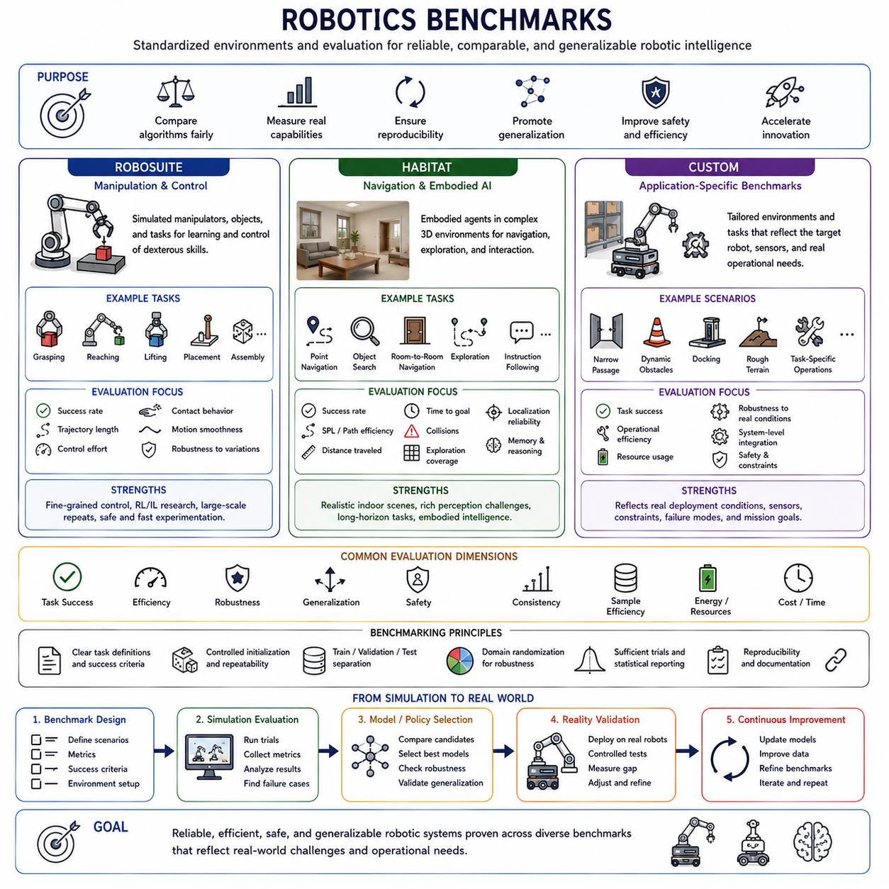
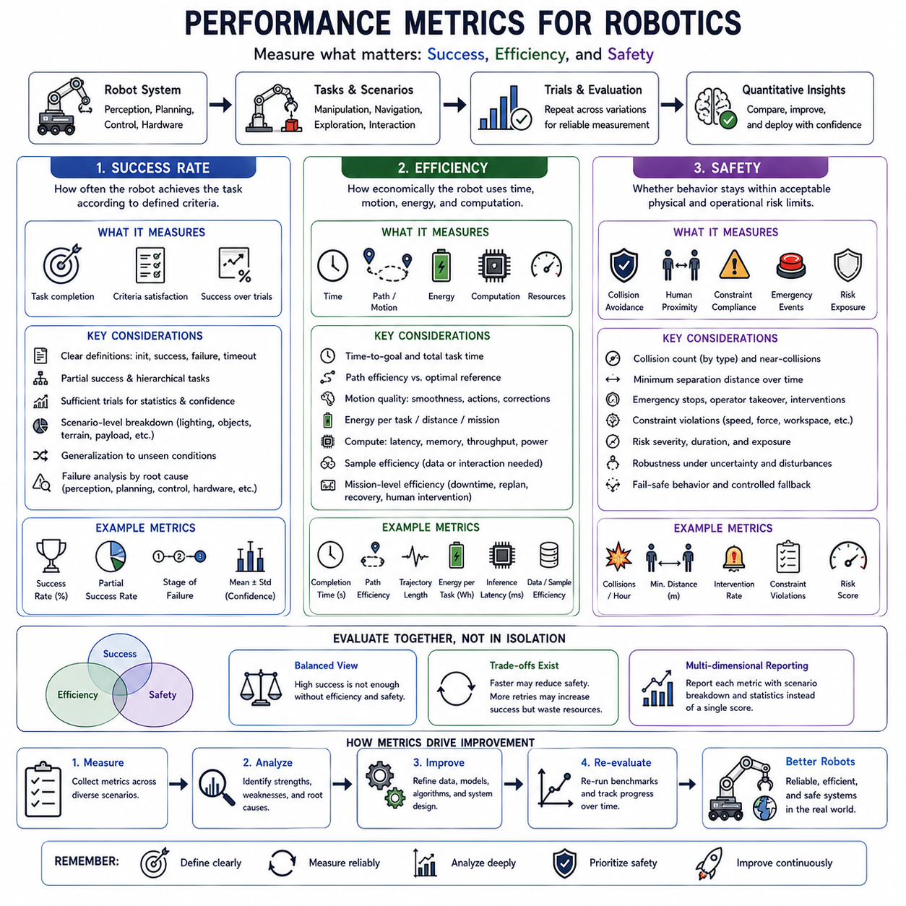
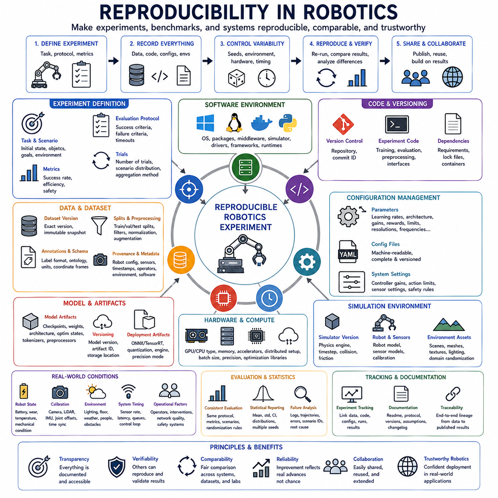
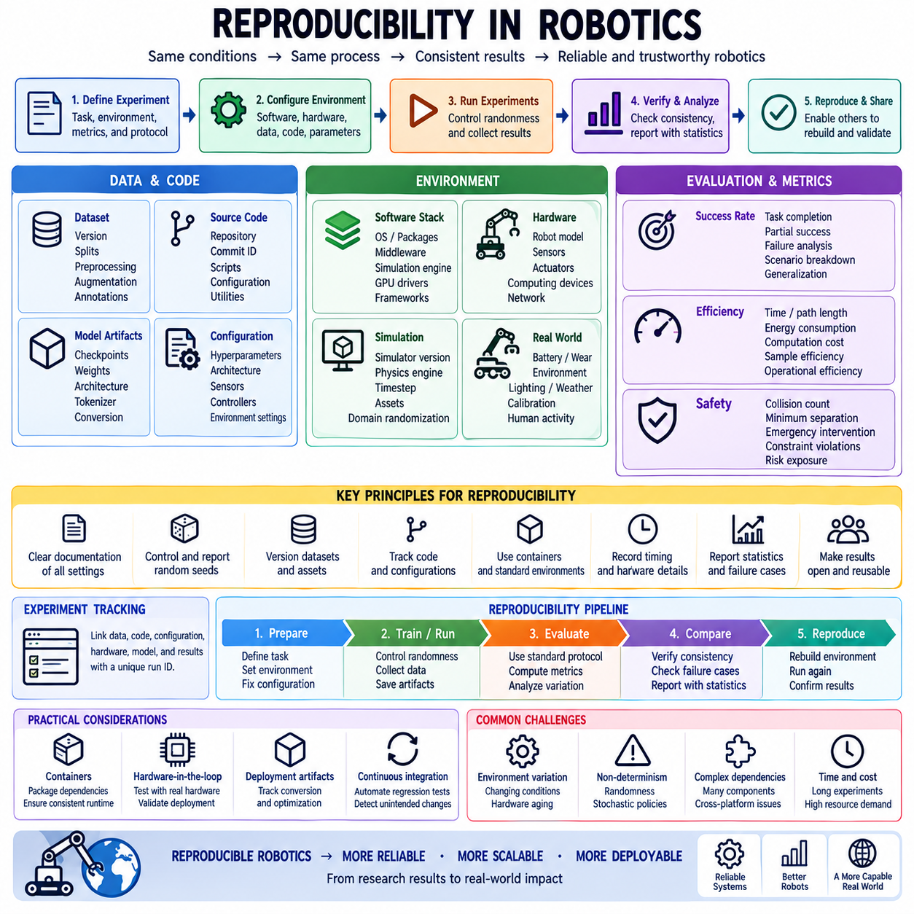
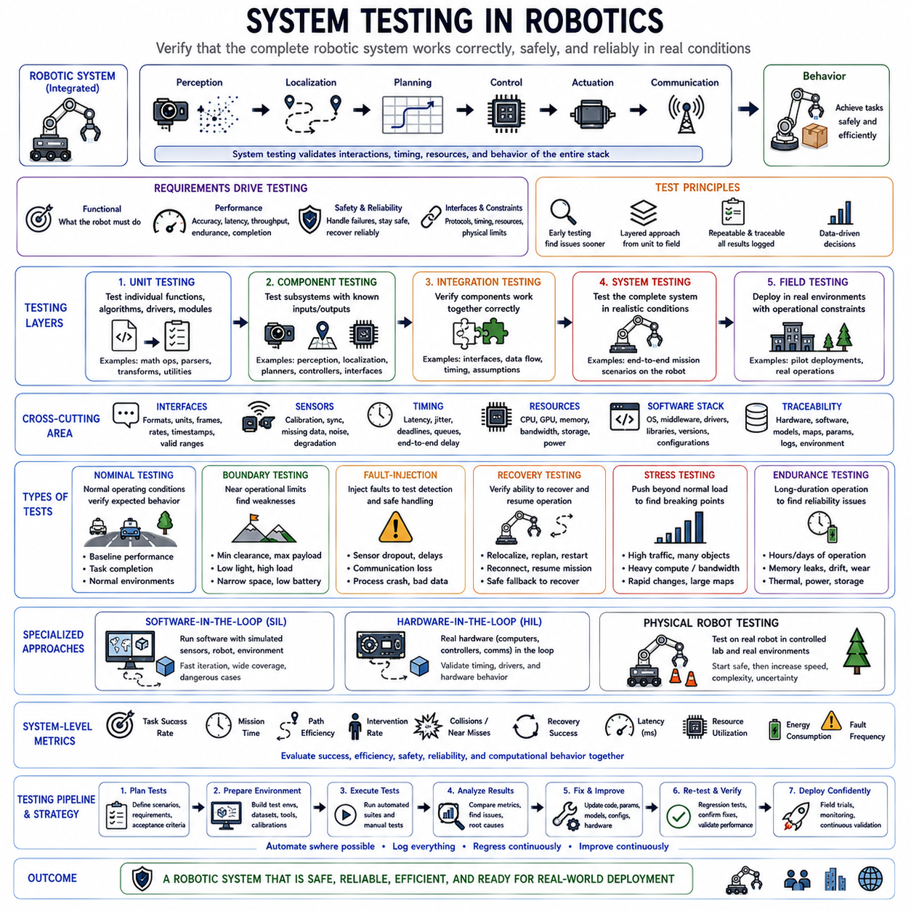
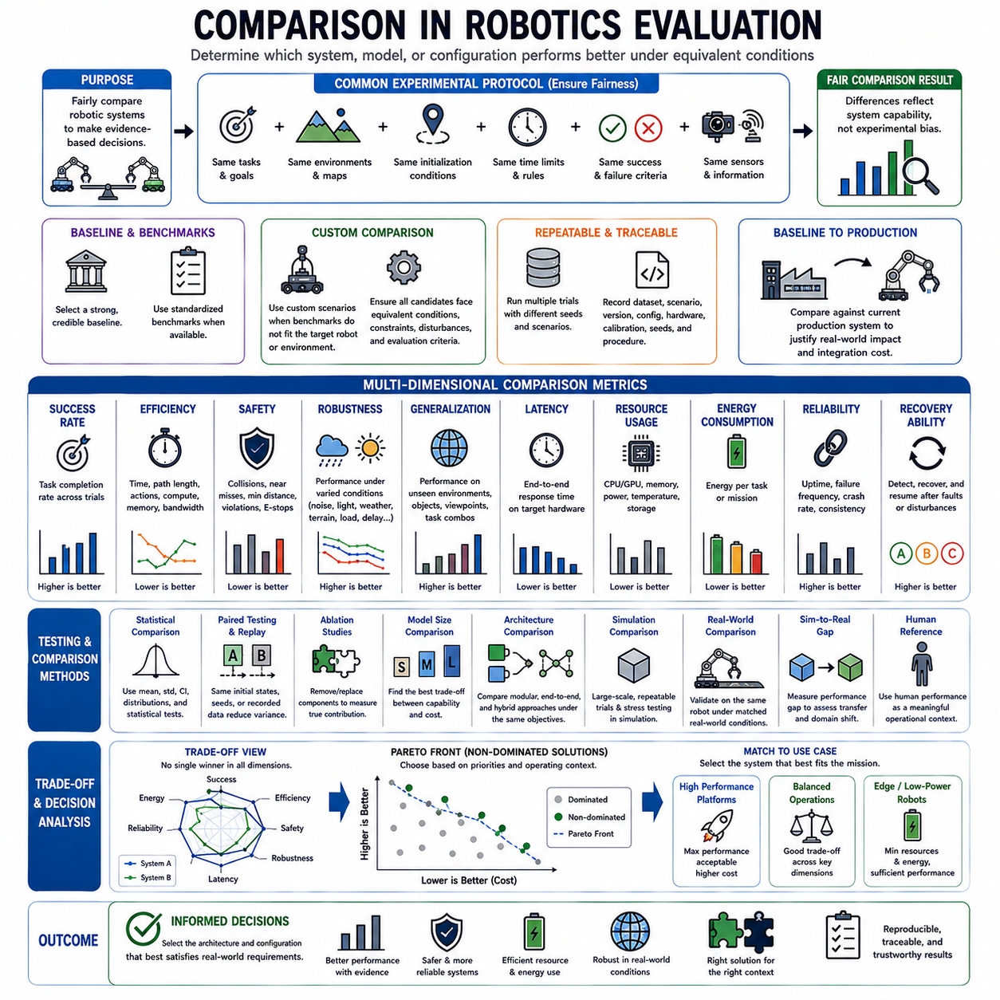

**Volume 45. Embodied AI and World Models**


# Chapter 09. Experiments and Benchmarks

##  

## 09.01. Robotics Benchmarks

{width="7.268055555555556in" height="7.268055555555556in"}

Robotics benchmarks provide standardized environments and evaluation procedures for measuring how well embodied AI systems perceive, reason, plan, learn, and interact with physical environments. In this structure, benchmarking is organized around RoboSuite, Habitat, and custom evaluation environments, providing complementary coverage of manipulation, navigation, and application-specific robotic behavior.

A useful robotics benchmark must evaluate more than whether a robot eventually completes a task. It should measure how consistently the system succeeds across repeated trials, how efficiently actions are executed, how safely the robot behaves, and how well learned policies generalize to unseen configurations. Controlled initialization, repeatable scenarios, and clearly defined success conditions are therefore essential for meaningful comparison.

Simulation is particularly important because physical experiments are expensive, slow, and difficult to reproduce exactly. Benchmark environments can generate thousands of controlled trials while systematically changing object positions, sensor observations, robot states, disturbances, or task configurations. Simulation also enables evaluation of dangerous failures without exposing physical hardware, people, or facilities to unnecessary risk.

RoboSuite is well suited to benchmarking robotic manipulation and control. It provides simulated robot manipulators, physically interactive objects, structured tasks, and reinforcement-learning-oriented interfaces that allow researchers to study grasping, reaching, lifting, placement, assembly, and other manipulation behaviors. These environments make it possible to compare learning algorithms under repeatable physical configurations.

Manipulation benchmarks must evaluate both task-level and motion-level behavior. A policy may complete an object-placement task but require excessive motion, unstable grasps, repeated corrections, or unnecessary contact. Evaluation can therefore examine completion rate, trajectory length, control effort, contact behavior, action smoothness, recovery capability, and robustness when objects or initial robot configurations are changed.

RoboSuite-style experiments are also useful for studying imitation learning, reinforcement learning, offline learning, and generalist robotic policies. Human demonstrations or previously collected trajectories can provide initial behavioral data, while policies can subsequently be evaluated in controlled simulation. Variation in objects, goals, camera viewpoints, or physical parameters helps determine whether a learned skill represents genuine task knowledge rather than memorization.

Habitat emphasizes embodied agents that navigate and interact within complex three-dimensional environments. Unlike manipulation benchmarks centered on relatively localized workspaces, Habitat-style evaluation can examine perception, localization, exploration, semantic navigation, object search, goal-directed movement, and long-horizon decision making across rooms or larger environments. It therefore complements manipulation-focused benchmarks.

Navigation performance cannot be represented adequately by success alone. An agent that reaches a destination after extensive wandering behaves differently from one that travels directly and efficiently. Benchmarks can therefore evaluate traveled distance, completion time, path efficiency, collision frequency, exploration coverage, localization reliability, and the relationship between the agent\'s trajectory and an efficient reference path.

Habitat-style environments also provide a useful setting for evaluating embodied perception and memory. An agent may need to remember previously observed locations, reason about objects that are no longer visible, combine visual observations with semantic goals, and determine where unexplored areas may contain useful information. Such tasks test whether perception, memory, mapping, and planning operate as a coherent embodied system.

Multimodal embodied AI can be evaluated by extending benchmark observations beyond conventional RGB images. Depth, semantic information, proprioception, maps, language instructions, or simulated sensor measurements can be provided according to experimental goals. Researchers can then compare vision-only agents with multimodal systems and determine whether additional modalities improve robustness, efficiency, grounding, or recovery under uncertainty.

Standard benchmarks are valuable for comparison, but they cannot represent every real robotic system. Actual robots differ in morphology, sensors, payload, workspace, actuator limits, environments, network conditions, mission requirements, and safety constraints. Custom benchmarks are therefore necessary when the target system contains operational characteristics that generic manipulation or navigation environments cannot reproduce adequately.

A custom benchmark should begin from clearly defined operational scenarios rather than arbitrary test scenes. For an autonomous mobile robot, scenarios might represent narrow passages, dynamic obstacles, degraded localization, docking, or changing terrain. For manipulation, they may include specific object geometries, force constraints, grasp failures, or workspace limitations. The benchmark should reflect situations that materially determine deployment success.

Custom environments also allow evaluation of complete robotic systems rather than isolated policies. Perception, localization, world modeling, planning, control, communication, and safety mechanisms can be tested together under realistic timing and resource constraints. This system-level perspective is particularly important because an individually accurate model may still cause poor robot behavior when latency, synchronization errors, or downstream interactions are considered.

Domain randomization can increase the value of both standardized and custom benchmarks. Lighting, textures, object poses, friction, mass, sensor noise, delays, environmental layouts, and disturbances can be varied across trials. A policy that succeeds only under one nominal configuration may perform well on a narrow benchmark while failing in deployment, whereas randomized evaluation provides stronger evidence of robustness.

Benchmark design should explicitly separate training conditions from evaluation conditions. If test environments closely reproduce the scenes, objects, or trajectories used during learning, measured performance may exaggerate generalization. Validation and test scenarios should therefore contain meaningful novelty, such as unseen object arrangements, environments, sensor conditions, task combinations, or physical parameters that challenge the learned representation.

Repeated trials are necessary because robotic behavior and learned policies may be stochastic. A single successful demonstration cannot establish reliability, particularly when perception noise, randomized initialization, exploration, or generative policies influence action selection. Benchmark results should aggregate sufficiently many runs to reveal expected performance, variance, rare failures, and conditions under which system behavior becomes unstable.

Benchmarking should also preserve reproducibility information. Simulator versions, robot models, environment assets, random seeds, task definitions, sensor settings, controller parameters, policy checkpoints, and evaluation configurations should be recorded. Without this information, differences between experiments may result from hidden configuration changes rather than genuine algorithmic improvements, reducing the scientific and engineering value of the comparison.

Simulated benchmark success must eventually be connected to physical testing. Even detailed simulators approximate contact, friction, sensor artifacts, actuator dynamics, timing, and environmental variability. Policies that perform strongly in RoboSuite, Habitat, or custom simulation should therefore undergo staged real-world validation to determine whether the measured capabilities survive the simulation-to-reality transition.

The strongest evaluation strategy combines standardized and custom benchmarks. RoboSuite can provide controlled manipulation comparisons, Habitat can evaluate navigation and embodied spatial intelligence, and custom environments can capture the specific sensors, tasks, failure modes, and operational constraints of the target robot. Together, these approaches provide broader evidence than any single benchmark family can offer.

Robotics benchmarks ultimately function as structured experiments for determining whether embodied intelligence is genuinely useful outside carefully selected demonstrations. Effective benchmarking exposes models to variation, uncertainty, failure, and unfamiliar conditions while measuring task completion, efficiency, robustness, and safety. The goal is not simply to obtain a high benchmark score, but to build credible evidence that robotic intelligence can perform reliably across increasingly realistic physical situations.

로보틱스 벤치마크(Robotics Benchmarks)는 체화 인공지능(Embodied AI) 시스템이 물리적 환경을 얼마나 효과적으로 인식하고, 추론하고, 계획하고, 학습하며, 상호작용하는지를 측정하기 위한 표준화된 환경과 평가 절차를 제공합니다. 이 구조에서 벤치마킹(Benchmarking)은 RoboSuite, Habitat, 사용자 정의 평가 환경(Custom Evaluation Environments)을 중심으로 구성되며, 각각 조작(Manipulation), 내비게이션(Navigation), 응용 분야별 로봇 행동(Application-Specific Robotic Behavior)을 상호보완적으로 평가합니다.

유용한 로보틱스 벤치마크는 로봇이 최종적으로 작업을 완료했는지만 평가해서는 안 됩니다. 시스템이 반복적인 시험에서 얼마나 일관되게 성공하는지, 행동을 얼마나 효율적으로 수행하는지, 얼마나 안전하게 동작하는지, 학습된 정책(Learned Policies)이 경험하지 못한 구성으로 얼마나 잘 일반화(Generalization)되는지를 측정해야 합니다. 따라서 의미 있는 비교를 위해서는 통제된 초기화(Controlled Initialization), 반복 가능한 시나리오, 명확하게 정의된 성공 조건이 필수적입니다.

물리적 실험은 비용이 높고 시간이 오래 걸리며 정확하게 동일한 조건을 재현하기 어렵기 때문에 시뮬레이션(Simulation)이 특히 중요합니다. 벤치마크 환경에서는 객체 위치, 센서 관측, 로봇 상태, 외란(Disturbances), 작업 구성을 체계적으로 변화시키면서 수천 번의 통제된 시험을 생성할 수 있습니다. 또한 시뮬레이션을 이용하면 실제 하드웨어, 사람 또는 시설을 불필요한 위험에 노출시키지 않고 위험한 실패 상황을 평가할 수 있습니다.

RoboSuite는 로봇 조작(Robotic Manipulation)과 제어(Control)를 벤치마킹하는 데 적합합니다. 시뮬레이션된 로봇 매니퓰레이터(Robot Manipulators), 물리적으로 상호작용하는 객체, 구조화된 작업, 강화학습 지향 인터페이스(Reinforcement-Learning-Oriented Interfaces)를 제공하여 파지(Grasping), 도달(Reaching), 들어올리기(Lifting), 배치(Placement), 조립(Assembly) 등의 조작 행동을 연구할 수 있습니다. 이러한 환경을 통해 반복 가능한 물리적 구성에서 학습 알고리즘을 비교할 수 있습니다.

조작 벤치마크(Manipulation Benchmarks)는 작업 수준 행동과 동작 수준 행동을 모두 평가해야 합니다. 정책이 객체 배치 작업을 완료하더라도 과도한 움직임, 불안정한 파지, 반복적인 보정 또는 불필요한 접촉이 발생할 수 있습니다. 따라서 완료율(Completion Rate), 궤적 길이(Trajectory Length), 제어 노력(Control Effort), 접촉 행동(Contact Behavior), 동작 부드러움(Action Smoothness), 복구 능력(Recovery Capability), 객체나 초기 로봇 구성이 변경되었을 때의 강건성(Robustness)을 평가할 수 있습니다.

RoboSuite 형태의 실험은 모방학습(Imitation Learning), 강화학습(Reinforcement Learning), 오프라인 학습(Offline Learning), 범용 로봇 정책(Generalist Robotic Policies)을 연구하는 데에도 유용합니다. 인간 시연(Human Demonstrations)이나 기존에 수집된 궤적을 초기 행동 데이터로 사용할 수 있으며, 이후 통제된 시뮬레이션에서 정책을 평가할 수 있습니다. 객체, 목표, 카메라 시점, 물리 파라미터를 변화시키면 학습된 기술이 단순한 암기가 아니라 실제 작업 지식을 표현하는지를 판단하는 데 도움이 됩니다.

Habitat은 복잡한 3차원 환경에서 이동하고 상호작용하는 체화 에이전트(Embodied Agents)를 중점적으로 다룹니다. 비교적 제한된 작업공간을 중심으로 하는 조작 벤치마크와 달리 Habitat 형태의 평가에서는 방 또는 더 넓은 환경에 걸쳐 인식, 위치추정(Localization), 탐색(Exploration), 의미 기반 내비게이션(Semantic Navigation), 객체 검색(Object Search), 목표 지향 이동(Goal-Directed Movement), 장기 의사결정(Long-Horizon Decision Making)을 평가할 수 있습니다. 따라서 조작 중심의 벤치마크를 보완합니다.

내비게이션 성능(Navigation Performance)은 단순한 성공 여부만으로 충분히 표현할 수 없습니다. 목적지에 도달하기 전에 광범위하게 배회하는 에이전트와 직접적이고 효율적으로 이동하는 에이전트는 서로 다른 성능을 가집니다. 따라서 이동 거리, 완료 시간, 경로 효율성(Path Efficiency), 충돌 빈도(Collision Frequency), 탐색 범위(Exploration Coverage), 위치추정 신뢰성(Localization Reliability), 에이전트의 실제 궤적과 효율적인 기준 경로(Reference Path) 사이의 관계를 평가할 수 있습니다.

Habitat 형태의 환경은 체화 인식(Embodied Perception)과 기억(Memory)을 평가하는 데에도 유용한 환경을 제공합니다. 에이전트는 이전에 관측했던 위치를 기억하고, 현재 보이지 않는 객체에 대해 추론하며, 시각적 관측과 의미적 목표를 결합하고, 아직 탐색하지 않은 영역에서 유용한 정보를 발견할 가능성을 판단해야 할 수 있습니다. 이러한 작업은 인식, 기억, 매핑(Mapping), 계획(Planning)이 하나의 일관된 체화 시스템으로 동작하는지를 시험합니다.

멀티모달 체화 인공지능(Multimodal Embodied AI)은 벤치마크 관측을 기존의 RGB 이미지 이상으로 확장하여 평가할 수 있습니다. 실험 목적에 따라 깊이 정보(Depth), 의미 정보(Semantic Information), 고유수용감각(Proprioception), 지도, 언어 명령(Language Instructions), 시뮬레이션 센서 측정값을 제공할 수 있습니다. 이를 통해 비전 전용 에이전트와 멀티모달 시스템을 비교하고 추가 모달리티(Modality)가 강건성, 효율성, 그라운딩(Grounding), 불확실성 상황에서의 복구 능력을 향상시키는지를 판단할 수 있습니다.

표준 벤치마크(Standard Benchmarks)는 비교에 유용하지만 모든 실제 로봇 시스템을 표현할 수는 없습니다. 실제 로봇은 형태(Morphology), 센서, 페이로드(Payload), 작업공간, 액추에이터 한계(Actuator Limits), 환경, 네트워크 조건, 임무 요구사항, 안전 제약조건에서 서로 다릅니다. 따라서 대상 시스템의 운영 특성을 일반적인 조작 또는 내비게이션 환경으로 충분히 재현할 수 없는 경우에는 사용자 정의 벤치마크(Custom Benchmarks)가 필요합니다.

사용자 정의 벤치마크는 임의의 시험 장면이 아니라 명확하게 정의된 운영 시나리오(Operational Scenarios)에서 시작해야 합니다. 자율이동로봇(Autonomous Mobile Robot)의 경우 좁은 통로, 동적 장애물, 위치추정 성능 저하, 도킹(Docking), 변화하는 지형 등을 시나리오로 구성할 수 있습니다. 조작 로봇의 경우 특정 객체 형상, 힘 제약조건(Force Constraints), 파지 실패, 작업공간 제한 등을 포함할 수 있습니다. 벤치마크는 실제 배포 성공을 실질적으로 결정하는 상황을 반영해야 합니다.

사용자 정의 환경(Custom Environments)을 이용하면 개별 정책뿐 아니라 전체 로봇 시스템을 평가할 수도 있습니다. 인식, 위치추정, 월드 모델링(World Modeling), 계획, 제어, 통신, 안전 메커니즘을 실제적인 시간 및 자원 제약조건에서 함께 시험할 수 있습니다. 개별적으로 정확한 모델이라도 지연시간, 동기화 오류(Synchronization Errors), 후속 구성요소와의 상호작용을 고려하면 전체 로봇의 행동을 저하시킬 수 있기 때문에 이러한 시스템 수준 관점(System-Level Perspective)이 특히 중요합니다.

도메인 랜덤화(Domain Randomization)는 표준 벤치마크와 사용자 정의 벤치마크 모두의 가치를 높일 수 있습니다. 조명, 텍스처(Textures), 객체 자세(Object Poses), 마찰(Friction), 질량, 센서 노이즈, 지연시간, 환경 레이아웃, 외란을 시험마다 변화시킬 수 있습니다. 하나의 정상적인 구성에서만 성공하는 정책은 제한적인 벤치마크에서는 높은 성능을 보일 수 있지만 실제 배포에서는 실패할 수 있으며, 랜덤화된 평가는 강건성에 대한 더 강력한 근거를 제공합니다.

벤치마크 설계(Benchmark Design)에서는 학습 조건과 평가 조건을 명확하게 분리해야 합니다. 시험 환경이 학습 과정에서 사용된 장면, 객체 또는 궤적을 지나치게 유사하게 재현하면 측정된 성능이 일반화 능력을 과대평가할 수 있습니다. 따라서 검증 및 시험 시나리오에는 경험하지 못한 객체 배치, 새로운 환경, 다른 센서 조건, 새로운 작업 조합 또는 물리 파라미터와 같이 학습된 표현을 실질적으로 시험할 수 있는 새로운 조건(Novelty)이 포함되어야 합니다.

로봇의 행동과 학습된 정책은 확률적(Stochastic)일 수 있기 때문에 반복 시험(Repeated Trials)이 필요합니다. 한 번의 성공적인 시연만으로는 신뢰성을 입증할 수 없으며, 특히 인식 노이즈, 무작위 초기화, 탐색 또는 생성형 정책(Generative Policies)이 행동 선택에 영향을 미치는 경우 더욱 그렇습니다. 벤치마크 결과는 충분한 횟수의 실행을 종합하여 기대 성능, 분산(Variance), 희귀 실패(Rare Failures), 시스템 행동이 불안정해지는 조건을 확인할 수 있어야 합니다.

벤치마킹 과정에서는 재현성 정보(Reproducibility Information)도 보존해야 합니다. 시뮬레이터 버전, 로봇 모델, 환경 자산(Environment Assets), 난수 시드(Random Seeds), 작업 정의, 센서 설정, 제어기 파라미터, 정책 체크포인트(Policy Checkpoints), 평가 구성을 기록해야 합니다. 이러한 정보가 없으면 실험 사이의 차이가 실제 알고리즘 개선이 아니라 숨겨진 구성 변경에서 발생할 수 있으며, 결과적으로 비교의 과학적·공학적 가치가 감소합니다.

시뮬레이션 벤치마크의 성공은 궁극적으로 실제 물리 시험(Physical Testing)과 연결되어야 합니다. 아무리 정교한 시뮬레이터라도 접촉(Contact), 마찰, 센서 아티팩트(Sensor Artifacts), 액추에이터 동역학(Actuator Dynamics), 시간 특성, 환경 변동성을 근사적으로 표현합니다. 따라서 RoboSuite, Habitat 또는 사용자 정의 시뮬레이션에서 높은 성능을 보이는 정책도 측정된 능력이 시뮬레이션-현실 전이(Simulation-to-Reality Transition) 이후에도 유지되는지를 확인하기 위해 단계적인 실제 환경 검증을 거쳐야 합니다.

가장 강력한 평가 전략은 표준화된 벤치마크와 사용자 정의 벤치마크를 결합하는 것입니다. RoboSuite는 통제된 조작 성능 비교를 제공하고, Habitat은 내비게이션과 체화 공간 지능(Embodied Spatial Intelligence)을 평가하며, 사용자 정의 환경은 대상 로봇에 특화된 센서, 작업, 실패 모드, 운영 제약조건을 반영할 수 있습니다. 이러한 접근법을 함께 사용하면 하나의 벤치마크 계열만 사용하는 것보다 로봇 시스템의 능력에 대해 더 폭넓은 근거를 확보할 수 있습니다.

로보틱스 벤치마크는 궁극적으로 체화 지능(Embodied Intelligence)이 신중하게 선택된 시연 환경을 넘어 실제로 유용한지를 판단하기 위한 구조화된 실험(Structured Experiments)의 역할을 합니다. 효과적인 벤치마킹은 모델을 다양한 변화, 불확실성, 실패, 익숙하지 않은 조건에 노출시키면서 작업 완료, 효율성, 강건성, 안전성을 측정합니다. 최종 목표는 단순히 높은 벤치마크 점수(Benchmark Score)를 얻는 것이 아니라 로봇 지능이 점차 현실적인 물리적 상황에서도 신뢰성 있게 동작할 수 있다는 설득력 있는 근거를 구축하는 것입니다.

##  

## 09.02. Performance Metrics

{width="7.268055555555556in" height="7.268055555555556in"}

Performance metrics convert robotic behavior into measurable evidence that a system can complete tasks reliably, efficiently, and safely. For embodied AI, evaluation cannot depend on a single accuracy score because successful physical operation involves interaction among perception, planning, control, hardware, and the environment. Success rate, efficiency, and safety therefore form complementary dimensions for evaluating whether robotic intelligence is genuinely suitable for deployment.

Success rate measures the proportion of trials in which a robot satisfies predefined task-completion criteria. A manipulation system may succeed when an object reaches the required pose, while a mobile robot may succeed when it reaches a destination without violating operational constraints. The metric appears simple, but meaningful measurement requires precise definitions of task initialization, completion conditions, failure conditions, and allowed execution time.

Success criteria should represent operational objectives rather than convenient experimental outcomes. Partial completion may need to be distinguished from full success, particularly in long-horizon tasks containing several subtasks. A robot that completes four of five required actions provides different information from one that fails immediately. Hierarchical metrics can therefore capture complete success, partial progress, and the stage at which execution fails.

Repeated trials are essential when estimating success rate because robotic behavior can vary with sensor noise, randomized initialization, environmental variation, and stochastic policies. Reporting results from only a small number of favorable trials can produce misleading conclusions. Evaluation should use sufficiently diverse repetitions to estimate average success while also revealing variance, confidence intervals, and conditions associated with recurring failures.

Success rate should also be analyzed across scenario categories rather than only as one aggregate value. Performance may differ under low illumination, crowded environments, unfamiliar objects, high payload, degraded localization, or changing terrain. A high overall success rate can conceal a severe weakness in an important operating condition, so scenario-level results provide stronger evidence about where the robot can be deployed reliably.

Generalization is closely connected to successful performance. A robot that succeeds repeatedly in the same memorized environment may have limited practical intelligence. Evaluation should therefore include unseen object arrangements, new environments, altered goals, different initial poses, and other variations not represented directly during training. Success under these conditions indicates that learned representations and policies transfer beyond the original training distribution.

Failure analysis complements success rate by explaining why unsuccessful trials occur. Failures can originate from perception errors, localization loss, planning mistakes, unstable control, grasp failure, communication problems, timing violations, or hardware limitations. Categorizing these causes transforms a binary success metric into engineering knowledge that can guide dataset improvement, model development, controller tuning, and system redesign.

Efficiency measures how economically the robot uses time, motion, energy, computation, and other resources while completing a task. Two robots may achieve identical success rates while exhibiting very different operational quality. One may take a direct route with smooth actions, while another performs unnecessary movements and consumes excessive energy. Efficiency therefore distinguishes merely successful behavior from practically useful autonomous behavior.

Time efficiency is commonly represented through task completion time or time-to-goal. Shorter execution is generally desirable, but speed alone should not be optimized without considering safety and stability. Excessively aggressive motion may reduce completion time while increasing collision risk or control error. Performance analysis should therefore interpret time jointly with task success, motion quality, safety constraints, and the physical capabilities of the robot.

Path efficiency is particularly important for mobile robots and embodied navigation agents. The traveled path can be compared with a reference path or shortest feasible route to determine how directly the system reaches its goal. Metrics such as success weighted by path length can combine successful completion with navigation efficiency, preventing inefficient wandering from receiving the same evaluation as direct and purposeful movement.

Manipulation efficiency can be measured through trajectory length, number of actions, control effort, unnecessary contacts, grasp attempts, or corrective motions. A mature manipulation policy should not only reach the desired final state but should do so with stable and purposeful actions. Excessive corrections may indicate uncertainty, weak perception, poor planning, or insufficiently learned motor representations even when the final task succeeds.

Energy efficiency becomes increasingly important for mobile and battery-powered robots. Motors, onboard computers, sensors, communication systems, and AI accelerators all consume energy during operation. Energy per task, energy per traveled distance, battery usage per mission, or productive operating time between charging events can reveal whether improved intelligence actually contributes to practical mission endurance.

Computational efficiency is another dimension because modern embodied AI may execute several neural models simultaneously. Inference latency, memory consumption, GPU utilization, processor load, throughput, and power consumption can determine whether an algorithm is deployable on edge hardware. A model that produces slightly higher task performance but requires unsustainable computational resources may be less valuable than a smaller model with reliable real-time behavior.

Sample efficiency measures how much training experience is required to achieve a target capability. This is important because collecting robotic data can require physical hardware, human operators, laboratory time, and maintenance. Algorithms that learn effectively from fewer demonstrations, interactions, or simulation episodes can reduce development cost and accelerate adaptation to new robots, tasks, objects, and environments.

Operational efficiency should consider the entire mission rather than isolated task execution. Charging, initialization, localization recovery, waiting, communication delays, human interventions, and fault recovery can consume significant operational time. A robot that performs individual tasks efficiently but frequently requires manual recovery may provide poor overall productivity. Mission-level evaluation therefore captures performance that component benchmarks can overlook.

Safety measures whether robotic behavior remains within acceptable physical and operational risk boundaries. Unlike conventional software metrics, safety concerns interactions with people, equipment, infrastructure, and the robot itself. A high success rate cannot compensate for behavior that occasionally creates severe hazards. Safety metrics must therefore be treated as independent constraints rather than merely as another contribution to an averaged performance score.

Collision frequency is a direct safety metric for mobile and manipulation systems. Evaluation can distinguish contact with people, fixed infrastructure, dynamic objects, manipulators, or self-collision because these events have different consequences. Near-collision events can also be measured because repeated operation close to safety boundaries may reveal risky behavior even when actual contact does not occur during a limited benchmark.

Minimum separation distance provides information that collision counts alone cannot capture. A robot may avoid every collision while repeatedly passing dangerously close to people or obstacles. Measuring safety margins throughout trajectories can reveal whether the policy maintains conservative spatial separation. Such metrics are particularly valuable in human-robot interaction, shared workspaces, autonomous navigation, and high-speed robotic operation.

Emergency interventions provide another important safety signal. Emergency stops, safety-controller activation, operator takeover, remote intervention, or automatic fallback behavior indicate situations where normal autonomy could not continue safely. Intervention rate can therefore reveal weaknesses that task success metrics overlook. The cause and timing of each intervention should be recorded so that recurring safety problems can be systematically analyzed.

Constraint violations can measure whether the robot exceeds defined limits for speed, acceleration, force, torque, workspace boundaries, joint states, temperature, payload, or other operational parameters. A task should not be considered fully successful if it reaches its goal by violating required constraints. Safety-aware evaluation therefore incorporates both the final outcome and the physical trajectory through which that outcome was achieved.

Risk exposure should also account for duration and severity rather than only counting incidents. A brief low-severity violation differs significantly from prolonged operation in a dangerous state. Metrics can therefore combine frequency, magnitude, exposure time, and potential consequence. This produces a richer description of safety behavior than a simple binary classification of safe or unsafe trials.

Robustness and safety are strongly connected because environmental uncertainty can push a system outside its nominal operating regime. Sensor degradation, communication delay, localization uncertainty, unexpected obstacles, actuator limitations, or model errors should therefore be introduced during evaluation. A safe robotic system should degrade predictably, reduce capability when necessary, and enter a controlled fallback state rather than continuing with increasingly uncertain behavior.

Success, efficiency, and safety should be evaluated together because optimizing one dimension can degrade another. Increasing speed may improve efficiency while reducing safety margins, and conservative behavior may improve safety while producing unacceptable mission time. Similarly, a system may maximize success by repeatedly retrying failed actions at the cost of energy and productivity. Multi-dimensional evaluation exposes these tradeoffs instead of hiding them within a single score.

Benchmark reports should therefore preserve the underlying metrics rather than collapsing every result into one composite value. Success rate can describe reliability, efficiency metrics can describe resource quality, and safety metrics can describe operational risk. When combined with scenario information and statistical variation, these measures allow engineers to determine not simply which model scores highest, but which system best satisfies actual deployment requirements.

Performance metrics ultimately provide the quantitative connection between embodied AI research and real robotic operation. Success rate establishes whether the robot can accomplish its objectives, efficiency determines whether those objectives are achieved with practical use of time and resources, and safety determines whether operation remains within acceptable risk boundaries. Together they provide a balanced framework for evaluating dependable, scalable, and deployable robotic intelligence.

성능 지표(Performance Metrics)는 로봇의 행동을 시스템이 작업을 얼마나 신뢰성 있게, 효율적으로, 안전하게 완료할 수 있는지를 보여주는 측정 가능한 근거로 변환합니다. 체화 인공지능(Embodied AI)의 평가는 하나의 정확도 점수에만 의존할 수 없습니다. 성공적인 물리적 운용에는 인식(Perception), 계획(Planning), 제어(Control), 하드웨어, 환경 사이의 상호작용이 포함되기 때문입니다. 따라서 성공률(Success Rate), 효율성(Efficiency), 안전성(Safety)은 로봇 지능이 실제 배포에 적합한지를 평가하는 상호보완적인 차원을 구성합니다.

성공률(Success Rate)은 로봇이 사전에 정의된 작업 완료 기준(Task-Completion Criteria)을 충족한 시험의 비율을 측정합니다. 조작 시스템은 객체가 요구되는 자세에 도달하면 성공으로 판단할 수 있으며, 이동 로봇은 운영 제약조건을 위반하지 않고 목적지에 도달했을 때 성공으로 판단할 수 있습니다. 이 지표는 단순해 보이지만 의미 있는 측정을 위해서는 작업 초기화, 완료 조건, 실패 조건, 허용 실행 시간을 정확하게 정의해야 합니다.

성공 기준(Success Criteria)은 편리한 실험 결과가 아니라 실제 운영 목표를 반영해야 합니다. 특히 여러 하위 작업(Subtasks)을 포함하는 장기 작업(Long-Horizon Tasks)에서는 부분적인 완료와 완전한 성공을 구분할 필요가 있습니다. 다섯 개의 필수 행동 가운데 네 개를 완료한 로봇과 시작 직후 실패한 로봇은 서로 다른 정보를 제공합니다. 따라서 계층적 지표(Hierarchical Metrics)를 통해 완전한 성공, 부분적 진행, 실행이 실패한 단계를 구분할 수 있습니다.

로봇의 행동은 센서 노이즈, 무작위 초기화(Randomized Initialization), 환경 변화, 확률적 정책(Stochastic Policies)에 따라 달라질 수 있으므로 성공률을 추정할 때 반복 시험(Repeated Trials)이 필수적입니다. 소수의 유리한 시험 결과만 보고하면 잘못된 결론을 얻을 수 있습니다. 평가는 충분히 다양하고 반복적인 시험을 통해 평균 성공률뿐 아니라 분산(Variance), 신뢰구간(Confidence Intervals), 반복적인 실패와 관련된 조건까지 확인할 수 있어야 합니다.

성공률은 하나의 종합적인 값으로만 분석하지 않고 시나리오 범주별로 분석해야 합니다. 성능은 낮은 조도, 혼잡한 환경, 익숙하지 않은 객체, 높은 페이로드(Payload), 위치추정 성능 저하, 변화하는 지형에 따라 달라질 수 있습니다. 높은 전체 성공률이 중요한 운영 조건에서의 심각한 약점을 숨길 수 있으므로 시나리오 수준의 결과는 로봇을 어떤 환경에 신뢰성 있게 배포할 수 있는지에 대한 더 강력한 근거를 제공합니다.

일반화(Generalization)는 성공적인 성능과 밀접하게 연결되어 있습니다. 동일한 환경을 암기하여 반복적으로 성공하는 로봇은 실제적인 지능이 제한적일 수 있습니다. 따라서 평가에는 경험하지 못한 객체 배치, 새로운 환경, 변경된 목표, 서로 다른 초기 자세, 학습 과정에서 직접적으로 포함되지 않았던 다양한 조건을 포함해야 합니다. 이러한 조건에서의 성공은 학습된 표현과 정책이 원래의 학습 분포(Training Distribution)를 넘어 전이될 수 있음을 보여줍니다.

실패 분석(Failure Analysis)은 실패한 시험의 원인을 설명함으로써 성공률을 보완합니다. 실패는 인식 오류, 위치추정 손실(Localization Loss), 계획 오류, 불안정한 제어, 파지 실패(Grasp Failure), 통신 문제, 타이밍 위반(Timing Violations), 하드웨어 한계 등에서 발생할 수 있습니다. 이러한 원인을 분류하면 단순한 이진 성공 지표를 데이터셋 개선, 모델 개발, 제어기 튜닝, 시스템 재설계에 활용할 수 있는 엔지니어링 지식으로 변환할 수 있습니다.

효율성(Efficiency)은 로봇이 작업을 완료하는 동안 시간, 움직임, 에너지, 계산 자원 및 기타 자원을 얼마나 경제적으로 사용하는지를 측정합니다. 두 로봇이 동일한 성공률을 달성하더라도 실제 운영 품질은 크게 다를 수 있습니다. 하나는 부드러운 행동으로 직접적인 경로를 이동하는 반면 다른 하나는 불필요한 움직임을 반복하고 과도한 에너지를 소비할 수 있습니다. 따라서 효율성은 단순히 성공하는 행동과 실제로 유용한 자율 행동을 구분합니다.

시간 효율성(Time Efficiency)은 일반적으로 작업 완료 시간(Task Completion Time) 또는 목표 도달 시간(Time-to-Goal)으로 표현할 수 있습니다. 실행 시간이 짧을수록 일반적으로 바람직하지만 안전성과 안정성을 고려하지 않고 속도만 최적화해서는 안 됩니다. 지나치게 공격적인 움직임은 완료 시간을 줄이면서 충돌 위험이나 제어 오류를 증가시킬 수 있습니다. 따라서 시간은 작업 성공, 동작 품질, 안전 제약조건, 로봇의 물리적 능력과 함께 평가해야 합니다.

경로 효율성(Path Efficiency)은 이동 로봇과 체화 내비게이션 에이전트(Embodied Navigation Agents)에서 특히 중요합니다. 실제 이동 경로를 기준 경로(Reference Path) 또는 가장 짧은 실행 가능 경로와 비교하여 시스템이 목표까지 얼마나 직접적으로 이동했는지를 판단할 수 있습니다. 경로 길이로 가중된 성공(Success Weighted by Path Length)과 같은 지표는 성공적인 완료와 내비게이션 효율성을 함께 평가하여 비효율적인 배회가 직접적이고 목적 지향적인 이동과 동일하게 평가되는 것을 방지합니다.

조작 효율성(Manipulation Efficiency)은 궤적 길이(Trajectory Length), 행동 횟수, 제어 노력(Control Effort), 불필요한 접촉, 파지 시도 횟수, 보정 동작(Corrective Motions)을 통해 측정할 수 있습니다. 성숙한 조작 정책은 원하는 최종 상태에 도달하는 것뿐 아니라 안정적이고 목적 지향적인 행동으로 이를 달성해야 합니다. 과도한 보정은 최종적으로 작업에 성공하더라도 불확실성, 취약한 인식, 부족한 계획 또는 충분히 학습되지 않은 운동 표현(Motor Representations)을 나타낼 수 있습니다.

에너지 효율성(Energy Efficiency)은 이동형 및 배터리 구동 로봇에서 점점 더 중요해집니다. 모터, 온보드 컴퓨터, 센서, 통신 시스템, 인공지능 가속기(AI Accelerators)는 모두 운용 중 에너지를 소비합니다. 작업당 에너지(Energy per Task), 이동 거리당 에너지, 임무당 배터리 사용량, 충전 사이의 생산적인 운용 시간 등을 측정하면 향상된 지능이 실제 임무 지속시간(Mission Endurance) 향상에 기여하는지를 판단할 수 있습니다.

현대 체화 인공지능은 여러 신경망 모델을 동시에 실행할 수 있으므로 계산 효율성(Computational Efficiency)도 중요한 평가 차원입니다. 추론 지연시간(Inference Latency), 메모리 소비, GPU 활용률, 프로세서 부하, 처리량(Throughput), 전력 소비는 알고리즘을 엣지 하드웨어(Edge Hardware)에 배포할 수 있는지를 결정합니다. 작업 성능이 약간 높더라도 지속할 수 없는 계산 자원을 요구하는 모델은 신뢰성 있는 실시간 동작을 제공하는 소형 모델보다 실용적인 가치가 낮을 수 있습니다.

샘플 효율성(Sample Efficiency)은 목표 능력을 달성하는 데 필요한 학습 경험의 양을 측정합니다. 로봇 데이터를 수집하려면 실제 하드웨어, 인간 운영자, 실험실 시간, 유지보수 비용이 필요할 수 있기 때문에 중요한 지표입니다. 더 적은 시연, 상호작용 또는 시뮬레이션 에피소드로 효과적으로 학습하는 알고리즘은 개발 비용을 줄이고 새로운 로봇, 작업, 객체, 환경에 대한 적응 속도를 높일 수 있습니다.

운영 효율성(Operational Efficiency)은 개별 작업 실행뿐 아니라 전체 임무를 고려해야 합니다. 충전, 초기화, 위치추정 복구, 대기, 통신 지연, 인간 개입, 장애 복구는 상당한 운영 시간을 소비할 수 있습니다. 개별 작업은 효율적으로 수행하지만 빈번하게 수동 복구가 필요한 로봇은 전체 생산성이 낮을 수 있습니다. 따라서 임무 수준 평가(Mission-Level Evaluation)는 개별 구성요소 벤치마크가 놓칠 수 있는 실제 운영 성능을 포착합니다.

안전성(Safety)은 로봇의 행동이 허용 가능한 물리적·운영적 위험 범위 안에서 유지되는지를 측정합니다. 일반적인 소프트웨어 지표와 달리 안전은 사람, 장비, 인프라, 로봇 자체와의 물리적 상호작용을 고려합니다. 높은 성공률이라도 간헐적으로 심각한 위험을 발생시키는 행동을 보상할 수는 없습니다. 따라서 안전 지표(Safety Metrics)는 평균 성능 점수의 일부로만 처리하기보다 독립적인 제약조건으로 평가해야 합니다.

충돌 빈도(Collision Frequency)는 이동 및 조작 시스템에서 직접적인 안전 지표입니다. 사람, 고정 인프라, 동적 객체, 매니퓰레이터(Manipulator), 로봇 자체와의 충돌은 각각 다른 결과를 발생시키므로 구분하여 평가할 수 있습니다. 또한 실제 충돌이 발생하지 않았더라도 안전 경계 가까이에서 반복적으로 동작하는 것은 위험한 행동을 나타낼 수 있으므로 근접 충돌(Near-Collision) 이벤트도 측정할 수 있습니다.

최소 분리 거리(Minimum Separation Distance)는 충돌 횟수만으로 확인할 수 없는 정보를 제공합니다. 로봇이 모든 충돌을 피하더라도 사람이나 장애물에 반복적으로 위험할 정도로 가까이 접근할 수 있습니다. 궤적 전체에서 안전 여유(Safety Margins)를 측정하면 정책이 보수적인 공간적 분리를 유지하는지를 평가할 수 있습니다. 이러한 지표는 인간-로봇 상호작용(Human-Robot Interaction), 공유 작업공간, 자율 내비게이션, 고속 로봇 운용에서 특히 중요합니다.

비상 개입(Emergency Interventions)은 또 다른 중요한 안전 지표입니다. 비상 정지(Emergency Stops), 안전 제어기 활성화, 운영자의 제어권 인수(Operator Takeover), 원격 개입, 자동 폴백 동작(Automatic Fallback Behavior)은 정상적인 자율 시스템이 안전하게 계속 운용될 수 없었던 상황을 나타냅니다. 따라서 개입률(Intervention Rate)은 작업 성공 지표에서 확인하기 어려운 약점을 보여줄 수 있으며, 반복되는 안전 문제를 분석할 수 있도록 각각의 개입 원인과 발생 시점을 기록해야 합니다.

제약조건 위반(Constraint Violations)은 로봇이 속도, 가속도, 힘, 토크(Torque), 작업공간 경계, 관절 상태, 온도, 페이로드 또는 기타 운영 파라미터에 정의된 한계를 초과했는지를 측정합니다. 요구되는 제약조건을 위반하여 목표를 달성했다면 해당 작업을 완전한 성공으로 간주해서는 안 됩니다. 따라서 안전 인식 평가(Safety-Aware Evaluation)는 최종 결과뿐 아니라 해당 결과에 도달하기까지의 물리적 궤적도 함께 고려합니다.

위험 노출(Risk Exposure)은 단순한 사고 횟수뿐 아니라 지속시간과 심각도(Severity)도 고려해야 합니다. 짧은 시간 동안 발생한 낮은 심각도의 위반과 장시간 위험 상태에서 운용된 경우는 크게 다릅니다. 따라서 지표는 발생 빈도, 위반 정도, 노출 시간, 잠재적 결과를 함께 고려할 수 있습니다. 이를 통해 안전한 시험과 위험한 시험을 단순히 이진적으로 구분하는 것보다 풍부한 안전 행동 정보를 얻을 수 있습니다.

강건성(Robustness)과 안전성은 밀접하게 연결되어 있습니다. 환경의 불확실성은 시스템을 정상적인 운영 범위 밖으로 밀어낼 수 있기 때문입니다. 센서 성능 저하, 통신 지연, 위치추정 불확실성, 예상하지 못한 장애물, 액추에이터 한계, 모델 오류 등을 평가 과정에서 의도적으로 발생시켜야 합니다. 안전한 로봇 시스템은 불확실성이 증가한 상태에서 무리하게 계속 운용하기보다 예측 가능한 방식으로 성능을 낮추고 필요할 경우 통제된 폴백 상태(Controlled Fallback State)로 전환해야 합니다.

성공률, 효율성, 안전성은 하나의 차원을 최적화할 때 다른 차원이 저하될 수 있으므로 함께 평가해야 합니다. 속도를 높이면 효율성이 향상되는 동시에 안전 여유가 감소할 수 있고, 지나치게 보수적인 행동은 안전성을 높이지만 허용할 수 없는 임무 시간을 발생시킬 수 있습니다. 또한 시스템이 실패한 행동을 계속 재시도하여 성공률을 높일 수도 있지만 그 과정에서 에너지와 생산성을 크게 희생할 수 있습니다. 다차원 평가(Multi-Dimensional Evaluation)는 이러한 상충관계(Tradeoffs)를 하나의 점수 안에 숨기지 않고 명확하게 드러냅니다.

따라서 벤치마크 보고서(Benchmark Reports)는 모든 결과를 하나의 복합 점수(Composite Value)로 축소하기보다 기본 성능 지표를 각각 보존해야 합니다. 성공률은 신뢰성을 설명하고, 효율성 지표는 자원 사용 품질을 설명하며, 안전성 지표는 운영 위험을 설명할 수 있습니다. 이러한 지표를 시나리오 정보와 통계적 변동성(Statistical Variation)과 함께 분석하면 단순히 어떤 모델의 점수가 가장 높은지를 넘어 실제 배포 요구사항에 가장 적합한 시스템이 무엇인지 판단할 수 있습니다.

성능 지표(Performance Metrics)는 궁극적으로 체화 인공지능 연구와 실제 로봇 운용을 연결하는 정량적인 연결고리를 제공합니다. 성공률(Success Rate)은 로봇이 목표를 달성할 수 있는지를 보여주고, 효율성(Efficiency)은 시간과 자원을 실용적으로 사용하면서 목표를 달성하는지를 평가하며, 안전성(Safety)은 운용이 허용 가능한 위험 범위 안에서 유지되는지를 결정합니다. 이 세 가지 요소를 함께 평가함으로써 신뢰할 수 있고 확장 가능하며 실제 배포가 가능한 로봇 지능을 평가하기 위한 균형 잡힌 프레임워크를 구축할 수 있습니다.

##  

## 09.03. Reproducibility [w/Code]

{width="7.268055555555556in" height="7.268055555555556in"}

{width="7.268055555555556in" height="7.268055555555556in"}

Reproducibility in robotics means that an experiment, benchmark, or deployed learning system can be reconstructed under sufficiently documented conditions and produce results consistent with the original findings. This is especially difficult in embodied AI because outcomes depend not only on model parameters and datasets, but also on simulators, robot hardware, sensors, controllers, software versions, timing, environmental conditions, and stochastic interactions.

A reproducible experiment begins with a precise description of the task and evaluation protocol. Initial robot states, object poses, goal definitions, termination conditions, time limits, failure criteria, and success metrics should be explicitly specified. Small differences in these conditions can significantly alter measured performance, particularly in manipulation, navigation, reinforcement learning, and long-horizon embodied tasks.

Software environments must also be preserved because robotic AI depends on complex stacks of libraries and runtime components. Operating-system versions, Python packages, middleware, simulation engines, GPU drivers, CUDA, inference runtimes, and robotics frameworks can affect execution. Dependency files, containers, or environment manifests help reconstruct the computational environment and reduce hidden differences between machines or laboratories.

Source-code versioning provides another essential layer of reproducibility. Training scripts, evaluation programs, preprocessing logic, robot interfaces, configuration files, and utility modules should be associated with specific repository revisions. Recording a commit identifier allows an experiment to be connected to the exact implementation used, preventing later code changes from silently altering the behavior of supposedly identical evaluations.

Configuration management is equally important because many robotic experiments depend on hundreds of parameters. Learning rates, network architectures, observation dimensions, controller gains, sensor frequencies, reward coefficients, image resolutions, action limits, and simulation settings may all influence results. These parameters should be stored in machine-readable configuration files rather than reconstructed later from memory or informal notes.

Randomness must be explicitly controlled and reported. Neural-network initialization, dataset shuffling, simulation randomization, exploration policies, object placement, environmental variation, and sampling procedures can all produce different outcomes across trials. Random seeds should therefore be recorded, but reproducibility should not rely on a single seed. Multiple seeds reveal whether reported performance reflects stable behavior or a favorable random outcome.

Dataset reproducibility requires more than identifying a dataset by name. The exact dataset version, selected subsets, train-validation-test splits, filtering rules, preprocessing operations, augmentation procedures, annotations, and normalization parameters should be preserved. If data evolves over time, immutable snapshots or version identifiers are necessary to ensure that later experiments use the same information as the original training process.

Data provenance further connects individual samples to their origin. For real robotic data, useful metadata may include robot configuration, sensor calibration, timestamps, collection software, operator actions, environmental conditions, and model versions active during collection. This context helps researchers understand whether apparent performance differences arise from algorithms or from changes in the physical data-generation process.

Model artifacts should be managed with the same discipline as datasets and source code. Checkpoints, trained weights, architecture definitions, optimization states, tokenizer or preprocessing components, and deployment conversions should be versioned. A published metric without the corresponding model artifact may be difficult to verify, especially when retraining requires substantial computation or physical robot interaction.

Training reproducibility also requires documentation of the computational environment. GPU type, accelerator count, memory capacity, distributed-training configuration, numerical precision, batch size, and optimization libraries can influence training dynamics. Hardware differences may introduce numerical variation even when software configurations appear identical, so reproducibility should focus on statistically consistent results rather than assuming perfect bitwise equivalence.

Simulation introduces additional reproducibility requirements. Simulator version, physics engine, integration timestep, collision settings, friction parameters, robot model, environment assets, sensor models, and domain-randomization ranges should be recorded. A policy evaluated in visually similar simulation environments may behave differently when contact dynamics, control frequency, or physical parameters differ slightly.

Simulation assets should themselves be version controlled where possible. Changes to meshes, textures, collision geometry, object mass, articulation, or scene layout can alter both perception and physical interaction. Benchmark environments should therefore identify the exact asset set used for evaluation. This becomes particularly important when shared simulation datasets or environments are updated independently of the algorithm being tested.

Real-world robotics adds another layer of variability that cannot be frozen as easily as software. Battery state, tire condition, actuator temperature, mechanical wear, sensor contamination, lighting, floor friction, weather, network quality, and human activity may change between experiments. Reproducibility therefore requires recording relevant physical conditions and defining acceptable environmental ranges rather than expecting perfectly identical repetitions.

Sensor calibration should be treated as part of the experimental state. Camera intrinsics, extrinsic transformations, LiDAR alignment, IMU bias, wheel dimensions, joint offsets, and time synchronization can significantly influence perception and localization. Calibration files and procedures should be versioned alongside software because two nominally identical robots may generate meaningfully different observations when their calibration states differ.

Timing is another critical variable in embodied systems. Sensor frequencies, inference latency, middleware queues, communication delays, control-loop periods, and synchronization policies affect how observations become actions. Reproducing the same neural-network outputs is insufficient if the surrounding real-time system executes them at different moments. Timing measurements and scheduling assumptions should therefore be included in experimental documentation.

Benchmark reproducibility requires standardized evaluation procedures. The number of trials, scenario distribution, randomization rules, metric definitions, initialization procedures, timeout policies, and statistical aggregation methods should remain consistent across compared systems. Changing any of these factors can alter reported rankings, making it difficult to determine whether an apparent improvement comes from the model or the evaluation protocol.

Statistical reporting strengthens reproducibility by revealing variation hidden behind average scores. Mean performance should be accompanied where appropriate by standard deviation, confidence intervals, distributions, or results across multiple seeds and scenarios. A small improvement in average success rate may not represent a meaningful advance if the variance across trials is larger than the reported difference.

Failure cases should also be preserved rather than reporting only successful aggregate results. Logs, trajectories, sensor observations, error messages, and scenario identifiers from unsuccessful trials provide evidence about system behavior and allow future versions to be tested against known weaknesses. A reproducible benchmark should make it possible to investigate why performance changed, not merely confirm that a numerical score changed.

Experiment tracking systems can automatically connect datasets, source revisions, configurations, hardware environments, training runs, model artifacts, and evaluation results. Each run receives a unique identity that allows engineers to reconstruct the path from input data to reported metric. Automation reduces the risk that important information disappears into local scripts, temporary directories, manually named files, or undocumented engineering decisions.

Containers can improve reproducibility by packaging applications and software dependencies into controlled runtime environments. They are particularly useful for training, simulation, evaluation services, and cloud workloads. However, containers do not eliminate hardware differences, GPU-driver dependencies, real-time scheduling behavior, or physical sensor variation, so they should be considered one component of a broader reproducibility strategy.

Hardware-in-the-loop testing can bridge the gap between software reproducibility and physical deployment. Recorded or simulated inputs can be replayed through actual edge computers, accelerators, communication interfaces, and controllers. This allows engineers to determine whether changes in hardware, drivers, optimization engines, or timing alter system behavior even when the higher-level model and software configuration remain unchanged.

Reproducibility should also extend to deployment artifacts. An edge model may differ from its training checkpoint after ONNX conversion, TensorRT optimization, quantization, pruning, or operator fusion. The deployed engine should therefore be associated with the source model, conversion tools, precision mode, optimization settings, target hardware, runtime versions, and validation results used to approve it.

Continuous integration can automatically verify whether new code preserves reproducible behavior. Unit tests, deterministic preprocessing checks, reference inference outputs, simulation regression tests, and benchmark subsets can detect unintended changes. When results differ, the system should expose the difference rather than silently updating reference values, allowing engineers to determine whether the change represents improvement, regression, or altered experimental conditions.

Reproducibility is closely related to traceability but the two concepts are not identical. Traceability explains where a model, dataset, configuration, or result came from, while reproducibility determines whether the process can be reconstructed and evaluated again. Strong robotic engineering requires both: every important artifact should have a documented origin, and every important result should have a documented procedure for recreation.

Complete reproducibility may sometimes be impossible for long-running physical experiments because environments evolve and hardware ages. In such cases, the goal becomes controlled repeatability and transparent reporting. Researchers should document which variables were fixed, which were measured, which remained uncontrolled, and how much performance varied. This is more informative than claiming exact reproducibility under inherently changing physical conditions.

Reproducibility also supports collaboration between research and engineering teams. A model developed by one group should be transferable to another without relying on undocumented knowledge held by its original developer. Standardized repositories, configuration structures, datasets, containers, experiment records, calibration files, and evaluation scripts transform individual experiments into reusable engineering assets that can be independently inspected and extended.

For embodied AI, reproducibility ultimately establishes confidence that observed improvements represent genuine advances rather than accidental combinations of data, software, hardware, random seeds, or favorable environments. By controlling and recording datasets, code, configurations, models, simulators, hardware, calibration, timing, physical conditions, and evaluation protocols, robotic experiments become comparable across time, platforms, teams, and increasingly realistic deployment environments.

로보틱스에서 재현성(Reproducibility)이란 실험, 벤치마크(Benchmark), 또는 배포된 학습 시스템을 충분히 문서화된 조건에서 다시 구성하고 원래의 결과와 일관된 결과를 생성할 수 있음을 의미합니다. 체화 인공지능(Embodied AI)에서는 결과가 모델 파라미터와 데이터셋뿐만 아니라 시뮬레이터, 로봇 하드웨어, 센서, 제어기, 소프트웨어 버전, 타이밍, 환경 조건, 확률적 상호작용(Stochastic Interactions)에 의존하기 때문에 재현성이 특히 어렵습니다.

재현 가능한 실험(Reproducible Experiment)은 작업과 평가 프로토콜(Evaluation Protocol)을 정확하게 설명하는 것에서 시작합니다. 초기 로봇 상태, 객체 자세(Object Poses), 목표 정의, 종료 조건, 시간 제한, 실패 기준, 성공 지표를 명시적으로 정의해야 합니다. 이러한 조건의 작은 차이도 측정된 성능을 크게 변화시킬 수 있으며, 특히 조작(Manipulation), 내비게이션(Navigation), 강화학습(Reinforcement Learning), 장기 체화 작업(Long-Horizon Embodied Tasks)에서 그 영향이 큽니다.

로봇 인공지능은 복잡한 라이브러리와 런타임 구성요소에 의존하므로 소프트웨어 환경(Software Environments)도 보존해야 합니다. 운영체제 버전, 파이썬 패키지, 미들웨어(Middleware), 시뮬레이션 엔진, GPU 드라이버, CUDA, 추론 런타임(Inference Runtimes), 로보틱스 프레임워크가 실행 결과에 영향을 줄 수 있습니다. 의존성 파일(Dependency Files), 컨테이너(Containers), 환경 매니페스트(Environment Manifests)는 계산 환경을 다시 구성하고 서로 다른 컴퓨터나 연구실 사이의 숨겨진 차이를 줄이는 데 도움이 됩니다.

소스 코드 버전 관리(Source-Code Versioning)는 재현성을 위한 또 하나의 필수 계층입니다. 학습 스크립트, 평가 프로그램, 전처리 로직, 로봇 인터페이스, 구성 파일, 유틸리티 모듈을 특정 저장소 리비전(Repository Revision)과 연결해야 합니다. 커밋 식별자(Commit Identifier)를 기록하면 실험을 실제 사용된 정확한 구현과 연결할 수 있으며, 이후의 코드 변경이 동일한 평가라고 간주되는 실험의 동작을 조용히 변화시키는 것을 방지할 수 있습니다.

많은 로봇 실험이 수백 개의 파라미터에 의존하기 때문에 구성 관리(Configuration Management) 역시 중요합니다. 학습률, 네트워크 아키텍처, 관측 차원, 제어기 게인(Controller Gains), 센서 주파수, 보상 계수(Reward Coefficients), 이미지 해상도, 행동 한계, 시뮬레이션 설정 등이 모두 결과에 영향을 줄 수 있습니다. 이러한 파라미터는 나중에 기억이나 비공식적인 기록으로 복원하기보다 기계 판독 가능한 구성 파일(Machine-Readable Configuration Files)에 저장해야 합니다.

무작위성(Randomness)은 명시적으로 제어하고 보고해야 합니다. 신경망 초기화, 데이터셋 셔플링(Dataset Shuffling), 시뮬레이션 랜덤화, 탐색 정책(Exploration Policies), 객체 배치, 환경 변화, 샘플링 절차는 모두 시험마다 서로 다른 결과를 생성할 수 있습니다. 따라서 난수 시드(Random Seeds)를 기록해야 하지만 재현성이 하나의 시드에만 의존해서는 안 됩니다. 여러 시드를 사용하면 보고된 성능이 안정적인 행동을 나타내는지 아니면 우연히 유리한 결과인지를 확인할 수 있습니다.

데이터셋 재현성(Dataset Reproducibility)을 위해서는 단순히 데이터셋의 이름을 식별하는 것만으로 충분하지 않습니다. 정확한 데이터셋 버전, 선택된 부분집합, 학습-검증-시험 분할(Train-Validation-Test Splits), 필터링 규칙, 전처리 연산, 데이터 증강(Augmentation) 절차, 어노테이션(Annotations), 정규화 파라미터를 보존해야 합니다. 데이터가 지속적으로 변화한다면 이후 실험에서도 원래의 학습 과정과 동일한 정보를 사용할 수 있도록 불변 스냅샷(Immutable Snapshots)이나 버전 식별자가 필요합니다.

데이터 출처 추적(Data Provenance)은 각각의 샘플을 그 기원과 연결합니다. 실제 로봇 데이터에서는 로봇 구성, 센서 캘리브레이션(Sensor Calibration), 타임스탬프, 데이터 수집 소프트웨어, 운영자 행동, 환경 조건, 수집 당시 활성화된 모델 버전 등이 유용한 메타데이터가 될 수 있습니다. 이러한 문맥을 통해 연구자는 성능 차이가 알고리즘 자체에서 발생한 것인지 물리적 데이터 생성 과정의 변화에서 발생한 것인지를 이해할 수 있습니다.

모델 산출물(Model Artifacts)은 데이터셋과 소스 코드와 동일한 수준의 체계적인 관리가 필요합니다. 체크포인트(Checkpoints), 학습된 가중치, 아키텍처 정의, 최적화 상태, 토크나이저(Tokenizer) 또는 전처리 구성요소, 배포용 변환 결과를 버전 관리해야 합니다. 대응하는 모델 산출물이 없는 성능 지표는 검증하기 어려울 수 있으며, 특히 재학습에 상당한 계산 자원이나 실제 로봇 상호작용이 필요한 경우 더욱 그렇습니다.

학습 재현성(Training Reproducibility)을 위해서는 계산 환경에 대한 문서화도 필요합니다. GPU 유형, 가속기 수, 메모리 용량, 분산 학습 구성(Distributed-Training Configuration), 수치 정밀도(Numerical Precision), 배치 크기, 최적화 라이브러리가 학습 동역학(Training Dynamics)에 영향을 줄 수 있습니다. 동일한 소프트웨어 구성을 사용하더라도 하드웨어 차이로 수치적 변화가 발생할 수 있으므로 완벽한 비트 단위 동일성(Bitwise Equivalence)보다 통계적으로 일관된 결과를 재현하는 데 초점을 맞춰야 합니다.

시뮬레이션(Simulation)은 추가적인 재현성 요구사항을 발생시킵니다. 시뮬레이터 버전, 물리 엔진(Physics Engine), 적분 시간 간격(Integration Timestep), 충돌 설정, 마찰 파라미터, 로봇 모델, 환경 자산(Environment Assets), 센서 모델, 도메인 랜덤화(Domain Randomization) 범위를 기록해야 합니다. 시각적으로 유사한 시뮬레이션 환경이라도 접촉 동역학, 제어 주파수, 물리 파라미터가 조금만 달라지면 정책의 행동이 달라질 수 있습니다.

가능하다면 시뮬레이션 자산(Simulation Assets) 자체도 버전 관리해야 합니다. 메시(Meshes), 텍스처(Textures), 충돌 형상(Collision Geometry), 객체 질량, 관절 구조(Articulation), 장면 레이아웃의 변경은 인식과 물리적 상호작용 모두에 영향을 줄 수 있습니다. 따라서 벤치마크 환경에서는 평가에 사용된 정확한 자산 집합을 식별해야 하며, 공유 시뮬레이션 데이터셋이나 환경이 알고리즘과 독립적으로 업데이트되는 경우 특히 중요합니다.

실제 로보틱스(Real-World Robotics)는 소프트웨어처럼 쉽게 고정할 수 없는 또 다른 변동성 계층을 추가합니다. 배터리 상태, 타이어 상태, 액추에이터 온도, 기계적 마모(Mechanical Wear), 센서 오염, 조명, 바닥 마찰, 날씨, 네트워크 품질, 인간 활동은 실험마다 달라질 수 있습니다. 따라서 완전히 동일한 반복을 기대하기보다 관련 물리적 조건을 기록하고 허용 가능한 환경 범위를 정의하는 것이 재현성을 확보하는 현실적인 방법입니다.

센서 캘리브레이션은 실험 상태(Experimental State)의 일부로 다루어야 합니다. 카메라 내부 파라미터(Camera Intrinsics), 외부 변환(Extrinsic Transformations), 라이다 정렬(LiDAR Alignment), 관성측정장치 바이어스(IMU Bias), 휠 치수, 관절 오프셋(Joint Offsets), 시간 동기화가 인식과 위치추정에 큰 영향을 줄 수 있습니다. 명목상 동일한 두 로봇이라도 캘리브레이션 상태가 다르면 의미 있게 다른 관측을 생성할 수 있으므로 캘리브레이션 파일과 절차 역시 소프트웨어와 함께 버전 관리해야 합니다.

타이밍(Timing)은 체화 시스템에서 또 하나의 핵심 변수입니다. 센서 주파수, 추론 지연시간(Inference Latency), 미들웨어 큐(Middleware Queues), 통신 지연, 제어 루프 주기(Control-Loop Periods), 동기화 정책은 관측이 행동으로 변환되는 방식에 영향을 줍니다. 주변의 실시간 시스템이 서로 다른 시점에 출력을 실행한다면 동일한 신경망 출력을 재현하는 것만으로 충분하지 않습니다. 따라서 타이밍 측정값과 스케줄링 가정(Scheduling Assumptions)도 실험 문서에 포함해야 합니다.

벤치마크 재현성(Benchmark Reproducibility)을 위해서는 표준화된 평가 절차가 필요합니다. 시험 횟수, 시나리오 분포, 랜덤화 규칙, 지표 정의, 초기화 절차, 타임아웃 정책, 통계적 집계 방법(Statistical Aggregation Methods)을 비교 대상 시스템 전체에서 일관되게 유지해야 합니다. 이러한 요소 가운데 하나라도 변경되면 보고된 순위가 달라질 수 있어 성능 향상이 모델 자체에서 발생한 것인지 평가 프로토콜의 변화에서 발생한 것인지 판단하기 어려워집니다.

통계적 보고(Statistical Reporting)는 평균 점수 뒤에 숨겨진 변동성을 보여줌으로써 재현성을 강화합니다. 적절한 경우 평균 성능과 함께 표준편차(Standard Deviation), 신뢰구간(Confidence Intervals), 성능 분포 또는 여러 난수 시드와 시나리오에서의 결과를 함께 제시해야 합니다. 평균 성공률의 작은 향상은 시험 간 변동성이 보고된 차이보다 크다면 실제로 의미 있는 발전을 나타내지 않을 수 있습니다.

실패 사례(Failure Cases) 역시 성공적인 종합 결과만 보고하는 대신 보존해야 합니다. 실패한 시험의 로그, 궤적(Trajectories), 센서 관측, 오류 메시지, 시나리오 식별자는 시스템 행동에 대한 근거를 제공하며 향후 버전을 알려진 약점에 대해 다시 시험할 수 있도록 합니다. 재현 가능한 벤치마크는 단순히 수치 점수가 변화했다는 것을 확인하는 데 그치지 않고 성능이 왜 변화했는지를 조사할 수 있어야 합니다.

실험 추적 시스템(Experiment Tracking Systems)은 데이터셋, 소스 리비전, 구성, 하드웨어 환경, 학습 실행, 모델 산출물, 평가 결과를 자동으로 연결할 수 있습니다. 각각의 실행에는 고유한 식별자를 부여하여 입력 데이터에서 보고된 성능 지표까지의 전체 경로를 다시 구성할 수 있습니다. 자동화는 중요한 정보가 로컬 스크립트, 임시 디렉터리, 수동으로 지정된 파일 이름, 문서화되지 않은 엔지니어링 결정 속에서 사라지는 위험을 줄입니다.

컨테이너(Containers)는 응용 프로그램과 소프트웨어 의존성을 통제된 런타임 환경으로 패키징함으로써 재현성을 향상시킬 수 있습니다. 특히 학습, 시뮬레이션, 평가 서비스, 클라우드 작업에서 유용합니다. 그러나 컨테이너만으로 하드웨어 차이, GPU 드라이버 의존성, 실시간 스케줄링 동작, 물리적 센서 변동성을 제거할 수는 없습니다. 따라서 컨테이너는 더 광범위한 재현성 전략(Reproducibility Strategy)을 구성하는 하나의 요소로 이해해야 합니다.

하드웨어 인 더 루프 시험(Hardware-in-the-Loop Testing)은 소프트웨어 재현성과 실제 물리적 배포 사이의 간극을 연결할 수 있습니다. 기록되거나 시뮬레이션된 입력을 실제 엣지 컴퓨터, 가속기, 통신 인터페이스, 제어기를 통해 재생할 수 있습니다. 이를 통해 상위 수준 모델과 소프트웨어 구성이 동일하더라도 하드웨어, 드라이버, 최적화 엔진 또는 타이밍의 변화가 시스템 행동을 변경하는지를 판단할 수 있습니다.

재현성은 배포 산출물(Deployment Artifacts)까지 확장되어야 합니다. 엣지 모델은 ONNX 변환, TensorRT 최적화, 양자화(Quantization), 가지치기(Pruning), 연산자 융합(Operator Fusion)을 거친 후 원래의 학습 체크포인트와 달라질 수 있습니다. 따라서 배포된 엔진은 원본 모델, 변환 도구, 정밀도 모드(Precision Mode), 최적화 설정, 대상 하드웨어, 런타임 버전, 승인 과정에서 사용된 검증 결과와 연결되어야 합니다.

지속적 통합(Continuous Integration)은 새로운 코드가 재현 가능한 동작을 유지하는지를 자동으로 검증할 수 있습니다. 단위 시험(Unit Tests), 결정론적 전처리 검사(Deterministic Preprocessing Checks), 기준 추론 출력(Reference Inference Outputs), 시뮬레이션 회귀 시험(Simulation Regression Tests), 벤치마크 부분집합을 통해 의도하지 않은 변화를 탐지할 수 있습니다. 결과가 달라지면 기준값을 조용히 변경하기보다 그 차이를 명확하게 드러내어 개선, 성능 저하 또는 실험 조건 변화인지를 판단해야 합니다.

재현성(Reproducibility)은 추적 가능성(Traceability)과 밀접하게 관련되어 있지만 두 개념은 동일하지 않습니다. 추적 가능성은 모델, 데이터셋, 구성 또는 결과가 어디에서 생성되었는지를 설명하고, 재현성은 해당 과정을 다시 구성하여 재평가할 수 있는지를 의미합니다. 강건한 로보틱스 엔지니어링을 위해서는 두 가지가 모두 필요합니다. 중요한 모든 산출물은 문서화된 출처를 가져야 하며 중요한 모든 결과에는 이를 다시 생성할 수 있는 문서화된 절차가 존재해야 합니다.

장기간 수행되는 물리적 실험에서는 환경이 변화하고 하드웨어가 노화되기 때문에 완전한 재현성(Complete Reproducibility)이 불가능할 수도 있습니다. 이러한 경우 목표는 통제된 반복 가능성(Controlled Repeatability)과 투명한 보고(Transparent Reporting)가 됩니다. 연구자는 어떤 변수를 고정했고, 어떤 변수를 측정했으며, 어떤 변수를 통제하지 못했는지와 성능이 어느 정도 변화했는지를 문서화해야 합니다. 이는 본질적으로 변화하는 물리적 조건에서 완벽한 재현성을 주장하는 것보다 더 유용한 정보를 제공합니다.

재현성은 연구팀과 엔지니어링 팀 사이의 협업도 지원합니다. 한 그룹이 개발한 모델은 원래 개발자가 가진 문서화되지 않은 지식에 의존하지 않고 다른 그룹으로 이전될 수 있어야 합니다. 표준화된 저장소, 구성 구조, 데이터셋, 컨테이너, 실험 기록, 캘리브레이션 파일, 평가 스크립트를 활용하면 개인적인 실험을 다른 사람이 독립적으로 검토하고 확장할 수 있는 재사용 가능한 엔지니어링 자산(Reusable Engineering Assets)으로 변환할 수 있습니다.

체화 인공지능에서 재현성은 궁극적으로 관측된 성능 향상이 데이터, 소프트웨어, 하드웨어, 난수 시드 또는 우연히 유리했던 환경의 조합에서 발생한 것이 아니라 실제적인 기술 발전을 의미한다는 신뢰를 구축합니다. 데이터셋, 코드, 구성, 모델, 시뮬레이터, 하드웨어, 캘리브레이션, 타이밍, 물리적 조건, 평가 프로토콜을 통제하고 기록함으로써 로봇 실험은 시간, 플랫폼, 팀, 그리고 점차 현실화되는 배포 환경 전반에서 비교 가능한 형태로 발전할 수 있습니다.

##  

## 09.04. System Testing [w/Code]

{width="7.268055555555556in" height="7.268055555555556in"}

System testing in robotics evaluates whether the complete robotic system behaves correctly when perception, localization, planning, control, communication, hardware, and artificial intelligence operate together. Unlike isolated model evaluation, system testing focuses on interactions among components and verifies whether integrated behavior satisfies operational requirements. A component can perform correctly by itself while still contributing to failures after integration.

The testing process begins by translating system requirements into verifiable conditions. Functional requirements describe what the robot must accomplish, while performance requirements define limits for accuracy, latency, throughput, endurance, or task completion. Safety and reliability requirements specify acceptable behavior during failures and abnormal conditions. Each important requirement should therefore correspond to one or more measurable system tests.

Unit testing provides the lowest testing layer by examining individual software functions, algorithms, drivers, or modules independently. Sensor parsers, coordinate transformations, trajectory utilities, state estimators, message handlers, and mathematical operations can be checked against expected outputs. Although unit tests cannot validate complete robotic behavior, they detect implementation defects early and reduce uncertainty during later integration.

Component testing evaluates larger functional elements such as perception models, localization systems, planners, controllers, sensor interfaces, or communication modules. Inputs and outputs can be tested against known datasets or controlled conditions. The objective is to confirm that each component satisfies its interface and performance requirements before several components are combined into increasingly complex robotic subsystems.

Integration testing examines whether independently validated components communicate and behave correctly when connected. A perception system may produce accurate detections, but the planner may interpret its coordinate frame incorrectly. A localization module may estimate pose correctly while publishing data too slowly for the controller. Integration tests expose interface mismatches, timing problems, incorrect assumptions, and dependencies that component-level tests often miss.

Interface testing is especially important because robotic systems exchange large amounts of structured information. Message formats, units, coordinate frames, timestamps, data types, update frequencies, error codes, and valid ranges should be verified. Many difficult robotic failures originate not from sophisticated algorithms but from inconsistent conventions, stale information, incorrect transformations, or unexpected values crossing subsystem boundaries.

Sensor integration testing verifies that cameras, LiDAR, radar, IMUs, encoders, GNSS, force sensors, and other devices provide usable information under the complete software stack. Tests should consider calibration, synchronization, missing frames, noise, startup behavior, communication interruptions, and degraded measurements. Sensor faults should not propagate silently into planning or control without detection or appropriate uncertainty handling.

Timing tests evaluate whether the integrated system satisfies real-time constraints. Sensor acquisition, preprocessing, inference, localization, planning, command generation, and actuator response form an end-to-end chain whose total latency can determine physical behavior. Average latency alone is insufficient; worst-case delay, jitter, missed deadlines, queue growth, and temporary computational overload should also be measured under realistic workloads.

Resource testing determines whether onboard computing remains stable when multiple functions execute simultaneously. CPU, GPU, accelerator, memory, storage, network bandwidth, and power utilization can be monitored during representative missions. A model that performs well in isolation may cause memory exhaustion or inference delays when combined with mapping, logging, communication, visualization, and other processes required by the complete robot.

Software-in-the-loop testing allows robotic software to operate against simulated sensors, robot dynamics, or environmental models without requiring physical hardware. Navigation, planning, decision making, and control logic can be exercised repeatedly across many scenarios. This approach supports rapid regression testing and enables dangerous or rare conditions to be evaluated before equivalent experiments are attempted on real machines.

Hardware-in-the-loop testing introduces actual computing devices, controllers, communication interfaces, or other hardware into a controlled test environment. Simulated inputs can be processed by the real deployment hardware so that timing, drivers, accelerator behavior, and communication characteristics become part of the experiment. This provides an intermediate validation stage between pure simulation and unrestricted physical testing.

Physical system testing verifies integrated behavior on the actual robot. Initial tests should use controlled laboratory environments with known obstacles, restricted speeds, emergency-stop capability, and clear safety procedures. As confidence increases, scenarios can gradually introduce greater environmental complexity, dynamic objects, longer missions, higher speeds, uncertain perception, and other conditions representative of intended deployment.

Scenario-based testing organizes system validation around complete operational situations rather than individual functions. A mobile robot may be required to initialize, localize, receive a destination, plan a route, avoid obstacles, recover from temporary blockage, and complete its mission. Such scenarios evaluate whether multiple capabilities cooperate correctly over time and reveal failures that appear only during extended sequences of decisions.

Nominal testing verifies expected behavior under normal operating conditions. These tests establish that the system can perform its primary tasks when sensors, communication, hardware, and environmental conditions remain within their intended ranges. Nominal scenarios provide a baseline for performance and are necessary before evaluating more difficult disturbances, failures, and boundary conditions.

Boundary testing evaluates behavior near operational limits. Examples include minimum obstacle clearance, maximum payload, low battery state, reduced illumination, high computational load, maximum permitted velocity, narrow passages, or limited communication bandwidth. Systems that appear stable under nominal conditions may become unpredictable near these boundaries, making limit testing essential before deployment.

Fault-injection testing deliberately introduces failures to determine whether the robot detects and manages them correctly. Sensor dropout, delayed messages, corrupted data, localization degradation, communication loss, compute-process failure, actuator limitation, or unavailable cloud services can be introduced systematically. The expected response may include redundancy, degraded operation, controlled stopping, recovery, or transition to a predefined safe state.

Recovery testing evaluates whether the system can return to normal operation after disturbances. A robot may need to relocalize after localization loss, replan after route blockage, restart a failed process, reconnect to a network, or resume a mission following temporary interruption. Recovery capability is critical for long-duration autonomy because real deployments inevitably contain conditions that cannot be handled solely through failure prevention.

Safety testing verifies that hazardous system states are prevented, detected, or controlled. Emergency stops, protective limits, collision avoidance, speed restrictions, workspace boundaries, watchdogs, fault monitors, and fallback behaviors should be tested independently and together. Safety mechanisms should remain effective even when the primary AI model, planner, network connection, or other non-safety subsystem behaves unexpectedly.

Human-robot interaction testing evaluates situations in which people share space, provide commands, intervene, or cooperate with the robot. Tests can examine detection of people, minimum separation, predictable motion, command interpretation, emergency intervention, and recovery after human actions. The objective is not merely to avoid collisions but to produce behavior that remains understandable and manageable for nearby operators and users.

Communication testing becomes essential when robots depend on fleet managers, edge servers, cloud infrastructure, remote operators, or other robots. Tests should introduce variable latency, bandwidth reduction, packet loss, disconnection, duplicate messages, and delayed synchronization. The robot should maintain safe local behavior when remote services become slow or unavailable and should recover communication without corrupting mission state.

Multi-robot system testing adds interactions that do not exist in single-robot evaluation. Robots may compete for pathways, exchange maps, coordinate tasks, negotiate shared resources, or depend on distributed state information. Testing should examine communication delays, inconsistent world states, robot dropout, traffic conflicts, task reassignment, and scaling behavior as the number of participating robots increases.

Long-duration testing evaluates reliability problems that short demonstrations cannot reveal. Memory leaks, thermal accumulation, storage exhaustion, calibration drift, network degradation, battery behavior, mechanical wear, and gradual performance changes may appear only after hours or days of operation. Endurance tests should therefore reproduce realistic mission cycles, charging behavior, idle periods, repeated tasks, and sustained computational workloads.

Stress testing deliberately pushes the system beyond ordinary workload conditions. Dense sensor traffic, many simultaneous objects, rapid environmental changes, large maps, high communication load, or concurrent AI models can expose resource bottlenecks. The objective is not necessarily to maintain full capability indefinitely, but to determine where degradation begins and whether the robot remains controlled when capacity limits are reached.

Regression testing ensures that software, models, configurations, or hardware updates do not damage previously validated capabilities. Important nominal scenarios, historical failures, safety cases, and integration tests should be repeated after significant changes. Automated regression suites are particularly valuable because robotic systems evolve continuously, and improvements in one subsystem can unintentionally alter behavior elsewhere.

AI-based robotic systems require additional testing because learned models may produce uncertain outputs outside their training distribution. Evaluation should include unfamiliar objects, environments, lighting, weather, sensor degradation, unusual viewpoints, and rare combinations of conditions. Testing should determine whether uncertainty becomes visible to the surrounding system and whether downstream planning and control respond conservatively when model confidence decreases.

System-level metrics should combine task success with efficiency, safety, reliability, and computational behavior. Completion rate, mission time, path efficiency, intervention frequency, collision events, recovery success, latency, resource utilization, energy consumption, and fault frequency can be recorded together. This prevents a system from appearing superior merely because one isolated metric improves while operational quality deteriorates elsewhere.

Test results must remain traceable to the exact system configuration used during evaluation. Robot hardware, sensor calibration, software revision, model version, parameter files, maps, firmware, test scenario, environmental conditions, and collected logs should be associated with each run. Without configuration traceability, failures may be difficult to reproduce and successful results may become impossible to verify after the system evolves.

A mature system-testing strategy progresses from inexpensive and controlled tests toward increasingly realistic and consequential experiments. Unit and component tests remove basic defects, integration tests verify interfaces, simulation explores broad scenario coverage, hardware-in-the-loop introduces deployment constraints, and controlled physical testing validates actual behavior. Field trials should therefore represent the final stages of accumulated evidence rather than the first opportunity to discover basic integration problems.

System testing ultimately determines whether individually capable technologies form a dependable robot. Perception accuracy, planning quality, sophisticated AI, and advanced hardware have limited value if their integration produces unstable timing, inconsistent interfaces, unsafe responses, or poor recovery. By combining layered testing, realistic scenarios, fault injection, regression, endurance evaluation, safety validation, and configuration traceability, robotic systems can progress from experimental prototypes toward reliable real-world deployment.

로보틱스에서 시스템 시험(System Testing)은 인식(Perception), 위치추정(Localization), 계획(Planning), 제어(Control), 통신(Communication), 하드웨어(Hardware), 인공지능(Artificial Intelligence)이 함께 동작할 때 전체 로봇 시스템이 올바르게 작동하는지를 평가합니다. 개별 모델 평가와 달리 시스템 시험은 구성요소 사이의 상호작용에 초점을 맞추고, 통합된 동작이 운영 요구사항(Operational Requirements)을 충족하는지를 검증합니다. 하나의 구성요소가 독립적으로는 정상적으로 동작하더라도 시스템에 통합된 이후에는 실패의 원인이 될 수 있습니다.

시험 과정은 시스템 요구사항(System Requirements)을 검증 가능한 조건으로 변환하는 것에서 시작합니다. 기능 요구사항(Functional Requirements)은 로봇이 무엇을 수행해야 하는지를 정의하고, 성능 요구사항(Performance Requirements)은 정확도, 지연시간, 처리량(Throughput), 지속시간(Endurance), 작업 완료 등에 대한 한계를 정의합니다. 안전 및 신뢰성 요구사항(Safety and Reliability Requirements)은 고장이나 비정상적인 조건에서 허용 가능한 행동을 규정합니다. 따라서 중요한 각각의 요구사항은 하나 이상의 측정 가능한 시스템 시험과 연결되어야 합니다.

단위 시험(Unit Testing)은 개별 소프트웨어 함수, 알고리즘, 드라이버 또는 모듈을 독립적으로 검사하는 가장 낮은 수준의 시험 계층을 제공합니다. 센서 파서(Sensor Parsers), 좌표 변환(Coordinate Transformations), 궤적 유틸리티(Trajectory Utilities), 상태 추정기(State Estimators), 메시지 처리기(Message Handlers), 수학 연산 등을 예상 출력과 비교하여 검증할 수 있습니다. 단위 시험만으로 전체 로봇의 행동을 검증할 수는 없지만 구현 결함을 조기에 발견하여 이후 통합 과정의 불확실성을 줄일 수 있습니다.

구성요소 시험(Component Testing)은 인식 모델, 위치추정 시스템, 계획기(Planners), 제어기(Controllers), 센서 인터페이스, 통신 모듈과 같은 보다 큰 기능적 요소를 평가합니다. 입력과 출력을 알려진 데이터셋 또는 통제된 조건과 비교하여 시험할 수 있습니다. 목표는 여러 구성요소를 점차 복잡한 로봇 하위 시스템으로 결합하기 전에 각각의 구성요소가 인터페이스 및 성능 요구사항을 충족하는지를 확인하는 것입니다.

통합 시험(Integration Testing)은 독립적으로 검증된 구성요소들이 연결되었을 때 올바르게 통신하고 동작하는지를 검사합니다. 인식 시스템이 정확한 객체 탐지 결과를 생성하더라도 계획기가 해당 좌표계(Coordinate Frame)를 잘못 해석할 수 있습니다. 위치추정 모듈이 정확한 자세를 추정하더라도 제어기에 데이터를 너무 느리게 전달할 수 있습니다. 통합 시험은 구성요소 수준의 시험에서 발견하기 어려운 인터페이스 불일치, 타이밍 문제, 잘못된 가정, 의존관계를 찾아냅니다.

로봇 시스템은 많은 양의 구조화된 정보를 교환하기 때문에 인터페이스 시험(Interface Testing)이 특히 중요합니다. 메시지 형식, 단위, 좌표계, 타임스탬프(Timestamps), 데이터 유형, 갱신 주기, 오류 코드, 유효 범위를 검증해야 합니다. 해결하기 어려운 로봇 시스템의 많은 실패는 복잡한 알고리즘 자체가 아니라 일관되지 않은 규칙, 오래된 정보(Stale Information), 잘못된 좌표 변환 또는 하위 시스템 경계를 통과하는 예상하지 못한 값에서 발생합니다.

센서 통합 시험(Sensor Integration Testing)은 카메라, 라이다(LiDAR), 레이더(Radar), 관성측정장치(IMU), 엔코더(Encoders), 위성항법시스템(GNSS), 힘 센서(Force Sensors) 등의 장치가 전체 소프트웨어 스택에서 사용 가능한 정보를 제공하는지를 검증합니다. 캘리브레이션(Calibration), 동기화(Synchronization), 프레임 누락, 노이즈, 시작 동작, 통신 중단, 측정 성능 저하를 고려해야 합니다. 센서 고장이 감지나 적절한 불확실성 처리 없이 계획 또는 제어 계층으로 전달되어서는 안 됩니다.

타이밍 시험(Timing Tests)은 통합 시스템이 실시간 제약조건(Real-Time Constraints)을 충족하는지를 평가합니다. 센서 획득, 전처리, 추론(Inference), 위치추정, 계획, 명령 생성, 액추에이터 응답은 물리적 행동을 결정하는 종단 간 체인(End-to-End Chain)을 형성합니다. 평균 지연시간만으로는 충분하지 않으며 실제적인 작업부하에서 최악 조건 지연시간(Worst-Case Delay), 지터(Jitter), 데드라인 누락(Missed Deadlines), 큐 증가, 일시적인 계산 과부하도 측정해야 합니다.

자원 시험(Resource Testing)은 여러 기능이 동시에 실행될 때 온보드 컴퓨팅(Onboard Computing)이 안정적으로 유지되는지를 평가합니다. 대표적인 임무를 수행하면서 CPU, GPU, 가속기(Accelerator), 메모리, 저장장치, 네트워크 대역폭, 전력 사용률을 모니터링할 수 있습니다. 개별적으로 잘 동작하는 모델이라도 전체 로봇에 필요한 매핑(Mapping), 로깅(Logging), 통신, 시각화 및 다른 프로세스와 함께 실행될 경우 메모리 부족이나 추론 지연을 발생시킬 수 있습니다.

소프트웨어 인 더 루프 시험(Software-in-the-Loop Testing)은 실제 물리적 하드웨어 없이 시뮬레이션된 센서, 로봇 동역학 또는 환경 모델을 대상으로 로봇 소프트웨어를 실행할 수 있도록 합니다. 내비게이션, 계획, 의사결정, 제어 로직을 다양한 시나리오에서 반복적으로 시험할 수 있습니다. 이러한 접근법은 빠른 회귀 시험(Regression Testing)을 지원하며 실제 로봇에서 동일한 시험을 수행하기 전에 위험하거나 드물게 발생하는 조건을 평가할 수 있도록 합니다.

하드웨어 인 더 루프 시험(Hardware-in-the-Loop Testing)은 실제 컴퓨팅 장치, 제어기, 통신 인터페이스 또는 기타 하드웨어를 통제된 시험 환경에 포함합니다. 시뮬레이션 입력을 실제 배포 하드웨어에서 처리하여 타이밍, 드라이버, 가속기 동작, 통신 특성을 실험의 일부로 포함할 수 있습니다. 이는 순수한 시뮬레이션과 제한되지 않은 실제 물리 시험 사이에서 중간 단계의 검증 환경을 제공합니다.

물리 시스템 시험(Physical System Testing)은 실제 로봇에서 통합된 동작을 검증합니다. 초기 시험은 알려진 장애물, 제한된 속도, 비상 정지(Emergency Stop) 기능, 명확한 안전 절차가 마련된 통제된 실험실 환경에서 수행해야 합니다. 시스템에 대한 신뢰가 증가하면 환경의 복잡성, 동적 객체, 장시간 임무, 높은 속도, 불확실한 인식 등 실제 배포 환경을 대표하는 조건을 단계적으로 추가할 수 있습니다.

시나리오 기반 시험(Scenario-Based Testing)은 개별 기능이 아니라 완전한 운영 상황을 중심으로 시스템 검증을 구성합니다. 이동 로봇은 초기화하고, 위치를 추정하고, 목적지를 수신하고, 경로를 계획하고, 장애물을 회피하고, 일시적인 경로 차단에서 복구한 후 임무를 완료해야 할 수 있습니다. 이러한 시나리오는 여러 능력이 시간에 따라 올바르게 협력하는지를 평가하고 장기간의 연속적인 의사결정 과정에서만 나타나는 실패를 발견할 수 있습니다.

정상 조건 시험(Nominal Testing)은 정상적인 운영 조건에서 예상되는 동작을 검증합니다. 센서, 통신, 하드웨어, 환경 조건이 의도된 범위 안에 있을 때 시스템이 주요 작업을 수행할 수 있는지를 확인합니다. 정상 시나리오는 성능에 대한 기준선(Baseline)을 제공하며 더 어려운 외란, 고장, 경계 조건을 평가하기 전에 반드시 검증되어야 합니다.

경계 시험(Boundary Testing)은 운영 한계에 가까운 조건에서 시스템의 동작을 평가합니다. 최소 장애물 여유거리, 최대 페이로드(Payload), 낮은 배터리 상태, 감소된 조도, 높은 계산 부하, 최대 허용 속도, 좁은 통로, 제한된 통신 대역폭 등이 대표적인 사례입니다. 정상 조건에서 안정적으로 보이는 시스템도 이러한 경계에 접근하면 예측할 수 없는 동작을 나타낼 수 있으므로 실제 배포 전에 한계 조건 시험이 필요합니다.

결함 주입 시험(Fault-Injection Testing)은 로봇이 고장을 올바르게 감지하고 관리하는지를 확인하기 위해 의도적으로 실패를 발생시킵니다. 센서 중단, 메시지 지연, 손상된 데이터, 위치추정 성능 저하, 통신 손실, 컴퓨팅 프로세스 실패, 액추에이터 제한, 클라우드 서비스 중단 등을 체계적으로 발생시킬 수 있습니다. 예상되는 대응에는 이중화(Redundancy), 성능 저하 운용(Degraded Operation), 통제된 정지, 복구 또는 사전에 정의된 안전 상태(Safe State)로의 전환이 포함될 수 있습니다.

복구 시험(Recovery Testing)은 외란 이후 시스템이 정상적인 운용으로 복귀할 수 있는지를 평가합니다. 로봇은 위치추정 손실 이후 다시 위치를 추정하거나, 경로가 차단된 이후 재계획하고, 실패한 프로세스를 재시작하거나, 네트워크에 다시 연결하거나, 일시적인 중단 이후 임무를 재개해야 할 수 있습니다. 실제 배포에서는 실패 방지만으로 처리할 수 없는 상황이 필연적으로 발생하기 때문에 복구 능력은 장시간 자율 운용(Long-Duration Autonomy)에 매우 중요합니다.

안전 시험(Safety Testing)은 위험한 시스템 상태가 예방되거나, 감지되거나, 통제되는지를 검증합니다. 비상 정지, 보호 한계(Protective Limits), 충돌 회피, 속도 제한, 작업공간 경계, 워치독(Watchdogs), 결함 모니터(Fault Monitors), 폴백 동작(Fallback Behaviors)을 독립적으로 그리고 함께 시험해야 합니다. 주요 인공지능 모델, 계획기, 네트워크 연결 또는 다른 비안전 하위 시스템이 예상하지 못한 방식으로 동작하더라도 안전 메커니즘은 계속 유효해야 합니다.

인간-로봇 상호작용 시험(Human-Robot Interaction Testing)은 사람이 로봇과 공간을 공유하고 명령을 제공하거나 개입하거나 협력하는 상황을 평가합니다. 사람 탐지, 최소 분리 거리, 예측 가능한 움직임, 명령 해석, 비상 개입, 인간 행동 이후의 복구 등을 시험할 수 있습니다. 목표는 단순히 충돌을 피하는 것에 그치지 않고 주변 운영자와 사용자가 로봇의 행동을 이해하고 관리할 수 있도록 하는 것입니다.

로봇이 플릿 관리자(Fleet Managers), 엣지 서버, 클라우드 인프라, 원격 운영자 또는 다른 로봇에 의존하는 경우 통신 시험(Communication Testing)이 필수적입니다. 가변 지연시간, 대역폭 감소, 패킷 손실(Packet Loss), 연결 단절, 중복 메시지, 지연된 동기화를 시험해야 합니다. 원격 서비스가 느려지거나 사용할 수 없게 되더라도 로봇은 안전한 로컬 동작을 유지하고 임무 상태를 손상시키지 않으면서 통신을 복구할 수 있어야 합니다.

다중 로봇 시스템 시험(Multi-Robot System Testing)은 단일 로봇 평가에는 존재하지 않는 상호작용을 추가합니다. 로봇들은 통로를 공유하거나 경쟁하고, 지도를 교환하고, 작업을 조정하며, 공유 자원을 협상하거나 분산된 상태 정보에 의존할 수 있습니다. 통신 지연, 불일치하는 월드 상태(World States), 로봇 이탈, 교통 충돌, 작업 재할당(Task Reassignment), 참여 로봇 수 증가에 따른 확장성(Scaling Behavior)을 평가해야 합니다.

장시간 시험(Long-Duration Testing)은 짧은 시연에서는 나타나지 않는 신뢰성 문제를 평가합니다. 메모리 누수(Memory Leaks), 열 누적, 저장 공간 부족, 캘리브레이션 드리프트(Calibration Drift), 네트워크 성능 저하, 배터리 동작, 기계적 마모, 점진적인 성능 변화는 수 시간 또는 수일 동안 운용한 이후에만 나타날 수 있습니다. 따라서 내구 시험(Endurance Tests)은 실제적인 임무 주기, 충전 동작, 대기 시간, 반복 작업, 지속적인 계산 부하를 재현해야 합니다.

스트레스 시험(Stress Testing)은 시스템을 의도적으로 일반적인 작업부하 이상의 조건으로 밀어붙입니다. 높은 밀도의 센서 트래픽, 동시에 존재하는 많은 객체, 빠른 환경 변화, 대규모 지도, 높은 통신 부하 또는 여러 인공지능 모델의 동시 실행은 자원 병목(Resource Bottlenecks)을 드러낼 수 있습니다. 목표는 반드시 무한정 전체 기능을 유지하는 것이 아니라 성능 저하가 시작되는 지점을 파악하고 시스템 용량의 한계에 도달하더라도 로봇이 통제된 상태를 유지하는지를 확인하는 것입니다.

회귀 시험(Regression Testing)은 소프트웨어, 모델, 구성 또는 하드웨어 업데이트가 이전에 검증된 기능을 손상시키지 않는지를 확인합니다. 중요한 정상 시나리오, 과거의 실패 사례, 안전 사례, 통합 시험은 중요한 변경 이후 반복되어야 합니다. 로봇 시스템은 지속적으로 발전하며 하나의 하위 시스템 개선이 다른 영역의 동작을 의도하지 않게 변화시킬 수 있기 때문에 자동화된 회귀 시험 모음(Automated Regression Suites)이 특히 중요합니다.

인공지능 기반 로봇 시스템은 학습된 모델이 학습 분포(Training Distribution) 밖에서 불확실한 출력을 생성할 수 있기 때문에 추가적인 시험이 필요합니다. 익숙하지 않은 객체, 새로운 환경, 조명, 날씨, 센서 성능 저하, 비정상적인 시점, 드문 조건의 조합 등을 평가해야 합니다. 모델의 불확실성이 주변 시스템에 명확하게 전달되는지, 그리고 모델 신뢰도가 낮아질 때 후속 계획 및 제어 시스템이 보수적으로 대응하는지를 확인해야 합니다.

시스템 수준 지표(System-Level Metrics)는 작업 성공뿐 아니라 효율성, 안전성, 신뢰성, 계산 동작을 함께 평가해야 합니다. 완료율, 임무 시간, 경로 효율성(Path Efficiency), 개입 빈도, 충돌 이벤트, 복구 성공률, 지연시간, 자원 활용률, 에너지 소비, 고장 빈도 등을 함께 기록할 수 있습니다. 이를 통해 하나의 독립적인 지표만 개선되고 다른 영역의 운영 품질은 악화되었음에도 시스템이 우수한 것처럼 평가되는 것을 방지할 수 있습니다.

시험 결과는 평가 당시 사용된 정확한 시스템 구성(System Configuration)까지 추적 가능해야 합니다. 로봇 하드웨어, 센서 캘리브레이션, 소프트웨어 리비전(Software Revision), 모델 버전, 파라미터 파일, 지도, 펌웨어, 시험 시나리오, 환경 조건, 수집된 로그를 각각의 시험 실행과 연결해야 합니다. 구성 추적 가능성(Configuration Traceability)이 없으면 시스템이 발전한 이후 실패를 재현하기 어렵고 성공적인 결과 역시 다시 검증하기 어려워질 수 있습니다.

성숙한 시스템 시험 전략(System-Testing Strategy)은 비용이 낮고 통제하기 쉬운 시험에서 점차 현실적이고 영향이 큰 실험으로 발전합니다. 단위 및 구성요소 시험은 기본적인 결함을 제거하고, 통합 시험은 인터페이스를 검증하며, 시뮬레이션은 광범위한 시나리오를 탐색합니다. 이후 하드웨어 인 더 루프 시험을 통해 실제 배포 제약조건을 추가하고 통제된 물리 시험을 통해 실제 동작을 검증합니다. 따라서 현장 시험(Field Trials)은 기본적인 통합 문제를 처음 발견하는 단계가 아니라 축적된 검증 근거의 최종 단계가 되어야 합니다.

시스템 시험(System Testing)은 궁극적으로 개별적으로 우수한 기술들이 신뢰할 수 있는 하나의 로봇을 구성하는지를 판단합니다. 인식 정확도, 계획 품질, 정교한 인공지능, 고성능 하드웨어도 통합 이후 불안정한 타이밍, 일관되지 않은 인터페이스, 안전하지 않은 대응 또는 부족한 복구 능력을 발생시킨다면 그 가치는 제한적입니다. 계층화된 시험(Layered Testing), 현실적인 시나리오, 결함 주입, 회귀 시험, 내구성 평가, 안전 검증, 구성 추적 가능성을 결합함으로써 로봇 시스템은 실험적 프로토타입에서 신뢰할 수 있는 실제 환경 배포(Real-World Deployment) 단계로 발전할 수 있습니다.

##  

## 09.05. Comparison

{width="7.268055555555556in" height="7.268055555555556in"}

Comparison in robotics evaluation provides a structured method for determining whether one system, model, algorithm, architecture, or configuration performs better than another under equivalent conditions. A meaningful comparison does not simply place final scores side by side. It establishes common tasks, environments, hardware constraints, metrics, datasets, and evaluation procedures so that observed differences can reasonably be attributed to the systems being compared.

Robotic systems are inherently multidimensional, making comparison more difficult than evaluating conventional prediction models. A robot may achieve a higher task success rate while requiring more time, energy, computation, or human intervention. Another system may operate more conservatively and achieve lower peak performance while providing greater safety and reliability. Comparison must therefore consider multiple dimensions rather than searching for a universally dominant score.

The first requirement for fair comparison is a common experimental protocol. Compared systems should operate under equivalent initialization conditions, task definitions, environmental configurations, time limits, success criteria, and failure rules. If one model receives easier object positions, more favorable navigation routes, or additional sensor information, differences in measured performance may reflect experimental design rather than genuine capability.

Baseline selection determines the reference against which improvement is measured. A baseline may represent an established algorithm, previous system version, conventional engineering approach, simplified model, or current production configuration. Strong baselines are important because comparison against an artificially weak reference can make small technical changes appear significant. The selected baseline should therefore represent a credible alternative for the intended application.

Benchmark comparison allows multiple approaches to be evaluated within standardized tasks and environments. Manipulation systems can be compared using common object interactions, while navigation agents can operate within identical maps and goal conditions. Standardized benchmarks improve external comparability because different research groups can evaluate algorithms against shared protocols rather than relying entirely on independently constructed demonstrations.

Custom comparison remains necessary when standardized benchmarks cannot represent the target robot or operational environment. Real systems may use unique sensor configurations, mechanical structures, payloads, computing platforms, or mission requirements. In such cases, custom scenarios should preserve experimental fairness by ensuring that every candidate encounters equivalent physical conditions, operational constraints, disturbances, and evaluation criteria.

Success rate provides one of the most direct dimensions for comparison. If two systems attempt the same task repeatedly, their successful completion rates indicate relative reliability. However, differences should be interpreted together with trial count and statistical variation. A small difference between two success rates may not represent a meaningful advantage if results vary substantially across random seeds, environments, or repeated experiments.

Efficiency provides a second comparison dimension by measuring the resources required to achieve successful behavior. Task completion time, trajectory length, energy consumption, action count, computational load, memory usage, and communication bandwidth can reveal substantial differences between systems with similar success rates. This allows evaluation to distinguish effective autonomy from behavior that succeeds only through excessive motion, computation, or repeated attempts.

Safety comparison evaluates how systems behave relative to physical and operational risk. Collision frequency, near misses, minimum separation distance, emergency stops, operator interventions, constraint violations, and unsafe state duration can be compared across identical scenarios. A system should not be considered superior merely because it completes tasks faster if that improvement is achieved by reducing safety margins or increasing hazardous behavior.

Robustness comparison examines how performance changes when operating conditions move away from nominal assumptions. Lighting, weather, object placement, sensor noise, communication delay, localization uncertainty, payload, friction, terrain, or environmental density can be systematically varied. Comparing degradation curves rather than only nominal performance reveals which system maintains useful behavior across a wider operational envelope.

Generalization comparison determines whether systems transfer learned capabilities to conditions not encountered during training. Candidate models can be tested on unseen environments, objects, viewpoints, task combinations, or robot configurations. A model with slightly lower performance on familiar scenarios may ultimately be more valuable if it preserves capability when confronted with novel conditions instead of relying heavily on memorized training distributions.

Latency is particularly important when comparing AI models intended for physical control. Two models may provide similar perception accuracy, but one may require substantially more inference time. Increased latency can reduce control responsiveness, limit operating speed, or create stale observations. Comparison should therefore measure end-to-end timing on representative deployment hardware rather than relying only on theoretical model complexity or workstation benchmarks.

Computational resource comparison is essential for edge robotics. GPU utilization, CPU load, accelerator usage, memory footprint, power consumption, thermal behavior, and storage requirements influence whether a model can coexist with localization, planning, communication, logging, and safety processes. A larger model may achieve better isolated accuracy while reducing overall system performance because it consumes resources required by other real-time functions.

Energy comparison connects algorithmic performance with mission endurance. More complex perception or planning may improve decision quality while increasing accelerator power consumption. Faster trajectories may reduce mission time but demand greater motor power. Evaluation should therefore consider total energy per task or mission rather than examining computing or locomotion energy independently, especially for battery-powered autonomous robots.

Reliability comparison focuses on consistency over repeated and long-duration operation. Mean performance alone may hide systems that occasionally exhibit severe failures. Failure frequency, recovery rate, uptime, mission completion consistency, process crashes, localization loss, and intervention frequency can reveal differences in operational stability. Reliable systems should maintain predictable behavior rather than alternate between excellent and unacceptable performance.

Recovery capability provides another important basis for comparison. Real robots inevitably encounter blocked paths, sensor degradation, communication loss, localization errors, unexpected objects, and other disturbances. Systems can therefore be compared by how frequently they detect failures, how quickly they recover, whether recovery requires human assistance, and whether the original mission can be resumed without compromising safety or internal state consistency.

Statistical comparison is necessary because robotic experiments contain substantial variability. Results should be collected across repeated trials, multiple random seeds, diverse scenarios, and relevant environmental conditions. Mean values can be supplemented with variance, confidence intervals, distributions, or statistical tests where appropriate. This prevents conclusions from being based on isolated successful demonstrations or small differences dominated by experimental noise.

Paired testing can improve comparison when the same scenario can be reproduced for multiple systems. Candidate algorithms can receive identical initial states, object arrangements, maps, sensor recordings, or randomized seeds. Pairing reduces variation caused by environmental differences and makes performance changes easier to attribute to the algorithm itself. Replay-based evaluation can provide similar benefits for perception and decision components.

Ablation studies compare a complete system against versions in which selected components are removed, replaced, or simplified. This helps determine which architectural elements actually contribute to observed performance. If removing a complex module produces almost no degradation, its cost may not be justified. Conversely, a large performance decrease after removing a component provides evidence that the component contributes meaningful capability.

Model-size comparison is increasingly relevant for embodied AI and robotics foundation models. Small, medium, and large models may differ in reasoning quality, generalization, latency, memory requirements, and energy consumption. The largest model is not automatically the best deployment choice. Comparison should identify the point where additional model capacity produces diminishing operational benefit relative to its computational and energy cost.

Architecture comparison can evaluate alternative approaches to perception, planning, control, or multimodal reasoning. Modular pipelines may offer interpretability and independent validation, while end-to-end learned systems may exploit richer interactions between perception and action. Hybrid architectures may combine learned representations with conventional planning or safety mechanisms. Evaluation should compare these approaches through identical system-level objectives rather than architectural preference alone.

Simulation comparison enables large numbers of repeatable trials and systematic environmental variation. Multiple algorithms can be evaluated rapidly across thousands of scenarios, making it useful for early screening and robustness analysis. However, simulator results should not be interpreted as complete evidence of real-world superiority because differences in contact dynamics, sensing, timing, and environmental complexity may change relative performance after deployment.

Real-world comparison provides stronger evidence of practical capability but introduces additional uncontrolled variability. Hardware condition, calibration, lighting, floor properties, weather, network quality, and human activity can differ between trials. Carefully designed repeated experiments and recorded environmental conditions are therefore required. Whenever possible, candidates should be evaluated on the same physical robot and under closely matched conditions.

Comparison between simulation and real-world performance is itself valuable. A model that ranks first in simulation may not remain first after physical deployment. Measuring the performance gap for each candidate helps reveal sensitivity to simulation assumptions and domain shift. Systems that retain a larger fraction of their simulated performance may offer stronger simulation-to-reality transfer even if their absolute simulation score was not the highest.

Human performance can provide a useful reference for selected robotic tasks when equivalent observations and controls can be defined. Human demonstrations may establish practical levels of task efficiency, adaptability, or recovery behavior. The objective is not necessarily to require robots to imitate human motion exactly, but to provide context for understanding whether robotic performance remains far below, approaches, or exceeds a meaningful operational reference.

Comparison should also include the current production system when evaluating a proposed upgrade. A new AI model may outperform an experimental baseline while providing little advantage over the deployed solution. Production comparison exposes whether the proposed improvement justifies integration cost, validation effort, additional hardware, operational risk, and maintenance complexity. This connects research improvement with engineering and business value.

Trade-off analysis is often more informative than declaring a single winner. Candidate systems can be positioned according to success, efficiency, safety, latency, resource usage, robustness, and cost. Some solutions may be appropriate for high-performance platforms, while others may be better suited to low-power edge robots. Comparison therefore helps identify the operating region in which each approach provides the strongest practical value.

Pareto analysis provides a useful conceptual framework for such multidimensional comparison. A system is Pareto-dominated when another candidate performs at least as well across all important dimensions and better in one or more. Non-dominated systems represent different trade-offs, such as higher performance at greater computational cost or slightly lower speed with significantly better safety. This avoids forcing fundamentally different engineering objectives into one arbitrary score.

Comparison results should remain reproducible and traceable. Each reported result should be associated with the dataset, scenario, model version, source revision, configuration, hardware, calibration state, random seeds, and evaluation procedure used. Without this information, future teams may be unable to determine whether performance differences resulted from algorithms or from hidden changes in experimental conditions.

Ultimately, comparison transforms evaluation from isolated measurement into evidence-based engineering selection. Success, efficiency, safety, robustness, generalization, latency, resources, energy, reliability, recovery, and cost provide different perspectives on system quality. By evaluating alternatives under controlled and reproducible conditions, robotics teams can identify not merely the highest-scoring model, but the architecture and configuration that best satisfy the requirements of real-world embodied intelligence.

로보틱스 평가에서 비교(Comparison)는 하나의 시스템, 모델, 알고리즘, 아키텍처 또는 구성이 다른 대안보다 우수한지를 동등한 조건에서 판단하기 위한 구조화된 방법을 제공합니다. 의미 있는 비교는 단순히 최종 점수를 나란히 배치하는 것이 아닙니다. 공통 작업, 환경, 하드웨어 제약조건, 성능 지표, 데이터셋, 평가 절차를 설정하여 관측된 차이가 비교 대상 시스템 자체의 차이에서 발생했다고 합리적으로 판단할 수 있도록 해야 합니다.

로봇 시스템은 본질적으로 다차원적(Multidimensional)이기 때문에 일반적인 예측 모델보다 비교가 어렵습니다. 어떤 로봇은 더 높은 작업 성공률을 달성하면서 더 많은 시간, 에너지, 계산 자원 또는 인간 개입(Human Intervention)을 요구할 수 있습니다. 다른 시스템은 더 보수적으로 동작하여 최고 성능은 낮지만 더 높은 안전성과 신뢰성을 제공할 수 있습니다. 따라서 비교는 하나의 절대적인 점수를 찾기보다 여러 성능 차원을 함께 고려해야 합니다.

공정한 비교(Fair Comparison)를 위한 첫 번째 요구사항은 공통 실험 프로토콜(Common Experimental Protocol)입니다. 비교되는 시스템들은 동등한 초기화 조건, 작업 정의, 환경 구성, 시간 제한, 성공 기준, 실패 규칙에서 동작해야 합니다. 하나의 모델에 더 쉬운 객체 위치, 더 유리한 내비게이션 경로 또는 추가적인 센서 정보가 제공된다면 측정된 성능 차이는 실제 능력이 아니라 실험 설계의 차이를 반영할 수 있습니다.

기준선 선택(Baseline Selection)은 성능 향상을 판단하는 기준을 결정합니다. 기준선(Baseline)은 기존에 확립된 알고리즘, 이전 시스템 버전, 전통적인 엔지니어링 접근법, 단순화된 모델 또는 현재 운영 중인 구성을 나타낼 수 있습니다. 인위적으로 약한 기준과 비교하면 작은 기술적 변화도 중요한 발전처럼 보일 수 있기 때문에 강력한 기준선이 중요합니다. 따라서 선택된 기준선은 목표 응용 분야에서 신뢰할 수 있는 현실적인 대안을 나타내야 합니다.

벤치마크 비교(Benchmark Comparison)를 이용하면 여러 접근법을 표준화된 작업과 환경에서 평가할 수 있습니다. 조작 시스템(Manipulation Systems)은 공통 객체 상호작용을 이용하여 비교할 수 있고, 내비게이션 에이전트(Navigation Agents)는 동일한 지도와 목표 조건에서 평가할 수 있습니다. 표준화된 벤치마크는 서로 다른 연구 그룹이 독립적으로 구성한 시연에만 의존하지 않고 공유된 프로토콜을 기반으로 알고리즘을 평가할 수 있도록 하므로 외부 비교 가능성(External Comparability)을 향상시킵니다.

표준화된 벤치마크가 대상 로봇이나 운영 환경을 충분히 표현하지 못하는 경우에는 사용자 정의 비교(Custom Comparison)가 필요합니다. 실제 시스템은 고유한 센서 구성, 기계적 구조, 페이로드(Payload), 컴퓨팅 플랫폼, 임무 요구사항을 가질 수 있습니다. 이러한 경우 사용자 정의 시나리오는 모든 후보 시스템이 동등한 물리적 조건, 운영 제약조건, 외란(Disturbances), 평가 기준을 경험하도록 하여 실험의 공정성을 유지해야 합니다.

성공률(Success Rate)은 가장 직접적인 비교 차원 가운데 하나입니다. 두 시스템이 동일한 작업을 반복적으로 시도할 경우 성공적인 완료 비율을 통해 상대적인 신뢰성을 평가할 수 있습니다. 그러나 성공률의 차이는 시험 횟수와 통계적 변동성(Statistical Variation)을 함께 고려하여 해석해야 합니다. 난수 시드(Random Seeds), 환경 또는 반복 시험에 따른 결과 변동이 크다면 두 성공률 사이의 작은 차이는 의미 있는 우위를 나타내지 않을 수 있습니다.

효율성(Efficiency)은 성공적인 행동을 달성하는 데 필요한 자원을 측정하는 두 번째 비교 차원을 제공합니다. 작업 완료 시간, 궤적 길이(Trajectory Length), 에너지 소비, 행동 횟수, 계산 부하, 메모리 사용량, 통신 대역폭 등을 이용하면 유사한 성공률을 가진 시스템 사이에서도 상당한 차이를 발견할 수 있습니다. 이를 통해 과도한 움직임, 계산 또는 반복적인 시도를 통해서만 성공하는 행동과 효과적인 자율성(Effective Autonomy)을 구분할 수 있습니다.

안전성 비교(Safety Comparison)는 시스템들이 물리적·운영적 위험에 대해 어떻게 행동하는지를 평가합니다. 동일한 시나리오에서 충돌 빈도, 근접 사고(Near Misses), 최소 분리 거리(Minimum Separation Distance), 비상 정지, 운영자 개입, 제약조건 위반, 위험 상태 지속시간을 비교할 수 있습니다. 작업을 더 빠르게 완료하더라도 안전 여유를 감소시키거나 위험한 행동을 증가시키는 방식으로 성능이 향상되었다면 해당 시스템을 단순히 더 우수하다고 평가해서는 안 됩니다.

강건성 비교(Robustness Comparison)는 운영 조건이 정상적인 가정에서 벗어날 때 성능이 어떻게 변화하는지를 평가합니다. 조명, 날씨, 객체 배치, 센서 노이즈, 통신 지연, 위치추정 불확실성, 페이로드, 마찰, 지형, 환경 밀도 등을 체계적으로 변화시킬 수 있습니다. 정상 조건의 성능만 비교하기보다 성능 저하 곡선(Degradation Curves)을 비교하면 어떤 시스템이 더 넓은 운영 영역(Operational Envelope)에서 유용한 행동을 유지하는지를 파악할 수 있습니다.

일반화 비교(Generalization Comparison)는 시스템이 학습 과정에서 경험하지 않은 조건으로 학습된 능력을 전이할 수 있는지를 판단합니다. 후보 모델은 새로운 환경, 객체, 시점(Viewpoints), 작업 조합 또는 로봇 구성에서 시험할 수 있습니다. 익숙한 시나리오에서 성능이 약간 낮더라도 암기된 학습 분포에 크게 의존하지 않고 새로운 조건에서도 능력을 유지하는 모델이 실제 운용에서는 더 높은 가치를 가질 수 있습니다.

지연시간(Latency)은 물리적 제어를 목적으로 하는 인공지능 모델을 비교할 때 특히 중요합니다. 두 모델이 유사한 인식 정확도를 제공하더라도 하나의 모델이 훨씬 긴 추론 시간을 요구할 수 있습니다. 증가한 지연시간은 제어 응답성을 저하시키고 운용 속도를 제한하거나 오래된 관측(Stale Observations)을 사용하게 만들 수 있습니다. 따라서 이론적인 모델 복잡도나 워크스테이션 벤치마크에만 의존하지 않고 실제 배포 하드웨어에서 종단 간 타이밍(End-to-End Timing)을 측정해야 합니다.

계산 자원 비교(Computational Resource Comparison)는 엣지 로보틱스(Edge Robotics)에서 필수적입니다. GPU 활용률, CPU 부하, 가속기 사용량, 메모리 사용량, 전력 소비, 열적 특성(Thermal Behavior), 저장공간 요구사항은 모델이 위치추정, 계획, 통신, 로깅, 안전 프로세스와 함께 실행될 수 있는지를 결정합니다. 대형 모델이 독립적인 정확도는 더 높더라도 다른 실시간 기능에 필요한 자원을 과도하게 소비하면 전체 시스템 성능을 저하시킬 수 있습니다.

에너지 비교(Energy Comparison)는 알고리즘 성능과 임무 지속시간(Mission Endurance)을 연결합니다. 더욱 복잡한 인식이나 계획 알고리즘은 의사결정 품질을 향상시키는 동시에 가속기의 전력 소비를 증가시킬 수 있습니다. 더 빠른 궤적은 임무 시간을 단축하면서 모터 전력 요구량을 높일 수 있습니다. 따라서 특히 배터리 기반 자율 로봇에서는 컴퓨팅이나 이동 에너지를 독립적으로 평가하기보다 작업 또는 전체 임무당 총에너지를 고려해야 합니다.

신뢰성 비교(Reliability Comparison)는 반복적이고 장시간의 운용에서 나타나는 일관성에 초점을 맞춥니다. 평균 성능만으로는 간헐적으로 심각한 실패를 발생시키는 시스템을 식별하기 어렵습니다. 고장 빈도, 복구율(Recovery Rate), 가동시간(Uptime), 임무 완료 일관성, 프로세스 충돌(Process Crashes), 위치추정 손실, 개입 빈도 등을 통해 운영 안정성의 차이를 파악할 수 있습니다. 신뢰할 수 있는 시스템은 매우 우수한 행동과 허용할 수 없는 행동을 반복하기보다 예측 가능한 성능을 유지해야 합니다.

복구 능력(Recovery Capability)은 또 하나의 중요한 비교 기준을 제공합니다. 실제 로봇은 경로 차단, 센서 성능 저하, 통신 손실, 위치추정 오류, 예상하지 못한 객체와 같은 외란을 필연적으로 경험합니다. 따라서 시스템이 실패를 얼마나 자주 탐지하는지, 얼마나 빠르게 복구하는지, 인간의 지원이 필요한지, 안전성과 내부 상태 일관성(State Consistency)을 유지하면서 원래 임무를 재개할 수 있는지를 비교할 수 있습니다.

로봇 실험에는 상당한 변동성이 존재하기 때문에 통계적 비교(Statistical Comparison)가 필요합니다. 반복 시험, 여러 난수 시드, 다양한 시나리오, 관련 환경 조건에서 결과를 수집해야 합니다. 평균값과 함께 분산(Variance), 신뢰구간(Confidence Intervals), 분포 또는 필요한 경우 통계적 검정(Statistical Tests)을 사용할 수 있습니다. 이를 통해 일부 성공적인 시연이나 실험 노이즈보다 작은 차이를 기반으로 잘못된 결론을 내리는 것을 방지할 수 있습니다.

동일한 시나리오를 여러 시스템에 재현할 수 있다면 쌍대 시험(Paired Testing)을 통해 비교 품질을 향상시킬 수 있습니다. 후보 알고리즘에 동일한 초기 상태, 객체 배치, 지도, 센서 기록 또는 난수 시드를 제공할 수 있습니다. 이러한 쌍대 비교는 환경 차이에 따른 변동을 줄이고 성능 변화가 알고리즘 자체에서 발생했는지를 더욱 명확하게 판단할 수 있도록 합니다. 재생 기반 평가(Replay-Based Evaluation)도 인식 및 의사결정 구성요소에서 유사한 장점을 제공합니다.

절제 연구(Ablation Studies)는 완전한 시스템과 특정 구성요소를 제거하거나 대체하거나 단순화한 시스템을 비교합니다. 이를 통해 어떤 아키텍처 요소가 실제로 관측된 성능에 기여하는지를 판단할 수 있습니다. 복잡한 모듈을 제거해도 성능 저하가 거의 없다면 해당 모듈의 비용과 복잡성이 정당화되지 않을 수 있습니다. 반대로 구성요소를 제거했을 때 성능이 크게 감소한다면 해당 요소가 의미 있는 능력에 기여한다는 근거를 제공합니다.

모델 크기 비교(Model-Size Comparison)는 체화 인공지능과 로보틱스 파운데이션 모델(Robotics Foundation Models)에서 점점 더 중요해지고 있습니다. 소형, 중형, 대형 모델은 추론 능력, 일반화, 지연시간, 메모리 요구량, 에너지 소비에서 차이를 보일 수 있습니다. 가장 큰 모델이 항상 최적의 배포 선택은 아닙니다. 추가적인 모델 용량이 계산 및 에너지 비용에 비해 운영상 얻을 수 있는 이점이 감소하기 시작하는 지점을 비교를 통해 식별해야 합니다.

아키텍처 비교(Architecture Comparison)는 인식, 계획, 제어 또는 멀티모달 추론(Multimodal Reasoning)에 대한 서로 다른 접근법을 평가할 수 있습니다. 모듈형 파이프라인(Modular Pipelines)은 해석 가능성과 독립적인 검증을 제공할 수 있고, 종단 간 학습 시스템(End-to-End Learned Systems)은 인식과 행동 사이의 풍부한 상호작용을 활용할 수 있습니다. 하이브리드 아키텍처(Hybrid Architectures)는 학습된 표현과 전통적인 계획 또는 안전 메커니즘을 결합할 수 있습니다. 이러한 접근법은 아키텍처 자체에 대한 선호가 아니라 동일한 시스템 수준의 목표를 기준으로 비교해야 합니다.

시뮬레이션 비교(Simulation Comparison)는 많은 수의 반복 가능한 시험과 체계적인 환경 변화를 가능하게 합니다. 여러 알고리즘을 수천 개의 시나리오에서 빠르게 평가할 수 있으므로 초기 후보 선별과 강건성 분석에 유용합니다. 그러나 접촉 동역학(Contact Dynamics), 센싱, 타이밍, 환경 복잡성의 차이로 인해 실제 배포 이후 상대적인 성능 순위가 달라질 수 있으므로 시뮬레이터 결과만으로 실제 환경에서의 우수성을 완전히 입증했다고 해석해서는 안 됩니다.

실제 환경 비교(Real-World Comparison)는 실용적인 능력에 대해 더 강력한 근거를 제공하지만 추가적인 통제 불가능한 변동성을 발생시킵니다. 하드웨어 상태, 캘리브레이션, 조명, 바닥 특성, 날씨, 네트워크 품질, 인간 활동 등이 시험마다 달라질 수 있습니다. 따라서 신중하게 설계된 반복 시험과 환경 조건 기록이 필요하며, 가능한 경우 동일한 실제 로봇과 최대한 유사한 조건에서 후보 시스템들을 평가해야 합니다.

시뮬레이션과 실제 환경 사이의 성능 비교 자체도 중요한 정보를 제공합니다. 시뮬레이션에서 가장 높은 순위를 기록한 모델이 실제 물리적 배포 이후에도 반드시 가장 우수한 것은 아닙니다. 각 후보 시스템의 성능 격차(Performance Gap)를 측정하면 시뮬레이션 가정과 도메인 시프트(Domain Shift)에 대한 민감도를 파악할 수 있습니다. 절대적인 시뮬레이션 점수가 가장 높지 않더라도 시뮬레이션 성능의 더 많은 부분을 실제 환경에서 유지하는 시스템은 더 우수한 시뮬레이션-현실 전이(Simulation-to-Reality Transfer)를 제공할 수 있습니다.

동등한 관측과 제어 조건을 정의할 수 있는 특정 로봇 작업에서는 인간 성능(Human Performance)을 유용한 비교 기준으로 활용할 수 있습니다. 인간 시연(Human Demonstrations)은 작업 효율성, 적응성, 복구 행동 등에 대한 실질적인 성능 수준을 제공할 수 있습니다. 목표는 반드시 로봇이 인간의 움직임을 정확하게 모방하도록 하는 것이 아니라 로봇의 성능이 의미 있는 운영 기준보다 훨씬 낮은지, 이에 접근하는지 또는 이를 초과하는지를 이해하기 위한 문맥을 제공하는 것입니다.

제안된 업그레이드를 평가할 때는 현재 운영 시스템(Current Production System)과의 비교도 포함해야 합니다. 새로운 인공지능 모델이 실험적인 기준선보다 높은 성능을 보이더라도 현재 배포된 솔루션과 비교하면 실질적인 이점이 거의 없을 수 있습니다. 운영 시스템과의 비교를 통해 제안된 개선이 통합 비용, 검증 노력, 추가 하드웨어, 운영 위험, 유지보수 복잡성을 감수할 만큼 가치가 있는지를 평가할 수 있습니다. 이는 연구 수준의 개선을 실제 엔지니어링 및 비즈니스 가치와 연결합니다.

하나의 승자를 선언하는 것보다 상충관계 분석(Trade-Off Analysis)이 더 유용한 경우가 많습니다. 후보 시스템을 성공률, 효율성, 안전성, 지연시간, 자원 사용량, 강건성, 비용 등의 관점에서 배치할 수 있습니다. 일부 솔루션은 고성능 플랫폼에 적합한 반면 다른 솔루션은 저전력 엣지 로봇에 더 적합할 수 있습니다. 따라서 비교를 통해 각 접근법이 가장 높은 실용적 가치를 제공하는 운영 영역을 식별할 수 있습니다.

파레토 분석(Pareto Analysis)은 이러한 다차원 비교를 위한 유용한 개념적 프레임워크를 제공합니다. 하나의 후보가 모든 중요한 차원에서 다른 시스템과 같거나 더 우수하고 하나 이상의 차원에서 명확하게 더 우수하다면 다른 시스템은 파레토 지배(Pareto-Dominated) 상태에 있다고 볼 수 있습니다. 비지배 시스템(Non-Dominated Systems)은 더 높은 계산 비용을 감수한 고성능 또는 약간 낮은 속도 대신 크게 향상된 안전성과 같이 서로 다른 상충관계를 나타냅니다. 이를 통해 본질적으로 서로 다른 엔지니어링 목표를 하나의 임의적인 점수로 강제 통합하는 것을 피할 수 있습니다.

비교 결과는 재현 가능하고 추적 가능해야 합니다. 보고되는 각각의 결과는 사용된 데이터셋, 시나리오, 모델 버전, 소스 리비전(Source Revision), 구성, 하드웨어, 캘리브레이션 상태, 난수 시드, 평가 절차와 연결되어야 합니다. 이러한 정보가 없다면 미래의 개발팀은 성능 차이가 알고리즘에서 발생한 것인지 아니면 실험 조건의 숨겨진 변화에서 발생한 것인지를 판단하기 어려울 수 있습니다.

궁극적으로 비교(Comparison)는 평가를 단순한 개별 측정에서 근거 기반 엔지니어링 선택(Evidence-Based Engineering Selection)으로 전환합니다. 성공률, 효율성, 안전성, 강건성, 일반화, 지연시간, 자원, 에너지, 신뢰성, 복구 능력, 비용은 시스템 품질을 서로 다른 관점에서 보여줍니다. 통제되고 재현 가능한 조건에서 대안을 평가함으로써 로보틱스 개발팀은 단순히 가장 높은 점수를 기록한 모델이 아니라 실제 체화 지능(Real-World Embodied Intelligence)의 요구사항을 가장 효과적으로 충족하는 아키텍처와 시스템 구성을 선택할 수 있습니다.
